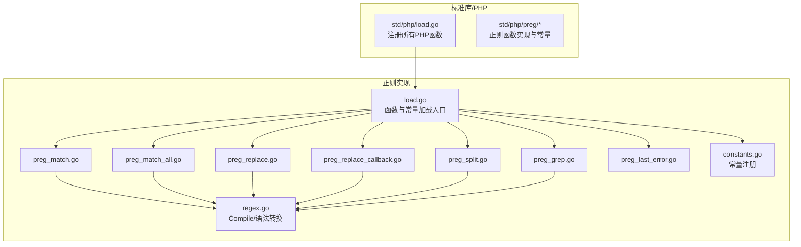
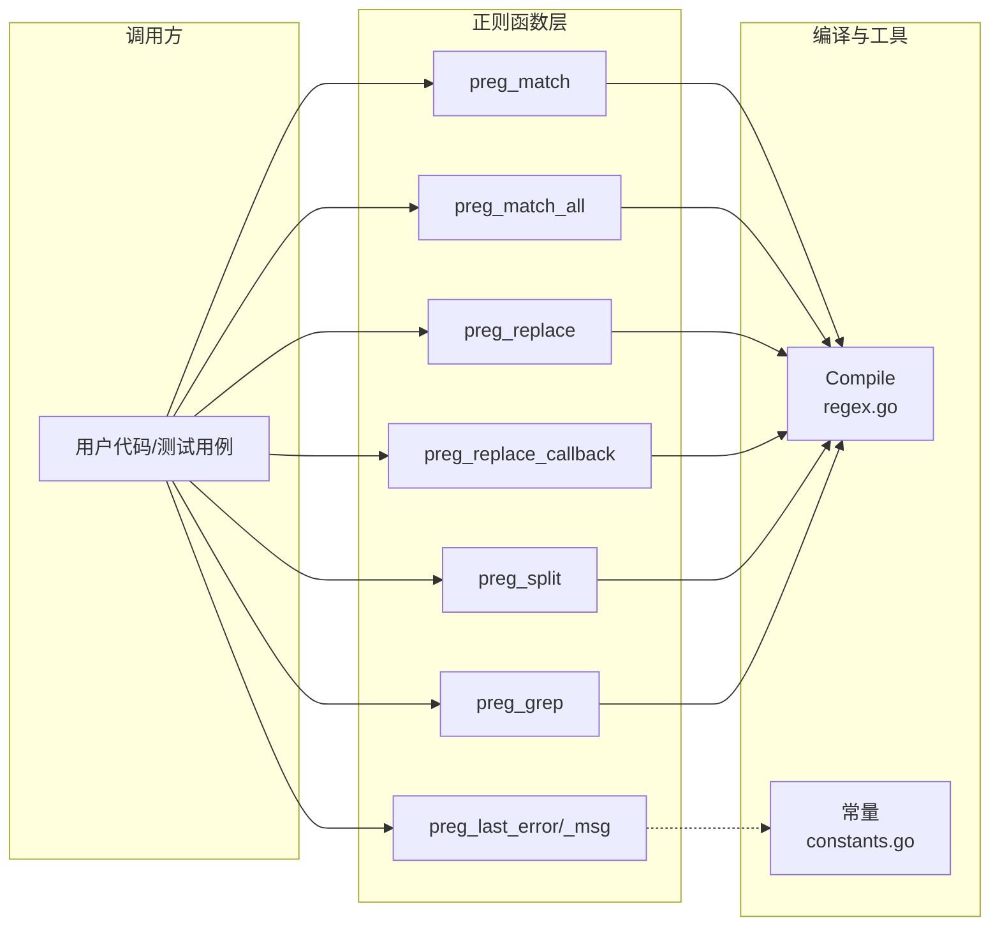
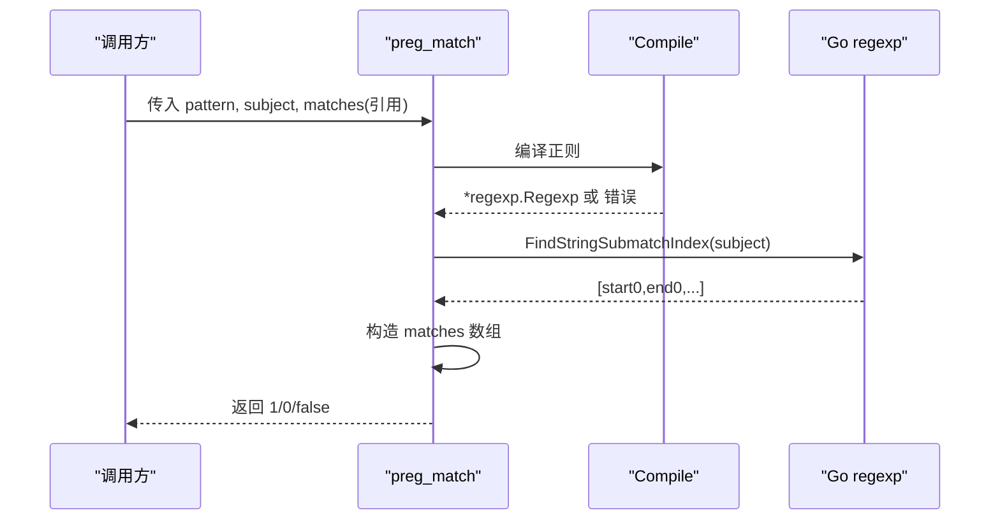
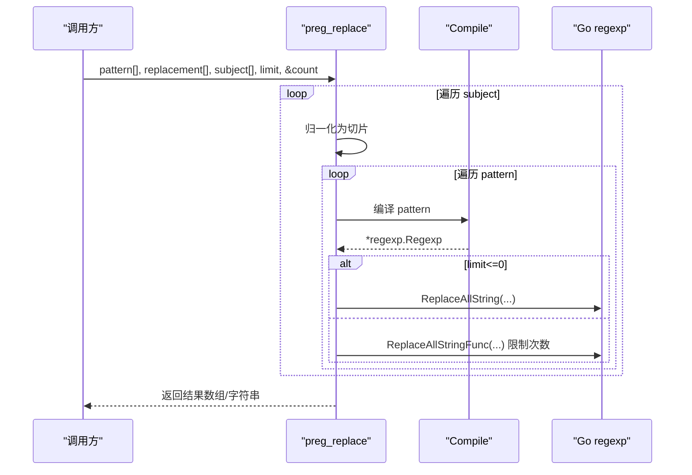
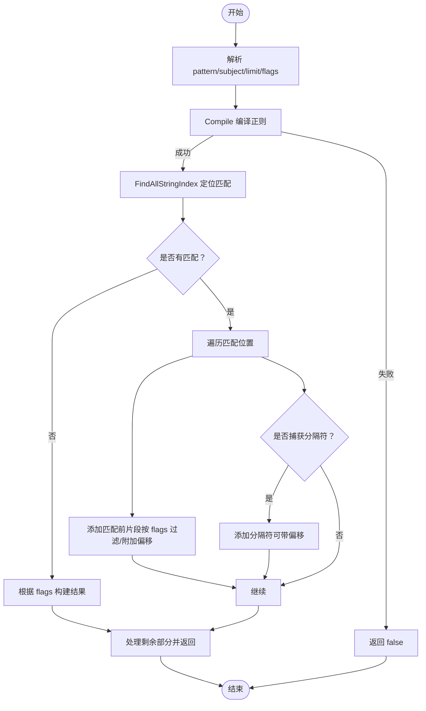
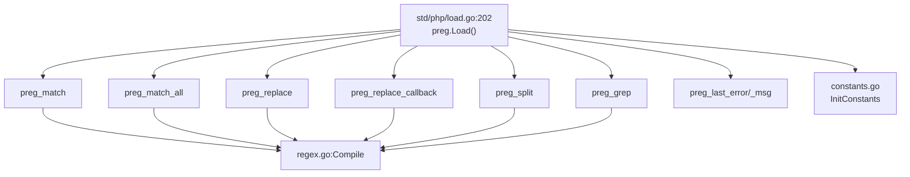

# 正则表达式函数

<cite>
**本文引用的文件**   
- [std/php/preg_match.go](file://std/php/preg_match.go)
- [std/php/preg/preg_match_all.go](file://std/php/preg/preg_match_all.go)
- [std/php/preg/preg_replace.go](file://std/php/preg/preg_replace.go)
- [std/php/preg/preg_replace_callback.go](file://std/php/preg/preg_replace_callback.go)
- [std/php/preg/preg_split.go](file://std/php/preg/preg_split.go)
- [std/php/preg/preg_grep.go](file://std/php/preg/preg_grep.go)
- [std/php/preg/preg_last_error.go](file://std/php/preg/preg_last_error.go)
- [std/php/preg/regex.go](file://std/php/preg/regex.go)
- [std/php/preg/constants.go](file://std/php/preg/constants.go)
- [std/php/preg/load.go](file://std/php/preg/load.go)
- [std/php/load.go](file://std/php/load.go)
- [tests/php/preg_match.zy](file://tests/php/preg_match.zy)
- [tests/php/preg_match_all.zy](file://tests/php/preg_match_all.zy)
- [tests/php/preg_replace.zy](file://tests/php/preg_replace.zy)
- [tests/php/preg_replace_callback.zy](file://tests/php/preg_replace_callback.zy)
- [tests/php/preg_grep_test.php](file://tests/php/preg_grep_test.php)
</cite>

## 目录
1. [简介](#简介)
2. [项目结构](#项目结构)
3. [核心组件](#核心组件)
4. [架构总览](#架构总览)
5. [详细组件分析](#详细组件分析)
6. [依赖分析](#依赖分析)
7. [性能考量](#性能考量)
8. [故障排查指南](#故障排查指南)
9. [结论](#结论)
10. [附录](#附录)

## 简介
本文件面向Origami运行时的PHP正则表达式函数模块，系统性梳理并解释以下函数的实现与使用方式：
- 匹配类：preg_match、preg_match_all
- 替换类：preg_replace、preg_replace_callback
- 分割类：preg_split
- 过滤类：preg_grep
- 错误处理类：preg_last_error、preg_last_error_msg

文档覆盖：
- 正则语法支持与转换（含占有量词、扩展模式/x、修饰符）
- 匹配模式与输出结构（含偏移捕获、顺序控制）
- 性能与兼容性说明（与PCRE/PHP行为对比）
- 实战示例与最佳实践
- 调试与测试方法

## 项目结构
正则表达式函数位于标准库的php/preg子包中，并由顶层加载器统一注册。

图表来源
- [std/php/load.go:19-212](file://std/php/load.go#L19-L212)
- [std/php/preg/load.go:8-20](file://std/php/preg/load.go#L8-L20)

章节来源
- [std/php/load.go:19-212](file://std/php/load.go#L19-L212)
- [std/php/preg/load.go:8-20](file://std/php/preg/load.go#L8-L20)

## 核心组件
- Compile与语法转换：负责将PHP风格的正则表达式转换为Go regexp可接受的形式，包括分隔符解析、修饰符转换、扩展模式处理、占有量词降级等。
- 匹配函数：preg_match、preg_match_all，支持偏移捕获与不同输出顺序。
- 替换函数：preg_replace、preg_replace_callback，支持数组输入/输出、limit控制、计数统计。
- 分割函数：preg_split，支持limit与多种flag。
- 过滤函数：preg_grep，支持反转匹配。
- 错误处理：preg_last_error、preg_last_error_msg，当前实现不跟踪状态，返回固定值。

章节来源
- [std/php/preg/regex.go:84-146](file://std/php/preg/regex.go#L84-L146)
- [std/php/preg/preg_match_all.go:8-180](file://std/php/preg/preg_match_all.go#L8-L180)
- [std/php/preg/preg_replace.go:8-172](file://std/php/preg/preg_replace.go#L8-L172)
- [std/php/preg/preg_replace_callback.go:10-230](file://std/php/preg/preg_replace_callback.go#L10-L230)
- [std/php/preg/preg_split.go:8-183](file://std/php/preg/preg_split.go#L8-L183)
- [std/php/preg/preg_grep.go:8-98](file://std/php/preg/preg_grep.go#L8-L98)
- [std/php/preg/preg_last_error.go:7-44](file://std/php/preg/preg_last_error.go#L7-L44)

## 架构总览
下图展示函数调用链与依赖关系，突出Compile作为统一入口的作用。

图表来源
- [std/php/preg_match.go:16-110](file://std/php/preg_match.go#L16-L110)
- [std/php/preg/preg_match_all.go:24-154](file://std/php/preg/preg_match_all.go#L24-L154)
- [std/php/preg/preg_replace.go:29-134](file://std/php/preg/preg_replace.go#L29-L134)
- [std/php/preg/preg_replace_callback.go:31-144](file://std/php/preg/preg_replace_callback.go#L31-L144)
- [std/php/preg/preg_split.go:19-159](file://std/php/preg/preg_split.go#L19-L159)
- [std/php/preg/preg_grep.go:24-76](file://std/php/preg/preg_grep.go#L24-L76)
- [std/php/preg/preg_last_error.go:16-36](file://std/php/preg/preg_last_error.go#L16-L36)
- [std/php/preg/regex.go:97-146](file://std/php/preg/regex.go#L97-L146)
- [std/php/preg/constants.go:8-31](file://std/php/preg/constants.go#L8-L31)

## 详细组件分析

### 匹配函数：preg_match 与 preg_match_all
- 功能要点
  - preg_match：返回是否匹配（1/0/false），可选输出完整匹配及分组的起止偏移（通过偏移捕获开关）。
  - preg_match_all：返回匹配次数，输出结构支持两种顺序：
    - PREG_PATTERN_ORDER：$matches[group][matchIndex]
    - PREG_SET_ORDER：$matches[matchIndex][group]
  - 支持偏移捕获（PREG_OFFSET_CAPTURE）与未匹配项作为null（PREG_UNMATCHED_AS_NULL）。
- 关键实现细节
  - 使用Compile统一处理PHP风格正则，含占有量词降级、扩展模式处理等。
  - 输出数组构造遵循PHP行为，未匹配分组在开启偏移捕获时返回["", 0]。
  - 当无匹配时，preg_match_all将$matches设为空数组并返回0。

图表来源
- [std/php/preg_match.go:16-110](file://std/php/preg_match.go#L16-L110)
- [std/php/preg/regex.go:97-146](file://std/php/preg/regex.go#L97-L146)

章节来源
- [std/php/preg_match.go:16-110](file://std/php/preg_match.go#L16-L110)
- [std/php/preg/preg_match_all.go:24-154](file://std/php/preg/preg_match_all.go#L24-L154)

### 替换函数：preg_replace 与 preg_replace_callback
- 功能要点
  - 支持pattern/replacement/subject为字符串或一维数组，按对应索引组合处理。
  - limit参数对每个pattern/subject独立生效；<=0表示不限制。
  - preg_replace_callback对每次匹配调用回调，回调参数为完整匹配构成的数组。
  - count引用参数统计总替换次数。
- 关键实现细节
  - Compile用于编译每个pattern；遇到编译错误直接返回false。
  - preg_replace内部使用ReplaceAllString或ReplaceAllStringFunc控制limit。
  - preg_replace_callback在回调失败时将控制流抛回VM，确保异常传播。

图表来源
- [std/php/preg/preg_replace.go:29-134](file://std/php/preg/preg_replace.go#L29-L134)
- [std/php/preg/regex.go:97-146](file://std/php/preg/regex.go#L97-L146)

章节来源
- [std/php/preg/preg_replace.go:29-134](file://std/php/preg/preg_replace.go#L29-L134)
- [std/php/preg/preg_replace_callback.go:31-144](file://std/php/preg/preg_replace_callback.go#L31-L144)

### 分割函数：preg_split
- 功能要点
  - 根据正则表达式分割字符串，支持limit与flags：
    - PREG_SPLIT_NO_EMPTY：过滤空串
    - PREG_SPLIT_DELIM_CAPTURE：将分隔符本身作为元素加入
    - PREG_SPLIT_OFFSET_CAPTURE：为每个元素附加其在原串中的起始偏移
- 关键实现细节
  - 使用FindAllStringIndex定位所有匹配位置，再线性拼接结果。
  - 当limit>0时，在达到限制前追加剩余部分。

图表来源
- [std/php/preg/preg_split.go:19-159](file://std/php/preg/preg_split.go#L19-L159)
- [std/php/preg/regex.go:97-146](file://std/php/preg/regex.go#L97-L146)

章节来源
- [std/php/preg/preg_split.go:19-159](file://std/php/preg/preg_split.go#L19-L159)

### 过滤函数：preg_grep
- 功能要点
  - 对数组元素按值进行匹配，返回满足条件的元素集合（索引从0重新排列）。
  - 支持PREG_GREP_INVERT反转匹配结果。
  - 输入非数组时返回false。
- 关键实现细节
  - 逐项将元素转为字符串后执行匹配，按flags决定保留与否。

章节来源
- [std/php/preg/preg_grep.go:24-76](file://std/php/preg/preg_grep.go#L24-L76)

### 错误处理：preg_last_error 与 preg_last_error_msg
- 功能要点
  - 当前实现不维护全局错误状态，始终返回PREG_NO_ERROR（0）与固定消息。
- 适用场景
  - 作为占位实现，便于与上层逻辑兼容；如需真实错误状态，可在VM层扩展。

章节来源
- [std/php/preg/preg_last_error.go:16-36](file://std/php/preg/preg_last_error.go#L16-L36)

## 依赖分析
- 函数注册
  - 顶层加载器在启动时调用preg.Load注册所有正则函数与常量。
- 语法转换依赖
  - 所有正则函数均依赖regex.Compile进行统一编译，后者负责：
    - 分隔符识别与修饰符解析
    - 占有量词降级（++/*+/?+/{n,m}+ → +/*/?/{n,n}/{n,}）
    - 扩展模式/x空白剥离（字符类外）
- 常量依赖
  - preg常量在preg.Load中集中注册，供各函数按flags使用。

图表来源
- [std/php/load.go:201-202](file://std/php/load.go#L201-L202)
- [std/php/preg/load.go:8-20](file://std/php/preg/load.go#L8-L20)
- [std/php/preg/regex.go:97-146](file://std/php/preg/regex.go#L97-L146)
- [std/php/preg/constants.go:8-31](file://std/php/preg/constants.go#L8-L31)

章节来源
- [std/php/load.go:201-202](file://std/php/load.go#L201-L202)
- [std/php/preg/load.go:8-20](file://std/php/preg/load.go#L8-L20)
- [std/php/preg/constants.go:8-31](file://std/php/preg/constants.go#L8-L31)

## 性能考量
- 语法转换成本
  - 占有量词降级与/x空白剥离为字符串扫描操作，复杂度与模式长度线性相关。
- 匹配与替换
  - preg_match/preg_match_all依赖Go regexp的FindStringSubmatchIndex/FindAllStringSubmatchIndex，时间复杂度与匹配数量成正比。
  - preg_replace在limit>0时使用ReplaceAllStringFunc，会多次回调以控制次数，注意回调开销。
- 内存与对象分配
  - 输出数组与临时字符串分配较多，建议在高频场景复用pattern与限制limit。
- 与PCRE/PHP的差异
  - 占有量词在Go中被降级为贪婪量词，行为在多数场景一致但在极端回溯情况下可能不同。
  - /x修饰符仅剥离空白，不支持行内注释，这与PHP严格行为略有差异。

[本节为通用性能讨论，无需列出具体文件来源]

## 故障排查指南
- 常见问题与定位
  - 编译失败：当pattern非法时，函数通常返回false或按约定行为处理。检查分隔符与修饰符是否正确。
  - 匹配不到预期：确认是否启用了多行/点号匹配等修饰符；检查是否使用了/x导致空白被剥离。
  - 偏移捕获与顺序：明确PREG_PATTERN_ORDER/PREG_SET_ORDER与PREG_OFFSET_CAPTURE的影响。
  - 回调异常：preg_replace_callback在回调抛出控制流时会向上抛出，检查回调逻辑与参数传递。
- 调试建议
  - 使用最小化pattern与subject快速定位问题。
  - 逐步启用修饰符与flags，观察输出变化。
  - 利用测试用例对比行为差异。

章节来源
- [std/php/preg/preg_replace_callback.go:31-144](file://std/php/preg/preg_replace_callback.go#L31-L144)
- [std/php/preg/preg_replace.go:29-134](file://std/php/preg/preg_replace.go#L29-L134)

## 结论
Origami的正则表达式函数模块以统一的Compile为核心，实现了对PHP风格正则的兼容与扩展，覆盖了匹配、替换、分割、过滤与错误处理的主要场景。通过常量注册与顶层加载机制，这些函数无缝集成到运行时环境中。在性能方面，建议关注修饰符与flags的合理使用，以及在高频场景下的内存与CPU开销控制。

[本节为总结性内容，无需列出具体文件来源]

## 附录

### 正则语法支持与转换要点
- 分隔符与修饰符
  - 支持以任意字符作为分隔符，修饰符包括i、m、s、x。
  - /x会剥离字符类外的空白，不处理注释。
- 占有意量词
  - ++、*+、?+、{n,n}+、{n,}+、{n,m}+均降级为+、*、?、{n}、{n,}、{n,m}。
- 转义规则
  - 分隔符可通过反斜杠转义；字符类内/外的转义行为遵循转换逻辑。

章节来源
- [std/php/preg/regex.go:84-193](file://std/php/preg/regex.go#L84-L193)

### 常用标志与常量
- preg_split：PREG_SPLIT_NO_EMPTY、PREG_SPLIT_DELIM_CAPTURE、PREG_SPLIT_OFFSET_CAPTURE
- preg_match_all：PREG_PATTERN_ORDER、PREG_SET_ORDER、PREG_OFFSET_CAPTURE、PREG_UNMATCHED_AS_NULL
- preg_grep：PREG_GREP_INVERT
- 错误码：PREG_NO_ERROR、PREG_INTERNAL_ERROR、PREG_BACKTRACK_LIMIT_ERROR、PREG_RECURSION_LIMIT_ERROR、PREG_BAD_UTF8_ERROR、PREG_BAD_UTF8_OFFSET_ERROR、PREG_JIT_STACKLIMIT_ERROR

章节来源
- [std/php/preg/constants.go:8-31](file://std/php/preg/constants.go#L8-L31)

### 实际使用示例（路径指引）
- preg_match
  - [tests/php/preg_match.zy](file://tests/php/preg_match.zy)
- preg_match_all
  - [tests/php/preg_match_all.zy](file://tests/php/preg_match_all.zy)
- preg_replace
  - [tests/php/preg_replace.zy](file://tests/php/preg_replace.zy)
- preg_replace_callback
  - [tests/php/preg_replace_callback.zy](file://tests/php/preg_replace_callback.zy)
- preg_grep
  - [tests/php/preg_grep_test.php](file://tests/php/preg_grep_test.php)

### 最佳实践与常见陷阱
- 最佳实践
  - 明确指定分隔符与修饰符，避免歧义。
  - 在高频替换中尽量减少pattern编译次数，优先使用预编译策略（若在上层封装）。
  - 使用limit限制替换次数，防止过度替换。
  - 在需要保留偏移信息时启用PREG_OFFSET_CAPTURE，便于后续处理。
- 常见陷阱
  - 忘记启用/m或/s导致多行/换行匹配不符合预期。
  - /x导致的空白剥离影响可读性与匹配结果。
  - 占有意量词在Go中降级为贪婪量词，极端回溯场景可能不同。

[本节为通用指导，无需列出具体文件来源]