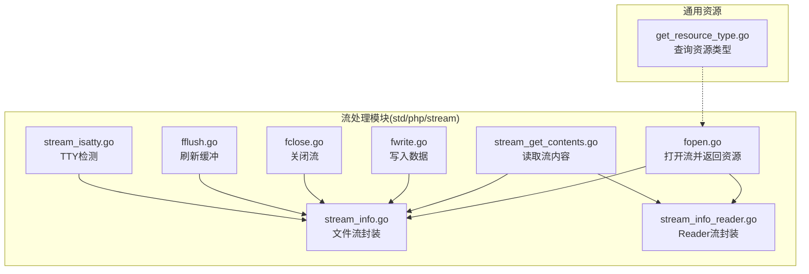
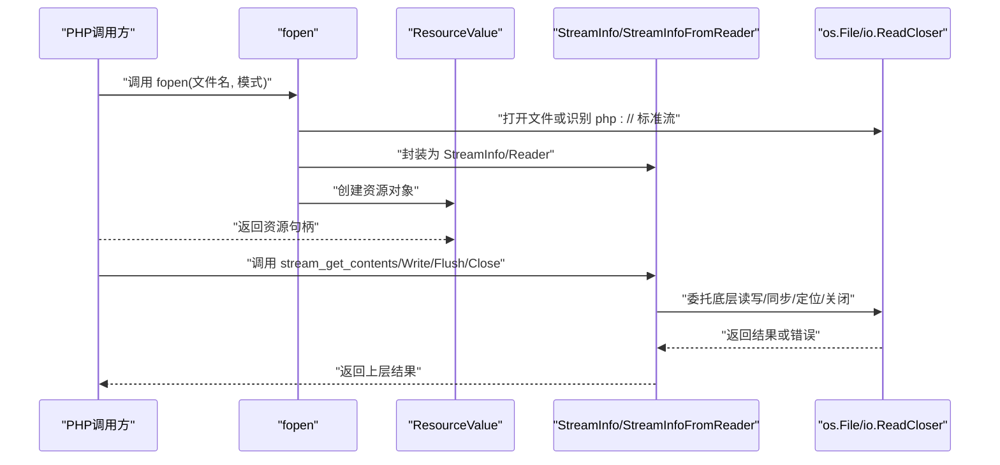
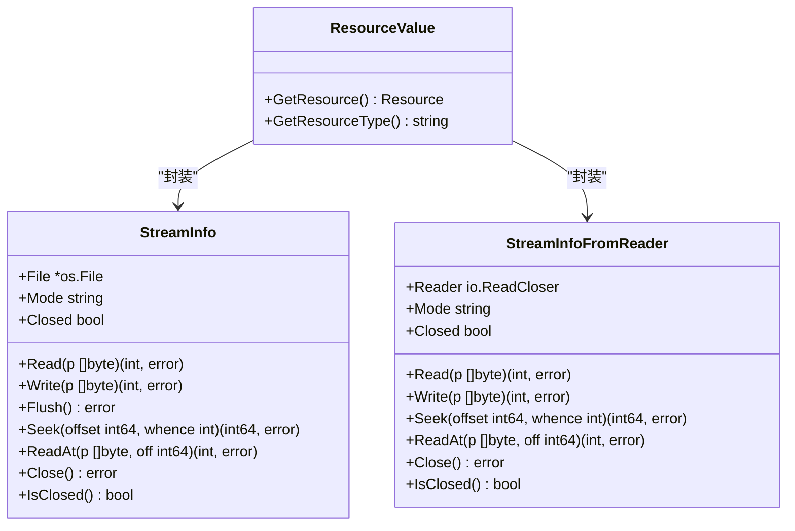
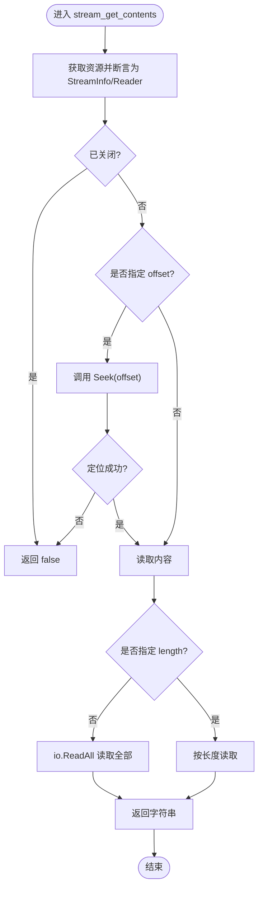
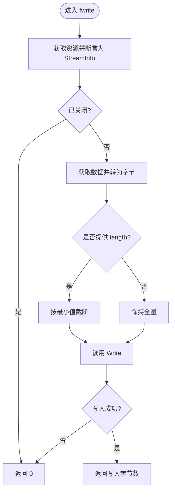
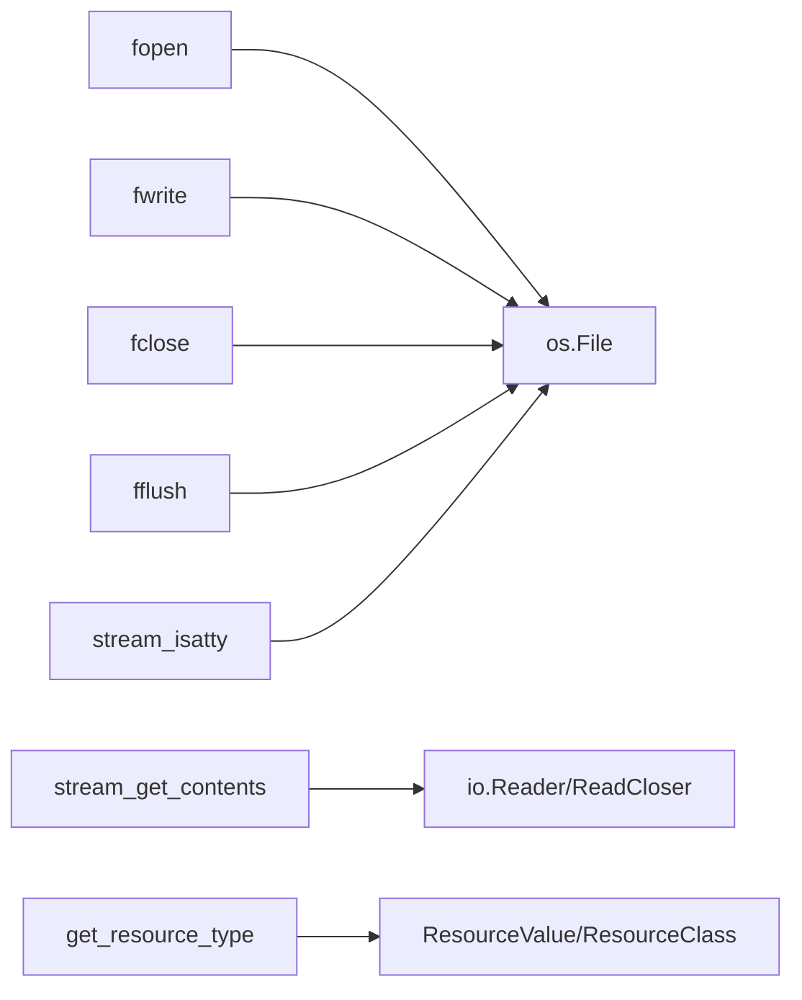

# 流处理函数

<cite>
**本文引用的文件**
- [fopen.go](file://std/php/stream/fopen.go)
- [fwrite.go](file://std/php/stream/fwrite.go)
- [fclose.go](file://std/php/stream/fclose.go)
- [fflush.go](file://std/php/stream/fflush.go)
- [stream_get_contents.go](file://std/php/stream/stream_get_contents.go)
- [stream_info.go](file://std/php/stream/stream_info.go)
- [stream_info_reader.go](file://std/php/stream/stream_info_reader.go)
- [stream_isatty.go](file://std/php/stream/stream_isatty.go)
- [get_resource_type.go](file://std/php/get_resource_type.go)
- [stream.zy](file://tests/php/stream.zy)
</cite>

## 目录
1. [简介](#简介)
2. [项目结构](#项目结构)
3. [核心组件](#核心组件)
4. [架构总览](#架构总览)
5. [详细组件分析](#详细组件分析)
6. [依赖分析](#依赖分析)
7. [性能考虑](#性能考虑)
8. [故障排查指南](#故障排查指南)
9. [结论](#结论)
10. [附录](#附录)

## 简介
本文件系统性梳理 Origami 对 PHP 流处理函数的支持与实现，覆盖文件流操作（fopen、fwrite、fread 由底层 Reader 接口替代、fclose、fflush）、流信息获取（stream_get_contents、stream_get_meta_data 由内部结构体字段映射体现）、流状态检查（feof 以 EOF 语义由 Read 返回值体现）、资源处理（get_resource_type）。文档还阐述流的生命周期管理、缓冲与同步机制、性能特征与最佳实践，并给出文件读写、网络通信与数据处理的应用示例与兼容性说明。

## 项目结构
与流处理相关的核心代码位于 std/php/stream 目录，围绕“资源封装 + 底层读写接口”的设计组织：
- 资源封装：fopen 打开后返回资源对象，内部持有 StreamInfo 或 StreamInfoFromReader
- 读写接口：统一通过 Read/Write/Flush/Seek 等方法访问底层文件或 Reader
- 辅助能力：stream_get_contents 读取内容；stream_isatty 判断 TTY；get_resource_type 查询资源类型

图表来源
- [fopen.go:1-175](file://std/php/stream/fopen.go#L1-L175)
- [stream_info.go:1-101](file://std/php/stream/stream_info.go#L1-L101)
- [stream_info_reader.go:1-75](file://std/php/stream/stream_info_reader.go#L1-L75)
- [stream_get_contents.go:1-154](file://std/php/stream/stream_get_contents.go#L1-L154)
- [fwrite.go:1-121](file://std/php/stream/fwrite.go#L1-L121)
- [fclose.go:1-60](file://std/php/stream/fclose.go#L1-L60)
- [fflush.go:1-62](file://std/php/stream/fflush.go#L1-L62)
- [stream_isatty.go:1-97](file://std/php/stream/stream_isatty.go#L1-L97)
- [get_resource_type.go:1-63](file://std/php/get_resource_type.go#L1-L63)

章节来源
- [fopen.go:1-175](file://std/php/stream/fopen.go#L1-L175)
- [stream_info.go:1-101](file://std/php/stream/stream_info.go#L1-L101)
- [stream_info_reader.go:1-75](file://std/php/stream/stream_info_reader.go#L1-L75)
- [stream_get_contents.go:1-154](file://std/php/stream/stream_get_contents.go#L1-L154)
- [fwrite.go:1-121](file://std/php/stream/fwrite.go#L1-L121)
- [fclose.go:1-60](file://std/php/stream/fclose.go#L1-L60)
- [fflush.go:1-62](file://std/php/stream/fflush.go#L1-L62)
- [stream_isatty.go:1-97](file://std/php/stream/stream_isatty.go#L1-L97)
- [get_resource_type.go:1-63](file://std/php/get_resource_type.go#L1-L63)

## 核心组件
- 资源与封装
  - 资源类型：stream
  - 资源值：ResourceValue，内部持有具体资源对象（StreamInfo 或 StreamInfoFromReader）
  - 资源类型查询：get_resource_type 返回 "stream" 或未知
- 流信息封装
  - StreamInfo：封装 *os.File，提供 Read/Write/Flush/Seek/ReadAt/Close/IsClosed
  - StreamInfoFromReader：封装 io.ReadCloser（如 proc_open 管道），提供 Read/Close，其余方法不支持
- 关键函数
  - fopen：解析模式，支持 php://stdin/stdout/stderr，返回资源
  - stream_get_contents：读取全部或指定长度内容，支持 offset 定位
  - fwrite：写入字节串，支持 length 截断
  - fclose：关闭流（标准流不真正关闭，仅标记）
  - fflush：刷新缓冲（调用底层 Sync）

章节来源
- [fopen.go:19-73](file://std/php/stream/fopen.go#L19-L73)
- [stream_info.go:9-101](file://std/php/stream/stream_info.go#L9-L101)
- [stream_info_reader.go:8-75](file://std/php/stream/stream_info_reader.go#L8-L75)
- [stream_get_contents.go:18-133](file://std/php/stream/stream_get_contents.go#L18-L133)
- [fwrite.go:19-99](file://std/php/stream/fwrite.go#L19-L99)
- [fclose.go:16-42](file://std/php/stream/fclose.go#L16-L42)
- [fflush.go:16-44](file://std/php/stream/fflush.go#L16-L44)
- [get_resource_type.go:17-46](file://std/php/get_resource_type.go#L17-L46)

## 架构总览
下图展示从 PHP 层到底层资源的调用链路与职责分工：

图表来源
- [fopen.go:19-73](file://std/php/stream/fopen.go#L19-L73)
- [stream_info.go:26-80](file://std/php/stream/stream_info.go#L26-L80)
- [stream_info_reader.go:26-59](file://std/php/stream/stream_info_reader.go#L26-L59)
- [stream_get_contents.go:18-133](file://std/php/stream/stream_get_contents.go#L18-L133)
- [fwrite.go:19-99](file://std/php/stream/fwrite.go#L19-L99)
- [fflush.go:16-44](file://std/php/stream/fflush.go#L16-L44)
- [fclose.go:16-42](file://std/php/stream/fclose.go#L16-L42)

## 详细组件分析

### 组件一：fopen 与资源生命周期
- 功能要点
  - 解析模式字符串，映射到 os.OpenFile 标志，支持 r/w/a/x/c 以及 + 组合
  - php://stdin/stdout/stderr 特殊处理，按只读/只写约束校验
  - 将 *os.File 封装为 StreamInfo，再包装为资源对象返回
  - 生命周期：资源持有 StreamInfo；fclose 标记关闭；标准流不真正关闭
- 数据结构关系

图表来源
- [stream_info.go:9-101](file://std/php/stream/stream_info.go#L9-L101)
- [stream_info_reader.go:8-75](file://std/php/stream/stream_info_reader.go#L8-L75)
- [fopen.go:63-72](file://std/php/stream/fopen.go#L63-L72)

章节来源
- [fopen.go:19-73](file://std/php/stream/fopen.go#L19-L73)
- [stream_info.go:26-43](file://std/php/stream/stream_info.go#L26-L43)
- [stream_info_reader.go:26-38](file://std/php/stream/stream_info_reader.go#L26-L38)

### 组件二：stream_get_contents 读取流程
- 功能要点
  - 支持从资源中提取 io.Reader 或 io.ReadCloser
  - 支持 length=-1（默认）读取全部，或指定长度
  - 支持 offset 定位（仅 StreamInfo 支持 Seek）
  - 遇到 EOF 正常返回，其他错误返回 false
- 流程图

图表来源
- [stream_get_contents.go:18-133](file://std/php/stream/stream_get_contents.go#L18-L133)

章节来源
- [stream_get_contents.go:18-133](file://std/php/stream/stream_get_contents.go#L18-L133)

### 组件三：fwrite 写入流程
- 功能要点
  - 从资源中取出 StreamInfo
  - 检查是否已关闭
  - 将数据转为字节切片，支持截断 length
  - 调用底层 Write 并返回写入字节数
- 流程图

图表来源
- [fwrite.go:19-99](file://std/php/stream/fwrite.go#L19-L99)

章节来源
- [fwrite.go:19-99](file://std/php/stream/fwrite.go#L19-L99)

### 组件四：fclose 与 fflush
- fclose
  - 从资源取出 StreamInfo
  - 调用 Close；标准流仅标记关闭
  - 成功返回 true，否则 false
- fflush
  - 从资源取出 StreamInfo
  - 若未关闭则调用 Flush（底层 Sync）
  - 成功返回 true，否则 false

章节来源
- [fclose.go:16-42](file://std/php/stream/fclose.go#L16-L42)
- [fflush.go:16-44](file://std/php/stream/fflush.go#L16-L44)

### 组件五：stream_isatty TTY 检测
- 逻辑
  - 断言资源为 StreamInfo
  - 通过底层文件 Stat() 判断是否为字符设备（TTY）
  - 标准流与常规文件区分处理
- 返回值
  - 是 TTY 返回 true，否则 false

章节来源
- [stream_isatty.go:20-79](file://std/php/stream/stream_isatty.go#L20-L79)

### 组件六：get_resource_type 资源类型查询
- 逻辑
  - 若为 ResourceValue 或实现 Resource 接口的 ClassValue，返回资源类型（如 "stream"）
  - 否则返回 "unknown"

章节来源
- [get_resource_type.go:17-46](file://std/php/get_resource_type.go#L17-L46)

## 依赖分析
- 模块内聚
  - stream 包内各函数围绕资源对象与底层读写接口协作，内聚度高
- 外部依赖
  - 标准库 os、io、sync
  - 运行时 core.ResourceValue/ResourceClass 提供资源抽象
- 耦合点
  - fopen 与 os.OpenFile 标志映射
  - stream_get_contents 对 io.Reader/ReadCloser 的多态适配
  - fclose 对标准流的特殊处理

图表来源
- [fopen.go:57-60](file://std/php/stream/fopen.go#L57-L60)
- [stream_get_contents.go:27-52](file://std/php/stream/stream_get_contents.go#L27-L52)
- [stream_info.go:52-80](file://std/php/stream/stream_info.go#L52-L80)
- [stream_isatty.go:57-64](file://std/php/stream/stream_isatty.go#L57-L64)
- [get_resource_type.go:24-43](file://std/php/get_resource_type.go#L24-L43)

章节来源
- [fopen.go:57-60](file://std/php/stream/fopen.go#L57-L60)
- [stream_get_contents.go:27-52](file://std/php/stream/stream_get_contents.go#L27-L52)
- [stream_info.go:52-80](file://std/php/stream/stream_info.go#L52-L80)
- [stream_isatty.go:57-64](file://std/php/stream/stream_isatty.go#L57-L64)
- [get_resource_type.go:24-43](file://std/php/get_resource_type.go#L24-L43)

## 性能考虑
- 缓冲与同步
  - Flush 通过底层 Sync 触发，适合需要立即使输出可见的场景（如 stdout）
  - 对于大量小写入，建议合并写入减少系统调用开销
- 读取策略
  - stream_get_contents 在未指定 length 时使用 io.ReadAll，可能阻塞至 EOF；对长管道需谨慎
  - 指定 length 可降低一次性内存占用
- 并发安全
  - StreamInfo/Reader 内部使用互斥锁保护状态与读写，避免竞态
- 标准流处理
  - 标准输入/输出/错误不真正关闭，避免影响宿主环境；注意资源泄漏检测仅基于标记

[本节为通用性能建议，无需特定文件来源]

## 故障排查指南
- fopen 返回 false
  - 检查文件名与模式合法性；php:// 流仅支持 stdin/stdout/stderr 且模式受限
- stream_get_contents 返回 false
  - 可能因流已关闭、offset 定位失败或底层读取错误
- fwrite 返回 0
  - 可能因流已关闭、数据为空或底层写入失败
- fclose/fflush 返回 false
  - 可能因资源无效、流已关闭或底层操作失败
- stream_isatty 返回 false
  - 可能为常规文件、管道或非字符设备；确认运行环境与重定向

章节来源
- [fopen.go:33-59](file://std/php/stream/fopen.go#L33-L59)
- [stream_get_contents.go:67-70](file://std/php/stream/stream_get_contents.go#L67-L70)
- [stream_get_contents.go:102-107](file://std/php/stream/stream_get_contents.go#L102-L107)
- [fwrite.go:45-48](file://std/php/stream/fwrite.go#L45-L48)
- [fflush.go:37-44](file://std/php/stream/fflush.go#L37-L44)
- [fclose.go:36-42](file://std/php/stream/fclose.go#L36-L42)
- [stream_isatty.go:45-79](file://std/php/stream/stream_isatty.go#L45-L79)

## 结论
Origami 的流处理模块以资源对象为核心，统一了文件与 Reader 管道的读写体验。通过 StreamInfo 与 StreamInfoFromReader 的分层封装，既满足本地文件的完整能力，又兼容外部进程管道等场景。配合 get_resource_type、stream_isatty 等辅助函数，开发者可在不同运行环境下进行稳健的流操作与诊断。

[本节为总结性内容，无需特定文件来源]

## 附录

### 实际应用示例（概念性说明）
- 文件读写
  - 使用 fopen 打开文件，stream_get_contents 读取全部内容，fwrite 写入数据，fflush 刷新输出，fclose 关闭
- 网络通信
  - 通过底层 Reader（如 TCP 连接）封装为流，使用 stream_get_contents 读取响应，fwrite 发送请求
- 数据处理
  - 对长文本采用指定 length 分段读取，避免一次性加载过大内容
- 大文件与网络 I/O
  - 使用 Seek/ReadAt（若可用）进行随机访问；对 stdout 等标准流使用 Flush 确保实时输出

[本节为概念性示例，无需特定文件来源]

### 与原生 PHP 的兼容性与差异
- 兼容点
  - 函数命名与基本行为一致（fopen/fwrite/fclose/fflush/stream_get_contents/stream_isatty）
  - 资源类型统一为 "stream"
- 差异点
  - fread 由底层 io.Reader.Read 替代，不单独实现独立函数
  - stream_get_meta_data 未直接实现，可通过资源持有的 StreamInfo 字段映射实现
  - php:// 包装器仅支持 stdin/stdout/stderr，且对模式有限制
  - 标准流不真正关闭，仅标记关闭，避免影响宿主进程

章节来源
- [fopen.go:110-156](file://std/php/stream/fopen.go#L110-L156)
- [stream_info.go:10-24](file://std/php/stream/stream_info.go#L10-L24)
- [stream_info_reader.go:10-24](file://std/php/stream/stream_info_reader.go#L10-L24)
- [stream_get_contents.go:32-52](file://std/php/stream/stream_get_contents.go#L32-L52)
- [get_resource_type.go:24-43](file://std/php/get_resource_type.go#L24-L43)

### 测试参考
- 测试脚本覆盖 fopen/fclose、stream_get_contents（全部/指定长度/指定偏移）、关闭后行为等关键路径

章节来源
- [stream.zy:1-71](file://tests/php/stream.zy#L1-L71)