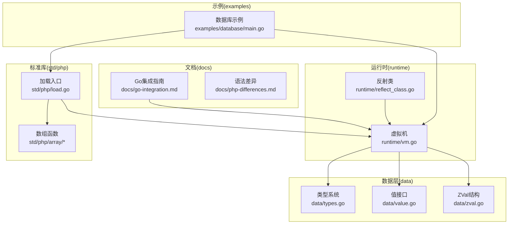
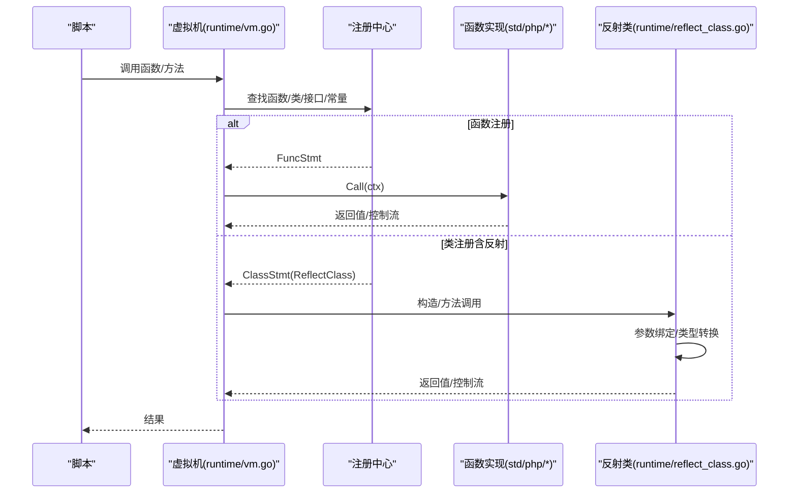
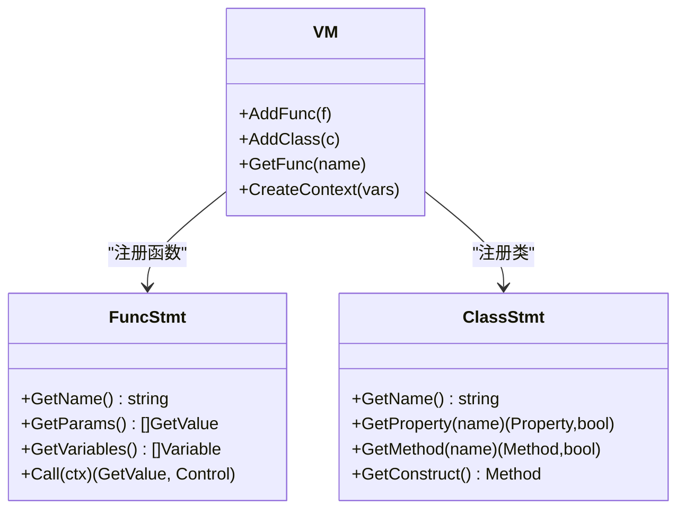
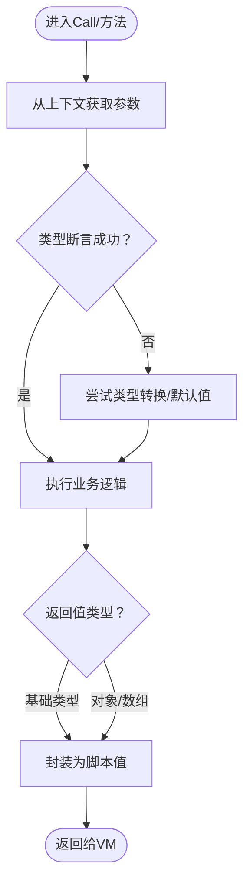
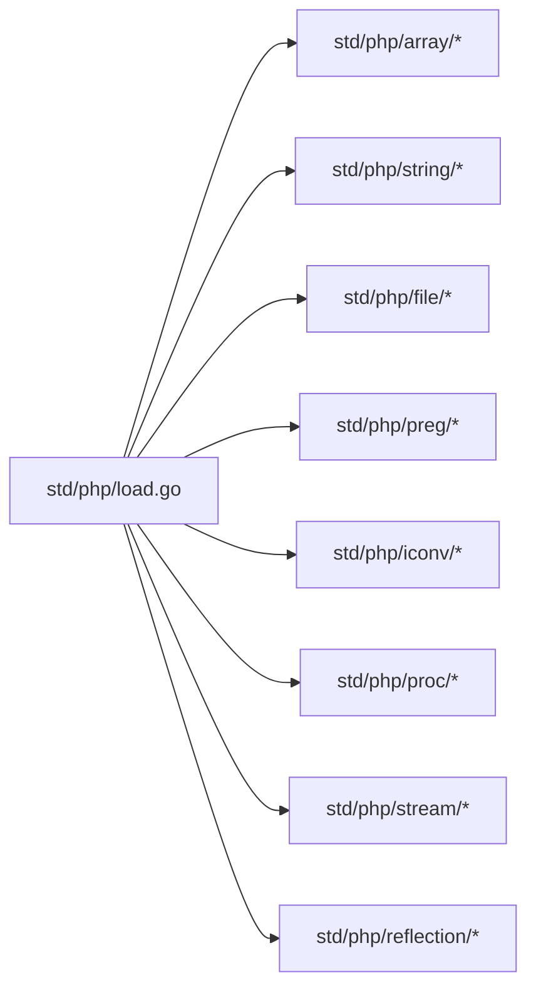
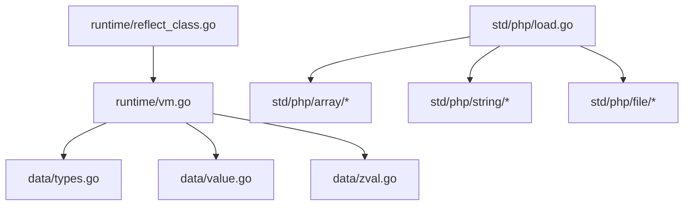

# PHP集成

<cite>
**本文引用的文件**
- [go集成指南.md](file://docs/go-integration.md)
- [php标准库加载入口.go](file://std/php/load.go)
- [虚拟机.go](file://runtime/vm.go)
- [数据类型与类型系统.go](file://data/types.go)
- [值接口与可调用值.go](file://data/value.go)
- [ZVal结构.go](file://data/zval.go)
- [反射类实现.go](file://runtime/reflect_class.go)
- [PHP语法差异.md](file://docs/php-differences.md)
- [数组合并函数实现.go](file://std/php/array/array_merge.go)
- [数据库示例主程序.go](file://examples/database/main.go)
</cite>

## 目录
1. [引言](#引言)
2. [项目结构](#项目结构)
3. [核心组件](#核心组件)
4. [架构总览](#架构总览)
5. [详细组件分析](#详细组件分析)
6. [依赖分析](#依赖分析)
7. [性能考虑](#性能考虑)
8. [故障排查指南](#故障排查指南)
9. [结论](#结论)
10. [附录](#附录)

## 引言
本文件面向希望在Origami中无缝集成Go函数与结构体，并实现PHP标准库函数、反射与兼容性迁移的工程师。内容涵盖：
- 如何将Go函数注册为脚本函数、将Go结构体注册为脚本类
- 自动类型转换机制、参数绑定与返回值处理
- PHP标准库函数的组织与实现（数组、字符串、文件系统等）
- 反射功能的实现原理与使用方式
- PHP兼容性差异、性能对比与迁移建议
- 实际集成示例与最佳实践

## 项目结构
围绕PHP集成的关键目录与文件：
- docs：语言与集成指南文档
- runtime：虚拟机与反射类实现
- std/php：PHP标准库函数与类的注册入口
- data：类型系统、值接口与ZVal
- examples：数据库等集成示例



**图示来源**
- [虚拟机.go:14-391](file://runtime/vm.go#L14-L391)
- [反射类实现.go:12-524](file://runtime/reflect_class.go#L12-L524)
- [php标准库加载入口.go:19-212](file://std/php/load.go#L19-L212)
- [数据类型与类型系统.go:5-262](file://data/types.go#L5-L262)
- [值接口与可调用值.go:3-39](file://data/value.go#L3-L39)
- [ZVal结构.go:3-18](file://data/zval.go#L3-L18)
- [go集成指南.md:1-643](file://docs/go-integration.md#L1-L643)
- [PHP语法差异.md:1-17](file://docs/php-differences.md#L1-L17)
- [数据库示例主程序.go:15-40](file://examples/database/main.go#L15-L40)

**章节来源**
- [go集成指南.md:1-643](file://docs/go-integration.md#L1-L643)
- [php标准库加载入口.go:19-212](file://std/php/load.go#L19-L212)
- [虚拟机.go:14-391](file://runtime/vm.go#L14-L391)
- [数据类型与类型系统.go:5-262](file://data/types.go#L5-L262)
- [值接口与可调用值.go:3-39](file://data/value.go#L3-L39)
- [ZVal结构.go:3-18](file://data/zval.go#L3-L18)
- [反射类实现.go:12-524](file://runtime/reflect_class.go#L12-L524)
- [PHP语法差异.md:1-17](file://docs/php-differences.md#L1-L17)
- [数组合并函数实现.go:10-108](file://std/php/array/array_merge.go#L10-L108)
- [数据库示例主程序.go:15-40](file://examples/database/main.go#L15-L40)

## 核心组件
- 虚拟机（VM）：负责函数、类、接口、常量与全局变量的注册与查找，提供上下文创建与脚本执行入口。
- 类型系统（Types）：支持基础类型、联合类型、可空类型、泛型与闭包类型等，支撑类型检查与自动转换。
- 值接口（Value/CallableValue）：统一脚本值抽象，支持字符串化、可调用与属性/方法访问。
- ZVal：模拟PHP的zval，承载任意值并参与变量生命周期管理。
- 反射类（ReflectClass）：将Go结构体与方法暴露为脚本类，实现自动参数绑定与返回值转换。
- PHP标准库（std/php）：集中注册PHP内置函数、类与常量，按子包组织数组、字符串、文件系统、正则等。

**章节来源**
- [虚拟机.go:118-273](file://runtime/vm.go#L118-L273)
- [数据类型与类型系统.go:142-262](file://data/types.go#L142-L262)
- [值接口与可调用值.go:3-39](file://data/value.go#L3-L39)
- [ZVal结构.go:3-18](file://data/zval.go#L3-L18)
- [反射类实现.go:12-136](file://runtime/reflect_class.go#L12-L136)
- [php标准库加载入口.go:19-212](file://std/php/load.go#L19-L212)

## 架构总览
下图展示了从脚本调用到Go函数/结构体执行的整体流程，以及PHP标准库的注册路径。



**图示来源**
- [虚拟机.go:245-289](file://runtime/vm.go#L245-L289)
- [php标准库加载入口.go:19-212](file://std/php/load.go#L19-L212)
- [反射类实现.go:231-274](file://runtime/reflect_class.go#L231-L274)

## 详细组件分析

### 1) Go函数与结构体集成
- 函数集成
  - 通过实现函数接口（如GetName、GetParams、GetVariables、Call）将Go函数注册到VM。
  - Call中从上下文获取参数，进行类型断言与转换，返回脚本可识别的值。
  - 示例参考：[Go集成指南.md:16-110](file://docs/go-integration.md#L16-L110)。
- 结构体集成
  - 通过实现类接口（类名、属性、方法、构造函数）将Go结构体注册为脚本类。
  - 属性与方法需返回脚本侧可识别的值/方法对象。
  - 示例参考：[Go集成指南.md:112-246](file://docs/go-integration.md#L112-L246)。
- 注册到VM
  - 在main中创建VM、加载标准库与PHP库，然后AddFunc/AddClass完成注册。
  - 示例参考：[Go集成指南.md:248-278](file://docs/go-integration.md#L248-L278)。



**图示来源**
- [虚拟机.go:245-273](file://runtime/vm.go#L245-L273)
- [Go集成指南.md:16-110](file://docs/go-integration.md#L16-L110)

**章节来源**
- [go集成指南.md:16-110](file://docs/go-integration.md#L16-L110)
- [虚拟机.go:245-273](file://runtime/vm.go#L245-L273)

### 2) 自动类型转换机制、参数绑定与返回值处理
- 类型系统
  - 支持基础类型、联合类型、可空类型、泛型与闭包类型，用于类型检查与推导。
  - 参考：[数据类型与类型系统.go:142-262](file://data/types.go#L142-L262)。
- 值接口
  - Value统一字符串化；CallableValue支持调用；GetProperty/SetProperty支持属性访问。
  - 参考：[值接口与可调用值.go:3-39](file://data/value.go#L3-L39)。
- ZVal
  - 作为变量容器，承载任意值并参与全局变量表管理。
  - 参考：[ZVal结构.go:3-18](file://data/zval.go#L3-L18)。
- 参数绑定与返回值
  - 函数/方法实现从上下文读取参数，使用AsXxx接口进行类型转换，返回脚本侧可识别值。
  - 参考：[Go集成指南.md:487-509](file://docs/go-integration.md#L487-L509)。



**图示来源**
- [值接口与可调用值.go:3-39](file://data/value.go#L3-L39)
- [数据类型与类型系统.go:142-262](file://data/types.go#L142-L262)
- [Go集成指南.md:487-509](file://docs/go-integration.md#L487-L509)

**章节来源**
- [数据类型与类型系统.go:142-262](file://data/types.go#L142-L262)
- [值接口与可调用值.go:3-39](file://data/value.go#L3-L39)
- [ZVal结构.go:3-18](file://data/zval.go#L3-L18)
- [go集成指南.md:487-509](file://docs/go-integration.md#L487-L509)

### 3) PHP标准库函数实现与组织
- 加载入口
  - 通过Load(vm)集中注册大量PHP函数、类、接口与常量，并初始化默认常量。
  - 参考：[php标准库加载入口.go:19-212](file://std/php/load.go#L19-L212)。
- 子模块组织
  - 数组、字符串、文件、正则、国际化、进程、流等子包分别实现对应函数。
  - 示例：数组合并函数array_merge的实现。
  - 参考：[数组合并函数实现.go:10-108](file://std/php/array/array_merge.go#L10-L108)。
- 常量与默认定义
  - 初始化目录分隔符、排序标志、错误级别、版本信息、整数/浮点范围等常量。
  - 参考：[php标准库加载入口.go:214-293](file://std/php/load.go#L214-L293)。



**图示来源**
- [php标准库加载入口.go:19-212](file://std/php/load.go#L19-L212)

**章节来源**
- [php标准库加载入口.go:19-212](file://std/php/load.go#L19-L212)
- [数组合并函数实现.go:10-108](file://std/php/array/array_merge.go#L10-L108)

### 4) 反射功能实现
- 反射类（ReflectClass）
  - 将Go结构体与方法暴露为脚本类，支持构造函数、方法调用与属性访问。
  - 自动分析公开字段作为参数名，进行参数绑定与返回值转换。
  - 参考：[反射类实现.go:12-136](file://runtime/reflect_class.go#L12-L136)。
- 方法与构造函数
  - ReflectMethod：根据反射类型信息进行参数脚本值到Go值的转换，再调用Go方法并将返回值转换回脚本值。
  - ReflectConstructor：按结构体字段设置实例属性。
  - 参考：[反射类实现.go:231-274](file://runtime/reflect_class.go#L231-L274)、[反射类实现.go:424-448](file://runtime/reflect_class.go#L424-L448)。
- 注册反射类
  - 通过VM.RegisterReflectClass(name, instance)完成注册。
  - 参考：[反射类实现.go:519-523](file://runtime/reflect_class.go#L519-L523)。

```mermaid
classDiagram
class ReflectClass {
    -name: string
    -instanceType: reflect.Type
    -methods: map[string]Method
    -properties: map[string]Property
    +GetValue(ctx): (GetValue, Control)
    +GetMethod(name): (Method, bool)
    +GetConstruct(): Method
}
class ReflectMethod {
    -name: string
    -method: reflect.Method
    -instance: interface{}
    +Call(ctx): (GetValue, Control)
    -convertToGoValue(...)
    -convertToScriptValue(...)
}
class ReflectConstructor {
    -className: string
    -instanceType: reflect.Type
    +Call(ctx): (GetValue, Control)
}
ReflectClass --> ReflectMethod : "持有"
ReflectClass --> ReflectConstructor : "持有"
```

**图示来源**
- [反射类实现.go:12-136](file://runtime/reflect_class.go#L12-L136)
- [反射类实现.go:231-274](file://runtime/reflect_class.go#L231-L274)
- [反射类实现.go:424-448](file://runtime/reflect_class.go#L424-L448)

**章节来源**
- [反射类实现.go:12-136](file://runtime/reflect_class.go#L12-L136)
- [反射类实现.go:231-274](file://runtime/reflect_class.go#L231-L274)
- [反射类实现.go:424-448](file://runtime/reflect_class.go#L424-L448)
- [反射类实现.go:519-523](file://runtime/reflect_class.go#L519-L523)

### 5) PHP兼容性说明
- 语法差异
  - 运算符与访问符、数组/对象语法、注解与宏注解、变量声明等存在差异。
  - 参考：[PHP语法差异.md:5-17](file://docs/php-differences.md#L5-L17)。
- 性能对比
  - 关键路径使用Go实现，结合脚本侧的类型系统与ZVal管理，兼顾易用性与性能。
  - 参考：[go集成指南.md:628-642](file://docs/go-integration.md#L628-L642)。
- 迁移指南
  - 将现有PHP逻辑拆分为“脚本层（Origami）+ Go扩展层”，优先将热点路径迁移到Go。
  - 使用VM.SetExceptionHandler与异常处理回调，确保错误可控。
  - 参考：[虚拟机.go:73-116](file://runtime/vm.go#L73-L116)、[go集成指南.md:573-624](file://docs/go-integration.md#L573-L624)。

**章节来源**
- [PHP语法差异.md:5-17](file://docs/php-differences.md#L5-L17)
- [go集成指南.md:628-642](file://docs/go-integration.md#L628-L642)
- [虚拟机.go:73-116](file://runtime/vm.go#L73-L116)

### 6) 实际集成示例与最佳实践
- 示例：数据库扩展示例
  - 在main中创建VM、加载标准库与PHP库，运行database.zy脚本。
  - 参考：[数据库示例主程序.go:15-40](file://examples/database/main.go#L15-L40)。
- 最佳实践
  - 错误处理：使用defer recover与日志记录，避免panic传播。
  - 类型安全：对参数进行显式类型断言与默认值处理。
  - 性能优化：缓存常用值、避免重复计算。
  - 参考：[go集成指南.md:466-532](file://docs/go-integration.md#L466-L532)。

**章节来源**
- [数据库示例主程序.go:15-40](file://examples/database/main.go#L15-L40)
- [go集成指南.md:466-532](file://docs/go-integration.md#L466-L532)

## 依赖分析
- VM对注册中心（函数/类/接口/常量）的依赖，以及对类型系统与值接口的依赖。
- PHP标准库通过load.go集中注册，按子包组织，降低耦合度。
- 反射类依赖Go的reflect包，将Go类型信息映射到脚本侧。



**图示来源**
- [虚拟机.go:14-391](file://runtime/vm.go#L14-L391)
- [php标准库加载入口.go:19-212](file://std/php/load.go#L19-L212)
- [数据类型与类型系统.go:5-262](file://data/types.go#L5-L262)
- [值接口与可调用值.go:3-39](file://data/value.go#L3-L39)
- [ZVal结构.go:3-18](file://data/zval.go#L3-L18)
- [反射类实现.go:12-524](file://runtime/reflect_class.go#L12-L524)

**章节来源**
- [虚拟机.go:14-391](file://runtime/vm.go#L14-L391)
- [php标准库加载入口.go:19-212](file://std/php/load.go#L19-L212)
- [数据类型与类型系统.go:5-262](file://data/types.go#L5-L262)
- [值接口与可调用值.go:3-39](file://data/value.go#L3-L39)
- [ZVal结构.go:3-18](file://data/zval.go#L3-L18)
- [反射类实现.go:12-524](file://runtime/reflect_class.go#L12-L524)

## 性能考虑
- 关键路径使用Go实现，减少解释执行开销。
- 合理使用ZVal与上下文变量，避免频繁分配。
- 对热点函数进行缓存与类型预检查，减少运行时转换成本。
- 参考：[go集成指南.md:512-532](file://docs/go-integration.md#L512-L532)。

## 故障排查指南
- 类型转换失败
  - 使用类型断言与默认值策略，必要时记录参数详情。
  - 参考：[go集成指南.md:575-600](file://docs/go-integration.md#L575-L600)。
- 内存泄漏
  - 及时清理资源，避免长生命周期持有大对象。
  - 参考：[go集成指南.md:602-624](file://docs/go-integration.md#L602-L624)。
- 异常处理
  - 使用VM.SetExceptionHandler注册回调，避免异常穿透。
  - 参考：[虚拟机.go:73-116](file://runtime/vm.go#L73-L116)。

**章节来源**
- [go集成指南.md:575-600](file://docs/go-integration.md#L575-L600)
- [go集成指南.md:602-624](file://docs/go-integration.md#L602-L624)
- [虚拟机.go:73-116](file://runtime/vm.go#L73-L116)

## 结论
通过VM注册机制、类型系统与ZVal抽象、PHP标准库的模块化组织以及反射类的自动绑定，Origami实现了对Go函数与结构体的无缝集成，并提供了丰富的PHP标准库能力。配合严格的类型转换、异常处理与性能优化实践，可在保持开发效率的同时获得接近原生的执行性能。

## 附录
- 快速上手
  - 在main中创建VM并加载std/php/system，随后AddFunc/AddClass注册自定义扩展。
  - 参考：[Go集成指南.md:248-278](file://docs/go-integration.md#L248-L278)、[数据库示例主程序.go:15-40](file://examples/database/main.go#L15-L40)。
- 常用场景
  - HTTP客户端、数据库访问、文件系统操作、字符串与数组处理等，均可通过Go扩展+标准库组合实现。
  - 参考：[Go集成指南.md:280-462](file://docs/go-integration.md#L280-L462)、[php标准库加载入口.go:19-212](file://std/php/load.go#L19-L212)。