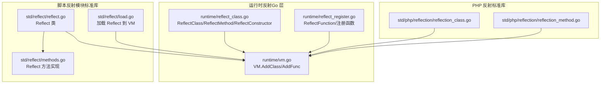
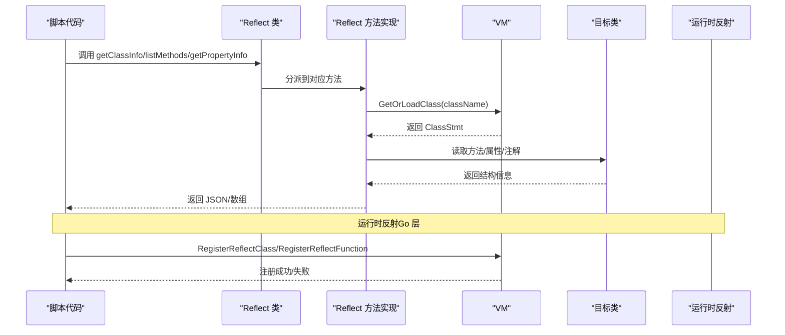
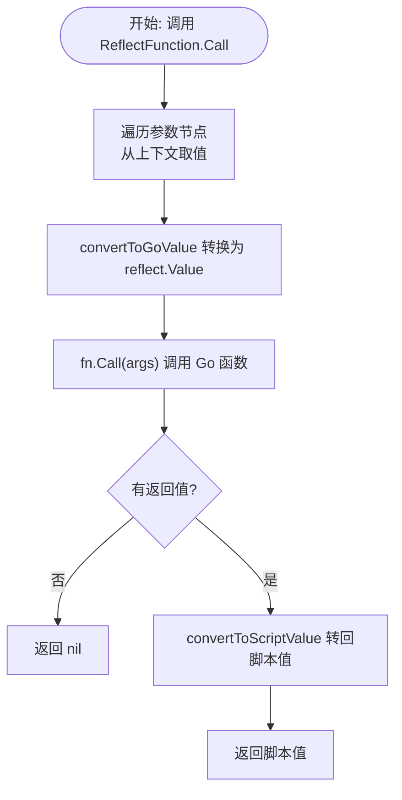
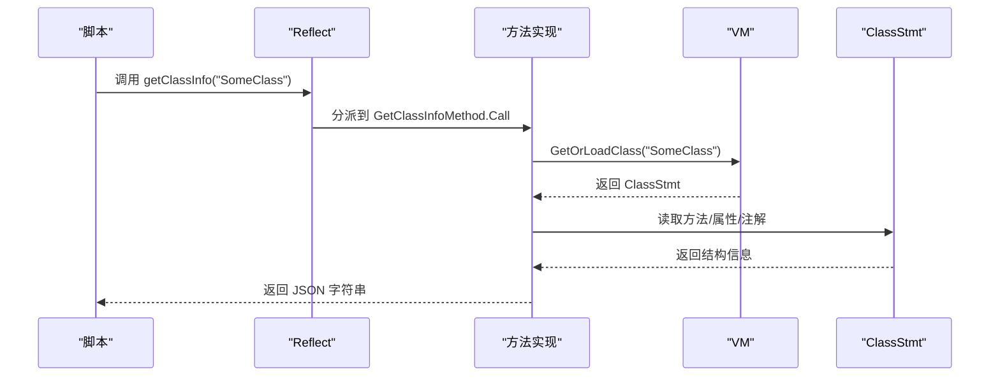
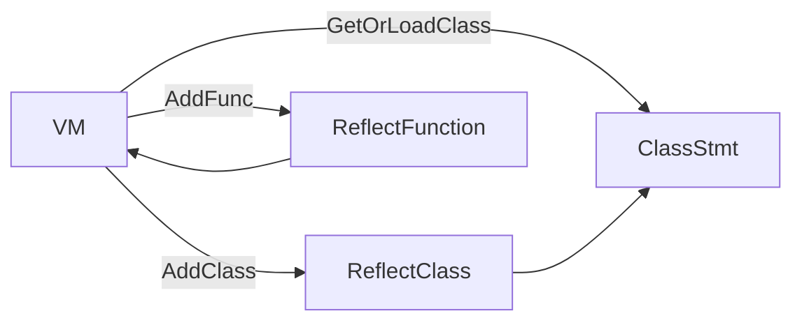

# 反射支持

<cite>
**本文引用的文件**
- [runtime/reflect_class.go](file://runtime/reflect_class.go)
- [runtime/reflect_register.go](file://runtime/reflect_register.go)
- [std/reflect/reflect.go](file://std/reflect/reflect.go)
- [std/reflect/methods.go](file://std/reflect/methods.go)
- [std/reflect/load.go](file://std/reflect/load.go)
- [runtime/vm.go](file://runtime/vm.go)
- [docs/reflection.md](file://docs/reflection.md)
- [docs/reflection-annotations.md](file://docs/reflection-annotations.md)
- [tests/php/reflection.zy](file://tests/php/reflection.zy)
- [tests/php/reflection_get_attributes.zy](file://tests/php/reflection_get_attributes.zy)
- [std/php/reflection/reflection_class.go](file://std/php/reflection/reflection_class.go)
- [std/php/reflection/reflection_method.go](file://std/php/reflection/reflection_method.go)
</cite>

## 目录
1. [简介](#简介)
2. [项目结构](#项目结构)
3. [核心组件](#核心组件)
4. [架构总览](#架构总览)
5. [详细组件分析](#详细组件分析)
6. [依赖分析](#依赖分析)
7. [性能考量](#性能考量)
8. [故障排查指南](#故障排查指南)
9. [结论](#结论)
10. [附录](#附录)

## 简介
本文件系统性阐述 Origami 中的反射支持，覆盖两类反射能力：
- 脚本反射模块（Reflect 类），用于在脚本层动态查询类、方法、属性及注解信息。
- 运行时反射（Go 层），用于将任意 Go 结构体或函数注册为脚本类或函数，从而在脚本中以统一方式调用。

文档重点包括：
- 类信息获取、方法调用、属性访问的实现原理与使用方法
- Reflection 类族（Reflect、ReflectionClass、ReflectionMethod 等）的职责与交互
- 反射与直接调用的性能差异与适用场景
- 反射功能的限制与注意事项

## 项目结构
与反射相关的核心目录与文件如下：
- 运行时反射（Go 层）
  - runtime/reflect_class.go：封装反射类、方法、构造函数，负责将 Go 实例暴露为脚本类
  - runtime/reflect_register.go：将 Go 函数注册为脚本函数，支持参数与返回值类型转换
  - runtime/vm.go：虚拟机管理类与函数注册入口
- 脚本反射模块（标准库）
  - std/reflect/reflect.go：Reflect 类定义与方法映射
  - std/reflect/methods.go：Reflect 类各方法的具体实现（如 getClassInfo、listMethods 等）
  - std/reflect/load.go：将 Reflect 类加载到 VM
- PHP 反射标准库（兼容 PHP 语义）
  - std/php/reflection/reflection_class.go：ReflectionClass 类定义与方法映射
  - std/php/reflection/reflection_method.go：ReflectionMethod 类定义与方法映射
- 文档与测试
  - docs/reflection.md：脚本反射模块使用说明
  - docs/reflection-annotations.md：反射与注解系统说明
  - tests/php/reflection.zy：PHP 风格反射（ReflectionClass/ReflectionMethod）测试
  - tests/php/reflection_get_attributes.zy：getAttributes 测试



图表来源
- [runtime/reflect_class.go:1-524](file://runtime/reflect_class.go#L1-L524)
- [runtime/reflect_register.go:1-200](file://runtime/reflect_register.go#L1-L200)
- [runtime/vm.go:118-130](file://runtime/vm.go#L118-L130)
- [std/reflect/reflect.go:1-93](file://std/reflect/reflect.go#L1-L93)
- [std/reflect/methods.go:1-876](file://std/reflect/methods.go#L1-L876)
- [std/reflect/load.go:1-11](file://std/reflect/load.go#L1-L11)
- [std/php/reflection/reflection_class.go:1-120](file://std/php/reflection/reflection_class.go#L1-L120)
- [std/php/reflection/reflection_method.go:1-179](file://std/php/reflection/reflection_method.go#L1-L179)

章节来源
- [runtime/reflect_class.go:1-524](file://runtime/reflect_class.go#L1-L524)
- [runtime/reflect_register.go:1-200](file://runtime/reflect_register.go#L1-L200)
- [runtime/vm.go:118-130](file://runtime/vm.go#L118-L130)
- [std/reflect/reflect.go:1-93](file://std/reflect/reflect.go#L1-L93)
- [std/reflect/methods.go:1-876](file://std/reflect/methods.go#L1-L876)
- [std/reflect/load.go:1-11](file://std/reflect/load.go#L1-L11)
- [std/php/reflection/reflection_class.go:1-120](file://std/php/reflection/reflection_class.go#L1-L120)
- [std/php/reflection/reflection_method.go:1-179](file://std/php/reflection/reflection_method.go#L1-L179)

## 核心组件
- 运行时反射类（ReflectClass）
  - 作用：将任意 Go 实例包装为脚本类，暴露其公开方法与字段，支持按需分析方法与构造函数
  - 关键点：实例类型分析、方法过滤（仅公开方法）、参数/返回值类型转换
- 运行时反射函数（ReflectFunction）
  - 作用：将任意 Go 函数包装为脚本函数，支持参数与返回值类型转换
- VM 注册接口
  - AddClass/AddFunc：向 VM 注册反射类或函数，供脚本调用
- 脚本反射模块（Reflect）
  - 作用：在脚本层提供类/方法/属性/注解的查询能力，返回 JSON 字符串或数组
- PHP 反射标准库（ReflectionClass/ReflectionMethod）
  - 作用：提供与 PHP 语义一致的反射 API，便于迁移与兼容

章节来源
- [runtime/reflect_class.go:21-131](file://runtime/reflect_class.go#L21-L131)
- [runtime/reflect_register.go:21-105](file://runtime/reflect_register.go#L21-L105)
- [runtime/vm.go:118-130](file://runtime/vm.go#L118-L130)
- [std/reflect/reflect.go:18-92](file://std/reflect/reflect.go#L18-L92)
- [std/php/reflection/reflection_class.go:9-120](file://std/php/reflection/reflection_class.go#L9-L120)
- [std/php/reflection/reflection_method.go:10-179](file://std/php/reflection/reflection_method.go#L10-L179)

## 架构总览
下图展示了脚本反射模块与运行时反射之间的协作关系，以及 VM 的注册与调用路径。



图表来源
- [std/reflect/methods.go:42-92](file://std/reflect/methods.go#L42-L92)
- [runtime/vm.go:162-181](file://runtime/vm.go#L162-L181)
- [runtime/reflect_class.go:520-524](file://runtime/reflect_class.go#L520-L524)
- [runtime/reflect_register.go:181-189](file://runtime/reflect_register.go#L181-L189)

## 详细组件分析

### 运行时反射类（ReflectClass）
- 设计要点
  - 通过 NewReflectClass 接收实例，提取类型并延迟分析方法
  - analyzeMethods 仅收集公开方法，使用 isPublicMethod 判断
  - ReflectMethod/ReflectConstructor 负责参数与返回值的脚本/Go 类型转换
  - GetValue 每次返回新实例，避免状态污染
- 关键流程（方法调用）
  - 从上下文获取参数值
  - convertToGoValue 将脚本值转换为 reflect.Value
  - reflect.Method.Func.Call 调用 Go 方法
  - convertToScriptValue 将返回值转回脚本值

```mermaid
classDiagram
class ReflectClass {
-string name
-reflect.Type instanceType
-map methods
-map properties
-interface{} instance
+GetName() string
+GetMethod(name) Method,bool
+GetMethods() Method[]
+GetValue(ctx) GetValue,Control
}
class ReflectMethod {
-string name
-reflect.Method method
-interface{} instance
-reflect.Type instanceType
+GetName() string
+Call(ctx) GetValue,Control
}
class ReflectConstructor {
-string className
-reflect.Type instanceType
-interface{} instance
+GetName() string
+Call(ctx) Control
}
ReflectClass --> ReflectMethod : "持有"
ReflectClass --> ReflectConstructor : "持有"
```

图表来源
- [runtime/reflect_class.go:13-131](file://runtime/reflect_class.go#L13-L131)
- [runtime/reflect_class.go:144-274](file://runtime/reflect_class.go#L144-L274)
- [runtime/reflect_class.go:350-448](file://runtime/reflect_class.go#L350-L448)

章节来源
- [runtime/reflect_class.go:21-131](file://runtime/reflect_class.go#L21-L131)
- [runtime/reflect_class.go:144-274](file://runtime/reflect_class.go#L144-L274)
- [runtime/reflect_class.go:350-448](file://runtime/reflect_class.go#L350-L448)

### 运行时反射函数（ReflectFunction）
- 设计要点
  - NewReflectFunction 分析函数签名，生成参数与变量节点
  - convertToGoValue/convertToScriptValue 支持 string/int/float/bool
  - Call 通过 reflect.Value.Call 执行函数并处理返回值



图表来源
- [runtime/reflect_register.go:66-105](file://runtime/reflect_register.go#L66-L105)
- [runtime/reflect_register.go:107-178](file://runtime/reflect_register.go#L107-L178)

章节来源
- [runtime/reflect_register.go:21-105](file://runtime/reflect_register.go#L21-L105)
- [runtime/reflect_register.go:107-178](file://runtime/reflect_register.go#L107-L178)

### 脚本反射模块（Reflect 类）
- 方法族
  - getClassInfo：返回类名、父类、实现接口、方法数量与列表、属性数量与列表
  - getMethodInfo：返回方法名、修饰符、是否静态、参数数量与参数占位名
  - getPropertyInfo：返回属性名、类型（基于默认值推断）、修饰符、是否静态、默认值
  - listMethods/listProperties：返回方法/属性名数组
  - 注解相关：getClassAnnotations/getMethodAnnotations/getPropertyAnnotations/getAllAnnotations/getAnnotationDetails
- 数据来源
  - 通过 VM.GetOrLoadClass 获取 ClassStmt，再读取方法/属性/注解信息



图表来源
- [std/reflect/methods.go:42-92](file://std/reflect/methods.go#L42-L92)
- [runtime/vm.go:162-181](file://runtime/vm.go#L162-L181)

章节来源
- [std/reflect/reflect.go:43-92](file://std/reflect/reflect.go#L43-L92)
- [std/reflect/methods.go:10-876](file://std/reflect/methods.go#L10-L876)
- [runtime/vm.go:162-181](file://runtime/vm.go#L162-L181)

### PHP 反射标准库（ReflectionClass/ReflectionMethod）
- ReflectionClass
  - 提供 getName、getMethods、getMethod、getProperties、hasMethod、hasProperty、isSubclassOf、getParentClass、isInstance、newInstance、newInstanceWithoutConstructor、isInstantiable、getConstructor、newInstanceArgs、getAttributes、implementsInterface 等方法
- ReflectionMethod
  - 提供 getName、getModifiers、isStatic、isPublic、isProtected、isPrivate、getParameters、getNumberOfParameters、getDeclaringClass 等方法
- 与脚本反射的区别
  - PHP 反射更贴近 PHP 语义，适合迁移与兼容
  - 脚本反射（Reflect）面向脚本层的内省与注解分析

章节来源
- [std/php/reflection/reflection_class.go:42-106](file://std/php/reflection/reflection_class.go#L42-L106)
- [std/php/reflection/reflection_method.go:40-86](file://std/php/reflection/reflection_method.go#L40-L86)

## 依赖分析
- VM 注册
  - VM.AddClass：注册反射类（ReflectClass）
  - VM.AddFunc：注册反射函数（ReflectFunction）
- 类加载
  - VM.GetOrLoadClass：按类名加载或自动加载类定义
- 反射类与函数的耦合
  - 运行时反射类/函数均依赖 VM 获取类信息与执行调用
  - 脚本反射模块通过 VM 获取 ClassStmt 并解析结构



图表来源
- [runtime/vm.go:118-130](file://runtime/vm.go#L118-L130)
- [runtime/vm.go:162-181](file://runtime/vm.go#L162-L181)

章节来源
- [runtime/vm.go:118-130](file://runtime/vm.go#L118-L130)
- [runtime/vm.go:162-181](file://runtime/vm.go#L162-L181)

## 性能考量
- 反射开销
  - 运行时反射（Go 层）：每次方法调用涉及类型转换与反射调用，相比直接调用存在额外开销
  - 脚本反射（Reflect）：每次查询类/方法/属性/注解都需要通过 VM 获取 ClassStmt 并解析，属于“解释期”开销
- 适用场景
  - 运行时反射：适用于需要动态桥接任意 Go 结构体/函数的场景（如插件化、扩展系统）
  - 脚本反射：适用于框架元数据驱动、注解扫描、自动化注册等场景
- 优化建议
  - 在应用启动阶段完成必要的反射扫描与缓存
  - 对频繁调用的路径尽量采用直接调用或预编译后的脚本路径
  - 合理使用 VM 的类/函数缓存机制，减少重复加载

[本节为通用指导，无需特定文件引用]

## 故障排查指南
- 类不存在或未加载
  - 现象：getClassInfo/listMethods 等返回空或错误
  - 排查：确认类名（含命名空间）正确；确保类已被实例化或自动加载
- 参数类型不匹配
  - 现象：运行时反射调用时报“参数类型转换失败”
  - 排查：确保传入参数类型与 Go 方法签名一致（string/int/float/bool）
- 注解信息缺失
  - 现象：getClassAnnotations/getMethodAnnotations/getPropertyAnnotations 返回“无注解”
  - 排查：确认注解已在源码中声明且被解析；脚本反射模块读取的是编译期注解信息
- PHP 反射测试失败
  - 现象：ReflectionClass/ReflectionMethod 行为与预期不符
  - 排查：参考测试用例，核对方法名、参数顺序与返回值类型

章节来源
- [std/reflect/methods.go:42-92](file://std/reflect/methods.go#L42-L92)
- [runtime/reflect_class.go:276-327](file://runtime/reflect_class.go#L276-L327)
- [tests/php/reflection.zy:57-473](file://tests/php/reflection.zy#L57-L473)
- [tests/php/reflection_get_attributes.zy:25-94](file://tests/php/reflection_get_attributes.zy#L25-L94)

## 结论
Origami 的反射支持分为两个层面：
- 运行时反射（Go 层）：将任意 Go 实例/函数暴露为脚本类/函数，满足动态桥接需求
- 脚本反射模块（Reflect）：提供类/方法/属性/注解的查询能力，便于框架与工具链开发

两者各有侧重：运行时反射强调“动态调用”，脚本反射强调“结构内省”。结合 VM 的注册与类加载机制，开发者可在合适场景选择最优方案，并通过缓存与预热降低反射带来的性能损耗。

[本节为总结，无需特定文件引用]

## 附录

### 使用示例与最佳实践
- 运行时反射（Go → 脚本）
  - 将 Go 结构体注册为脚本类：RegisterReflectClass
  - 将 Go 函数注册为脚本函数：RegisterReflectFunction
  - 在脚本中以统一方式调用，注意参数与返回值类型转换
- 脚本反射（Reflect）
  - 使用 getClassInfo/listMethods/listProperties 获取类结构
  - 使用注解相关方法读取类/方法/属性上的注解
  - 将返回的 JSON/数组在脚本中解析使用

章节来源
- [runtime/reflect_class.go:520-524](file://runtime/reflect_class.go#L520-L524)
- [runtime/reflect_register.go:181-189](file://runtime/reflect_register.go#L181-L189)
- [docs/reflection.md:14-277](file://docs/reflection.md#L14-L277)
- [docs/reflection-annotations.md:118-377](file://docs/reflection-annotations.md#L118-L377)