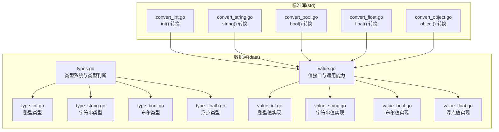
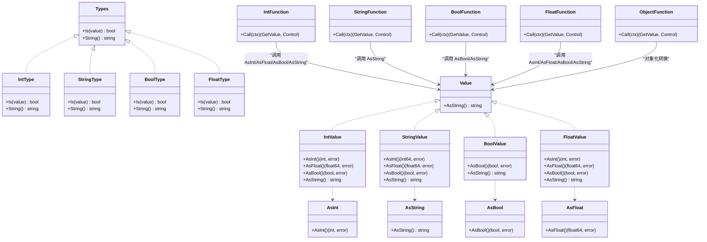
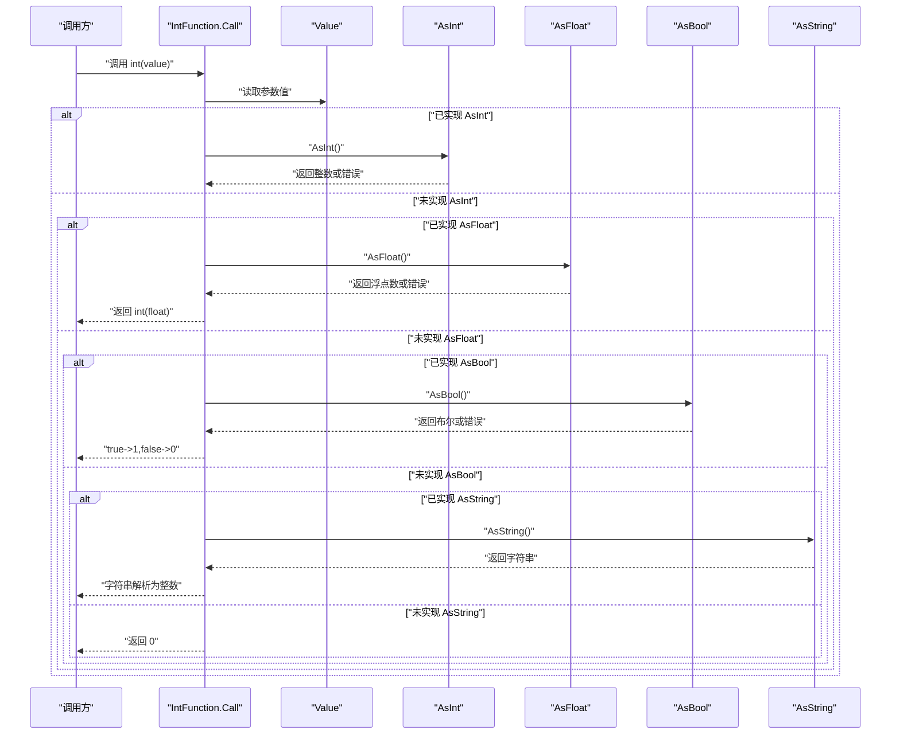
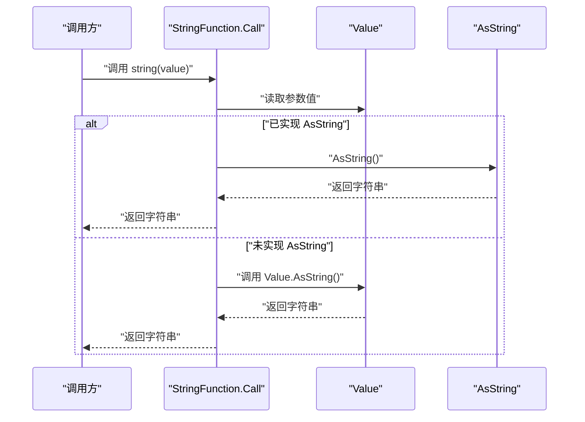
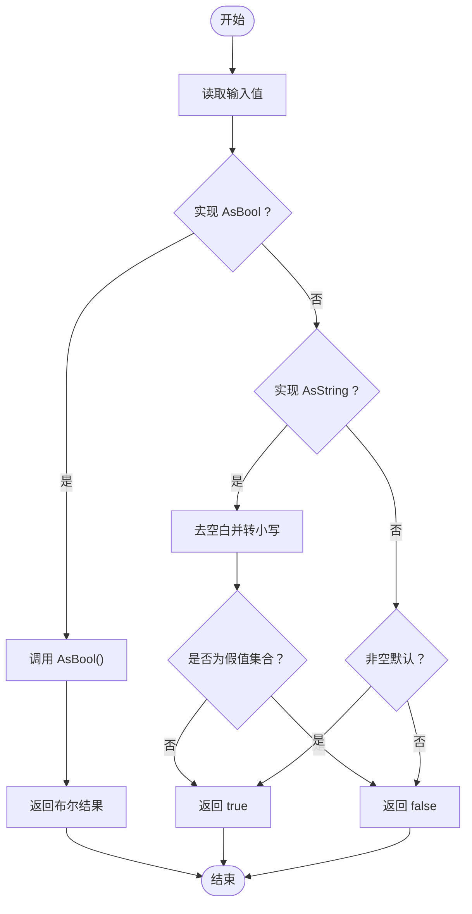
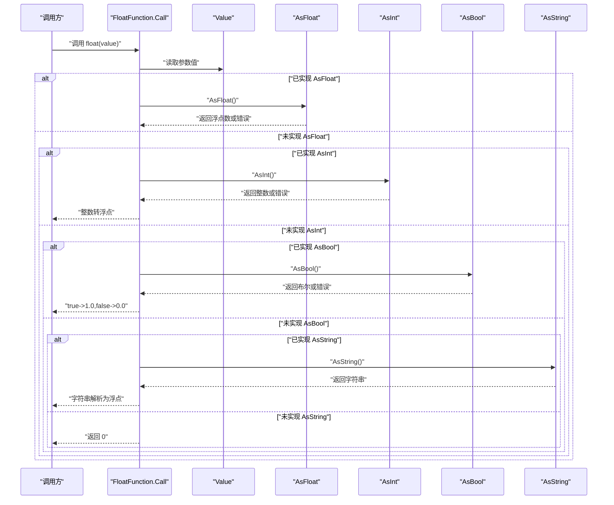
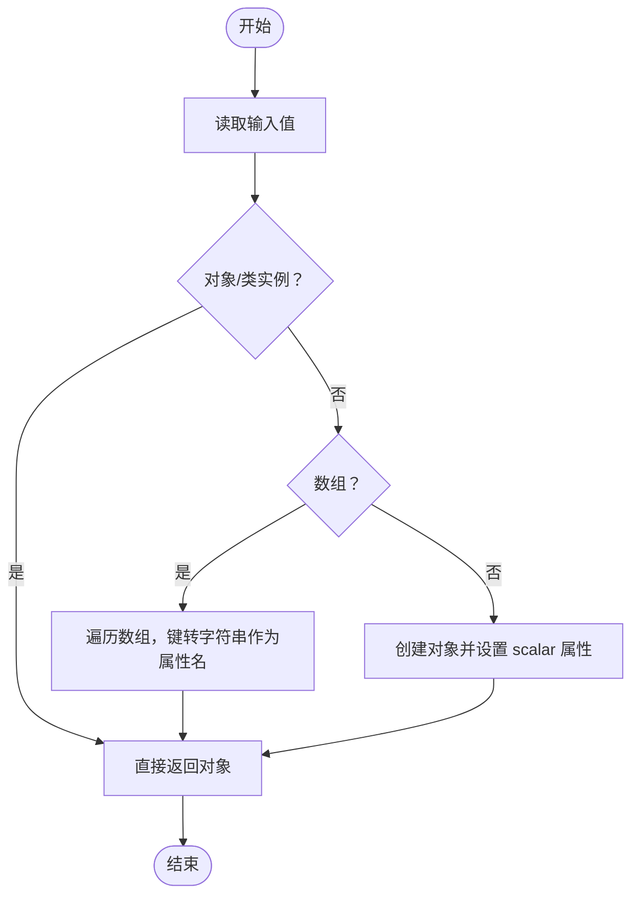
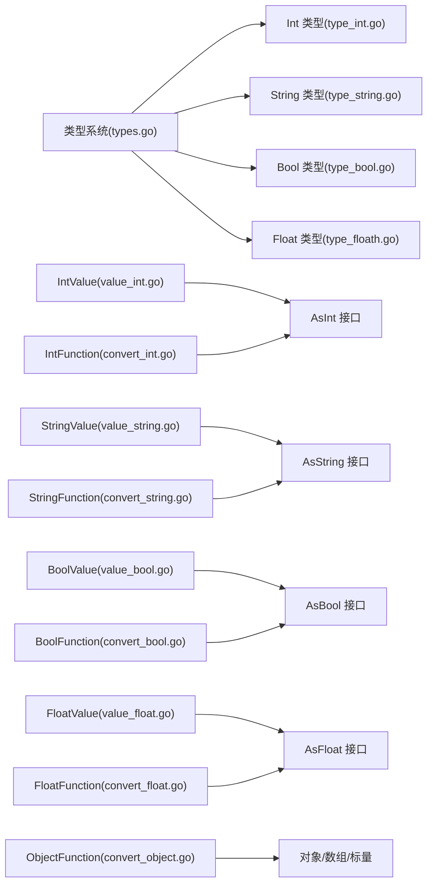

# 类型转换机制

<cite>
**本文引用的文件**
- [types.go](file://data/types.go)
- [type_int.go](file://data/type_int.go)
- [type_string.go](file://data/type_string.go)
- [type_bool.go](file://data/type_bool.go)
- [type_floath.go](file://data/type_floath.go)
- [value.go](file://data/value.go)
- [value_int.go](file://data/value_int.go)
- [value_string.go](file://data/value_string.go)
- [value_bool.go](file://data/value_bool.go)
- [value_float.go](file://data/value_float.go)
- [convert_int.go](file://std/convert_int.go)
- [convert_string.go](file://std/convert_string.go)
- [convert_bool.go](file://std/convert_bool.go)
- [convert_float.go](file://std/convert_float.go)
- [convert_object.go](file://std/convert_object.go)
</cite>

## 目录
1. [引言](#引言)
2. [项目结构](#项目结构)
3. [核心组件](#核心组件)
4. [架构总览](#架构总览)
5. [详细组件分析](#详细组件分析)
6. [依赖分析](#依赖分析)
7. [性能考虑](#性能考虑)
8. [故障排查指南](#故障排查指南)
9. [结论](#结论)
10. [附录](#附录)

## 引言
本文件系统性阐述 Origami 中“PHP 类型到 Go 类型”的转换机制，覆盖基本类型转换、复合类型处理以及类型安全检查。重点解释 AsInt、AsString、AsFloat 等接口的设计与实现，并通过序列图与流程图展示转换过程。同时给出性能影响与优化建议、常见问题与最佳实践。

## 项目结构
围绕类型转换的相关代码主要分布在 data 与 std 两个目录：
- data：定义类型系统、值类型与类型判断接口（如 AsInt、AsString、AsBool、AsFloat）。
- std：提供 PHP 风格的类型转换函数（如 int、string、bool、float、object），这些函数内部使用上述接口完成转换。

图表来源
- [types.go:1-262](file://data/types.go#L1-L262)
- [type_int.go:1-17](file://data/type_int.go#L1-L17)
- [type_string.go:1-17](file://data/type_string.go#L1-L17)
- [type_bool.go:1-22](file://data/type_bool.go#L1-L22)
- [type_floath.go:1-16](file://data/type_floath.go#L1-L16)
- [value.go:1-39](file://data/value.go#L1-L39)
- [value_int.go:1-52](file://data/value_int.go#L1-L52)
- [value_string.go:1-86](file://data/value_string.go#L1-L86)
- [value_bool.go:1-47](file://data/value_bool.go#L1-L47)
- [value_float.go:1-63](file://data/value_float.go#L1-L63)
- [convert_int.go:1-65](file://std/convert_int.go#L1-L65)
- [convert_string.go:1-39](file://std/convert_string.go#L1-L39)
- [convert_bool.go:1-52](file://std/convert_bool.go#L1-L52)
- [convert_float.go:1-64](file://std/convert_float.go#L1-L64)
- [convert_object.go:1-67](file://std/convert_object.go#L1-L67)

章节来源
- [types.go:1-262](file://data/types.go#L1-L262)
- [value.go:1-39](file://data/value.go#L1-L39)
- [convert_int.go:1-65](file://std/convert_int.go#L1-L65)
- [convert_string.go:1-39](file://std/convert_string.go#L1-L39)
- [convert_bool.go:1-52](file://std/convert_bool.go#L1-L52)
- [convert_float.go:1-64](file://std/convert_float.go#L1-L64)
- [convert_object.go:1-67](file://std/convert_object.go#L1-L67)

## 核心组件
- 类型系统与类型判断
  - Types 接口用于判断某个值是否属于某类型；具体类型（如 Int、String、Bool、Float）通过 Is 方法实现弱类型兼容与强类型约束。
  - 支持联合类型、可空类型、多返回值类型等复合类型表达。
- 值接口与转换接口
  - Value 定义了统一的值抽象，提供 AsString 等基础能力。
  - AsInt、AsString、AsBool、AsFloat 等接口定义了从任意值到目标类型的转换能力，具体由各 Value 实现。
- 标准库转换函数
  - int()、string()、bool()、float()、object() 等函数封装了 PHP 风格的转换逻辑，内部优先尝试目标类型的 AsX 接口，再回退到字符串解析等策略。

章节来源
- [types.go:5-106](file://data/types.go#L5-L106)
- [value.go:3-39](file://data/value.go#L3-L39)
- [value_int.go:13-16](file://data/value_int.go#L13-L16)
- [value_string.go:12-14](file://data/value_string.go#L12-L14)
- [value_bool.go:13-15](file://data/value_bool.go#L13-L15)
- [value_float.go:13-23](file://data/value_float.go#L13-L23)
- [convert_int.go:10-65](file://std/convert_int.go#L10-L65)
- [convert_string.go:8-39](file://std/convert_string.go#L8-L39)
- [convert_bool.go:10-52](file://std/convert_bool.go#L10-L52)
- [convert_float.go:10-64](file://std/convert_float.go#L10-L64)
- [convert_object.go:10-67](file://std/convert_object.go#L10-L67)

## 架构总览
下图展示了类型系统、值实现与标准库转换函数之间的交互关系：

图表来源
- [types.go:5-106](file://data/types.go#L5-L106)
- [type_int.go:3-16](file://data/type_int.go#L3-L16)
- [type_string.go:3-16](file://data/type_string.go#L3-L16)
- [type_bool.go:3-21](file://data/type_bool.go#L3-L21)
- [type_floath.go:3-15](file://data/type_floath.go#L3-L15)
- [value.go:3-39](file://data/value.go#L3-L39)
- [value_int.go:13-51](file://data/value_int.go#L13-L51)
- [value_string.go:12-85](file://data/value_string.go#L12-L85)
- [value_bool.go:13-46](file://data/value_bool.go#L13-L46)
- [value_float.go:13-62](file://data/value_float.go#L13-L62)
- [convert_int.go:10-65](file://std/convert_int.go#L10-L65)
- [convert_string.go:8-39](file://std/convert_string.go#L8-L39)
- [convert_bool.go:10-52](file://std/convert_bool.go#L10-L52)
- [convert_float.go:10-64](file://std/convert_float.go#L10-L64)
- [convert_object.go:10-67](file://std/convert_object.go#L10-L67)

## 详细组件分析

### 类型系统与类型安全
- 类型判断接口
  - Types 提供 Is 与 String，用于运行时类型判断与类型描述。
  - 各具体类型（Int、String、Bool、Float）通过 Is 实现弱类型兼容（例如 Bool 对 AsBool 的接受）与强类型约束（例如 Int 仅接受 IntValue）。
- 复合类型
  - 联合类型（UnionType）：只要满足任一子类型即成立。
  - 可空类型（NullableType）：接受 null 或其基础类型。
  - 多返回值类型（MultipleReturnType）：要求数组长度与元素类型一一对应。
- 基础类型构造
  - NewBaseType 将 PHP 风格类型字符串映射到具体类型，支持联合、可空、类名等。

章节来源
- [types.go:5-106](file://data/types.go#L5-L106)
- [types.go:142-188](file://data/types.go#L142-L188)
- [type_int.go:6-12](file://data/type_int.go#L6-L12)
- [type_string.go:6-12](file://data/type_string.go#L6-L12)
- [type_bool.go:6-17](file://data/type_bool.go#L6-L17)
- [type_floath.go:6-11](file://data/type_floath.go#L6-L11)

### 值接口与转换接口
- Value 接口
  - 统一的值抽象，提供 AsString 等基础能力。
- AsInt、AsString、AsBool、AsFloat
  - 各值类型实现相应接口，提供从自身到目标类型的转换与错误处理。
  - 例如：IntValue 实现 AsInt/AsFloat/AsBool；StringValue 实现 AsInt/AsFloat/AsBool；FloatValue 实现 AsInt/AsFloat/AsBool。

章节来源
- [value.go:3-39](file://data/value.go#L3-L39)
- [value_int.go:13-51](file://data/value_int.go#L13-L51)
- [value_string.go:12-85](file://data/value_string.go#L12-L85)
- [value_bool.go:13-46](file://data/value_bool.go#L13-L46)
- [value_float.go:13-62](file://data/value_float.go#L13-L62)

### PHP 风格转换函数（int、string、bool、float、object）

#### int() 转换流程
- 优先级顺序：AsInt → AsFloat → AsBool → AsString（字符串解析）。
- 若无法转换，回退为 0。

图表来源
- [convert_int.go:14-50](file://std/convert_int.go#L14-L50)
- [value_int.go:30-32](file://data/value_int.go#L30-L32)
- [value_float.go:41-43](file://data/value_float.go#L41-L43)
- [value_bool.go:32-34](file://data/value_bool.go#L32-L34)
- [value_string.go:28-34](file://data/value_string.go#L28-L34)

章节来源
- [convert_int.go:10-65](file://std/convert_int.go#L10-L65)

#### string() 转换流程
- 优先：AsObject/AsString；否则回退到 Value.AsString。

图表来源
- [convert_string.go:12-24](file://std/convert_string.go#L12-L24)
- [value.go:6](file://data/value.go#L6)

章节来源
- [convert_string.go:8-39](file://std/convert_string.go#L8-L39)

#### bool() 转换流程
- 优先：AsBool；其次 AsString（空串、"0"、"false" 等视为 false，其余 true）；最后非空默认 true。

图表来源
- [convert_bool.go:14-37](file://std/convert_bool.go#L14-L37)

章节来源
- [convert_bool.go:10-52](file://std/convert_bool.go#L10-L52)

#### float() 转换流程
- 优先级：AsFloat → AsInt → AsBool → AsString（字符串解析）。

图表来源
- [convert_float.go:14-49](file://std/convert_float.go#L14-L49)
- [value_float.go:37-46](file://data/value_float.go#L37-L46)
- [value_int.go:34-36](file://data/value_int.go#L34-L36)
- [value_bool.go:48-50](file://data/value_bool.go#L48-L50)
- [value_string.go:32-34](file://data/value_string.go#L32-L34)

章节来源
- [convert_float.go:10-64](file://std/convert_float.go#L10-L64)

#### object() 转换流程
- 已是对象/类实例：直接返回。
- 是数组：将数组元素转为对象属性（数值键转字符串）。
- 其他标量：包装为带 scalar 属性的对象。

图表来源
- [convert_object.go:21-52](file://std/convert_object.go#L21-L52)

章节来源
- [convert_object.go:10-67](file://std/convert_object.go#L10-L67)

## 依赖分析
- 类型系统对值实现的依赖
  - 类型判断（如 Bool.Is）依赖于值是否实现 AsBool 接口，体现弱类型兼容。
  - 基本类型（Int/Float/String）严格限定值类型（IntValue/FloatValue/StringValue）。
- 转换函数对值接口的依赖
  - int()/float()/bool()/string() 通过 AsX 接口实现转换，object() 直接操作对象/数组/标量。
- 复合类型对基础类型的依赖
  - 联合/可空/多返回值类型组合基础类型，形成更复杂的类型表达。

图表来源
- [types.go:142-188](file://data/types.go#L142-L188)
- [type_int.go:6-12](file://data/type_int.go#L6-L12)
- [type_string.go:6-12](file://data/type_string.go#L6-L12)
- [type_bool.go:6-17](file://data/type_bool.go#L6-L17)
- [type_floath.go:6-11](file://data/type_floath.go#L6-L11)
- [value_int.go:13-51](file://data/value_int.go#L13-L51)
- [value_string.go:12-85](file://data/value_string.go#L12-L85)
- [value_bool.go:13-46](file://data/value_bool.go#L13-L46)
- [value_float.go:13-62](file://data/value_float.go#L13-L62)
- [convert_int.go:14-50](file://std/convert_int.go#L14-L50)
- [convert_string.go:12-24](file://std/convert_string.go#L12-L24)
- [convert_bool.go:14-37](file://std/convert_bool.go#L14-L37)
- [convert_float.go:14-49](file://std/convert_float.go#L14-L49)
- [convert_object.go:21-52](file://std/convert_object.go#L21-L52)

章节来源
- [types.go:142-188](file://data/types.go#L142-L188)
- [convert_int.go:14-50](file://std/convert_int.go#L14-L50)
- [convert_string.go:12-24](file://std/convert_string.go#L12-L24)
- [convert_bool.go:14-37](file://std/convert_bool.go#L14-L37)
- [convert_float.go:14-49](file://std/convert_float.go#L14-L49)
- [convert_object.go:21-52](file://std/convert_object.go#L21-L52)

## 性能考虑
- 接口分派成本
  - 转换函数通过类型断言选择 AsX 接口，避免不必要的字符串解析，减少分支与异常路径。
- 字符串解析开销
  - int()/float() 在无法直接 AsX 时会进行字符串解析，应尽量避免重复解析同一值。
- 类型判断优化
  - 类型系统优先匹配强类型（如 IntValue），减少 AsX 接口调用次数。
- 复合类型检查
  - 联合/可空/多返回值类型在运行时需要多次 Is 检查，建议在编译期或静态分析阶段尽量收敛类型。

## 故障排查指南
- 转换失败或返回默认值
  - 检查值是否实现了相应的 AsX 接口；若未实现，确认是否可通过 AsString 解析。
- bool() 结果与预期不符
  - 注意 bool() 对字符串的假值集合判定（空串、"0"、"false" 等），必要时先进行显式清洗。
- int()/float() 精度丢失
  - 浮点到整数转换会截断小数部分；如需四舍五入，请在调用前进行处理。
- object() 行为差异
  - 数组键在对象化后均以字符串形式出现；如需保留数字键含义，应在上层逻辑中处理。

章节来源
- [convert_bool.go:26-32](file://std/convert_bool.go#L26-L32)
- [convert_int.go:38-48](file://std/convert_int.go#L38-L48)
- [convert_float.go:37-46](file://std/convert_float.go#L37-L46)
- [convert_object.go:34-51](file://std/convert_object.go#L34-L51)

## 结论
Origami 的类型转换机制以“接口优先、弱类型兼容”为核心设计原则：通过 AsInt/AsString/AsBool/AsFloat 等接口实现跨类型转换，配合类型系统（联合、可空、多返回值）提供灵活而安全的类型表达。标准库转换函数遵循明确的优先级与回退策略，既保证与 PHP 语义一致，又兼顾性能与可维护性。

## 附录
- 最佳实践
  - 明确变量类型：尽量在赋值与传递前确定类型，减少运行时类型判断与字符串解析。
  - 优先使用 AsX 接口：当值已具备 AsX 能力时，直接调用以避免额外开销。
  - 控制 bool() 输入：对字符串输入进行预处理，确保假值集合符合业务预期。
  - object() 使用场景：数组转对象时注意键名统一为字符串，必要时在上层逻辑做二次处理。