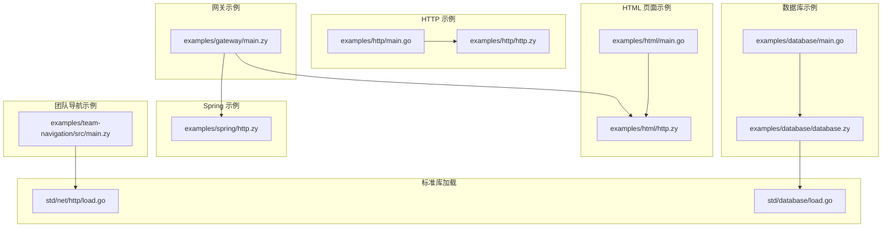
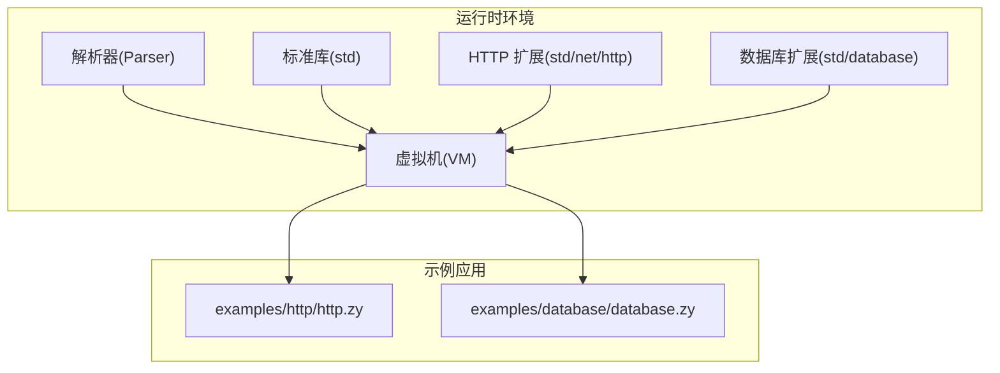
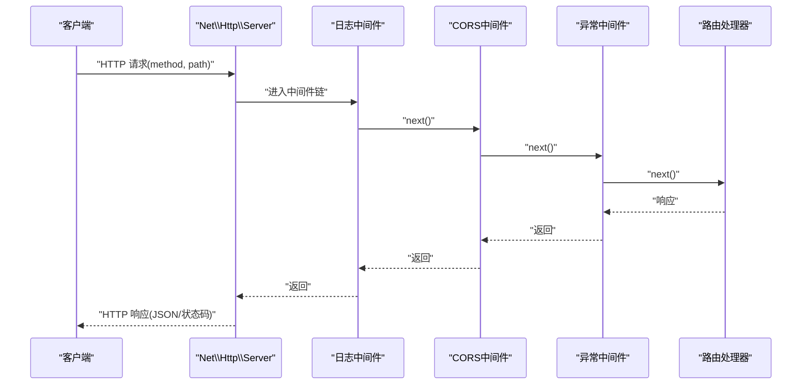
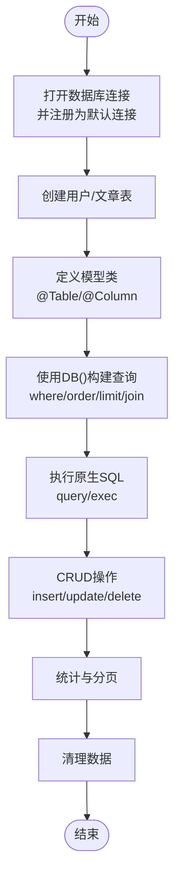
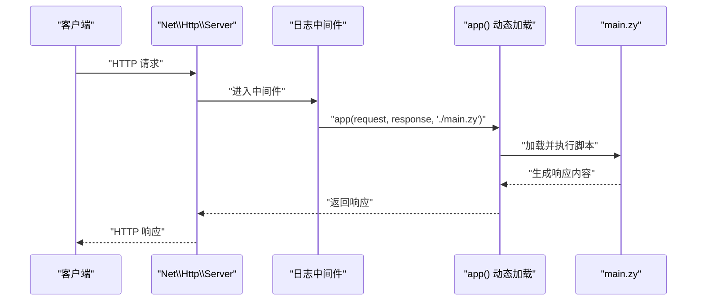
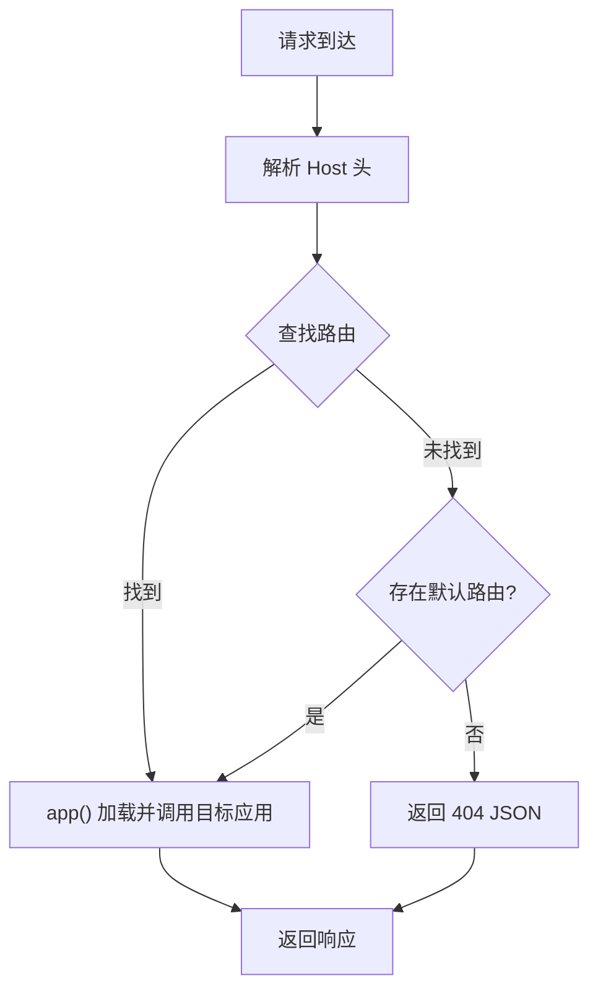
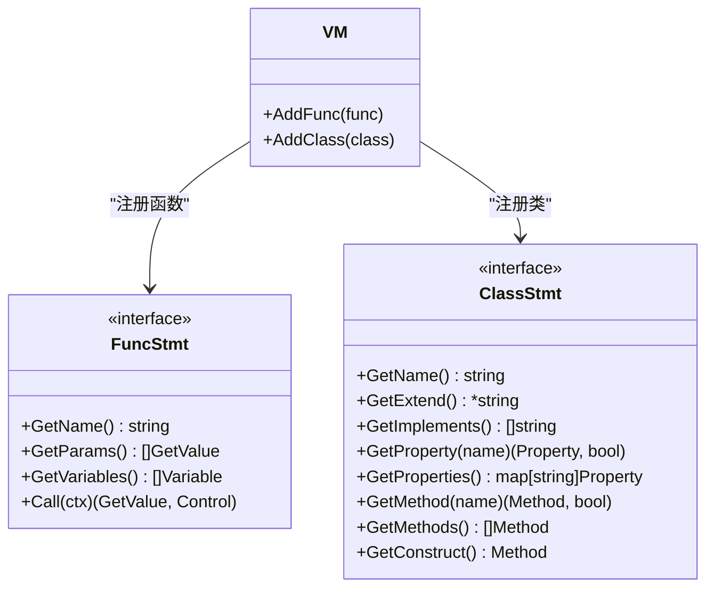
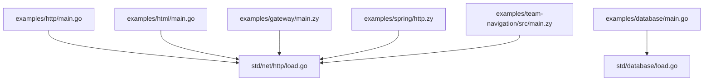

# 集成示例

<cite>
**本文引用的文件**
- [examples/http/main.go](file://examples/http/main.go)
- [examples/http/http.zy](file://examples/http/http.zy)
- [examples/database/main.go](file://examples/database/main.go)
- [examples/database/database.zy](file://examples/database/database.zy)
- [examples/html/main.go](file://examples/html/main.go)
- [examples/html/http.zy](file://examples/html/http.zy)
- [examples/gateway/main.zy](file://examples/gateway/main.zy)
- [examples/spring/http.zy](file://examples/spring/http.zy)
- [examples/team-navigation/src/main.zy](file://examples/team-navigation/src/main.zy)
- [std/net/http/load.go](file://std/net/http/load.go)
- [std/database/load.go](file://std/database/load.go)
- [docs/go-integration.md](file://docs/go-integration.md)
</cite>

## 目录
1. [简介](#简介)
2. [项目结构](#项目结构)
3. [核心组件](#核心组件)
4. [架构总览](#架构总览)
5. [详细组件分析](#详细组件分析)
6. [依赖分析](#依赖分析)
7. [性能考虑](#性能考虑)
8. [故障排查指南](#故障排查指南)
9. [结论](#结论)
10. [附录](#附录)

## 简介
本技术文档围绕 Origami 的“集成示例”展开，系统性地介绍如何在折言（Origami）环境中完成以下典型场景：
- HTTP 客户端与 HTTP 服务器的快速集成
- 数据库连接与 ORM 风格查询构建器的使用
- 文件系统读写与页面渲染
- 网关路由与多应用隔离执行
- 将现有 Go 库无缝集成到 Origami 虚拟机中

文档提供从简单到复杂的渐进式示例，配套实现思路、关键代码位置、使用方法、性能优化、错误处理与调试技巧，并给出将 Go 扩展接入 Origami 的最佳实践。

## 项目结构
示例工程采用“按功能分层”的组织方式：每个示例以独立目录呈现，包含 Go 启动入口与折言脚本，便于开发者快速上手与对比学习。

图表来源
- [examples/http/main.go:1-55](file://examples/http/main.go#L1-L55)
- [examples/http/http.zy:1-232](file://examples/http/http.zy#L1-L232)
- [examples/database/main.go:1-41](file://examples/database/main.go#L1-L41)
- [examples/database/database.zy:1-207](file://examples/database/database.zy#L1-L207)
- [examples/html/main.go:1-50](file://examples/html/main.go#L1-L50)
- [examples/html/http.zy:1-22](file://examples/html/http.zy#L1-L22)
- [examples/gateway/main.zy:1-103](file://examples/gateway/main.zy#L1-L103)
- [examples/spring/http.zy:1-22](file://examples/spring/http.zy#L1-L22)
- [examples/team-navigation/src/main.zy:1-11](file://examples/team-navigation/src/main.zy#L1-L11)
- [std/net/http/load.go:1-17](file://std/net/http/load.go#L1-L17)
- [std/database/load.go:1-28](file://std/database/load.go#L1-L28)

章节来源
- [examples/http/main.go:1-55](file://examples/http/main.go#L1-L55)
- [examples/database/main.go:1-41](file://examples/database/main.go#L1-L41)
- [examples/html/main.go:1-50](file://examples/html/main.go#L1-L50)
- [examples/gateway/main.zy:1-103](file://examples/gateway/main.zy#L1-L103)
- [examples/spring/http.zy:1-22](file://examples/spring/http.zy#L1-L22)
- [examples/team-navigation/src/main.zy:1-11](file://examples/team-navigation/src/main.zy#L1-L11)
- [std/net/http/load.go:1-17](file://std/net/http/load.go#L1-L17)
- [std/database/load.go:1-28](file://std/database/load.go#L1-L28)

## 核心组件
- HTTP 服务器与中间件：通过 Net\Http\Server 提供路由、中间件、CORS、异常捕获与 JSON 响应。
- 数据库模块：DB<T> 泛型类 + 注解驱动的模型映射 + 查询构建器 + 原生 SQL 支持。
- 文件系统与页面：基于 app() 动态加载脚本，结合日志中间件与统一路由。
- 网关路由：根据 Host 头动态分发到不同应用，实现多应用隔离执行。
- Go 集成：将 Go 函数/类注册到 VM，扩展 HTTP 客户端、数据库、文件系统等能力。

章节来源
- [examples/http/http.zy:1-232](file://examples/http/http.zy#L1-L232)
- [examples/database/database.zy:1-207](file://examples/database/database.zy#L1-L207)
- [examples/html/http.zy:1-22](file://examples/html/http.zy#L1-L22)
- [examples/gateway/main.zy:1-103](file://examples/gateway/main.zy#L1-L103)
- [docs/go-integration.md:1-643](file://docs/go-integration.md#L1-L643)

## 架构总览
下图展示了“HTTP 示例”与“数据库示例”的运行时架构：Go 启动入口初始化解析器与 VM，加载标准库与 HTTP/DB 扩展，随后执行折言脚本；脚本通过 Server 类暴露 HTTP 能力，DB<T> 提供 ORM 风格查询。

图表来源
- [examples/http/main.go:1-55](file://examples/http/main.go#L1-L55)
- [examples/database/main.go:1-41](file://examples/database/main.go#L1-L41)
- [std/net/http/load.go:1-17](file://std/net/http/load.go#L1-L17)
- [std/database/load.go:1-28](file://std/database/load.go#L1-L28)

## 详细组件分析

### HTTP 客户端与服务器集成
- 实现思路
  - 使用 Net\Http\Server 创建监听地址与端口。
  - 通过 middleware 注册全局中间件：日志、CORS、异常捕获。
  - 定义多条路由，分别处理 GET/POST 请求，支持路径参数与表单参数。
  - 使用 bind 方法将 JSON 数据绑定到类实例，简化参数校验与类型转换。
  - 最后启动服务器并等待信号量优雅退出。
- 关键代码位置
  - 服务器创建与中间件注册：[examples/http/http.zy:13-74](file://examples/http/http.zy#L13-L74)
  - 路由定义（首页、用户、搜索、健康检查）：[examples/http/http.zy:76-151](file://examples/http/http.zy#L76-L151)
  - bind 绑定示例（用户与文章）：[examples/http/http.zy:167-213](file://examples/http/http.zy#L167-L213)
  - 错误处理示例与日志输出：[examples/http/http.zy:215-229](file://examples/http/http.zy#L215-L229)
  - 启动与退出流程（Go 入口）：[examples/http/main.go:18-54](file://examples/http/main.go#L18-L54)
- 使用方法
  - 直接运行 Go 入口，访问本地端口查看路由行为。
  - 使用 curl 或浏览器访问各端点，观察中间件日志与响应格式。
- 性能与健壮性
  - 中间件链路顺序影响性能，建议将耗时操作（如日志、CORS）放在靠近入口处。
  - bind 绑定可减少手动参数校验，但需注意类型不匹配导致的空对象风险。
- 调试技巧
  - 在中间件中打印请求方法、路径、IP 与耗时，定位慢请求。
  - 对异常中间件捕获 Exception/Error 并返回结构化 JSON，便于前端或自动化工具消费。

图表来源
- [examples/http/http.zy:16-74](file://examples/http/http.zy#L16-L74)
- [examples/http/http.zy:76-151](file://examples/http/http.zy#L76-L151)

章节来源
- [examples/http/http.zy:1-232](file://examples/http/http.zy#L1-L232)
- [examples/http/main.go:1-55](file://examples/http/main.go#L1-L55)

### 数据库连接与 ORM 查询
- 实现思路
  - 通过 open("sqlite", "example.db") 注册数据库连接并设置为默认连接。
  - 使用注解@Table/@Column 定义模型类，映射表结构。
  - 使用 DB<T>() 构建查询：where、orderBy、limit、groupBy、join 等。
  - 支持原生 SQL 的 query/exec，满足复杂场景。
  - 演示 CRUD 全流程：插入、更新、删除、条件查询、聚合统计。
- 关键代码位置
  - 连接与注册默认连接：[examples/database/database.zy:21-24](file://examples/database/database.zy#L21-L24)
  - 表结构创建（用户/文章）：[examples/database/database.zy:30-54](file://examples/database/database.zy#L30-L54)
  - 模型类定义（User/Post）：[examples/database/database.zy:57-74](file://examples/database/database.zy#L57-L74)
  - 查询构建器示例（get/where/order/limit/groupBy）：[examples/database/database.zy:81-95](file://examples/database/database.zy#L81-L95)
  - 插入/更新/删除示例：[examples/database/database.zy:105-139](file://examples/database/database.zy#L105-L139)
  - 原生 SQL 与关联查询：[examples/database/database.zy:155-177](file://examples/database/database.zy#L155-L177)
  - 分页与统计：[examples/database/database.zy:181-195](file://examples/database/database.zy#L181-L195)
  - 清理数据：[examples/database/database.zy:200-204](file://examples/database/database.zy#L200-L204)
  - 标准库加载（DB 类与 SQL 子模块）：[std/database/load.go:9-27](file://std/database/load.go#L9-L27)
- 使用方法
  - 运行 Go 入口，自动执行 database.zy，观察日志输出与数据库文件变化。
  - 可在脚本中直接使用 DB<User>()、DB<Post>() 进行类型化查询。
- 性能与健壮性
  - 大批量更新/删除建议分批执行，避免长事务锁表。
  - 聚合查询与关联查询注意索引设计，必要时使用原生 SQL。
- 调试技巧
  - 通过 Log::info 输出每一步结果，定位异常（如唯一约束冲突）。
  - 对复杂查询先拆分步骤，逐步缩小问题范围。

图表来源
- [examples/database/database.zy:18-207](file://examples/database/database.zy#L18-L207)
- [std/database/load.go:9-27](file://std/database/load.go#L9-L27)

章节来源
- [examples/database/database.zy:1-207](file://examples/database/database.zy#L1-L207)
- [examples/database/main.go:1-41](file://examples/database/main.go#L1-L41)
- [std/database/load.go:1-28](file://std/database/load.go#L1-L28)

### 文件系统与页面渲染
- 实现思路
  - 使用 Net\Http\Server 创建 HTTP 服务，统一路由到 app()。
  - app($request, $response, "./main.zy") 动态加载脚本并执行，实现页面渲染。
  - 结合日志中间件记录请求信息，便于调试。
- 关键代码位置
  - 服务器与中间件：[examples/html/http.zy:4-12](file://examples/html/http.zy#L4-L12)
  - 统一路由与 app() 调用：[examples/html/http.zy:14-17](file://examples/html/http.zy#L14-L17)
  - Go 入口与信号处理：[examples/html/main.go:17-49](file://examples/html/main.go#L17-L49)
- 使用方法
  - 运行 Go 入口，访问本地端口，页面由脚本动态生成。
- 性能与健壮性
  - app() 每次请求都会加载新脚本，适合开发阶段；生产环境可考虑预编译或缓存策略。
- 调试技巧
  - 在中间件中打印 method/path，确认路由是否命中。
  - 检查 app() 的文件路径与函数名是否正确。

图表来源
- [examples/html/http.zy:14-17](file://examples/html/http.zy#L14-L17)
- [examples/html/main.go:34-43](file://examples/html/main.go#L34-L43)

章节来源
- [examples/html/http.zy:1-22](file://examples/html/http.zy#L1-L22)
- [examples/html/main.go:1-50](file://examples/html/main.go#L1-L50)

### 网关路由与多应用隔离
- 实现思路
  - 定义路由表：Host -> { path, func }，支持默认路由。
  - 通过 Host 头选择目标应用，使用 app() 动态加载并调用指定函数。
  - 每个请求在独立 VM 中执行，实现应用隔离。
- 关键代码位置
  - 路由表与日志：[examples/gateway/main.zy:16-46](file://examples/gateway/main.zy#L16-L46)
  - 主处理逻辑与 Host 解析：[examples/gateway/main.zy:54-99](file://examples/gateway/main.zy#L54-L99)
  - Spring 示例统一路由：[examples/spring/http.zy:14-17](file://examples/spring/http.zy#L14-L17)
  - Demo 应用入口（注解驱动）：[examples/team-navigation/src/main.zy:5-11](file://examples/team-navigation/src/main.zy#L5-L11)
- 使用方法
  - 启动网关，通过修改 Host 头访问不同应用。
  - 生产环境建议配合反向代理与域名解析。
- 性能与健壮性
  - app() 每次加载会带来额外开销，可考虑进程池或预热机制。
  - 异常捕获与 404/500 统一返回，提升可观测性。
- 调试技巧
  - 打印 Host 与路由命中情况，定位路由缺失或函数名错误。

图表来源
- [examples/gateway/main.zy:54-99](file://examples/gateway/main.zy#L54-L99)

章节来源
- [examples/gateway/main.zy:1-103](file://examples/gateway/main.zy#L1-L103)
- [examples/spring/http.zy:1-22](file://examples/spring/http.zy#L1-L22)
- [examples/team-navigation/src/main.zy:1-11](file://examples/team-navigation/src/main.zy#L1-L11)

### 将现有 Go 库集成到 Origami
- 实现思路
  - 通过实现 data.FuncStmt 或 data.ClassStmt 接口，将 Go 函数或结构体注册到 VM。
  - 在 main.go 中调用 vm.AddFunc()/vm.AddClass() 完成注册。
  - 支持 HTTP 客户端、数据库、文件系统等常见场景。
- 关键代码位置
  - 函数集成模板与带返回值示例：[docs/go-integration.md:18-110](file://docs/go-integration.md#L18-L110)
  - 类集成模板（含构造、属性、方法）：[docs/go-integration.md:114-246](file://docs/go-integration.md#L114-L246)
  - 在 main.go 中注册扩展：[docs/go-integration.md:250-278](file://docs/go-integration.md#L250-L278)
  - HTTP 客户端集成示例：[docs/go-integration.md:282-333](file://docs/go-integration.md#L282-L333)
  - 数据库集成示例：[docs/go-integration.md:335-390](file://docs/go-integration.md#L335-L390)
  - 文件系统集成示例：[docs/go-integration.md:392-462](file://docs/go-integration.md#L392-L462)
  - 最佳实践（错误处理/类型安全/性能优化）：[docs/go-integration.md:464-532](file://docs/go-integration.md#L464-L532)
  - 调试技巧（日志/参数验证）：[docs/go-integration.md:534-571](file://docs/go-integration.md#L534-L571)
- 使用方法
  - 新建扩展包，实现接口，然后在 main.go 中注册到 VM。
  - 在折言脚本中直接调用新增的函数或类。
- 性能与健壮性
  - 使用 defer 和 recover 防护潜在 panic。
  - 对外部资源（HTTP、DB、文件）及时释放与关闭。
- 调试技巧
  - 在 Call/方法中打印上下文与参数，辅助定位问题。
  - 对参数进行严格类型断言与默认值处理。

图表来源
- [docs/go-integration.md:250-278](file://docs/go-integration.md#L250-L278)

章节来源
- [docs/go-integration.md:1-643](file://docs/go-integration.md#L1-L643)

## 依赖分析
- HTTP 示例依赖
  - Go 启动入口依赖标准库与 HTTP 扩展加载器，脚本侧依赖 Net\Http\Server 与日志。
- 数据库示例依赖
  - Go 启动入口依赖标准库与数据库扩展加载器，脚本侧依赖 DB<T> 与注解。
- 网关示例依赖
  - 依赖 HTTP 扩展与 app() 动态加载能力，可路由到其他示例脚本。
- 文件系统页面示例依赖
  - 依赖 HTTP 扩展与 app() 动态加载能力。

图表来源
- [examples/http/main.go:1-55](file://examples/http/main.go#L1-L55)
- [examples/database/main.go:1-41](file://examples/database/main.go#L1-L41)
- [examples/html/main.go:1-50](file://examples/html/main.go#L1-L50)
- [examples/gateway/main.zy:1-103](file://examples/gateway/main.zy#L1-L103)
- [examples/spring/http.zy:1-22](file://examples/spring/http.zy#L1-L22)
- [examples/team-navigation/src/main.zy:1-11](file://examples/team-navigation/src/main.zy#L1-L11)
- [std/net/http/load.go:1-17](file://std/net/http/load.go#L1-L17)
- [std/database/load.go:1-28](file://std/database/load.go#L1-L28)

章节来源
- [std/net/http/load.go:1-17](file://std/net/http/load.go#L1-L17)
- [std/database/load.go:1-28](file://std/database/load.go#L1-L28)

## 性能考虑
- 中间件顺序与短路：将高频低成本中间件前置，异常中间件尽量靠后，避免对正常路径造成额外开销。
- 查询优化：合理使用 where、orderBy、limit、join，必要时添加索引；聚合与分组查询优先考虑原生 SQL。
- 资源管理：HTTP 客户端、数据库连接、文件句柄需及时关闭，避免泄露。
- 应用隔离成本：网关的 app() 每次加载会带来开销，生产环境建议进程池或预热。
- 缓存策略：对热点数据与计算结果进行缓存，减少重复 IO 与 CPU 开销。

## 故障排查指南
- HTTP 服务器
  - 404/405：检查路由是否匹配，中间件是否提前返回。
  - CORS 失败：确认中间件已设置允许的 Origin/Methods/Headers。
  - 异常：查看异常中间件日志，定位具体错误堆栈。
- 数据库
  - 唯一约束冲突：观察插入重复数据的日志，调整业务逻辑或参数。
  - SQL 语法错误：核对原生 SQL 字符串与参数绑定。
  - 连接问题：确认默认连接已注册且 ping 成功。
- 网关
  - Host 未命中：检查路由表与 Host 解析逻辑，确认默认路由配置。
  - app() 加载失败：核对文件路径与函数名，确保目标应用入口存在。
- Go 扩展
  - 类型断言失败：使用类型安全函数进行断言与默认值处理。
  - panic：使用 defer/recover 包裹关键路径，记录日志并降级返回。

章节来源
- [examples/http/http.zy:46-74](file://examples/http/http.zy#L46-L74)
- [examples/database/database.zy:116-124](file://examples/database/database.zy#L116-L124)
- [examples/gateway/main.zy:67-83](file://examples/gateway/main.zy#L67-L83)
- [docs/go-integration.md:534-571](file://docs/go-integration.md#L534-L571)

## 结论
通过上述示例，开发者可以在 Origami 中快速完成 HTTP 服务、数据库操作、页面渲染与多应用网关等常见任务。结合 Go 扩展能力，可进一步提升性能与功能边界。建议在生产环境中关注中间件顺序、查询优化、资源管理与应用隔离的成本控制，并建立完善的日志与监控体系。

## 附录
- 快速启动
  - HTTP 示例：运行 [examples/http/main.go:1-55](file://examples/http/main.go#L1-L55)，访问本地端口查看路由行为。
  - 数据库示例：运行 [examples/database/main.go:1-41](file://examples/database/main.go#L1-L41)，观察日志与数据库文件。
  - HTML 页面示例：运行 [examples/html/main.go:1-50](file://examples/html/main.go#L1-L50)，访问本地端口查看页面。
  - 网关示例：运行 [examples/gateway/main.zy:1-103](file://examples/gateway/main.zy#L1-L103)，通过 Host 头访问不同应用。
- 参考文档
  - Go 集成指南：[docs/go-integration.md:1-643](file://docs/go-integration.md#L1-L643)