# LSP语言服务器

<cite>
**本文引用的文件**   
- [tools/lsp/main.go](file://tools/lsp/main.go)
- [tools/lsp/initialization.go](file://tools/lsp/initialization.go)
- [tools/lsp/document_sync.go](file://tools/lsp/document_sync.go)
- [tools/lsp/completion.go](file://tools/lsp/completion.go)
- [tools/lsp/hover.go](file://tools/lsp/hover.go)
- [tools/lsp/definition.go](file://tools/lsp/definition.go)
- [tools/lsp/symbols.go](file://tools/lsp/symbols.go)
- [tools/lsp/diagnostics.go](file://tools/lsp/diagnostics.go)
- [tools/lsp/lsp_vm.go](file://tools/lsp/lsp_vm.go)
- [tools/lsp/lsp_parser.go](file://tools/lsp/lsp_parser.go)
- [tools/lsp/utils.go](file://tools/lsp/utils.go)
- [tools/lsp/example-config.json](file://tools/lsp/example-config.json)
- [README.md](file://README.md)
- [README_CN.md](file://README_CN.md)
</cite>

## 目录
1. [简介](#简介)
2. [项目结构](#项目结构)
3. [核心组件](#核心组件)
4. [架构总览](#架构总览)
5. [详细组件分析](#详细组件分析)
6. [依赖分析](#依赖分析)
7. [性能考虑](#性能考虑)
8. [故障排查指南](#故障排查指南)
9. [结论](#结论)
10. [附录](#附录)

## 简介
本文件面向使用与集成 Origami 语言（.zy/.php）的 LSP 语言服务器，系统性阐述 LSP 协议实现原理与各功能模块，包括 JSON-RPC 通信机制、协议握手流程、消息处理、智能补全、悬停提示、定义跳转、文档符号、错误诊断等。同时给出服务器启动参数配置、IDE 集成指南以及调试与常见问题解决方案。

## 项目结构
LSP 服务器位于 tools/lsp 目录，核心入口为 main.go，其余文件分别实现协议握手、文档同步、功能处理、诊断发布、虚拟机与解析器等模块。README 提供语言整体背景与文档入口。

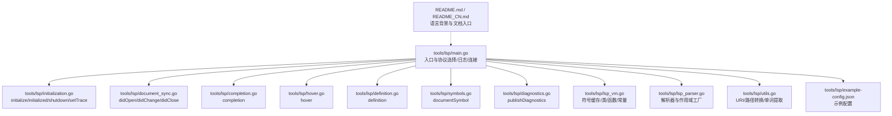

**图表来源**
- [tools/lsp/main.go:1-404](file://tools/lsp/main.go#L1-L404)
- [tools/lsp/initialization.go:1-308](file://tools/lsp/initialization.go#L1-L308)
- [tools/lsp/document_sync.go:1-182](file://tools/lsp/document_sync.go#L1-L182)
- [tools/lsp/completion.go:1-50](file://tools/lsp/completion.go#L1-L50)
- [tools/lsp/hover.go:1-77](file://tools/lsp/hover.go#L1-L77)
- [tools/lsp/definition.go:1-1015](file://tools/lsp/definition.go#L1-L1015)
- [tools/lsp/symbols.go:1-223](file://tools/lsp/symbols.go#L1-L223)
- [tools/lsp/diagnostics.go:1-108](file://tools/lsp/diagnostics.go#L1-L108)
- [tools/lsp/lsp_vm.go:1-624](file://tools/lsp/lsp_vm.go#L1-L624)
- [tools/lsp/lsp_parser.go:1-88](file://tools/lsp/lsp_parser.go#L1-L88)
- [tools/lsp/utils.go:1-101](file://tools/lsp/utils.go#L1-L101)
- [tools/lsp/example-config.json:1-55](file://tools/lsp/example-config.json#L1-L55)
- [README.md:1-69](file://README.md#L1-L69)
- [README_CN.md:1-69](file://README_CN.md#L1-L69)

**章节来源**
- [tools/lsp/main.go:1-404](file://tools/lsp/main.go#L1-L404)
- [README.md:1-69](file://README.md#L1-L69)
- [README_CN.md:1-69](file://README_CN.md#L1-L69)

## 核心组件
- JSON-RPC 2.0 通信与连接
  - 使用 github.com/sourcegraph/jsonrpc2，支持 stdio、tcp、websocket（当前仅 stdio/tc 实现）。
  - 入口 main() 解析参数，按协议类型创建连接与流，注册处理器 handleRequest。
- 协议握手与能力声明
  - initialize 返回 ServerCapabilities，声明支持的同步策略、补全触发字符、hover/definition/documentSymbol 等能力。
  - initialized 通知客户端完成初始化。
  - shutdown 与 setTrace 处理。
- 文档同步
  - didOpen/didChange/didClose 维护内存中的 DocumentInfo（内容、AST、版本、解析器），并触发诊断发布。
- 功能处理
  - completion、hover、definition、documentSymbol、publishDiagnostics 等。
- 符号与解析
  - LspVM 缓存类/接口/函数/常量，支持扫描目录与增量解析；LspParser 提供 LSP 专用作用域工厂与解析能力。

**章节来源**
- [tools/lsp/main.go:180-337](file://tools/lsp/main.go#L180-L337)
- [tools/lsp/initialization.go:16-87](file://tools/lsp/initialization.go#L16-L87)
- [tools/lsp/document_sync.go:17-181](file://tools/lsp/document_sync.go#L17-L181)
- [tools/lsp/lsp_vm.go:17-68](file://tools/lsp/lsp_vm.go#L17-L68)
- [tools/lsp/lsp_parser.go:13-88](file://tools/lsp/lsp_parser.go#L13-L88)

## 架构总览
LSP 服务器采用“入口连接—请求分发—功能处理—符号/诊断”的流水线式架构。核心数据结构包括 DocumentInfo、LspVM、LspParser，以及 JSON-RPC 连接与日志系统。

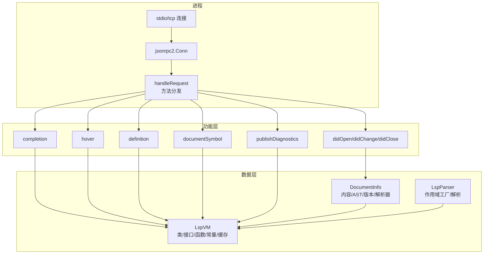

**图表来源**
- [tools/lsp/main.go:180-337](file://tools/lsp/main.go#L180-L337)
- [tools/lsp/document_sync.go:17-181](file://tools/lsp/document_sync.go#L17-L181)
- [tools/lsp/completion.go:13-49](file://tools/lsp/completion.go#L13-L49)
- [tools/lsp/hover.go:13-47](file://tools/lsp/hover.go#L13-L47)
- [tools/lsp/definition.go:17-43](file://tools/lsp/definition.go#L17-L43)
- [tools/lsp/symbols.go:15-36](file://tools/lsp/symbols.go#L15-L36)
- [tools/lsp/diagnostics.go:17-42](file://tools/lsp/diagnostics.go#L17-L42)
- [tools/lsp/lsp_vm.go:17-68](file://tools/lsp/lsp_vm.go#L17-L68)
- [tools/lsp/lsp_parser.go:34-88](file://tools/lsp/lsp_parser.go#L34-L88)

## 详细组件分析

### JSON-RPC 通信与协议握手
- 协议选择
  - 支持 stdio、tcp；websocket 当前标记为不支持。
- 连接建立
  - stdio：通过 os.Stdin/Stdout 构造 io.ReadWriteCloser，使用 VSCode 对象编解码。
  - tcp：监听 address:port，接受连接后为每个连接创建 jsonrpc2.Conn。
- 握手流程
  - initialize：返回 ServerCapabilities（文本同步、补全触发字符、hover/definition/documentSymbol 能力）。
  - initialized：客户端确认初始化完成。
  - setTrace：设置跟踪级别。
  - shutdown：响应关闭请求。

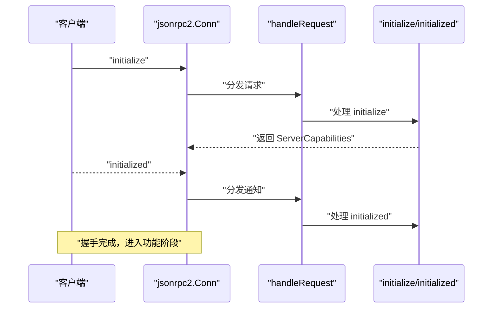

**图表来源**
- [tools/lsp/main.go:187-237](file://tools/lsp/main.go#L187-L237)
- [tools/lsp/initialization.go:16-87](file://tools/lsp/initialization.go#L16-L87)

**章节来源**
- [tools/lsp/main.go:54-68](file://tools/lsp/main.go#L54-L68)
- [tools/lsp/main.go:187-237](file://tools/lsp/main.go#L187-L237)
- [tools/lsp/initialization.go:16-87](file://tools/lsp/initialization.go#L16-L87)

### 文档同步与诊断发布
- didOpen
  - 解析内容为 AST，创建/更新 DocumentInfo，随后调用 validateDocument 发布诊断。
- didChange
  - 使用最新内容重新解析，更新 DocumentInfo，再发布诊断。
- didClose
  - 保留 AST 以供后续分析，仅清空内容，避免符号索引被清理。
- 诊断发布
  - validateDocument 统一收集语法/语义诊断并通过 textDocument/publishDiagnostics 通知客户端。

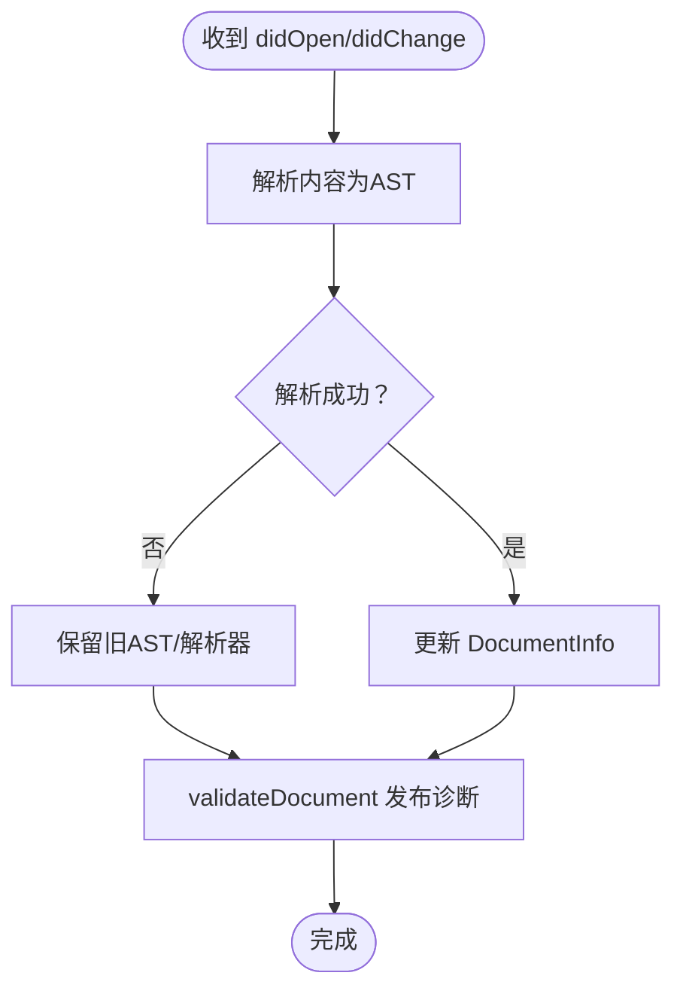

**图表来源**
- [tools/lsp/document_sync.go:17-181](file://tools/lsp/document_sync.go#L17-L181)
- [tools/lsp/diagnostics.go:17-42](file://tools/lsp/diagnostics.go#L17-L42)

**章节来源**
- [tools/lsp/document_sync.go:17-181](file://tools/lsp/document_sync.go#L17-L181)
- [tools/lsp/diagnostics.go:17-108](file://tools/lsp/diagnostics.go#L17-L108)

### 智能补全（completion）
- 触发与上下文
  - 基于 TriggerCharacters（如 .、$、:、\、>）触发补全。
- 处理流程
  - 解析 CompletionParams，定位 DocumentInfo。
  - 创建 LSPSymbolProvider，结合 AST 与上下文（变量、类成员、方法参数等）生成 CompletionItem 列表。
- 输出
  - CompletionList（包含是否不完整与补全项）。

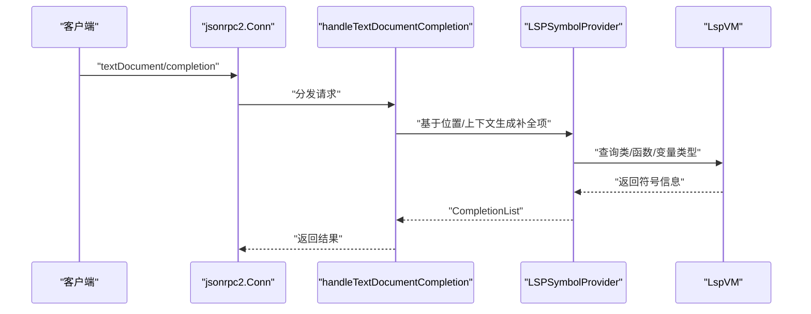

**图表来源**
- [tools/lsp/completion.go:13-49](file://tools/lsp/completion.go#L13-L49)
- [tools/lsp/provider.go:13-502](file://tools/lsp/provider.go#L13-L502)
- [tools/lsp/lsp_vm.go:17-68](file://tools/lsp/lsp_vm.go#L17-L68)

**章节来源**
- [tools/lsp/completion.go:13-49](file://tools/lsp/completion.go#L13-L49)
- [tools/lsp/provider.go:13-502](file://tools/lsp/provider.go#L13-L502)

### 悬停提示（hover）
- 处理流程
  - 解析 HoverParams，定位 DocumentInfo。
  - 基于光标位置提取单词，生成 Markdown 内容的 MarkupContent。
- 输出
  - Hover 结构体（包含内容与格式）。

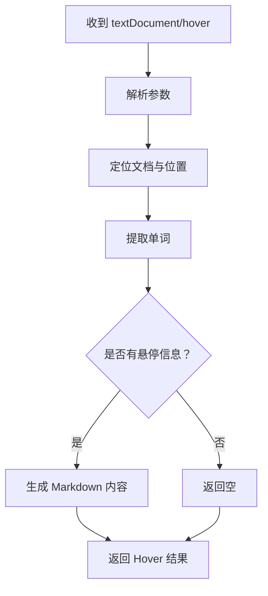

**图表来源**
- [tools/lsp/hover.go:13-47](file://tools/lsp/hover.go#L13-L47)
- [tools/lsp/utils.go:11-47](file://tools/lsp/utils.go#L11-L47)

**章节来源**
- [tools/lsp/hover.go:13-77](file://tools/lsp/hover.go#L13-L77)
- [tools/lsp/utils.go:11-101](file://tools/lsp/utils.go#L11-L101)

### 定义跳转（definition）
- 处理流程
  - 解析 DefinitionParams，定位 DocumentInfo。
  - 在 AST 中查找目标节点，根据节点类型（函数/类/方法/属性/变量等）查找定义位置。
  - 通过 node.GetFrom 获取源文件与范围，转换为 LSP Location。
- 性能与准确性
  - 使用 pickSmallerNode 选择最精确的节点；isPositionInRange 与 isPositionInLineRange 辅助定位。

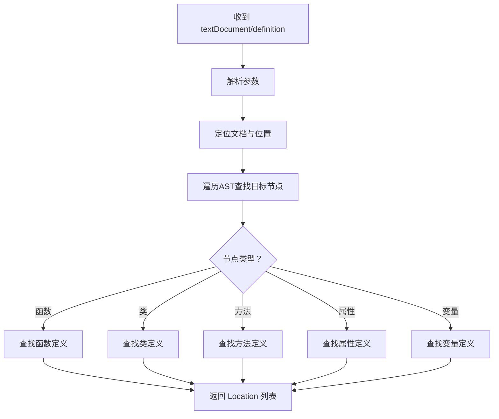

**图表来源**
- [tools/lsp/definition.go:17-152](file://tools/lsp/definition.go#L17-L152)
- [tools/lsp/definition.go:506-750](file://tools/lsp/definition.go#L506-L750)

**章节来源**
- [tools/lsp/definition.go:17-1015](file://tools/lsp/definition.go#L17-L1015)

### 文档符号（documentSymbol）
- 处理流程
  - 解析 DocumentSymbolParams，定位 DocumentInfo。
  - 使用 AST 遍历，创建顶层符号（函数/类/接口/变量/常量/命名空间）及其子成员。
- 输出
  - DocumentSymbol 列表（包含名称、种类、范围、子节点等）。

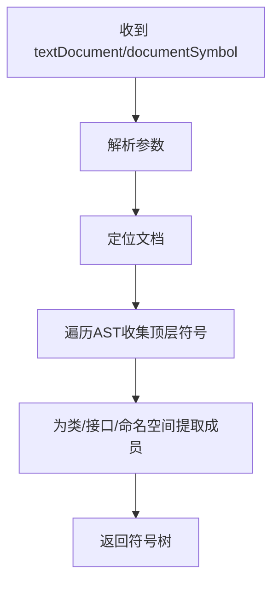

**图表来源**
- [tools/lsp/symbols.go:15-36](file://tools/lsp/symbols.go#L15-L36)
- [tools/lsp/symbols.go:38-223](file://tools/lsp/symbols.go#L38-L223)

**章节来源**
- [tools/lsp/symbols.go:15-223](file://tools/lsp/symbols.go#L15-L223)

### 错误诊断（diagnostics）
- 处理流程
  - validateDocument 统一入口：针对 .zy/.php 文件进行 AST 解析与语义检查，生成 Diagnostic 列表。
  - 通过 conn.Notify 发送 textDocument/publishDiagnostics。
- 位置映射
  - 使用 node.GetFrom 获取源文件与行列范围，转换为 LSP Range。

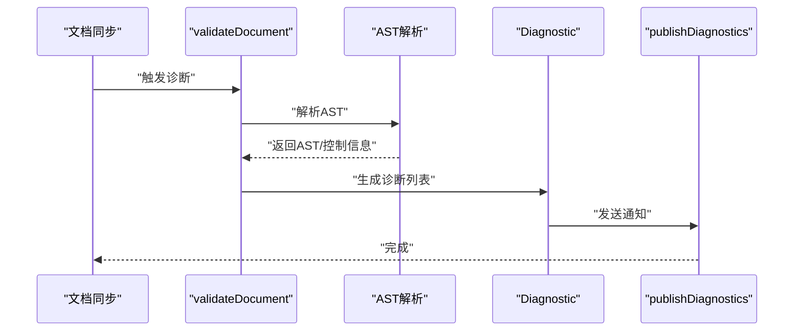

**图表来源**
- [tools/lsp/diagnostics.go:17-108](file://tools/lsp/diagnostics.go#L17-L108)

**章节来源**
- [tools/lsp/diagnostics.go:17-108](file://tools/lsp/diagnostics.go#L17-L108)

### 符号缓存与解析器
- LspVM
  - 缓存类/接口/函数/常量，维护文件符号集与类路径缓存；支持扫描目录与增量解析；提供 ClearFile 以避免符号索引丢失。
- LspParser
  - 注册 LspScopeFactory，创建 LSP 专用作用域；提供 ParseFile/ParseString，支持从文件与内存内容解析。

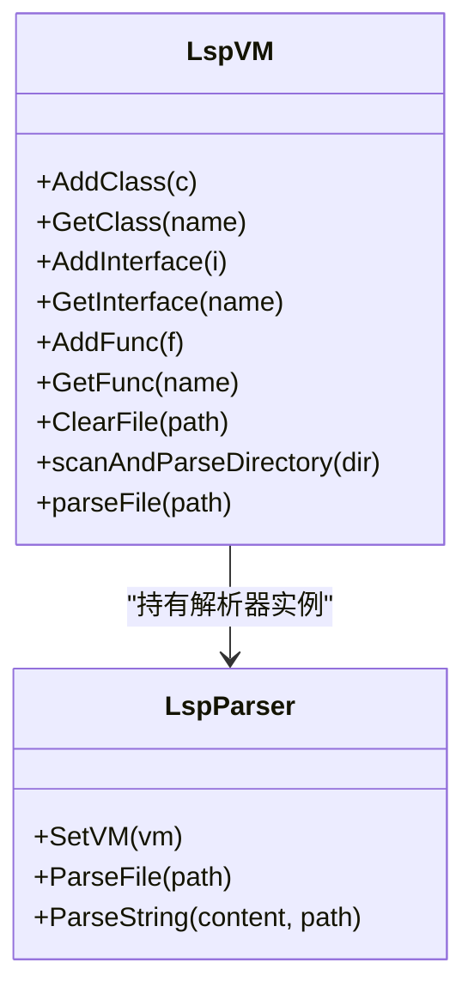

**图表来源**
- [tools/lsp/lsp_vm.go:17-68](file://tools/lsp/lsp_vm.go#L17-L68)
- [tools/lsp/lsp_vm.go:320-405](file://tools/lsp/lsp_vm.go#L320-L405)
- [tools/lsp/lsp_parser.go:34-88](file://tools/lsp/lsp_parser.go#L34-L88)

**章节来源**
- [tools/lsp/lsp_vm.go:17-624](file://tools/lsp/lsp_vm.go#L17-L624)
- [tools/lsp/lsp_parser.go:13-88](file://tools/lsp/lsp_parser.go#L13-L88)

## 依赖分析
- 外部依赖
  - github.com/sirupsen/logrus：日志系统，支持多输出（stderr、stdout、文件）与调用位置信息。
  - github.com/sourcegraph/jsonrpc2：JSON-RPC 2.0 实现，支持 VSCode 对象编解码。
- 内部依赖
  - data、node、parser、runtime、utils：语言核心模块，提供类型系统、AST、解析器、运行时与工具函数。
- 关系图

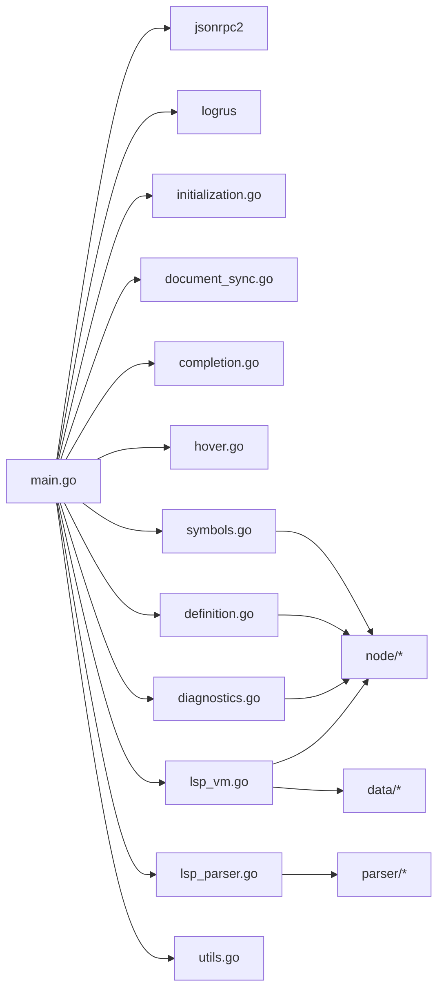

**图表来源**
- [tools/lsp/main.go:16-18](file://tools/lsp/main.go#L16-L18)
- [tools/lsp/initialization.go:11-14](file://tools/lsp/initialization.go#L11-L14)
- [tools/lsp/document_sync.go:10-15](file://tools/lsp/document_sync.go#L10-L15)
- [tools/lsp/completion.go:8-11](file://tools/lsp/completion.go#L8-L11)
- [tools/lsp/hover.go:8-11](file://tools/lsp/hover.go#L8-L11)
- [tools/lsp/definition.go:10-15](file://tools/lsp/definition.go#L10-L15)
- [tools/lsp/symbols.go:8-13](file://tools/lsp/symbols.go#L8-L13)
- [tools/lsp/diagnostics.go:9-15](file://tools/lsp/diagnostics.go#L9-L15)
- [tools/lsp/lsp_vm.go:10-15](file://tools/lsp/lsp_vm.go#L10-L15)
- [tools/lsp/lsp_parser.go:6-11](file://tools/lsp/lsp_parser.go#L6-L11)

**章节来源**
- [tools/lsp/main.go:16-18](file://tools/lsp/main.go#L16-L18)
- [tools/lsp/lsp_vm.go:10-15](file://tools/lsp/lsp_vm.go#L10-L15)
- [tools/lsp/lsp_parser.go:6-11](file://tools/lsp/lsp_parser.go#L6-L11)

## 性能考虑
- 异步加载与解析
  - initialize 后异步加载工作区脚本文件，避免阻塞初始化响应。
  - didOpen/didChange 使用最新内容解析，必要时清理旧符号缓存。
- 日志与输出
  - stdio 模式下可选择控制台日志开关，避免干扰 LSP 通信；非 stdio 模式同时输出到 stdout 与文件。
- 节点定位与遍历
  - 使用 pickSmallerNode 与行范围判断，减少不必要的子节点遍历。
- 建议
  - 对大型工作区启用扫描目录模式，限制遍历范围。
  - 合理设置日志级别，避免高频 I/O 影响性能。

[本节为通用建议，无需特定文件来源]

## 故障排查指南
- 启动参数与日志
  - 使用 -help/-version 查看帮助与版本；-log-level 控制日志级别；-log-file 指定日志文件；stdio 模式可开启/关闭控制台日志。
- 协议与连接
  - protocol 仅支持 stdio/tcp；websocket 当前不支持。确保 address/port 正确且未被占用。
- 文档同步
  - didClose 仅清空内容，保留 AST 以供后续分析；如出现“跳转到定义”失效，检查是否误清理符号索引。
- 诊断未显示
  - 确认文件扩展名为 .zy 或 .php；validateDocument 会基于 AST 生成诊断并通过 publishDiagnostics 发送。
- 调试技巧
  - 提升日志级别至 debug，观察请求/响应与参数详情；使用 -test 触发定义跳转测试（如实现）。

**章节来源**
- [tools/lsp/main.go:54-68](file://tools/lsp/main.go#L54-L68)
- [tools/lsp/main.go:363-397](file://tools/lsp/main.go#L363-L397)
- [tools/lsp/document_sync.go:157-181](file://tools/lsp/document_sync.go#L157-L181)
- [tools/lsp/diagnostics.go:17-42](file://tools/lsp/diagnostics.go#L17-L42)

## 结论
本 LSP 服务器围绕 JSON-RPC 2.0 与 VSCode 能力模型构建，实现了从握手、文档同步到补全、悬停、定义跳转、文档符号与诊断发布的完整链路。通过 LspVM 与 LspParser 的配合，服务器在保证功能完整性的同时，兼顾了异步加载与日志可观测性。建议在实际使用中结合 IDE 配置与日志级别进行针对性优化与排障。

[本节为总结，无需特定文件来源]

## 附录

### 服务器启动参数与配置
- 常用参数
  - -protocol：协议类型（stdio、tcp、websocket）
  - -address：绑定地址（tcp/websocket）
  - -port：绑定端口（tcp/websocket）
  - -log-level：日志级别（0~5）
  - -log-file：日志文件路径
  - -console-log：stdio 模式下是否输出到控制台
  - -scan-dir：扫描指定目录中的 .zy 文件
- 示例
  - stdio 启动（默认）、禁用控制台日志、扫描目录、TCP 启动等。

**章节来源**
- [tools/lsp/main.go:54-68](file://tools/lsp/main.go#L54-L68)
- [tools/lsp/main.go:363-397](file://tools/lsp/main.go#L363-L397)

### IDE 集成指南（概览）
- VS Code
  - 使用 LanguageClient 或官方 extension，配置命令指向服务器二进制，设置参数（如 -protocol、-port）。
- Vim/Neovim
  - 使用 coc.nvim、LanguageClient-neovim 或 vim-lsp，配置对应服务器命令与参数。
- Emacs
  - 使用 lsp-mode，配置 server executable 与参数。
- 说明
  - 服务器支持 stdio 与 tcp；websocket 当前不支持。建议优先使用 stdio 以获得最佳兼容性。

[本节为通用集成说明，无需特定文件来源]

### 示例配置文件
- example-config.json 提供了服务器协议、日志、语言特性、补全关键词/内置/片段、诊断严重级别与格式化设置的示例结构。

**章节来源**
- [tools/lsp/example-config.json:1-55](file://tools/lsp/example-config.json#L1-L55)