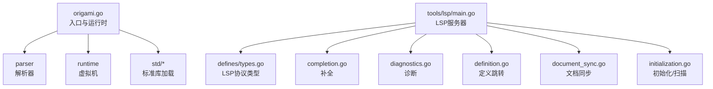
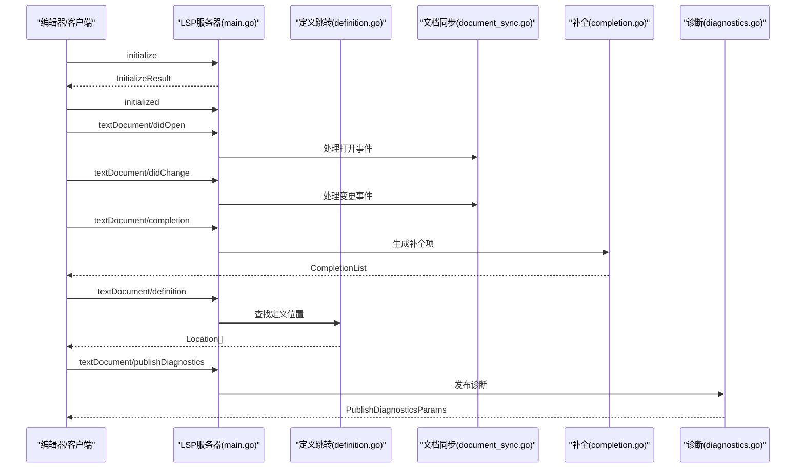
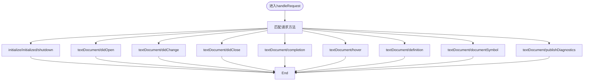
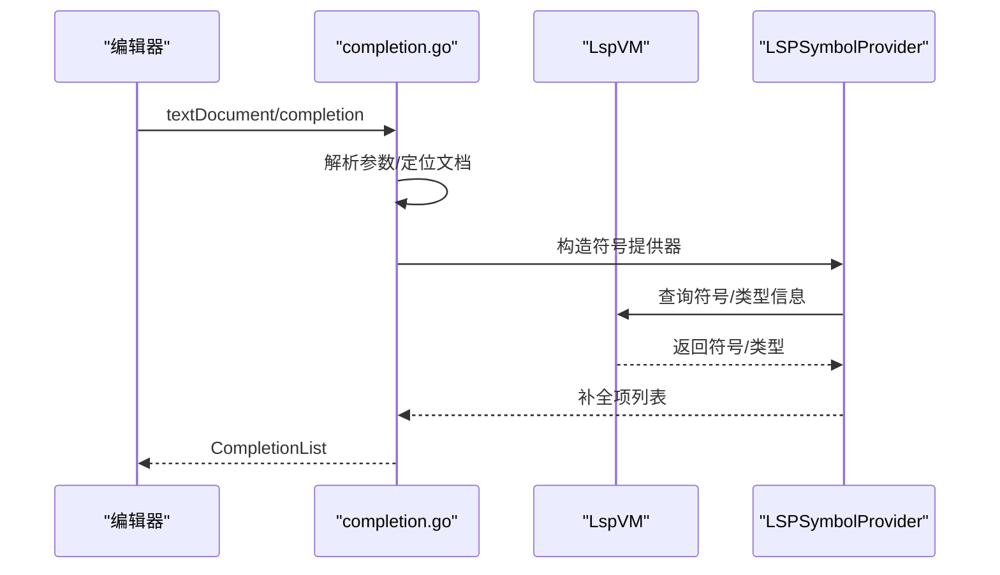
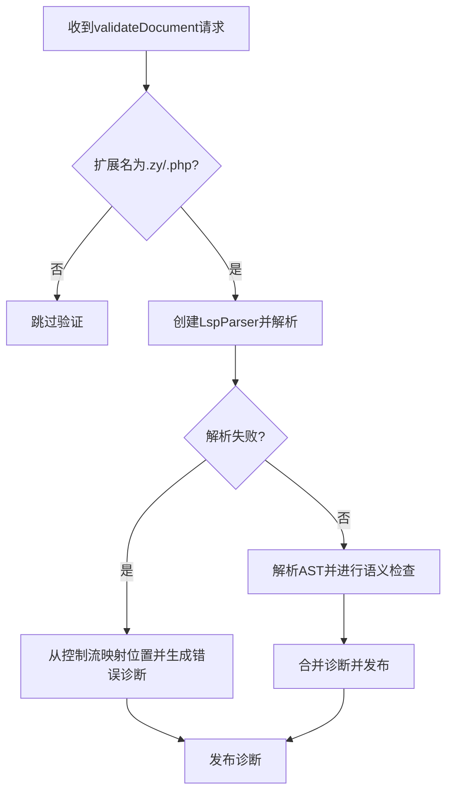
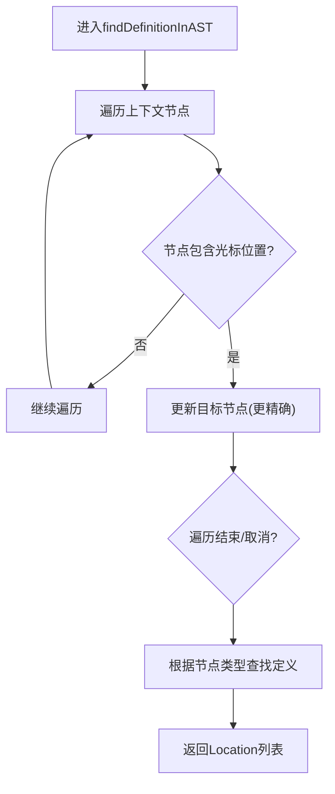
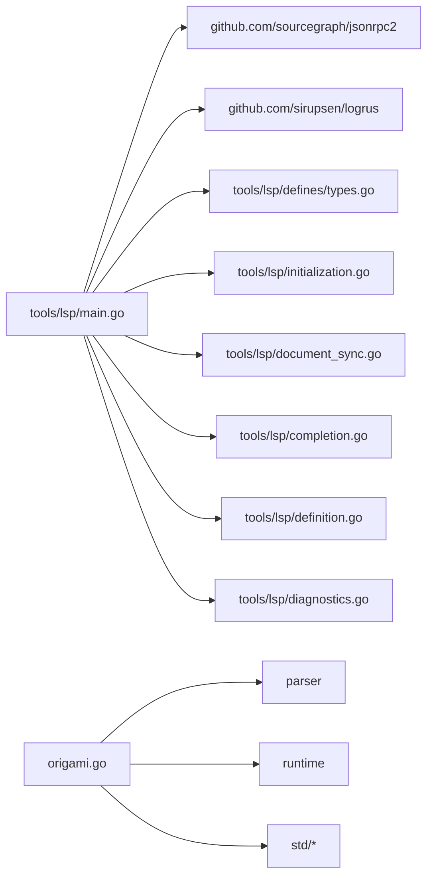

# 开发工具

<cite>
**本文引用的文件**
- [README.md](file://README.md)
- [origami.go](file://origami.go)
- [tools/lsp/main.go](file://tools/lsp/main.go)
- [tools/lsp/completion.go](file://tools/lsp/completion.go)
- [tools/lsp/diagnostics.go](file://tools/lsp/diagnostics.go)
- [tools/lsp/definition.go](file://tools/lsp/definition.go)
- [tools/lsp/defines/types.go](file://tools/lsp/defines/types.go)
- [tools/lsp/document_sync.go](file://tools/lsp/document_sync.go)
- [tools/lsp/initialization.go](file://tools/lsp/initialization.go)
- [tools/lsp/test_lsp.sh](file://tools/lsp/test_lsp.sh)
- [tools/lsp/example-config.json](file://tools/lsp/example-config.json)
- [origami.code-workspace](file://origami.code-workspace)
- [performance_test.py](file://performance_test.py)
- [performance_test.zy](file://performance_test.zy)
- [performance_comparison.md](file://performance_comparison.md)
- [tests/README.md](file://tests/README.md)
</cite>

## 目录
1. [简介](#简介)
2. [项目结构](#项目结构)
3. [核心组件](#核心组件)
4. [架构总览](#架构总览)
5. [详细组件分析](#详细组件分析)
6. [依赖关系分析](#依赖关系分析)
7. [性能考量](#性能考量)
8. [故障排查指南](#故障排查指南)
9. [结论](#结论)
10. [附录](#附录)

## 简介
本文件面向Origami开发工具的使用者与维护者，系统化梳理语言服务器协议（LSP）实现、调试工具使用、测试框架与性能分析工具，并给出开发环境配置与IDE集成的最佳实践。文档以仓库现有实现为依据，结合图示与流程说明，帮助读者快速上手并深入理解各模块的设计与交互。

## 项目结构
- 顶层入口与运行时：通过主程序入口加载解析器、虚拟机与标准库，支持脚本执行与错误控制流展示。
- LSP工具：独立的LSP服务器实现，覆盖初始化、文档同步、补全、悬停、定义跳转、文档符号与诊断发布等。
- 测试与性能：包含性能测试脚本与对比报告，以及测试框架说明。
- IDE与工作区：提供VS Code工作区配置与示例LSP配置文件，便于本地集成与调试。

**图表来源**
- [origami.go:34-67](file://origami.go#L34-L67)
- [tools/lsp/main.go:82-237](file://tools/lsp/main.go#L82-L237)
- [tools/lsp/defines/types.go:1-364](file://tools/lsp/defines/types.go#L1-L364)

**章节来源**
- [README.md:1-69](file://README.md#L1-L69)
- [origami.go:16-67](file://origami.go#L16-L67)

## 核心组件
- 主程序入口与运行时
  - 初始化解析器与全局命名空间，加载标准库与语言兼容层，解析命令行参数并执行脚本，错误时调用控制流展示。
- LSP服务器
  - 支持stdio/tcp协议，内置日志系统与请求取消机制；实现initialize/initialized/shutdown与文档生命周期事件；提供补全、悬停、定义跳转、文档符号与诊断发布。
- 测试与性能
  - 提供Python与Origami脚本的性能测试样例与对比报告，辅助评估执行效率与瓶颈。
- IDE与工作区
  - 提供VS Code工作区文件与LSP示例配置，便于在本地集成与调试。

**章节来源**
- [origami.go:34-67](file://origami.go#L34-L67)
- [tools/lsp/main.go:82-237](file://tools/lsp/main.go#L82-L237)
- [tools/lsp/test_lsp.sh:1-34](file://tools/lsp/test_lsp.sh#L1-L34)
- [origami.code-workspace:1-11](file://origami.code-workspace#L1-L11)

## 架构总览
LSP服务器采用JSON-RPC 2.0协议与客户端交互，核心流程包括：
- 初始化握手与能力协商
- 文档打开/变更/关闭的同步
- 补全、悬停、定义跳转、文档符号与诊断发布的请求处理
- 日志与请求取消管理

**图表来源**
- [tools/lsp/main.go:299-336](file://tools/lsp/main.go#L299-L336)
- [tools/lsp/completion.go:14-49](file://tools/lsp/completion.go#L14-L49)
- [tools/lsp/definition.go:18-43](file://tools/lsp/definition.go#L18-L43)
- [tools/lsp/diagnostics.go:18-42](file://tools/lsp/diagnostics.go#L18-L42)
- [tools/lsp/document_sync.go:158-181](file://tools/lsp/document_sync.go#L158-L181)

## 详细组件分析

### LSP服务器与协议实现
- 协议与连接
  - 支持stdio与tcp两种协议；tcp模式下循环接受连接并在goroutine中处理；提供日志输出到文件与控制台的组合策略。
- 初始化与工作区扫描
  - 解析客户端初始化参数，提取工作区根目录；支持扫描指定目录中的脚本文件，构建符号索引。
- 文档同步
  - 处理didOpen/didChange/didClose事件；关闭文档时保留AST以减少内存占用并维持符号索引稳定。
- 补全
  - 基于文档上下文与节点信息生成补全项，支持针对成员访问（->/.）的增强补全。
- 悬停
  - 提供悬停提示接口占位，便于后续扩展。
- 定义跳转
  - 基于AST遍历与节点范围判断，定位光标下的目标节点，支持函数、类、方法、属性与变量的跳转。
- 文档符号
  - 提供文档符号接口占位，便于后续扩展。
- 诊断发布
  - 基于AST解析与语义检查生成诊断，发布到客户端。

**图表来源**
- [tools/lsp/main.go:299-336](file://tools/lsp/main.go#L299-L336)

**章节来源**
- [tools/lsp/main.go:82-237](file://tools/lsp/main.go#L82-L237)
- [tools/lsp/initialization.go:146-196](file://tools/lsp/initialization.go#L146-L196)
- [tools/lsp/document_sync.go:158-181](file://tools/lsp/document_sync.go#L158-L181)
- [tools/lsp/completion.go:14-49](file://tools/lsp/completion.go#L14-L49)
- [tools/lsp/definition.go:18-43](file://tools/lsp/definition.go#L18-L43)
- [tools/lsp/diagnostics.go:18-42](file://tools/lsp/diagnostics.go#L18-L42)

### 补全与符号提供
- 补全流程
  - 解析请求参数，定位文档与光标位置，构造符号提供器，基于节点支持获取补全项，返回CompletionList。
- 符号提供器
  - 通过LSPSymbolProvider与全局LspVM协作，结合AST节点信息与上下文，生成候选项。

**图表来源**
- [tools/lsp/completion.go:14-49](file://tools/lsp/completion.go#L14-L49)

**章节来源**
- [tools/lsp/completion.go:14-49](file://tools/lsp/completion.go#L14-L49)

### 诊断与语义校验
- 诊断流程
  - 校验文件扩展名，使用LspParser解析AST；解析失败时基于控制流信息映射LSP位置并生成错误诊断；解析成功后进行语义检查并合并诊断。
- 语义检查
  - 当前返回空列表，预留扩展点（如类型检查、未定义变量、未使用变量、函数签名等）。

**图表来源**
- [tools/lsp/diagnostics.go:18-107](file://tools/lsp/diagnostics.go#L18-L107)

**章节来源**
- [tools/lsp/diagnostics.go:18-107](file://tools/lsp/diagnostics.go#L18-L107)

### 定义跳转与AST定位
- AST定位
  - 遍历文档上下文，根据光标位置判断节点包含关系，选择最小且精确的节点；支持函数、类、方法、属性与变量的跳转。
- 节点类型处理
  - 针对CallExpression/NewExpression/CallMethod/CallObjectMethod/CallStaticMethod/CallObjectProperty/VariableExpression等节点类型分别查找定义位置。
- 类型推断与去重
  - 提供类型推断与去重逻辑，基于类型键生成稳定指纹，避免重复类型污染。

**图表来源**
- [tools/lsp/definition.go:46-106](file://tools/lsp/definition.go#L46-L106)

**章节来源**
- [tools/lsp/definition.go:46-106](file://tools/lsp/definition.go#L46-L106)

### LSP协议类型与能力
- 类型定义
  - defines包提供InitializeParams/InitializeResult/ServerCapabilities/CompletionOptions/HoverOptions/DefinitionOptions/DocumentSymbolOptions/TextDocumentItem/DidOpenTextDocumentParams/Diagnostic等完整类型。
- 能力协商
  - 服务器能力包括文本文档同步、补全、悬停、定义跳转、文档符号等选项，便于客户端按需启用。

**章节来源**
- [tools/lsp/defines/types.go:1-364](file://tools/lsp/defines/types.go#L1-L364)

### 测试与调试工具
- LSP测试脚本
  - 提供版本信息、帮助信息、定义跳转测试与日志级别测试的自动化脚本，便于快速验证LSP服务状态。
- 测试框架说明
  - tests/README.md提示观察红色日志输出并借助互斥条件判断功能是否正常，建议结合LSP日志定位问题。

**章节来源**
- [tools/lsp/test_lsp.sh:1-34](file://tools/lsp/test_lsp.sh#L1-L34)
- [tests/README.md:1-4](file://tests/README.md#L1-L4)

### 开发环境与IDE集成最佳实践
- VS Code工作区
  - 提供origami.code-workspace，包含项目根目录与扩展目录，便于统一管理。
- LSP示例配置
  - example-config.json展示了协议、日志、语言特性、补全关键字与内置项、诊断严重级别与格式化选项等配置模板，可据此定制IDE集成。
- 启动与验证
  - 使用LSP测试脚本验证版本、帮助与日志级别；在IDE中配置stdio或tcp协议，确保日志输出与诊断发布正常。

**章节来源**
- [origami.code-workspace:1-11](file://origami.code-workspace#L1-L11)
- [tools/lsp/example-config.json:1-55](file://tools/lsp/example-config.json#L1-L55)
- [tools/lsp/test_lsp.sh:1-34](file://tools/lsp/test_lsp.sh#L1-L34)

## 依赖关系分析
- LSP服务器依赖
  - JSON-RPC 2.0处理器与日志库；与LspVM/LspParser协作；与AST节点与数据类型系统交互。
- 主程序依赖
  - 解析器、虚拟机与标准库模块；命令行参数解析与错误控制流展示。

**图表来源**
- [tools/lsp/main.go:3-18](file://tools/lsp/main.go#L3-L18)
- [origami.go:3-14](file://origami.go#L3-L14)

**章节来源**
- [tools/lsp/main.go:3-18](file://tools/lsp/main.go#L3-L18)
- [origami.go:3-14](file://origami.go#L3-L14)

## 性能考量
- 性能测试样例
  - Python版本与Origami版本的一百万次赋值循环测试，记录总执行时间、平均每次操作时间与每秒操作次数。
- 对比报告
  - 报告显示Origami在解释型语言背景下表现良好，具备每秒约920万次操作的能力；循环结构差异对性能有一定影响。
- 建议
  - 在实际场景中结合对比结果评估性能需求；持续关注解析与执行开销优化空间。

**章节来源**
- [performance_test.py:1-39](file://performance_test.py#L1-L39)
- [performance_test.zy:1-33](file://performance_test.zy#L1-L33)
- [performance_comparison.md:1-54](file://performance_comparison.md#L1-L54)

## 故障排查指南
- LSP日志
  - 使用日志级别与输出目标（stderr/stdout/文件）组合，定位初始化、文档同步、补全、定义跳转与诊断发布过程中的异常。
- 请求取消
  - 服务器支持取消请求机制，可通过“$/cancelRequest”传递ID进行取消，避免长时间阻塞。
- 文档关闭行为
  - 关闭文档时保留AST与符号索引，避免“跳转到定义”失效；如遇问题，检查文档内容清理策略与符号索引一致性。
- 测试脚本
  - 使用LSP测试脚本验证版本、帮助与日志级别，快速定位配置问题。

**章节来源**
- [tools/lsp/main.go:258-336](file://tools/lsp/main.go#L258-L336)
- [tools/lsp/document_sync.go:158-181](file://tools/lsp/document_sync.go#L158-L181)
- [tools/lsp/test_lsp.sh:1-34](file://tools/lsp/test_lsp.sh#L1-L34)

## 结论
本文件基于仓库现有实现，系统梳理了Origami的LSP服务器、测试与性能分析工具，并提供了IDE集成与开发环境配置的最佳实践。LSP模块覆盖初始化、文档同步、补全、悬停、定义跳转、文档符号与诊断发布等关键能力；测试与性能报告为评估与优化提供参考。建议在实际使用中结合日志与测试脚本进行问题定位，并根据业务需求持续完善语义检查与类型推断能力。

## 附录
- 快速启动
  - 运行主程序执行脚本，或使用LSP测试脚本验证服务状态。
- 配置参考
  - 参考example-config.json与origami.code-workspace进行IDE集成与工作区配置。

**章节来源**
- [origami.go:34-67](file://origami.go#L34-L67)
- [tools/lsp/test_lsp.sh:1-34](file://tools/lsp/test_lsp.sh#L1-L34)
- [tools/lsp/example-config.json:1-55](file://tools/lsp/example-config.json#L1-L55)
- [origami.code-workspace:1-11](file://origami.code-workspace#L1-L11)