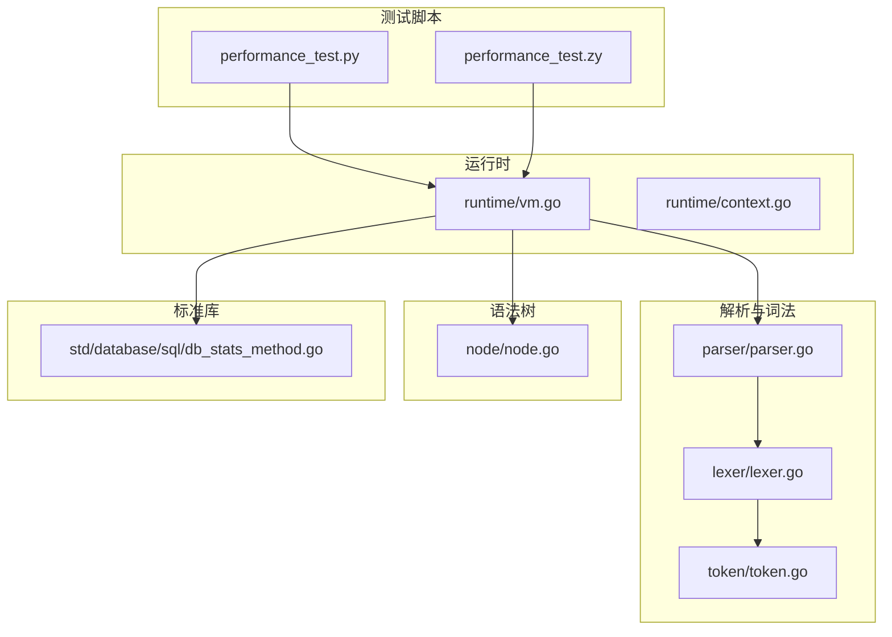
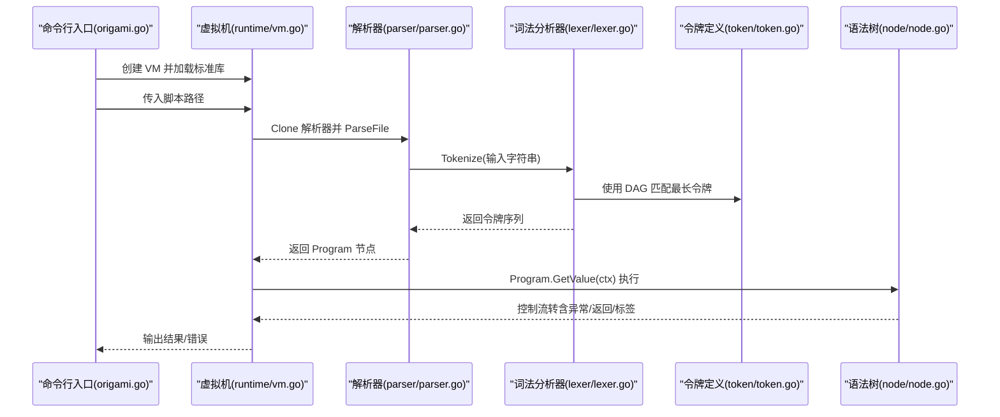
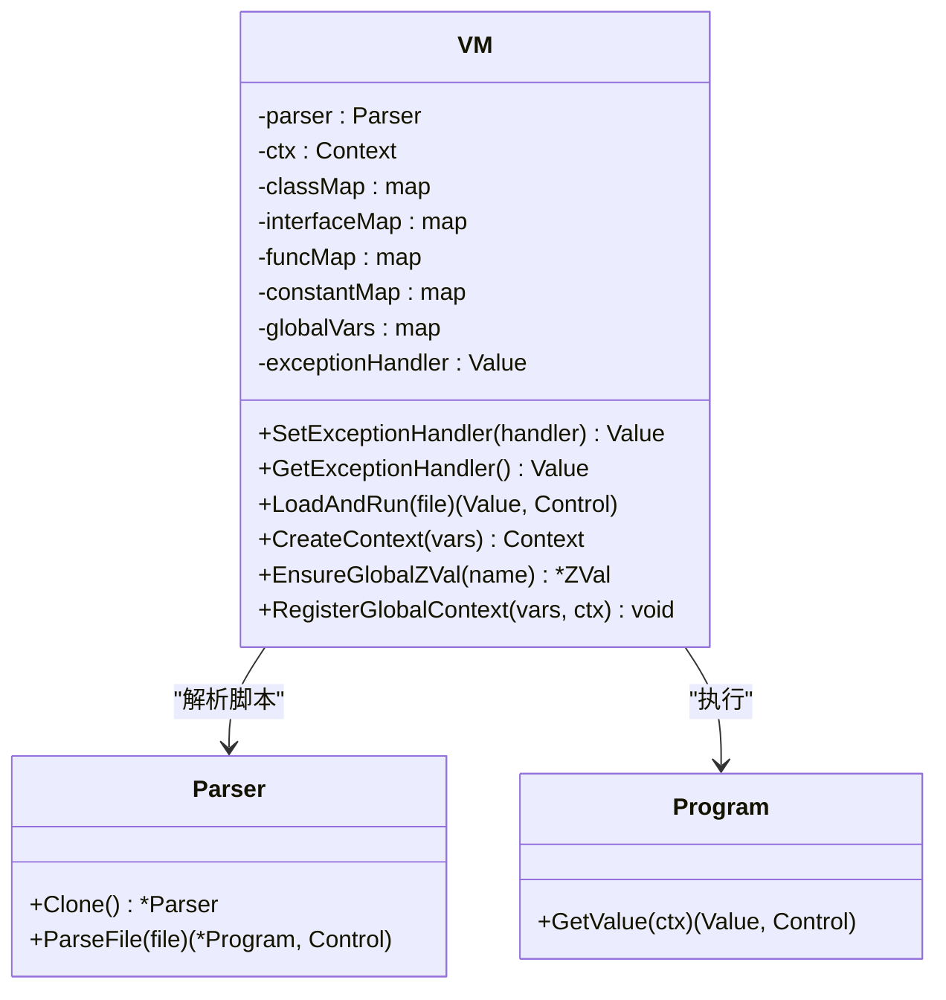
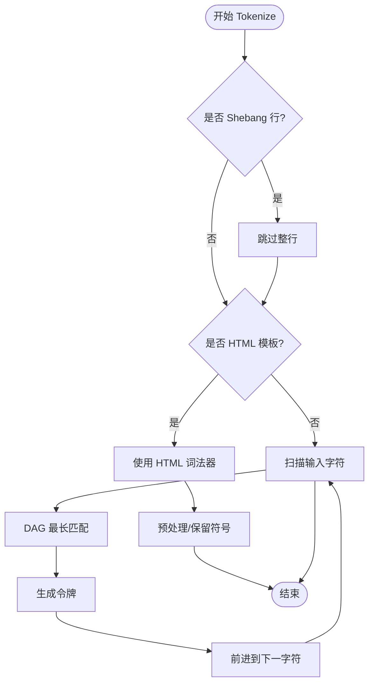
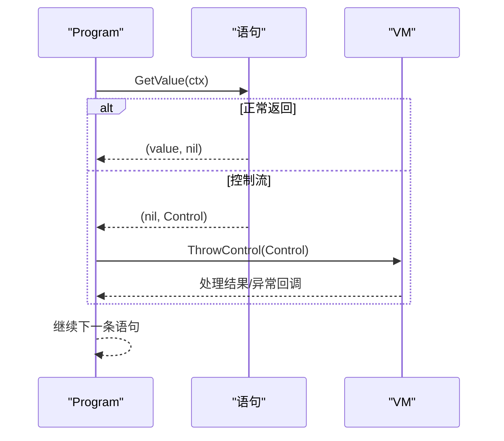
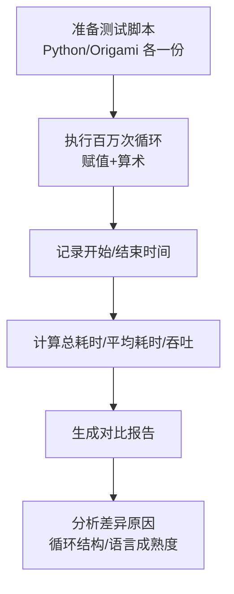
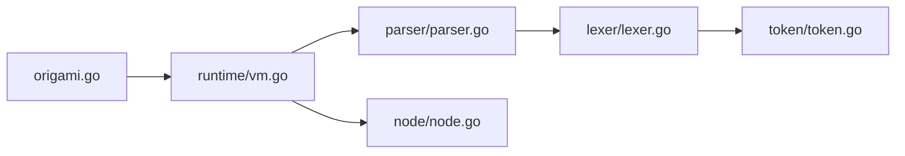

# 性能分析

<cite>
**本文档引用的文件**
- [performance_test.py](file://performance_test.py)
- [performance_test.zy](file://performance_test.zy)
- [performance_comparison.md](file://performance_comparison.md)
- [origami.go](file://origami.go)
- [runtime/vm.go](file://runtime/vm.go)
- [parser/parser.go](file://parser/parser.go)
- [lexer/lexer.go](file://lexer/lexer.go)
- [token/token.go](file://token/token.go)
- [node/node.go](file://node/node.go)
- [std/database/sql/db_stats_method.go](file://std/database/sql/db_stats_method.go)
</cite>

## 目录
1. [简介](#简介)
2. [项目结构](#项目结构)
3. [核心组件](#核心组件)
4. [架构总览](#架构总览)
5. [详细组件分析](#详细组件分析)
6. [依赖分析](#依赖分析)
7. [性能考虑](#性能考虑)
8. [故障排查指南](#故障排查指南)
9. [结论](#结论)
10. [附录](#附录)

## 简介
本文件围绕 Origami 的性能分析能力与实践展开，系统阐述性能测试设计原理、基准测试方法、性能指标定义、测试环境配置、性能对比分析（与 Python 3 的对比）、性能测试工具使用方法、性能优化策略（编译器/运行时/内存方向）、性能监控集成与生产观察技巧，以及常见瓶颈识别与解决方案的实用案例。文档面向不同技术背景读者，既提供高层概览，也给出代码级可视化图示与定位依据。

## 项目结构
与性能分析直接相关的文件主要分布在以下模块：
- 基准测试脚本：Python 与 Origami 脚本各一份，用于对比基础赋值/算术操作的吞吐与延迟
- 性能对比报告：汇总测试结果、比率与分析
- 运行时虚拟机：负责加载与执行脚本，承载性能关键路径
- 解析器与词法分析器：负责将脚本文本转为语法树，是性能敏感环节之一
- 语法树节点：程序执行的最小单元，承载 GetValue 控制流
- 数据与类型：统一的值模型与调用接口，支撑运行时性能
- 标准库扩展：数据库统计方法等，便于生产环境性能观测

图表来源
- [origami.go:34-67](file://origami.go#L34-L67)
- [runtime/vm.go:14-33](file://runtime/vm.go#L14-L33)
- [parser/parser.go:86-122](file://parser/parser.go#L86-L122)
- [lexer/lexer.go:88-248](file://lexer/lexer.go#L88-L248)
- [token/token.go:34-181](file://token/token.go#L34-L181)
- [node/node.go:44-70](file://node/node.go#L44-L70)
- [std/database/sql/db_stats_method.go:8-29](file://std/database/sql/db_stats_method.go#L8-L29)

章节来源
- [origami.go:34-67](file://origami.go#L34-L67)
- [runtime/vm.go:14-33](file://runtime/vm.go#L14-L33)
- [parser/parser.go:86-122](file://parser/parser.go#L86-L122)
- [lexer/lexer.go:88-248](file://lexer/lexer.go#L88-L248)
- [token/token.go:34-181](file://token/token.go#L34-L181)
- [node/node.go:44-70](file://node/node.go#L44-L70)
- [std/database/sql/db_stats_method.go:8-29](file://std/database/sql/db_stats_method.go#L8-L29)

## 核心组件
- 运行时虚拟机（VM）：负责解析文件、创建上下文、注册全局变量、执行程序节点，是性能测试与实际运行的核心载体
- 解析器（Parser）：负责将文件内容 Token 化、构建语法树、管理作用域与命名空间，直接影响解析阶段的性能
- 词法分析器（Lexer）：基于 DAG 的高效匹配算法，决定 Token 化效率
- 语法树节点（Program/Node）：承载 GetValue 执行流程与控制转移（如 return/goto/label）
- 基准测试脚本：Python 与 Origami 的等效循环赋值/算术测试，用于对比基础性能
- 性能对比报告：量化指标与差异分析，指导优化方向

章节来源
- [runtime/vm.go:14-33](file://runtime/vm.go#L14-L33)
- [parser/parser.go:36-50](file://parser/parser.go#L36-L50)
- [lexer/lexer.go:53-67](file://lexer/lexer.go#L53-L67)
- [node/node.go:30-42](file://node/node.go#L30-L42)
- [performance_test.py:7-36](file://performance_test.py#L7-L36)
- [performance_test.zy:3-33](file://performance_test.zy#L3-L33)
- [performance_comparison.md:1-54](file://performance_comparison.md#L1-L54)

## 架构总览
下图展示从命令行入口到脚本执行的端到端流程，标注性能关键点与数据流：

图表来源
- [origami.go:34-67](file://origami.go#L34-L67)
- [runtime/vm.go:275-289](file://runtime/vm.go#L275-L289)
- [parser/parser.go:86-122](file://parser/parser.go#L86-L122)
- [lexer/lexer.go:88-248](file://lexer/lexer.go#L88-L248)
- [token/token.go:34-181](file://token/token.go#L34-L181)
- [node/node.go:44-70](file://node/node.go#L44-L70)

## 详细组件分析

### 组件一：运行时虚拟机（VM）
- 职责：创建解析器、初始化全局命名空间、加载标准库、解析并执行脚本、管理全局变量与异常处理回调
- 性能要点：
  - 解析克隆与上下文创建的成本
  - 全局变量注册与 ZVal 确保的并发安全（读写锁）
  - 异常处理回调链路的短路与递归防护
- 关键路径：LoadAndRun → ParseFile → Program.GetValue → 控制流处理

图表来源
- [runtime/vm.go:14-33](file://runtime/vm.go#L14-L33)
- [runtime/vm.go:275-289](file://runtime/vm.go#L275-L289)
- [parser/parser.go:62-80](file://parser/parser.go#L62-L80)
- [node/node.go:30-42](file://node/node.go#L30-L42)

章节来源
- [runtime/vm.go:14-33](file://runtime/vm.go#L14-L33)
- [runtime/vm.go:275-289](file://runtime/vm.go#L275-L289)
- [runtime/vm.go:361-390](file://runtime/vm.go#L361-L390)

### 组件二：解析器与词法分析器
- 解析器（Parser）：
  - 支持 .php 与 .zy 两种脚本格式，统一 Tokenize 流程
  - 作用域管理、命名空间解析、类/接口/函数注册
  - 错误收集与堆栈追踪
- 词法分析器（Lexer）：
  - 基于 DAG 的最长匹配算法，提升 Token 化效率
  - 支持插值字符串、Shebang 忽略、HTML 模板模式
- 性能要点：
  - Token 化复杂度与输入规模、关键字密度相关
  - DAG 匹配减少回溯，适合大量关键字的语言

图表来源
- [lexer/lexer.go:88-248](file://lexer/lexer.go#L88-L248)
- [lexer/lexer.go:250-302](file://lexer/lexer.go#L250-L302)
- [lexer/lexer.go:304-349](file://lexer/lexer.go#L304-L349)
- [token/token.go:34-181](file://token/token.go#L34-L181)

章节来源
- [parser/parser.go:86-122](file://parser/parser.go#L86-L122)
- [parser/parser.go:251-298](file://parser/parser.go#L251-L298)
- [lexer/lexer.go:88-248](file://lexer/lexer.go#L88-L248)
- [lexer/lexer.go:250-349](file://lexer/lexer.go#L250-L349)
- [token/token.go:34-181](file://token/token.go#L34-L181)

### 组件三：语法树执行与控制流
- Program.GetValue 遍历语句，逐条执行并处理控制流（返回、标签、goto 等）
- 异常处理通过 VM 的 ThrowControl 统一调度，支持用户自定义回调与默认降级

图表来源
- [node/node.go:44-70](file://node/node.go#L44-L70)
- [runtime/vm.go:69-104](file://runtime/vm.go#L69-L104)

章节来源
- [node/node.go:44-70](file://node/node.go#L44-L70)
- [runtime/vm.go:69-104](file://runtime/vm.go#L69-L104)

### 组件四：性能测试与对比分析
- 基准测试目标：一百万次赋值与加法/乘法，覆盖变量赋值、数学运算与循环开销
- 测试环境：相同循环结构（for/while）对比，确保公平性
- 对比维度：总执行时间、平均每次操作时间、每秒操作次数
- 结果解读：Origami 在解释型语言中表现可接受，差异主要来自语言特性与成熟度

图表来源
- [performance_test.py:7-36](file://performance_test.py#L7-L36)
- [performance_test.zy:3-33](file://performance_test.zy#L3-L33)
- [performance_comparison.md:1-54](file://performance_comparison.md#L1-L54)

章节来源
- [performance_test.py:7-36](file://performance_test.py#L7-L36)
- [performance_test.zy:3-33](file://performance_test.zy#L3-L33)
- [performance_comparison.md:1-54](file://performance_comparison.md#L1-L54)

## 依赖分析
- 入口依赖：命令行入口依赖运行时 VM，VM 依赖解析器与标准库
- 解析依赖：解析器依赖词法分析器与令牌定义；词法分析器依赖令牌定义与预处理
- 执行依赖：运行时 VM 依赖解析器产出的 Program 节点，Program 节点依赖上下文与控制流

图表来源
- [origami.go:34-67](file://origami.go#L34-L67)
- [runtime/vm.go:14-33](file://runtime/vm.go#L14-L33)
- [parser/parser.go:36-50](file://parser/parser.go#L36-L50)
- [lexer/lexer.go:53-67](file://lexer/lexer.go#L53-L67)
- [token/token.go:34-181](file://token/token.go#L34-L181)
- [node/node.go:30-42](file://node/node.go#L30-L42)

章节来源
- [origami.go:34-67](file://origami.go#L34-L67)
- [runtime/vm.go:14-33](file://runtime/vm.go#L14-L33)
- [parser/parser.go:36-50](file://parser/parser.go#L36-L50)
- [lexer/lexer.go:53-67](file://lexer/lexer.go#L53-L67)
- [token/token.go:34-181](file://token/token.go#L34-L181)
- [node/node.go:30-42](file://node/node.go#L30-L42)

## 性能考虑
- 基准测试设计原则
  - 保持测试场景稳定：循环结构、操作类型一致
  - 指标定义清晰：总耗时、平均单次耗时、吞吐（次/秒）
  - 环境一致性：CPU/内存/IO 状态尽量一致
- 解析阶段优化
  - 词法：DAG 匹配减少回溯，避免多余分支；预处理（如 Shebang/HTML）前置
  - 语法：减少不必要的作用域切换与命名空间解析成本
- 运行时优化
  - 上下文与变量：减少全局变量访问次数，合理利用局部变量
  - 异常处理：短路异常回调链路，避免重复解析与递归
- 内存优化
  - 减少中间对象创建，复用 ZVal 与 Value 接口实现
  - 控制树深度与节点数量，避免深层递归带来的栈压力

## 故障排查指南
- 解析错误定位
  - 使用解析器的错误收集与堆栈打印，结合位置信息快速定位
- 运行时异常
  - 通过 VM 的异常处理回调链路，区分用户回调与默认降级
- 性能回归检测
  - 对比历史报告，关注吞吐下降与平均耗时上升
- 生产观察
  - 使用数据库统计方法获取连接池状态，辅助定位慢查询与连接争用

章节来源
- [parser/parser.go:251-298](file://parser/parser.go#L251-L298)
- [runtime/vm.go:69-104](file://runtime/vm.go#L69-L104)
- [std/database/sql/db_stats_method.go:8-29](file://std/database/sql/db_stats_method.go#L8-L29)

## 结论
- Origami 在基础赋值/算术场景下具备可接受的性能水平，解释型语言的特性决定了其与成熟优化语言的差距
- 通过统一的基准测试方法与对比报告，可以持续跟踪性能变化并指导优化
- 运行时 VM、解析器与词法分析器是性能优化的关键路径，建议优先从词法匹配与上下文管理入手

## 附录

### A. 性能测试工具使用方法
- 编写基准测试脚本
  - Python：参考 [performance_test.py:7-36](file://performance_test.py#L7-L36)
  - Origami：参考 [performance_test.zy:3-33](file://performance_test.zy#L3-L33)
- 执行与计时
  - 使用高精度计时（如 Python 的 time.time、PHP 的 microtime(true)）
  - 记录开始/结束时间，计算总耗时与平均单次耗时
- 数据收集与分析
  - 指标：总耗时、平均耗时、吞吐（次/秒）
  - 报告：对比不同语言/版本/循环结构的差异
  - 参考：[performance_comparison.md:1-54](file://performance_comparison.md#L1-L54)

章节来源
- [performance_test.py:7-36](file://performance_test.py#L7-L36)
- [performance_test.zy:3-33](file://performance_test.zy#L3-L33)
- [performance_comparison.md:1-54](file://performance_comparison.md#L1-L54)

### B. 性能监控与生产观察
- 数据库性能观测
  - 使用数据库统计方法获取连接池状态，辅助定位慢查询与连接争用
  - 参考：[std/database/sql/db_stats_method.go:8-29](file://std/database/sql/db_stats_method.go#L8-L29)
- 运行时异常与控制流
  - 通过 VM 的异常处理回调链路，区分用户回调与默认降级
  - 参考：[runtime/vm.go:69-104](file://runtime/vm.go#L69-L104)

章节来源
- [std/database/sql/db_stats_method.go:8-29](file://std/database/sql/db_stats_method.go#L8-L29)
- [runtime/vm.go:69-104](file://runtime/vm.go#L69-L104)

### C. 实用案例：瓶颈识别与优化
- 案例一：循环结构差异
  - 现象：不同循环结构导致性能差异
  - 处理：统一循环结构（如都使用 for/while），确保公平对比
  - 参考：[performance_comparison.md:53-54](file://performance_comparison.md#L53-L54)
- 案例二：词法匹配热点
  - 现象：大量关键字导致 Token 化变慢
  - 处理：优化 DAG 匹配策略，减少回溯；必要时引入缓存
  - 参考：[lexer/lexer.go:250-349](file://lexer/lexer.go#L250-L349)，[token/token.go:34-181](file://token/token.go#L34-L181)
- 案例三：上下文与变量访问
  - 现象：频繁访问全局变量造成性能下降
  - 处理：将常用变量提升至局部作用域，减少全局访问
  - 参考：[runtime/vm.go:361-390](file://runtime/vm.go#L361-L390)

章节来源
- [performance_comparison.md:53-54](file://performance_comparison.md#L53-L54)
- [lexer/lexer.go:250-349](file://lexer/lexer.go#L250-L349)
- [token/token.go:34-181](file://token/token.go#L34-L181)
- [runtime/vm.go:361-390](file://runtime/vm.go#L361-L390)