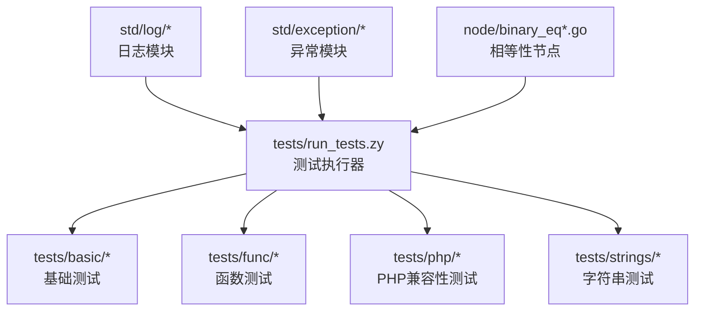
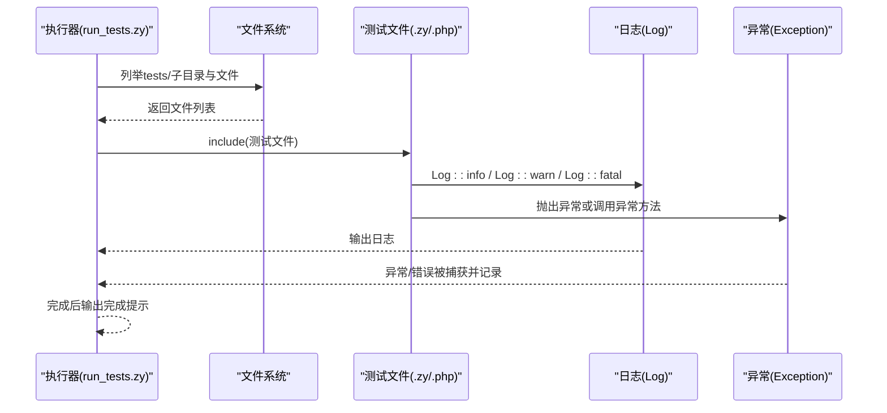
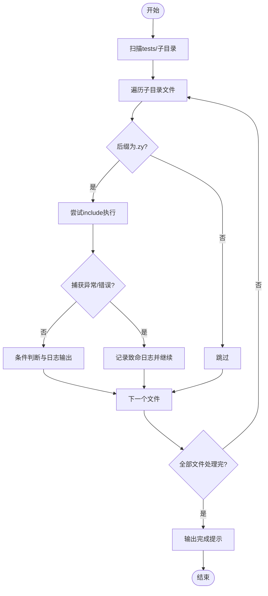
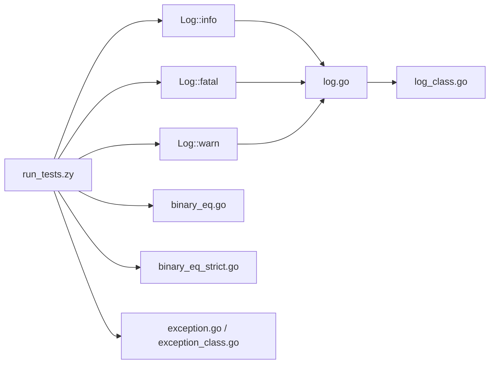

# 测试框架

<cite>
**本文引用的文件**   
- [tests/README.md](file://tests/README.md)
- [tests/run_tests.zy](file://tests/run_tests.zy)
- [tests/basic/001.zy](file://tests/basic/001.zy)
- [tests/basic/002.zy](file://tests/basic/002.zy)
- [tests/basic/003.zy](file://tests/basic/003.zy)
- [tests/func/001.zy](file://tests/func/001.zy)
- [tests/func/included/included.zy](file://tests/func/included/included.zy)
- [tests/php/array_access_test.php](file://tests/php/array_access_test.php)
- [tests/strings/length.zy](file://tests/strings/length.zy)
- [std/log/log.go](file://std/log/log.go)
- [std/log/log_class.go](file://std/log/log_class.go)
- [std/log/log_info_method.go](file://std/log/log_info_method.go)
- [std/log/log_fatal_method.go](file://std/log/log_fatal_method.go)
- [std/log/log_warn_method.go](file://std/log/log_warn_method.go)
- [std/exception/exception.go](file://std/exception/exception.go)
- [std/exception/exception_class.go](file://std/exception/exception_class.go)
- [node/binary_eq.go](file://node/binary_eq.go)
- [node/binary_eq_strict.go](file://node/binary_eq_strict.go)
</cite>

## 目录
1. [简介](#简介)
2. [项目结构](#项目结构)
3. [核心组件](#核心组件)
4. [架构总览](#架构总览)
5. [详细组件分析](#详细组件分析)
6. [依赖分析](#依赖分析)
7. [性能考虑](#性能考虑)
8. [故障排查指南](#故障排查指南)
9. [结论](#结论)
10. [附录](#附录)

## 简介
本文件系统性介绍 Origami 的测试框架与运行机制，覆盖测试套件的组织结构（基础测试 basic、函数测试 func、PHP 兼容性测试 php、字符串测试 strings）、测试文件命名与执行流程、结果报告方式、断言与异常处理、覆盖率与持续集成建议，以及调试测试失败的最佳实践。文档以仓库现有实现为依据，避免臆造未在代码中出现的功能。

## 项目结构
测试相关的核心目录与文件如下：
- tests/：测试根目录，包含按主题分类的子目录与运行脚本
  - basic/：基础语法与运算符测试
  - func/：函数与作用域相关测试
  - php/：PHP 兼容性测试（含大量 PHP 标准库函数与特性）
  - strings/：字符串方法测试
  - run_tests.zy：测试执行器，负责遍历并执行各分类下的测试文件
  - README.md：简要说明
- std/log/：日志模块，提供 info/fatal/warn 等日志方法，用于测试断言与结果输出
- std/exception/：异常类与方法，用于异常场景测试
- node/：运算节点实现，如相等性比较（宽松与严格），用于断言底层实现

图表来源
- [tests/run_tests.zy:1-30](file://tests/run_tests.zy#L1-L30)
- [tests/basic/001.zy:1-7](file://tests/basic/001.zy#L1-L7)
- [tests/func/001.zy:1-7](file://tests/func/001.zy#L1-L7)
- [tests/php/array_access_test.php:1-185](file://tests/php/array_access_test.php#L1-L185)
- [tests/strings/length.zy:1-53](file://tests/strings/length.zy#L1-L53)
- [std/log/log.go:1-109](file://std/log/log.go#L1-L109)
- [std/exception/exception.go:1-22](file://std/exception/exception.go#L1-L22)
- [node/binary_eq.go:1-35](file://node/binary_eq.go#L1-L35)
- [node/binary_eq_strict.go:1-91](file://node/binary_eq_strict.go#L1-L91)

章节来源
- [tests/README.md:1-4](file://tests/README.md#L1-L4)
- [tests/run_tests.zy:1-30](file://tests/run_tests.zy#L1-L30)

## 核心组件
- 测试执行器：tests/run_tests.zy
  - 功能：扫描 tests/ 下的子目录，遍历其中的测试文件，按顺序 include 执行；对 .zy 文件进行过滤；捕获异常与错误并记录致命日志。
  - 关键点：使用 Log::info 输出执行进度；使用 Log::fatal 记录错误；最后输出完成提示。
- 日志模块：std/log/*
  - 提供 Log::info、Log::fatal、Log::warn 等静态方法，用于测试中的断言结果输出与错误终止。
- 异常模块：std/exception/*
  - 提供 Exception 类及其方法，用于异常场景测试（例如抛出异常、获取消息、堆栈信息）。
- 相等性节点：node/binary_eq.go、node/binary_eq_strict.go
  - 实现宽松与严格相等比较，用于测试中对值的断言（如 if 条件判断）。

章节来源
- [tests/run_tests.zy:1-30](file://tests/run_tests.zy#L1-L30)
- [std/log/log.go:1-109](file://std/log/log.go#L1-L109)
- [std/log/log_class.go:1-113](file://std/log/log_class.go#L1-L113)
- [std/exception/exception.go:1-22](file://std/exception/exception.go#L1-L22)
- [std/exception/exception_class.go:1-90](file://std/exception/exception_class.go#L1-L90)
- [node/binary_eq.go:1-35](file://node/binary_eq.go#L1-L35)
- [node/binary_eq_strict.go:1-91](file://node/binary_eq_strict.go#L1-L91)

## 架构总览
测试执行流程由执行器驱动，按目录分层组织测试，测试文件内部通过条件判断与日志输出实现断言效果。异常模块与相等性节点为断言提供底层能力。

图表来源
- [tests/run_tests.zy:7-28](file://tests/run_tests.zy#L7-L28)
- [std/log/log_info_method.go:15-28](file://std/log/log_info_method.go#L15-L28)
- [std/log/log_fatal_method.go:15-27](file://std/log/log_fatal_method.go#L15-L27)
- [std/log/log_warn_method.go:15-27](file://std/log/log_warn_method.go#L15-L27)
- [std/exception/exception.go:7-22](file://std/exception/exception.go#L7-L22)

## 详细组件分析

### 测试套件组织与命名规范
- 目录划分
  - basic：基础语法与运算符测试，如加减乘除、取余、字符串长度与切片等。
  - func：函数定义与调用、include 等行为测试。
  - php：PHP 兼容性测试，覆盖大量 PHP 标准库函数与语言特性。
  - strings：字符串方法测试，如 length、startsWith、endsWith、replace、split 等。
- 命名规范
  - tests/basic/：以数字编号命名（如 001.zy、002.zy、003.zy 等）。
  - tests/func/：以数字编号命名（如 001.zy、002.zy 等），包含 included/ 子目录用于 include 测试。
  - tests/php/：混合 .php 与 .zy 文件，部分文件以 _test.php 结尾，体现兼容性测试特征。
  - tests/strings/：以方法名命名（如 length.zy、startsWith.zy 等）。
- 执行器规则
  - tests/run_tests.zy 仅执行 .zy 后缀文件，其他文件被跳过。

章节来源
- [tests/basic/001.zy:1-7](file://tests/basic/001.zy#L1-L7)
- [tests/basic/002.zy:1-37](file://tests/basic/002.zy#L1-L37)
- [tests/basic/003.zy:1-47](file://tests/basic/003.zy#L1-L47)
- [tests/func/001.zy:1-7](file://tests/func/001.zy#L1-L7)
- [tests/func/included/included.zy:1-3](file://tests/func/included/included.zy#L1-L3)
- [tests/php/array_access_test.php:1-185](file://tests/php/array_access_test.php#L1-L185)
- [tests/strings/length.zy:1-53](file://tests/strings/length.zy#L1-L53)
- [tests/run_tests.zy:14-19](file://tests/run_tests.zy#L14-L19)

### 测试运行机制与结果报告
- 扫描与执行
  - 执行器遍历 tests/ 目录，对每个子目录再次遍历，仅 include 后缀为 .zy 的文件。
  - 对每个文件执行 include，期间捕获 Exception 与 Error 并记录致命日志。
- 结果输出
  - 成功路径：使用 Log::info 输出“执行文件”与“测试通过/失败”的提示。
  - 失败路径：使用 Log::fatal 输出错误信息，fatal 方法会终止进程。
- 完成提示
  - 所有文件执行完毕后，输出“🎉 接口功能测试完成”。

图表来源
- [tests/run_tests.zy:7-28](file://tests/run_tests.zy#L7-L28)
- [std/log/log.go:67-72](file://std/log/log.go#L67-L72)

章节来源
- [tests/run_tests.zy:1-30](file://tests/run_tests.zy#L1-L30)
- [std/log/log.go:67-72](file://std/log/log.go#L67-L72)

### 断言与测试编写指南
- 相等性断言
  - 宽松相等：通过 if 条件判断实现，底层对应 node/binary_eq.go。
  - 严格相等：通过 node/binary_eq_strict.go 实现，适用于需要类型与值均严格的场景。
- 字符串断言
  - 使用字符串方法（如 length）与条件判断组合断言，见 tests/strings/length.zy。
- 日志断言
  - 使用 Log::info 输出“测试通过”，使用 Log::fatal 输出“测试失败”并终止。
- 异常断言
  - 使用 std/exception/* 提供的异常类与方法，验证异常抛出与消息获取。
- 编写建议
  - 单元测试：聚焦单一功能点，使用 Log::info 记录成功，Log::fatal 记录失败。
  - 集成测试：覆盖多模块交互（如 include、函数调用、字符串与数组操作）。
  - 性能测试：可基于时间测量（如 microtime）进行简单对比，但需注意仓库未提供专用性能断言工具。

章节来源
- [node/binary_eq.go:21-35](file://node/binary_eq.go#L21-L35)
- [node/binary_eq_strict.go:24-40](file://node/binary_eq_strict.go#L24-L40)
- [tests/strings/length.zy:6-11](file://tests/strings/length.zy#L6-L11)
- [std/log/log_info_method.go:15-28](file://std/log/log_info_method.go#L15-L28)
- [std/log/log_fatal_method.go:15-27](file://std/log/log_fatal_method.go#L15-L27)
- [std/exception/exception.go:7-22](file://std/exception/exception.go#L7-L22)

### 典型测试样例解析
- 基础运算测试（basic/002.zy）
  - 通过连续的 if 判断与 Log::info/Log::fatal 实现断言。
- 字符串长度测试（strings/length.zy）
  - 使用字符串方法 length() 与条件判断断言长度。
- PHP ArrayAccess 接口测试（php/array_access_test.php）
  - 通过实现 ArrayAccess 接口并覆盖 offsetExists/offsetGet/offsetSet/offsetUnset 等方法，结合断言验证行为。

章节来源
- [tests/basic/002.zy:5-37](file://tests/basic/002.zy#L5-L37)
- [tests/strings/length.zy:6-11](file://tests/strings/length.zy#L6-L11)
- [tests/php/array_access_test.php:64-112](file://tests/php/array_access_test.php#L64-L112)

## 依赖分析
- 执行器依赖
  - tests/run_tests.zy 依赖文件系统扫描与 include 机制，以及日志模块进行输出。
- 日志模块
  - std/log/log.go 提供格式化输出与级别控制；log_class.go 暴露静态方法；info/fatal/warn 方法分别在各自文件中实现。
- 异常模块
  - std/exception/exception.go 定义异常类；exception_class.go 暴露方法（如 getMessage、getTraceAsString）。
- 相等性节点
  - node/binary_eq.go 与 node/binary_eq_strict.go 为断言提供底层比较逻辑。

图表来源
- [tests/run_tests.zy:13-24](file://tests/run_tests.zy#L13-L24)
- [std/log/log.go:67-108](file://std/log/log.go#L67-L108)
- [std/log/log_class.go:58-96](file://std/log/log_class.go#L58-L96)
- [node/binary_eq.go:21-35](file://node/binary_eq.go#L21-L35)
- [node/binary_eq_strict.go:24-40](file://node/binary_eq_strict.go#L24-L40)
- [std/exception/exception.go:7-22](file://std/exception/exception.go#L7-L22)
- [std/exception/exception_class.go:68-87](file://std/exception/exception_class.go#L68-L87)

章节来源
- [tests/run_tests.zy:1-30](file://tests/run_tests.zy#L1-L30)
- [std/log/log.go:1-109](file://std/log/log.go#L1-L109)
- [std/log/log_class.go:1-113](file://std/log/log_class.go#L1-L113)
- [node/binary_eq.go:1-35](file://node/binary_eq.go#L1-L35)
- [node/binary_eq_strict.go:1-91](file://node/binary_eq_strict.go#L1-L91)
- [std/exception/exception.go:1-22](file://std/exception/exception.go#L1-L22)
- [std/exception/exception_class.go:1-90](file://std/exception/exception_class.go#L1-L90)

## 性能考虑
- 当前仓库未提供专门的性能测试断言或覆盖率统计工具。性能测试可基于时间测量（如 microtime）进行粗略对比，但需注意：
  - 测试环境与数据规模对结果影响较大；
  - 建议固定输入规模与重复次数，确保可复现性；
  - 将性能测试与功能测试分离，避免相互干扰。

## 故障排查指南
- 执行器报错
  - 现象：执行过程中记录致命日志并终止。
  - 排查：查看 tests/run_tests.zy 的异常捕获分支，定位具体文件与错误信息。
- 测试失败
  - 现象：测试文件中使用 Log::fatal 输出“测试失败”。
  - 排查：根据失败位置检查断言条件与输入数据，确认是否满足预期。
- 日志级别与输出
  - 现象：仅能看到 info/warn/fatal 输出，无详细堆栈。
  - 措施：在需要时扩展日志输出或引入更详细的诊断信息。

章节来源
- [tests/run_tests.zy:20-24](file://tests/run_tests.zy#L20-L24)
- [std/log/log.go:67-72](file://std/log/log.go#L67-L72)

## 结论
Origami 的测试框架以 tests/run_tests.zy 为核心，采用“目录分类 + 条件断言 + 日志输出”的轻量模式，覆盖基础语法、函数行为、PHP 兼容性与字符串方法等关键领域。通过 Log 与 Exception 模块，测试具备清晰的结果输出与异常处理能力。建议后续补充专用断言 API、覆盖率统计与 CI 集成配置，以进一步提升测试体系的完整性与自动化水平。

## 附录
- 测试编写清单
  - 单元测试：针对单一功能，使用 if 条件与 Log::info/Log::fatal 组合断言。
  - 集成测试：覆盖 include、函数调用、字符串与数组等跨模块行为。
  - 性能测试：基于时间测量进行对比，注意固定输入与重复次数。
- 持续集成建议
  - 在 CI 中调用测试执行器，收集日志输出作为测试报告。
  - 可选：将 Log::fatal 的触发视为失败指标，配合构建状态反馈。
  - 可选：增加覆盖率统计（如在执行器中统计执行过的测试文件数量），并与阈值联动。