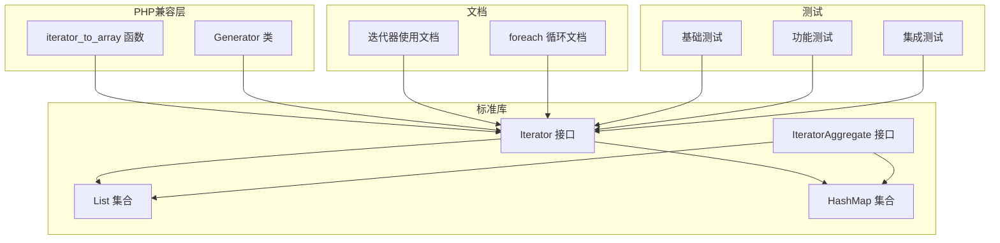
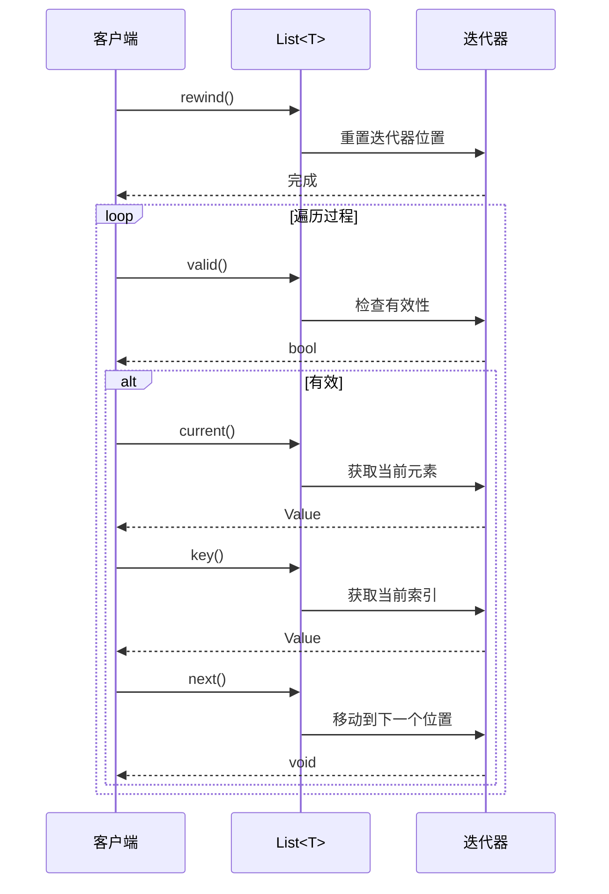
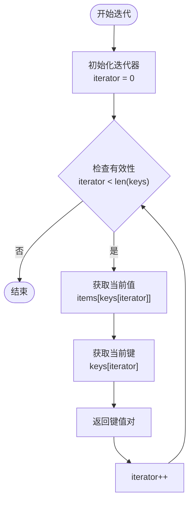
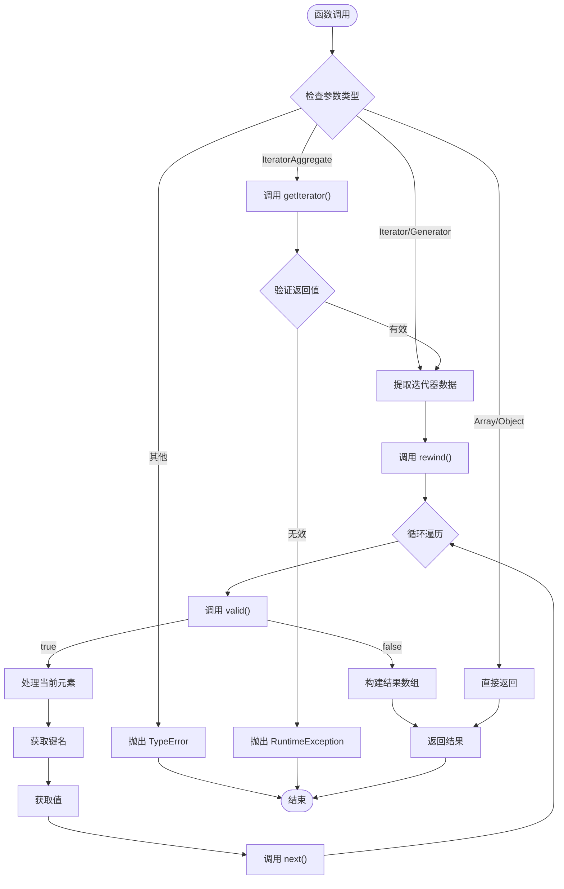
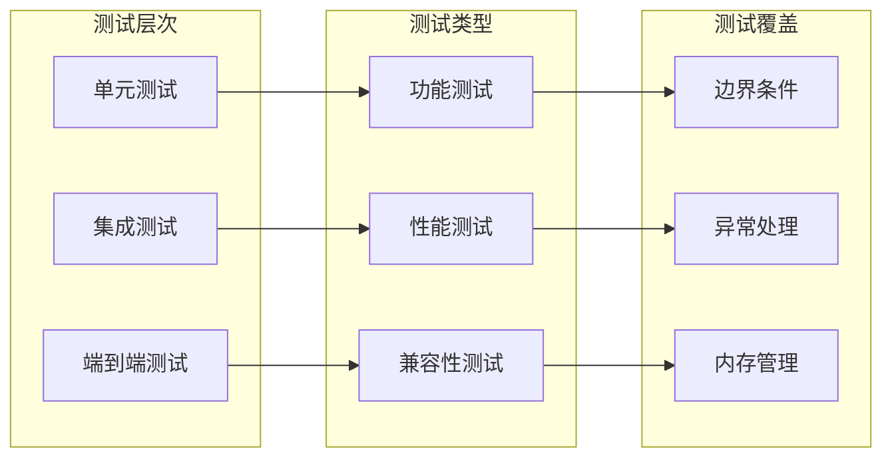
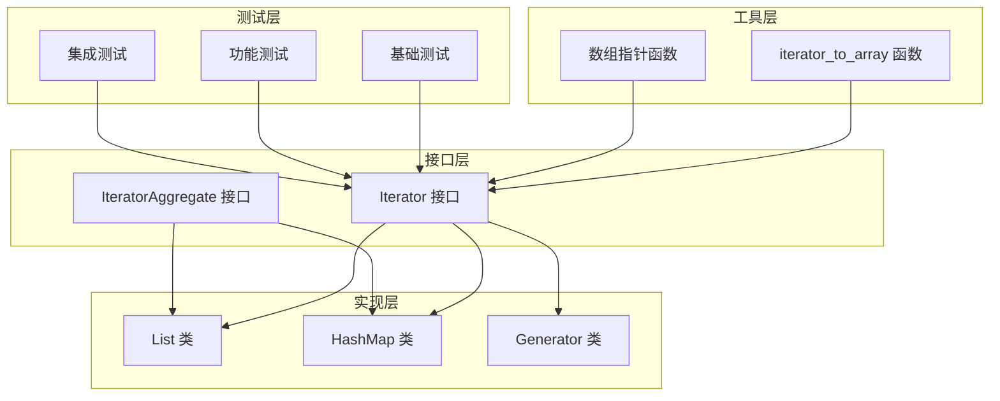

# PHP迭代器测试框架

<cite>
**本文档引用的文件**
- [README.md](file://README.md)
- [iterator.md](file://docs/iterator.md)
- [iterator-foreach.md](file://docs/iterator-foreach.md)
- [load.go](file://std/loop/load.go)
- [iterator_aggregate_interface.go](file://std/loop/iterator_aggregate_interface.go)
- [list_class.go](file://std/loop/list_class.go)
- [hashmap_class.go](file://std/loop/hashmap_class.go)
- [iterator_to_array.go](file://std/php/iterator_to_array.go)
- [test_iterator_to_array.zy](file://test_iterator_to_array.zy)
- [value_generator.go](file://data/value_generator.go)
- [generator_class.go](file://node/generator_class.go)
- [value_array.go](file://data/value_array.go)
- [array_pointer.zy](file://tests/php/array_pointer.zy)
- [array_pop.zy](file://tests/php/array_pop.zy)
- [array_push.zy](file://tests/php/array_push.zy)
</cite>

## 目录
1. [简介](#简介)
2. [项目结构](#项目结构)
3. [核心组件](#核心组件)
4. [架构概览](#架构概览)
5. [详细组件分析](#详细组件分析)
6. [依赖关系分析](#依赖关系分析)
7. [性能考量](#性能考量)
8. [故障排除指南](#故障排除指南)
9. [结论](#结论)
10. [附录](#附录)

## 简介
本项目是一个基于 Origami 语言的 PHP 迭代器测试框架，专注于验证和演示语言内置的迭代器接口、List<T> 和 HashMap<K,V> 集合类，以及与 PHP 兼容的迭代器工具函数（如 iterator_to_array）。框架通过标准的 Iterator 接口和 foreach 循环支持，提供了统一的数据遍历体验，并包含完整的测试用例和文档。

## 项目结构
该项目采用模块化设计，主要分为以下几个部分：
- 标准库模块：包含迭代器接口定义、List 和 HashMap 集合类
- PHP 兼容层：提供与 PHP 兼容的迭代器工具函数
- 文档模块：详细的使用文档和最佳实践
- 测试模块：覆盖各种迭代器场景的测试用例
- 数据结构模块：底层的数据值和类型系统



**图表来源**
- [load.go:25-31](file://std/loop/load.go#L25-L31)
- [iterator_aggregate_interface.go:11-17](file://std/loop/iterator_aggregate_interface.go#L11-L17)

**章节来源**
- [README.md:1-69](file://README.md#L1-L69)

## 核心组件
框架的核心由三个主要组件构成：

### 1. 迭代器接口系统
- **Iterator 接口**：定义了标准的迭代器方法集合
- **IteratorAggregate 接口**：支持通过 getIterator() 方法返回可迭代对象
- **Generator 类**：原生支持协程和生成器

### 2. 集合数据结构
- **List<T> 泛型列表**：支持类型安全的动态数组
- **HashMap<K,V> 泛型哈希表**：支持键值对存储和检索

### 3. PHP 兼容工具
- **iterator_to_array 函数**：将任意可迭代对象转换为数组
- **数组指针函数**：reset()、current()、key()、next()、end() 等

**章节来源**
- [load.go:8-31](file://std/loop/load.go#L8-L31)
- [list_class.go:7-21](file://std/loop/list_class.go#L7-L21)
- [hashmap_class.go:7-25](file://std/loop/hashmap_class.go#L7-L25)

## 架构概览
框架采用分层架构设计，确保各组件之间的松耦合和高内聚：

```mermaid
classDiagram
class Iterator {
<<interface>>
+current() mixed
+key() mixed
+next() void
+rewind() void
+valid() bool
}
class IteratorAggregate {
<<interface>>
+getIterator() Traversable
}
class T[] {
-items : []Value
-iterator : int
-itemType : Types
+Add(item Value)
+Get(index int) (Value, bool)
+Set(index int, item Value) bool
+Current() Value
+Key() Value
+Next() void
+Rewind() void
+Valid() bool
}
class HashMap~K,V~ {
-items : map[string]Value
-iterator : int
-keys : []string
-keyType : Types
-valueType : Types
+Put(key Value, value Value)
+Get(key Value) (Value, bool)
+Remove(key Value) bool
+Current() Value
+Key() Value
+Next() void
+Rewind() void
+Valid() bool
}
class Generator {
+Valid(ctx) Value
+Current(ctx) Value
+Key(ctx) Value
+Next(ctx) Control
+Rewind(ctx) Value
+Send(ctx, value Value) Control
+Throw(ctx) Control
+GetReturn(ctx) Value
}
Iterator <|.. List
Iterator <|.. HashMap
Iterator <|.. Generator
IteratorAggregate <|.. List
IteratorAggregate <|.. HashMap
```

**图表来源**
- [load.go:9-23](file://std/loop/load.go#L9-L23)
- [list_class.go:142-162](file://std/loop/list_class.go#L142-L162)
- [hashmap_class.go:149-168](file://std/loop/hashmap_class.go#L149-L168)
- [generator_class.go:7-42](file://node/generator_class.go#L7-L42)

## 详细组件分析

### List<T> 集合类
List<T> 是一个类型安全的动态数组实现，提供了完整的迭代器功能：

#### 核心特性
- **类型安全**：通过泛型参数确保元素类型一致性
- **动态扩容**：自动管理底层数组容量
- **完整迭代器支持**：实现 Iterator 接口的所有方法

#### 迭代器实现细节


**图表来源**
- [list_class.go:109-141](file://std/loop/list_class.go#L109-L141)

#### 主要方法分析
- **Add()**：添加元素到末尾
- **Get/Set()**：安全的元素访问和修改
- **Remove()**：按值删除元素
- **ToArray()**：转换为底层数组

**章节来源**
- [list_class.go:23-107](file://std/loop/list_class.go#L23-L107)

### HashMap<K,V> 集合类
HashMap<K,V> 提供了键值对存储和检索功能：

#### 核心特性
- **有序键序列**：维护插入顺序的键列表
- **类型安全**：分别管理键和值的类型
- **高效查找**：O(1) 平均时间复杂度的哈希查找

#### 键值对迭代机制


**图表来源**
- [hashmap_class.go:112-147](file://std/loop/hashmap_class.go#L112-L147)

**章节来源**
- [hashmap_class.go:27-110](file://std/loop/hashmap_class.go#L27-L110)

### iterator_to_array 函数
这是一个关键的 PHP 兼容函数，用于将任意可迭代对象转换为数组：

#### 功能特性
- **多态支持**：支持 Iterator、IteratorAggregate、Generator、数组和对象
- **键名控制**：通过 use_keys 参数控制是否保留原始键名
- **类型转换**：智能处理不同类型的键和值

#### 执行流程


**图表来源**
- [iterator_to_array.go:21-81](file://std/php/iterator_to_array.go#L21-L81)

**章节来源**
- [iterator_to_array.go:11-81](file://std/php/iterator_to_array.go#L11-L81)

### 测试框架实现
框架包含完整的测试套件，验证各种迭代器场景：

#### 基础测试用例
- **数组指针函数测试**：验证 reset()、current()、key()、next()、end() 的行为
- **数组操作测试**：测试 array_pop() 和 array_push() 的功能
- **自定义迭代器测试**：验证用户实现的 Iterator 接口

#### 测试策略


**图表来源**
- [array_pointer.zy:1-175](file://tests/php/array_pointer.zy#L1-L175)
- [array_pop.zy:1-34](file://tests/php/array_pop.zy#L1-L34)
- [array_push.zy:1-34](file://tests/php/array_push.zy#L1-L34)

**章节来源**
- [test_iterator_to_array.zy:1-89](file://test_iterator_to_array.zy#L1-L89)

## 依赖关系分析

### 组件依赖图


**图表来源**
- [load.go:25-31](file://std/loop/load.go#L25-L31)
- [iterator_to_array.go:28-60](file://std/php/iterator_to_array.go#L28-L60)

### 数据流分析
框架中的数据流遵循以下模式：

1. **接口定义** → **具体实现** → **运行时调用**
2. **输入参数** → **类型检查** → **业务逻辑** → **输出结果**
3. **迭代过程** → **状态管理** → **结果返回**

**章节来源**
- [value_array.go:32-61](file://data/value_array.go#L32-L61)

## 性能考量
框架在设计时充分考虑了性能优化：

### 时间复杂度
- **List<T> 访问**：O(1) 随机访问，O(n) 遍历
- **HashMap<K,V> 查找**：O(1) 平均时间，O(n) 最坏情况
- **迭代器遍历**：O(n) 线性时间复杂度

### 空间复杂度
- **List<T>**：O(n) 存储空间，支持动态扩容
- **HashMap<K,V>**：O(n) 存储空间，包含键列表和哈希表
- **迭代器状态**：O(1) 额外空间

### 优化策略
1. **懒加载**：迭代器状态按需计算
2. **内存复用**：重用内部数组和键列表
3. **类型缓存**：缓存泛型类型信息减少反射开销

## 故障排除指南

### 常见问题及解决方案

#### 1. 迭代器状态错误
**问题描述**：迭代器在遍历过程中出现状态不一致
**解决方案**：
- 确保每次遍历前调用 rewind()
- 避免在迭代过程中修改集合结构
- 使用 foreach 循环替代手动迭代

#### 2. 类型安全错误
**问题描述**：尝试向 List<T> 添加错误类型的元素
**解决方案**：
- 使用正确的泛型参数
- 在添加元素前进行类型检查
- 利用编译时类型检查

#### 3. 内存泄漏问题
**问题描述**：长时间运行后内存使用持续增长
**解决方案**：
- 及时释放不再使用的迭代器
- 避免持有大对象的引用
- 使用垃圾回收机制

#### 4. 性能问题诊断
**问题描述**：迭代操作响应缓慢
**解决方案**：
- 使用 iterator_to_array() 进行批量操作
- 避免在循环中进行昂贵的类型转换
- 考虑使用更合适的数据结构

**章节来源**
- [iterator.md:651-776](file://docs/iterator.md#L651-L776)

## 结论
本 PHP 迭代器测试框架提供了一个完整、类型安全且高性能的迭代器解决方案。通过标准的 Iterator 接口和丰富的集合类实现，框架能够满足大多数数据遍历和处理需求。完善的测试套件确保了代码质量和稳定性，而详细的文档为用户提供了清晰的使用指导。

框架的主要优势包括：
- **类型安全**：通过泛型系统确保编译时类型检查
- **性能优化**：高效的底层实现和内存管理
- **易用性**：简洁的 API 设计和丰富的功能
- **兼容性**：与 PHP 生态系统的良好兼容

## 附录

### 快速开始示例
```php
<?php
// 创建并填充 List<int>
$list = new List<int>();
$list->add(1);
$list->add(2);
$list->add(3);

// 使用 foreach 遍历
foreach ($list as $index => $value) {
    echo "索引: $index, 值: $value\n";
}

// 转换为数组
$array = iterator_to_array($list);
```

### 支持的迭代器类型
- **内置数组**：原生 PHP 数组支持迭代器接口
- **List<T> 集合**：类型安全的动态数组
- **HashMap<K,V> 集合**：键值对存储容器
- **Generator 对象**：协程和生成器支持
- **自定义迭代器**：用户实现的 Iterator 接口

### 相关资源
- [Origami 语言官方文档](https://github.com/php-any/origami)
- [PHP 迭代器手册](https://www.php.net/manual/en/language.iterators.php)
- [Go 语言并发编程](https://golang.org/doc/effective_go#concurrency)