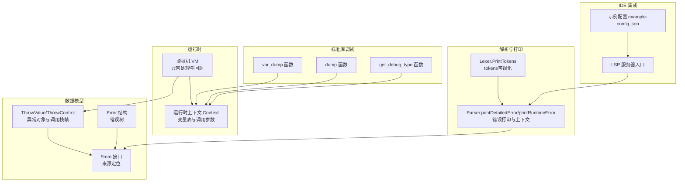
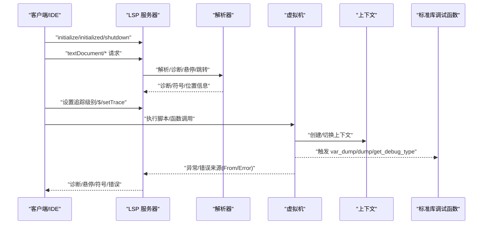
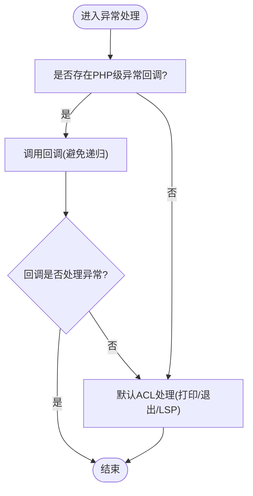
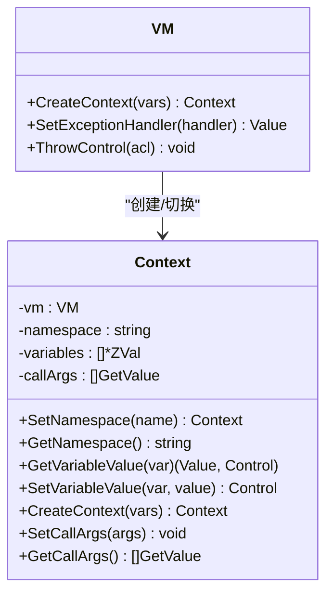
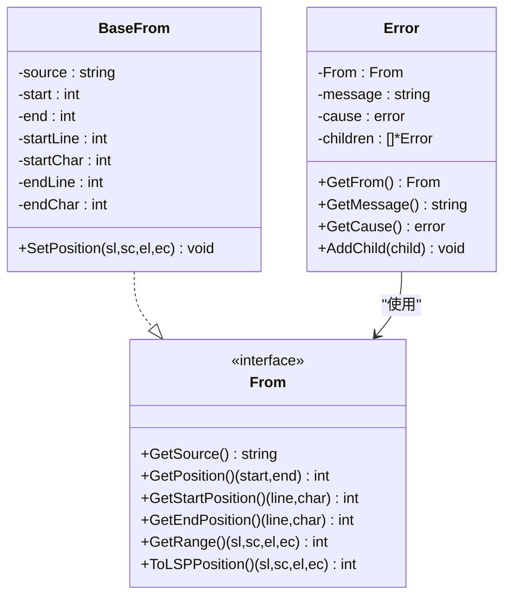
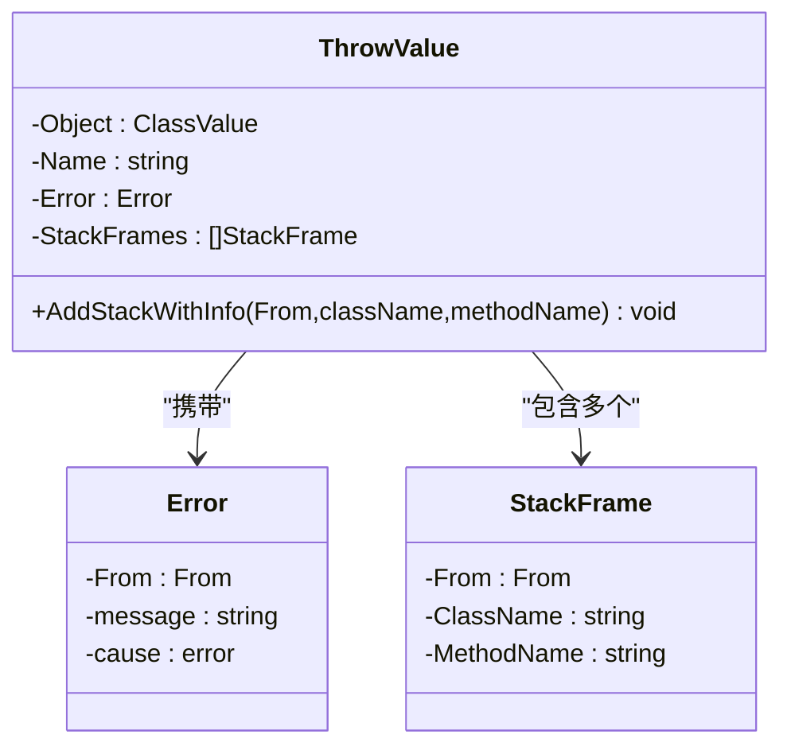
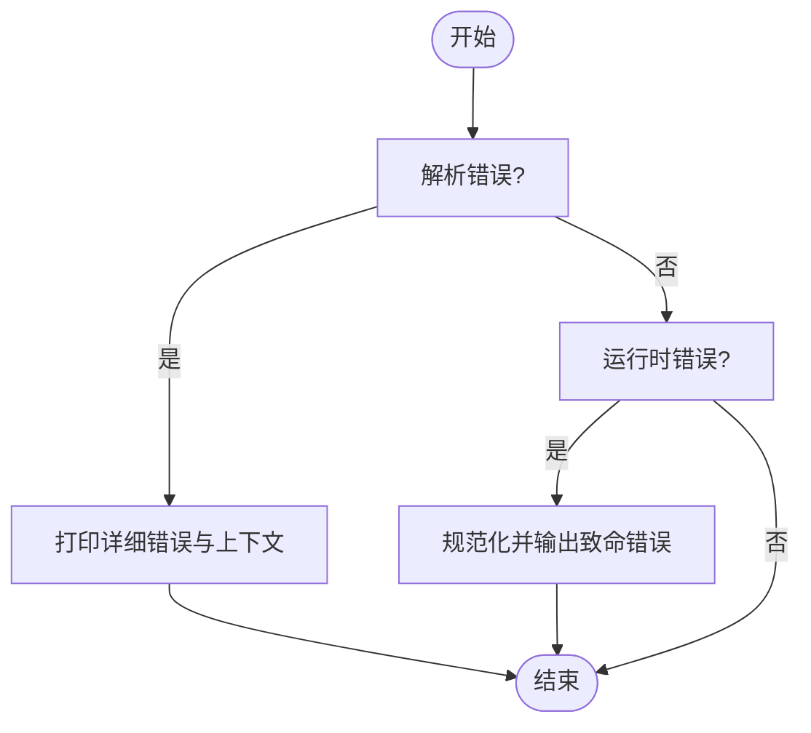
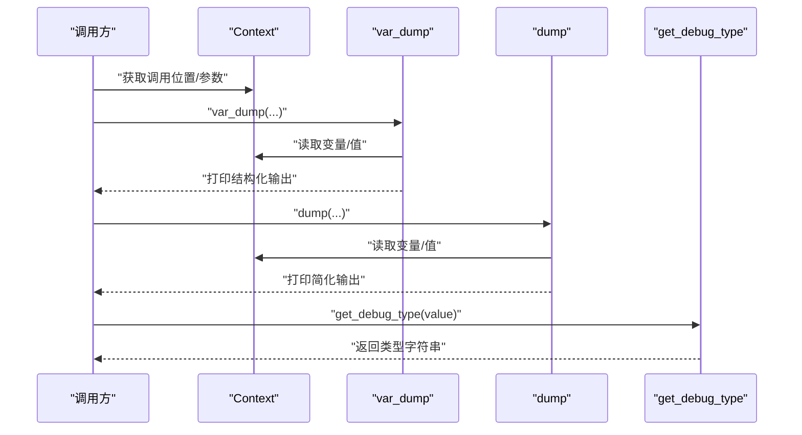
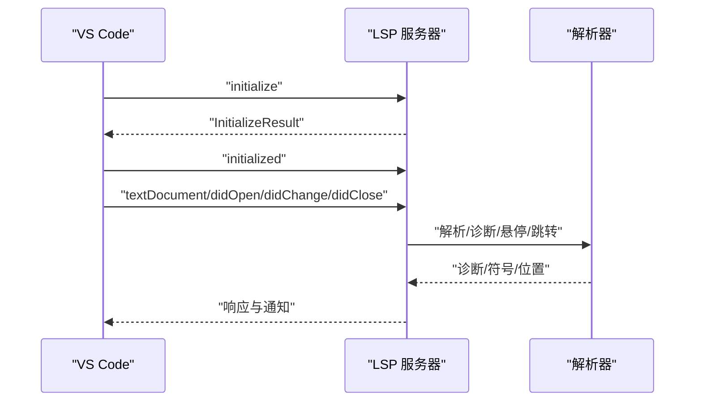
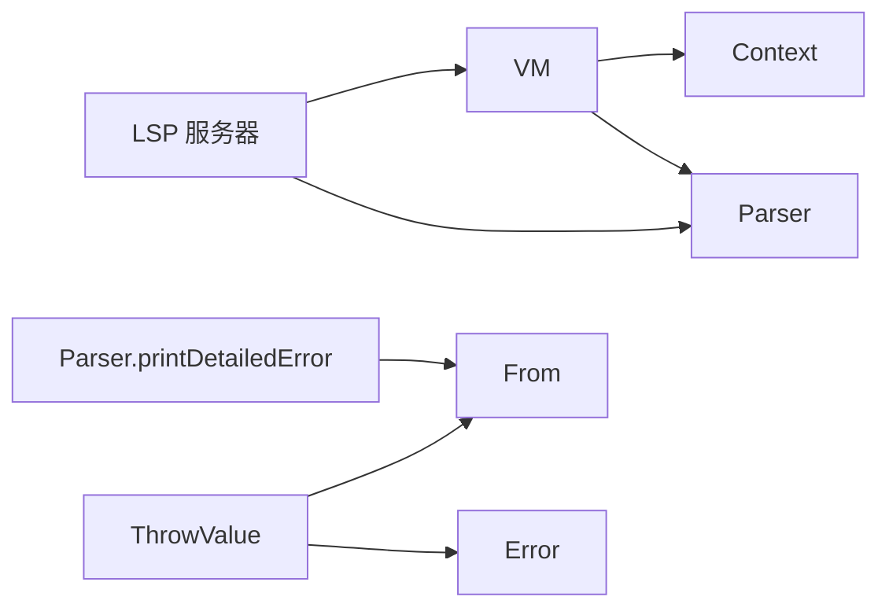

# 调试工具

<cite>
**本文引用的文件**   
- [runtime/vm.go](file://runtime/vm.go)
- [runtime/context.go](file://runtime/context.go)
- [data/from.go](file://data/from.go)
- [data/error.go](file://data/error.go)
- [data/value_throw.go](file://data/value_throw.go)
- [parser/parser_print.go](file://parser/parser_print.go)
- [lexer/debug.go](file://lexer/debug.go)
- [std/php/var_dump.go](file://std/php/var_dump.go)
- [std/dump.go](file://std/dump.go)
- [std/php/get_debug_type.go](file://std/php/get_debug_type.go)
- [tools/lsp/main.go](file://tools/lsp/main.go)
- [tools/lsp/example-config.json](file://tools/lsp/example-config.json)
- [examples/gateway/main.zy](file://examples/gateway/main.zy)
- [.qwen/skills/php-runtime-func-test.md](file://.qwen/skills/php-runtime-func-test.md)
</cite>

## 目录
1. [简介](#简介)
2. [项目结构](#项目结构)
3. [核心组件](#核心组件)
4. [架构总览](#架构总览)
5. [详细组件分析](#详细组件分析)
6. [依赖分析](#依赖分析)
7. [性能考量](#性能考量)
8. [故障排除指南](#故障排除指南)
9. [结论](#结论)
10. [附录](#附录)

## 简介
本文件面向Origami调试工具的使用者与维护者，系统性阐述如何在Origami环境中进行调试：包括断点与单步执行的可行性边界、变量监视、调用栈分析、值打印与类型检查、运行时错误与异常处理、堆栈跟踪生成、调试输出控制，以及IDE集成（LSP）的配置要点。同时提供常见调试场景（内存泄漏倾向、性能问题、并发问题）的实践建议与最佳实践。

## 项目结构
围绕调试能力，Origami的关键模块如下：
- 运行时虚拟机与上下文：负责程序执行、异常抛出与回调、全局变量与上下文管理
- 数据模型与来源定位：提供From接口与Error结构，支撑错误与异常的来源定位
- 解析器与打印：提供语法/运行时错误的详细打印与上下文展示
- 词法分析调试：提供tokens可视化打印，辅助理解词法阶段
- 标准库调试函数：var_dump、dump、get_debug_type等，用于运行时值与类型检查
- LSP服务：提供IDE侧的诊断、悬停、跳转、符号树等能力，支撑断点同步与变量视图的基础

**图表来源**
- [runtime/vm.go:14-116](file://runtime/vm.go#L14-L116)
- [runtime/context.go:12-125](file://runtime/context.go#L12-L125)
- [data/from.go:3-17](file://data/from.go#L3-L17)
- [data/error.go:3-50](file://data/error.go#L3-L50)
- [data/value_throw.go:8-50](file://data/value_throw.go#L8-L50)
- [parser/parser_print.go:11-100](file://parser/parser_print.go#L11-L100)
- [lexer/debug.go:11-61](file://lexer/debug.go#L11-L61)
- [std/php/var_dump.go:12-185](file://std/php/var_dump.go#L12-L185)
- [std/dump.go:9-55](file://std/dump.go#L9-L55)
- [std/php/get_debug_type.go:56-101](file://std/php/get_debug_type.go#L56-L101)
- [tools/lsp/main.go:185-361](file://tools/lsp/main.go#L185-L361)
- [tools/lsp/example-config.json:1-55](file://tools/lsp/example-config.json#L1-L55)

**章节来源**
- [runtime/vm.go:14-116](file://runtime/vm.go#L14-L116)
- [runtime/context.go:12-125](file://runtime/context.go#L12-L125)
- [data/from.go:3-17](file://data/from.go#L3-L17)
- [data/error.go:3-50](file://data/error.go#L3-L50)
- [data/value_throw.go:8-50](file://data/value_throw.go#L8-L50)
- [parser/parser_print.go:11-100](file://parser/parser_print.go#L11-L100)
- [lexer/debug.go:11-61](file://lexer/debug.go#L11-L61)
- [std/php/var_dump.go:12-185](file://std/php/var_dump.go#L12-L185)
- [std/dump.go:9-55](file://std/dump.go#L9-L55)
- [std/php/get_debug_type.go:56-101](file://std/php/get_debug_type.go#L56-L101)
- [tools/lsp/main.go:185-361](file://tools/lsp/main.go#L185-L361)
- [tools/lsp/example-config.json:1-55](file://tools/lsp/example-config.json#L1-L55)

## 核心组件
- 虚拟机与异常处理
  - VM负责类/接口/函数/常量注册、全局变量表、异常回调注册与默认ACL处理
  - 异常处理流程支持PHP级set_exception_handler回调，避免递归调用，并在回调无法处理时回落至默认ACL
- 运行时上下文
  - 提供变量表、命名空间、调用参数记录、上下文创建与替换
- 来源定位与错误模型
  - From接口提供文件、行列号、位置范围等定位信息
  - Error结构支持错误消息、来源、原始错误与子错误树
- 异常对象与调用栈
  - ThrowValue封装异常对象、消息、调用栈帧，支持getTraceAsString等方法
- 错误打印与上下文
  - 解析器提供详细错误打印与上下文展示，运行时错误规范化输出
- 词法tokens可视化
  - Lexer.PrintTokens以表格形式打印tokens，便于词法分析调试
- 标准库调试函数
  - var_dump/dump用于值与类型的打印输出
  - get_debug_type用于类型检查
- LSP服务
  - 提供IDE侧的初始化、文档事件、补全、悬停、定义跳转、符号树、诊断等能力

**章节来源**
- [runtime/vm.go:69-116](file://runtime/vm.go#L69-L116)
- [runtime/context.go:12-125](file://runtime/context.go#L12-L125)
- [data/from.go:3-17](file://data/from.go#L3-L17)
- [data/error.go:3-50](file://data/error.go#L3-L50)
- [data/value_throw.go:24-50](file://data/value_throw.go#L24-L50)
- [parser/parser_print.go:11-100](file://parser/parser_print.go#L11-L100)
- [lexer/debug.go:11-61](file://lexer/debug.go#L11-L61)
- [std/php/var_dump.go:12-185](file://std/php/var_dump.go#L12-L185)
- [std/dump.go:9-55](file://std/dump.go#L9-L55)
- [std/php/get_debug_type.go:56-101](file://std/php/get_debug_type.go#L56-L101)
- [tools/lsp/main.go:185-361](file://tools/lsp/main.go#L185-L361)

## 架构总览
下图展示了调试相关模块之间的交互关系：运行时VM与Context承载执行与变量管理；From/Error/ThrowValue支撑错误与异常的来源与堆栈；Parser与Lexer负责错误打印与tokens可视化；标准库调试函数提供运行时输出；LSP服务对接IDE。

**图表来源**
- [tools/lsp/main.go:258-361](file://tools/lsp/main.go#L258-L361)
- [parser/parser_print.go:11-100](file://parser/parser_print.go#L11-L100)
- [runtime/vm.go:271-289](file://runtime/vm.go#L271-L289)
- [runtime/context.go:89-125](file://runtime/context.go#L89-L125)
- [std/php/var_dump.go:12-185](file://std/php/var_dump.go#L12-L185)
- [std/dump.go:9-55](file://std/dump.go#L9-L55)
- [std/php/get_debug_type.go:56-101](file://std/php/get_debug_type.go#L56-L101)

## 详细组件分析

### 虚拟机与异常处理
- 异常回调优先级：当存在PHP级异常回调时优先调用，避免递归；若回调仍产生未处理控制流，则回落至默认ACL
- 默认ACL：在异常发生时打印并退出，或交由LSP等上层处理
- 全局变量与上下文：支持全局变量表注册、上下文创建与替换，便于调试期间观察变量变化

**图表来源**
- [runtime/vm.go:69-116](file://runtime/vm.go#L69-L116)

**章节来源**
- [runtime/vm.go:69-116](file://runtime/vm.go#L69-L116)

### 运行时上下文与变量监视
- 变量表：按索引访问与设置，支持数组/对象的深拷贝策略，避免共享状态导致的副作用
- 调用参数：记录本次调用的参数表达式列表，便于func_get_args等场景
- 上下文创建：为函数/方法调用创建独立上下文，隔离变量作用域

**图表来源**
- [runtime/context.go:12-125](file://runtime/context.go#L12-L125)
- [runtime/vm.go:271-289](file://runtime/vm.go#L271-L289)

**章节来源**
- [runtime/context.go:12-125](file://runtime/context.go#L12-L125)
- [runtime/vm.go:271-289](file://runtime/vm.go#L271-L289)

### 来源定位与错误模型
- From接口：提供文件路径、字符偏移、行列号、范围转换等能力，支撑IDE跳转与诊断
- Error结构：支持错误消息、来源、原始错误与子错误树，便于构建错误层次

**图表来源**
- [data/from.go:3-17](file://data/from.go#L3-L17)
- [data/from.go:19-95](file://data/from.go#L19-L95)
- [data/error.go:3-50](file://data/error.go#L3-L50)

**章节来源**
- [data/from.go:3-17](file://data/from.go#L3-L17)
- [data/from.go:19-95](file://data/from.go#L19-L95)
- [data/error.go:3-50](file://data/error.go#L3-L50)

### 异常对象与调用栈分析
- ThrowValue：封装异常对象、消息、调用栈帧，支持getTraceAsString与getTrace
- 调用栈帧：包含From、类名、方法名，用于生成堆栈跟踪

**图表来源**
- [data/value_throw.go:24-50](file://data/value_throw.go#L24-L50)
- [data/value_throw.go:275-303](file://data/value_throw.go#L275-L303)
- [data/error.go:3-50](file://data/error.go#L3-L50)

**章节来源**
- [data/value_throw.go:24-50](file://data/value_throw.go#L24-L50)
- [data/value_throw.go:275-303](file://data/value_throw.go#L275-L303)
- [data/error.go:3-50](file://data/error.go#L3-L50)

### 错误打印与上下文展示
- 语法/解析错误：打印详细位置、当前token、上下文（前后若干token）
- 运行时错误：规范化错误文本，输出“文件:行:列”格式，便于IDE跳转

**图表来源**
- [parser/parser_print.go:11-100](file://parser/parser_print.go#L11-L100)

**章节来源**
- [parser/parser_print.go:11-100](file://parser/parser_print.go#L11-L100)

### 词法tokens可视化
- PrintTokens以表格形式打印tokens，包含索引、类型、字面值，便于词法分析调试

**章节来源**
- [lexer/debug.go:11-61](file://lexer/debug.go#L11-L61)

### 标准库调试函数
- var_dump：打印调用位置与值的详细结构，支持数组、对象、类值等
- dump：简化输出变量或值的字符串表示
- get_debug_type：返回值的类型字符串，便于类型检查

**图表来源**
- [std/php/var_dump.go:12-185](file://std/php/var_dump.go#L12-L185)
- [std/dump.go:9-55](file://std/dump.go#L9-L55)
- [std/php/get_debug_type.go:56-101](file://std/php/get_debug_type.go#L56-L101)

**章节来源**
- [std/php/var_dump.go:12-185](file://std/php/var_dump.go#L12-L185)
- [std/dump.go:9-55](file://std/dump.go#L9-L55)
- [std/php/get_debug_type.go:56-101](file://std/php/get_debug_type.go#L56-L101)

### IDE集成与调试配置
- LSP服务器支持stdio/tcp协议，处理initialize/initialized/shutdown与多种textDocument请求
- 示例配置文件定义了协议、日志级别、语言特性开关、诊断严重级别、格式化选项等

**图表来源**
- [tools/lsp/main.go:185-361](file://tools/lsp/main.go#L185-L361)
- [tools/lsp/example-config.json:1-55](file://tools/lsp/example-config.json#L1-L55)

**章节来源**
- [tools/lsp/main.go:185-361](file://tools/lsp/main.go#L185-L361)
- [tools/lsp/example-config.json:1-55](file://tools/lsp/example-config.json#L1-L55)

## 依赖分析
- 组件耦合
  - VM依赖Parser与Context，负责异常回调与上下文创建
  - ThrowValue依赖Error与From，用于异常来源与堆栈
  - ParserPrint依赖From，用于错误定位与上下文输出
  - LSP依赖Parser与VM，用于诊断与错误来源
- 外部依赖
  - LSP服务器通过jsonrpc2与VS Code通信
  - 日志通过logrus输出

**图表来源**
- [runtime/vm.go:14-116](file://runtime/vm.go#L14-L116)
- [data/value_throw.go:24-50](file://data/value_throw.go#L24-L50)
- [data/error.go:3-50](file://data/error.go#L3-L50)
- [data/from.go:3-17](file://data/from.go#L3-L17)
- [parser/parser_print.go:11-100](file://parser/parser_print.go#L11-L100)
- [tools/lsp/main.go:185-361](file://tools/lsp/main.go#L185-L361)

**章节来源**
- [runtime/vm.go:14-116](file://runtime/vm.go#L14-L116)
- [data/value_throw.go:24-50](file://data/value_throw.go#L24-L50)
- [data/error.go:3-50](file://data/error.go#L3-L50)
- [data/from.go:3-17](file://data/from.go#L3-L17)
- [parser/parser_print.go:11-100](file://parser/parser_print.go#L11-L100)
- [tools/lsp/main.go:185-361](file://tools/lsp/main.go#L185-L361)

## 性能考量
- 运行时输出与调试函数
  - var_dump深度限制与对象指针地址输出，避免循环引用导致的深度爆炸
  - dump简化输出，适合快速观测
- 解析与打印
  - 解析器打印上下文时保存/恢复位置，避免影响解析状态
- LSP日志
  - 支持trace级别设置，便于在性能敏感场景下降低日志开销

**章节来源**
- [std/php/var_dump.go:80-185](file://std/php/var_dump.go#L80-L185)
- [parser/parser_print.go:70-100](file://parser/parser_print.go#L70-L100)
- [tools/lsp/main.go:330-361](file://tools/lsp/main.go#L330-L361)

## 故障排除指南
- 断点与单步执行
  - Origami当前未内置断点与单步执行机制，调试主要依赖：值打印、类型检查、异常堆栈、IDE诊断与悬停、词法tokens可视化
- 异常与错误
  - 使用set_exception_handler注册PHP级回调，结合ThrowValue的getTraceAsString查看堆栈
  - 运行时错误采用“文件:行:列”格式输出，便于IDE跳转
- 词法与语法问题
  - 使用Lexer.PrintTokens查看tokens，结合Parser.printDetailedError的上下文定位
- 变量与类型问题
  - 使用dump/var_dump观察变量值与结构；使用get_debug_type检查类型
- IDE集成
  - 确认LSP协议配置正确（stdio/tcp），启用所需功能（诊断、悬停、定义、符号树）

**章节来源**
- [runtime/vm.go:69-116](file://runtime/vm.go#L69-L116)
- [data/value_throw.go:275-303](file://data/value_throw.go#L275-L303)
- [parser/parser_print.go:11-100](file://parser/parser_print.go#L11-L100)
- [lexer/debug.go:11-61](file://lexer/debug.go#L11-L61)
- [std/php/var_dump.go:12-185](file://std/php/var_dump.go#L12-L185)
- [std/dump.go:9-55](file://std/dump.go#L9-L55)
- [std/php/get_debug_type.go:56-101](file://std/php/get_debug_type.go#L56-L101)
- [tools/lsp/main.go:185-361](file://tools/lsp/main.go#L185-L361)

## 结论
Origami的调试能力以运行时输出、异常堆栈、IDE诊断与悬停为核心，辅以词法tokens可视化与类型检查函数。虽然缺少内置断点与单步执行，但通过上述组合拳，可在开发与排障过程中高效定位问题。建议在复杂场景中结合LSP诊断、异常堆栈与var_dump输出，形成闭环的调试流程。

## 附录
- 常见调试场景建议
  - 内存泄漏倾向：关注大数组/对象的深拷贝策略与共享引用，结合dump/var_dump观察结构变化
  - 性能问题：减少var_dump深度与频繁输出，必要时关闭LSP trace，使用get_debug_type快速判断类型开销
  - 并发问题：利用LSP的诊断与悬停能力定位多请求并发下的状态竞争，结合异常堆栈定位来源
- 最佳实践
  - 使用set_exception_handler统一处理未捕获异常，结合getTraceAsString输出到日志
  - 在关键路径使用dump/var_dump输出变量快照，避免在生产环境过度输出
  - 使用From接口提供的行列号信息，在IDE中快速跳转定位

**章节来源**
- [runtime/vm.go:69-116](file://runtime/vm.go#L69-L116)
- [std/php/var_dump.go:12-185](file://std/php/var_dump.go#L12-L185)
- [std/php/get_debug_type.go:56-101](file://std/php/get_debug_type.go#L56-L101)
- [tools/lsp/main.go:185-361](file://tools/lsp/main.go#L185-L361)
- [.qwen/skills/php-runtime-func-test.md:32-125](file://.qwen/skills/php-runtime-func-test.md#L32-L125)
- [examples/gateway/main.zy:86-99](file://examples/gateway/main.zy#L86-L99)