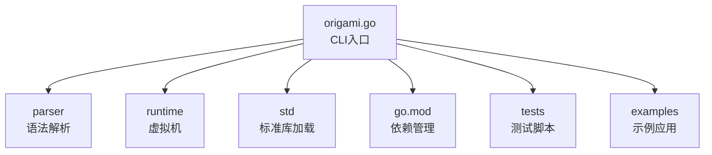
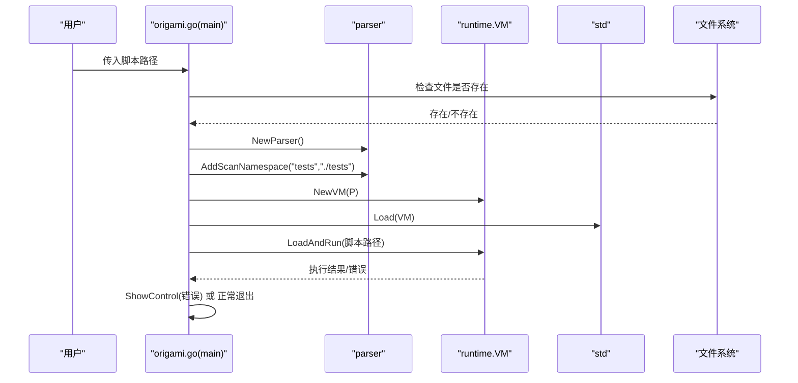
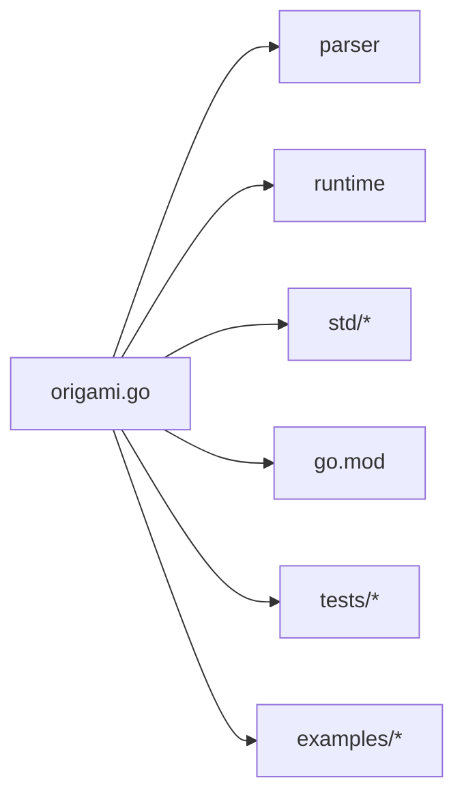

# 快速开始

<cite>
**本文引用的文件列表**
- [README.md](file://README.md)
- [docs/installation.md](file://docs/installation.md)
- [docs/quickstart.md](file://docs/quickstart.md)
- [docs/syntax.md](file://docs/syntax.md)
- [docs/data-types.md](file://docs/data-types.md)
- [docs/functions.md](file://docs/functions.md)
- [docs/control-structures.md](file://docs/control-structures.md)
- [origami.go](file://origami.go)
- [go.mod](file://go.mod)
- [tests/run_tests.zy](file://tests/run_tests.zy)
- [tests/basic/001.zy](file://tests/basic/001.zy)
- [tests/basic/002.zy](file://tests/basic/002.zy)
- [examples/gateway/main.zy](file://examples/gateway/main.zy)
</cite>

## 目录
1. [简介](#简介)
2. [项目结构](#项目结构)
3. [核心组件](#核心组件)
4. [架构总览](#架构总览)
5. [详细组件分析](#详细组件分析)
6. [依赖关系分析](#依赖关系分析)
7. [性能注意事项](#性能注意事项)
8. [故障排除指南](#故障排除指南)
9. [结论](#结论)
10. [附录](#附录)

## 简介
本指南面向编程初学者与进阶用户，帮助你在最短时间内完成 Origami 语言的安装、配置与首次运行。你将学会：
- 环境准备与编译安装
- 基本配置与运行验证
- 编写第一个 Hello World 程序
- 基础语法与常见示例（变量、函数、控制结构等）
- 常见问题排查与最佳实践

## 项目结构
仓库采用模块化设计，核心入口为 CLI 可执行程序，配合解析器、虚拟机与标准库模块共同工作。典型目录与职责如下：
- 根目录：CLI 入口与主程序
- docs：官方文档（安装、语法、数据类型、函数、控制结构等）
- parser：语法解析器
- runtime：虚拟机与运行时
- std：标准库（系统、HTTP、日志、反射、数据库等）
- tests：测试用例与自动化测试脚本
- examples：示例应用（如网关、HTTP 示例）

图表来源
- [origami.go:34-67](file://origami.go#L34-L67)
- [go.mod:1-19](file://go.mod#L1-L19)

章节来源
- [README.md:1-69](file://README.md#L1-L69)
- [origami.go:1-68](file://origami.go#L1-L68)
- [go.mod:1-19](file://go.mod#L1-L19)

## 核心组件
- CLI 入口：负责参数解析、文件存在性校验、加载并运行脚本、错误控制与帮助信息输出。
- 解析器：负责将脚本解析为抽象语法树（AST），支持命名空间扫描与文件加载。
- 虚拟机：负责执行 AST，提供运行时上下文与类型系统支持。
- 标准库：提供系统、HTTP、日志、反射、数据库等常用能力，按需加载。

章节来源
- [origami.go:34-67](file://origami.go#L34-L67)
- [README.md:12-33](file://README.md#L12-L33)

## 架构总览
下面的序列图展示了从命令行到脚本执行的完整流程，包括参数校验、文件检查、标准库加载与执行。

图表来源
- [origami.go:34-67](file://origami.go#L34-L67)

章节来源
- [origami.go:34-67](file://origami.go#L34-L67)

## 详细组件分析

### 安装与环境准备
- 系统要求：Go 1.18+、Git、Linux/macOS/Windows。
- 安装 Go：参考安装文档中的平台指引（Linux/macOS 使用 tar 安装或 Homebrew；Windows 使用安装包）。
- 验证 Go：执行 go version。
- 克隆仓库：git clone 后进入目录。
- 编译：go build -o origami origami.go。
- 验证：./origami 显示帮助信息。
- 运行测试：./origami tests/run_tests.zy，观察测试通过信息。

章节来源
- [docs/installation.md:1-192](file://docs/installation.md#L1-L192)

### 编写你的第一个 Hello World
- 创建 hello.zy，包含基本输出、变量声明与函数定义。
- 运行：./origami hello.zy，观察输出。

章节来源
- [docs/quickstart.md:5-41](file://docs/quickstart.md#L5-L41)

### 基础语法与示例
- 变量与数据类型：整数、字符串、布尔、浮点、数组、对象等。
- 控制结构：if/else、for/while/foreach、switch/match、break/continue/return。
- 函数：定义、参数（默认值、可变参数）、返回值类型、匿名函数与箭头函数。
- 字符串与数组方法：长度、大小写转换、查找、分割、映射、过滤、规约等。
- 类与对象：构造函数、成员方法、继承与接口、鸭子类型检测。

章节来源
- [docs/syntax.md:1-602](file://docs/syntax.md#L1-L602)
- [docs/data-types.md:1-385](file://docs/data-types.md#L1-L385)
- [docs/functions.md:1-694](file://docs/functions.md#L1-L694)
- [docs/control-structures.md:1-560](file://docs/control-structures.md#L1-L560)

### 常见入门示例
- Hello World：输出文本、变量插值、函数调用。
- 变量与数组：基本类型声明、数组字面量、数组方法。
- 控制结构：条件判断、for/foreach 循环。
- 函数：带默认值、可变参数、匿名函数与箭头函数。
- 类与对象：类定义、构造函数、成员方法、对象创建。
- 字符串操作：长度、大小写、查找、替换、分割。
- 数组操作：map/filter/reduce 等高阶方法。
- 实用示例：简单计算器（switch/case 与异常处理）、日志系统（时间戳与级别）。

章节来源
- [docs/quickstart.md:43-226](file://docs/quickstart.md#L43-L226)

### 运行测试与验证
- 使用 tests/run_tests.zy 自动遍历 tests 目录下的 .zy 文件并执行，观察日志输出与错误信息。

章节来源
- [tests/run_tests.zy:1-30](file://tests/run_tests.zy#L1-L30)

### 示例应用：网关路由
- examples/gateway/main.zy 展示了基于 Host 头的路由分发、中间件与 app() 动态加载隔离环境的用法。

章节来源
- [examples/gateway/main.zy:1-103](file://examples/gateway/main.zy#L1-L103)

## 依赖关系分析
- CLI 依赖解析器、虚拟机与标准库模块。
- go.mod 管理 Go 工具链版本与第三方依赖（如 MySQL 驱动）。
- 运行时加载标准库（系统、HTTP、日志、反射、数据库等），并通过 AddScanNamespace 支持 tests 目录扫描。

图表来源
- [origami.go:34-67](file://origami.go#L34-L67)
- [go.mod:1-19](file://go.mod#L1-L19)

章节来源
- [origami.go:34-67](file://origami.go#L34-L67)
- [go.mod:1-19](file://go.mod#L1-L19)

## 性能注意事项
- 语言当前未进行性能优化，不建议在生产环境使用。
- 建议优先关注功能正确性与可维护性，在后续阶段再考虑性能优化。
- 使用数组与字符串方法时注意避免不必要的重复计算与深层嵌套。

章节来源
- [README.md:7-11](file://README.md#L7-L11)

## 故障排除指南
- Go 版本过低：升级至 Go 1.18 或更高版本。
- 依赖下载失败：设置 GOPROXY 并执行 go mod tidy。
- 权限问题：为可执行文件添加执行权限。
- 编译错误：清理缓存后重新编译（go clean、go mod tidy、go build）。
- 文件不存在：确认脚本路径正确且文件存在。
- 运行测试失败：检查 tests 目录下 .zy 文件是否符合语法与命名空间规范。

章节来源
- [docs/installation.md:137-183](file://docs/installation.md#L137-L183)

## 结论
通过本指南，你已完成了 Origami 语言的安装与首次运行，掌握了基础语法与常见示例，并具备了基本的故障排除能力。建议继续深入阅读官方文档与示例，逐步探索标准库与高级特性。

## 附录

### 快速命令清单
- 安装 Go 并验证版本
- 克隆仓库并进入目录
- 编译：go build -o origami origami.go
- 验证：./origami
- 运行测试：./origami tests/run_tests.zy
- 运行你的脚本：./origami hello.zy

章节来源
- [docs/installation.md:19-95](file://docs/installation.md#L19-L95)
- [docs/quickstart.md:29-41](file://docs/quickstart.md#L29-L41)