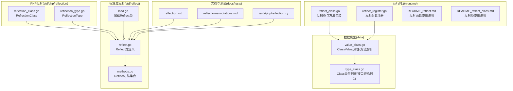
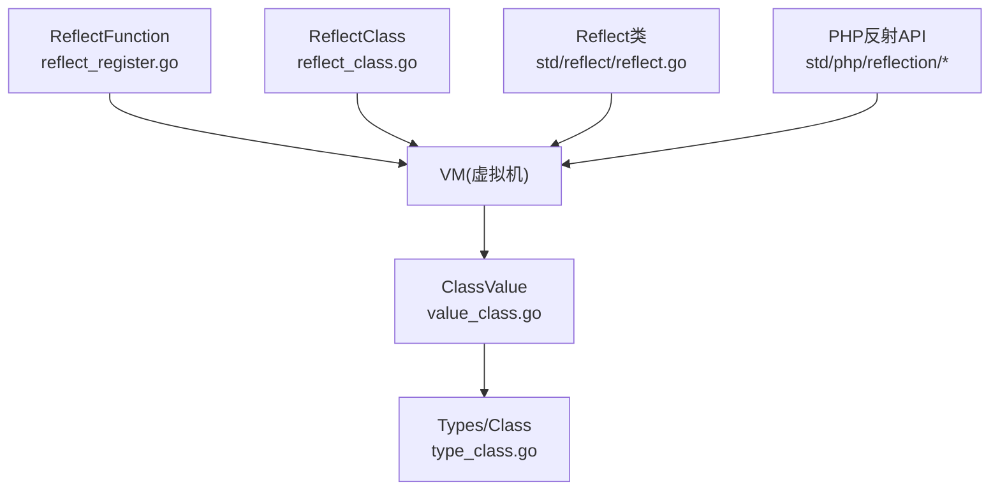
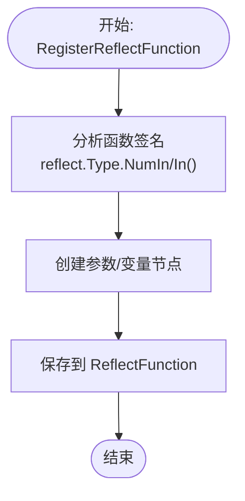
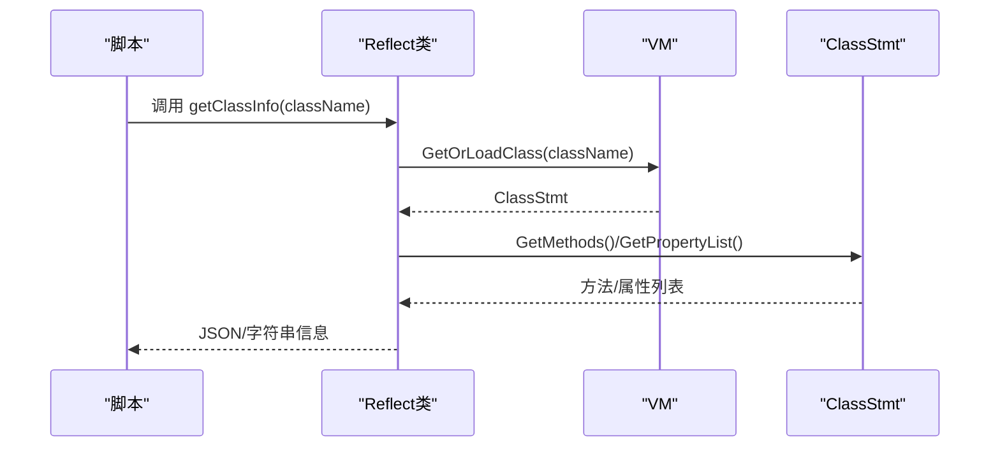
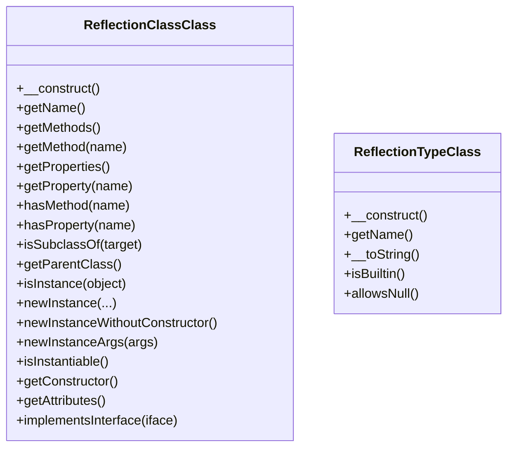
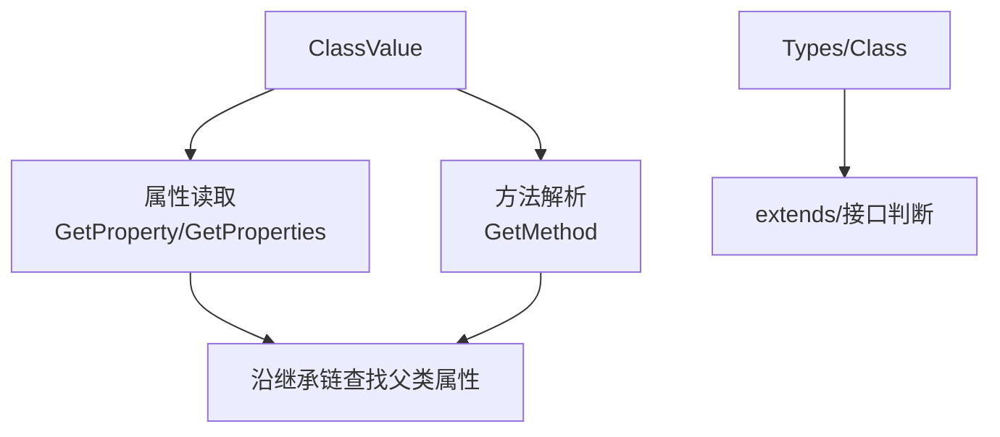
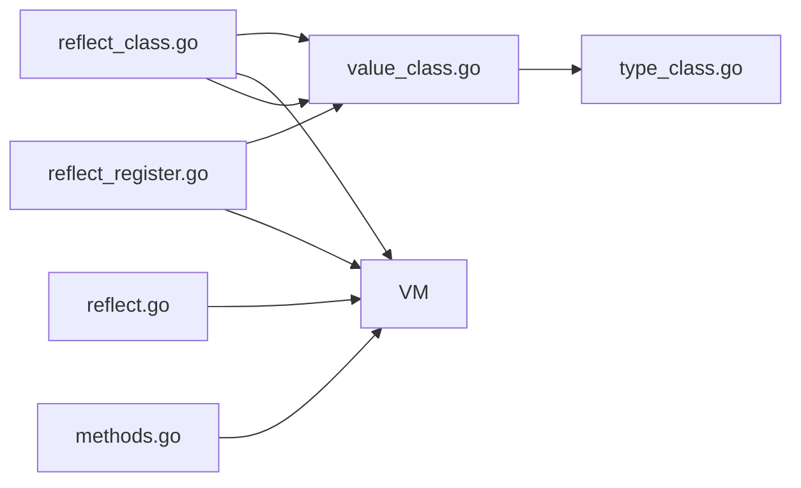

# 反射扩展开发

<cite>
**本文引用的文件**
- [runtime/reflect_class.go](file://runtime/reflect_class.go)
- [runtime/reflect_register.go](file://runtime/reflect_register.go)
- [runtime/README_reflect.md](file://runtime/README_reflect.md)
- [runtime/README_reflect_class.md](file://runtime/README_reflect_class.md)
- [std/reflect/load.go](file://std/reflect/load.go)
- [std/reflect/reflect.go](file://std/reflect/reflect.go)
- [std/reflect/methods.go](file://std/reflect/methods.go)
- [std/php/reflection/reflection_class.go](file://std/php/reflection/reflection_class.go)
- [std/php/reflection/reflection_type.go](file://std/php/reflection/reflection_type.go)
- [data/value_class.go](file://data/value_class.go)
- [data/type_class.go](file://data/type_class.go)
- [docs/reflection.md](file://docs/reflection.md)
- [docs/reflection-annotations.md](file://docs/reflection-annotations.md)
- [tests/php/reflection.zy](file://tests/php/reflection.zy)
</cite>

## 目录
1. [简介](#简介)
2. [项目结构](#项目结构)
3. [核心组件](#核心组件)
4. [架构总览](#架构总览)
5. [详细组件分析](#详细组件分析)
6. [依赖分析](#依赖分析)
7. [性能考量](#性能考量)
8. [故障排查指南](#故障排查指南)
9. [结论](#结论)
10. [附录](#附录)

## 简介
本指南面向希望在 Origami 中开发“反射扩展”的工程师，系统讲解反射系统的架构与实现原理，覆盖类型注册机制、反射元数据管理、Go 类型与脚本类型的双向转换、异常处理与类型安全校验、以及性能优化策略。文档同时提供从类型定义到反射 API 使用的完整开发流程，并给出调试反射扩展的工具与技巧。

## 项目结构
- 运行时层（runtime）：提供反射函数与反射类的注册与调用能力，负责将 Go 函数/结构体桥接到脚本侧。
- 标准库反射模块（std/reflect）：提供脚本侧的 Reflect 类，用于查询类、方法、属性与注解信息。
- PHP 反射标准库（std/php/reflection）：提供 ReflectionClass、ReflectionMethod、ReflectionType 等面向脚本的反射 API。
- 数据模型与值系统（data）：提供 ClassValue、Types、Class 等类型与值抽象，支撑反射元数据的承载与传播。
- 文档与测试：docs 提供使用说明，tests 提供行为验证。



图示来源
- [runtime/reflect_class.go:1-524](file://runtime/reflect_class.go#L1-L524)
- [runtime/reflect_register.go:1-200](file://runtime/reflect_register.go#L1-L200)
- [runtime/README_reflect.md:1-276](file://runtime/README_reflect.md#L1-L276)
- [runtime/README_reflect_class.md:1-205](file://runtime/README_reflect_class.md#L1-L205)
- [std/reflect/load.go:1-11](file://std/reflect/load.go#L1-L11)
- [std/reflect/reflect.go:1-93](file://std/reflect/reflect.go#L1-L93)
- [std/reflect/methods.go:1-800](file://std/reflect/methods.go#L1-L800)
- [std/php/reflection/reflection_class.go:30-109](file://std/php/reflection/reflection_class.go#L30-L109)
- [std/php/reflection/reflection_type.go:34-76](file://std/php/reflection/reflection_type.go#L34-L76)
- [data/value_class.go:1-295](file://data/value_class.go#L1-L295)
- [data/type_class.go:1-146](file://data/type_class.go#L1-L146)
- [docs/reflection.md:1-277](file://docs/reflection.md#L1-L277)
- [docs/reflection-annotations.md:1-377](file://docs/reflection-annotations.md#L1-L377)
- [tests/php/reflection.zy:1-473](file://tests/php/reflection.zy#L1-L473)

章节来源
- [runtime/reflect_class.go:1-524](file://runtime/reflect_class.go#L1-L524)
- [runtime/reflect_register.go:1-200](file://runtime/reflect_register.go#L1-L200)
- [runtime/README_reflect.md:1-276](file://runtime/README_reflect.md#L1-L276)
- [runtime/README_reflect_class.md:1-205](file://runtime/README_reflect_class.md#L1-L205)
- [std/reflect/load.go:1-11](file://std/reflect/load.go#L1-L11)
- [std/reflect/reflect.go:1-93](file://std/reflect/reflect.go#L1-L93)
- [std/reflect/methods.go:1-800](file://std/reflect/methods.go#L1-L800)
- [std/php/reflection/reflection_class.go:30-109](file://std/php/reflection/reflection_class.go#L30-L109)
- [std/php/reflection/reflection_type.go:34-76](file://std/php/reflection/reflection_type.go#L34-L76)
- [data/value_class.go:1-295](file://data/value_class.go#L1-L295)
- [data/type_class.go:1-146](file://data/type_class.go#L1-L146)
- [docs/reflection.md:1-277](file://docs/reflection.md#L1-L277)
- [docs/reflection-annotations.md:1-377](file://docs/reflection-annotations.md#L1-L377)
- [tests/php/reflection.zy:1-473](file://tests/php/reflection.zy#L1-L473)

## 核心组件
- 反射类与方法包装：将 Go 结构体自动转换为脚本类，暴露公开方法与构造函数，负责参数与返回值的类型转换。
- 反射函数注册：将任意 Go 函数注册为脚本函数，自动分析参数并进行类型转换。
- 脚本反射模块（Reflect）：提供脚本侧查询类、方法、属性与注解的能力。
- PHP 反射 API：提供 ReflectionClass、ReflectionMethod、ReflectionType 等面向脚本的反射 API。
- 值与类型系统：ClassValue 承载类实例与属性，Types/Class 类型判断支撑接口与继承关系解析。

章节来源
- [runtime/reflect_class.go:12-131](file://runtime/reflect_class.go#L12-L131)
- [runtime/reflect_register.go:12-105](file://runtime/reflect_register.go#L12-L105)
- [std/reflect/reflect.go:8-93](file://std/reflect/reflect.go#L8-L93)
- [std/php/reflection/reflection_class.go:30-109](file://std/php/reflection/reflection_class.go#L30-L109)
- [std/php/reflection/reflection_type.go:34-76](file://std/php/reflection/reflection_type.go#L34-L76)
- [data/value_class.go:8-295](file://data/value_class.go#L8-L295)
- [data/type_class.go:3-146](file://data/type_class.go#L3-L146)

## 架构总览
Origami 的反射扩展由“运行时桥接 + 脚本反射 + 值与类型系统”三层组成：
- 运行时桥接：将 Go 函数/结构体注册到 VM，暴露为脚本可调用的函数/类。
- 脚本反射：提供 Reflect 类与 PHP 反射 API，用于查询类、方法、属性与注解。
- 值与类型系统：承载类实例、属性、方法解析与类型判断，支持接口与继承关系。



图示来源
- [runtime/reflect_register.go:180-189](file://runtime/reflect_register.go#L180-L189)
- [runtime/reflect_class.go:519-524](file://runtime/reflect_class.go#L519-L524)
- [data/value_class.go:8-295](file://data/value_class.go#L8-L295)
- [data/type_class.go:3-146](file://data/type_class.go#L3-L146)
- [std/reflect/reflect.go:14-93](file://std/reflect/reflect.go#L14-L93)
- [std/php/reflection/reflection_class.go:30-109](file://std/php/reflection/reflection_class.go#L30-L109)

## 详细组件分析

### 反射类（ReflectClass）与方法包装
- 反射类职责：封装 Go 结构体，暴露公开方法、构造函数、属性；在每次 GetValue 时创建新实例并分析方法。
- 方法包装：ReflectMethod 包装 reflect.Method，负责参数提取、类型转换与调用；ReflectConstructor 负责字段注入。
- 类型转换：convertToGoValue/convertToScriptValue 支持 string/int/float64/bool 等基础类型互转。
- 访问控制：isPublicMethod 仅暴露首字母大写的公开方法。

```mermaid
classDiagram
class ReflectClass {
-string name
-reflect.Type instanceType
-map~string,data.Method~ methods
-map~string,data.Property~ properties
-interface{} instance
+GetName() string
+GetMethod(name) (data.Method,bool)
+GetMethods() []data.Method
+GetProperty(name) (data.Property,bool)
+GetPropertyList() []data.Property
+GetConstruct() data.Method
+GetValue(ctx) (data.GetValue,data.Control)
}
class ReflectMethod {
-string name
-reflect.Method method
-interface{} instance
-reflect.Type instanceType
+GetName() string
+GetParams() []data.GetValue
+GetVariables() []data.Variable
+Call(ctx) (data.GetValue,data.Control)
-convertToGoValue(v, t) reflect.Value
-convertToScriptValue(v) data.GetValue
}
class ReflectConstructor {
-string className
-reflect.Type instanceType
-interface{} instance
+GetName() string
+GetParams() []data.GetValue
+GetVariables() []data.Variable
+Call(ctx) (data.GetValue,data.Control)
}
ReflectClass --> ReflectMethod : "持有"
ReflectClass --> ReflectConstructor : "持有"
```

图示来源
- [runtime/reflect_class.go:13-131](file://runtime/reflect_class.go#L13-L131)
- [runtime/reflect_class.go:144-274](file://runtime/reflect_class.go#L144-L274)
- [runtime/reflect_class.go:350-448](file://runtime/reflect_class.go#L350-L448)

章节来源
- [runtime/reflect_class.go:12-131](file://runtime/reflect_class.go#L12-L131)
- [runtime/reflect_class.go:143-274](file://runtime/reflect_class.go#L143-L274)
- [runtime/reflect_class.go:349-448](file://runtime/reflect_class.go#L349-L448)

### 反射函数注册（ReflectFunction）
- 自动参数分析：根据 reflect.Type 自动创建参数与变量节点。
- 类型转换：convertToGoValue/convertToScriptValue 支持 string/int/float64/bool。
- 批量注册：RegisterReflectFunctions 支持 map 批量注册。



图示来源
- [runtime/reflect_register.go:21-49](file://runtime/reflect_register.go#L21-L49)
- [runtime/reflect_register.go:107-178](file://runtime/reflect_register.go#L107-L178)

章节来源
- [runtime/reflect_register.go:12-105](file://runtime/reflect_register.go#L12-L105)
- [runtime/reflect_register.go:180-200](file://runtime/reflect_register.go#L180-L200)

### 脚本反射模块（Reflect 类）
- 提供 getClassInfo、getMethodInfo、getPropertyInfo、listMethods、listProperties、listClasses、注解查询等方法。
- 通过 VM 查询类与成员，构建友好字符串或 JSON 字符串返回。



图示来源
- [std/reflect/reflect.go:44-92](file://std/reflect/reflect.go#L44-L92)
- [std/reflect/methods.go:42-92](file://std/reflect/methods.go#L42-L92)
- [std/reflect/methods.go:128-172](file://std/reflect/methods.go#L128-L172)
- [std/reflect/methods.go:208-278](file://std/reflect/methods.go#L208-L278)

章节来源
- [std/reflect/reflect.go:8-93](file://std/reflect/reflect.go#L8-L93)
- [std/reflect/methods.go:10-800](file://std/reflect/methods.go#L10-L800)

### PHP 反射 API（ReflectionClass/ReflectionType）
- ReflectionClass：提供 getName、getMethods、getMethod、getProperties、getProperty、hasMethod、hasProperty、isSubclassOf、getParentClass、isInstance、newInstance、newInstanceWithoutConstructor、newInstanceArgs、isInstantiable、getConstructor、getAttributes、implementsInterface 等。
- ReflectionType：提供 getName、__toString、isBuiltin、allowsNull 等。



图示来源
- [std/php/reflection/reflection_class.go:30-109](file://std/php/reflection/reflection_class.go#L30-L109)
- [std/php/reflection/reflection_type.go:34-76](file://std/php/reflection/reflection_type.go#L34-L76)

章节来源
- [std/php/reflection/reflection_class.go:30-109](file://std/php/reflection/reflection_class.go#L30-L109)
- [std/php/reflection/reflection_type.go:34-76](file://std/php/reflection/reflection_type.go#L34-L76)

### 值与类型系统（ClassValue/Types/Class）
- ClassValue：承载类实例、属性读取与方法解析，支持继承链上的属性与方法查找。
- Types/Class：提供类名匹配、接口继承判断、extends 链查找等。



图示来源
- [data/value_class.go:58-202](file://data/value_class.go#L58-L202)
- [data/type_class.go:3-146](file://data/type_class.go#L3-L146)

章节来源
- [data/value_class.go:1-295](file://data/value_class.go#L1-L295)
- [data/type_class.go:1-146](file://data/type_class.go#L1-L146)

## 依赖分析
- 运行时桥接依赖数据模型（data），通过 ClassValue 承载类实例与属性。
- 脚本反射模块依赖 VM，通过 VM 查询类与成员。
- PHP 反射 API 依赖脚本反射模块与 VM。
- 类型系统（Types/Class）用于接口与继承关系判断。



图示来源
- [runtime/reflect_register.go:180-189](file://runtime/reflect_register.go#L180-L189)
- [runtime/reflect_class.go:519-524](file://runtime/reflect_class.go#L519-L524)
- [data/value_class.go:8-295](file://data/value_class.go#L8-L295)
- [data/type_class.go:3-146](file://data/type_class.go#L3-L146)
- [std/reflect/reflect.go:14-93](file://std/reflect/reflect.go#L14-L93)
- [std/reflect/methods.go:42-92](file://std/reflect/methods.go#L42-L92)

章节来源
- [runtime/reflect_register.go:180-189](file://runtime/reflect_register.go#L180-L189)
- [runtime/reflect_class.go:519-524](file://runtime/reflect_class.go#L519-L524)
- [data/value_class.go:8-295](file://data/value_class.go#L8-L295)
- [data/type_class.go:3-146](file://data/type_class.go#L3-L146)
- [std/reflect/reflect.go:14-93](file://std/reflect/reflect.go#L14-L93)
- [std/reflect/methods.go:42-92](file://std/reflect/methods.go#L42-L92)

## 性能考量
- 反射调用开销：反射函数与反射类均涉及类型转换与反射调用，相比直接调用存在额外开销。
- 批量注册：使用 RegisterReflectFunctions 批量注册，减少重复分析成本。
- 类型转换：convertToGoValue/convertToScriptValue 仅支持基础类型，避免复杂类型转换带来的性能损耗。
- 缓存策略：可在应用层对反射结果进行缓存（例如注解扫描结果），避免在热路径重复反射。

章节来源
- [runtime/README_reflect.md:235-240](file://runtime/README_reflect.md#L235-L240)
- [runtime/README_reflect_class.md:177-182](file://runtime/README_reflect_class.md#L177-L182)
- [std/reflect/methods.go:329-441](file://std/reflect/methods.go#L329-L441)

## 故障排查指南
- 类型转换失败：convertToGoValue/convertToScriptValue 会在类型不匹配时抛出错误，检查脚本传参与 Go 函数签名是否一致。
- 方法不存在：ReflectClass.GetMethod 返回 false，确认方法名大小写与公开性。
- 注册冲突：RegisterReflectFunction/RegisterReflectClass 若类名/函数名冲突，需调整命名或处理控制流。
- 注解读取：getAllAnnotations/getClassAnnotations/getMethodAnnotations/getPropertyAnnotations 依赖类声明与注解节点，确保类已加载且注解存在。
- 单元测试与脚本测试：参考 tests/php/reflection.zy 与文档示例，定位问题范围。

章节来源
- [runtime/reflect_class.go:276-347](file://runtime/reflect_class.go#L276-L347)
- [runtime/reflect_register.go:107-178](file://runtime/reflect_register.go#L107-L178)
- [std/reflect/methods.go:474-502](file://std/reflect/methods.go#L474-L502)
- [tests/php/reflection.zy:1-473](file://tests/php/reflection.zy#L1-L473)

## 结论
Origami 的反射扩展通过运行时桥接与脚本反射模块，实现了从 Go 到脚本的无缝反射能力。开发者可通过反射函数与反射类快速暴露 Go 能力，借助 Reflect 类与 PHP 反射 API 实现元数据查询与注解读取。结合类型安全校验与性能优化策略，可在保证稳定性的同时获得良好的开发体验。

## 附录

### 反射扩展开发流程（从类型定义到反射 API 使用）
- 定义 Go 类型与方法：仅导出公开方法（首字母大写），避免复杂参数与返回值。
- 注册反射函数：使用 RegisterReflectFunction/RegisterReflectFunctions 将函数暴露为脚本函数。
- 注册反射类：使用 RegisterReflectClass 将结构体暴露为脚本类，构造函数与方法自动分析。
- 在脚本中使用：通过 Reflect 类查询类/方法/属性信息，或使用 PHP 反射 API 进行更细粒度的操作。
- 注解与元数据：配合注解系统，实现框架级的自动化（路由、依赖注入等）。

章节来源
- [runtime/README_reflect.md:12-70](file://runtime/README_reflect.md#L12-L70)
- [runtime/README_reflect_class.md:14-65](file://runtime/README_reflect_class.md#L14-L65)
- [docs/reflection.md:14-51](file://docs/reflection.md#L14-L51)
- [docs/reflection-annotations.md:118-208](file://docs/reflection-annotations.md#L118-L208)

### 调试反射扩展的工具与技巧
- 使用 tests/php/reflection.zy 中的测试用例作为调试脚本，逐步验证类、方法、属性与注解的行为。
- 在 Convert 层打印中间值（类型、参数、返回值），定位类型转换问题。
- 使用 Reflect.listMethods/listProperties 快速核对反射结果是否符合预期。
- 对复杂注解场景，先在应用启动阶段缓存反射结果，避免热路径上的重复反射。

章节来源
- [tests/php/reflection.zy:1-473](file://tests/php/reflection.zy#L1-L473)
- [std/reflect/methods.go:308-369](file://std/reflect/methods.go#L308-L369)
- [docs/reflection-annotations.md:325-341](file://docs/reflection-annotations.md#L325-L341)