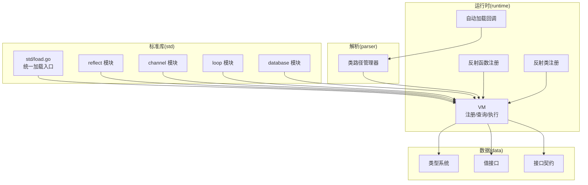
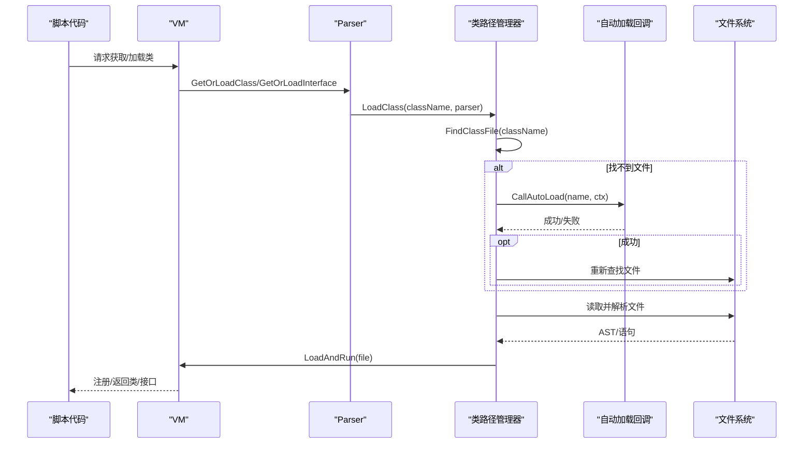
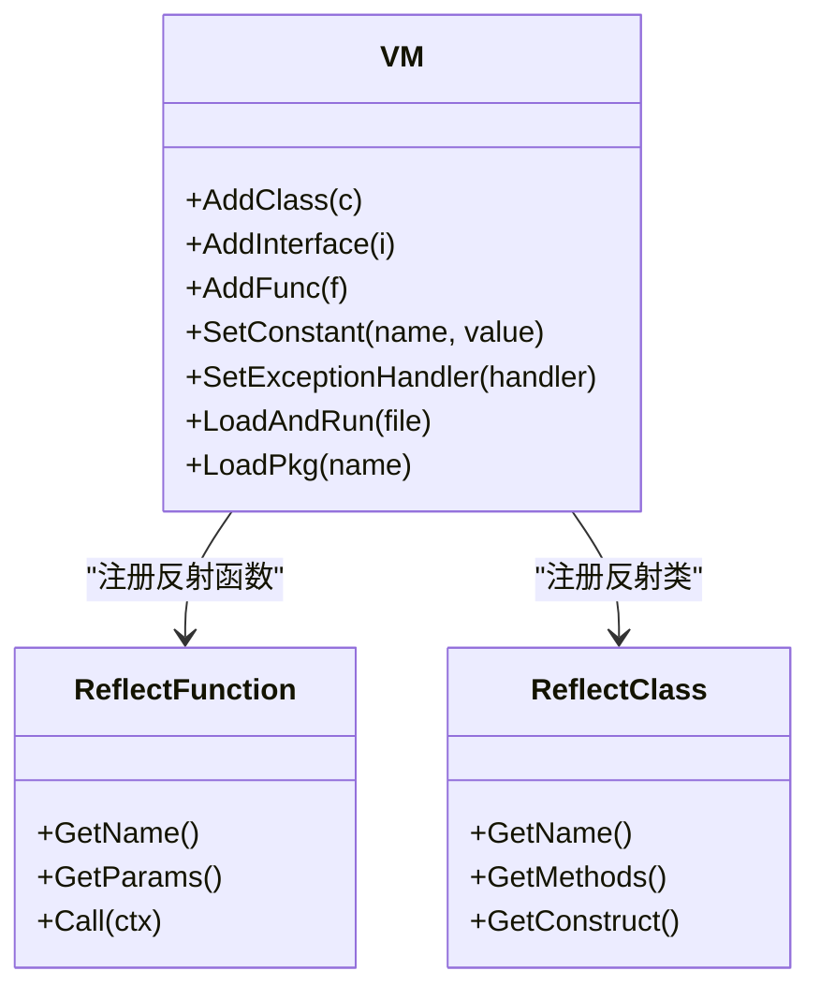
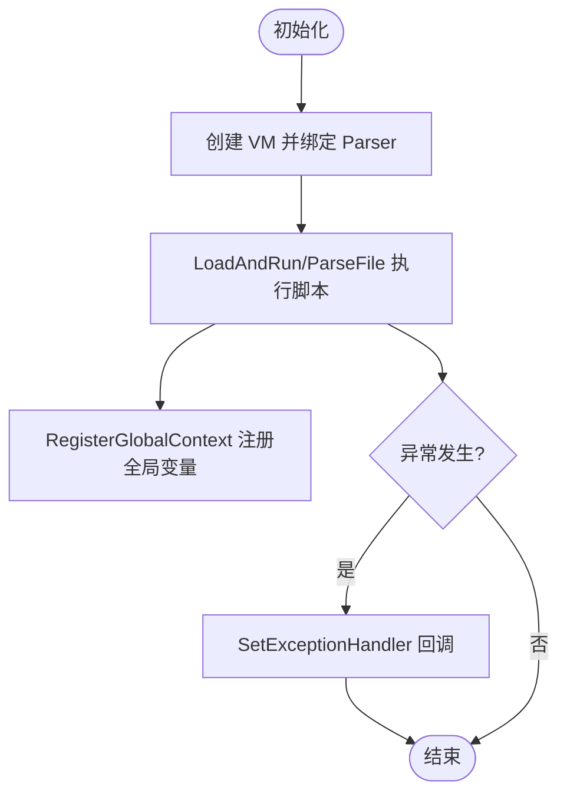
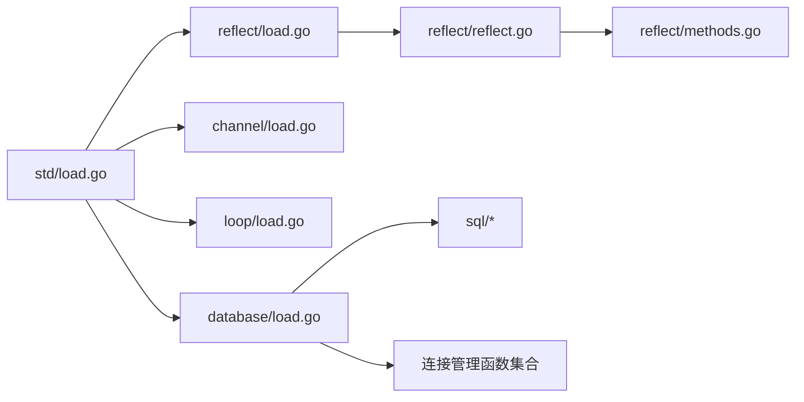
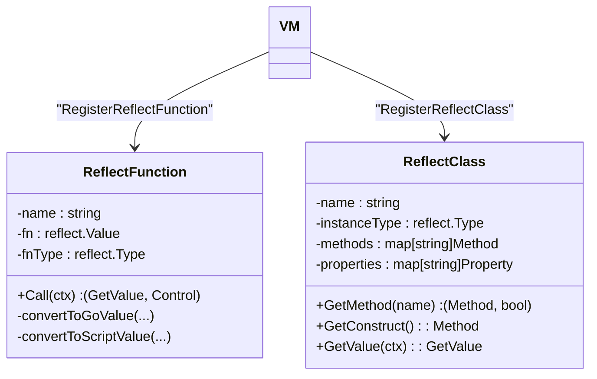
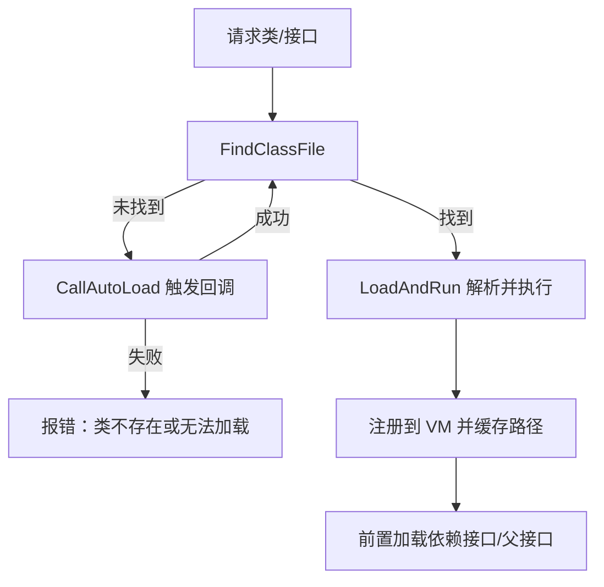
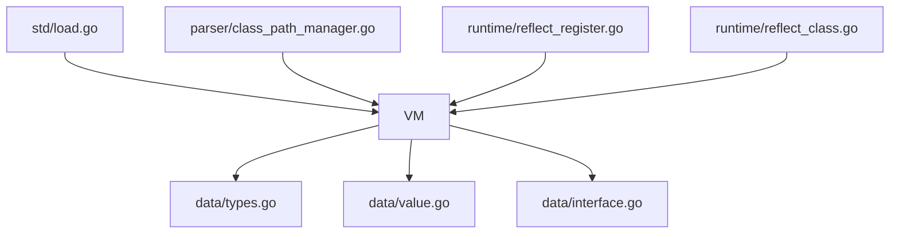

# 扩展开发

<cite>
**本文引用的文件**
- [runtime/vm.go](file://runtime/vm.go)
- [runtime/autoload.go](file://runtime/autoload.go)
- [runtime/reflect_register.go](file://runtime/reflect_register.go)
- [runtime/reflect_class.go](file://runtime/reflect_class.go)
- [std/load.go](file://std/load.go)
- [std/reflect/load.go](file://std/reflect/load.go)
- [std/reflect/reflect.go](file://std/reflect/reflect.go)
- [std/reflect/methods.go](file://std/reflect/methods.go)
- [std/channel/load.go](file://std/channel/load.go)
- [std/loop/load.go](file://std/loop/load.go)
- [std/database/load.go](file://std/database/load.go)
- [parser/class_path_manager.go](file://parser/class_path_manager.go)
- [data/types.go](file://data/types.go)
- [data/value.go](file://data/value.go)
- [data/interface.go](file://data/interface.go)
</cite>

## 目录
1. [引言](#引言)
2. [项目结构](#项目结构)
3. [核心组件](#核心组件)
4. [架构总览](#架构总览)
5. [组件详解](#组件详解)
6. [依赖关系分析](#依赖关系分析)
7. [性能考量](#性能考量)
8. [故障排查指南](#故障排查指南)
9. [结论](#结论)
10. [附录](#附录)

## 引言
本指南面向希望基于 Origami 开发“自定义扩展”的工程师，系统讲解扩展接口定义、注册机制、生命周期管理、标准库扩展开发流程、反射扩展开发（类型注册、方法绑定、属性访问）、插件系统（动态加载、依赖管理、版本兼容）以及最佳实践、性能优化与调试技巧。文档同时提供可直接参考的源码路径与可视化图示，帮助快速上手。

## 项目结构
Origami 的扩展开发围绕以下层次展开：
- 运行时层（runtime）：虚拟机、自动加载、反射注册与反射类
- 标准库层（std）：标准模块（reflect、channel、loop、database 等）的加载与注册入口
- 解析层（parser）：类路径管理、自动加载回调、类/接口的动态加载
- 数据层（data）：类型系统、值接口、接口契约

图表来源
- [runtime/vm.go:14-391](file://runtime/vm.go#L14-L391)
- [std/load.go:14-38](file://std/load.go#L14-L38)
- [parser/class_path_manager.go:13-428](file://parser/class_path_manager.go#L13-L428)
- [runtime/reflect_register.go:180-200](file://runtime/reflect_register.go#L180-L200)
- [runtime/reflect_class.go:519-524](file://runtime/reflect_class.go#L519-L524)

章节来源
- [runtime/vm.go:14-391](file://runtime/vm.go#L14-L391)
- [std/load.go:14-38](file://std/load.go#L14-L38)
- [parser/class_path_manager.go:13-428](file://parser/class_path_manager.go#L13-L428)

## 核心组件
- 虚拟机（VM）：负责注册/查询类、接口、函数、常量、全局变量；提供异常处理回调；支持按需加载与自动加载。
- 类路径管理器（CPM）：维护命名空间到物理路径的映射，支持大小写不敏感查找，支持自动加载回调。
- 反射注册：支持将 Go 函数/结构体方法/属性以脚本函数/类的方式注册到 VM。
- 标准库加载：统一入口集中注册标准模块（reflect、channel、loop、database 等）。

章节来源
- [runtime/vm.go:14-391](file://runtime/vm.go#L14-L391)
- [parser/class_path_manager.go:32-428](file://parser/class_path_manager.go#L32-L428)
- [runtime/reflect_register.go:180-200](file://runtime/reflect_register.go#L180-L200)
- [runtime/reflect_class.go:519-524](file://runtime/reflect_class.go#L519-L524)
- [std/load.go:14-38](file://std/load.go#L14-L38)

## 架构总览
下面的序列图展示“类/接口自动加载”的典型流程，体现动态加载、依赖管理与异常处理：

图表来源
- [parser/class_path_manager.go:327-382](file://parser/class_path_manager.go#L327-L382)
- [runtime/autoload.go:8-14](file://runtime/autoload.go#L8-L14)

章节来源
- [parser/class_path_manager.go:327-382](file://parser/class_path_manager.go#L327-L382)
- [runtime/autoload.go:8-14](file://runtime/autoload.go#L8-L14)

## 组件详解

### 1) 扩展接口定义与注册机制
- 函数注册：通过 VM.AddFunc 注册函数语句；反射函数可通过 RegisterReflectFunction/RegisterFunction 注册。
- 类/接口注册：通过 VM.AddClass/AddInterface 注册；支持命名空间与全限定名。
- 常量/全局变量：SetConstant、EnsureGlobalZVal、RegisterGlobalContext。
- 异常处理：SetExceptionHandler/ThrowControl 支持 PHP 级异常回调与默认降级处理。

图表来源
- [runtime/vm.go:118-269](file://runtime/vm.go#L118-L269)
- [runtime/reflect_register.go:12-105](file://runtime/reflect_register.go#L12-L105)
- [runtime/reflect_class.go:12-131](file://runtime/reflect_class.go#L12-L131)

章节来源
- [runtime/vm.go:118-269](file://runtime/vm.go#L118-L269)
- [runtime/reflect_register.go:180-200](file://runtime/reflect_register.go#L180-L200)
- [runtime/reflect_class.go:519-524](file://runtime/reflect_class.go#L519-L524)

### 2) 生命周期管理
- 初始化：NewVM 创建 VM 并注入 Parser；SetVM 绑定解析器。
- 运行期：LoadAndRun/ParseFile 解析并执行脚本文件；RegisterGlobalContext 将顶层变量注册为全局。
- 异常：SetExceptionHandler 注册 PHP 级回调；ThrowControl 优先调用回调，否则底层处理。
- 清理：RemoveAutoLoad 移除自动加载回调。

图表来源
- [runtime/vm.go:14-391](file://runtime/vm.go#L14-L391)
- [runtime/autoload.go:8-14](file://runtime/autoload.go#L8-L14)

章节来源
- [runtime/vm.go:14-391](file://runtime/vm.go#L14-L391)
- [runtime/autoload.go:8-14](file://runtime/autoload.go#L8-L14)

### 3) 标准库扩展开发流程
- 模块组织：每个子模块提供 load.go，集中注册类/接口/函数。
- 加载入口：std/load.go 统一调用各模块 Load，注册到 VM。
- 示例模块：
  - reflect：注册 Reflect 类及其方法族（类/方法/属性信息查询、注解查询等）。
  - channel：注册 Channel 类。
  - loop：注册 Iterator/Aggregate 接口与 List/HashMap 类。
  - database：注册 DB 类、SQL 子模块与连接管理函数。

图表来源
- [std/load.go:14-38](file://std/load.go#L14-L38)
- [std/reflect/load.go:7-10](file://std/reflect/load.go#L7-L10)
- [std/reflect/reflect.go:8-93](file://std/reflect/reflect.go#L8-L93)
- [std/reflect/methods.go:10-92](file://std/reflect/methods.go#L10-L92)
- [std/channel/load.go:7-12](file://std/channel/load.go#L7-L12)
- [std/loop/load.go:25-30](file://std/loop/load.go#L25-L30)
- [std/database/load.go:9-27](file://std/database/load.go#L9-L27)

章节来源
- [std/load.go:14-38](file://std/load.go#L14-L38)
- [std/reflect/load.go:7-10](file://std/reflect/load.go#L7-L10)
- [std/reflect/reflect.go:8-93](file://std/reflect/reflect.go#L8-L93)
- [std/reflect/methods.go:10-92](file://std/reflect/methods.go#L10-L92)
- [std/channel/load.go:7-12](file://std/channel/load.go#L7-L12)
- [std/loop/load.go:25-30](file://std/loop/load.go#L25-L30)
- [std/database/load.go:9-27](file://std/database/load.go#L9-L27)

### 4) 反射扩展开发指南
- 类型注册与方法绑定：
  - RegisterReflectFunction/RegisterFunction：将 Go 函数注册为脚本函数。
  - RegisterReflectClass：将 Go 结构体注册为脚本类，自动分析公开方法、构造参数（字段名）与属性。
- 属性访问：
  - 通过反射类的属性映射与字段设置逻辑实现属性读写。
- 返回值与参数类型转换：
  - 反射函数/方法在调用前后进行脚本值与 Go 值的双向转换，支持 string/int/float/bool 等基础类型。

图表来源
- [runtime/reflect_register.go:12-105](file://runtime/reflect_register.go#L12-L105)
- [runtime/reflect_register.go:180-200](file://runtime/reflect_register.go#L180-L200)
- [runtime/reflect_class.go:12-131](file://runtime/reflect_class.go#L12-L131)
- [runtime/reflect_class.go:519-524](file://runtime/reflect_class.go#L519-L524)

章节来源
- [runtime/reflect_register.go:12-105](file://runtime/reflect_register.go#L12-L105)
- [runtime/reflect_register.go:180-200](file://runtime/reflect_register.go#L180-L200)
- [runtime/reflect_class.go:12-131](file://runtime/reflect_class.go#L12-L131)
- [runtime/reflect_class.go:519-524](file://runtime/reflect_class.go#L519-L524)

### 5) 插件系统：动态加载、依赖管理与版本兼容
- 动态加载：
  - 通过类路径管理器根据命名空间查找类文件；支持大小写不敏感匹配，提升跨平台兼容性。
- 依赖管理：
  - 加载类/接口时提前加载其直接依赖（父接口/实现接口），保证类型检查阶段可用。
- 自动加载：
  - 未找到类时触发自动加载回调链，允许外部扩展按约定尝试加载。
- 版本兼容：
  - 通过类路径缓存避免重复加载；对同文件重复加载进行校验；严格区分全限定名与相对名。

图表来源
- [parser/class_path_manager.go:147-382](file://parser/class_path_manager.go#L147-L382)

章节来源
- [parser/class_path_manager.go:147-382](file://parser/class_path_manager.go#L147-L382)

### 6) API 设计与实现规范
- 类型系统：
  - NewBaseType/NewNullableType/NewUnionType/NewMultipleReturnType 等用于表达联合/可空/多返回值类型。
  - ISBaseType 用于基础类型判断。
- 值接口：
  - Value/CallableValue/SetProperty/GetProperty 等接口定义值与对象的基本能力。
- 接口契约：
  - InterfaceStmt/ClassStmt 等接口定义类/接口的元信息与方法集合。

章节来源
- [data/types.go:142-262](file://data/types.go#L142-L262)
- [data/value.go:3-39](file://data/value.go#L3-L39)
- [data/interface.go:3-59](file://data/interface.go#L3-L59)

## 依赖关系分析
- VM 对数据层（types/value/interface）强依赖，用于类型检查与值操作。
- 标准库模块通过 std/load.go 统一接入 VM。
- 类路径管理器与自动加载回调共同构成动态加载链路。
- 反射注册模块为 VM 提供反射函数/类的桥接。

图表来源
- [runtime/vm.go:14-391](file://runtime/vm.go#L14-L391)
- [std/load.go:14-38](file://std/load.go#L14-L38)
- [parser/class_path_manager.go:32-428](file://parser/class_path_manager.go#L32-L428)
- [runtime/reflect_register.go:180-200](file://runtime/reflect_register.go#L180-L200)
- [runtime/reflect_class.go:519-524](file://runtime/reflect_class.go#L519-L524)
- [data/types.go:142-262](file://data/types.go#L142-L262)
- [data/value.go:3-39](file://data/value.go#L3-L39)
- [data/interface.go:3-59](file://data/interface.go#L3-L59)

章节来源
- [runtime/vm.go:14-391](file://runtime/vm.go#L14-L391)
- [std/load.go:14-38](file://std/load.go#L14-L38)
- [parser/class_path_manager.go:32-428](file://parser/class_path_manager.go#L32-L428)
- [runtime/reflect_register.go:180-200](file://runtime/reflect_register.go#L180-L200)
- [runtime/reflect_class.go:519-524](file://runtime/reflect_class.go#L519-L524)
- [data/types.go:142-262](file://data/types.go#L142-L262)
- [data/value.go:3-39](file://data/value.go#L3-L39)
- [data/interface.go:3-59](file://data/interface.go#L3-L59)

## 性能考量
- 缓存与去重：类路径缓存避免重复解析；同文件重复加载校验减少无效工作。
- 并发安全：类/接口/函数映射使用读写锁保护，降低锁竞争。
- 类型检查：联合/可空/多返回值类型在解析阶段尽早确定，减少运行期分支。
- 反射调用：参数与返回值转换尽量复用类型判断与转换逻辑，避免重复分配。

## 故障排查指南
- 类/接口未找到：
  - 检查命名空间与路径映射是否正确；确认大小写不敏感匹配是否生效。
  - 触发自动加载回调链，确认回调返回值与上下文设置。
- 重复加载：
  - 核对类路径缓存与重复加载校验逻辑，避免同文件多次注册。
- 反射类型转换失败：
  - 检查脚本值到 Go 值的转换分支与目标类型；确保参数/返回值类型一致。
- 异常处理：
  - 确认 PHP 级异常回调是否正确注册；避免回调内部再次抛出未捕获异常导致递归。

章节来源
- [parser/class_path_manager.go:327-382](file://parser/class_path_manager.go#L327-L382)
- [runtime/vm.go:69-116](file://runtime/vm.go#L69-L116)
- [runtime/reflect_register.go:107-178](file://runtime/reflect_register.go#L107-L178)

## 结论
Origami 的扩展开发以 VM 为中心，结合标准库加载入口、类路径管理与反射注册机制，形成“声明式注册 + 动态加载 + 类型安全”的扩展体系。遵循本文的接口定义、注册流程与最佳实践，可高效构建稳定、可维护的扩展模块，并在复杂场景中保持良好的性能与可调试性。

## 附录
- 扩展开发模板建议
  - 模块目录：module/load.go + module/*.go
  - 在 module/load.go 中注册类/接口/函数到 VM
  - 在 std/load.go 中调用 module.Load
  - 若涉及动态加载，提供自动加载回调并通过 runtime/autoload.go 注册
- 参考源码路径
  - [std/load.go:14-38](file://std/load.go#L14-L38)
  - [std/reflect/load.go:7-10](file://std/reflect/load.go#L7-L10)
  - [std/reflect/reflect.go:8-93](file://std/reflect/reflect.go#L8-L93)
  - [std/reflect/methods.go:10-92](file://std/reflect/methods.go#L10-L92)
  - [std/channel/load.go:7-12](file://std/channel/load.go#L7-L12)
  - [std/loop/load.go:25-30](file://std/loop/load.go#L25-L30)
  - [std/database/load.go:9-27](file://std/database/load.go#L9-L27)
  - [parser/class_path_manager.go:327-382](file://parser/class_path_manager.go#L327-L382)
  - [runtime/reflect_register.go:180-200](file://runtime/reflect_register.go#L180-L200)
  - [runtime/reflect_class.go:519-524](file://runtime/reflect_class.go#L519-L524)
  - [data/types.go:142-262](file://data/types.go#L142-L262)
  - [data/value.go:3-39](file://data/value.go#L3-L39)
  - [data/interface.go:3-59](file://data/interface.go#L3-L59)