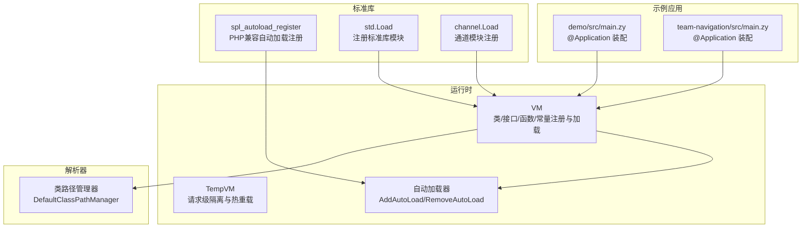
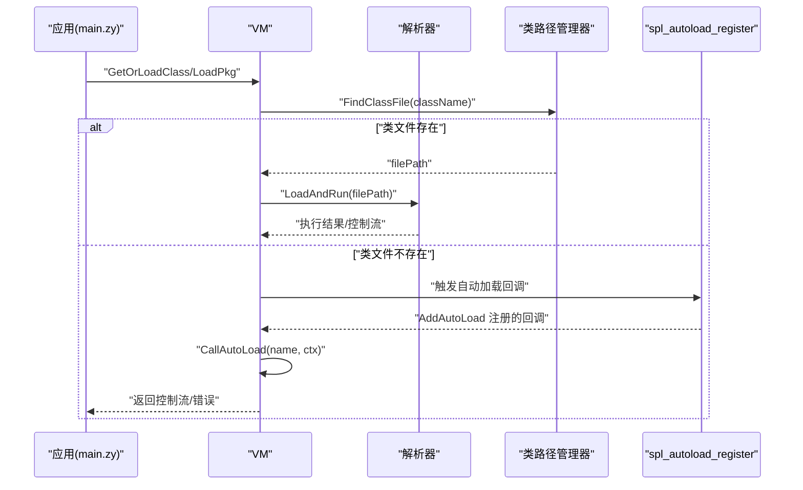
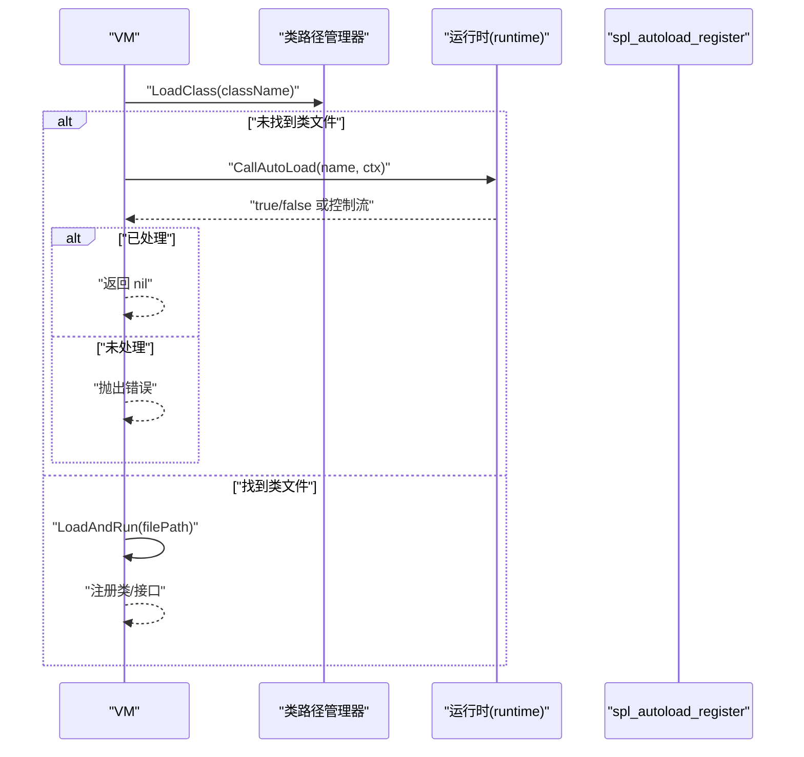
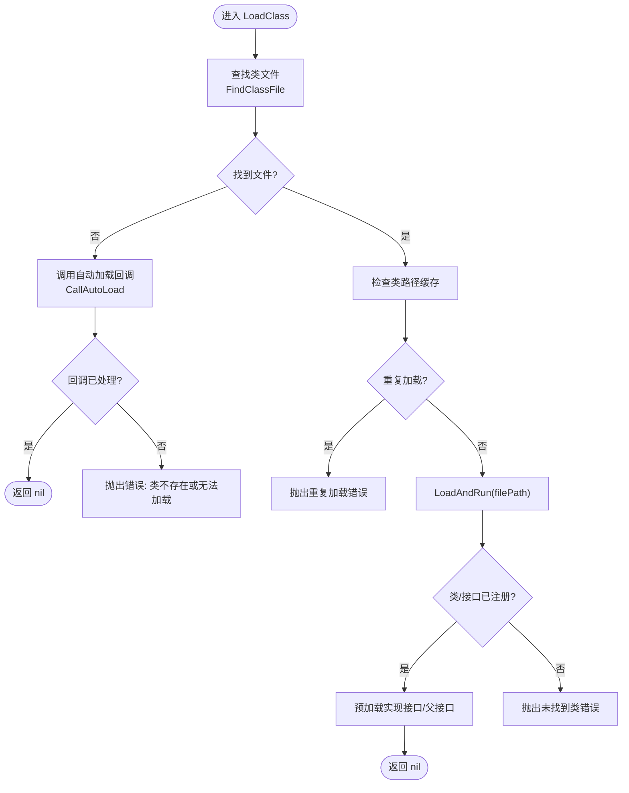
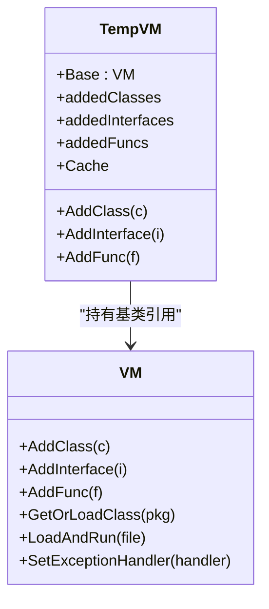
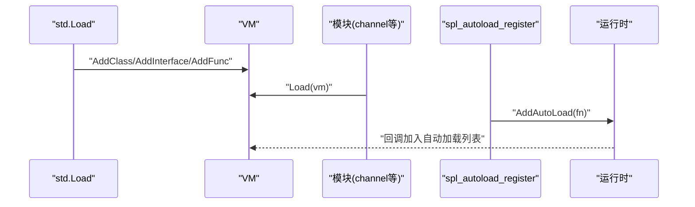
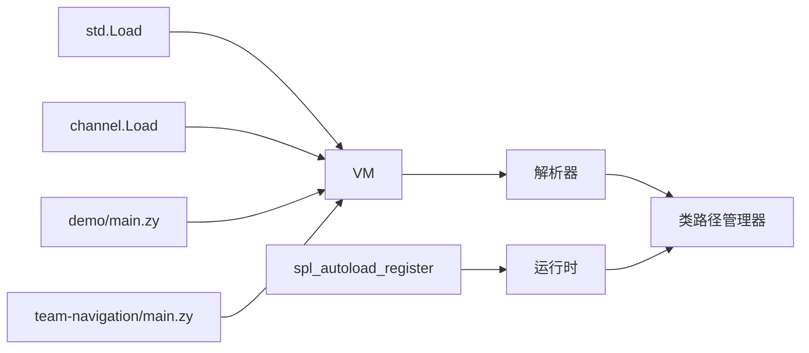

# 插件系统架构

<cite>
**本文引用的文件**
- [runtime/autoload.go](file://runtime/autoload.go)
- [parser/class_path_manager.go](file://parser/class_path_manager.go)
- [std/php/core/spl_autoload_register.go](file://std/php/core/spl_autoload_register.go)
- [runtime/vm.go](file://runtime/vm.go)
- [runtime/vm_temp.go](file://runtime/vm_temp.go)
- [std/load.go](file://std/load.go)
- [std/channel/load.go](file://std/channel/load.go)
- [std/net/annotation/application_class.go](file://std/net/annotation/application_class.go)
- [examples/gateway/apps/demo/src/main.zy](file://examples/gateway/apps/demo/src/main.zy)
- [examples/team-navigation/src/main.zy](file://examples/team-navigation/src/main.zy)
- [node/function.go](file://node/function.go)
- [node/call.go](file://node/call.go)
- [.github/build.md](file://.github/build.md)
- [docs/installation.md](file://docs/installation.md)
</cite>

## 目录
1. [引言](#引言)
2. [项目结构](#项目结构)
3. [核心组件](#核心组件)
4. [架构总览](#架构总览)
5. [组件详解](#组件详解)
6. [依赖关系分析](#依赖关系分析)
7. [性能考量](#性能考量)
8. [故障排查指南](#故障排查指南)
9. [结论](#结论)
10. [附录](#附录)

## 引言
本文件面向开发者与运维人员，系统化阐述 Origami 插件系统的整体设计与实现架构，覆盖动态加载机制、依赖解析、生命周期管理、插件发现与注册、类路径管理、自动加载器工作原理、插件间通信与事件/钩子模型、版本与兼容性策略、打包分发与安装流程，以及性能监控、资源管理与故障恢复机制。文档以代码为依据，配合可视化图示，力求在不同技术背景读者间建立统一认知。

## 项目结构
Origami 的插件能力由运行时虚拟机、解析器、标准库模块与示例应用共同构成。运行时负责类/接口/函数/常量的注册与加载；解析器负责文件解析与类路径查找；标准库模块提供内置类与自动加载注册入口；示例应用展示注解驱动的应用装配与插件式路由注册。

图表来源
- [runtime/vm.go:14-56](file://runtime/vm.go#L14-L56)
- [runtime/vm_temp.go:10-63](file://runtime/vm_temp.go#L10-L63)
- [parser/class_path_manager.go:13-45](file://parser/class_path_manager.go#L13-L45)
- [std/php/core/spl_autoload_register.go:12-90](file://std/php/core/spl_autoload_register.go#L12-L90)
- [std/load.go:14-38](file://std/load.go#L14-L38)
- [std/channel/load.go:7-12](file://std/channel/load.go#L7-L12)
- [examples/gateway/apps/demo/src/main.zy:1-15](file://examples/gateway/apps/demo/src/main.zy#L1-L15)
- [examples/team-navigation/src/main.zy:1-11](file://examples/team-navigation/src/main.zy#L1-L11)

章节来源
- [runtime/vm.go:14-56](file://runtime/vm.go#L14-L56)
- [parser/class_path_manager.go:13-45](file://parser/class_path_manager.go#L13-L45)
- [std/php/core/spl_autoload_register.go:12-90](file://std/php/core/spl_autoload_register.go#L12-L90)
- [std/load.go:14-38](file://std/load.go#L14-L38)
- [std/channel/load.go:7-12](file://std/channel/load.go#L7-L12)
- [examples/gateway/apps/demo/src/main.zy:1-15](file://examples/gateway/apps/demo/src/main.zy#L1-L15)
- [examples/team-navigation/src/main.zy:1-11](file://examples/team-navigation/src/main.zy#L1-L11)

## 核心组件
- 运行时虚拟机（VM）：负责类、接口、函数、常量的注册与查询，提供文件解析与执行、异常处理回调、全局变量与常量管理。
- 类路径管理器（DefaultClassPathManager）：维护命名空间到物理路径的映射，支持大小写不敏感查找、动态子目录识别、类/接口文件定位与重复加载防护。
- 自动加载器（AddAutoLoad/RemoveAutoLoad/CallAutoLoad）：注册自动加载回调，按顺序调用，接收类名参数，返回是否已处理。
- 标准库模块（std.Load、channel.Load）：集中注册内置类与模块，形成插件式扩展点。
- 注解应用（@Application）：示例应用通过注解扫描控制器并注册路由，体现“插件式装配”思想。
- 临时 VM（TempVM）：模拟 PHP-FPM 请求级隔离与热重载，支持请求级新增类/接口/函数的缓存与清理。

章节来源
- [runtime/vm.go:118-181](file://runtime/vm.go#L118-L181)
- [parser/class_path_manager.go:14-45](file://parser/class_path_manager.go#L14-L45)
- [runtime/autoload.go:8-14](file://runtime/autoload.go#L8-L14)
- [std/load.go:14-38](file://std/load.go#L14-L38)
- [std/channel/load.go:7-12](file://std/channel/load.go#L7-L12)
- [runtime/vm_temp.go:10-63](file://runtime/vm_temp.go#L10-L63)
- [std/net/annotation/application_class.go:150-193](file://std/net/annotation/application_class.go#L150-L193)

## 架构总览
Origami 插件系统以“运行时 + 解析器 + 标准库 + 示例应用”的分层架构实现。运行时负责符号注册与执行；解析器负责类路径解析与文件加载；标准库提供自动加载注册与模块注册；示例应用通过注解实现插件式装配与路由注册。

图表来源
- [runtime/vm.go:162-181](file://runtime/vm.go#L162-L181)
- [parser/class_path_manager.go:327-382](file://parser/class_path_manager.go#L327-L382)
- [std/php/core/spl_autoload_register.go:18-74](file://std/php/core/spl_autoload_register.go#L18-L74)
- [runtime/autoload.go:8-14](file://runtime/autoload.go#L8-L14)

## 组件详解

### 动态加载与自动加载机制
- 自动加载注册：通过标准库函数注册回调，回调被保存在运行时的自动加载列表中，按序调用。
- 自动加载调用：当类未在 VM 符号表中时，解析器触发自动加载，传入类名参数，若回调返回已处理则结束。
- 运行时集成：运行时提供 AddAutoLoad/RemoveAutoLoad，委托给解析器层实现，保证线程安全与一致性。

图表来源
- [parser/class_path_manager.go:327-382](file://parser/class_path_manager.go#L327-L382)
- [runtime/autoload.go:8-14](file://runtime/autoload.go#L8-L14)
- [std/php/core/spl_autoload_register.go:18-74](file://std/php/core/spl_autoload_register.go#L18-L74)

章节来源
- [runtime/autoload.go:8-14](file://runtime/autoload.go#L8-L14)
- [parser/class_path_manager.go:384-427](file://parser/class_path_manager.go#L384-L427)
- [std/php/core/spl_autoload_register.go:18-74](file://std/php/core/spl_autoload_register.go#L18-L74)

### 依赖解析与类路径管理
- 命名空间到路径映射：使用带权有向无环图（DAG）存储命名空间与物理路径的映射，支持多路径与动态子目录识别。
- 文件查找策略：优先精确匹配，其次大小写不敏感匹配；支持类名中包含子目录结构的路径转换。
- 重复加载防护：通过类路径缓存判断是否已加载，避免重复解析与循环依赖引发的问题。
- 接口/类前置加载：在类加载时预加载其直接实现的接口及其父接口，确保类型检查阶段可用。

图表来源
- [parser/class_path_manager.go:147-183](file://parser/class_path_manager.go#L147-L183)
- [parser/class_path_manager.go:327-382](file://parser/class_path_manager.go#L327-L382)

章节来源
- [parser/class_path_manager.go:14-45](file://parser/class_path_manager.go#L14-L45)
- [parser/class_path_manager.go:147-183](file://parser/class_path_manager.go#L147-L183)
- [parser/class_path_manager.go:327-382](file://parser/class_path_manager.go#L327-L382)

### 生命周期管理与请求隔离
- VM 生命周期：VM 负责符号注册、文件解析与执行、异常处理回调、全局变量与常量管理。
- 请求隔离（TempVM）：为每个请求创建临时 VM，新增的类/接口/函数仅在该请求范围内生效，支持热重载场景。
- 临时 VM 能力：缓存路由、隔离新增符号，执行结束后可清理缓存，避免污染后续请求。

图表来源
- [runtime/vm.go:118-181](file://runtime/vm.go#L118-L181)
- [runtime/vm_temp.go:10-63](file://runtime/vm_temp.go#L10-L63)

章节来源
- [runtime/vm.go:118-181](file://runtime/vm.go#L118-L181)
- [runtime/vm_temp.go:10-63](file://runtime/vm_temp.go#L10-L63)

### 插件发现与注册流程
- 标准库注册：std.Load 集中注册内置类与接口，channel.Load 注册通道模块，形成插件式扩展点。
- 自动加载注册：spl_autoload_register 支持多种回调形式（函数、静态方法、闭包），统一接入运行时自动加载器。
- 注解装配：示例应用通过 @Application 注解扫描控制器并注册路由，体现“插件式装配”。

图表来源
- [std/load.go:14-38](file://std/load.go#L14-L38)
- [std/channel/load.go:7-12](file://std/channel/load.go#L7-L12)
- [std/php/core/spl_autoload_register.go:18-74](file://std/php/core/spl_autoload_register.go#L18-L74)
- [runtime/autoload.go:8-14](file://runtime/autoload.go#L8-L14)

章节来源
- [std/load.go:14-38](file://std/load.go#L14-L38)
- [std/channel/load.go:7-12](file://std/channel/load.go#L7-L12)
- [std/php/core/spl_autoload_register.go:18-74](file://std/php/core/spl_autoload_register.go#L18-L74)

### 插件间通信、事件系统与钩子函数
- 通信机制：通过 VM 的符号表共享类/接口/函数，插件之间通过公共符号进行交互。
- 事件系统：运行时支持 PHP 级异常处理回调（set_exception_handler），可作为事件/钩子的承载点。
- 钩子函数：自动加载回调即为钩子，可在类加载前介入处理；TempVM 的新增符号钩子可用于请求级隔离与热重载。

章节来源
- [runtime/vm.go:69-116](file://runtime/vm.go#L69-L116)
- [runtime/vm_temp.go:46-63](file://runtime/vm_temp.go#L46-L63)
- [runtime/autoload.go:8-14](file://runtime/autoload.go#L8-L14)

### 版本管理、兼容性检查与升级策略
- 版本管理：建议以模块/包为单位管理版本，遵循语义化版本控制。
- 兼容性检查：在加载新版本模块时，先检查符号冲突（类/接口/函数重名），必要时提供迁移脚本。
- 升级策略：采用灰度发布与回滚策略，结合 TempVM 的请求级隔离能力，降低升级风险。

（本节为通用指导，不直接分析具体文件）

### 插件开发标准流程
- 目录结构：建议按命名空间组织，类文件名与类名一致，便于自动加载与路径查找。
- 配置文件：可通过注解或配置文件声明插件元数据（名称、版本、依赖、入口等）。
- 元数据规范：统一的元数据字段与校验规则，确保插件可发现、可装配、可升级。
- 自动加载：在插件初始化时注册自动加载回调，处理类名到文件路径的映射。
- 模块注册：在 std.Load 或插件自定义加载函数中注册类/接口/函数，形成插件式扩展点。

章节来源
- [parser/class_path_manager.go:147-183](file://parser/class_path_manager.go#L147-L183)
- [std/php/core/spl_autoload_register.go:18-74](file://std/php/core/spl_autoload_register.go#L18-L74)
- [std/load.go:14-38](file://std/load.go#L14-L38)

### 插件打包、分发与安装
- 打包：将插件源码与元数据打包为可分发单元，包含类路径映射与依赖声明。
- 分发：通过包管理或发布渠道分发，示例参考 GitHub Actions 构建与发布流程。
- 安装：在目标环境中注册插件，配置类路径映射，加载模块并注册自动加载回调。

章节来源
- [.github/build.md:1-47](file://.github/build.md#L1-L47)
- [docs/installation.md:1-192](file://docs/installation.md#L1-L192)

### 性能监控、资源管理与故障恢复
- 性能监控：对类加载、文件解析、自动加载回调耗时进行采样与统计，结合日志输出。
- 资源管理：合理使用 TempVM 的请求级隔离，避免长期持有大对象；及时清理缓存与全局状态。
- 故障恢复：利用运行时异常处理回调（set_exception_handler）拦截未处理异常，记录堆栈并进行降级处理；必要时回退到上一版本。

章节来源
- [runtime/vm.go:69-116](file://runtime/vm.go#L69-L116)
- [runtime/vm_temp.go:10-63](file://runtime/vm_temp.go#L10-L63)

## 依赖关系分析
- 运行时依赖解析器：VM 通过解析器提供的类路径管理器进行类/接口查找与加载。
- 自动加载器依赖运行时：自动加载回调通过运行时注册，形成统一的钩子入口。
- 标准库依赖运行时：std.Load 与各模块 Load 函数在运行时注册符号。
- 示例应用依赖注解与运行时：@Application 注解在运行时解析并注册路由，依赖 VM 的类加载能力。

图表来源
- [runtime/vm.go:162-181](file://runtime/vm.go#L162-L181)
- [parser/class_path_manager.go:327-382](file://parser/class_path_manager.go#L327-L382)
- [std/php/core/spl_autoload_register.go:18-74](file://std/php/core/spl_autoload_register.go#L18-L74)
- [std/load.go:14-38](file://std/load.go#L14-L38)
- [std/channel/load.go:7-12](file://std/channel/load.go#L7-L12)
- [examples/gateway/apps/demo/src/main.zy:1-15](file://examples/gateway/apps/demo/src/main.zy#L1-L15)
- [examples/team-navigation/src/main.zy:1-11](file://examples/team-navigation/src/main.zy#L1-L11)

章节来源
- [runtime/vm.go:162-181](file://runtime/vm.go#L162-L181)
- [parser/class_path_manager.go:327-382](file://parser/class_path_manager.go#L327-L382)
- [std/php/core/spl_autoload_register.go:18-74](file://std/php/core/spl_autoload_register.go#L18-L74)
- [std/load.go:14-38](file://std/load.go#L14-L38)
- [std/channel/load.go:7-12](file://std/channel/load.go#L7-L12)
- [examples/gateway/apps/demo/src/main.zy:1-15](file://examples/gateway/apps/demo/src/main.zy#L1-L15)
- [examples/team-navigation/src/main.zy:1-11](file://examples/team-navigation/src/main.zy#L1-L11)

## 性能考量
- 类路径查找优化：通过 DAG 结构与大小写不敏感匹配减少 IO 与遍历开销。
- 自动加载回调短路：回调应尽快返回，避免阻塞类加载主路径。
- 请求级隔离：使用 TempVM 降低全局状态对后续请求的影响，提升稳定性。
- 并发安全：类路径管理器与 VM 的并发访问通过互斥锁保护，避免竞态条件。

（本节提供通用指导，不直接分析具体文件）

## 故障排查指南
- 类未找到：检查类路径映射与文件命名是否符合约定；确认自动加载回调是否正确注册。
- 重复加载：检查类路径缓存与符号表，避免同名类/接口重复注册。
- 异常未处理：通过 set_exception_handler 注册回调，记录异常并进行降级处理。
- 自动加载不生效：确认 spl_autoload_register 的回调类型与签名正确，回调已在运行时注册。

章节来源
- [parser/class_path_manager.go:342-351](file://parser/class_path_manager.go#L342-L351)
- [runtime/vm.go:69-116](file://runtime/vm.go#L69-L116)
- [std/php/core/spl_autoload_register.go:18-74](file://std/php/core/spl_autoload_register.go#L18-L74)

## 结论
Origami 的插件系统以运行时为核心，结合解析器的类路径管理与标准库的自动加载注册，实现了灵活、可扩展的动态加载与插件式装配能力。通过 TempVM 的请求级隔离与异常处理回调，系统具备良好的性能与稳定性保障。建议在实际工程中遵循统一的目录结构、元数据规范与版本策略，确保插件的可发现、可装配与可升级。

## 附录
- 示例应用：演示注解驱动的插件装配与路由注册。
- 安装与构建：提供安装指南与 GitHub Actions 构建发布说明，便于插件打包与分发。

章节来源
- [examples/gateway/apps/demo/src/main.zy:1-15](file://examples/gateway/apps/demo/src/main.zy#L1-L15)
- [examples/team-navigation/src/main.zy:1-11](file://examples/team-navigation/src/main.zy#L1-L11)
- [docs/installation.md:1-192](file://docs/installation.md#L1-L192)
- [.github/build.md:1-47](file://.github/build.md#L1-L47)