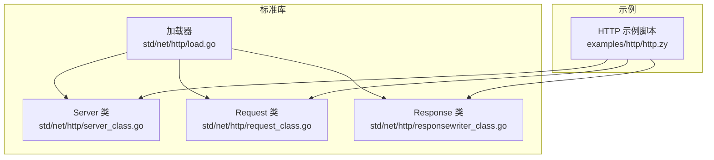
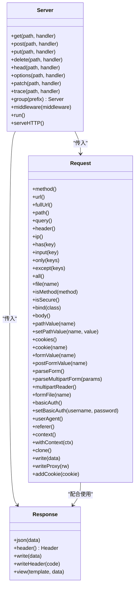
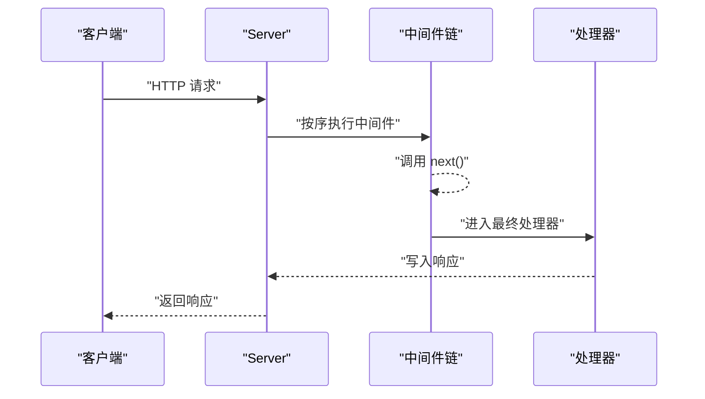
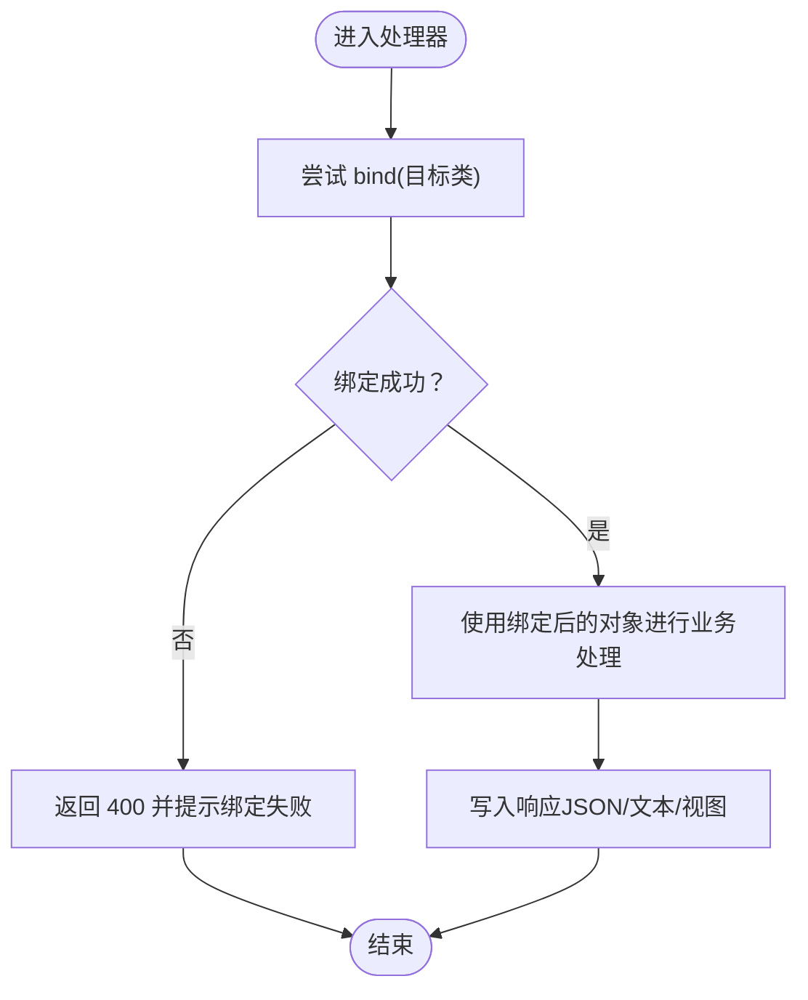
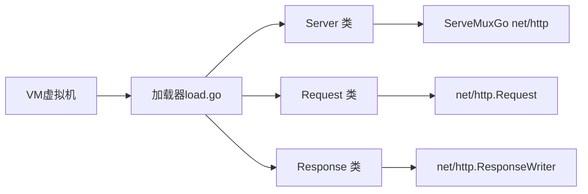

# HTTP模块扩展

<cite>
**本文引用的文件**
- [examples/http/http.zy](file://examples/http/http.zy)
- [docs/std/Net/Http/server.zy](file://docs/std/Net/Http/server.zy)
- [docs/std/Net/Http/request.zy](file://docs/std/Net/Http/request.zy)
- [docs/std/Net/Http/response.zy](file://docs/std/Net/Http/response.zy)
- [std/net/http/load.go](file://std/net/http/load.go)
- [std/net/http/server_class.go](file://std/net/http/server_class.go)
- [std/net/http/request_class.go](file://std/net/http/request_class.go)
- [std/net/http/responsewriter_class.go](file://std/net/http/responsewriter_class.go)
</cite>

## 目录
1. [简介](#简介)
2. [项目结构](#项目结构)
3. [核心组件](#核心组件)
4. [架构总览](#架构总览)
5. [详细组件分析](#详细组件分析)
6. [依赖分析](#依赖分析)
7. [性能考虑](#性能考虑)
8. [故障排查指南](#故障排查指南)
9. [结论](#结论)
10. [附录](#附录)

## 简介
本指南面向希望在 Origami 平台上进行 HTTP 模块扩展开发的工程师与架构师。内容覆盖：
- HTTP 服务器架构与核心类（Server、Request、Response）的设计与实现要点
- 路由处理、中间件开发与请求响应处理的完整示例
- 注解系统的使用方法（如 @Get、@Post、@Controller 的自定义扩展思路）
- WebSocket 支持的扩展开发（连接管理、消息处理与事件监听）
- 性能优化技巧（连接池管理、请求缓存与并发处理策略）

## 项目结构
HTTP 模块位于标准库目录 std/net/http 下，并通过加载器注册到虚拟机中；示例位于 examples/http/http.zy。

图表来源
- [std/net/http/load.go:1-17](file://std/net/http/load.go#L1-L17)
- [std/net/http/server_class.go:1-96](file://std/net/http/server_class.go#L1-L96)
- [std/net/http/request_class.go:1-251](file://std/net/http/request_class.go#L1-L251)
- [std/net/http/responsewriter_class.go:1-71](file://std/net/http/responsewriter_class.go#L1-L71)
- [examples/http/http.zy:1-232](file://examples/http/http.zy#L1-L232)

章节来源
- [std/net/http/load.go:1-17](file://std/net/http/load.go#L1-L17)
- [examples/http/http.zy:1-232](file://examples/http/http.zy#L1-L232)

## 核心组件
- Server：负责路由注册（get/post/put/delete/head/options/patch/trace）、分组（group）、中间件（middleware）、运行（run）与静态资源（static）等能力。
- Request：封装 HTTP 请求上下文，提供路径参数、查询参数、表单、文件、头、认证、IP、协议版本、绑定模型等方法。
- Response：封装 HTTP 响应写入，提供 JSON 序列化、头部设置、状态码写入、视图渲染等方法。

章节来源
- [docs/std/Net/Http/server.zy:14-107](file://docs/std/Net/Http/server.zy#L14-L107)
- [docs/std/Net/Http/request.zy:14-195](file://docs/std/Net/Http/request.zy#L14-L195)
- [docs/std/Net/Http/response.zy:14-51](file://docs/std/Net/Http/response.zy#L14-L51)

## 架构总览
HTTP 模块以“类 + 方法”的方式暴露给脚本层，底层通过 Go 的 net/http 包实现具体网络处理。Server 内部持有 ServeMux，Request/Response 则封装了对 net/http 原生对象的访问与便捷方法。

图表来源
- [std/net/http/server_class.go:26-96](file://std/net/http/server_class.go#L26-L96)
- [std/net/http/request_class.go:88-251](file://std/net/http/request_class.go#L88-L251)
- [std/net/http/responsewriter_class.go:22-71](file://std/net/http/responsewriter_class.go#L22-L71)

## 详细组件分析

### Server 类
- 路由注册：get/post/put/delete/head/options/patch/trace 通过内部 ServeMux 注册处理函数。
- 分组：group(prefix) 可为后续路由添加统一前缀，便于模块化组织。
- 中间件：middleware 接受 (req, res, next) 形式的函数，按注册顺序执行，形成洋葱模型。
- 运行：run 启动服务，serveHTTP 提供对外的 HTTP 处理入口。
- 静态资源：static 提供静态文件服务（在实现中可见）。

图表来源
- [std/net/http/server_class.go:46-64](file://std/net/http/server_class.go#L46-L64)
- [std/net/http/server_class.go:56-59](file://std/net/http/server_class.go#L56-L59)
- [examples/http/http.zy:16-74](file://examples/http/http.zy#L16-L74)

章节来源
- [std/net/http/server_class.go:10-96](file://std/net/http/server_class.go#L10-L96)
- [examples/http/http.zy:13-232](file://examples/http/http.zy#L13-L232)

### Request 类
- 数据访问：method/url/fullUrl/path/query/header/ip/has/input/only/except/all/file/isMethod/isSecure 等。
- 绑定：bind 将请求体 JSON 绑定到指定类实例，简化参数解析与校验。
- 表单与文件：formValue/postFormValue/parseForm/parseMultipartForm/multipartReader/formFile。
- 认证与头：basicAuth/setBasicAuth/userAgent/referer/cookies/cookie/addCookie。
- 上下文与克隆：context/withContext/clone/write/writeProxy。
- 只读语义：属性设置被拒绝，所有数据访问通过方法进行。

图表来源
- [std/net/http/request_class.go:171-205](file://std/net/http/request_class.go#L171-L205)
- [examples/http/http.zy:167-213](file://examples/http/http.zy#L167-L213)

章节来源
- [std/net/http/request_class.go:32-251](file://std/net/http/request_class.go#L32-L251)
- [examples/http/http.zy:76-213](file://examples/http/http.zy#L76-L213)

### Response 类
- JSON：json(data) 输出 JSON 响应。
- 头部：header() 返回 Header 对象，支持 set/get/del/values/write/writeSubset。
- 写入：write(data) 写入响应体；writeHeader(code) 写入状态码。
- 视图：view(template, data) 渲染模板（在实现中可见）。

章节来源
- [std/net/http/responsewriter_class.go:10-71](file://std/net/http/responsewriter_class.go#L10-L71)
- [docs/std/Net/Http/response.zy:14-51](file://docs/std/Net/Http/response.zy#L14-L51)

### 加载器与注册
- load.go 将 Server、Request、Response、Handler、Cookie 等类注册到 VM，使脚本可直接使用。

章节来源
- [std/net/http/load.go:7-16](file://std/net/http/load.go#L7-L16)

## 依赖分析
- Server 依赖 Go net/http.ServeMux 进行路由分发。
- Request/Response 封装 net/http 原生对象，提供更易用的方法集。
- 中间件链式调用，形成清晰的控制流与责任分离。
- 示例脚本通过 Server 的 get/post/group/middleware/run 等方法构建完整应用。

图表来源
- [std/net/http/load.go:7-16](file://std/net/http/load.go#L7-L16)
- [std/net/http/server_class.go:12-13](file://std/net/http/server_class.go#L12-L13)
- [std/net/http/request_class.go:60-85](file://std/net/http/request_class.go#L60-L85)
- [std/net/http/responsewriter_class.go:16-19](file://std/net/http/responsewriter_class.go#L16-L19)

章节来源
- [std/net/http/server_class.go:10-96](file://std/net/http/server_class.go#L10-L96)
- [std/net/http/request_class.go:32-251](file://std/net/http/request_class.go#L32-L251)
- [std/net/http/responsewriter_class.go:10-71](file://std/net/http/responsewriter_class.go#L10-L71)
- [std/net/http/load.go:1-17](file://std/net/http/load.go#L1-L17)

## 性能考虑
- 连接池与并发
  - 使用 goroutine 并发处理请求，避免阻塞主循环。
  - 合理设置运行时并发度，结合中间件异步化（如日志、监控）降低延迟。
- 路由与匹配
  - 将高频路由置于前面，使用 group 统一前缀减少匹配开销。
  - 避免在中间件中做重 IO 操作，必要时异步化或缓存。
- 缓存策略
  - 对静态资源启用浏览器缓存与服务端缓存（如内存缓存键值）。
  - 对热点查询结果进行缓存，注意失效策略与一致性。
- 序列化与压缩
  - JSON 序列化尽量复用缓冲区，避免频繁分配。
  - 在高带宽场景开启 gzip 压缩（若框架支持）。
- 监控与限流
  - 在中间件中加入 QPS、P95/P99、错误率统计。
  - 对敏感接口增加限流与熔断，防止雪崩。

## 故障排查指南
- 中间件未生效
  - 确认 middleware 是否在路由注册之前调用。
  - 检查 next 是否被正确调用，避免提前返回导致后续中间件不执行。
- 路由不匹配
  - 核对路径前缀与大小写，group 前缀是否正确拼接。
  - 使用通配符或正则路由时，确保匹配顺序与优先级。
- 参数绑定失败
  - 检查请求体格式（application/json）与字段名是否一致。
  - 使用 bind 失败时返回 400 并记录日志，便于定位问题。
- 响应异常
  - 确保 writeHeader 与 write 的顺序正确，避免重复写入头部。
  - JSON 输出前检查数据结构，避免循环引用导致序列化失败。
- 日志与追踪
  - 在全局中间件中记录请求开始/结束时间、耗时与错误堆栈，便于快速定位。

章节来源
- [examples/http/http.zy:16-74](file://examples/http/http.zy#L16-L74)
- [examples/http/http.zy:167-213](file://examples/http/http.zy#L167-L213)

## 结论
Origami 的 HTTP 模块以简洁的类与方法抽象，将 Go net/http 的强大能力与脚本语言的易用性结合。通过 Server 的路由与中间件机制、Request 的丰富数据访问能力以及 Response 的便捷输出方法，开发者可以快速构建高性能、可维护的 Web 应用。建议在实际项目中遵循中间件洋葱模型、参数绑定与缓存策略，持续优化并发与可观测性。

## 附录

### HTTP 注解系统与自定义扩展（概念性说明）
- 注解能力
  - 可通过反射与注解解析器识别控制器方法上的注解（如 @Get、@Post、@Controller），自动注册路由。
- 自定义扩展步骤
  - 定义注解类与解析器，扫描类与方法，提取注解元数据（路径、方法、中间件等）。
  - 在应用启动阶段，将解析出的路由映射注册到 Server。
  - 可选：为控制器注入 Request/Response 或依赖容器，实现依赖注入与生命周期管理。
- 注意事项
  - 注解解析应在应用启动时完成，避免运行时重复扫描。
  - 保持注解与实现的一致性，提供完善的单元测试与集成测试。

### WebSocket 扩展开发（概念性说明）
- 连接管理
  - 使用升级握手（Upgrade）建立连接，维护连接集合（如 map[string]*Conn）。
  - 为每个连接分配唯一标识，记录会话信息与订阅主题。
- 消息处理
  - 解析帧类型（文本/二进制/关闭/心跳），分发到对应处理器。
  - 对批量消息采用队列与背压策略，避免内存暴涨。
- 事件监听
  - 提供连接建立、消息到达、连接关闭等事件钩子，便于接入日志与监控。
  - 支持广播与订阅模式，结合路由前缀实现多房间/多频道。