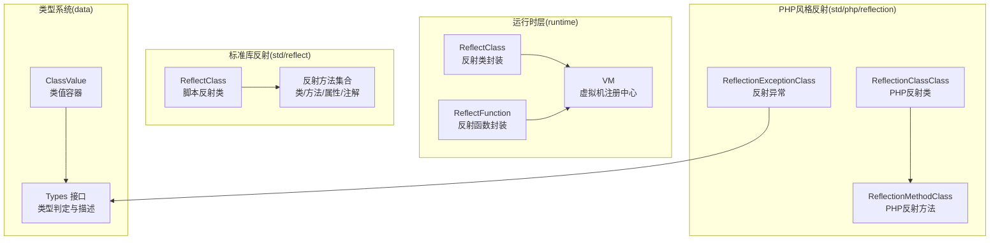
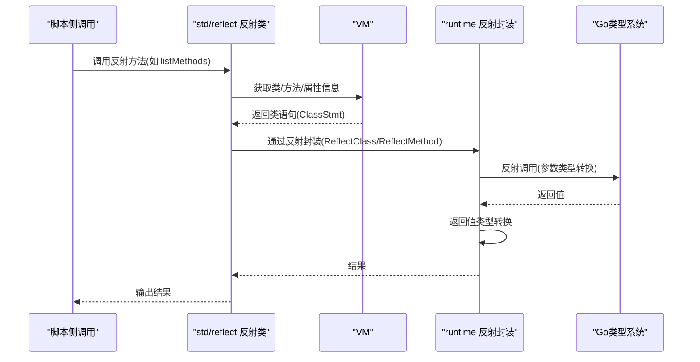
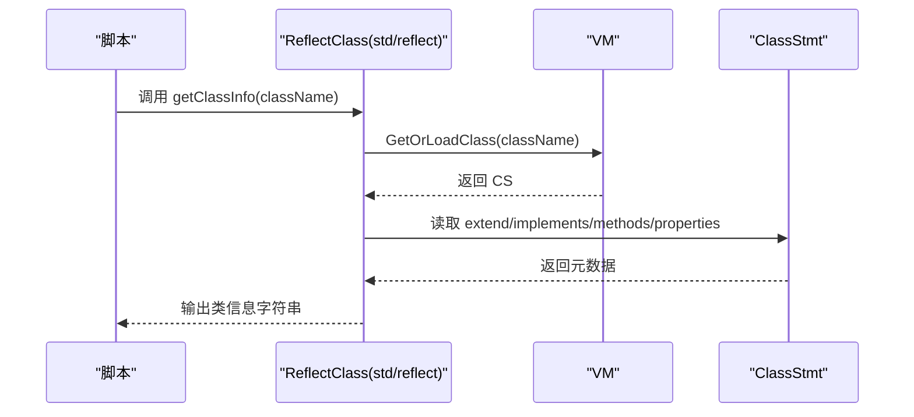
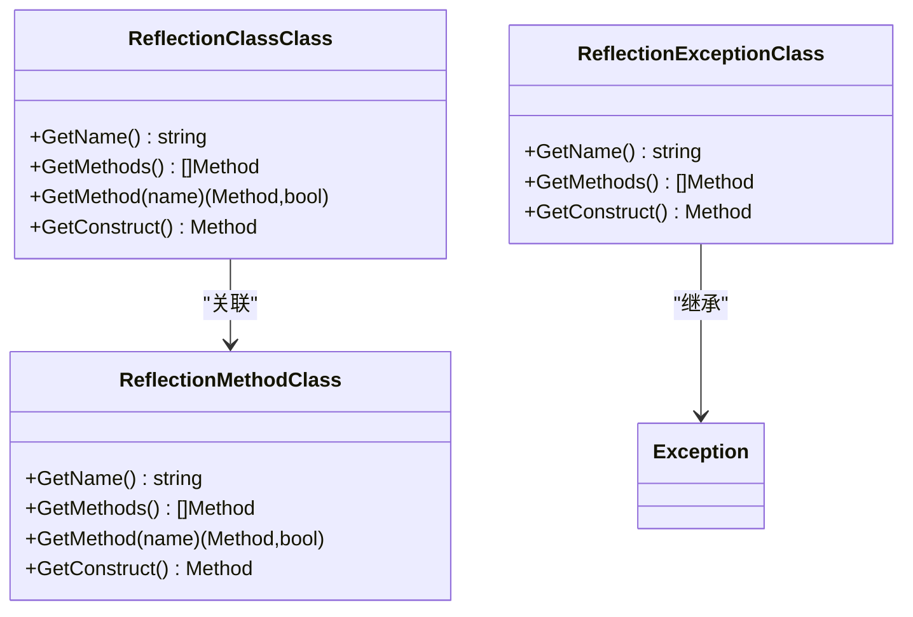
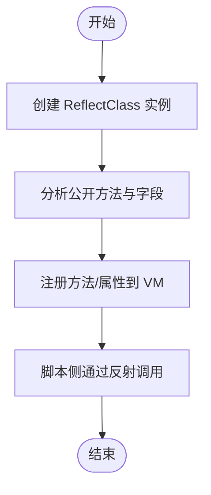
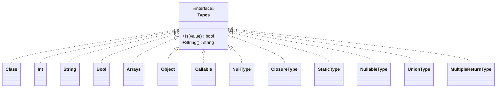
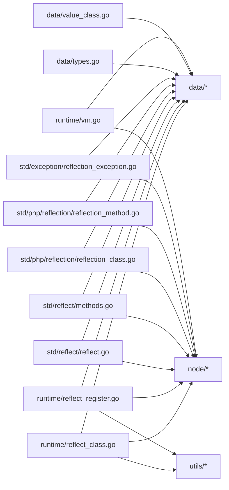

# 反射模块扩展

<cite>
**本文档引用的文件**
- [runtime/reflect_class.go](file://runtime/reflect_class.go)
- [runtime/reflect_register.go](file://runtime/reflect_register.go)
- [std/reflect/load.go](file://std/reflect/load.go)
- [std/reflect/reflect.go](file://std/reflect/reflect.go)
- [std/reflect/methods.go](file://std/reflect/methods.go)
- [std/php/reflection/reflection_class.go](file://std/php/reflection/reflection_class.go)
- [std/php/reflection/reflection_method.go](file://std/php/reflection/reflection_method.go)
- [std/exception/reflection_exception.go](file://std/exception/reflection_exception.go)
- [data/types.go](file://data/types.go)
- [data/value_class.go](file://data/value_class.go)
- [runtime/vm.go](file://runtime/vm.go)
</cite>

## 目录
1. [引言](#引言)
2. [项目结构](#项目结构)
3. [核心组件](#核心组件)
4. [架构总览](#架构总览)
5. [详细组件分析](#详细组件分析)
6. [依赖分析](#依赖分析)
7. [性能考虑](#性能考虑)
8. [故障排查指南](#故障排查指南)
9. [结论](#结论)
10. [附录](#附录)

## 引言
本指南面向希望扩展“反射模块”的开发者，系统讲解反射模块的核心架构、动态类型系统设计原理，并提供扩展路径：自定义属性与元数据管理、类型检查增强、动态类生成（运行时类定义、方法注入、属性绑定）、反射API扩展（新增反射类型与自定义反射操作），以及性能优化（反射缓存、类型预编译、内存管理）与安全性及错误处理最佳实践。

## 项目结构
反射能力由三层组成：
- 运行时层（runtime）：提供反射类与反射函数的注册与调用桥接，连接Go类型系统与脚本运行时。
- 标准库反射（std/reflect）：提供脚本侧的反射入口类与常用反射方法（类/方法/属性信息查询、注解读取等）。
- PHP风格反射（std/php/reflection）：提供更贴近PHP语言习惯的反射类与方法（ReflectionClass、ReflectionMethod等）。



**图表来源**
- [runtime/reflect_class.go:12-136](file://runtime/reflect_class.go#L12-L136)
- [runtime/reflect_register.go:12-184](file://runtime/reflect_register.go#L12-L184)
- [std/reflect/load.go:7-10](file://std/reflect/load.go#L7-L10)
- [std/reflect/reflect.go:8-92](file://std/reflect/reflect.go#L8-L92)
- [std/reflect/methods.go:10-876](file://std/reflect/methods.go#L10-L876)
- [std/php/reflection/reflection_class.go:9-119](file://std/php/reflection/reflection_class.go#L9-L119)
- [std/php/reflection/reflection_method.go:10-179](file://std/php/reflection/reflection_method.go#L10-L179)
- [std/exception/reflection_exception.go:9-89](file://std/exception/reflection_exception.go#L9-L89)
- [data/types.go:5-262](file://data/types.go#L5-L262)
- [data/value_class.go:8-295](file://data/value_class.go#L8-L295)

**章节来源**
- [runtime/reflect_class.go:12-136](file://runtime/reflect_class.go#L12-L136)
- [runtime/reflect_register.go:12-184](file://runtime/reflect_register.go#L12-L184)
- [std/reflect/load.go:7-10](file://std/reflect/load.go#L7-L10)
- [std/reflect/reflect.go:8-92](file://std/reflect/reflect.go#L8-L92)
- [std/reflect/methods.go:10-876](file://std/reflect/methods.go#L10-L876)
- [std/php/reflection/reflection_class.go:9-119](file://std/php/reflection/reflection_class.go#L9-L119)
- [std/php/reflection/reflection_method.go:10-179](file://std/php/reflection/reflection_method.go#L10-L179)
- [std/exception/reflection_exception.go:9-89](file://std/exception/reflection_exception.go#L9-L89)
- [data/types.go:5-262](file://data/types.go#L5-L262)
- [data/value_class.go:8-295](file://data/value_class.go#L8-L295)

## 核心组件
- 运行时反射类与方法
  - ReflectClass：封装任意Go类型，暴露方法/属性给脚本侧调用，支持按需分析方法、参数、返回值类型转换。
  - ReflectMethod：对Go方法的包装，负责参数与返回值的双向类型转换。
  - ReflectConstructor：对Go结构体构造流程的包装，支持字段注入。
  - ReflectFunction：对Go函数的包装，支持参数与返回值类型转换。
- 脚本侧反射入口
  - ReflectClass（std/reflect）：提供 getClassInfo/getMethodInfo/getPropertyInfo/listMethods/listProperties 等方法，以及注解读取系列方法。
- PHP风格反射
  - ReflectionClassClass/ReflectionMethodClass：提供更贴近PHP语言习惯的反射API。
- 类型系统与值容器
  - Types接口与多种类型实现（基础类型、联合类型、可空类型、泛型等）。
  - ClassValue：类值容器，承载类语句与实例属性，支持继承属性查找与动态属性写入。
- 虚拟机注册中心
  - VM：统一注册类、接口、函数、常量，提供类/接口加载与缓存。

**章节来源**
- [runtime/reflect_class.go:12-136](file://runtime/reflect_class.go#L12-L136)
- [runtime/reflect_register.go:12-184](file://runtime/reflect_register.go#L12-L184)
- [std/reflect/reflect.go:8-92](file://std/reflect/reflect.go#L8-L92)
- [std/reflect/methods.go:10-876](file://std/reflect/methods.go#L10-L876)
- [std/php/reflection/reflection_class.go:9-119](file://std/php/reflection/reflection_class.go#L9-L119)
- [std/php/reflection/reflection_method.go:10-179](file://std/php/reflection/reflection_method.go#L10-L179)
- [data/types.go:5-262](file://data/types.go#L5-L262)
- [data/value_class.go:8-295](file://data/value_class.go#L8-L295)
- [runtime/vm.go:118-213](file://runtime/vm.go#L118-L213)

## 架构总览
下图展示从脚本调用到Go类型系统的完整反射调用链路，包括参数/返回值类型转换、异常处理与VM注册。



**图表来源**
- [std/reflect/methods.go:128-171](file://std/reflect/methods.go#L128-L171)
- [runtime/reflect_class.go:231-274](file://runtime/reflect_class.go#L231-L274)
- [runtime/vm.go:162-181](file://runtime/vm.go#L162-L181)

**章节来源**
- [std/reflect/methods.go:128-171](file://std/reflect/methods.go#L128-L171)
- [runtime/reflect_class.go:231-274](file://runtime/reflect_class.go#L231-L274)
- [runtime/vm.go:162-181](file://runtime/vm.go#L162-L181)

## 详细组件分析

### 运行时反射类与方法
- ReflectClass
  - 功能：封装任意Go类型，延迟分析方法，支持构造函数注入与实例共享。
  - 关键点：实例类型提取、方法过滤（公开方法）、参数名称推导（优先使用结构体字段名）。
- ReflectMethod
  - 功能：封装Go方法调用，负责参数与返回值的双向类型转换。
  - 关键点：参数类型转换（string/int/float/bool）、返回值转换（统一转为脚本值）。
- ReflectConstructor
  - 功能：封装Go结构体字段注入，支持按变量名设置字段值。
  - 关键点：字段类型匹配与赋值、错误处理。
- ReflectFunction
  - 功能：封装Go函数调用，参数与返回值类型转换。
  - 关键点：函数签名分析、参数/返回值转换。

```mermaid
classDiagram
class ReflectClass {
+string name
+reflect.Type instanceType
+map~string,Method~ methods
+map~string,Property~ properties
+interface{} instance
+GetName() string
+GetMethods() []Method
+GetMethod(name) (Method,bool)
+GetValue(ctx) (GetValue,Control)
}
class ReflectMethod {
+string name
+reflect.Method method
+interface{} instance
+reflect.Type instanceType
+GetName() string
+GetParams() []GetValue
+Call(ctx) (GetValue,Control)
-convertToGoValue(...)
-convertToScriptValue(...)
}
class ReflectConstructor {
+string className
+reflect.Type instanceType
+interface{} instance
+GetName() string
+GetParams() []GetValue
+Call(ctx) (GetValue,Control)
}
class ReflectFunction {
+string name
+reflect.Value fn
+reflect.Type fnType
+params []GetValue
+variables []Variable
+Call(ctx) (GetValue,Control)
}
ReflectClass --> ReflectMethod : "持有"
ReflectClass --> ReflectConstructor : "构造函数"
ReflectFunction --> reflect.Value : "调用"
```

**图表来源**
- [runtime/reflect_class.go:12-136](file://runtime/reflect_class.go#L12-L136)
- [runtime/reflect_register.go:12-184](file://runtime/reflect_register.go#L12-L184)

**章节来源**
- [runtime/reflect_class.go:12-136](file://runtime/reflect_class.go#L12-L136)
- [runtime/reflect_register.go:12-184](file://runtime/reflect_register.go#L12-L184)

### 脚本侧反射API
- ReflectClass（std/reflect）
  - 提供方法：getClassInfo、getMethodInfo、getPropertyInfo、listMethods、listProperties、listClasses、getClassAnnotations、getMethodAnnotations、getPropertyAnnotations、getAllAnnotations、getAnnotationDetails。
  - 特性：通过VM获取类语句，构建友好信息字符串或对象，支持注解读取。
- 注解读取流程
  - 从类语句中读取注解列表，按类/方法/属性维度输出信息。



**图表来源**
- [std/reflect/reflect.go:44-92](file://std/reflect/reflect.go#L44-L92)
- [std/reflect/methods.go:42-92](file://std/reflect/methods.go#L42-L92)
- [runtime/vm.go:162-181](file://runtime/vm.go#L162-L181)

**章节来源**
- [std/reflect/reflect.go:44-92](file://std/reflect/reflect.go#L44-L92)
- [std/reflect/methods.go:42-92](file://std/reflect/methods.go#L42-L92)
- [runtime/vm.go:162-181](file://runtime/vm.go#L162-L181)

### PHP风格反射
- ReflectionClassClass/ReflectionMethodClass
  - 提供与PHP反射一致的API（如 getName、getMethods、getMethod、getModifiers、isPublic 等）。
  - 内部通过VM加载类语句，结合继承链查找方法，处理访问修饰符与构造函数。
- 异常体系
  - ReflectionExceptionClass：继承Exception，实现Throwable接口，用于反射相关错误。



**图表来源**
- [std/php/reflection/reflection_class.go:9-119](file://std/php/reflection/reflection_class.go#L9-L119)
- [std/php/reflection/reflection_method.go:10-179](file://std/php/reflection/reflection_method.go#L10-L179)
- [std/exception/reflection_exception.go:9-89](file://std/exception/reflection_exception.go#L9-L89)

**章节来源**
- [std/php/reflection/reflection_class.go:9-119](file://std/php/reflection/reflection_class.go#L9-L119)
- [std/php/reflection/reflection_method.go:10-179](file://std/php/reflection/reflection_method.go#L10-L179)
- [std/exception/reflection_exception.go:9-89](file://std/exception/reflection_exception.go#L9-L89)

### 动态类生成与方法注入
- 运行时类定义
  - 通过运行时封装ReflectClass，将任意Go类型暴露为“类”，支持按需分析方法与属性。
- 方法注入
  - 可通过ReflectFunction注册函数为方法，或在ReflectClass中动态挂载方法（当前实现以反射分析为主，扩展点见后续建议）。
- 属性绑定
  - 通过ReflectConstructor将脚本变量映射到Go结构体字段，实现属性绑定。



**图表来源**
- [runtime/reflect_class.go:21-131](file://runtime/reflect_class.go#L21-L131)
- [runtime/reflect_register.go:180-189](file://runtime/reflect_register.go#L180-L189)

**章节来源**
- [runtime/reflect_class.go:21-131](file://runtime/reflect_class.go#L21-L131)
- [runtime/reflect_register.go:180-189](file://runtime/reflect_register.go#L180-L189)

### 类型检查与动态类型系统
- Types接口与类型实现
  - 支持基础类型、联合类型、可空类型、泛型、闭包类型、静态类型等。
- 类型判定与字符串化
  - 通过Is(value)判断值是否满足类型约束，String()输出类型描述。
- ClassValue与继承属性查找
  - 支持父类属性继承查找、动态属性写入与遍历。



**图表来源**
- [data/types.go:5-262](file://data/types.go#L5-L262)
- [data/value_class.go:8-295](file://data/value_class.go#L8-L295)

**章节来源**
- [data/types.go:5-262](file://data/types.go#L5-L262)
- [data/value_class.go:8-295](file://data/value_class.go#L8-L295)

## 依赖分析
- 运行时层依赖
  - runtime/reflect_class.go 依赖 data、node、utils，用于类型封装、AST节点与工具。
  - runtime/reflect_register.go 依赖 data、node、utils，用于函数封装与类型转换。
- 标准库反射依赖
  - std/reflect/reflect.go 依赖 data、node，提供反射类与方法集合。
  - std/reflect/methods.go 依赖 data、node，实现各类反射方法与注解读取。
- PHP风格反射依赖
  - std/php/reflection/reflection_class.go 与 reflection_method.go 依赖 data、node，提供PHP风格反射API。
  - std/exception/reflection_exception.go 依赖 data、node，提供反射异常类。
- 类型系统与VM
  - data/types.go 与 data/value_class.go 为类型与值容器提供支撑。
  - runtime/vm.go 提供类/接口/函数注册与加载。



**图表来源**
- [runtime/reflect_class.go:3-10](file://runtime/reflect_class.go#L3-L10)
- [runtime/reflect_register.go:3-10](file://runtime/reflect_register.go#L3-L10)
- [std/reflect/reflect.go:3-7](file://std/reflect/reflect.go#L3-L7)
- [std/reflect/methods.go:3-8](file://std/reflect/methods.go#L3-L8)
- [std/php/reflection/reflection_class.go:4-7](file://std/php/reflection/reflection_class.go#L4-L7)
- [std/php/reflection/reflection_method.go:4-8](file://std/php/reflection/reflection_method.go#L4-L8)
- [std/exception/reflection_exception.go:4-7](file://std/exception/reflection_exception.go#L4-L7)
- [data/types.go:3-4](file://data/types.go#L3-L4)
- [data/value_class.go:3-7](file://data/value_class.go#L3-L7)
- [runtime/vm.go:3-12](file://runtime/vm.go#L3-L12)

**章节来源**
- [runtime/reflect_class.go:3-10](file://runtime/reflect_class.go#L3-L10)
- [runtime/reflect_register.go:3-10](file://runtime/reflect_register.go#L3-L10)
- [std/reflect/reflect.go:3-7](file://std/reflect/reflect.go#L3-L7)
- [std/reflect/methods.go:3-8](file://std/reflect/methods.go#L3-L8)
- [std/php/reflection/reflection_class.go:4-7](file://std/php/reflection/reflection_class.go#L4-L7)
- [std/php/reflection/reflection_method.go:4-8](file://std/php/reflection/reflection_method.go#L4-L8)
- [std/exception/reflection_exception.go:4-7](file://std/exception/reflection_exception.go#L4-L7)
- [data/types.go:3-4](file://data/types.go#L3-L4)
- [data/value_class.go:3-7](file://data/value_class.go#L3-L7)
- [runtime/vm.go:3-12](file://runtime/vm.go#L3-L12)

## 性能考虑
- 反射缓存
  - VM层维护classMap、interfaceMap、funcMap与classPathMap，减少重复加载与解析成本。
  - 建议：在运行时封装层增加反射元数据缓存（如方法签名、参数名称、注解列表），避免重复反射分析。
- 类型预编译
  - 在应用启动阶段批量注册反射类与函数，减少运行时动态发现的开销。
- 内存管理
  - ReflectClass共享被代理实例，避免重复分配；注意避免在频繁调用路径上创建大量中间对象。
  - ClassValue支持动态属性写入，应限制动态属性数量或采用白名单策略，降低内存膨胀风险。
- 并发安全
  - VM使用读写锁保护注册表，扩展时遵循相同模式，避免竞态条件。

**章节来源**
- [runtime/vm.go:36-130](file://runtime/vm.go#L36-L130)
- [runtime/reflect_class.go:114-131](file://runtime/reflect_class.go#L114-L131)
- [data/value_class.go:225-238](file://data/value_class.go#L225-L238)

## 故障排查指南
- 参数/返回值类型转换失败
  - 现象：调用ReflectMethod/ReflectFunction时报类型转换错误。
  - 排查：确认脚本传入值类型与Go签名一致；检查convertToGoValue/convertToScriptValue分支覆盖。
- 字段不存在或类型不匹配
  - 现象：ReflectConstructor设置字段失败。
  - 排查：确认字段名大小写与可见性；检查字段类型与传入值类型。
- 类/方法/属性不存在
  - 现象：脚本侧反射方法返回空或空字符串。
  - 排查：确认类名/方法名/属性名正确；检查VM是否已注册；查看VM加载路径与命名空间。
- 注解读取为空
  - 现象：getClassAnnotations/getMethodAnnotations/getPropertyAnnotations返回无注解。
  - 排查：确认源码中确实存在注解；检查类/方法/属性语句的注解字段是否填充。
- 异常处理
  - 建议：使用ReflectionExceptionClass抛出反射相关异常；在VM层配置异常处理器，避免默认退出。

**章节来源**
- [runtime/reflect_class.go:276-347](file://runtime/reflect_class.go#L276-L347)
- [runtime/reflect_register.go:107-178](file://runtime/reflect_register.go#L107-L178)
- [std/reflect/methods.go:474-502](file://std/reflect/methods.go#L474-L502)
- [std/exception/reflection_exception.go:9-89](file://std/exception/reflection_exception.go#L9-L89)
- [runtime/vm.go:69-116](file://runtime/vm.go#L69-L116)

## 结论
本指南梳理了反射模块的三层架构与运行机制，明确了扩展方向：在运行时层完善反射缓存与类型预编译，在脚本侧补充注解与元数据API，在PHP风格反射中补齐缺失方法，并强化类型系统与异常处理。通过合理的性能与安全策略，可在保持易用性的同时获得稳定的运行表现。

## 附录
- 扩展清单
  - 新增反射类型：在运行时层定义新的封装类型，注册到VM。
  - 自定义反射方法：在std/reflect或std/php/reflection中新增方法类，实现Call与类型声明。
  - 注解增强：扩展注解读取逻辑，支持更多注解格式与参数解析。
  - 动态类生成：在运行时层提供API，允许脚本侧动态定义类与方法。
  - 性能优化：引入反射元数据缓存、类型签名预编译、并发安全策略。
  - 安全与错误：统一异常类型、参数校验、边界条件处理。