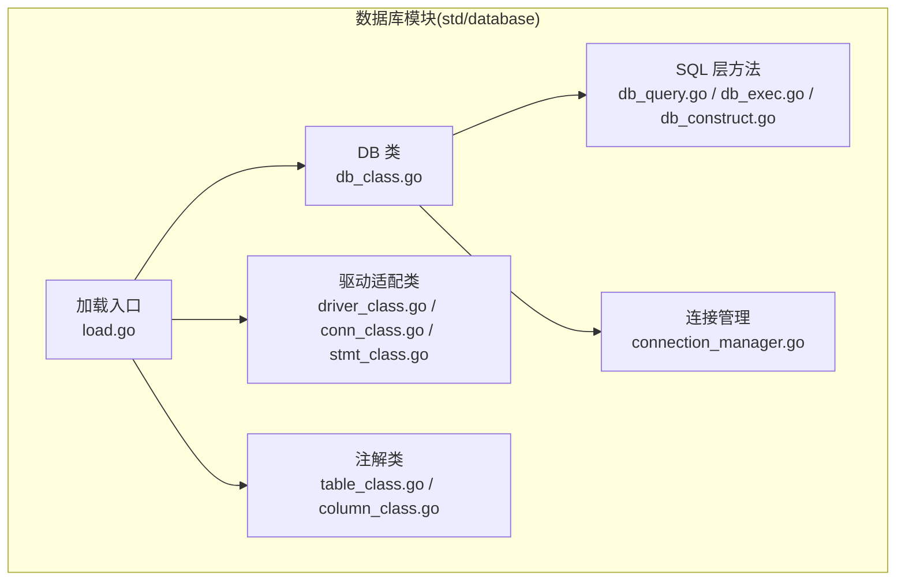
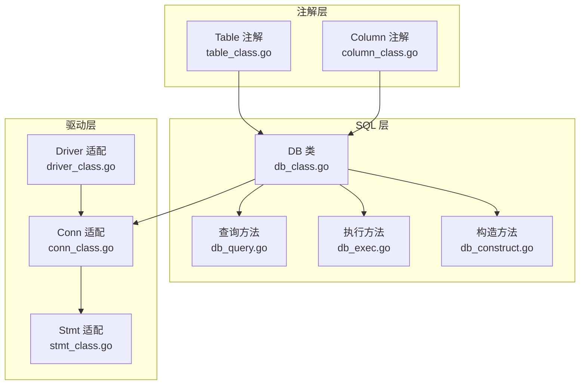
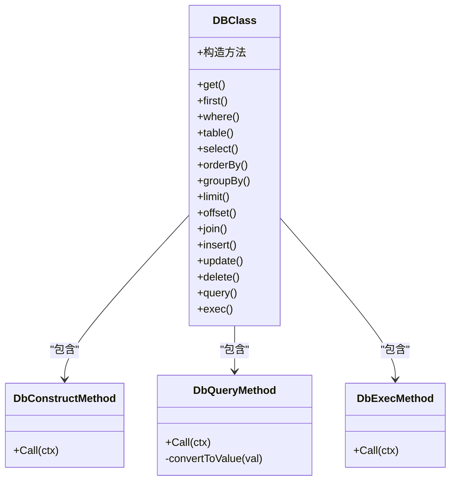
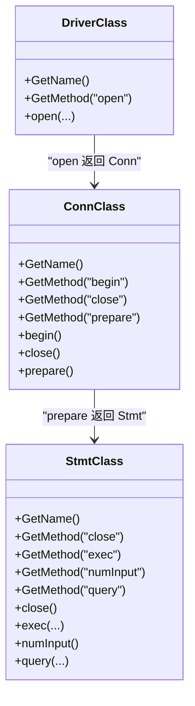
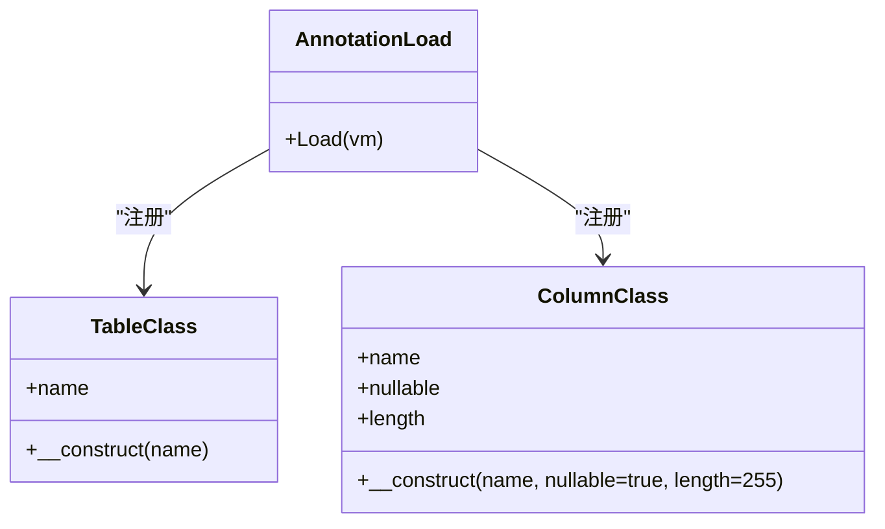
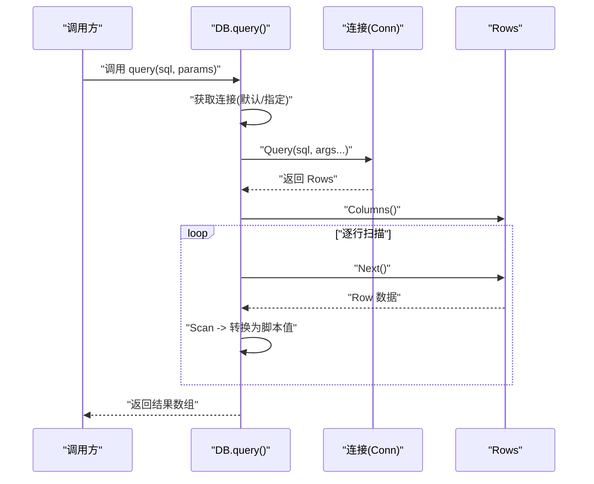
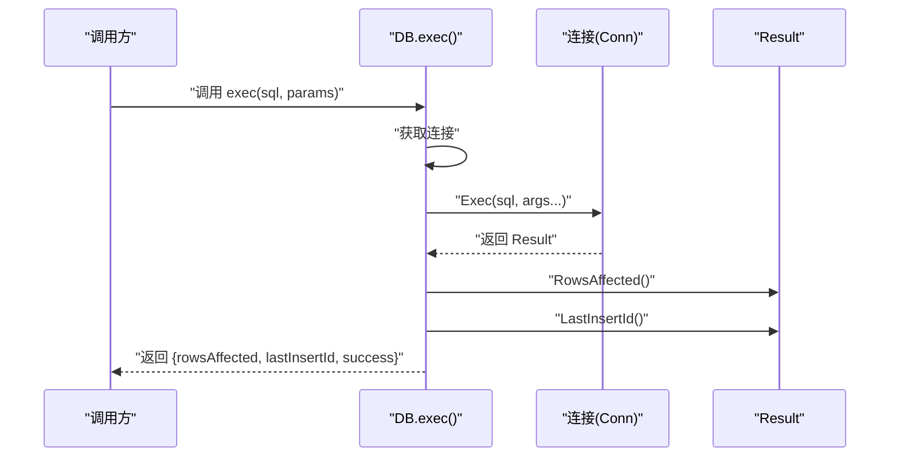
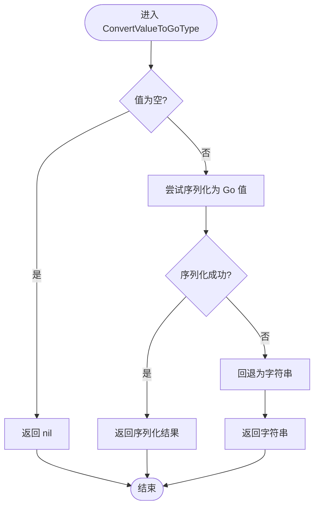
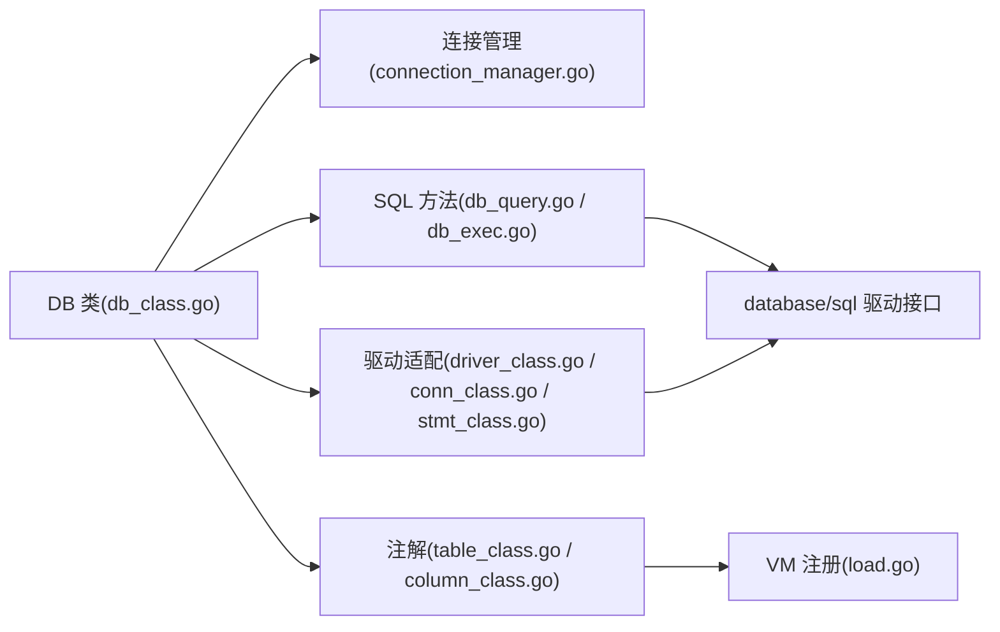

# 数据库模块扩展

<cite>
**本文引用的文件**
- [std/database/db_class.go](file://std/database/db_class.go)
- [std/database/connection_manager.go](file://std/database/connection_manager.go)
- [std/database/load.go](file://std/database/load.go)
- [std/database/readme.md](file://std/database/readme.md)
- [docs/database.md](file://docs/database.md)
- [std/database/driver/driver_class.go](file://std/database/driver/driver_class.go)
- [std/database/driver/conn_class.go](file://std/database/driver/conn_class.go)
- [std/database/driver/stmt_class.go](file://std/database/driver/stmt_class.go)
- [std/database/annotation/table_class.go](file://std/database/annotation/table_class.go)
- [std/database/annotation/column_class.go](file://std/database/annotation/column_class.go)
- [std/database/db_construct.go](file://std/database/db_construct.go)
- [std/database/db_query.go](file://std/database/db_query.go)
- [std/database/db_exec.go](file://std/database/db_exec.go)
- [std/database/utility.go](file://std/database/utility.go)
</cite>

## 目录
1. [简介](#简介)
2. [项目结构](#项目结构)
3. [核心组件](#核心组件)
4. [架构总览](#架构总览)
5. [详细组件分析](#详细组件分析)
6. [依赖分析](#依赖分析)
7. [性能考虑](#性能考虑)
8. [故障排查指南](#故障排查指南)
9. [结论](#结论)
10. [附录](#附录)

## 简介
本指南面向希望在 Origami 数据库模块基础上进行扩展与定制的开发者，系统讲解分层架构（SQL 层、驱动层、注解层）的设计原理与实现要点，并提供：
- 新数据库驱动开发：连接管理、查询执行、事务处理
- ORM 扩展：实体映射、查询构建器、关系操作
- 注解系统扩展：@Entity/@Table/@Column 等注解的自定义
- 连接池管理、查询优化与性能监控最佳实践
- 多数据库支持的扩展开发路径

## 项目结构
数据库模块位于标准库目录 std/database 下，采用“分层 + 注解 + 驱动”的组织方式：
- SQL 层：DB 类与查询构建器方法（get/first/where/select/orderBy/groupBy/limit/offset/join/insert/update/delete/query/exec），以及连接管理与加载入口
- 驱动层：对 database/sql/driver 的适配类（Driver/Conn/Stmt），桥接到脚本域
- 注解层：Table、Column 等特性注解，用于实体映射
- 文档与示例：docs/database.md 与 std/database/readme.md 提供使用说明与示例

**图示来源**
- [std/database/db_class.go:1-168](file://std/database/db_class.go#L1-L168)
- [std/database/connection_manager.go:1-66](file://std/database/connection_manager.go#L1-L66)
- [std/database/load.go:1-28](file://std/database/load.go#L1-L28)
- [std/database/driver/driver_class.go:1-49](file://std/database/driver/driver_class.go#L1-L49)
- [std/database/driver/conn_class.go:1-59](file://std/database/driver/conn_class.go#L1-L59)
- [std/database/driver/stmt_class.go:1-64](file://std/database/driver/stmt_class.go#L1-L64)
- [std/database/annotation/table_class.go:1-131](file://std/database/annotation/table_class.go#L1-L131)
- [std/database/annotation/column_class.go:1-160](file://std/database/annotation/column_class.go#L1-L160)

**章节来源**
- [std/database/db_class.go:1-168](file://std/database/db_class.go#L1-L168)
- [std/database/connection_manager.go:1-66](file://std/database/connection_manager.go#L1-L66)
- [std/database/load.go:1-28](file://std/database/load.go#L1-L28)
- [std/database/readme.md:1-168](file://std/database/readme.md#L1-L168)
- [docs/database.md:1-643](file://docs/database.md#L1-L643)

## 核心组件
- DB 类与方法族：封装查询构建器与 CRUD 操作，支持连接选择、链式调用与原生 SQL
- 连接管理器：全局连接注册、获取、移除与枚举
- 驱动适配：将 database/sql/driver 的 Driver/Conn/Stmt 暴露为脚本域类
- 注解系统：Table/Column 等特性注解，支持实体映射与元数据读取
- 加载入口：向 VM 注册 DB 类、SQL 层与注解类，并暴露连接管理函数

**章节来源**
- [std/database/db_class.go:11-168](file://std/database/db_class.go#L11-L168)
- [std/database/connection_manager.go:8-66](file://std/database/connection_manager.go#L8-L66)
- [std/database/load.go:9-27](file://std/database/load.go#L9-L27)
- [std/database/driver/driver_class.go:10-49](file://std/database/driver/driver_class.go#L10-L49)
- [std/database/driver/conn_class.go:10-59](file://std/database/driver/conn_class.go#L10-L59)
- [std/database/driver/stmt_class.go:10-64](file://std/database/driver/stmt_class.go#L10-L64)
- [std/database/annotation/table_class.go:11-131](file://std/database/annotation/table_class.go#L11-L131)
- [std/database/annotation/column_class.go:11-160](file://std/database/annotation/column_class.go#L11-L160)

## 架构总览
数据库模块采用三层设计：
- SQL 层：DB 类与各方法（查询、执行、CRUD、链式条件）统一调度连接与参数转换
- 驱动层：对 database/sql/driver 的轻量适配，保持与标准库一致的生命周期与接口
- 注解层：特性注解承载实体元数据，驱动 ORM 映射与表名/列名推断

**图示来源**
- [std/database/db_class.go:11-168](file://std/database/db_class.go#L11-L168)
- [std/database/db_query.go:12-182](file://std/database/db_query.go#L12-L182)
- [std/database/db_exec.go:11-107](file://std/database/db_exec.go#L11-L107)
- [std/database/db_construct.go:8-49](file://std/database/db_construct.go#L8-L49)
- [std/database/driver/driver_class.go:10-49](file://std/database/driver/driver_class.go#L10-L49)
- [std/database/driver/conn_class.go:10-59](file://std/database/driver/conn_class.go#L10-L59)
- [std/database/driver/stmt_class.go:10-64](file://std/database/driver/stmt_class.go#L10-L64)
- [std/database/annotation/table_class.go:11-131](file://std/database/annotation/table_class.go#L11-L131)
- [std/database/annotation/column_class.go:11-160](file://std/database/annotation/column_class.go#L11-L160)

## 详细组件分析

### SQL 层：DB 类与方法族
- DB 类负责注册与克隆方法集合，提供 get/first/where/table/select/orderBy/groupBy/limit/offset/join/crud/query/exec 等方法
- 构造方法支持可选连接名参数，用于切换默认连接
- 查询与执行方法统一从连接管理器获取连接，参数转换由工具函数完成，结果对象化返回

**图示来源**
- [std/database/db_class.go:11-168](file://std/database/db_class.go#L11-L168)
- [std/database/db_construct.go:8-49](file://std/database/db_construct.go#L8-L49)
- [std/database/db_query.go:12-182](file://std/database/db_query.go#L12-L182)
- [std/database/db_exec.go:11-107](file://std/database/db_exec.go#L11-L107)

**章节来源**
- [std/database/db_class.go:32-168](file://std/database/db_class.go#L32-L168)
- [std/database/db_construct.go:12-49](file://std/database/db_construct.go#L12-L49)
- [std/database/db_query.go:16-182](file://std/database/db_query.go#L16-L182)
- [std/database/db_exec.go:15-107](file://std/database/db_exec.go#L15-L107)

### 驱动层：database/sql/driver 适配
- DriverClass：包装 database/sql/driver.Driver，暴露 open 方法
- ConnClass：包装 database/sql/driver.Conn，暴露 begin/close/prepare
- StmtClass：包装 database/sql/driver.Stmt，暴露 close/exec/numInput/query
- 适配类均以脚本域类的形式注册到 VM，保持与标准库一致的生命周期与行为

**图示来源**
- [std/database/driver/driver_class.go:10-49](file://std/database/driver/driver_class.go#L10-L49)
- [std/database/driver/conn_class.go:10-59](file://std/database/driver/conn_class.go#L10-L59)
- [std/database/driver/stmt_class.go:10-64](file://std/database/driver/stmt_class.go#L10-L64)

**章节来源**
- [std/database/driver/driver_class.go:10-49](file://std/database/driver/driver_class.go#L10-L49)
- [std/database/driver/conn_class.go:10-59](file://std/database/driver/conn_class.go#L10-L59)
- [std/database/driver/stmt_class.go:10-64](file://std/database/driver/stmt_class.go#L10-L64)

### 注解层：实体映射与元数据
- Table 注解：特性注解，保存 name 字段；提供 name 属性读取
- Column 注解：特性注解，保存 name/nullable/length 字段；提供对应属性读取
- 注解类通过 Load 函数注册到 VM，DB 类在运行时读取注解元数据以推断表名与列名

**图示来源**
- [std/database/annotation/table_class.go:11-131](file://std/database/annotation/table_class.go#L11-L131)
- [std/database/annotation/column_class.go:11-160](file://std/database/annotation/column_class.go#L11-L160)
- [std/database/load.go:13-14](file://std/database/load.go#L13-L14)

**章节来源**
- [std/database/annotation/table_class.go:16-131](file://std/database/annotation/table_class.go#L16-L131)
- [std/database/annotation/column_class.go:16-160](file://std/database/annotation/column_class.go#L16-L160)
- [std/database/load.go:9-27](file://std/database/load.go#L9-L27)

### 查询执行流程（query）

**图示来源**
- [std/database/db_query.go:16-97](file://std/database/db_query.go#L16-L97)

**章节来源**
- [std/database/db_query.go:16-182](file://std/database/db_query.go#L16-L182)

### 执行流程（exec）

**图示来源**
- [std/database/db_exec.go:15-76](file://std/database/db_exec.go#L15-L76)

**章节来源**
- [std/database/db_exec.go:15-107](file://std/database/db_exec.go#L15-L107)

### 参数转换与类型处理
- ConvertValueToGoType：统一将脚本值转换为 Go 原生类型，优先使用序列化器，回退为字符串
- query/exec 中将参数列表转换为 []interface{} 传递给底层驱动

**图示来源**
- [std/database/utility.go:10-32](file://std/database/utility.go#L10-L32)

**章节来源**
- [std/database/utility.go:10-32](file://std/database/utility.go#L10-L32)

## 依赖分析
- DB 类依赖连接管理器以解析连接名
- SQL 层方法依赖 database/sql 驱动接口
- 注解类通过 Load 注册到 VM，DB 类在运行时读取注解元数据
- 驱动适配类依赖 database/sql/driver 接口

**图示来源**
- [std/database/db_class.go:11-168](file://std/database/db_class.go#L11-L168)
- [std/database/connection_manager.go:8-66](file://std/database/connection_manager.go#L8-L66)
- [std/database/db_query.go:12-182](file://std/database/db_query.go#L12-L182)
- [std/database/db_exec.go:11-107](file://std/database/db_exec.go#L11-L107)
- [std/database/load.go:9-27](file://std/database/load.go#L9-L27)
- [std/database/driver/driver_class.go:10-49](file://std/database/driver/driver_class.go#L10-L49)
- [std/database/driver/conn_class.go:10-59](file://std/database/driver/conn_class.go#L10-L59)
- [std/database/driver/stmt_class.go:10-64](file://std/database/driver/stmt_class.go#L10-L64)

**章节来源**
- [std/database/db_class.go:11-168](file://std/database/db_class.go#L11-L168)
- [std/database/connection_manager.go:8-66](file://std/database/connection_manager.go#L8-L66)
- [std/database/load.go:9-27](file://std/database/load.go#L9-L27)

## 性能考虑
- 参数绑定与预编译：优先使用带占位符的 SQL 与参数数组，避免字符串拼接
- 结果集控制：使用 select 限定字段、limit 限制数量、分页 offset 实现分批处理
- 索引与查询计划：为高频过滤/连接字段建立索引，必要时使用 EXPLAIN 分析
- 连接复用：通过连接管理器复用连接，减少频繁打开/关闭
- 批量操作：批量插入/更新时合并为单次执行，降低往返次数
- 监控与日志：结合原生 SQL 与驱动层日志定位慢查询

**章节来源**
- [docs/database.md:558-580](file://docs/database.md#L558-L580)
- [docs/database.md:582-628](file://docs/database.md#L582-L628)
- [std/database/readme.md:66-97](file://std/database/readme.md#L66-L97)

## 故障排查指南
- 连接不可用：检查连接是否已注册到连接管理器，默认连接是否正确设置
- SQL 执行失败：确认 SQL 语法、参数数量与类型匹配；查看返回的错误信息
- 类型转换异常：确保传入参数可被 ConvertValueToGoType 正确序列化或回退为字符串
- 事务未生效：确认 begin/commit/rollback 的调用顺序与异常处理

**章节来源**
- [std/database/db_query.go:16-21](file://std/database/db_query.go#L16-L21)
- [std/database/db_exec.go:15-20](file://std/database/db_exec.go#L15-L20)
- [std/database/utility.go:10-32](file://std/database/utility.go#L10-L32)

## 结论
数据库模块通过清晰的分层设计与完善的适配机制，为扩展新驱动、增强 ORM 能力与丰富注解体系提供了坚实基础。遵循本文的扩展路径与最佳实践，可在保证兼容性的前提下，灵活地满足多数据库与复杂业务场景的需求。

## 附录

### 开发新数据库驱动步骤
- 在驱动层新增适配类：参考 DriverClass/ConnClass/StmtClass 的模式，包装对应接口方法
- 在加载入口注册：在 load.go 中添加新驱动类的注册逻辑
- 在脚本域使用：通过 database/sql/driver 的 open 或自定义 open 方法获取 Conn 并注册到连接管理器

**章节来源**
- [std/database/driver/driver_class.go:10-49](file://std/database/driver/driver_class.go#L10-L49)
- [std/database/driver/conn_class.go:10-59](file://std/database/driver/conn_class.go#L10-L59)
- [std/database/driver/stmt_class.go:10-64](file://std/database/driver/stmt_class.go#L10-L64)
- [std/database/load.go:9-27](file://std/database/load.go#L9-L27)

### ORM 扩展开发要点
- 实体映射：利用注解读取表名/列名，结合查询构建器生成 SQL
- 查询构建器：在 DB 类中扩展链式方法，统一参数转换与结果对象化
- 关系操作：通过 join/子查询/聚合查询组合实现多表关联与统计

**章节来源**
- [std/database/annotation/table_class.go:16-131](file://std/database/annotation/table_class.go#L16-L131)
- [std/database/annotation/column_class.go:16-160](file://std/database/annotation/column_class.go#L16-L160)
- [std/database/db_class.go:11-168](file://std/database/db_class.go#L11-L168)

### 注解系统扩展方法
- 新增注解类：仿照 Table/Column 的实现，定义构造函数与属性，注册到 VM
- 元数据读取：在 ORM 层通过反射读取注解属性，生成映射规则
- 自定义注解：如需 @Entity/@GeneratedValue 等，按特性注解模式扩展

**章节来源**
- [std/database/annotation/table_class.go:16-131](file://std/database/annotation/table_class.go#L16-L131)
- [std/database/annotation/column_class.go:16-160](file://std/database/annotation/column_class.go#L16-L160)
- [std/database/load.go:13-14](file://std/database/load.go#L13-L14)

### 多数据库支持扩展
- 连接注册：通过脚本域函数 registerConnection/registerDefaultConnection 注册多个连接
- 连接选择：DB 构造方法支持连接名参数，按需切换
- 连接枚举：listConnections 便于运维与诊断

**章节来源**
- [std/database/readme.md:107-168](file://std/database/readme.md#L107-L168)
- [std/database/db_construct.go:12-20](file://std/database/db_construct.go#L12-L20)
- [std/database/connection_manager.go:29-65](file://std/database/connection_manager.go#L29-L65)