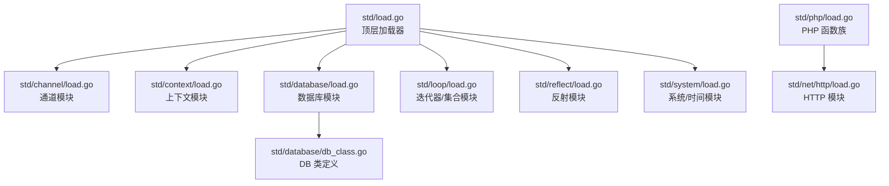
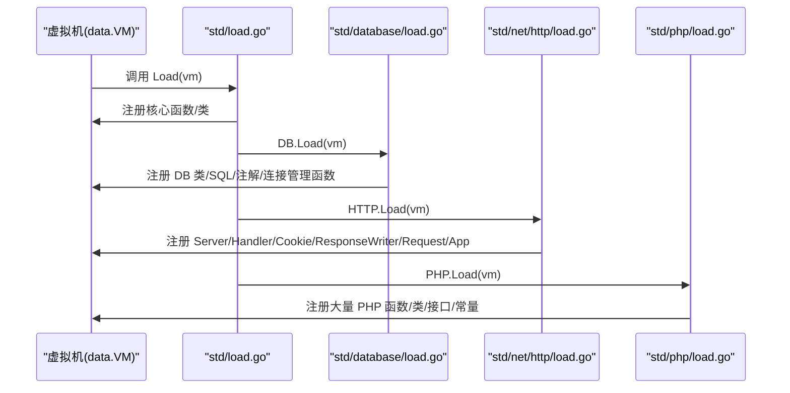
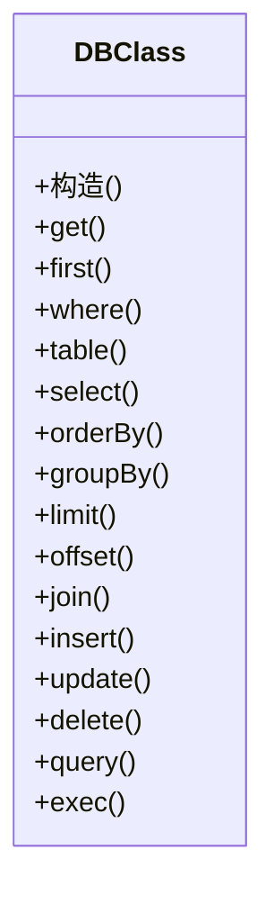
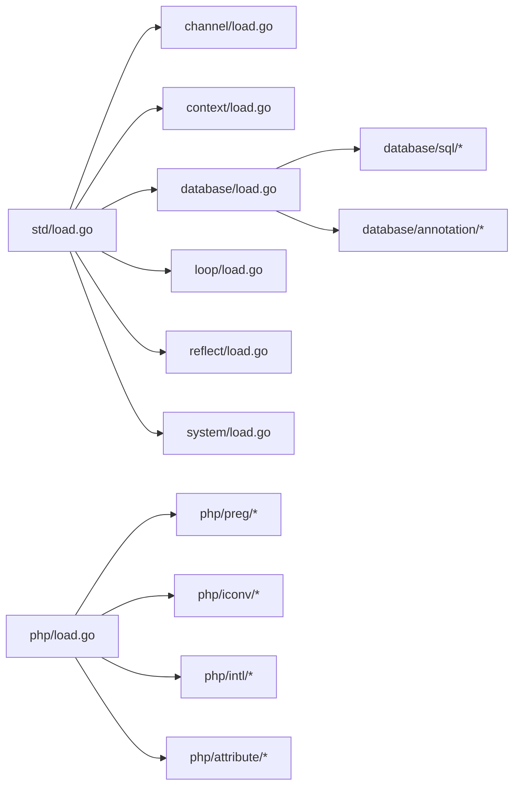

# 标准库扩展开发

<cite>
**本文引用的文件**
- [std/load.go](file://std/load.go)
- [std/channel/load.go](file://std/channel/load.go)
- [std/context/load.go](file://std/context/load.go)
- [std/database/load.go](file://std/database/load.go)
- [std/database/db_class.go](file://std/database/db_class.go)
- [std/net/http/load.go](file://std/net/http/load.go)
- [std/php/load.go](file://std/php/load.go)
- [std/loop/load.go](file://std/loop/load.go)
- [std/reflect/load.go](file://std/reflect/load.go)
- [std/system/load.go](file://std/system/load.go)
- [data/types.go](file://data/types.go)
- [data/value.go](file://data/value.go)
- [docs/std/Net/Http/server.zy](file://docs/std/Net/Http/server.zy)
- [docs/std/database-examples.zy](file://docs/std/database-examples.zy)
- [examples/database/main.go](file://examples/database/main.go)
- [examples/http/main.go](file://examples/http/main.go)
- [examples/html/main.go](file://examples/html/main.go)
</cite>

## 目录
1. [简介](#简介)
2. [项目结构](#项目结构)
3. [核心组件](#核心组件)
4. [架构总览](#架构总览)
5. [详细组件分析](#详细组件分析)
6. [依赖分析](#依赖分析)
7. [性能考量](#性能考量)
8. [故障排查指南](#故障排查指南)
9. [结论](#结论)
10. [附录](#附录)

## 简介
本指南面向希望为该代码库开发“标准库模块”的工程师，系统讲解标准库模块的组织架构、加载机制与注册流程，给出从需求分析到测试部署的完整工作流，并覆盖API设计原则、类型系统、模块间依赖与版本兼容策略、性能与并发安全最佳实践。

## 项目结构
标准库位于 std 目录下，采用按功能域分包的组织方式：
- 顶层模块入口：std/load.go 负责统一注册核心类与函数，并委派子模块加载
- 子模块：如 channel、context、database、net/http、php、loop、reflect、system/os 等
- 数据与类型系统：data 目录提供 VM、类型系统、值模型等基础设施

图表来源
- [std/load.go:14-38](file://std/load.go#L14-L38)
- [std/channel/load.go:8-12](file://std/channel/load.go#L8-L12)
- [std/context/load.go:7-23](file://std/context/load.go#L7-L23)
- [std/database/load.go:9-27](file://std/database/load.go#L9-L27)
- [std/database/db_class.go:7-167](file://std/database/db_class.go#L7-L167)
- [std/loop/load.go:25-30](file://std/loop/load.go#L25-L30)
- [std/reflect/load.go:8-10](file://std/reflect/load.go#L8-L10)
- [std/system/load.go:7-11](file://std/system/load.go#L7-L11)
- [std/php/load.go:19-212](file://std/php/load.go#L19-L212)
- [std/net/http/load.go:7-16](file://std/net/http/load.go#L7-L16)

章节来源
- [std/load.go:14-38](file://std/load.go#L14-L38)

## 核心组件
- 顶层加载器：负责向虚拟机注册核心函数与类，并依次委派子模块加载
- 子模块加载器：各自模块内的 load.go 负责注册类、接口、函数
- 类与方法：通过实现 data.ClassStmt、data.Method 等接口完成类与方法的注册
- 函数与参数：通过 data.FuncStmt 实现函数注册，参数与变量通过 node.ParameterReference 等声明
- 类型系统：data/types.go 提供基础类型、联合类型、可空类型、泛型等类型表达能力

章节来源
- [std/load.go:14-38](file://std/load.go#L14-L38)
- [std/php/load.go:19-212](file://std/php/load.go#L19-L212)
- [data/types.go:51-106](file://data/types.go#L51-L106)
- [data/types.go:142-188](file://data/types.go#L142-L188)
- [data/value.go:4-38](file://data/value.go#L4-L38)

## 架构总览
标准库加载遵循“顶层聚合 + 子模块委派”的模式。顶层加载器集中注册核心类与函数，再调用各子模块的 Load 函数完成细分领域的注册。

图表来源
- [std/load.go:14-38](file://std/load.go#L14-L38)
- [std/database/load.go:9-27](file://std/database/load.go#L9-L27)
- [std/net/http/load.go:7-16](file://std/net/http/load.go#L7-L16)
- [std/php/load.go:19-212](file://std/php/load.go#L19-L212)

## 详细组件分析

### 顶层加载器（std/load.go）
- 注册核心函数：dump、int/string/bool/float/object 转换函数
- 注册核心类与接口：log、exception 接口与异常类、os 类
- 委派子模块：reflect、channel、loop、database

章节来源
- [std/load.go:14-38](file://std/load.go#L14-L38)

### 数据库模块（std/database）
- 类注册：DB 类（查询构建器与 CRUD）
- 子模块委派：sql、annotation
- 连接管理函数：注册连接、默认连接、获取、移除、列举

图表来源
- [std/database/db_class.go:11-167](file://std/database/db_class.go#L11-L167)

章节来源
- [std/database/load.go:9-27](file://std/database/load.go#L9-L27)
- [std/database/db_class.go:7-167](file://std/database/db_class.go#L7-L167)

### HTTP 模块（std/net/http）
- 类注册：Server、Handler、Cookie、ResponseWriter、Request
- 函数注册：App

章节来源
- [std/net/http/load.go:7-16](file://std/net/http/load.go#L7-L16)

### PHP 函数族（std/php）
- 职责：注册大量 PHP 内置函数、类、接口、常量
- 结构：按子包组织 array、core、file、iconv、intl、preg、proc、reflection、stream 等
- 常量初始化：initPhpDefaultDefines 设置 PATH 分隔符、排序标志、错误级别、版本信息、数学常量、布尔常量等

章节来源
- [std/php/load.go:19-212](file://std/php/load.go#L19-L212)
- [std/php/load.go:214-293](file://std/php/load.go#L214-L293)

### 上下文模块（std/context）
- 职责：注册 WithCancel/WithDeadline/WithTimeout/WithValue 等上下文函数
- 设计：以函数为中心，不引入类

章节来源
- [std/context/load.go:7-23](file://std/context/load.go#L7-L23)

### 反射模块（std/reflect）
- 职责：注册 Reflect 类

章节来源
- [std/reflect/load.go:8-10](file://std/reflect/load.go#L8-L10)

### 循环/集合模块（std/loop）
- 职责：定义语言级接口（如 Iterator），注册 List、HashMap 等类
- 设计：通过 node.InterfaceStatement 定义接口方法签名

章节来源
- [std/loop/load.go:9-23](file://std/loop/load.go#L9-L23)
- [std/loop/load.go:25-30](file://std/loop/load.go#L25-L30)

### 系统/时间模块（std/system）
- 职责：注册 DateTime 接口与 DateTime/DateTimeZone 类

章节来源
- [std/system/load.go:7-11](file://std/system/load.go#L7-L11)

### 类型系统（data/types.go）
- 支持：基础类型、联合类型、可空类型、多返回值类型、泛型、Closure、Null、Static 等
- 用途：用于函数签名、方法签名、参数与返回值类型声明与校验

章节来源
- [data/types.go:51-106](file://data/types.go#L51-L106)
- [data/types.go:142-188](file://data/types.go#L142-L188)
- [data/types.go:200-219](file://data/types.go#L200-L219)

### 值与调用接口（data/value.go）
- Value/CallableValue：抽象值与可调用值
- 属性访问与方法获取接口：GetProperty/SetProperty/GetMethod
- 用于在运行时对对象属性与方法进行统一访问

章节来源
- [data/value.go:4-38](file://data/value.go#L4-L38)

## 依赖分析
- 顶层模块依赖：std/load.go 依赖各子模块包（channel、database、exception、log、loop、reflect、system/os）
- 子模块内部依赖：database 依赖其子模块 annotation 与 sql；php 依赖众多子包（array、core、file、iconv、intl、preg、proc、reflection、stream）

图表来源
- [std/load.go:3-12](file://std/load.go#L3-L12)
- [std/database/load.go:5-7](file://std/database/load.go#L5-L7)
- [std/php/load.go:6-16](file://std/php/load.go#L6-L16)

章节来源
- [std/load.go:3-12](file://std/load.go#L3-L12)
- [std/database/load.go:5-7](file://std/database/load.go#L5-L7)
- [std/php/load.go:6-16](file://std/php/load.go#L6-L16)

## 性能考量
- 类型系统与多态：合理使用联合类型与可空类型，避免过度复杂的类型组合导致运行时校验开销增大
- 函数与方法注册：批量注册时尽量复用 node.ParameterReference 等声明，减少重复构造
- 并发安全：在 VM 注册阶段避免并发写入；若需动态注册，应加锁或使用单线程初始化
- 内存管理：函数与类的克隆/复制逻辑应避免不必要的深拷贝；对大数组/对象的处理建议采用流式或分页策略
- I/O 密集：HTTP、数据库模块应结合异步/协程模型，避免阻塞主线程

## 故障排查指南
- 注册失败：确认模块的 Load 函数是否被顶层加载器调用
- 类/方法未找到：核对 GetName、GetMethod 的字符串匹配是否一致
- 类型不匹配：检查 data/types.go 中类型声明与实际值是否一致
- 常量缺失：PHP 模块的常量由 initPhpDefaultDefines 初始化，确保已调用

章节来源
- [std/load.go:14-38](file://std/load.go#L14-L38)
- [std/php/load.go:214-293](file://std/php/load.go#L214-L293)

## 结论
通过“顶层聚合 + 子模块委派”的架构，标准库实现了清晰的模块化与可扩展性。开发者只需遵循现有模式，在对应模块内实现 Load、类与方法、函数注册，并在顶层加载器中纳入即可快速扩展新模块。

## 附录

### 开发新标准库模块的工作流程
- 需求分析：明确功能域、API 设计、类型约束
- 目录与命名：在 std 下新建子目录，按功能域命名（如 std/myfeat），遵循小写与下划线风格
- 类与方法：实现 data.ClassStmt 与 data.Method，必要时定义接口
- 函数注册：实现 data.FuncStmt，声明参数与变量
- 类型系统：在 data/types.go 中补充必要的类型支持
- 模块加载：新增子模块的 load.go，并在 std/load.go 中委派加载
- 文档与示例：在 docs/std 下添加说明文档与示例脚本
- 测试与集成：编写单元测试与端到端示例，参考 examples 目录结构
- 部署与兼容：确保与现有 API 兼容，必要时提供迁移指引

### 现有模块扩展示例

#### HTTP 模块扩展要点
- 类与函数：参考 std/net/http/load.go 的注册模式
- 示例脚本：可参考 docs/std/Net/Http/server.zy 与 examples/http/main.go

章节来源
- [std/net/http/load.go:7-16](file://std/net/http/load.go#L7-L16)
- [docs/std/Net/Http/server.zy](file://docs/std/Net/Http/server.zy)
- [examples/http/main.go](file://examples/http/main.go)

#### 数据库模块扩展要点
- 类与方法：参考 std/database/db_class.go 的类与方法注册模式
- 示例脚本：可参考 docs/std/database-examples.zy 与 examples/database/main.go

章节来源
- [std/database/db_class.go:7-167](file://std/database/db_class.go#L7-L167)
- [docs/std/database-examples.zy](file://docs/std/database-examples.zy)
- [examples/database/main.go](file://examples/database/main.go)

#### PHP 函数族扩展要点
- 函数注册：参考 std/php/load.go 的批量注册模式
- 示例脚本：可参考 examples/html/main.go

章节来源
- [std/php/load.go:19-212](file://std/php/load.go#L19-L212)
- [examples/html/main.go](file://examples/html/main.go)

### API 设计原则
- 函数签名：使用 data.FuncStmt，参数与变量通过 node.ParameterReference 声明，返回值类型与参数类型保持一致
- 参数验证：在 Call 中对输入进行类型检查与边界校验，必要时抛出异常
- 错误处理：统一使用异常类（如 RuntimeException、InvalidArgumentException）并返回控制流
- 版本兼容：在常量与行为上维持向后兼容，必要时通过条件分支或特性开关处理

章节来源
- [std/php/load.go:19-212](file://std/php/load.go#L19-L212)
- [data/types.go:51-106](file://data/types.go#L51-L106)