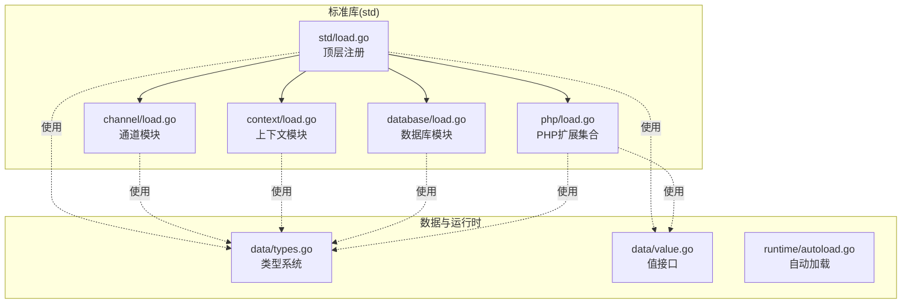
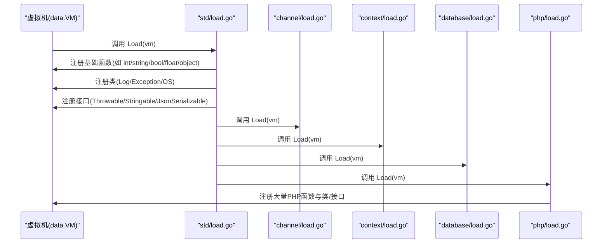
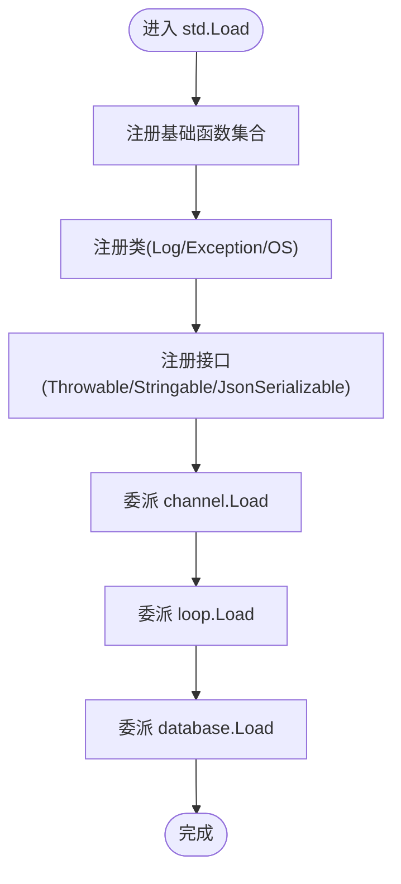
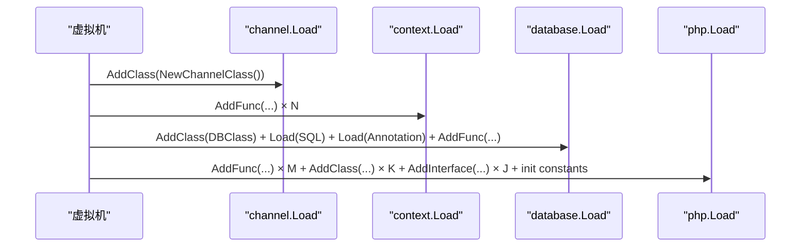
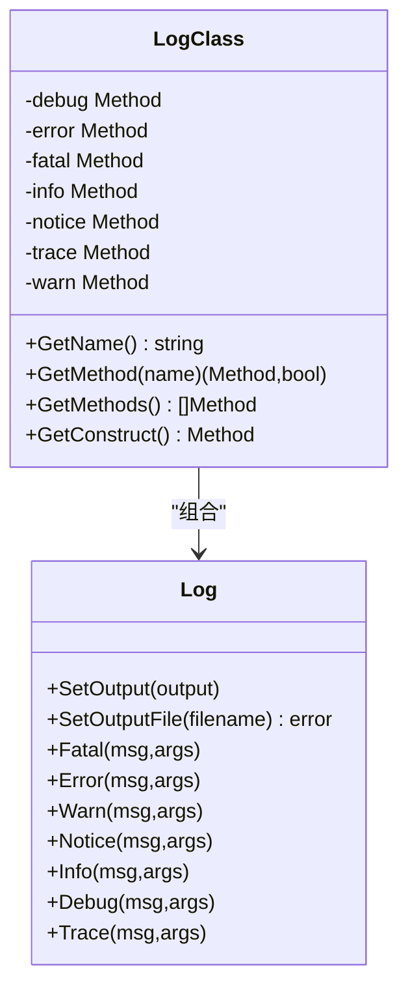
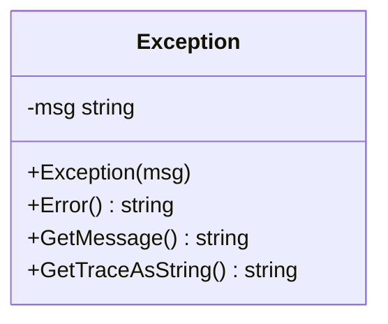
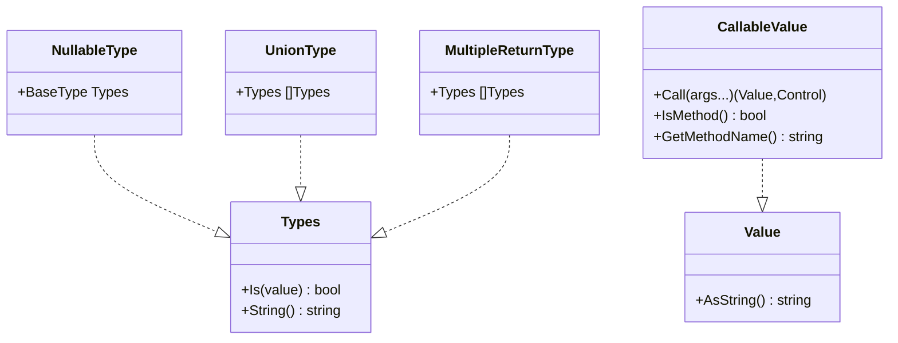
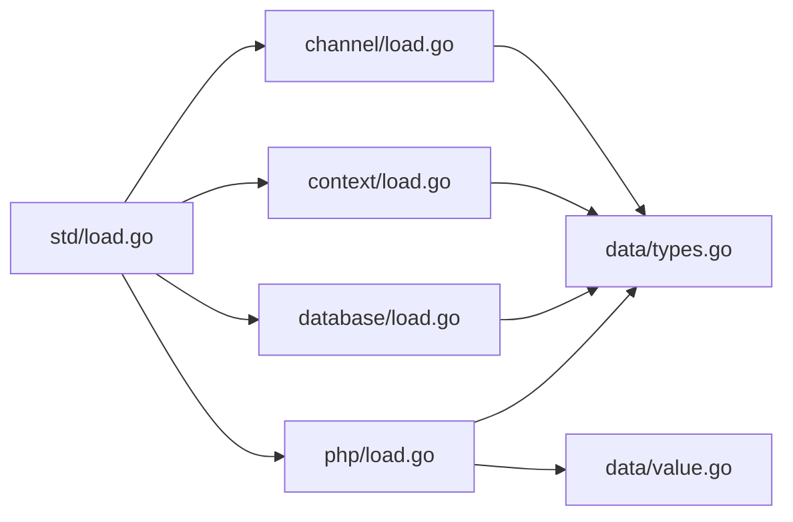

# 模块开发基础

<cite>
**本文引用的文件**
- [std/load.go](file://std/load.go)
- [channel/load.go](file://std/channel/load.go)
- [context/load.go](file://std/context/load.go)
- [database/load.go](file://std/database/load.go)
- [php/load.go](file://std/php/load.go)
- [std/README.md](file://std/README.md)
- [data/types.go](file://data/types.go)
- [data/value.go](file://data/value.go)
- [runtime/autoload.go](file://runtime/autoload.go)
- [log/log.go](file://std/log/log.go)
- [log/log_class.go](file://std/log/log_class.go)
- [exception/exception.go](file://std/exception/exception.go)
- [convert_int.go](file://std/convert_int.go)
- [convert_string.go](file://std/convert_string.go)
</cite>

## 目录
1. [引言](#引言)
2. [项目结构](#项目结构)
3. [核心组件](#核心组件)
4. [架构总览](#架构总览)
5. [详细组件分析](#详细组件分析)
6. [依赖关系分析](#依赖关系分析)
7. [性能考虑](#性能考虑)
8. [故障排查指南](#故障排查指南)
9. [结论](#结论)
10. [附录](#附录)

## 引言
本指南面向标准库模块开发者，系统讲解模块的目录结构、命名规范、导入机制与注册流程，重点解析 load.go 的模块注册模式（函数注册、类注册、接口注册），并给出通用模板、最佳实践、依赖管理与版本兼容策略，以及从设计到测试部署的完整工作流程。

## 项目结构
标准库模块遵循“按功能域分层”的组织方式：
- std/ 顶层模块入口与公共注册逻辑
- std/{子模块}/load.go 子模块注册入口
- std/{子模块}/*_class.go 类定义与方法包装
- std/{子模块}/*_methods.go 方法实现
- std/{子模块}/*.go 单函数模块
- data/ 类型系统与运行时值抽象
- runtime/ 运行时集成（如自动加载）

图表来源
- [std/load.go:14-38](file://std/load.go#L14-L38)
- [channel/load.go:8-12](file://std/channel/load.go#L8-L12)
- [context/load.go:7-23](file://std/context/load.go#L7-L23)
- [database/load.go:9-26](file://std/database/load.go#L9-L26)
- [php/load.go:19-212](file://std/php/load.go#L19-L212)
- [data/types.go:142-188](file://data/types.go#L142-L188)
- [data/value.go:4-38](file://data/value.go#L4-L38)
- [runtime/autoload.go:8-14](file://runtime/autoload.go#L8-L14)

章节来源
- [std/load.go:14-38](file://std/load.go#L14-L38)
- [channel/load.go:8-12](file://std/channel/load.go#L8-L12)
- [context/load.go:7-23](file://std/context/load.go#L7-L23)
- [database/load.go:9-26](file://std/database/load.go#L9-L26)
- [php/load.go:19-212](file://std/php/load.go#L19-L212)
- [data/types.go:142-188](file://data/types.go#L142-L188)
- [data/value.go:4-38](file://data/value.go#L4-L38)
- [runtime/autoload.go:8-14](file://runtime/autoload.go#L8-L14)

## 核心组件
- 类型系统与值抽象：data/types.go 定义了基础类型、联合类型、可空类型、泛型类型等；data/value.go 定义了统一的值接口与可调用值接口，支撑模块间的数据流转与方法调用。
- 模块注册中心：std/load.go 作为顶层注册入口，集中注册函数、类与接口，并委派子模块的 Load 函数完成各自职责。
- 子模块注册：各子模块（如 channel/context/database/php）均提供 Load(vm) 函数，负责注册自身函数、类与接口，并可进一步加载其内部子功能。

章节来源
- [data/types.go:142-188](file://data/types.go#L142-L188)
- [data/value.go:4-38](file://data/value.go#L4-L38)
- [std/load.go:14-38](file://std/load.go#L14-L38)
- [channel/load.go:8-12](file://std/channel/load.go#L8-L12)
- [context/load.go:7-23](file://std/context/load.go#L7-L23)
- [database/load.go:9-26](file://std/database/load.go#L9-L26)
- [php/load.go:19-212](file://std/php/load.go#L19-L212)

## 架构总览
标准库采用“分层注册 + 统一调度”架构：
- 顶层 Load 负责聚合注册，确保模块边界清晰、职责单一。
- 子模块 Load 负责自身功能域内的函数、类、接口注册，并可递归加载其内部子模块。
- data 层提供类型与值抽象，保证跨模块的类型安全与互操作。

图表来源
- [std/load.go:14-38](file://std/load.go#L14-L38)
- [channel/load.go:8-12](file://std/channel/load.go#L8-L12)
- [context/load.go:7-23](file://std/context/load.go#L7-L23)
- [database/load.go:9-26](file://std/database/load.go#L9-L26)
- [php/load.go:19-212](file://std/php/load.go#L19-L212)

## 详细组件分析

### 顶层注册流程（std/load.go）
- 函数注册：遍历基础转换函数列表，逐个调用 vm.AddFunc 注册。
- 类注册：注册日志类、异常类、接口类与 OS 类等。
- 接口注册：注册 Throwable、Stringable、JsonSerializable 等接口。
- 子模块委派：调用 reflect、channel、loop、database 的 Load 函数完成各自注册。

图表来源
- [std/load.go:14-38](file://std/load.go#L14-L38)

章节来源
- [std/load.go:14-38](file://std/load.go#L14-L38)

### 子模块注册模式（以 channel/context/database/php 为例）
- channel：仅注册一个类，返回控制流用于后续处理。
- context：注册一组顶级函数，便于直接在脚本域调用。
- database：注册 DB 类、SQL 子模块、注解子模块与连接管理函数。
- php：注册大量 PHP 函数、核心类、内置接口与异常类，并初始化默认常量。

图表来源
- [channel/load.go:8-12](file://std/channel/load.go#L8-L12)
- [context/load.go:7-23](file://std/context/load.go#L7-L23)
- [database/load.go:9-26](file://std/database/load.go#L9-L26)
- [php/load.go:19-212](file://std/php/load.go#L19-L212)

章节来源
- [channel/load.go:8-12](file://std/channel/load.go#L8-L12)
- [context/load.go:7-23](file://std/context/load.go#L7-L23)
- [database/load.go:9-26](file://std/database/load.go#L9-L26)
- [php/load.go:19-212](file://std/php/load.go#L19-L212)

### 类与方法包装（以 log 为例）
- 结构体：Log 提供日志写入能力，支持设置输出流与文件。
- 类包装：LogClass 持有多个方法对象（debug/error/fatal/info/notice/trace/warn），实现 data.ClassStmt 接口。
- 方法包装：每个方法以 XXXMethod 结尾，持有源结构体指针，实现 data.Method 接口。

图表来源
- [log/log.go:25-109](file://std/log/log.go#L25-L109)
- [log/log_class.go:21-113](file://std/log/log_class.go#L21-L113)

章节来源
- [log/log.go:25-109](file://std/log/log.go#L25-L109)
- [log/log_class.go:21-113](file://std/log/log_class.go#L21-L113)

### 接口与异常（以 exception 为例）
- Exception 结构体提供基本异常能力，包含消息与简单堆栈跟踪。
- 在 std/load.go 中注册 Throwable、Stringable、JsonSerializable 接口与 Exception 类，供其他模块复用。

图表来源
- [exception/exception.go:3-22](file://std/exception/exception.go#L3-L22)

章节来源
- [exception/exception.go:3-22](file://std/exception/exception.go#L3-L22)
- [std/load.go:27-31](file://std/load.go#L27-L31)

### 类型系统与值抽象（data 层）
- 类型系统：支持基础类型、联合类型、可空类型、多返回值类型、泛型类型等，用于静态/动态类型检查与自动补全。
- 值抽象：Value/CallableValue 等接口统一了值的表达与调用方式，支撑函数与方法的跨模块互操作。

图表来源
- [data/types.go:35-106](file://data/types.go#L35-L106)
- [data/value.go:4-38](file://data/value.go#L4-L38)

章节来源
- [data/types.go:35-106](file://data/types.go#L35-L106)
- [data/value.go:4-38](file://data/value.go#L4-L38)

### 自动加载与扩展点（runtime/autoload.go）
- 提供 AddAutoLoad/RemoveAutoLoad 接口，允许在运行时动态注册/移除自动加载回调，扩展模块的生命周期管理。

章节来源
- [runtime/autoload.go:8-14](file://runtime/autoload.go#L8-L14)

### 模块开发通用模板与最佳实践
- 函数模块模板
  - 实现 data.FuncStmt 接口，提供工厂函数 NewXxxFunction 返回具体实现。
  - 在 std/load.go 或子模块 load.go 中通过 vm.AddFunc 注册。
  - 参数与变量定义使用 node.NewParameter/node.NewVariable，配合 data.NewBaseType 指定类型。
- 类模块模板
  - 定义源结构体（如 Log），提供工厂函数 NewXxxClass 返回 data.ClassStmt 实现。
  - 为每个方法提供 XXXMethod 包装，持有源结构体指针，实现 data.Method 接口。
  - 在类包装中实现 GetName/GetMethod/GetMethods/GetConstruct 等方法。
- 接口模块模板
  - 定义接口实现，通过 vm.AddInterface 注册。
  - 在 std/load.go 中集中注册常用接口（如 Throwable/Stringable/JsonSerializable）。
- 错误处理
  - 使用 data.Control 返回控制流，区分正常、抛错、返回等场景。
  - 对外部输入进行类型检查与转换，必要时返回错误控制。
- 类型转换
  - 优先使用 data.AsXxx 接口进行转换，避免强制断言。
  - 对于复杂转换，参考 convert_int.go/convert_string.go 的顺序尝试策略。
- 性能优化
  - 尽量减少反射与字符串解析次数，缓存常用结果。
  - 合理使用 data.Value 的 AsString 等方法，避免重复格式化。
  - 控制数组/对象的深度拷贝，必要时使用浅拷贝或延迟计算。
- 命名规范
  - 函数：NewXxxFunction，方法：XxxMethod，类：XxxClass。
  - 目录：按功能域划分（如 std/log、std/database）。
- 导入机制
  - 顶层模块通过 std/load.go 导入子模块包并在 Load 中委派。
  - 子模块内部通过各自 load.go 导入内部文件并注册。

章节来源
- [std/README.md:8-92](file://std/README.md#L8-L92)
- [convert_int.go:14-50](file://std/convert_int.go#L14-L50)
- [convert_string.go:12-24](file://std/convert_string.go#L12-L24)

## 依赖关系分析
- 模块耦合
  - std/load.go 作为聚合入口，对各子模块存在导入依赖，但通过 Load 抽象隔离具体实现细节。
  - 子模块之间尽量保持低耦合，通过 data 层接口交互。
- 外部依赖
  - data 层提供类型系统与值抽象，是所有模块的共同依赖。
  - runtime 层提供自动加载扩展点，供模块在运行时扩展。
- 循环依赖
  - 通过分层与接口抽象避免循环依赖；若出现循环，应拆分接口或引入中间层。

图表来源
- [std/load.go:3-12](file://std/load.go#L3-L12)
- [channel/load.go:3-5](file://std/channel/load.go#L3-L5)
- [context/load.go:3-5](file://std/context/load.go#L3-L5)
- [database/load.go:3-7](file://std/database/load.go#L3-L7)
- [php/load.go:3-17](file://std/php/load.go#L3-L17)
- [data/types.go:142-188](file://data/types.go#L142-L188)
- [data/value.go:4-38](file://data/value.go#L4-L38)

章节来源
- [std/load.go:3-12](file://std/load.go#L3-L12)
- [channel/load.go:3-5](file://std/channel/load.go#L3-L5)
- [context/load.go:3-5](file://std/context/load.go#L3-L5)
- [database/load.go:3-7](file://std/database/load.go#L3-L7)
- [php/load.go:3-17](file://std/php/load.go#L3-L17)
- [data/types.go:142-188](file://data/types.go#L142-L188)
- [data/value.go:4-38](file://data/value.go#L4-L38)

## 性能考虑
- 类型检查与转换
  - 优先使用 data.AsXxx 接口，减少不必要的字符串解析与格式化。
  - 对于整数/浮点/布尔转换，按优先级顺序尝试，命中即返回，避免多余分支。
- 值对象复用
  - 对于不可变值（如字符串、整数、布尔），尽量复用已创建的 Value 对象。
- 数据结构
  - 数组/对象访问时避免深层嵌套，必要时使用索引预取与缓存。
- I/O 与外部资源
  - 文件/网络等 I/O 操作应异步化或批量化，减少阻塞。

## 故障排查指南
- 函数未注册
  - 检查是否在 std/load.go 或对应子模块 load.go 中调用 vm.AddFunc。
  - 确认工厂函数命名与导出符合约定。
- 类/方法无法调用
  - 检查类包装是否实现 data.ClassStmt 并在 GetName/GetMethod 中正确映射。
  - 确认方法包装持有正确的源结构体指针并实现 data.Method。
- 类型不匹配
  - 使用 data.NewBaseType 指定参数与变量类型，避免隐式转换导致的错误。
  - 对于联合类型/可空类型，确保调用端正确处理多种可能的值类型。
- 运行时异常
  - 通过 data.Control 返回错误控制，捕获后记录日志并向上抛出。
  - 使用 std/log 提供的日志方法定位问题。

章节来源
- [std/README.md:8-92](file://std/README.md#L8-L92)
- [log/log_class.go:58-96](file://std/log/log_class.go#L58-L96)
- [data/types.go:142-188](file://data/types.go#L142-L188)

## 结论
标准库模块开发遵循“分层注册 + 统一调度 + 类型抽象”的架构模式。通过明确的注册流程、严格的接口约束与清晰的模块边界，既能快速扩展新功能，又能保证类型安全与运行时性能。建议在开发中严格遵守模板与最佳实践，结合本文提供的依赖与性能指导，构建高质量的标准库模块。

## 附录

### 开发工作流程示例（从设计到测试部署）
- 设计阶段
  - 明确模块职责与对外 API（函数/类/接口）。
  - 设计数据结构与类型定义，优先使用 data.NewBaseType/UnionType/NullableType。
- 实现阶段
  - 编写源结构体与工厂函数，提供方法包装。
  - 在子模块 load.go 中注册函数/类/接口。
  - 在 std/load.go 中委派子模块 Load。
- 测试阶段
  - 编写单元测试与集成测试，覆盖主要分支与边界条件。
  - 使用日志模块定位问题，确保错误信息可读。
- 部署阶段
  - 更新文档与示例，发布版本并维护兼容性。
  - 如需自动加载，使用 runtime/autoload.go 提供的扩展点。