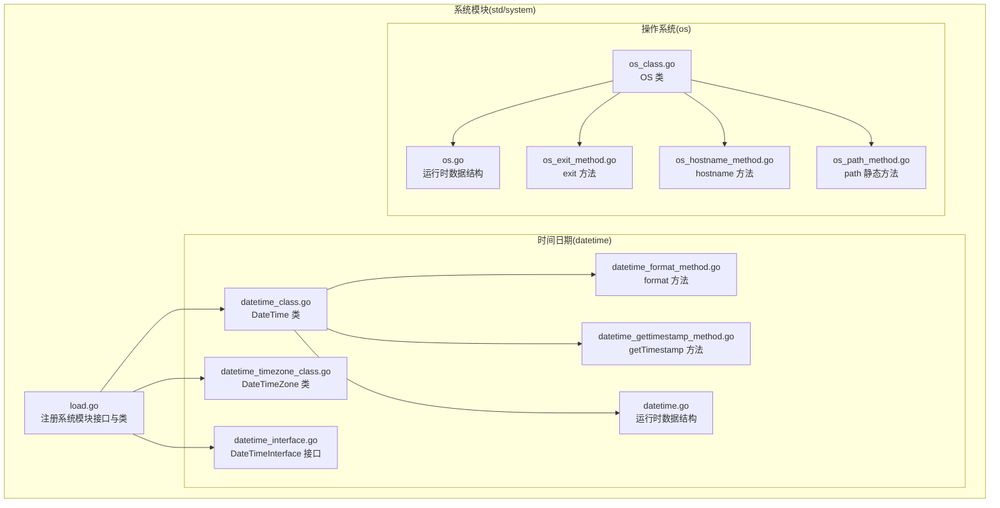
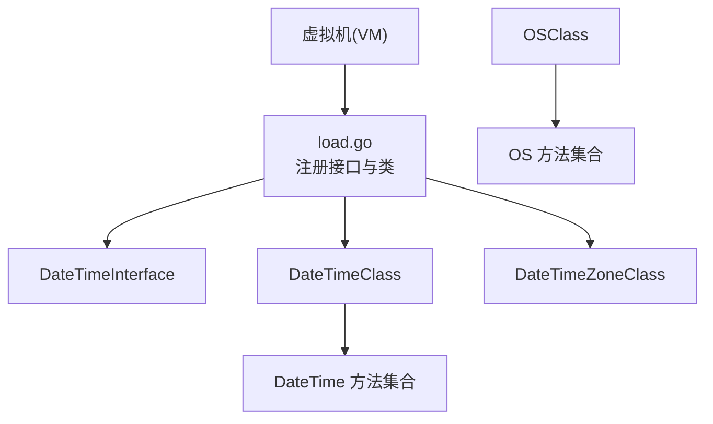
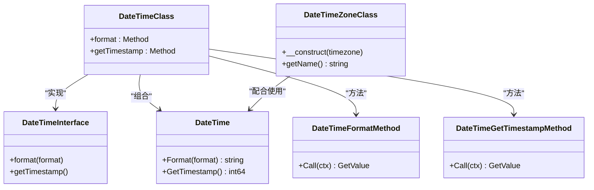
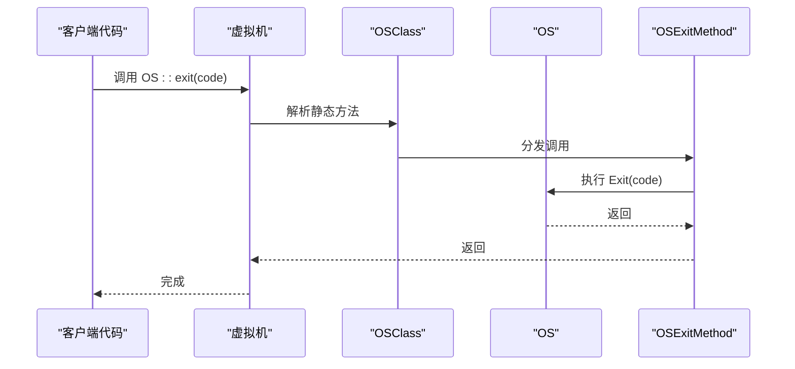
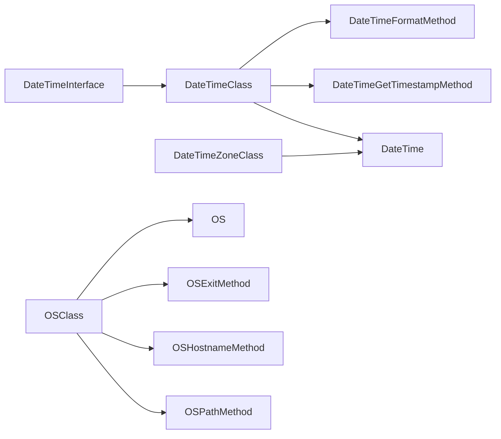

# 系统模块扩展

<cite>
**本文引用的文件**
- [std/system/load.go](file://std/system/load.go)
- [std/system/datetime.go](file://std/system/datetime.go)
- [std/system/datetime_class.go](file://std/system/datetime_class.go)
- [std/system/datetime_format_method.go](file://std/system/datetime_format_method.go)
- [std/system/datetime_gettimestamp_method.go](file://std/system/datetime_gettimestamp_method.go)
- [std/system/datetime_interface.go](file://std/system/datetime_interface.go)
- [std/system/datetime_timezone_class.go](file://std/system/datetime_timezone_class.go)
- [std/system/os/os.go](file://std/system/os/os.go)
- [std/system/os/os_class.go](file://std/system/os/os_class.go)
- [std/system/os/os_exit_method.go](file://std/system/os/os_exit_method.go)
- [std/system/os/os_hostname_method.go](file://std/system/os/os_hostname_method.go)
- [std/system/os/os_path_method.go](file://std/system/os/os_path_method.go)
- [docs/std/os.zy](file://docs/std/os.zy)
</cite>

## 目录
1. [简介](#简介)
2. [项目结构](#项目结构)
3. [核心组件](#核心组件)
4. [架构总览](#架构总览)
5. [详细组件分析](#详细组件分析)
6. [依赖分析](#依赖分析)
7. [性能考虑](#性能考虑)
8. [故障排查指南](#故障排查指南)
9. [结论](#结论)
10. [附录](#附录)

## 简介
本指南面向需要在系统模块中进行扩展开发的工程师，围绕以下主题提供从架构到实现细节的完整说明：
- 操作系统接口：OS 类的扩展开发，包括新增系统调用、环境变量管理与进程控制的实现思路。
- 时间日期处理：DateTime 与 DateTimeInterface 的扩展方法，涵盖自定义格式化、时区处理与国际化支持。
- 文件系统操作：基于现有 OS 能力的扩展方向，如文件监控、权限管理与磁盘空间检测的实现建议。
- 跨平台兼容性：针对不同操作系统的差异处理策略。
- 性能优化：在扩展开发中可采用的性能优化策略。

## 项目结构
系统模块位于 std/system 目录下，包含时间日期与 OS 两大子域。时间日期子域提供 DateTime 与 DateTimeZone 的最小运行时模型，并通过接口声明支持类型提示；OS 子域提供基础的系统信息与路径拼接能力，并以类与方法的形式暴露给虚拟机。

**图示来源**
- [std/system/load.go:1-12](file://std/system/load.go#L1-L12)
- [std/system/datetime.go:1-19](file://std/system/datetime.go#L1-L19)
- [std/system/datetime_class.go:1-64](file://std/system/datetime_class.go#L1-L64)
- [std/system/datetime_format_method.go:1-51](file://std/system/datetime_format_method.go#L1-L51)
- [std/system/datetime_gettimestamp_method.go:1-38](file://std/system/datetime_gettimestamp_method.go#L1-L38)
- [std/system/datetime_interface.go:1-34](file://std/system/datetime_interface.go#L1-L34)
- [std/system/datetime_timezone_class.go:1-171](file://std/system/datetime_timezone_class.go#L1-L171)
- [std/system/os/os.go:1-43](file://std/system/os/os.go#L1-L43)
- [std/system/os/os_class.go:1-98](file://std/system/os/os_class.go#L1-L98)
- [std/system/os/os_exit_method.go:1-54](file://std/system/os/os_exit_method.go#L1-L54)
- [std/system/os/os_hostname_method.go:1-44](file://std/system/os/os_hostname_method.go#L1-L44)
- [std/system/os/os_path_method.go:1-52](file://std/system/os/os_path_method.go#L1-L52)

**章节来源**
- [std/system/load.go:1-12](file://std/system/load.go#L1-L12)
- [std/system/datetime.go:1-19](file://std/system/datetime.go#L1-L19)
- [std/system/datetime_class.go:1-64](file://std/system/datetime_class.go#L1-L64)
- [std/system/datetime_interface.go:1-34](file://std/system/datetime_interface.go#L1-L34)
- [std/system/datetime_timezone_class.go:1-171](file://std/system/datetime_timezone_class.go#L1-L171)
- [std/system/os/os.go:1-43](file://std/system/os/os.go#L1-L43)
- [std/system/os/os_class.go:1-98](file://std/system/os/os_class.go#L1-L98)

## 核心组件
- 时间日期接口与类
  - DateTimeInterface：声明 format 与 getTimestamp 两个方法，用于类型提示与 instanceof 判断。
  - DateTime：提供格式化与时间戳获取的底层实现。
  - DateTimeClass：封装 DateTime 的方法集合，作为虚拟机中的类对象。
  - DateTimeFormatMethod / DateTimeGetTimestampMethod：分别对应 format 与 getTimestamp 的调用实现。
  - DateTimeZoneClass：提供最小化的 DateTimeZone 运行时模型，支持构造与 getName。
- 操作系统类与方法
  - OS：封装系统常量与基础方法，如 EOL、Exit、Hostname、Path。
  - OSClass：OS 的类模型，暴露静态属性与方法。
  - OSExitMethod / OSHostnameMethod / OSPathMethod：分别实现 exit、hostname、path 的调用逻辑。

**章节来源**
- [std/system/datetime_interface.go:1-34](file://std/system/datetime_interface.go#L1-L34)
- [std/system/datetime.go:1-19](file://std/system/datetime.go#L1-L19)
- [std/system/datetime_class.go:1-64](file://std/system/datetime_class.go#L1-L64)
- [std/system/datetime_format_method.go:1-51](file://std/system/datetime_format_method.go#L1-L51)
- [std/system/datetime_gettimestamp_method.go:1-38](file://std/system/datetime_gettimestamp_method.go#L1-L38)
- [std/system/datetime_timezone_class.go:1-171](file://std/system/datetime_timezone_class.go#L1-L171)
- [std/system/os/os.go:1-43](file://std/system/os/os.go#L1-L43)
- [std/system/os/os_class.go:1-98](file://std/system/os/os_class.go#L1-L98)
- [std/system/os/os_exit_method.go:1-54](file://std/system/os/os_exit_method.go#L1-L54)
- [std/system/os/os_hostname_method.go:1-44](file://std/system/os/os_hostname_method.go#L1-L44)
- [std/system/os/os_path_method.go:1-52](file://std/system/os/os_path_method.go#L1-L52)

## 架构总览
系统模块通过 load.go 在虚拟机启动时注册接口与类，使上层语言代码可以像调用原生类一样使用这些功能。时间日期与 OS 的扩展均遵循“数据结构 + 类模型 + 方法实现”的分层设计，确保可测试性与可维护性。

**图示来源**
- [std/system/load.go:1-12](file://std/system/load.go#L1-L12)
- [std/system/datetime_class.go:1-64](file://std/system/datetime_class.go#L1-L64)
- [std/system/datetime_interface.go:1-34](file://std/system/datetime_interface.go#L1-L34)
- [std/system/datetime_timezone_class.go:1-171](file://std/system/datetime_timezone_class.go#L1-L171)
- [std/system/os/os_class.go:1-98](file://std/system/os/os_class.go#L1-L98)

## 详细组件分析

### 时间日期类扩展
- 扩展目标
  - 新增自定义格式化规则：在 DateTimeFormatMethod 中增加对新格式令牌的支持，或在底层 DateTime.Format 中扩展解析器。
  - 国际化支持：结合 DateTimeZone 的时区能力，为不同区域提供本地化格式化输出。
  - 与接口一致性：任何新增方法需在 DateTimeInterface 中声明，以保证类型检查与 instanceof 生效。
- 设计要点
  - 保持方法签名与返回类型与接口一致，避免破坏既有行为。
  - 对于格式化字符串，建议先做合法性校验再调用底层实现，减少异常传播成本。
  - 时区处理应优先使用 DateTimeZone 的实例，确保与外部库（如 Carbon）的兼容性。

**图示来源**
- [std/system/datetime_interface.go:1-34](file://std/system/datetime_interface.go#L1-L34)
- [std/system/datetime.go:1-19](file://std/system/datetime.go#L1-L19)
- [std/system/datetime_class.go:1-64](file://std/system/datetime_class.go#L1-L64)
- [std/system/datetime_format_method.go:1-51](file://std/system/datetime_format_method.go#L1-L51)
- [std/system/datetime_gettimestamp_method.go:1-38](file://std/system/datetime_gettimestamp_method.go#L1-L38)
- [std/system/datetime_timezone_class.go:1-171](file://std/system/datetime_timezone_class.go#L1-L171)

**章节来源**
- [std/system/datetime_interface.go:1-34](file://std/system/datetime_interface.go#L1-L34)
- [std/system/datetime.go:1-19](file://std/system/datetime.go#L1-L19)
- [std/system/datetime_class.go:1-64](file://std/system/datetime_class.go#L1-L64)
- [std/system/datetime_format_method.go:1-51](file://std/system/datetime_format_method.go#L1-L51)
- [std/system/datetime_gettimestamp_method.go:1-38](file://std/system/datetime_gettimestamp_method.go#L1-L38)
- [std/system/datetime_timezone_class.go:1-171](file://std/system/datetime_timezone_class.go#L1-L171)

### 操作系统类扩展
- 扩展目标
  - 新增系统调用：在 OS 结构体中添加新函数，在 OSClass 中注册为方法或静态方法。
  - 环境变量管理：通过 Go 的 os 包读取/设置环境变量，封装为方法供上层调用。
  - 进程控制：封装进程启动、状态查询与终止等能力，注意跨平台差异。
- 设计要点
  - 严格区分静态方法与实例方法，避免混淆上下文。
  - 对系统调用进行错误包装，统一返回类型与异常模型。
  - 路径处理使用标准库的 filepath，确保跨平台兼容。

**图示来源**
- [std/system/os/os_class.go:1-98](file://std/system/os/os_class.go#L1-L98)
- [std/system/os/os_exit_method.go:1-54](file://std/system/os/os_exit_method.go#L1-L54)
- [std/system/os/os.go:1-43](file://std/system/os/os.go#L1-L43)

**章节来源**
- [std/system/os/os.go:1-43](file://std/system/os/os.go#L1-L43)
- [std/system/os/os_class.go:1-98](file://std/system/os/os_class.go#L1-L98)
- [std/system/os/os_exit_method.go:1-54](file://std/system/os/os_exit_method.go#L1-L54)
- [std/system/os/os_hostname_method.go:1-44](file://std/system/os/os_hostname_method.go#L1-L44)
- [std/system/os/os_path_method.go:1-52](file://std/system/os/os_path_method.go#L1-L52)
- [docs/std/os.zy:1-43](file://docs/std/os.zy#L1-L43)

### 文件系统操作扩展
- 扩展方向
  - 文件监控：基于系统事件或轮询机制，封装文件变更通知。
  - 权限管理：封装文件/目录权限查询与修改，注意不同平台的权限模型差异。
  - 磁盘空间检测：封装容量、可用空间查询，提供统一接口。
- 实施建议
  - 基于现有 OS 能力进行组合，避免重复造轮子。
  - 对跨平台差异进行抽象，提供统一的异常与返回类型。
  - 为高频操作提供缓存与批量接口，降低系统调用开销。

[本节为概念性内容，不直接分析具体文件，故无“章节来源”]

## 依赖分析
- 组件内聚与耦合
  - 时间日期模块内部高度内聚：接口、类与方法实现紧密协作，便于扩展与测试。
  - OS 模块同样保持清晰边界：数据结构、类与方法分离，利于按需扩展。
- 外部依赖
  - 时间日期依赖 Go 的 time 包；OS 依赖 os、filepath、runtime。
- 循环依赖
  - 当前模块未见循环依赖迹象，扩展时应避免引入新的循环。

**图示来源**
- [std/system/datetime_interface.go:1-34](file://std/system/datetime_interface.go#L1-L34)
- [std/system/datetime_class.go:1-64](file://std/system/datetime_class.go#L1-L64)
- [std/system/datetime_format_method.go:1-51](file://std/system/datetime_format_method.go#L1-L51)
- [std/system/datetime_gettimestamp_method.go:1-38](file://std/system/datetime_gettimestamp_method.go#L1-L38)
- [std/system/datetime.go:1-19](file://std/system/datetime.go#L1-L19)
- [std/system/datetime_timezone_class.go:1-171](file://std/system/datetime_timezone_class.go#L1-L171)
- [std/system/os/os_class.go:1-98](file://std/system/os/os_class.go#L1-L98)
- [std/system/os/os.go:1-43](file://std/system/os/os.go#L1-L43)
- [std/system/os/os_exit_method.go:1-54](file://std/system/os/os_exit_method.go#L1-L54)
- [std/system/os/os_hostname_method.go:1-44](file://std/system/os/os_hostname_method.go#L1-L44)
- [std/system/os/os_path_method.go:1-52](file://std/system/os/os_path_method.go#L1-L52)

**章节来源**
- [std/system/datetime_interface.go:1-34](file://std/system/datetime_interface.go#L1-L34)
- [std/system/datetime_class.go:1-64](file://std/system/datetime_class.go#L1-L64)
- [std/system/datetime_format_method.go:1-51](file://std/system/datetime_format_method.go#L1-L51)
- [std/system/datetime_gettimestamp_method.go:1-38](file://std/system/datetime_gettimestamp_method.go#L1-L38)
- [std/system/datetime.go:1-19](file://std/system/datetime.go#L1-L19)
- [std/system/datetime_timezone_class.go:1-171](file://std/system/datetime_timezone_class.go#L1-L171)
- [std/system/os/os_class.go:1-98](file://std/system/os/os_class.go#L1-L98)
- [std/system/os/os.go:1-43](file://std/system/os/os.go#L1-L43)
- [std/system/os/os_exit_method.go:1-54](file://std/system/os/os_exit_method.go#L1-L54)
- [std/system/os/os_hostname_method.go:1-44](file://std/system/os/os_hostname_method.go#L1-L44)
- [std/system/os/os_path_method.go:1-52](file://std/system/os/os_path_method.go#L1-L52)

## 性能考虑
- 减少系统调用次数：对频繁访问的系统信息（如主机名、平台标识）进行缓存。
- 异常处理成本：在方法入口进行参数校验，尽早失败，避免无效系统调用。
- 字符串与数组处理：在路径拼接与格式化中尽量复用中间结果，避免不必要的拷贝。
- 并发安全：若扩展涉及共享资源（如全局配置），确保线程安全与原子更新。

[本节为通用指导，不直接分析具体文件，故无“章节来源”]

## 故障排查指南
- 参数缺失与类型错误
  - 在方法实现中对参数索引与类型进行显式检查，必要时抛出明确的错误信息。
- 时区与国际化问题
  - 使用 DateTimeZone 校验时区 ID 合法性，避免因非法时区导致的异常。
- 跨平台差异
  - 对换行符、路径分隔符等进行平台检测与适配，确保输出一致。
- 错误传播
  - 将底层错误包装为统一的异常类型，便于上层捕获与处理。

**章节来源**
- [std/system/datetime_format_method.go:15-22](file://std/system/datetime_format_method.go#L15-L22)
- [std/system/os/os_exit_method.go:15-24](file://std/system/os/os_exit_method.go#L15-L24)
- [std/system/os/os_hostname_method.go:12-18](file://std/system/os/os_hostname_method.go#L12-L18)
- [std/system/os/os_path_method.go:15-22](file://std/system/os/os_path_method.go#L15-L22)
- [std/system/datetime_timezone_class.go:85-106](file://std/system/datetime_timezone_class.go#L85-L106)

## 结论
通过对系统模块的分层设计与清晰职责划分，扩展开发可以在不破坏现有行为的前提下，安全地增加新功能。建议在扩展时遵循接口契约、统一错误模型与跨平台适配原则，以获得更好的可维护性与稳定性。

[本节为总结性内容，不直接分析具体文件，故无“章节来源”]

## 附录
- 开发流程建议
  - 先在接口层声明新方法，再实现类与方法，最后在 load.go 中注册。
  - 编写单元测试覆盖正常与异常分支，特别关注跨平台差异。
  - 文档化新方法的行为、参数与返回类型，便于使用者理解。

[本节为通用指导，不直接分析具体文件，故无“章节来源”]