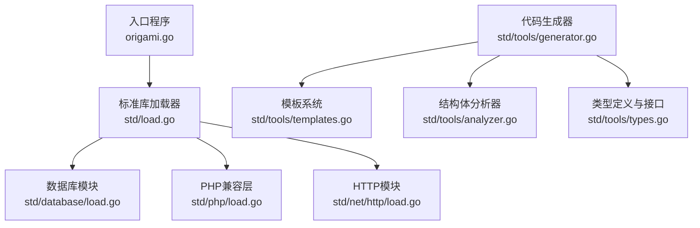
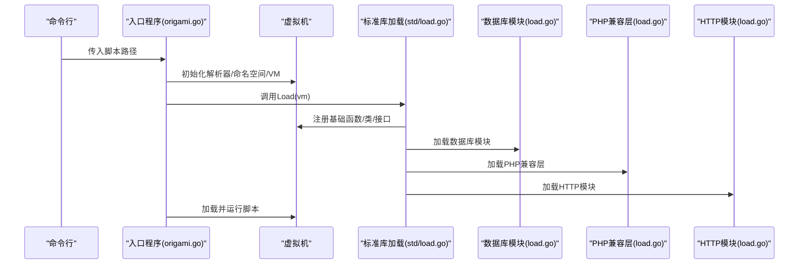
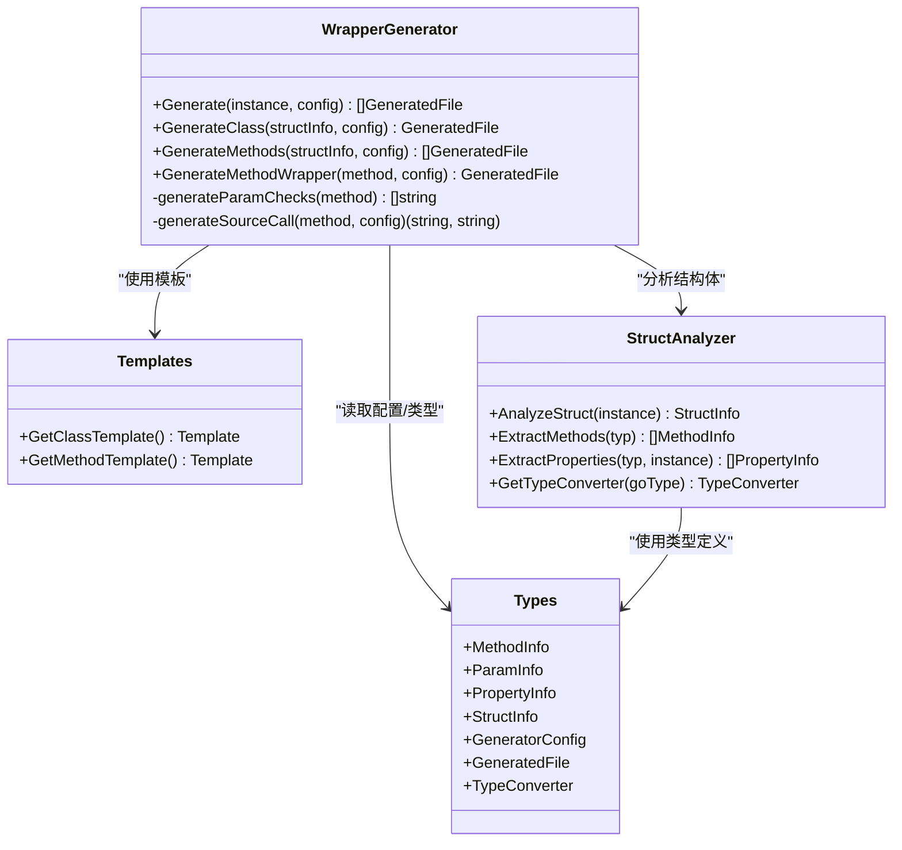
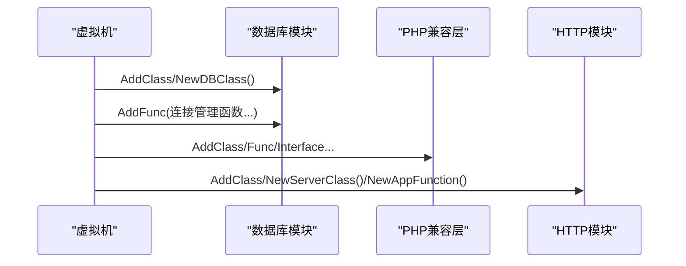
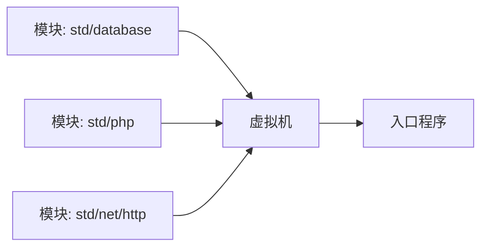

# 自定义模块开发

<cite>
**本文引用的文件**
- [README.md](file://README.md)
- [go.mod](file://go.mod)
- [origami.go](file://origami.go)
- [std/load.go](file://std/load.go)
- [std/tools/generator.go](file://std/tools/generator.go)
- [std/tools/templates.go](file://std/tools/templates.go)
- [std/tools/analyzer.go](file://std/tools/analyzer.go)
- [std/tools/types.go](file://std/tools/types.go)
- [std/database/load.go](file://std/database/load.go)
- [std/php/load.go](file://std/php/load.go)
- [std/net/http/load.go](file://std/net/http/load.go)
- [tests/README.md](file://tests/README.md)
</cite>

## 目录
1. [简介](#简介)
2. [项目结构](#项目结构)
3. [核心组件](#核心组件)
4. [架构总览](#架构总览)
5. [详细组件分析](#详细组件分析)
6. [依赖分析](#依赖分析)
7. [性能考虑](#性能考虑)
8. [故障排查指南](#故障排查指南)
9. [结论](#结论)
10. [附录](#附录)

## 简介
本指南面向希望在折言(origami-lang)生态中开发“自定义标准库模块”的工程师，目标是提供从需求分析、模块骨架生成、代码模板应用、依赖自动配置、到打包分发、测试与文档生成、以及长期维护升级的完整流程。通过并行分析仓库中的模块加载机制、代码生成器与模板系统，以及现有标准库模块的组织方式，我们将给出可落地的实施步骤与最佳实践。

## 项目结构
折言项目采用“模块化标准库 + 运行时 + 解释器”的分层设计：
- 运行时与入口：运行时虚拟机初始化、标准库加载、外部模块加载等集中在入口与标准库加载器中。
- 标准库模块：以子包形式组织，每个模块负责一组类、函数与常量的注册；模块内部通常包含独立的 load.go 用于集中注册。
- 工具链：提供代码生成器与模板系统，用于从Go结构体自动生成类定义与方法包装器，降低重复劳动。
- 示例与测试：examples 与 tests 目录提供了使用范式与测试思路，便于对照实现。

**图示来源**
- [origami.go:34-67](file://origami.go#L34-L67)
- [std/load.go:14-38](file://std/load.go#L14-L38)
- [std/database/load.go:9-27](file://std/database/load.go#L9-L27)
- [std/php/load.go:19-212](file://std/php/load.go#L19-L212)
- [std/net/http/load.go:7-16](file://std/net/http/load.go#L7-L16)
- [std/tools/generator.go:10-84](file://std/tools/generator.go#L10-L84)
- [std/tools/templates.go:8-194](file://std/tools/templates.go#L8-L194)
- [std/tools/analyzer.go:24-40](file://std/tools/analyzer.go#L24-L40)
- [std/tools/types.go:38-100](file://std/tools/types.go#L38-L100)

**章节来源**
- [README.md:1-69](file://README.md#L1-L69)
- [go.mod:1-19](file://go.mod#L1-L19)
- [origami.go:34-67](file://origami.go#L34-L67)
- [std/load.go:14-38](file://std/load.go#L14-L38)

## 核心组件
- 运行时与入口
  - 入口程序负责创建解析器、构建全局命名空间、初始化虚拟机，并加载标准库与外部模块，最后执行脚本。
  - 关键路径：[入口主流程:34-67](file://origami.go#L34-L67)、[标准库加载:14-38](file://std/load.go#L14-L38)。
- 模块加载器
  - 每个标准库子模块通过自身的 load.go 将类、函数、常量统一注册到 VM 中，形成模块化的扩展点。
  - 参考：[数据库模块加载:9-27](file://std/database/load.go#L9-L27)、[PHP兼容层加载:19-212](file://std/php/load.go#L19-L212)、[HTTP模块加载:7-16](file://std/net/http/load.go#L7-L16)。
- 代码生成器与模板系统
  - 通过反射分析Go结构体，自动生成类定义与方法包装器，并以模板渲染输出文件，支持类型转换与参数校验。
  - 参考：[生成器:10-84](file://std/tools/generator.go#L10-L84)、[模板:8-194](file://std/tools/templates.go#L8-L194)、[分析器:24-40](file://std/tools/analyzer.go#L24-L40)、[类型定义:38-100](file://std/tools/types.go#L38-L100)。

**章节来源**
- [origami.go:34-67](file://origami.go#L34-L67)
- [std/load.go:14-38](file://std/load.go#L14-L38)
- [std/tools/generator.go:10-84](file://std/tools/generator.go#L10-L84)
- [std/tools/templates.go:8-194](file://std/tools/templates.go#L8-L194)
- [std/tools/analyzer.go:24-40](file://std/tools/analyzer.go#L24-L40)
- [std/tools/types.go:38-100](file://std/tools/types.go#L38-L100)

## 架构总览
下图展示了从入口到标准库模块加载的整体流程，以及模块内部如何注册类与函数：

**图示来源**
- [origami.go:34-67](file://origami.go#L34-L67)
- [std/load.go:14-38](file://std/load.go#L14-L38)
- [std/database/load.go:9-27](file://std/database/load.go#L9-L27)
- [std/php/load.go:19-212](file://std/php/load.go#L19-L212)
- [std/net/http/load.go:7-16](file://std/net/http/load.go#L7-L16)

## 详细组件分析

### 代码生成器与模板系统
该工具链由四部分组成：生成器、模板、分析器、类型定义。其职责如下：
- 生成器：分析结构体、合并配置、生成类定义与方法包装器文件。
- 模板：提供类定义与方法包装器的文本模板，配合模板函数进行命名转换。
- 分析器：基于反射提取结构体的方法、属性、参数与返回类型，并内置类型转换映射。
- 类型定义：描述结构体信息、生成文件元数据、接口契约等。

**图示来源**
- [std/tools/generator.go:10-84](file://std/tools/generator.go#L10-L84)
- [std/tools/templates.go:8-194](file://std/tools/templates.go#L8-L194)
- [std/tools/analyzer.go:24-40](file://std/tools/analyzer.go#L24-L40)
- [std/tools/types.go:38-100](file://std/tools/types.go#L38-L100)

**章节来源**
- [std/tools/generator.go:10-84](file://std/tools/generator.go#L10-L84)
- [std/tools/templates.go:8-194](file://std/tools/templates.go#L8-L194)
- [std/tools/analyzer.go:24-40](file://std/tools/analyzer.go#L24-L40)
- [std/tools/types.go:38-100](file://std/tools/types.go#L38-L100)

### 模块加载与注册流程
标准库模块通过各自的 load.go 将类、函数、常量注册到 VM。典型流程：
- 在 load.go 中调用 vm.AddClass/AddFunc/AddInterface 等方法完成注册。
- 在顶层 std/load.go 中统一调度各模块的 Load 函数。

**图示来源**
- [std/database/load.go:9-27](file://std/database/load.go#L9-L27)
- [std/php/load.go:19-212](file://std/php/load.go#L19-L212)
- [std/net/http/load.go:7-16](file://std/net/http/load.go#L7-L16)
- [std/load.go:14-38](file://std/load.go#L14-L38)

**章节来源**
- [std/database/load.go:9-27](file://std/database/load.go#L9-L27)
- [std/php/load.go:19-212](file://std/php/load.go#L19-L212)
- [std/net/http/load.go:7-16](file://std/net/http/load.go#L7-L16)
- [std/load.go:14-38](file://std/load.go#L14-L38)

### 模块开发流程（从需求到部署）
- 需求分析与设计
  - 明确模块边界与职责，确定需要暴露的类、函数、常量与接口。
  - 参考现有模块的组织方式：每个模块一个独立子包，包含 load.go 与具体实现文件。
- 模块骨架创建
  - 新建子包并在其中创建 load.go，预留 AddClass/AddFunc/AddInterface 的注册入口。
  - 参考：[数据库模块骨架:9-27](file://std/database/load.go#L9-L27)、[PHP模块骨架:19-212](file://std/php/load.go#L19-L212)、[HTTP模块骨架:7-16](file://std/net/http/load.go#L7-L16)。
- 代码模板生成与依赖自动配置
  - 若模块涉及大量方法包装，可使用代码生成器从Go结构体生成类与方法包装器，减少手工重复工作。
  - 参考：[生成器:10-84](file://std/tools/generator.go#L10-L84)、[模板:8-194](file://std/tools/templates.go#L8-L194)、[分析器:24-40](file://std/tools/analyzer.go#L24-L40)、[类型定义:38-100](file://std/tools/types.go#L38-L100)。
- 实现与注册
  - 在模块内实现类与函数，按需注册到 VM；在顶层 std/load.go 中统一加载。
  - 参考：[顶层加载:14-38](file://std/load.go#L14-38)。
- 测试与验证
  - 使用 tests 目录下的测试用例风格编写单元与集成测试，确保行为符合预期。
  - 参考：[测试说明:1-4](file://tests/README.md#L1-L4)。
- 文档与示例
  - 在 docs 目录补充模块文档与API参考，结合 examples 目录提供可运行示例。
  - 参考：[项目文档入口:43-56](file://README.md#L43-L56)。
- 打包与分发
  - 使用 go.mod 管理依赖与版本，遵循模块化结构，确保可被其他项目 import。
  - 参考：[模块与依赖:1-19](file://go.mod#L1-L19)。

**章节来源**
- [std/database/load.go:9-27](file://std/database/load.go#L9-L27)
- [std/php/load.go:19-212](file://std/php/load.go#L19-L212)
- [std/net/http/load.go:7-16](file://std/net/http/load.go#L7-L16)
- [std/load.go:14-38](file://std/load.go#L14-L38)
- [std/tools/generator.go:10-84](file://std/tools/generator.go#L10-L84)
- [std/tools/templates.go:8-194](file://std/tools/templates.go#L8-L194)
- [std/tools/analyzer.go:24-40](file://std/tools/analyzer.go#L24-L40)
- [std/tools/types.go:38-100](file://std/tools/types.go#L38-L100)
- [tests/README.md:1-4](file://tests/README.md#L1-L4)
- [README.md:43-56](file://README.md#L43-L56)
- [go.mod:1-19](file://go.mod#L1-L19)

### 模块测试框架使用方法
- 单元测试
  - 参照 tests 目录中的用例风格，针对模块函数或类方法编写断言。
- 集成测试
  - 在 examples 或 tests 中组合多个模块，验证跨模块交互。
- 性能测试
  - 可参考项目中的性能测试文件命名与组织方式，对关键路径进行基准测试。

**章节来源**
- [tests/README.md:1-4](file://tests/README.md#L1-L4)

### 模块文档生成与API参考
- 文档结构
  - 在 docs 目录下为新模块建立独立章节，包含概述、API参考、示例与注意事项。
- 示例代码
  - 在 examples 目录中提供最小可运行示例，便于用户快速上手。
- 自动化处理
  - 可复用现有模块的文档组织方式，确保一致性与可维护性。

**章节来源**
- [README.md:43-56](file://README.md#L43-L56)

### 模块维护与升级策略
- 版本管理
  - 使用 go.mod 管理模块版本与依赖，遵循语义化版本规范。
- 兼容性保证
  - 对外暴露的类与函数尽量保持向后兼容；新增功能优先以可选方式提供。
- 依赖声明
  - 明确列出外部依赖，避免隐式依赖导致构建不一致。
- 回归测试
  - 保持 tests 目录的覆盖面，确保升级不会破坏既有行为。

**章节来源**
- [go.mod:1-19](file://go.mod#L1-L19)

## 依赖分析
- 模块间耦合
  - 标准库模块通过 VM 与入口程序耦合，彼此相对独立；模块内部通过自身 load.go 聚合注册。
- 外部依赖
  - 项目使用 go.mod 管理依赖，包含数据库驱动等间接依赖。
- 循环依赖
  - 代码未见直接循环导入；模块通过 VM 作为中介进行注册，避免循环依赖风险。

**图示来源**
- [std/database/load.go:9-27](file://std/database/load.go#L9-L27)
- [std/php/load.go:19-212](file://std/php/load.go#L19-L212)
- [std/net/http/load.go:7-16](file://std/net/http/load.go#L7-L16)
- [std/load.go:14-38](file://std/load.go#L14-L38)
- [origami.go:34-67](file://origami.go#L34-L67)

**章节来源**
- [std/database/load.go:9-27](file://std/database/load.go#L9-L27)
- [std/php/load.go:19-212](file://std/php/load.go#L19-L212)
- [std/net/http/load.go:7-16](file://std/net/http/load.go#L7-L16)
- [std/load.go:14-38](file://std/load.go#L14-L38)
- [origami.go:34-67](file://origami.go#L34-L67)
- [go.mod:1-19](file://go.mod#L1-L19)

## 性能考虑
- 生成器与模板渲染
  - 生成器在本地磁盘批量写入文件，建议在 CI 中缓存依赖与中间产物，减少重复生成时间。
- 模块加载
  - 模块注册集中在 load.go，建议将耗时操作延迟到首次使用，避免启动时的额外开销。
- 运行时
  - 通过 VM 统一调度，避免在模块内部做重复的初始化工作。

[本节为通用指导，无需特定文件来源]

## 故障排查指南
- 文件不存在或路径错误
  - 入口程序会对脚本路径进行存在性检查并提示帮助信息，确认路径正确后再执行。
  - 参考：[路径检查与帮助输出:47-66](file://origami.go#L47-L66)。
- 模块未注册
  - 确认模块的 load.go 已在顶层 std/load.go 中被调用加载。
  - 参考：[顶层加载:14-38](file://std/load.go#L14-38)。
- 生成文件冲突
  - 生成器会检测文件是否已存在并跳过覆盖，避免意外覆盖手动修改。
  - 参考：[文件存在性检查:18-31](file://std/tools/generator.go#L18-L31)。

**章节来源**
- [origami.go:47-66](file://origami.go#L47-L66)
- [std/load.go:14-38](file://std/load.go#L14-L38)
- [std/tools/generator.go:18-31](file://std/tools/generator.go#L18-L31)

## 结论
通过本指南，您可以基于折言的模块化标准库架构，高效地完成自定义模块的设计、实现、测试、文档与发布全流程。利用代码生成器与模板系统可以显著降低重复劳动；通过顶层加载器与模块化子包，可确保模块的可维护性与可扩展性。建议在开发过程中持续关注兼容性与性能，并以 tests 与 examples 作为质量保障与用户引导的核心资产。

[本节为总结性内容，无需特定文件来源]

## 附录
- 快速开始
  - 参考项目根目录的 README 与文档中心链接，获取更详细的入门与参考文档。
- 示例与测试
  - 参考 examples 与 tests 目录，学习模块使用范式与测试方法。

**章节来源**
- [README.md:43-56](file://README.md#L43-L56)