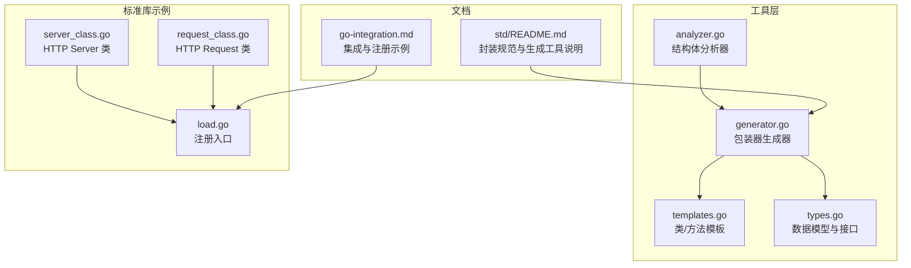
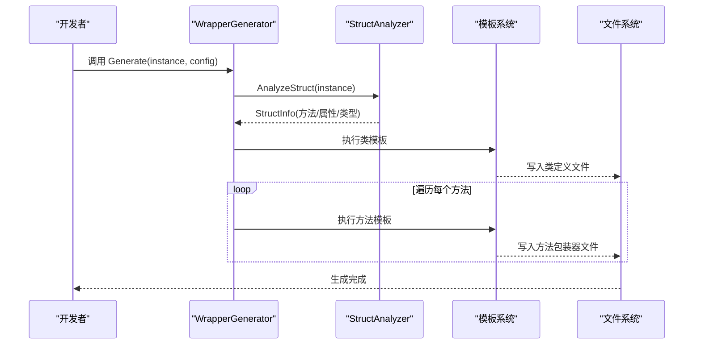
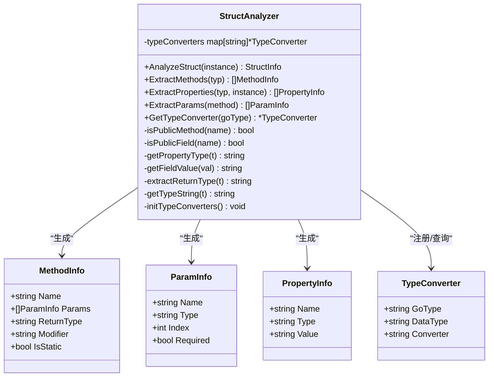
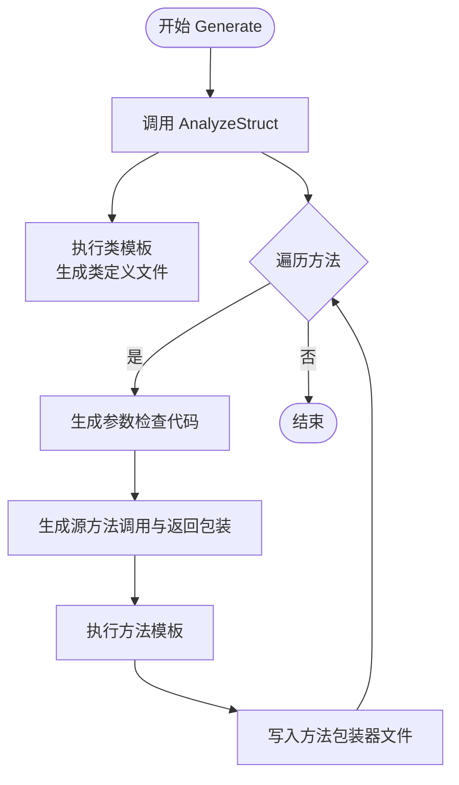
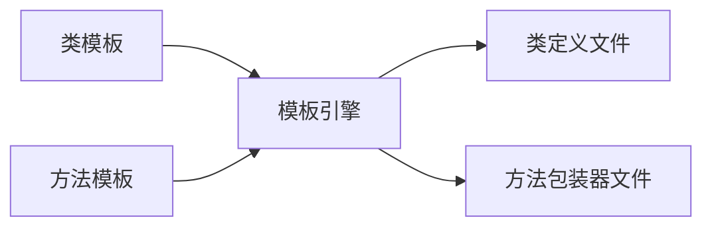
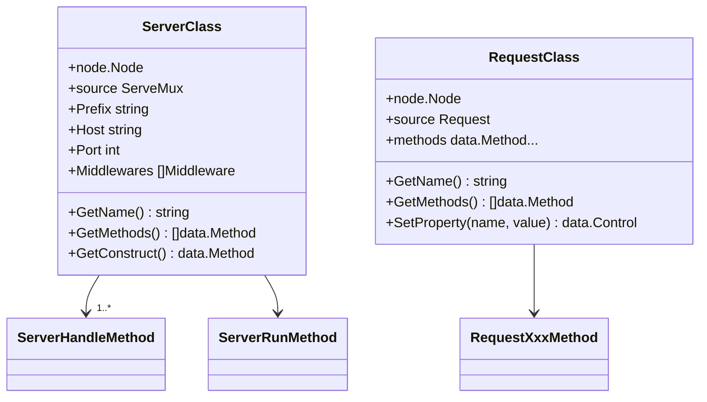
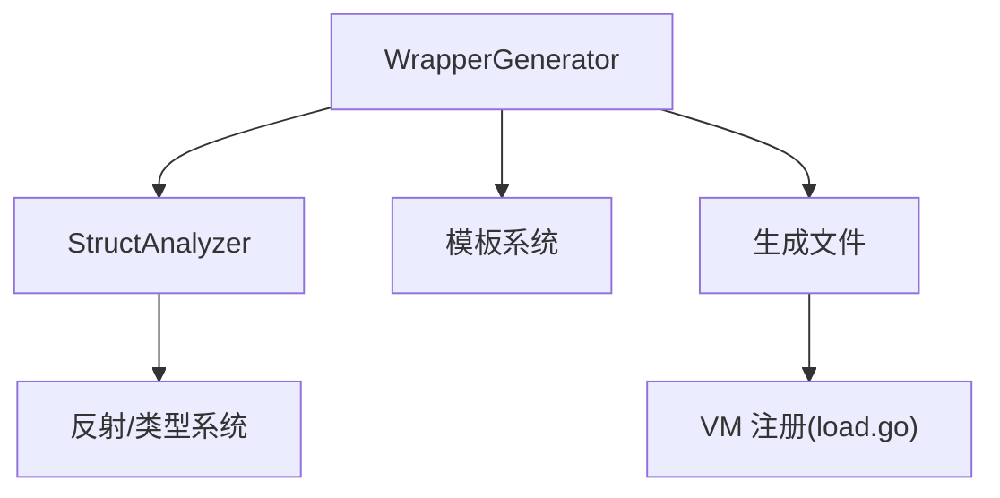

# 自定义扩展开发

<cite>
**本文引用的文件**
- [analyzer.go](file://std/tools/analyzer.go)
- [generator.go](file://std/tools/generator.go)
- [templates.go](file://std/tools/templates.go)
- [types.go](file://std/tools/types.go)
- [std/README.md](file://std/README.md)
- [server_class.go](file://std/net/http/server_class.go)
- [request_class.go](file://std/net/http/request_class.go)
- [load.go](file://std/net/http/load.go)
- [go-integration.md](file://docs/go-integration.md)
</cite>

## 目录
1. [简介](#简介)
2. [项目结构](#项目结构)
3. [核心组件](#核心组件)
4. [架构总览](#架构总览)
5. [详细组件分析](#详细组件分析)
6. [依赖分析](#依赖分析)
7. [性能考虑](#性能考虑)
8. [故障排查指南](#故障排查指南)
9. [结论](#结论)
10. [附录](#附录)

## 简介
本指南面向需要为第三方 Go 库创建 Origami 包装器的开发者，系统讲解如何使用工具链从 Go 结构体出发，自动生成对应的 Origami 类与方法包装器。内容覆盖：
- WrapperGenerator 工具如何生成 Go 结构体到 Origami 类的包装器
- StructAnalyzer 分析器的工作原理：结构体分析、方法提取、属性识别
- 模板系统设计与使用：类模板与方法模板的定制
- 参数检查生成、类型转换机制与返回值处理
- 完整扩展开发流程与最佳实践、性能优化与调试技巧

## 项目结构
与自定义扩展开发直接相关的核心位置：
- std/tools：代码生成与分析工具
- std/net/http：标准库扩展示例，展示类与方法包装器的实现模式
- docs：集成与使用文档

**图示来源**
- [analyzer.go:1-281](file://std/tools/analyzer.go#L1-L281)
- [generator.go:1-239](file://std/tools/generator.go#L1-L239)
- [templates.go:1-195](file://std/tools/templates.go#L1-L195)
- [types.go:1-101](file://std/tools/types.go#L1-L101)
- [server_class.go:1-96](file://std/net/http/server_class.go#L1-L96)
- [request_class.go:1-251](file://std/net/http/request_class.go#L1-L251)
- [load.go:1-17](file://std/net/http/load.go#L1-L17)
- [std/README.md:1-129](file://std/README.md#L1-L129)
- [go-integration.md:248-333](file://docs/go-integration.md#L248-L333)

**章节来源**
- [std/README.md:1-129](file://std/README.md#L1-L129)

## 核心组件
- StructAnalyzer：基于反射分析 Go 结构体，提取方法、属性与类型信息，并内置类型转换器映射。
- WrapperGenerator：驱动分析器，生成类定义与方法包装器文件，负责参数检查、源方法调用与返回值包装。
- 模板系统：类模板与方法模板，配合自定义函数映射，生成符合 Origami 规范的代码。
- 数据模型与接口：定义方法、参数、属性、结构体信息以及生成器/分析器接口。

**章节来源**
- [analyzer.go:9-281](file://std/tools/analyzer.go#L9-L281)
- [generator.go:42-239](file://std/tools/generator.go#L42-L239)
- [templates.go:8-195](file://std/tools/templates.go#L8-L195)
- [types.go:7-101](file://std/tools/types.go#L7-L101)

## 架构总览
WrapperGenerator 通过 StructAnalyzer 获取结构体元信息，再结合模板系统生成两类文件：
- 类定义文件：包含类工厂函数、属性节点与方法节点的初始化
- 方法包装器文件：每个方法一个包装器，负责参数校验、类型转换、调用源方法并返回包装值

**图示来源**
- [generator.go:54-84](file://std/tools/generator.go#L54-L84)
- [analyzer.go:24-40](file://std/tools/analyzer.go#L24-L40)
- [templates.go:86-194](file://std/tools/templates.go#L86-L194)

## 详细组件分析

### StructAnalyzer 分析器
职责与流程：
- 输入：任意 Go 结构体实例
- 输出：StructInfo（包含类名、方法列表、属性列表）
- 关键能力：
  - 公有方法/字段过滤（首字母大写）
  - 反射提取方法签名、参数、返回值
  - 类型字符串化与基本类型识别
  - 字段值的字符串化（用于默认属性值）
  - 类型转换器注册与查询

**图示来源**
- [analyzer.go:9-281](file://std/tools/analyzer.go#L9-L281)
- [types.go:7-61](file://std/tools/types.go#L7-L61)

**章节来源**
- [analyzer.go:24-281](file://std/tools/analyzer.go#L24-L281)
- [types.go:7-61](file://std/tools/types.go#L7-L61)

### WrapperGenerator 生成器
职责与流程：
- 生成类定义文件：调用类模板，注入包名、类名、结构体名、方法与属性
- 生成方法包装器文件：对每个方法生成独立文件，包含参数检查、源方法调用与返回值包装
- 参数检查：按参数索引从上下文获取值并校验
- 类型转换：根据参数类型选择内置转换器或直接使用
- 返回值处理：根据返回类型生成对应包装值

**图示来源**
- [generator.go:54-167](file://std/tools/generator.go#L54-L167)

**章节来源**
- [generator.go:54-239](file://std/tools/generator.go#L54-L239)

### 模板系统与定制
- 类模板：生成类工厂函数、属性节点与方法节点的初始化，支持自定义函数映射（如驼峰命名、大小写转换）
- 方法模板：生成方法包装器结构体、调用逻辑、参数定义与变量定义
- 自定义函数映射：提供 lower/title/upper/replace/camel 等辅助函数，便于模板渲染

**图示来源**
- [templates.go:8-195](file://std/tools/templates.go#L8-L195)

**章节来源**
- [templates.go:8-195](file://std/tools/templates.go#L8-L195)

### 类与方法包装器示例（标准库）
- HTTP Server 类：展示类工厂函数、方法集合与属性字段组织方式
- HTTP Request 类：展示大量方法包装器的组织方式与只读约束

**图示来源**
- [server_class.go:26-96](file://std/net/http/server_class.go#L26-L96)
- [request_class.go:88-251](file://std/net/http/request_class.go#L88-L251)

**章节来源**
- [server_class.go:1-96](file://std/net/http/server_class.go#L1-L96)
- [request_class.go:1-251](file://std/net/http/request_class.go#L1-L251)
- [load.go:7-16](file://std/net/http/load.go#L7-L16)

## 依赖分析
- WrapperGenerator 依赖 StructAnalyzer 与模板系统
- StructAnalyzer 依赖反射与类型转换器映射
- 生成的类与方法包装器依赖 data 与 node 接口与节点模型
- 标准库示例通过 load 入口注册到 VM

**图示来源**
- [generator.go:42-52](file://std/tools/generator.go#L42-L52)
- [analyzer.go:1-7](file://std/tools/analyzer.go#L1-L7)
- [load.go:7-16](file://std/net/http/load.go#L7-L16)

**章节来源**
- [generator.go:42-52](file://std/tools/generator.go#L42-L52)
- [analyzer.go:1-7](file://std/tools/analyzer.go#L1-L7)
- [load.go:7-16](file://std/net/http/load.go#L7-L16)

## 性能考虑
- 反射开销：StructAnalyzer 使用反射提取方法与字段，建议在构建期一次性生成代码，避免运行时频繁反射
- 模板执行：模板解析与执行在生成阶段完成，运行时仅执行生成的代码，避免额外模板解析成本
- 类型转换：内置类型转换器减少运行时类型判断与转换成本
- 文件写入：批量生成后一次性写入，避免频繁 IO

[本节为通用指导，无需特定文件引用]

## 故障排查指南
- 生成失败：检查配置项（包名、类名、结构体名、输出目录）是否正确
- 方法缺失：确认方法为公有（首字母大写），否则会被过滤
- 参数校验失败：确保传入参数数量与顺序与生成的参数检查一致
- 类型转换异常：确认参数类型在类型转换器映射中，或手动指定 Context 类型
- 注册未生效：确认在 VM 中正确注册生成的类与函数

**章节来源**
- [generator.go:10-32](file://std/tools/generator.go#L10-L32)
- [analyzer.go:126-134](file://std/tools/analyzer.go#L126-L134)
- [std/README.md:96-129](file://std/README.md#L96-L129)

## 结论
通过 WrapperGenerator 与 StructAnalyzer，开发者可以高效地将任意 Go 结构体封装为 Origami 类，配合模板系统与标准库示例，快速完成第三方库的扩展开发。遵循封装规范、合理使用类型转换与参数检查、在构建期生成代码并注册到 VM，是保证扩展质量与性能的关键。

[本节为总结性内容，无需特定文件引用]

## 附录

### 扩展开发完整流程（从 Go 结构体到 Origami 类）
- 定义 Go 结构体与公有方法/字段
- 准备 GeneratorConfig（包名、类名、结构体名、输出目录）
- 调用 Generate(instance, config) 生成代码
- 在标准库加载入口中注册生成的类
- 编译运行并在脚本中使用

**图示来源**
- [std/README.md:96-129](file://std/README.md#L96-L129)
- [generator.go:10-32](file://std/tools/generator.go#L10-L32)
- [load.go:7-16](file://std/net/http/load.go#L7-L16)

**章节来源**
- [std/README.md:96-129](file://std/README.md#L96-L129)
- [generator.go:10-32](file://std/tools/generator.go#L10-L32)
- [load.go:7-16](file://std/net/http/load.go#L7-L16)
- [go-integration.md:248-333](file://docs/go-integration.md#L248-L333)

### 最佳实践
- 保持方法与字段命名清晰，遵循公有命名约定
- 明确参数与返回值类型，必要时扩展类型转换器
- 优先使用生成器生成代码，减少手写错误
- 在标准库示例基础上组织类与方法包装器
- 在构建期生成并在 VM 中集中注册

**章节来源**
- [std/README.md:46-94](file://std/README.md#L46-L94)
- [analyzer.go:222-281](file://std/tools/analyzer.go#L222-L281)
- [generator.go:184-239](file://std/tools/generator.go#L184-L239)