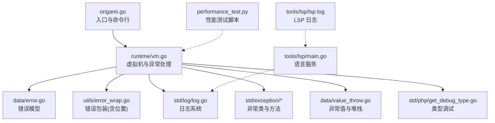
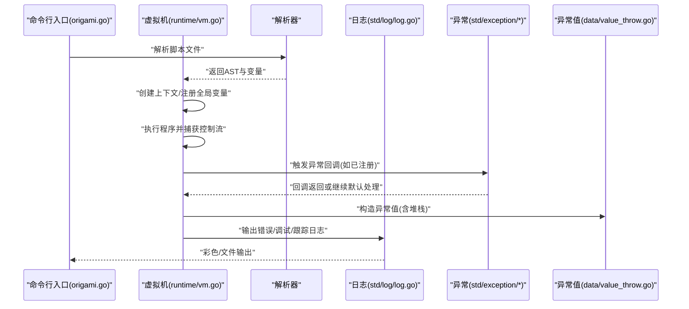
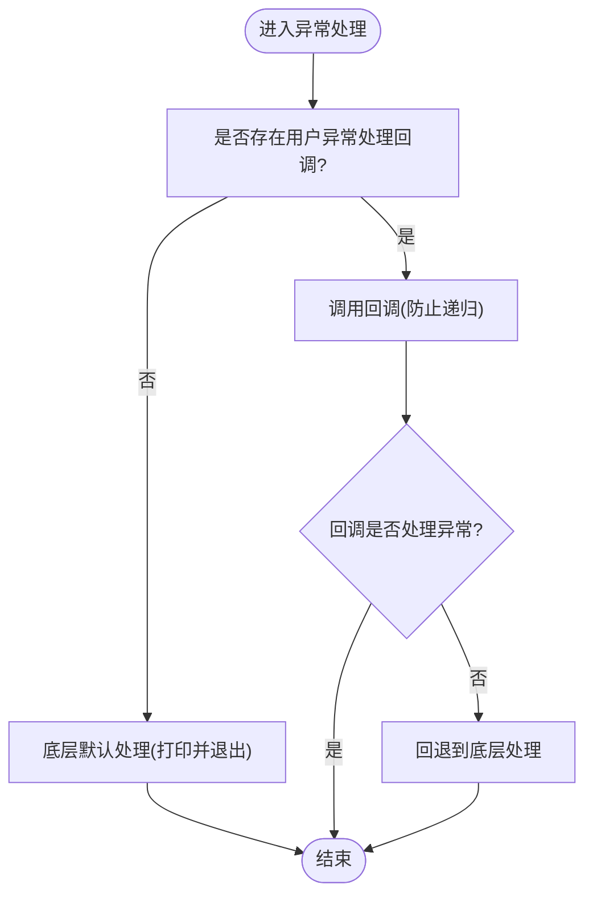
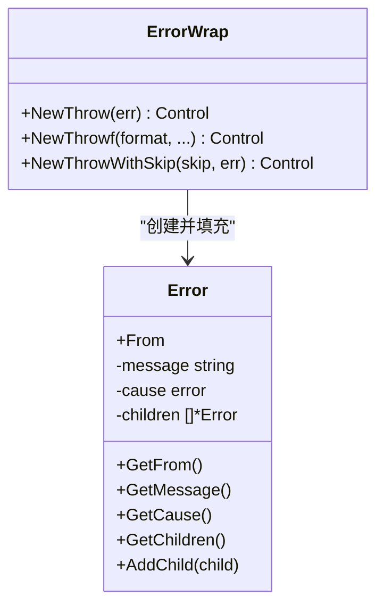
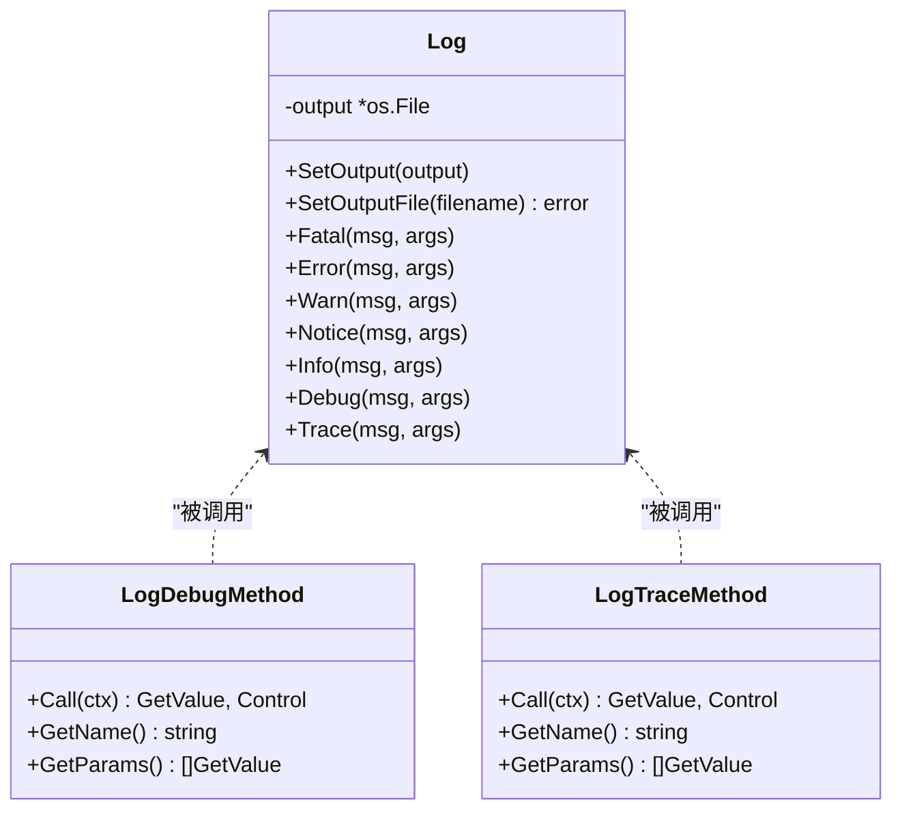
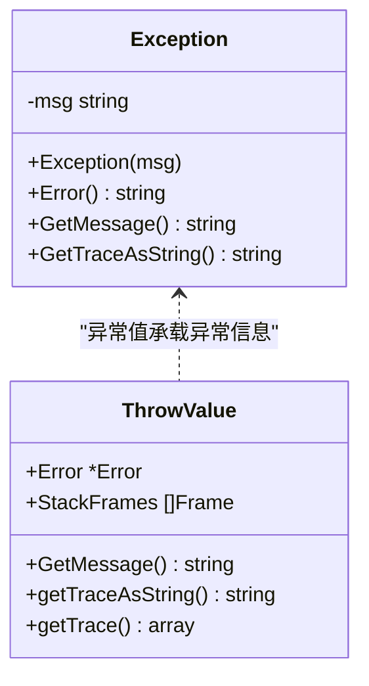
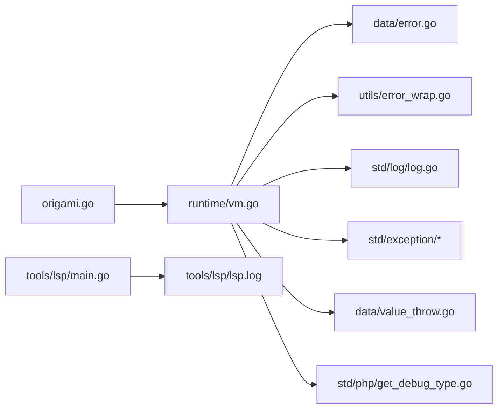

# 故障排除

<cite>
**本文引用的文件**
- [README.md](file://README.md)
- [README_CN.md](file://README_CN.md)
- [docs/installation.md](file://docs/installation.md)
- [go.mod](file://go.mod)
- [origami.go](file://origami.go)
- [runtime/vm.go](file://runtime/vm.go)
- [data/error.go](file://data/error.go)
- [utils/error_wrap.go](file://utils/error_wrap.go)
- [std/log/log.go](file://std/log/log.go)
- [std/log/log_debug_method.go](file://std/log/log_debug_method.go)
- [std/log/log_trace_method.go](file://std/log/log_trace_method.go)
- [std/exception/exception.go](file://std/exception/exception.go)
- [std/exception/exception_error_method.go](file://std/exception/exception_error_method.go)
- [std/exception/exception_gettraceasstring_method.go](file://std/exception/exception_gettraceasstring_method.go)
- [data/value_throw.go](file://data/value_throw.go)
- [std/php/get_debug_type.go](file://std/php/get_debug_type.go)
- [performance_test.py](file://performance_test.py)
- [performance_comparison.md](file://performance_comparison.md)
- [tools/lsp/main.go](file://tools/lsp/main.go)
- [tools/lsp/lsp.log](file://tools/lsp/lsp.log)
</cite>

## 目录
1. [简介](#简介)
2. [项目结构](#项目结构)
3. [核心组件](#核心组件)
4. [架构总览](#架构总览)
5. [详细组件分析](#详细组件分析)
6. [依赖关系分析](#依赖关系分析)
7. [性能注意事项](#性能注意事项)
8. [故障排除指南](#故障排除指南)
9. [结论](#结论)
10. [附录](#附录)

## 简介
本指南面向使用 Origami 的开发者与运维人员，聚焦于安装、编译、运行时异常、日志与调试、性能分析与优化、以及社区支持与问题反馈渠道。内容基于仓库内的安装文档、运行时虚拟机实现、错误模型与日志系统、标准库异常与调试工具等源码进行归纳总结，帮助你快速定位并解决问题。

## 项目结构
- 顶层入口与构建：通过顶层入口文件与 go.mod 指定 Go 版本与模块信息，便于定位编译与运行环境要求。
- 运行时与虚拟机：runtime/vm.go 提供虚拟机生命周期、异常处理回调、类/接口/函数/常量注册与全局变量管理等核心能力。
- 错误与异常：data/error.go 定义统一错误模型；utils/error_wrap.go 提供带调用位置的错误包装；std/exception/* 与 data/value_throw.go 提供异常对象与堆栈信息。
- 日志系统：std/log/* 提供多级别日志记录与格式化输出，支持文件输出与颜色标记。
- 性能与测试：performance_test.py 与 performance_comparison.md 提供性能测试思路与对比说明。
- LSP 工具：tools/lsp/* 提供语言服务实现与日志文件，便于排查语法与类型问题。

图表来源
- [origami.go](file://origami.go)
- [runtime/vm.go](file://runtime/vm.go)
- [data/error.go](file://data/error.go)
- [utils/error_wrap.go](file://utils/error_wrap.go)
- [std/log/log.go](file://std/log/log.go)
- [std/exception/exception.go](file://std/exception/exception.go)
- [data/value_throw.go](file://data/value_throw.go)
- [std/php/get_debug_type.go](file://std/php/get_debug_type.go)
- [performance_test.py](file://performance_test.py)
- [tools/lsp/main.go](file://tools/lsp/main.go)
- [tools/lsp/lsp.log](file://tools/lsp/lsp.log)

章节来源
- [README.md](file://README.md)
- [go.mod](file://go.mod)

## 核心组件
- 虚拟机与异常处理：负责解析、执行、异常回调、全局状态管理与类/接口/函数/常量注册。
- 错误模型与包装：统一错误结构，支持来源、消息、原始错误与子错误树；错误包装自动携带调用位置。
- 日志系统：提供致命、错误、警告、通知、信息、调试、跟踪等多级别日志，支持文件输出与颜色。
- 异常与堆栈：异常对象与异常值均提供堆栈字符串与跟踪数组，便于定位问题。
- 调试工具：日志方法、类型检查函数、LSP 工具与日志文件，辅助定位问题。

章节来源
- [runtime/vm.go](file://runtime/vm.go)
- [data/error.go](file://data/error.go)
- [utils/error_wrap.go](file://utils/error_wrap.go)
- [std/log/log.go](file://std/log/log.go)
- [std/exception/exception.go](file://std/exception/exception.go)
- [data/value_throw.go](file://data/value_throw.go)
- [std/php/get_debug_type.go](file://std/php/get_debug_type.go)

## 架构总览
下图展示从命令行入口到运行时执行、异常处理与日志输出的关键交互：

图表来源
- [origami.go](file://origami.go)
- [runtime/vm.go](file://runtime/vm.go)
- [std/log/log.go](file://std/log/log.go)
- [std/exception/exception.go](file://std/exception/exception.go)
- [data/value_throw.go](file://data/value_throw.go)

## 详细组件分析

### 虚拟机与异常处理流程
- 异常处理回调：当发生未捕获异常时，优先尝试调用用户注册的 PHP 级异常处理回调；若回调内部再次抛出异常，将回退到底层处理。
- 默认处理：若无回调或回调未处理，底层处理会打印并退出。
- 异常对象与堆栈：异常值包含来源位置、堆栈帧与跟踪数组，便于定位具体文件与行列号。

图表来源
- [runtime/vm.go](file://runtime/vm.go)
- [data/value_throw.go](file://data/value_throw.go)

章节来源
- [runtime/vm.go](file://runtime/vm.go)
- [data/value_throw.go](file://data/value_throw.go)

### 错误模型与错误包装
- 错误结构：包含来源、消息、原始错误与子错误列表，支持层次化错误聚合。
- 错误包装：NewThrow/NewThrowf 自动获取调用位置，生成带位置信息的错误控制，便于快速定位问题来源。

图表来源
- [data/error.go](file://data/error.go)
- [utils/error_wrap.go](file://utils/error_wrap.go)

章节来源
- [data/error.go](file://data/error.go)
- [utils/error_wrap.go](file://utils/error_wrap.go)

### 日志系统与调试方法
- 日志级别：致命、错误、警告、通知、信息、调试、跟踪，支持彩色输出与文件输出。
- 调试方法：Log.debug 与 Log.trace 提供带参数的调试输出，便于在运行时观察变量与流程。
- 类型调试：get_debug_type 提供值类型的字符串表示，辅助排查类型不匹配问题。

图表来源
- [std/log/log.go](file://std/log/log.go)
- [std/log/log_debug_method.go](file://std/log/log_debug_method.go)
- [std/log/log_trace_method.go](file://std/log/log_trace_method.go)

章节来源
- [std/log/log.go](file://std/log/log.go)
- [std/log/log_debug_method.go](file://std/log/log_debug_method.go)
- [std/log/log_trace_method.go](file://std/log/log_trace_method.go)
- [std/php/get_debug_type.go](file://std/php/get_debug_type.go)

### 异常类与堆栈信息
- 异常类：提供构造、error、getMessage、getTraceAsString 等方法，便于统一处理异常信息。
- 异常值：异常值包含来源、堆栈帧与跟踪数组，getTraceAsString 生成堆栈字符串，getTrace 返回结构化跟踪数组。

图表来源
- [std/exception/exception.go](file://std/exception/exception.go)
- [std/exception/exception_error_method.go](file://std/exception/exception_error_method.go)
- [std/exception/exception_gettraceasstring_method.go](file://std/exception/exception_gettraceasstring_method.go)
- [data/value_throw.go](file://data/value_throw.go)

章节来源
- [std/exception/exception.go](file://std/exception/exception.go)
- [std/exception/exception_error_method.go](file://std/exception/exception_error_method.go)
- [std/exception/exception_gettraceasstring_method.go](file://std/exception/exception_gettraceasstring_method.go)
- [data/value_throw.go](file://data/value_throw.go)

## 依赖关系分析
- 入口与模块：origami.go 作为命令行入口，go.mod 指定模块与 Go 版本，确保编译环境正确。
- 运行时依赖：runtime/vm.go 依赖解析器、数据与工具包，负责执行与异常处理。
- 标准库与工具：日志、异常、调试工具与 LSP 工具相互配合，形成完整的排障链路。

图表来源
- [origami.go](file://origami.go)
- [runtime/vm.go](file://runtime/vm.go)
- [data/error.go](file://data/error.go)
- [utils/error_wrap.go](file://utils/error_wrap.go)
- [std/log/log.go](file://std/log/log.go)
- [std/exception/exception.go](file://std/exception/exception.go)
- [data/value_throw.go](file://data/value_throw.go)
- [std/php/get_debug_type.go](file://std/php/get_debug_type.go)
- [tools/lsp/main.go](file://tools/lsp/main.go)
- [tools/lsp/lsp.log](file://tools/lsp/lsp.log)

章节来源
- [go.mod](file://go.mod)
- [origami.go](file://origami.go)

## 性能注意事项
- 性能测试脚本：performance_test.py 提供基准测试模板，可用于评估赋值、计算等操作的耗时与吞吐。
- 性能对比文档：performance_comparison.md 记录了不同实现下的性能对比与影响因素，有助于理解循环结构与实现细节对性能的影响。
- 优化建议（通用指导）：
  - 减少不必要的对象创建与类型转换。
  - 合理使用并发与协程，避免过度竞争与上下文切换开销。
  - 在高频路径中减少日志输出与字符串拼接。
  - 使用结构化日志与采样策略，降低 I/O 压力。
  - 对热点循环进行剖析，识别瓶颈指令与分配热点。

章节来源
- [performance_test.py](file://performance_test.py)
- [performance_comparison.md](file://performance_comparison.md)

## 故障排除指南

### 安装与编译问题
- Go 版本过低
  - 现象：编译时报错提示需要更高版本的 Go。
  - 解决：升级至满足 go.mod 要求的 Go 版本。
  - 参考：[go.mod](file://go.mod)
- 依赖下载失败
  - 现象：模块拉取失败或代理不可用。
  - 解决：配置 GOPROXY 并执行模块整理。
  - 参考：[docs/installation.md](file://docs/installation.md)
- 权限问题
  - 现象：执行二进制文件时报权限拒绝。
  - 解决：赋予执行权限后再运行。
  - 参考：[docs/installation.md](file://docs/installation.md)
- 编译错误
  - 现象：编译过程中出现多种错误。
  - 解决：清理缓存、重新拉取依赖并重新编译。
  - 参考：[docs/installation.md](file://docs/installation.md)

章节来源
- [docs/installation.md](file://docs/installation.md)
- [go.mod](file://go.mod)

### 运行时异常与错误处理
- 未捕获异常
  - 现象：程序崩溃并退出。
  - 排查：检查是否注册了 PHP 级异常处理回调；若无回调，确认底层默认处理是否符合预期。
  - 参考：[runtime/vm.go](file://runtime/vm.go)
- 异常堆栈定位
  - 现象：需要精确定位异常来源与调用栈。
  - 排查：使用异常值的堆栈字符串与跟踪数组，结合来源位置信息定位文件与行列。
  - 参考：[data/value_throw.go](file://data/value_throw.go)
- 错误来源与层次化错误
  - 现象：错误信息不明确或缺少上下文。
  - 排查：利用错误包装自动携带的位置信息与子错误树，逐层溯源。
  - 参考：[data/error.go](file://data/error.go)、[utils/error_wrap.go](file://utils/error_wrap.go)

章节来源
- [runtime/vm.go](file://runtime/vm.go)
- [data/value_throw.go](file://data/value_throw.go)
- [data/error.go](file://data/error.go)
- [utils/error_wrap.go](file://utils/error_wrap.go)

### 日志分析与调试
- 日志级别与输出
  - 现象：日志缺失或输出不符合预期。
  - 排查：确认日志级别、输出目标（控制台/文件）与颜色开关。
  - 参考：[std/log/log.go](file://std/log/log.go)
- 调试输出
  - 现象：需要在运行时观察变量与流程。
  - 排查：使用 Log.debug 与 Log.trace 输出带参数的日志。
  - 参考：[std/log/log_debug_method.go](file://std/log/log_debug_method.go)、[std/log/log_trace_method.go](file://std/log/log_trace_method.go)
- 类型调试
  - 现象：类型不匹配导致运行时异常。
  - 排查：使用 get_debug_type 获取值的类型字符串，辅助定位类型问题。
  - 参考：[std/php/get_debug_type.go](file://std/php/get_debug_type.go)

章节来源
- [std/log/log.go](file://std/log/log.go)
- [std/log/log_debug_method.go](file://std/log/log_debug_method.go)
- [std/log/log_trace_method.go](file://std/log/log_trace_method.go)
- [std/php/get_debug_type.go](file://std/php/get_debug_type.go)

### LSP 与开发工具问题
- 现象：编辑器语言服务异常或诊断不准确。
- 排查：查看 LSP 日志文件，定位解析与诊断阶段的问题。
- 参考：[tools/lsp/main.go](file://tools/lsp/main.go)、[tools/lsp/lsp.log](file://tools/lsp/lsp.log)

章节来源
- [tools/lsp/main.go](file://tools/lsp/main.go)
- [tools/lsp/lsp.log](file://tools/lsp/lsp.log)

### 社区支持与问题反馈
- 文档与示例：参考官方文档中心与示例目录，获取使用与最佳实践。
- 讨论群：通过二维码加入讨论群，与其他开发者交流经验。
- 问题反馈：前往 GitHub Issues 提交问题，附带复现步骤与环境信息。
- 参考：[README.md](file://README.md)、[README_CN.md](file://README_CN.md)

章节来源
- [README.md](file://README.md)
- [README_CN.md](file://README_CN.md)

## 结论
本指南围绕安装、编译、运行时异常、日志与调试、性能分析与优化、以及社区支持等方面，结合仓库内的源码与文档，提供了系统化的故障排除路径。建议在日常开发中：
- 建立规范的日志与异常处理流程；
- 使用调试工具与类型检查函数快速定位问题；
- 借助 LSP 日志与错误包装信息提升排障效率；
- 在性能敏感场景进行基准测试与剖析，持续优化。

## 附录
- 快速检查清单
  - 确认 Go 版本满足要求且 GOPROXY 正常。
  - 清理缓存并重新编译，验证二进制可执行。
  - 使用日志与调试方法输出关键变量与流程。
  - 通过异常堆栈与来源位置定位问题根因。
  - 参考 LSP 日志与标准库异常/日志实现完善排障手段。