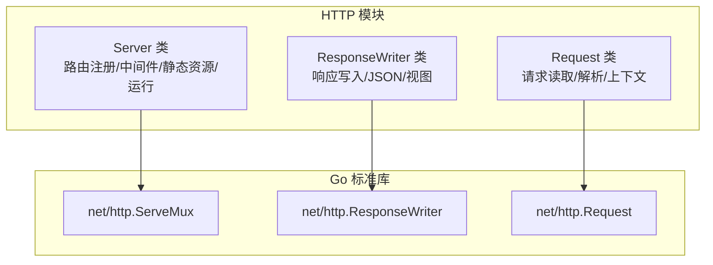
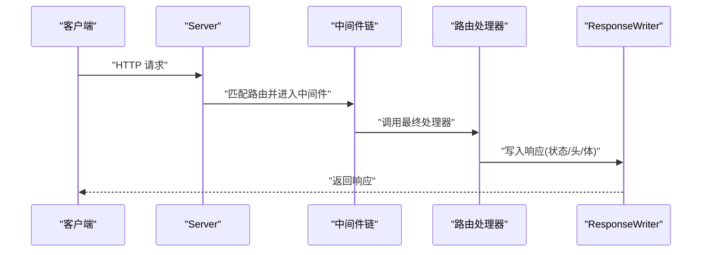
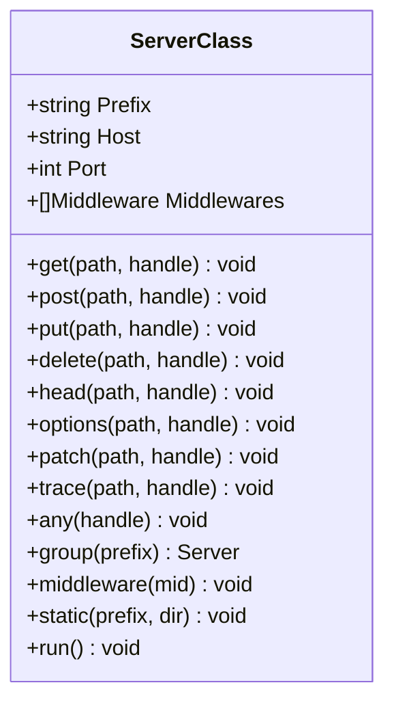
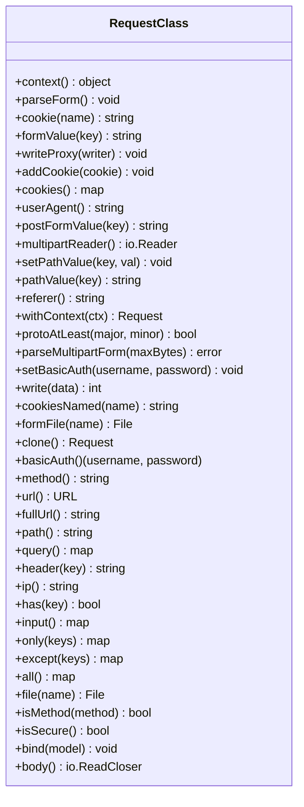
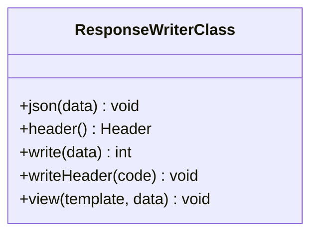
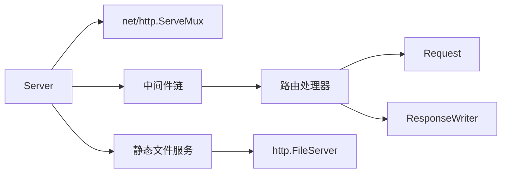

# HTTP模块

<cite>
**本文引用的文件**
- [server_class.go](file://std/net/http/server_class.go)
- [server_construct.go](file://std/net/http/server_construct.go)
- [server_run.go](file://std/net/http/server_run.go)
- [server_middleware.go](file://std/net/http/server_middleware.go)
- [server_group.go](file://std/net/http/server_group.go)
- [server_handler.go](file://std/net/http/server_handler.go)
- [server_static_method.go](file://std/net/http/server_static_method.go)
- [request_class.go](file://std/net/http/request_class.go)
- [responsewriter_class.go](file://std/net/http/responsewriter_class.go)
- [server.zy](file://docs/std/Net/Http/server.zy)
- [request.zy](file://docs/std/Net/Http/request.zy)
- [response.zy](file://docs/std/Net/Http/response.zy)
</cite>

## 目录
1. [简介](#简介)
2. [项目结构](#项目结构)
3. [核心组件](#核心组件)
4. [架构总览](#架构总览)
5. [详细组件分析](#详细组件分析)
6. [依赖关系分析](#依赖关系分析)
7. [性能考量](#性能考量)
8. [故障排查指南](#故障排查指南)
9. [结论](#结论)
10. [附录](#附录)

## 简介
本文件面向使用者与开发者，系统性梳理 HTTP 模块的 API 与实现要点，覆盖以下主题：
- HTTP 服务器创建与配置：Server 类的构造、端口绑定、中间件、路由注册、静态文件服务、任意方法路由等
- 请求对象 Request 的能力：HTTP 方法、URL/路径/查询参数、请求头、请求体、表单解析、文件上传、认证信息等
- 响应写入器 ResponseWriter 的能力：状态码、响应头、正文写入、JSON 序列化、模板视图渲染等
- 常见场景示例：路由配置、静态文件服务、文件上传下载、CORS 配置、安全考虑与最佳实践

## 项目结构
HTTP 模块位于标准库 std/net/http 下，采用“类 + 方法”的组织方式，每个类对应一组方法，方法封装对 Go 标准库 net/http 的适配与扩展。

图表来源
- [server_class.go:26-35](file://std/net/http/server_class.go#L26-L35)
- [request_class.go:88-90](file://std/net/http/request_class.go#L88-L90)
- [responsewriter_class.go:22-24](file://std/net/http/responsewriter_class.go#L22-L24)

章节来源
- [server_class.go:10-96](file://std/net/http/server_class.go#L10-L96)
- [request_class.go:32-251](file://std/net/http/request_class.go#L32-L251)
- [responsewriter_class.go:10-71](file://std/net/http/responsewriter_class.go#L10-L71)

## 核心组件
- Server 类：负责路由注册（GET/POST/PUT/DELETE/OPTIONS/PATCH/TRACE/ANY）、中间件链、静态文件服务、启动监听
- Request 类：封装 HTTP 请求的读取与解析，提供方法、URL、路径、查询、头、体、表单、文件、认证等访问接口
- ResponseWriter 类：封装 HTTP 响应写入，提供 JSON、响应头、正文、状态码、视图渲染等

章节来源
- [server.zy:14-107](file://docs/std/Net/Http/server.zy#L14-L107)
- [request.zy:14-195](file://docs/std/Net/Http/request.zy#L14-L195)
- [response.zy:14-51](file://docs/std/Net/Http/response.zy#L14-L51)

## 架构总览
HTTP 模块在运行时将用户编写的路由处理函数包装为 net/http.Handler，并注册到 ServeMux；中间件以装饰器形式包裹最终 Handler，形成洋葱模型；静态文件通过 http.StripPrefix + http.FileServer 提供服务。

图表来源
- [server_handler.go:18-44](file://std/net/http/server_handler.go#L18-L44)
- [server_middleware.go:15-30](file://std/net/http/server_middleware.go#L15-L30)
- [server_static_method.go:68-78](file://std/net/http/server_static_method.go#L68-L78)

## 详细组件分析

### Server 类 API 详解
- 构造方法
  - 功能：设置主机与端口
  - 参数：host（默认 0.0.0.0），port（默认 80）
  - 返回：无
- 路由方法
  - get/post/put/delete/head/options/patch/trace：注册指定方法与路径的处理器
  - any：注册任意方法与“/”前缀的通配路由
  - 参数：path（字符串），handle（闭包）
- 中间件
  - middleware(mid)：注册中间件闭包，接收 (r, w, next) 三元调用
- 分组
  - group(prefix)：基于当前 Server 创建带前缀的新 Server 实例，便于批量注册
- 静态资源
  - static(prefix, dir)：注册静态文件服务，自动规范化前缀与目录，支持中间件
- 启动
  - run()：绑定 Host:Port 并启动 HTTP 服务

图表来源
- [server_class.go:26-83](file://std/net/http/server_class.go#L26-L83)
- [server_handler.go:13-61](file://std/net/http/server_handler.go#L13-L61)
- [server_handler.go:64-109](file://std/net/http/server_handler.go#L64-L109)
- [server_group.go:9-37](file://std/net/http/server_group.go#L9-L37)
- [server_middleware.go:11-45](file://std/net/http/server_middleware.go#L11-L45)
- [server_static_method.go:15-96](file://std/net/http/server_static_method.go#L15-L96)
- [server_run.go:11-32](file://std/net/http/server_run.go#L11-L32)

章节来源
- [server_class.go:10-96](file://std/net/http/server_class.go#L10-L96)
- [server_construct.go:9-44](file://std/net/http/server_construct.go#L9-L44)
- [server_run.go:11-33](file://std/net/http/server_run.go#L11-L33)
- [server_middleware.go:11-46](file://std/net/http/server_middleware.go#L11-L46)
- [server_group.go:9-38](file://std/net/http/server_group.go#L9-L38)
- [server_handler.go:13-110](file://std/net/http/server_handler.go#L13-L110)
- [server_static_method.go:15-97](file://std/net/http/server_static_method.go#L15-L97)

### Request 类 API 详解
- 访问器与解析
  - method/url/fullUrl/path/query/header/ip/has/input/only/except/all/file/isMethod/isSecure/bind/body
  - 以上均通过方法访问，不支持直接设置属性
- 表单与文件
  - parseForm()/parseMultipartForm(maxMemory)/formValue()/postFormValue()/formFile()
- Cookie 与认证
  - cookie()/cookies()/cookiesNamed()/addCookie()/basicAuth()/setBasicAuth()
- 上下文与代理
  - context()/withContext()/writeProxy(writeTo)
- 其他
  - userAgent()/referer()/clone()

图表来源
- [request_class.go:88-206](file://std/net/http/request_class.go#L88-L206)
- [request_class.go:210-234](file://std/net/http/request_class.go#L210-L234)

章节来源
- [request_class.go:32-251](file://std/net/http/request_class.go#L32-L251)

### ResponseWriter 类 API 详解
- 写入与状态
  - writeHeader(code)：设置状态码
  - write(data)：写入响应体
- 响应头
  - header()：返回 Header 对象，支持 set/add/del/get/values/write/writeSubset
- 数据序列化
  - json(data)：序列化并写入 JSON，设置 Content-Type
- 视图渲染
  - view(template, data)：渲染模板并写入响应

图表来源
- [responsewriter_class.go:22-50](file://std/net/http/responsewriter_class.go#L22-L50)
- [responsewriter_class.go:52-60](file://std/net/http/responsewriter_class.go#L52-L60)

章节来源
- [responsewriter_class.go:10-71](file://std/net/http/responsewriter_class.go#L10-L71)

## 依赖关系分析
- Server 依赖 net/http.ServeMux 注册路由
- Request/ResponseWriter 分别封装 net/http.Request/ResponseWriter
- 中间件通过装饰器模式包裹 Handler，形成可叠加的处理链
- 静态文件服务使用 http.StripPrefix + http.FileServer

图表来源
- [server_class.go:26-35](file://std/net/http/server_class.go#L26-L35)
- [server_handler.go:28-41](file://std/net/http/server_handler.go#L28-L41)
- [server_static_method.go:69-77](file://std/net/http/server_static_method.go#L69-L77)

章节来源
- [server_class.go:10-96](file://std/net/http/server_class.go#L10-L96)
- [server_handler.go:13-110](file://std/net/http/server_handler.go#L13-L110)
- [server_static_method.go:15-97](file://std/net/http/server_static_method.go#L15-L97)

## 性能考量
- 路由注册与 ServeMux：使用 Go 1.22+ 的方法路由语法，按方法+路径精确注册，避免通配带来的匹配开销
- 中间件链：中间件数量与顺序直接影响延迟，建议将轻量检查前置，耗时操作后置
- 静态文件：StripPrefix 与 FileServer 组合可利用底层高效文件传输，建议配合缓存头与压缩
- 请求体解析：multipart/form-data 解析会占用内存，合理设置最大字节数与流式处理策略
- 并发与连接：ListenAndServe 在单线程阻塞模式下运行，生产环境建议结合 goroutine/并发池与连接复用

## 故障排查指南
- 中间件参数错误
  - 症状：注册中间件时报错
  - 原因：未传入闭包或闭包签名不正确
  - 处理：确保传入形如 (r, w, next) 的闭包
- 路由处理函数错误
  - 症状：路由注册时报错
  - 原因：第二个参数非闭包或入参不匹配
  - 处理：确认闭包签名与期望一致
- 静态资源目录不存在或非目录
  - 症状：注册静态资源时报错
  - 原因：dir 参数为空或指向非目录
  - 处理：提供绝对路径或相对工作目录下的有效目录
- 服务器启动失败
  - 症状：run() 抛出异常
  - 原因：端口被占用或权限不足
  - 处理：更换端口或提升权限

章节来源
- [server_middleware.go:15-30](file://std/net/http/server_middleware.go#L15-L30)
- [server_handler.go:18-44](file://std/net/http/server_handler.go#L18-L44)
- [server_static_method.go:52-59](file://std/net/http/server_static_method.go#L52-L59)
- [server_run.go:15-21](file://std/net/http/server_run.go#L15-L21)

## 结论
HTTP 模块以清晰的类与方法抽象，将 Go 标准库的 HTTP 能力与中间件、静态资源、路由注册等特性整合，既满足快速开发，又保留了对底层行为的可控性。建议在实际项目中结合中间件链、静态资源与安全策略，构建高性能、可维护的 Web 应用。

## 附录

### 常见场景示例（步骤级）
- 路由配置
  - 步骤：构造 Server -> 调用 get/post/... 注册路由 -> run 启动
  - 参考：[server_handler.go:18-44](file://std/net/http/server_handler.go#L18-L44)，[server_run.go:15-21](file://std/net/http/server_run.go#L15-L21)
- 中间件配置
  - 步骤：调用 middleware 注册闭包 -> 闭包内调用 next 完成链路传递
  - 参考：[server_middleware.go:15-30](file://std/net/http/server_middleware.go#L15-L30)
- 静态文件服务
  - 步骤：调用 static(prefix, dir) -> 确保目录存在且为目录
  - 参考：[server_static_method.go:20-78](file://std/net/http/server_static_method.go#L20-L78)
- 文件上传
  - 步骤：在处理器中使用 Request 的 multipartReader 或 parseMultipartForm -> formFile 获取文件
  - 参考：[request_class.go:145-167](file://std/net/http/request_class.go#L145-L167)，[request_class.go:157-158](file://std/net/http/request_class.go#L157-L158)，[request_class.go:165-166](file://std/net/http/request_class.go#L165-L166)
- 文件下载
  - 步骤：使用 ResponseWriter 的 writeHeader 设置 Content-Disposition 与长度 -> write 输出文件内容
  - 参考：[responsewriter_class.go:36-50](file://std/net/http/responsewriter_class.go#L36-L50)
- CORS 配置
  - 步骤：在 middleware 中设置 Access-Control-Allow-* 响应头
  - 参考：[server_middleware.go:15-30](file://std/net/http/server_middleware.go#L15-L30)
- 安全考虑
  - 输入校验：使用 only/except/all/has 等方法过滤与校验输入
  - 认证：basicAuth/setBasicAuth 与 isSecure/isMethod 等辅助
  - 参考：[request_class.go:171-205](file://std/net/http/request_class.go#L171-L205)，[request_class.go:159-160](file://std/net/http/request_class.go#L159-L160)，[request_class.go:197-202](file://std/net/http/request_class.go#L197-L202)