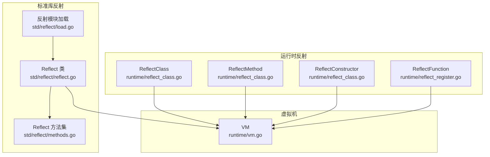
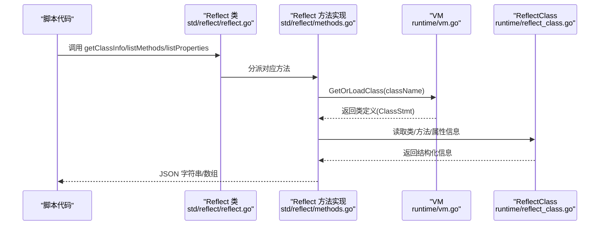
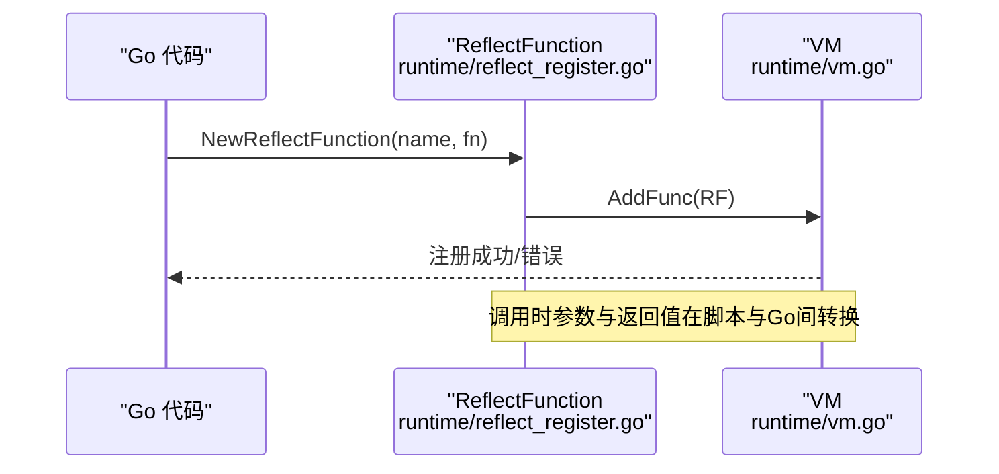
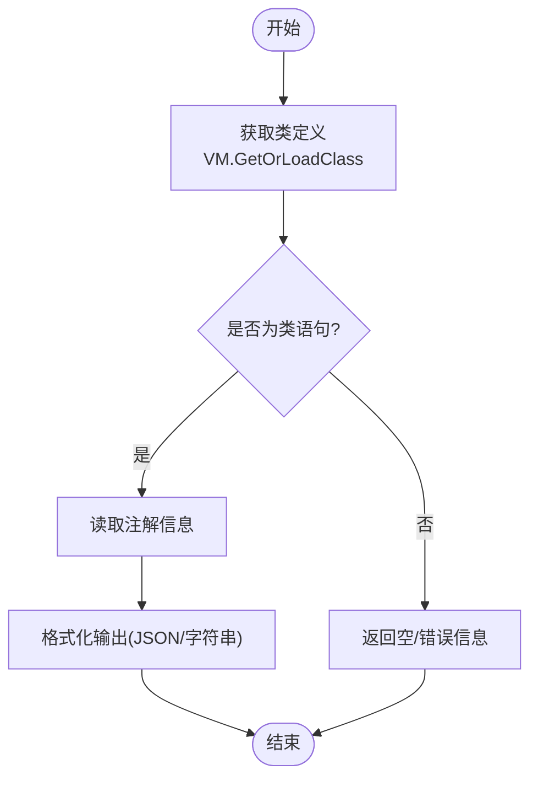
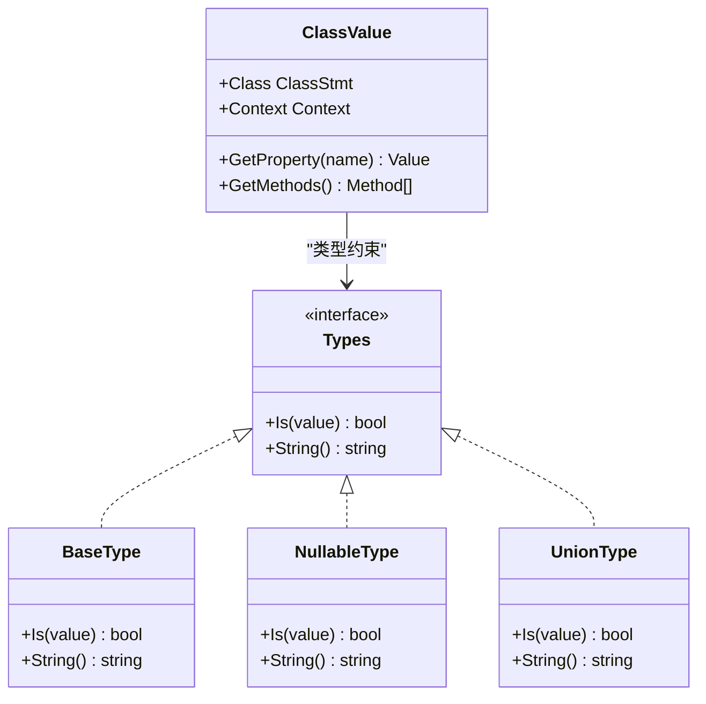
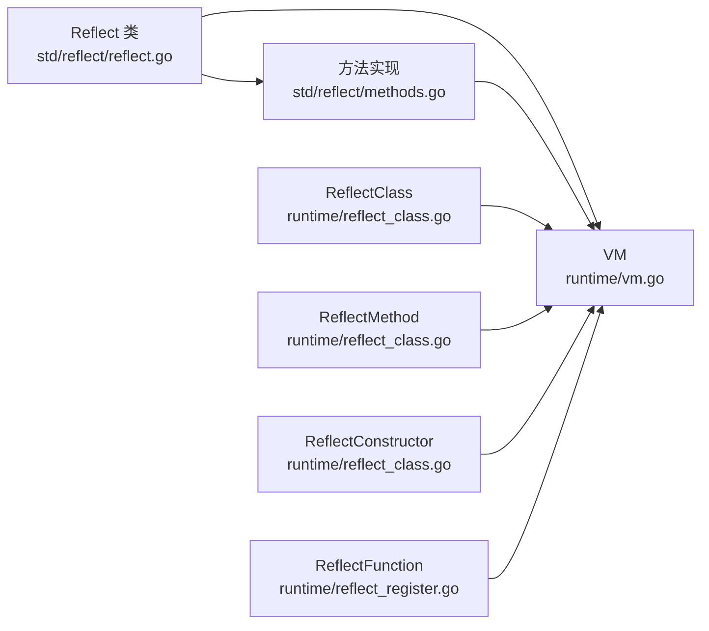

# 反射模块

<cite>
**本文引用的文件**
- [runtime/reflect_class.go](file://runtime/reflect_class.go)
- [runtime/reflect_register.go](file://runtime/reflect_register.go)
- [std/reflect/load.go](file://std/reflect/load.go)
- [std/reflect/reflect.go](file://std/reflect/reflect.go)
- [std/reflect/methods.go](file://std/reflect/methods.go)
- [runtime/vm.go](file://runtime/vm.go)
- [data/value_class.go](file://data/value_class.go)
- [data/types.go](file://data/types.go)
- [data/interface.go](file://data/interface.go)
- [docs/reflection.md](file://docs/reflection.md)
- [docs/reflection-annotations.md](file://docs/reflection-annotations.md)
- [tests/php/reflection.zy](file://tests/php/reflection.zy)
- [tests/php/reflection_get_attributes.zy](file://tests/php/reflection_get_attributes.zy)
</cite>

## 目录
1. [简介](#简介)
2. [项目结构](#项目结构)
3. [核心组件](#核心组件)
4. [架构总览](#架构总览)
5. [详细组件分析](#详细组件分析)
6. [依赖分析](#依赖分析)
7. [性能考量](#性能考量)
8. [故障排查指南](#故障排查指南)
9. [结论](#结论)
10. [附录](#附录)

## 简介
本文件系统性阐述 Origami 折言语言的反射模块，覆盖脚本侧反射类 Reflect 的能力边界与使用方式，并结合运行时反射类 ReflectClass、ReflectMethod、ReflectConstructor 的实现，解释类反射、方法反射、属性反射、注解反射、动态类型检查、对象实例化与方法调用等高级功能。同时给出与 PHP 反射系统的对比、迁移建议以及性能优化与内存管理注意事项。

## 项目结构
反射模块由“标准库反射类 + 运行时反射实现 + VM 协作”三部分组成：
- 标准库反射类：提供脚本侧的 Reflect 类及其方法（类信息、方法信息、属性信息、注解信息、列表枚举等）
- 运行时反射实现：提供反射类、方法、构造函数的包装与调用桥接
- VM 协作：负责类注册、查找、上下文创建与异常处理



**图表来源**
- [std/reflect/reflect.go:1-93](file://std/reflect/reflect.go#L1-L93)
- [std/reflect/methods.go:1-876](file://std/reflect/methods.go#L1-L876)
- [std/reflect/load.go:1-11](file://std/reflect/load.go#L1-L11)
- [runtime/reflect_class.go:1-524](file://runtime/reflect_class.go#L1-L524)
- [runtime/reflect_register.go:1-200](file://runtime/reflect_register.go#L1-L200)
- [runtime/vm.go:1-391](file://runtime/vm.go#L1-L391)

**章节来源**
- [std/reflect/reflect.go:1-93](file://std/reflect/reflect.go#L1-L93)
- [std/reflect/methods.go:1-876](file://std/reflect/methods.go#L1-L876)
- [runtime/reflect_class.go:1-524](file://runtime/reflect_class.go#L1-L524)
- [runtime/reflect_register.go:1-200](file://runtime/reflect_register.go#L1-L200)
- [runtime/vm.go:1-391](file://runtime/vm.go#L1-L391)

## 核心组件
- Reflect 类：脚本侧反射入口，提供类/方法/属性/注解信息查询与列表枚举
- ReflectClass（运行时）：对任意 Go 结构体进行反射包装，暴露方法、属性、构造函数、实例化等能力
- ReflectMethod：封装方法调用，参数与返回值在脚本与 Go 之间双向转换
- ReflectConstructor：封装构造函数调用，按结构体字段名设置初始值
- ReflectFunction：将任意 Go 函数注册为脚本函数，支持参数与返回值转换
- VM：类注册、查找、上下文创建、异常处理

**章节来源**
- [std/reflect/reflect.go:8-93](file://std/reflect/reflect.go#L8-L93)
- [runtime/reflect_class.go:12-131](file://runtime/reflect_class.go#L12-L131)
- [runtime/reflect_class.go:143-347](file://runtime/reflect_class.go#L143-L347)
- [runtime/reflect_class.go:349-509](file://runtime/reflect_class.go#L349-L509)
- [runtime/reflect_register.go:12-189](file://runtime/reflect_register.go#L12-L189)
- [runtime/vm.go:118-181](file://runtime/vm.go#L118-L181)

## 架构总览
脚本侧 Reflect 调用最终通过 VM 获取类定义，再由运行时 ReflectClass/ReflectMethod/ReflectConstructor 执行具体反射操作；函数可通过 ReflectFunction 注册到 VM 并在脚本中调用。



**图表来源**
- [std/reflect/reflect.go:13-93](file://std/reflect/reflect.go#L13-L93)
- [std/reflect/methods.go:42-92](file://std/reflect/methods.go#L42-L92)
- [runtime/vm.go:162-181](file://runtime/vm.go#L162-L181)
- [runtime/reflect_class.go:74-102](file://runtime/reflect_class.go#L74-L102)

## 详细组件分析

### 脚本反射类 Reflect
- 提供方法族：getClassInfo、getMethodInfo、getPropertyInfo、listMethods、listProperties、listClasses、getClassAnnotations、getMethodAnnotations、getPropertyAnnotations、getAllAnnotations、getAnnotationDetails
- 返回值：字符串（JSON 格式）或数组，便于脚本侧解析与使用
- 与 VM 协作：通过 VM 获取类定义，再进行信息提取与格式化

```mermaid
classDiagram
class ReflectClass {
+GetName() string
+GetMethod(name) Method,bool
+GetMethods() Method[]
+GetProperty(name) Property,bool
+GetPropertyList() Property[]
+GetConstruct() Method
}
class GetClassInfoMethod {
+Call(ctx) GetValue,Control
}
class GetMethodInfoMethod {
+Call(ctx) GetValue,Control
}
class GetPropertyInfoMethod {
+Call(ctx) GetValue,Control
}
class ListMethodsMethod {
+Call(ctx) GetValue,Control
}
class ListPropertiesMethod {
+Call(ctx) GetValue,Control
}
class ListClassesMethod {
+Call(ctx) GetValue,Control
}
class GetClassAnnotationsMethod {
+Call(ctx) GetValue,Control
}
class GetMethodAnnotationsMethod {
+Call(ctx) GetValue,Control
}
class GetPropertyAnnotationsMethod {
+Call(ctx) GetValue,Control
}
class GetAllAnnotationsMethod {
+Call(ctx) GetValue,Control
}
class GetAnnotationDetailsMethod {
+Call(ctx) GetValue,Control
}
ReflectClass --> GetClassInfoMethod
ReflectClass --> GetMethodInfoMethod
ReflectClass --> GetPropertyInfoMethod
ReflectClass --> ListMethodsMethod
ReflectClass --> ListPropertiesMethod
ReflectClass --> ListClassesMethod
ReflectClass --> GetClassAnnotationsMethod
ReflectClass --> GetMethodAnnotationsMethod
ReflectClass --> GetPropertyAnnotationsMethod
ReflectClass --> GetAllAnnotationsMethod
ReflectClass --> GetAnnotationDetailsMethod
```



**图表来源**
- [std/reflect/reflect.go:8-93](file://std/reflect/reflect.go#L8-L93)
- [std/reflect/methods.go:10-876](file://std/reflect/methods.go#L10-L876)

**章节来源**
- [std/reflect/reflect.go:13-93](file://std/reflect/reflect.go#L13-L93)
- [std/reflect/methods.go:10-876](file://std/reflect/methods.go#L10-L876)

### 运行时反射类 ReflectClass 与方法/构造函数
- ReflectClass：对任意 Go 结构体进行反射包装，暴露类名、方法、属性、构造函数
- ReflectMethod：封装方法调用，参数与返回值在脚本与 Go 之间双向转换
- ReflectConstructor：按结构体字段名设置初始值，支持公开字段的参数化构造
- VM 集成：通过 RegisterReflectClass 将 ReflectClass 注册到 VM，供脚本侧使用

```mermaid
classDiagram
class ReflectClass {
-name string
-instanceType reflect.Type
-methods map[string]Method
-properties map[string]Property
-instance interface{}
+GetName() string
+GetMethod(name) Method,bool
+GetMethods() Method[]
+GetProperty(name) Property,bool
+GetPropertyList() Property[]
+GetConstruct() Method
+GetValue(ctx) GetValue,Control
}
class ReflectMethod {
-name string
-method reflect.Method
-instance interface{}
-instanceType reflect.Type
+GetName() string
+GetParams() GetValue[]
+GetVariables() Variable[]
+GetReturnType() Types
+Call(ctx) GetValue,Control
}
class ReflectConstructor {
-className string
-instanceType reflect.Type
-instance interface{}
+GetName() string
+GetParams() GetValue[]
+GetVariables() Variable[]
+GetReturnType() Types
+Call(ctx) GetValue,Control
}
class VM {
+AddClass(c) Control
+GetOrLoadClass(name) ClassStmt,Control
}
ReflectClass --> ReflectMethod : "持有"
ReflectClass --> ReflectConstructor : "持有"
VM --> ReflectClass : "注册/使用"
```

**图表来源**
- [runtime/reflect_class.go:12-131](file://runtime/reflect_class.go#L12-L131)
- [runtime/reflect_class.go:143-347](file://runtime/reflect_class.go#L143-L347)
- [runtime/reflect_class.go:349-509](file://runtime/reflect_class.go#L349-L509)
- [runtime/vm.go:118-181](file://runtime/vm.go#L118-L181)

**章节来源**
- [runtime/reflect_class.go:12-131](file://runtime/reflect_class.go#L12-L131)
- [runtime/reflect_class.go:143-347](file://runtime/reflect_class.go#L143-L347)
- [runtime/reflect_class.go:349-509](file://runtime/reflect_class.go#L349-L509)
- [runtime/vm.go:118-181](file://runtime/vm.go#L118-L181)

### 函数反射与注册
- ReflectFunction：将任意 Go 函数注册为脚本函数，支持参数与返回值转换
- VM 集成：通过 RegisterReflectFunction/RegisterFunction 将函数注册到 VM



**图表来源**
- [runtime/reflect_register.go:21-189](file://runtime/reflect_register.go#L21-L189)
- [runtime/vm.go:245-269](file://runtime/vm.go#L245-L269)

**章节来源**
- [runtime/reflect_register.go:21-189](file://runtime/reflect_register.go#L21-L189)
- [runtime/vm.go:245-269](file://runtime/vm.go#L245-L269)

### 注解反射与元数据处理
- Reflect 提供注解相关方法：getClassAnnotations、getMethodAnnotations、getPropertyAnnotations、getAllAnnotations、getAnnotationDetails
- 通过 VM 获取类定义，再读取注解信息并格式化输出



**图表来源**
- [std/reflect/methods.go:474-502](file://std/reflect/methods.go#L474-L502)
- [std/reflect/methods.go:537-577](file://std/reflect/methods.go#L537-L577)
- [std/reflect/methods.go:612-652](file://std/reflect/methods.go#L612-L652)
- [std/reflect/methods.go:685-758](file://std/reflect/methods.go#L685-L758)
- [std/reflect/methods.go:795-876](file://std/reflect/methods.go#L795-L876)

**章节来源**
- [std/reflect/methods.go:443-876](file://std/reflect/methods.go#L443-L876)

### 动态类型检查与对象实例化
- 类型检查：通过 data.Types 体系（基础类型、联合类型、可空类型、泛型等）进行类型判断与格式化
- 对象实例化：ReflectClass.GetValue 每次创建新实例，共享被代理实例，分析方法后返回 ClassValue



**图表来源**
- [data/types.go:5-262](file://data/types.go#L5-L262)
- [data/value_class.go:21-295](file://data/value_class.go#L21-L295)

**章节来源**
- [data/types.go:5-262](file://data/types.go#L5-L262)
- [data/value_class.go:21-295](file://data/value_class.go#L21-L295)

## 依赖分析
- Reflect 类依赖 VM 的类加载与查找能力
- 运行时 ReflectClass/ReflectMethod/ReflectConstructor 依赖 VM 的类注册与上下文创建
- 注解反射依赖类语句节点上的注解信息
- 函数反射依赖 VM 的函数注册



**图表来源**
- [std/reflect/reflect.go:1-93](file://std/reflect/reflect.go#L1-L93)
- [std/reflect/methods.go:1-876](file://std/reflect/methods.go#L1-L876)
- [runtime/reflect_class.go:1-524](file://runtime/reflect_class.go#L1-L524)
- [runtime/reflect_register.go:1-200](file://runtime/reflect_register.go#L1-L200)
- [runtime/vm.go:1-391](file://runtime/vm.go#L1-L391)

**章节来源**
- [runtime/vm.go:118-181](file://runtime/vm.go#L118-L181)

## 性能考量
- 反射开销：反射涉及类型扫描、方法枚举、注解解析，属于高开销操作，建议在应用启动阶段完成，避免在热路径频繁调用
- 缓存策略：对类信息、方法列表、注解信息进行缓存，减少重复解析
- 参数与返回值转换：在 ReflectMethod/ReflectFunction 中进行脚本值与 Go 值的双向转换，注意避免不必要的装箱与深拷贝
- 内存管理：ClassValue 在继承链上合并属性时需注意属性克隆与引用，避免内存泄漏；VM 的全局变量表与常量表应避免重复注册

[本节为通用指导，无需特定文件来源]

## 故障排查指南
- 类不存在：VM.GetOrLoadClass 返回错误时，检查类名与命名空间是否正确
- 注解为空：确认类语句节点上确实存在注解，或返回空信息属正常
- 参数类型转换失败：检查脚本传入参数类型与 Go 方法签名是否匹配
- 异常处理：VM 支持异常回调，若自定义异常处理器未生效，检查回调注册与递归保护逻辑

**章节来源**
- [runtime/vm.go:73-111](file://runtime/vm.go#L73-L111)
- [runtime/reflect_class.go:276-347](file://runtime/reflect_class.go#L276-L347)
- [runtime/reflect_register.go:107-178](file://runtime/reflect_register.go#L107-L178)

## 结论
Origami 的反射模块在脚本侧提供 Reflect 类，在运行时提供 ReflectClass/ReflectMethod/ReflectConstructor/ReflectFunction，配合 VM 实现类加载、注解读取与函数注册。其设计强调与脚本生态的无缝衔接，适合用于框架开发中的依赖注入、路由注册、元数据驱动等功能场景。建议在启动阶段完成反射扫描与缓存，以平衡功能灵活性与性能表现。

[本节为总结，无需特定文件来源]

## 附录

### 与 PHP 反射系统的对比与迁移指南
- 类反射：PHP 的 ReflectionClass 与 Origami 的 Reflect 类均提供类信息、方法/属性枚举、注解读取；差异在于 PHP 反射更丰富（如 getAttributes），而 Origami 的注解读取通过 Reflect 的注解方法族实现
- 方法反射：PHP 的 ReflectionMethod 与 Origami 的 ReflectMethod 均支持参数、返回值类型检查与调用；差异在于 PHP 反射支持更多元信息（如类型声明、默认值等）
- 属性反射：PHP 的 ReflectionProperty 与 Origami 的属性枚举能力相近；差异在于 PHP 反射支持可见性、默认值等更细粒度控制
- 函数反射：PHP 的 ReflectionFunction 与 Origami 的 ReflectFunction 均支持参数与返回值转换；差异在于 PHP 反射更成熟，Origami 更聚焦于与脚本生态的集成
- 迁移建议：
  - 将 PHP 的 ReflectionClass/Method/Property 替换为 Origami 的 Reflect 及运行时反射包装
  - 将 PHP 的 getAttributes 迁移到 Origami 的注解反射方法族
  - 在热路径避免频繁反射，采用缓存与预解析策略
  - 使用 VM 的异常处理回调统一处理反射过程中的错误

**章节来源**
- [docs/reflection.md:127-277](file://docs/reflection.md#L127-L277)
- [docs/reflection-annotations.md:118-377](file://docs/reflection-annotations.md#L118-L377)

### 示例与测试参考
- 反射类功能测试：涵盖类名、方法/属性存在性、继承关系、实例化、构造函数、参数类型等
- 注解反射测试：验证注解读取、类/方法/属性注解、注解详情输出

**章节来源**
- [tests/php/reflection.zy:1-473](file://tests/php/reflection.zy#L1-L473)
- [tests/php/reflection_get_attributes.zy:1-94](file://tests/php/reflection_get_attributes.zy#L1-L94)