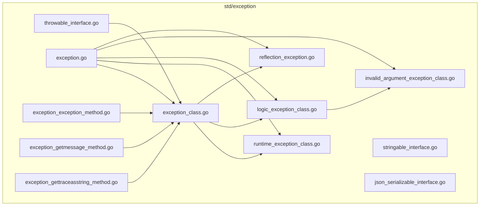
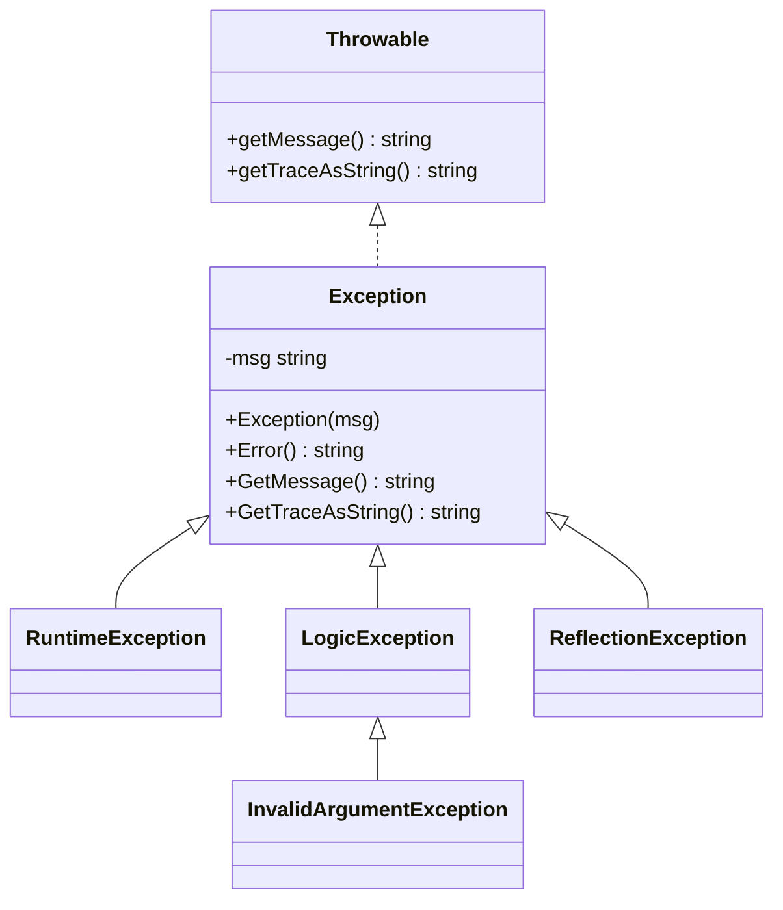
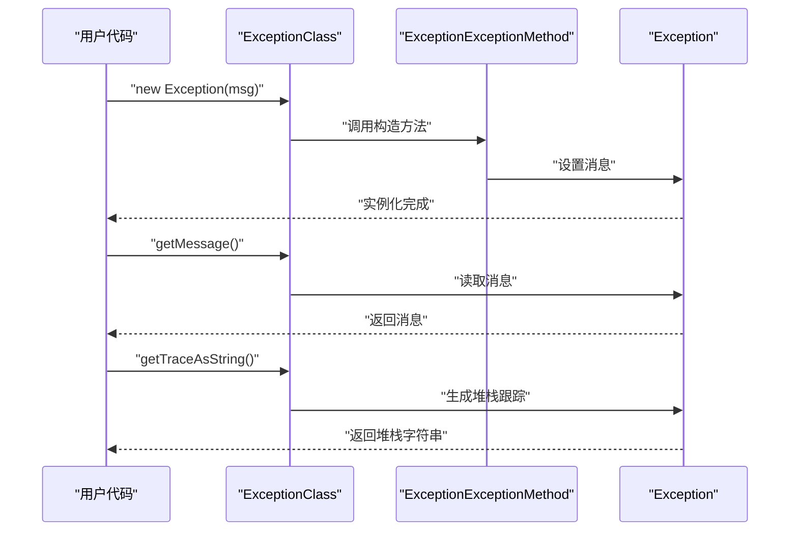
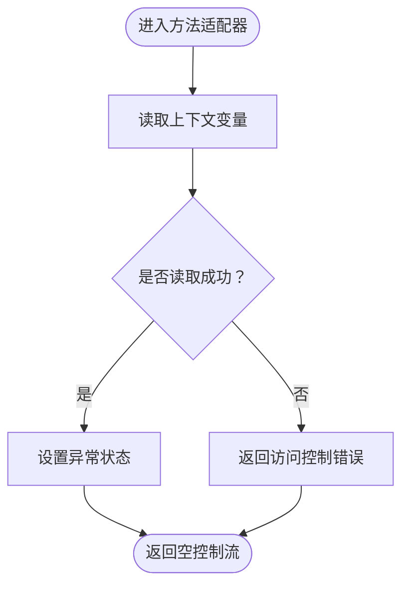
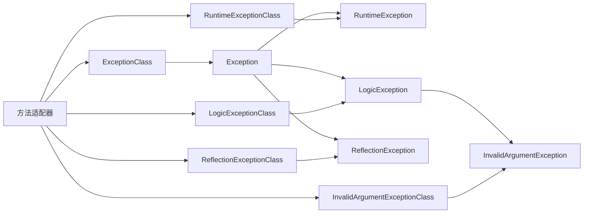

# 异常模块

<cite>
**本文引用的文件**
- [std/exception/throwable_interface.go](file://std/exception/throwable_interface.go)
- [std/exception/exception_class.go](file://std/exception/exception_class.go)
- [std/exception/exception.go](file://std/exception/exception.go)
- [std/exception/runtime_exception_class.go](file://std/exception/runtime_exception_class.go)
- [std/exception/logic_exception_class.go](file://std/exception/logic_exception_class.go)
- [std/exception/invalid_argument_exception_class.go](file://std/exception/invalid_argument_exception_class.go)
- [std/exception/reflection_exception.go](file://std/exception/reflection_exception.go)
- [std/exception/exception_exception_method.go](file://std/exception/exception_exception_method.go)
- [std/exception/exception_getmessage_method.go](file://std/exception/exception_getmessage_method.go)
- [std/exception/exception_gettraceasstring_method.go](file://std/exception/exception_gettraceasstring_method.go)
- [std/exception/stringable_interface.go](file://std/exception/stringable_interface.go)
- [std/exception/json_serializable_interface.go](file://std/exception/json_serializable_interface.go)
- [docs/std/exception.zy](file://docs/std/exception.zy)
- [tests/basic/try.zy](file://tests/basic/try.zy)
- [tests/basic/try_finally.zy](file://tests/basic/try_finally.zy)
- [examples/http/http.zy](file://examples/http/http.zy)
</cite>

## 目录
1. [简介](#简介)
2. [项目结构](#项目结构)
3. [核心组件](#核心组件)
4. [架构总览](#架构总览)
5. [详细组件分析](#详细组件分析)
6. [依赖分析](#依赖分析)
7. [性能考虑](#性能考虑)
8. [故障排查指南](#故障排查指南)
9. [结论](#结论)
10. [附录](#附录)

## 简介
本文件系统性梳理异常模块的设计与实现，覆盖以下主题：
- Throwable 接口与 Exception 类的设计理念与使用方法
- 内置异常类型：RuntimeException、LogicException、InvalidArgumentException、ReflectionException 的用途与层次关系
- 自定义异常的创建与抛出机制
- 异常链、错误消息格式化、堆栈跟踪的实现现状与扩展点
- 异常处理最佳实践：捕获策略、错误恢复、日志记录
- 与 PHP 异常系统的对比与迁移建议

## 项目结构
异常模块位于标准库目录 std/exception 下，采用“按类型分文件”的组织方式，每个异常类型与相关方法分别独立文件管理；同时提供接口定义文件以支持类型提示与 instanceof 判断。

图表来源
- [std/exception/throwable_interface.go:1-20](file://std/exception/throwable_interface.go#L1-L20)
- [std/exception/exception_class.go:1-93](file://std/exception/exception_class.go#L1-L93)
- [std/exception/exception.go:1-23](file://std/exception/exception.go#L1-L23)
- [std/exception/runtime_exception_class.go:1-92](file://std/exception/runtime_exception_class.go#L1-L92)
- [std/exception/logic_exception_class.go:1-92](file://std/exception/logic_exception_class.go#L1-L92)
- [std/exception/invalid_argument_exception_class.go:1-92](file://std/exception/invalid_argument_exception_class.go#L1-L92)
- [std/exception/reflection_exception.go:1-90](file://std/exception/reflection_exception.go#L1-L90)
- [std/exception/exception_exception_method.go:1-50](file://std/exception/exception_exception_method.go#L1-L50)
- [std/exception/exception_getmessage_method.go:1-39](file://std/exception/exception_getmessage_method.go#L1-L39)
- [std/exception/exception_gettraceasstring_method.go:1-39](file://std/exception/exception_gettraceasstring_method.go#L1-L39)

章节来源
- [std/exception/throwable_interface.go:1-20](file://std/exception/throwable_interface.go#L1-L20)
- [std/exception/exception_class.go:1-93](file://std/exception/exception_class.go#L1-L93)
- [std/exception/exception.go:1-23](file://std/exception/exception.go#L1-L23)
- [std/exception/runtime_exception_class.go:1-92](file://std/exception/runtime_exception_class.go#L1-L92)
- [std/exception/logic_exception_class.go:1-92](file://std/exception/logic_exception_class.go#L1-L92)
- [std/exception/invalid_argument_exception_class.go:1-92](file://std/exception/invalid_argument_exception_class.go#L1-L92)
- [std/exception/reflection_exception.go:1-90](file://std/exception/reflection_exception.go#L1-L90)
- [std/exception/exception_exception_method.go:1-50](file://std/exception/exception_exception_method.go#L1-L50)
- [std/exception/exception_getmessage_method.go:1-39](file://std/exception/exception_getmessage_method.go#L1-L39)
- [std/exception/exception_gettraceasstring_method.go:1-39](file://std/exception/exception_gettraceasstring_method.go#L1-L39)

## 核心组件
- Throwable 接口：提供类型提示与 instanceof 判断能力，声明最少必要方法集，与 Exception 实现对齐。
- Exception 类：作为所有异常的基类，提供构造、错误消息与堆栈跟踪的基本能力。
- 内置异常族：RuntimeException、LogicException、InvalidArgumentException、ReflectionException，形成清晰的语义分层。
- 方法适配器：为每个异常类注入构造、getMessage、getTraceAsString 等方法，统一调用入口。
- 辅助接口：Stringable、JsonSerializable，用于字符串化与序列化场景的类型约束。

章节来源
- [std/exception/throwable_interface.go:8-19](file://std/exception/throwable_interface.go#L8-L19)
- [std/exception/exception.go:3-23](file://std/exception/exception.go#L3-L23)
- [std/exception/exception_class.go:9-93](file://std/exception/exception_class.go#L9-L93)
- [std/exception/runtime_exception_class.go:9-92](file://std/exception/runtime_exception_class.go#L9-L92)
- [std/exception/logic_exception_class.go:9-92](file://std/exception/logic_exception_class.go#L9-L92)
- [std/exception/invalid_argument_exception_class.go:9-92](file://std/exception/invalid_argument_exception_class.go#L9-L92)
- [std/exception/reflection_exception.go:9-90](file://std/exception/reflection_exception.go#L9-L90)
- [std/exception/stringable_interface.go:8-17](file://std/exception/stringable_interface.go#L8-L17)
- [std/exception/json_serializable_interface.go:8-17](file://std/exception/json_serializable_interface.go#L8-L17)

## 架构总览
异常模块采用“类 + 方法适配器 + 接口声明”的组合式设计：
- 类负责状态与行为（如消息与堆栈），方法适配器负责参数解析与调用转发。
- 接口文件提供类型提示与 instanceof 支持，确保与 PHP 侧语义一致。
- 异常类之间通过继承关系建立层次，便于按语义分类捕获与处理。

图表来源
- [std/exception/throwable_interface.go:11-18](file://std/exception/throwable_interface.go#L11-L18)
- [std/exception/exception.go:3-23](file://std/exception/exception.go#L3-L23)
- [std/exception/runtime_exception_class.go:20-26](file://std/exception/runtime_exception_class.go#L20-L26)
- [std/exception/logic_exception_class.go:20-26](file://std/exception/logic_exception_class.go#L20-L26)
- [std/exception/invalid_argument_exception_class.go:20-26](file://std/exception/invalid_argument_exception_class.go#L20-L26)
- [std/exception/reflection_exception.go:11-16](file://std/exception/reflection_exception.go#L11-L16)

## 详细组件分析

### Throwable 接口
- 设计目标：提供类型提示与 instanceof 判断，方法集合与 Exception 实现保持一致，降低桥接成本。
- 关键方法：getMessage、getTraceAsString。
- 使用建议：在 catch(\Throwable) 或类型注解中使用，确保捕获所有异常类型。

章节来源
- [std/exception/throwable_interface.go:8-19](file://std/exception/throwable_interface.go#L8-L19)

### Exception 基类
- 职责：封装错误消息与堆栈跟踪，提供构造与访问方法。
- 方法适配器：构造方法、getMessage、getTraceAsString 由对应方法适配器注入。
- 行为特征：构造时接收消息；getMessage 返回消息；getTraceAsString 提供简单堆栈文本。

图表来源
- [std/exception/exception_class.go:9-93](file://std/exception/exception_class.go#L9-L93)
- [std/exception/exception_exception_method.go:12-20](file://std/exception/exception_exception_method.go#L12-L20)
- [std/exception/exception_getmessage_method.go:11-13](file://std/exception/exception_getmessage_method.go#L11-L13)
- [std/exception/exception_gettraceasstring_method.go:11-13](file://std/exception/exception_gettraceasstring_method.go#L11-L13)
- [std/exception/exception.go:7-23](file://std/exception/exception.go#L7-L23)

章节来源
- [std/exception/exception.go:3-23](file://std/exception/exception.go#L3-L23)
- [std/exception/exception_class.go:9-93](file://std/exception/exception_class.go#L9-L93)
- [std/exception/exception_exception_method.go:12-20](file://std/exception/exception_exception_method.go#L12-L20)
- [std/exception/exception_getmessage_method.go:11-13](file://std/exception/exception_getmessage_method.go#L11-L13)
- [std/exception/exception_gettraceasstring_method.go:11-13](file://std/exception/exception_gettraceasstring_method.go#L11-L13)

### 内置异常类型

#### RuntimeException
- 语义：运行时异常，通常表示程序执行期的非预期错误。
- 继承关系：Exception -> RuntimeException。
- 使用建议：用于通用运行时错误场景，避免过度细分。

章节来源
- [std/exception/runtime_exception_class.go:9-92](file://std/exception/runtime_exception_class.go#L9-L92)

#### LogicException
- 语义：逻辑异常，表示调用方违反了前置条件或契约。
- 继承关系：Exception -> LogicException。
- 使用建议：用于业务规则或前置条件检查失败的场景。

章节来源
- [std/exception/logic_exception_class.go:9-92](file://std/exception/logic_exception_class.go#L9-L92)

#### InvalidArgumentException
- 语义：参数非法异常，属于 LogicException 的子类。
- 继承关系：Exception -> LogicException -> InvalidArgumentException。
- 使用建议：当输入参数不符合要求时抛出，便于快速定位调用方问题。

章节来源
- [std/exception/invalid_argument_exception_class.go:9-92](file://std/exception/invalid_argument_exception_class.go#L9-L92)

#### ReflectionException
- 语义：反射相关异常，继承 Exception 并实现 Throwable。
- 继承关系：Exception -> ReflectionException。
- 特殊点：IsThrow 返回 true，表明该异常可直接触发抛出流程。

章节来源
- [std/exception/reflection_exception.go:9-90](file://std/exception/reflection_exception.go#L9-L90)

### 方法适配器与调用链
- 构造方法适配器：从上下文变量中提取参数，设置到 Exception 实例。
- 访问方法适配器：读取 Exception 实例的状态并返回结果。
- 参数与变量：适配器定义了参数列表与局部变量，保证调用一致性。

图表来源
- [std/exception/exception_exception_method.go:12-20](file://std/exception/exception_exception_method.go#L12-L20)

章节来源
- [std/exception/exception_exception_method.go:12-20](file://std/exception/exception_exception_method.go#L12-L20)
- [std/exception/exception_getmessage_method.go:11-13](file://std/exception/exception_getmessage_method.go#L11-L13)
- [std/exception/exception_gettraceasstring_method.go:11-13](file://std/exception/exception_gettraceasstring_method.go#L11-L13)

### 自定义异常的创建与抛出机制
- 创建步骤：定义新类，注入构造、getMessage、getTraceAsString 方法；声明继承关系；在构造中初始化消息。
- 抛出流程：通过语言运行时的抛出机制触发异常对象；捕获端根据类型进行分支处理。
- 示例参考：测试与示例中展示了 try/catch 与抛出的使用模式。

章节来源
- [std/exception/exception_class.go:9-93](file://std/exception/exception_class.go#L9-L93)
- [tests/basic/try.zy:3-4](file://tests/basic/try.zy#L3-L4)
- [tests/basic/try_finally.zy:24-26](file://tests/basic/try_finally.zy#L24-L26)
- [examples/http/http.zy:216-216](file://examples/http/http.zy#L216-L216)

### 异常链、错误消息格式化与堆栈跟踪
- 异常链：当前实现未展示多层异常链，但可通过在构造函数中保存前序异常引用的方式扩展。
- 错误消息格式化：消息以字符串形式存储，可在构造阶段进行模板化或参数化。
- 堆栈跟踪：提供 getTraceAsString 方法，当前返回固定格式文本，可扩展为真实调用栈收集。

章节来源
- [std/exception/exception.go:19-22](file://std/exception/exception.go#L19-L22)
- [std/exception/exception_gettraceasstring_method.go:11-13](file://std/exception/exception_gettraceasstring_method.go#L11-L13)

### 与 PHP 异常系统的对比与迁移指南
- 接口与类映射：Throwable、Exception 及其子类在语义上与 PHP 对应类型一致。
- 方法差异：当前实现精简了方法签名，后续可按需补充更多方法以贴近 PHP。
- 迁移建议：
  - 将 catch(\Throwable) 替换为对 Throwable 接口的捕获。
  - 将业务异常从 RuntimeException 迁移到 LogicException/InvalidArgumentException。
  - 在需要反射错误时使用 ReflectionException。
  - 逐步引入更丰富的堆栈跟踪与异常链能力。

章节来源
- [std/exception/throwable_interface.go:8-19](file://std/exception/throwable_interface.go#L8-L19)
- [std/exception/reflection_exception.go:9-90](file://std/exception/reflection_exception.go#L9-L90)
- [docs/std/exception.zy:10-35](file://docs/std/exception.zy#L10-L35)

## 依赖分析
- 组件内聚：异常类与其方法适配器紧密耦合，职责清晰。
- 外部依赖：接口定义依赖节点与数据模型，类实现依赖运行时上下文。
- 继承关系：Exception 为根类，其他异常类通过继承获得统一能力。

图表来源
- [std/exception/exception_class.go:9-93](file://std/exception/exception_class.go#L9-L93)
- [std/exception/runtime_exception_class.go:9-92](file://std/exception/runtime_exception_class.go#L9-L92)
- [std/exception/logic_exception_class.go:9-92](file://std/exception/logic_exception_class.go#L9-L92)
- [std/exception/invalid_argument_exception_class.go:9-92](file://std/exception/invalid_argument_exception_class.go#L9-L92)
- [std/exception/reflection_exception.go:18-26](file://std/exception/reflection_exception.go#L18-L26)
- [std/exception/exception_exception_method.go:8-10](file://std/exception/exception_exception_method.go#L8-L10)
- [std/exception/exception_getmessage_method.go:7-9](file://std/exception/exception_getmessage_method.go#L7-L9)
- [std/exception/exception_gettraceasstring_method.go:7-9](file://std/exception/exception_gettraceasstring_method.go#L7-L9)

章节来源
- [std/exception/exception_class.go:9-93](file://std/exception/exception_class.go#L9-L93)
- [std/exception/runtime_exception_class.go:9-92](file://std/exception/runtime_exception_class.go#L9-L92)
- [std/exception/logic_exception_class.go:9-92](file://std/exception/logic_exception_class.go#L9-L92)
- [std/exception/invalid_argument_exception_class.go:9-92](file://std/exception/invalid_argument_exception_class.go#L9-L92)
- [std/exception/reflection_exception.go:18-26](file://std/exception/reflection_exception.go#L18-L26)
- [std/exception/exception_exception_method.go:8-10](file://std/exception/exception_exception_method.go#L8-L10)
- [std/exception/exception_getmessage_method.go:7-9](file://std/exception/exception_getmessage_method.go#L7-L9)
- [std/exception/exception_gettraceasstring_method.go:7-9](file://std/exception/exception_gettraceasstring_method.go#L7-L9)

## 性能考虑
- 方法适配器开销：参数读取与类型转换存在少量运行时开销，建议在高频路径减少不必要的异常抛出。
- 堆栈跟踪成本：生成堆栈跟踪会带来额外内存与 CPU 开销，仅在需要时启用详细跟踪。
- 建议：在生产环境默认关闭详细堆栈跟踪，仅在调试或错误上报时开启。

## 故障排查指南
- 捕获范围过宽：使用 Throwable 捕获时，注意区分逻辑异常与运行时异常，避免吞掉关键错误。
- 堆栈跟踪为空：确认调用链是否正确传递异常对象，避免在中间层吞掉异常。
- 日志记录：结合日志模块记录异常消息与堆栈，便于定位问题。

章节来源
- [std/exception/exception_gettraceasstring_method.go:11-13](file://std/exception/exception_gettraceasstring_method.go#L11-L13)
- [tests/basic/try.zy:3-4](file://tests/basic/try.zy#L3-L4)
- [tests/basic/try_finally.zy:24-26](file://tests/basic/try_finally.zy#L24-L26)

## 结论
异常模块以 Throwable 接口与 Exception 基类为核心，通过方法适配器与继承体系构建了清晰的异常层次。当前实现聚焦于最小可用能力，后续可围绕异常链、堆栈跟踪与序列化等方面进一步完善，以满足更复杂的错误处理需求。

## 附录
- 伪代码接口参考：用于理解 API 形态与方法签名。
- 测试与示例：展示 try/catch 与抛出的典型用法。

章节来源
- [docs/std/exception.zy:10-35](file://docs/std/exception.zy#L10-L35)
- [tests/basic/try.zy:3-4](file://tests/basic/try.zy#L3-L4)
- [tests/basic/try_finally.zy:24-26](file://tests/basic/try_finally.zy#L24-L26)
- [examples/http/http.zy:216-216](file://examples/http/http.zy#L216-L216)