# 循环模块

<cite>
**本文引用的文件**
- [list_class.go](file://std/loop/list_class.go)
- [list_methods.go](file://std/loop/list_methods.go)
- [hashmap_class.go](file://std/loop/hashmap_class.go)
- [hashmap_methods.go](file://std/loop/hashmap_methods.go)
- [iterator_aggregate_interface.go](file://std/loop/iterator_aggregate_interface.go)
- [value_array_sort.go](file://data/value_array_sort.go)
- [value_array_filter.go](file://data/value_array_filter.go)
- [value_array_map.go](file://data/value_array_map.go)
- [value_array_for_each.go](file://data/value_array_for_each.go)
- [array_map.go](file://std/php/array/array_map.go)
- [array_reduce.go](file://std/php/array/array_reduce.go)
- [array_filter.go](file://std/php/core/array_filter.go)
</cite>

## 目录
1. [简介](#简介)
2. [项目结构](#项目结构)
3. [核心组件](#核心组件)
4. [架构总览](#架构总览)
5. [详细组件分析](#详细组件分析)
6. [依赖分析](#依赖分析)
7. [性能考虑](#性能考虑)
8. [故障排查指南](#故障排查指南)
9. [结论](#结论)
10. [附录](#附录)

## 简介
本文件聚焦循环模块中的数据结构与算法实现，系统性介绍 List 类与 HashMap 类的使用方法、内部实现细节（如动态数组扩容机制、哈希表冲突策略）、迭代器接口与 foreach 支持、常见算法（排序、搜索、过滤、映射、归约）以及与 PHP 数组系统的兼容性与差异。文档同时提供性能特征分析与内存优化建议，帮助读者在不同场景下做出合理选择。

## 项目结构
循环模块位于 std/loop 目录，围绕 List 与 HashMap 两类容器展开，分别提供面向索引的动态数组与面向键值的哈希表能力，并通过 Iterator 接口实现 foreach 支持。数据层算法（排序、过滤、映射、遍历）分布在 data 与 std/php/array、std/php/core 等目录中，形成“容器 + 算法”的协同体系。

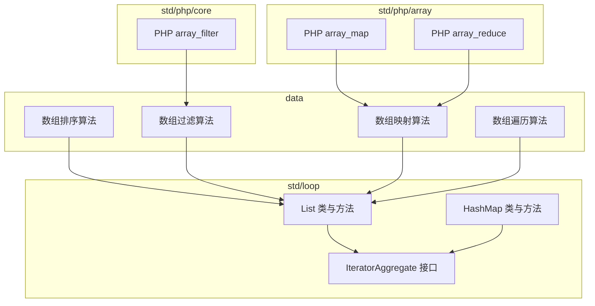

**图示来源**
- [list_class.go:1-324](file://std/loop/list_class.go#L1-L324)
- [hashmap_class.go:1-331](file://std/loop/hashmap_class.go#L1-L331)
- [iterator_aggregate_interface.go:1-18](file://std/loop/iterator_aggregate_interface.go#L1-L18)
- [value_array_sort.go:1-55](file://data/value_array_sort.go#L1-L55)
- [value_array_filter.go:1-95](file://data/value_array_filter.go#L1-L95)
- [value_array_map.go:1-90](file://data/value_array_map.go#L1-L90)
- [value_array_for_each.go:1-80](file://data/value_array_for_each.go#L1-L80)
- [array_map.go:1-136](file://std/php/array/array_map.go#L1-L136)
- [array_reduce.go:1-108](file://std/php/array/array_reduce.go#L1-L108)
- [array_filter.go:1-356](file://std/php/core/array_filter.go#L1-L356)

**章节来源**
- [list_class.go:1-324](file://std/loop/list_class.go#L1-L324)
- [hashmap_class.go:1-331](file://std/loop/hashmap_class.go#L1-L331)
- [iterator_aggregate_interface.go:1-18](file://std/loop/iterator_aggregate_interface.go#L1-L18)

## 核心组件
- List 动态数组
  - 提供 add、get、set、remove、removeAt、clear、contains、indexOf、isEmpty、toArray、size 等基本操作。
  - 通过 Iterator 接口支持 current、key、next、rewind、valid，从而支持 foreach。
  - 泛型支持：构造时可指定元素类型，运行时进行类型检查。
- HashMap 哈希表
  - 提供 put、get、remove、containsKey、containsValue、keys、values、size、isEmpty、clear 等基本操作。
  - 通过 Iterator 接口支持 foreach，键序由内部维护的 keys 切片保证稳定遍历。
  - 泛型支持：构造时可指定键类型与值类型，运行时进行类型检查。
- 迭代器接口
  - List 与 HashMap 均实现 Iterator 接口，具备统一的遍历协议。
  - IteratorAggregate 接口定义了 getIterator 方法，便于语言级集成。

**章节来源**
- [list_class.go:7-140](file://std/loop/list_class.go#L7-L140)
- [hashmap_class.go:7-147](file://std/loop/hashmap_class.go#L7-L147)
- [iterator_aggregate_interface.go:8-17](file://std/loop/iterator_aggregate_interface.go#L8-L17)

## 架构总览
List 与 HashMap 作为容器，向上提供统一的迭代器接口，向下通过方法类（ListClass、HashMapClass）绑定具体方法实现。数据层算法（排序、过滤、映射、遍历）既可直接作用于底层数组值，也可通过 PHP 内置函数桥接至容器能力。

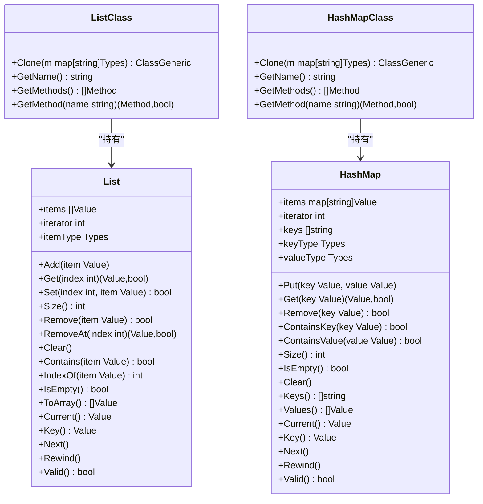

**图示来源**
- [list_class.go:8-324](file://std/loop/list_class.go#L8-L324)
- [hashmap_class.go:8-331](file://std/loop/hashmap_class.go#L8-L331)

## 详细组件分析

### List 类与方法
- 数据结构
  - items：存储元素的切片，支持动态增长。
  - iterator：当前遍历位置。
  - itemType：元素类型约束（泛型）。
- 关键方法
  - add：追加元素到末尾。
  - get/set：按索引访问与修改。
  - remove/removeAt：按值或索引删除。
  - contains/indexOf：线性扫描判断存在与定位。
  - toArray：复制当前内容为新数组。
  - size/isEmpty/clear：统计与清空。
- 迭代器实现
  - current/key/next/rewind/valid：基于 iterator 的顺序遍历。
- 泛型与类型检查
  - 构造时可指定元素类型；方法调用时对传入值进行类型检查，不匹配则抛错。

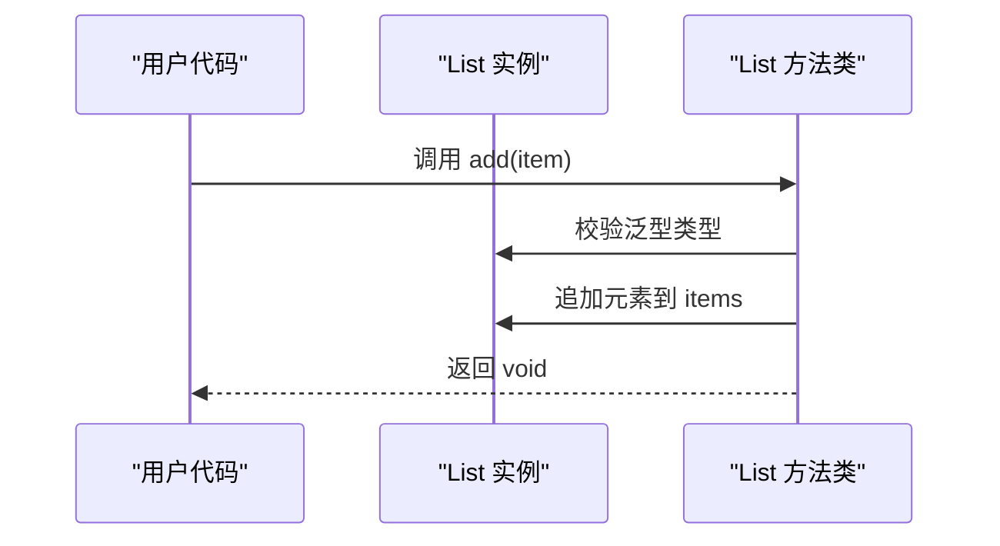

**图示来源**
- [list_methods.go:78-98](file://std/loop/list_methods.go#L78-L98)
- [list_class.go:24-26](file://std/loop/list_class.go#L24-L26)

**章节来源**
- [list_class.go:8-140](file://std/loop/list_class.go#L8-L140)
- [list_methods.go:45-98](file://std/loop/list_methods.go#L45-L98)

### HashMap 类与方法
- 数据结构
  - items：键到值的映射（字符串键）。
  - keys：维护插入顺序的键序列。
  - iterator：当前遍历位置。
  - keyType/valueType：键与值的类型约束（泛型）。
- 关键方法
  - put：新增或更新键值对；若新键则追加到 keys。
  - get/remove/containsKey/containsValue：基于映射与 keys 的查询与删除。
  - keys/values：返回键数组与值数组。
  - size/isEmpty/clear：统计与清空。
- 迭代器实现
  - current：返回当前键对应值。
  - key：返回当前键（以字符串形式包装）。
  - next/rewind/valid：顺序推进与边界检查。
- 泛型与类型检查
  - 构造时可指定键类型与值类型；方法调用时对传入键与值进行类型检查，不匹配则抛错。

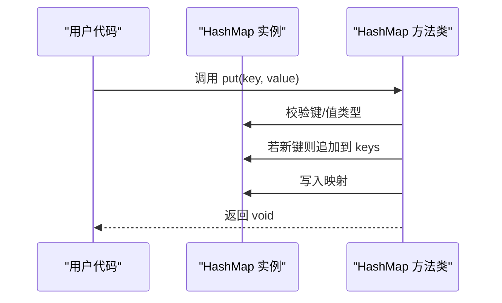

**图示来源**
- [hashmap_methods.go:80-109](file://std/loop/hashmap_methods.go#L80-L109)
- [hashmap_class.go:28-34](file://std/loop/hashmap_class.go#L28-L34)

**章节来源**
- [hashmap_class.go:7-147](file://std/loop/hashmap_class.go#L7-L147)
- [hashmap_methods.go:45-109](file://std/loop/hashmap_methods.go#L45-L109)

### 迭代器接口与 foreach 支持
- List 与 HashMap 均实现 Iterator 接口，提供统一的遍历协议。
- foreach 语义由语言层解析后调用 current/key/next/rewind/valid 实现。
- IteratorAggregate 接口定义 getIterator 方法，便于语言级集成。

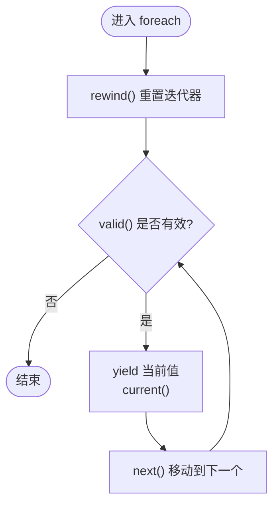

**图示来源**
- [list_class.go:110-140](file://std/loop/list_class.go#L110-L140)
- [hashmap_class.go:112-147](file://std/loop/hashmap_class.go#L112-L147)
- [iterator_aggregate_interface.go:8-17](file://std/loop/iterator_aggregate_interface.go#L8-L17)

**章节来源**
- [list_class.go:109-140](file://std/loop/list_class.go#L109-L140)
- [hashmap_class.go:112-147](file://std/loop/hashmap_class.go#L112-L147)
- [iterator_aggregate_interface.go:8-17](file://std/loop/iterator_aggregate_interface.go#L8-L17)

### 常用算法实现与示例

#### 排序
- List 容器
  - 通过 toArray 获取底层数组，再调用 data 层排序算法进行就地排序。
- data 层排序
  - 基于字符串比较的排序实现，返回排序后的数组。
- PHP 内置函数
  - array_map：多数组并行映射，按最短数组长度处理。

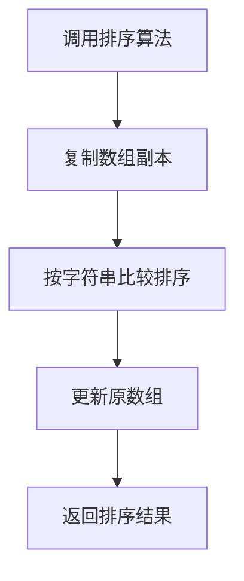

**图示来源**
- [value_array_sort.go:11-30](file://data/value_array_sort.go#L11-L30)
- [array_map.go:52-61](file://std/php/array/array_map.go#L52-L61)

**章节来源**
- [value_array_sort.go:1-55](file://data/value_array_sort.go#L1-L55)
- [array_map.go:1-136](file://std/php/array/array_map.go#L1-L136)

#### 过滤
- List 容器
  - 通过 data 层过滤算法，支持回调函数与 truthy 语义。
- PHP 内置函数
  - array_filter：支持三种模式（仅值、仅键、值与键），并可解析多种回调形式。

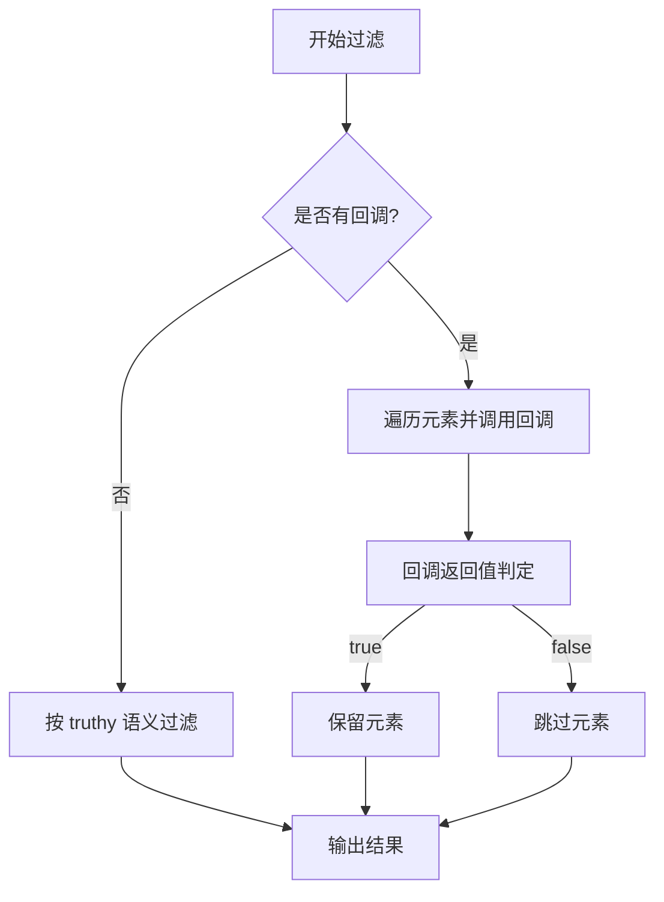

**图示来源**
- [value_array_filter.go:9-65](file://data/value_array_filter.go#L9-L65)
- [array_filter.go:58-204](file://std/php/core/array_filter.go#L58-L204)

**章节来源**
- [value_array_filter.go:1-95](file://data/value_array_filter.go#L1-L95)
- [array_filter.go:1-356](file://std/php/core/array_filter.go#L1-L356)

#### 映射
- List 容器
  - 通过 data 层映射算法，对每个元素调用回调并生成新数组。
- PHP 内置函数
  - array_map：支持多数组并行映射，按最短长度处理。

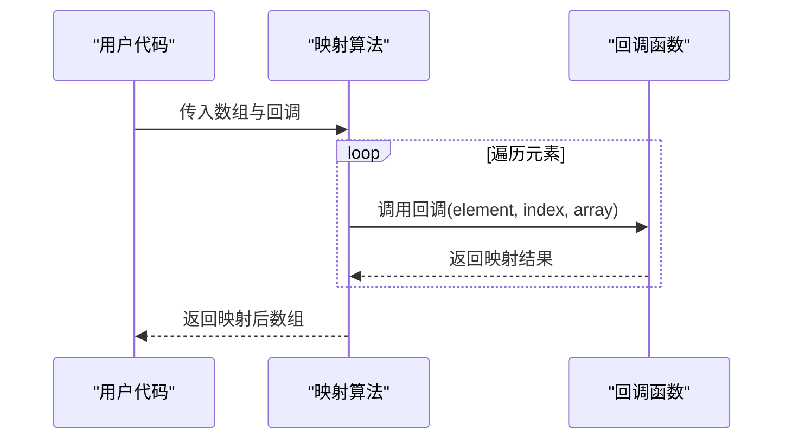

**图示来源**
- [value_array_map.go:11-61](file://data/value_array_map.go#L11-L61)
- [array_map.go:65-114](file://std/php/array/array_map.go#L65-L114)

**章节来源**
- [value_array_map.go:1-90](file://data/value_array_map.go#L1-L90)
- [array_map.go:1-136](file://std/php/array/array_map.go#L1-L136)

#### 遍历
- List 容器
  - 通过 data 层遍历算法，对每个元素调用回调（无返回值）。
- foreach
  - 通过 Iterator 接口逐个消费元素，适合惰性处理。

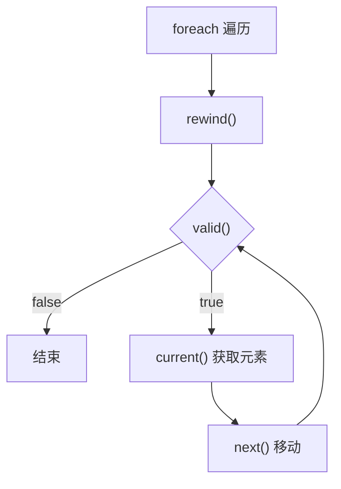

**图示来源**
- [value_array_for_each.go:9-51](file://data/value_array_for_each.go#L9-L51)
- [list_class.go:127-140](file://std/loop/list_class.go#L127-L140)

**章节来源**
- [value_array_for_each.go:1-80](file://data/value_array_for_each.go#L1-L80)
- [list_class.go:109-140](file://std/loop/list_class.go#L109-L140)

#### 归约
- PHP 内置函数
  - array_reduce：对数组元素依次应用回调，累积返回最终结果；支持初始值。

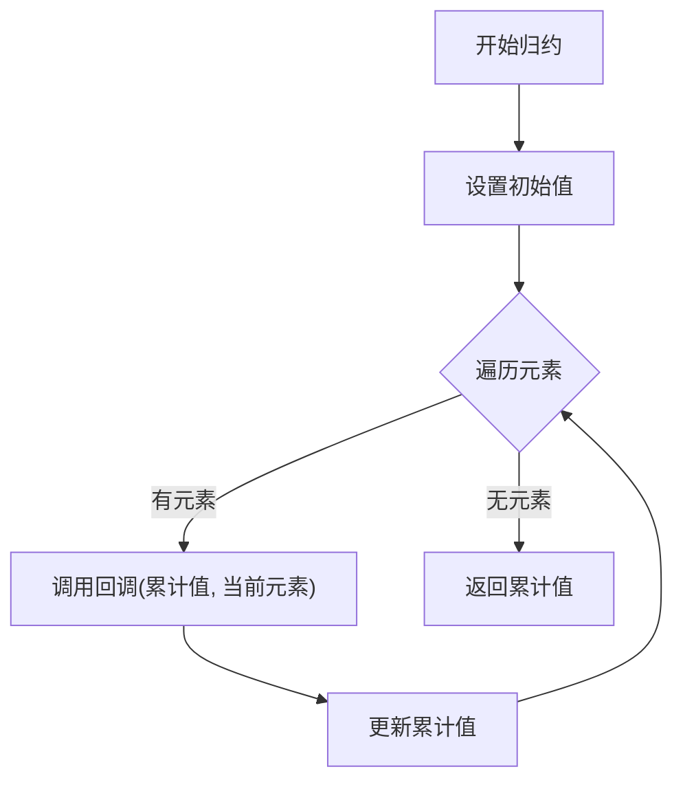

**图示来源**
- [array_reduce.go:17-88](file://std/php/array/array_reduce.go#L17-L88)

**章节来源**
- [array_reduce.go:1-108](file://std/php/array/array_reduce.go#L1-L108)

### 内部实现细节

#### 动态数组扩容机制
- List 底层使用切片存储元素，Go 切片在容量不足时自动扩容，扩容策略遵循 Go 运行时的实现细节（通常为倍增或按比例增长）。由于 List 未自定义扩容逻辑，扩容行为由 Go 语言运行时决定，具有良好的平均性能与较低的摊销成本。

**章节来源**
- [list_class.go:24-26](file://std/loop/list_class.go#L24-L26)

#### 哈希表冲突解决策略
- HashMap 使用 map[string]Value 存储键值对，键在存入前转换为字符串，因此冲突来源于字符串键的哈希碰撞。Go map 的冲突处理由运行时实现，采用开放寻址或链表等策略（具体取决于运行时实现细节）。HashMap 通过 keys 切片维护稳定的插入顺序，遍历时按 keys 顺序访问映射值，保证遍历一致性。

**章节来源**
- [hashmap_class.go:28-34](file://std/loop/hashmap_class.go#L28-L34)
- [hashmap_class.go:114-147](file://std/loop/hashmap_class.go#L114-L147)

## 依赖分析
- List 与 HashMap 均依赖 data 层的类型系统与值表示（如 Value、Types、ArrayValue 等），并通过 data 层算法实现排序、过滤、映射、遍历等操作。
- PHP 内置函数（array_map、array_filter、array_reduce）与 data 层算法在回调调用约定上保持一致，便于容器与语言生态的协同。

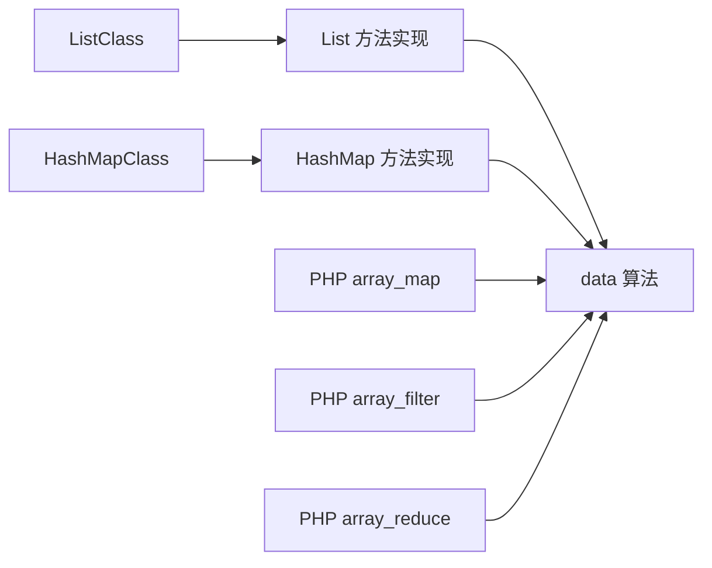

**图示来源**
- [list_methods.go:1-769](file://std/loop/list_methods.go#L1-L769)
- [hashmap_methods.go:1-720](file://std/loop/hashmap_methods.go#L1-L720)
- [array_map.go:1-136](file://std/php/array/array_map.go#L1-L136)
- [array_filter.go:1-356](file://std/php/core/array_filter.go#L1-L356)
- [array_reduce.go:1-108](file://std/php/array/array_reduce.go#L1-L108)

**章节来源**
- [list_methods.go:1-769](file://std/loop/list_methods.go#L1-L769)
- [hashmap_methods.go:1-720](file://std/loop/hashmap_methods.go#L1-L720)
- [array_map.go:1-136](file://std/php/array/array_map.go#L1-L136)
- [array_filter.go:1-356](file://std/php/core/array_filter.go#L1-L356)
- [array_reduce.go:1-108](file://std/php/array/array_reduce.go#L1-L108)

## 性能考虑
- List
  - 追加操作摊销 O(1)，随机访问 O(1)，按值删除与查找 O(n)，遍历 O(n)。
  - 由于使用 Go 切片，扩容开销被摊销，适合频繁尾部插入与顺序遍历场景。
- HashMap
  - 平均情况下 put/get/remove/contains 为 O(1)，keys/values 遍历 O(n)。
  - 键转换为字符串可能带来额外的字符串处理成本；keys 切片维护顺序，有利于稳定遍历。
- 算法
  - 排序基于字符串比较，时间复杂度 O(n log n)；过滤与映射为 O(n)。
  - PHP array_map 在多数组场景按最短长度处理，避免越界与多余计算。

[本节为通用性能讨论，无需列出具体文件来源]

## 故障排查指南
- 类型不匹配
  - List::add / List::set / HashMap::put 在运行时进行类型检查，若与泛型类型不符将抛出错误。请确认构造时的泛型参数与实际传入值类型一致。
- 索引越界
  - List::get / List::set / List::removeAt 在索引非法时返回失败或抛错。请在调用前校验索引范围。
- 键不存在
  - HashMap::get / HashMap::remove / HashMap::containsKey 在键不存在时返回失败或空值。请先使用 containsKey 检查。
- 遍历状态
  - foreach 前需确保迭代器处于有效状态；若中途修改底层集合，建议重新 rewind 或重建迭代器。

**章节来源**
- [list_methods.go:80-98](file://std/loop/list_methods.go#L80-L98)
- [list_methods.go:194-228](file://std/loop/list_methods.go#L194-L228)
- [hashmap_methods.go:80-109](file://std/loop/hashmap_methods.go#L80-L109)
- [hashmap_methods.go:144-168](file://std/loop/hashmap_methods.go#L144-L168)

## 结论
循环模块通过 List 与 HashMap 提供了高效的顺序与键值访问能力，并以统一的迭代器接口支撑 foreach 语义。配合 data 层与 PHP 内置函数的算法实现，能够覆盖常见的数据处理需求。在性能方面，List 适配顺序场景，HashMap 适配键值场景；在工程实践中，应结合业务特性选择合适的容器与算法组合，并关注类型约束与边界条件，以获得稳定可靠的运行表现。

[本节为总结性内容，无需列出具体文件来源]

## 附录

### 与 PHP 数组系统的兼容性与差异
- 兼容性
  - foreach 语义与 Iterator 接口一致，可无缝对接语言层遍历。
  - PHP array_map、array_filter、array_reduce 等函数与 data 层算法在回调调用约定上保持一致，便于跨容器使用。
- 差异
  - List 与 HashMap 为强类型容器，支持泛型约束；PHP 数组为弱类型，灵活性更高但类型安全较弱。
  - HashMap 的键在存入前转换为字符串，可能导致键的语义与 PHP 数组键不同（例如数字键的字符串化）。
  - List 的 contains/containsKey 语义基于字符串比较，而 PHP 数组的 in_array/isset 有更丰富的类型与严格模式选项。

**章节来源**
- [list_class.go:78-95](file://std/loop/list_class.go#L78-L95)
- [hashmap_class.go:37-41](file://std/loop/hashmap_class.go#L37-L41)
- [array_map.go:1-136](file://std/php/array/array_map.go#L1-L136)
- [array_filter.go:1-356](file://std/php/core/array_filter.go#L1-L356)
- [array_reduce.go:1-108](file://std/php/array/array_reduce.go#L1-L108)