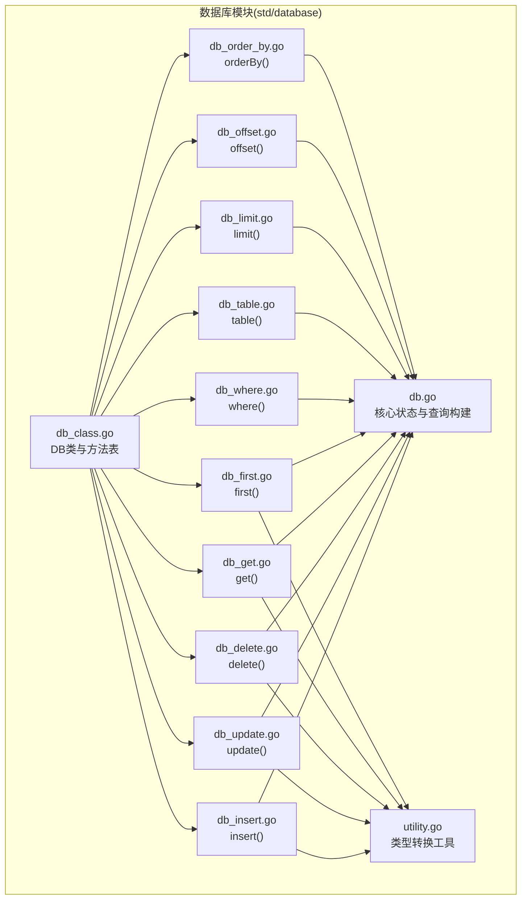
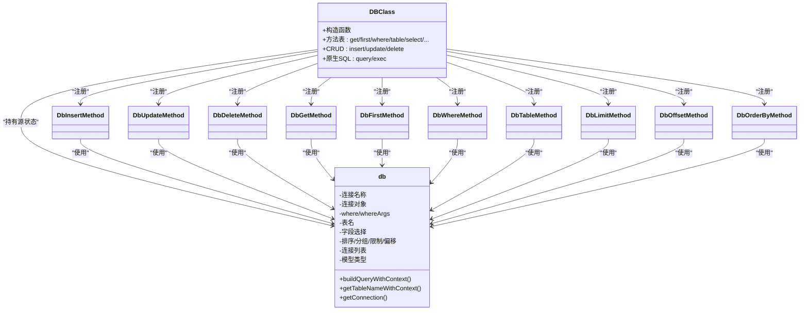
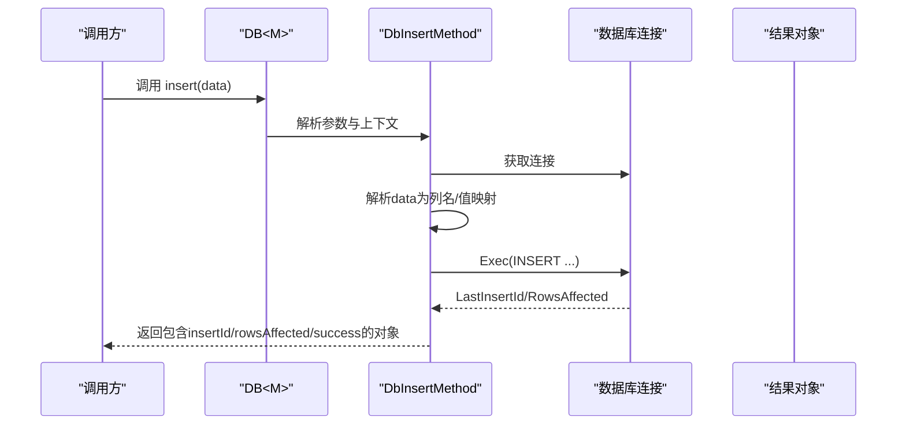
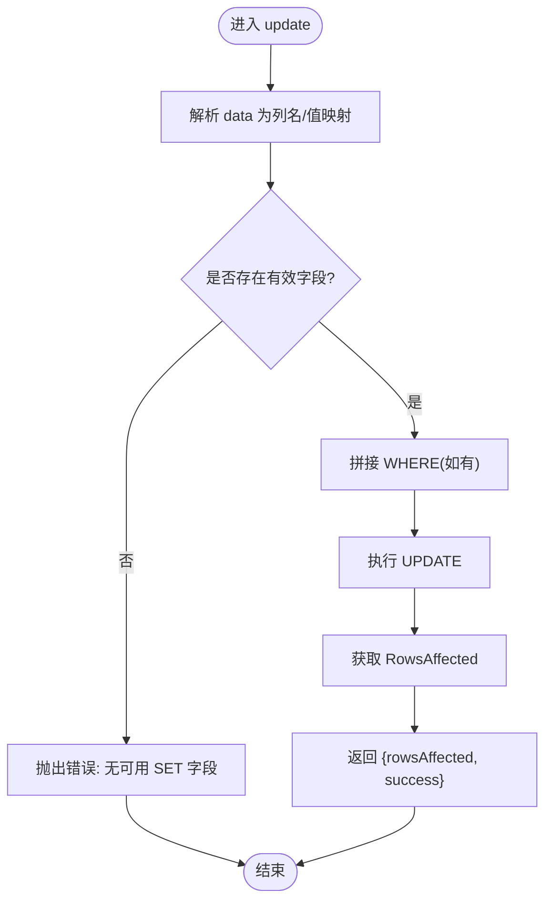
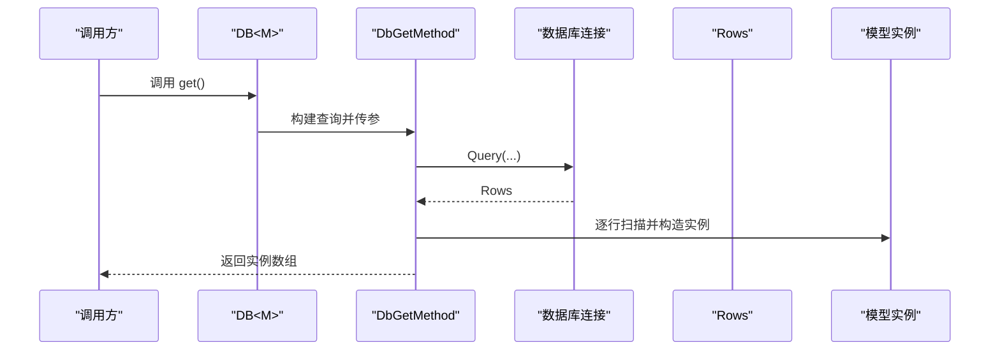
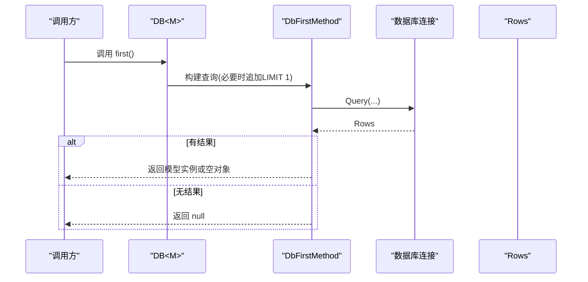
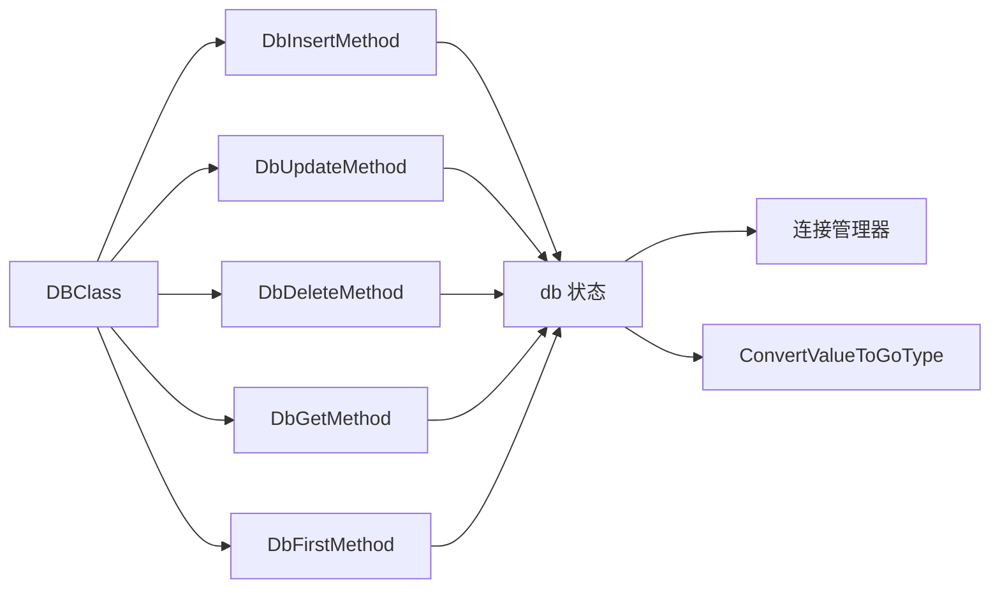

# CRUD操作

<cite>
**本文引用的文件**
- [std/database/db_class.go](file://std/database/db_class.go)
- [std/database/db_insert.go](file://std/database/db_insert.go)
- [std/database/db_update.go](file://std/database/db_update.go)
- [std/database/db_delete.go](file://std/database/db_delete.go)
- [std/database/db_get.go](file://std/database/db_get.go)
- [std/database/db_first.go](file://std/database/db_first.go)
- [std/database/db_construct.go](file://std/database/db_construct.go)
- [std/database/db_where.go](file://std/database/db_where.go)
- [std/database/db_table.go](file://std/database/db_table.go)
- [std/database/db_limit.go](file://std/database/db_limit.go)
- [std/database/db_offset.go](file://std/database/db_offset.go)
- [std/database/db_order_by.go](file://std/database/db_order_by.go)
- [std/database/db.go](file://std/database/db.go)
- [std/database/utility.go](file://std/database/utility.go)
- [examples/database/database.zy](file://examples/database/database.zy)
- [docs/database.md](file://docs/database.md)
</cite>

## 目录
1. [简介](#简介)
2. [项目结构](#项目结构)
3. [核心组件](#核心组件)
4. [架构总览](#架构总览)
5. [详细组件分析](#详细组件分析)
6. [依赖分析](#依赖分析)
7. [性能考虑](#性能考虑)
8. [故障排查指南](#故障排查指南)
9. [结论](#结论)
10. [附录](#附录)

## 简介
本文件系统化梳理数据库的增删改查（CRUD）能力，覆盖以下方法与流程：
- 插入：insert(data)
- 更新：update(data)
- 删除：delete()
- 查询集合：get()
- 查询首条：first()

同时说明参数格式（类实例、对象、数组）、数据验证与冲突处理、返回值结构、事务与批量操作、性能优化策略以及常见错误处理方式。文档结合源码与示例，帮助读者快速上手并深入理解实现细节。

## 项目结构
数据库模块位于 std/database 下，围绕一个可泛型的 DB<M> 类实现查询构建器与 CRUD 能力；各方法均以独立的 Method 结构体实现，通过 DBClass 的方法表统一暴露。

图表来源
- [std/database/db_class.go:11-168](file://std/database/db_class.go#L11-L168)
- [std/database/db_insert.go:11-171](file://std/database/db_insert.go#L11-L171)
- [std/database/db_update.go:12-175](file://std/database/db_update.go#L12-L175)
- [std/database/db_delete.go:11-86](file://std/database/db_delete.go#L11-L86)
- [std/database/db_get.go:11-122](file://std/database/db_get.go#L11-L122)
- [std/database/db_first.go:11-133](file://std/database/db_first.go#L11-L133)
- [std/database/db_where.go:10-71](file://std/database/db_where.go#L10-L71)
- [std/database/db_table.go:10-59](file://std/database/db_table.go#L10-L59)
- [std/database/db_limit.go:10-61](file://std/database/db_limit.go#L10-L61)
- [std/database/db_offset.go:10-61](file://std/database/db_offset.go#L10-L61)
- [std/database/db_order_by.go:10-59](file://std/database/db_order_by.go#L10-L59)
- [std/database/db.go:19-446](file://std/database/db.go#L19-L446)
- [std/database/utility.go:10-32](file://std/database/utility.go#L10-L32)

章节来源
- [std/database/db_class.go:11-168](file://std/database/db_class.go#L11-L168)
- [std/database/db.go:19-446](file://std/database/db.go#L19-L446)

## 核心组件
- DB<M> 类：通过泛型绑定模型类型，承载查询条件与状态，提供 get/first/insert/update/delete 等方法。
- 查询构建器：where/table/select/orderBy/groupBy/limit/offset/join 等链式方法，最终生成 SQL 并执行。
- CRUD 方法：
  - insert：支持类实例与对象两种输入，自动映射注解列名，执行 INSERT 并返回结果对象（包含插入ID与影响行数）。
  - update：支持类实例与对象，排除空值（null），生成 SET 子句，结合 where 条件执行 UPDATE。
  - delete：基于 where 条件执行 DELETE，返回影响行数。
  - get：执行查询，按模型类型扫描行并构造实例集合。
  - first：执行查询，返回第一条记录或空对象。
- 连接与注解：根据模型注解解析表名与列名，支持自定义连接名称。

章节来源
- [std/database/db_class.go:122-159](file://std/database/db_class.go#L122-L159)
- [std/database/db_insert.go:15-115](file://std/database/db_insert.go#L15-L115)
- [std/database/db_update.go:16-119](file://std/database/db_update.go#L16-L119)
- [std/database/db_delete.go:15-61](file://std/database/db_delete.go#L15-L61)
- [std/database/db_get.go:15-69](file://std/database/db_get.go#L15-L69)
- [std/database/db_first.go:16-58](file://std/database/db_first.go#L16-L58)
- [std/database/db_where.go:14-39](file://std/database/db_where.go#L14-L39)
- [std/database/db_table.go:14-30](file://std/database/db_table.go#L14-L30)
- [std/database/db_limit.go:14-32](file://std/database/db_limit.go#L14-L32)
- [std/database/db_offset.go:14-32](file://std/database/db_offset.go#L14-L32)
- [std/database/db_order_by.go:14-30](file://std/database/db_order_by.go#L14-L30)
- [std/database/db.go:267-322](file://std/database/db.go#L267-L322)
- [std/database/db.go:398-445](file://std/database/db.go#L398-L445)

## 架构总览
下图展示 DB<M> 类与各方法之间的关系，以及查询构建器如何串联条件并最终执行。

图表来源
- [std/database/db_class.go:32-85](file://std/database/db_class.go#L32-L85)
- [std/database/db.go:19-78](file://std/database/db.go#L19-L78)
- [std/database/db_insert.go:11-171](file://std/database/db_insert.go#L11-L171)
- [std/database/db_update.go:12-175](file://std/database/db_update.go#L12-L175)
- [std/database/db_delete.go:11-86](file://std/database/db_delete.go#L11-L86)
- [std/database/db_get.go:11-122](file://std/database/db_get.go#L11-L122)
- [std/database/db_first.go:11-133](file://std/database/db_first.go#L11-L133)
- [std/database/db_where.go:10-71](file://std/database/db_where.go#L10-L71)
- [std/database/db_table.go:10-59](file://std/database/db_table.go#L10-L59)
- [std/database/db_limit.go:10-61](file://std/database/db_limit.go#L10-L61)
- [std/database/db_offset.go:10-61](file://std/database/db_offset.go#L10-L61)
- [std/database/db_order_by.go:10-59](file://std/database/db_order_by.go#L10-L59)

## 详细组件分析

### 插入 insert(data)
- 输入支持
  - 类实例：读取属性并通过注解映射列名，空值（null/空串/零/false）按策略处理。
  - 对象：直接遍历属性，映射为列名与值。
- SQL 构建
  - 动态拼接列名与占位符，生成 INSERT 语句。
- 执行与返回
  - 执行后获取最后插入ID与影响行数，封装为对象返回。
- 参数与返回类型
  - 参数：data（对象或类实例）
  - 返回：包含 insertId、rowsAffected、success 的对象

图表来源
- [std/database/db_insert.go:15-115](file://std/database/db_insert.go#L15-L115)
- [std/database/db.go:267-322](file://std/database/db.go#L267-L322)
- [std/database/utility.go:10-32](file://std/database/utility.go#L10-L32)

章节来源
- [std/database/db_insert.go:15-115](file://std/database/db_insert.go#L15-L115)
- [std/database/db_insert.go:145-171](file://std/database/db_insert.go#L145-L171)
- [std/database/db.go:398-445](file://std/database/db.go#L398-L445)

### 更新 update(data)
- 输入支持
  - 类实例或对象；排除空值（null），允许 0/false/空串等写入。
- SQL 构建
  - 生成 SET 子句；若无有效字段则报错。
  - 若存在 where 条件，追加 WHERE 与参数。
- 执行与返回
  - 返回影响行数与 success 标记。

图表来源
- [std/database/db_update.go:16-119](file://std/database/db_update.go#L16-L119)
- [std/database/db_where.go:14-39](file://std/database/db_where.go#L14-L39)

章节来源
- [std/database/db_update.go:16-119](file://std/database/db_update.go#L16-L119)
- [std/database/db_update.go:149-175](file://std/database/db_update.go#L149-L175)

### 删除 delete()
- 条件
  - 基于已设置的 where 条件生成 DELETE 语句。
- 执行与返回
  - 返回影响行数与 success 标记。

章节来源
- [std/database/db_delete.go:15-61](file://std/database/db_delete.go#L15-L61)

### 查询集合 get()
- 流程
  - 构建完整查询（含 select/where/groupBy/orderBy/limit/offset/join）。
  - 执行 Query，逐行扫描，按模型类型构造实例。
- 返回
  - 数组，元素为模型实例或包装值。

图表来源
- [std/database/db_get.go:15-69](file://std/database/db_get.go#L15-L69)
- [std/database/db.go:154-207](file://std/database/db.go#L154-L207)

章节来源
- [std/database/db_get.go:15-69](file://std/database/db_get.go#L15-L69)

### 查询首条 first()
- 流程
  - 构建查询；若未设置 limit，则自动追加 LIMIT 1。
  - 执行 Query，取第一条记录；无记录返回 null。
  - 若存在模型类型，按模型扫描并构造实例；否则返回空对象。

图表来源
- [std/database/db_first.go:16-58](file://std/database/db_first.go#L16-L58)
- [std/database/db_limit.go:14-32](file://std/database/db_limit.go#L14-L32)

章节来源
- [std/database/db_first.go:16-58](file://std/database/db_first.go#L16-L58)

### 查询构建器方法
- where(sql, args)
  - 设置 WHERE 子句与参数，返回新的 DB 实例。
- table(name)
  - 显式设置表名，返回新的 DB 实例。
- orderBy(order)
  - 设置排序，返回新的 DB 实例。
- limit(n)/offset(n)
  - 设置限制与偏移，返回新的 DB 实例。

章节来源
- [std/database/db_where.go:14-39](file://std/database/db_where.go#L14-L39)
- [std/database/db_table.go:14-30](file://std/database/db_table.go#L14-L30)
- [std/database/db_order_by.go:14-30](file://std/database/db_order_by.go#L14-L30)
- [std/database/db_limit.go:14-32](file://std/database/db_limit.go#L14-L32)
- [std/database/db_offset.go:14-32](file://std/database/db_offset.go#L14-L32)

### 构造与连接
- 构造函数
  - 可选连接名称参数，设置后在后续调用中生效。
- 连接管理
  - 优先使用显式连接名；否则使用默认连接；若均不可用则返回错误。

章节来源
- [std/database/db_construct.go:12-20](file://std/database/db_construct.go#L12-L20)
- [std/database/db.go:80-101](file://std/database/db.go#L80-L101)

## 依赖分析
- 组件耦合
  - DBClass 通过方法表聚合各 CRUD 与查询方法，低耦合高内聚。
  - 各方法均依赖 db 状态机（where/whereArgs/table/select/orderBy/groupBy/limit/offset/joins/model）。
- 外部依赖
  - database/sql 驱动接口（连接、查询、执行、结果集）。
  - 注解解析（Table/Column）依赖 VM 与 AST 节点。
- 循环依赖
  - 未发现循环依赖；方法实现仅向下依赖 db 状态与工具函数。

图表来源
- [std/database/db_class.go:32-85](file://std/database/db_class.go#L32-L85)
- [std/database/db.go:19-78](file://std/database/db.go#L19-L78)
- [std/database/utility.go:10-32](file://std/database/utility.go#L10-L32)

章节来源
- [std/database/db_class.go:32-85](file://std/database/db_class.go#L32-L85)
- [std/database/db.go:19-78](file://std/database/db.go#L19-L78)
- [std/database/utility.go:10-32](file://std/database/utility.go#L10-L32)

## 性能考虑
- 选择性字段：尽量使用 select 限定字段，减少网络与序列化开销。
- 限制与分页：使用 limit/offset 或分批拉取，避免一次性加载大结果集。
- 索引与查询：为高频过滤/排序字段建立索引；避免全表扫描。
- 参数绑定：始终使用占位符绑定参数，降低解析成本并防止注入。
- 批量插入：建议在应用层循环插入或使用原生 SQL 的批量语法（视驱动支持）。
- 连接池：确保底层驱动连接池配置合理，避免频繁创建/销毁连接。

## 故障排查指南
- 连接不可用
  - 现象：调用 CRUD 方法时报“数据库连接不可用”。
  - 排查：确认连接已注册、名称正确、ping 成功。
- 表名缺失
  - 现象：构建查询时报“无法确定表名”。
  - 排查：显式调用 table(name)，或为模型添加 @Table 注解。
- WHERE 参数缺失
  - 现象：where() 未传参或参数类型不符。
  - 排查：确保传入字符串与参数数组；检查占位符数量。
- UPDATE 无 SET 字段
  - 现象：update() 报“没有要更新的字段”。
  - 排查：确认传入 data 中非空字段；注意空值会被跳过。
- 冲突与唯一约束
  - 现象：insert() 报唯一约束冲突。
  - 处理：捕获异常并提示用户；必要时回滚事务或重试。
- 查询无结果
  - 现象：first() 返回 null。
  - 处理：在业务侧判断 null 并给出友好提示。

章节来源
- [std/database/db_insert.go:18-26](file://std/database/db_insert.go#L18-L26)
- [std/database/db_update.go:81-83](file://std/database/db_update.go#L81-L83)
- [std/database/db_first.go:46-49](file://std/database/db_first.go#L46-L49)
- [std/database/db_where.go:14-18](file://std/database/db_where.go#L14-L18)
- [std/database/db.go:290-322](file://std/database/db.go#L290-L322)

## 结论
该数据库模块以 DB<M> 为核心，通过链式查询构建器与标准 CRUD 方法，提供从简单到复杂的数据库操作能力。配合注解映射、参数绑定与连接管理，既保证易用性也兼顾安全性与扩展性。建议在生产环境遵循参数绑定、索引设计与分页策略，并结合事务与错误处理机制提升稳定性。

## 附录

### CRUD 操作流程与参数格式
- insert(data)
  - data 可为类实例或对象；类实例支持注解列名映射；空值处理策略见实现。
- update(data)
  - data 可为类实例或对象；空值（null）将被排除；WHERE 条件来自链式 where()。
- delete()
  - 无参数；WHERE 条件来自链式 where()。
- get()
  - 无参数；支持 select/where/groupBy/orderBy/limit/offset/join 组合。
- first()
  - 无参数；若未设置 limit，内部自动追加 LIMIT 1。

章节来源
- [std/database/db_insert.go:35-63](file://std/database/db_insert.go#L35-L63)
- [std/database/db_update.go:36-69](file://std/database/db_update.go#L36-L69)
- [std/database/db_delete.go:22-41](file://std/database/db_delete.go#L22-L41)
- [std/database/db_get.go:22-26](file://std/database/db_get.go#L22-L26)
- [std/database/db_first.go:23-29](file://std/database/db_first.go#L23-L29)

### 示例与参考
- 示例脚本展示了完整的 CRUD 流程、注解模型定义、原生 SQL 与事务使用。
- 文档提供了查询构建器、注解、事务与最佳实践的系统说明。

章节来源
- [examples/database/database.zy:1-207](file://examples/database/database.zy#L1-L207)
- [docs/database.md:271-355](file://docs/database.md#L271-L355)
- [docs/database.md:417-437](file://docs/database.md#L417-L437)