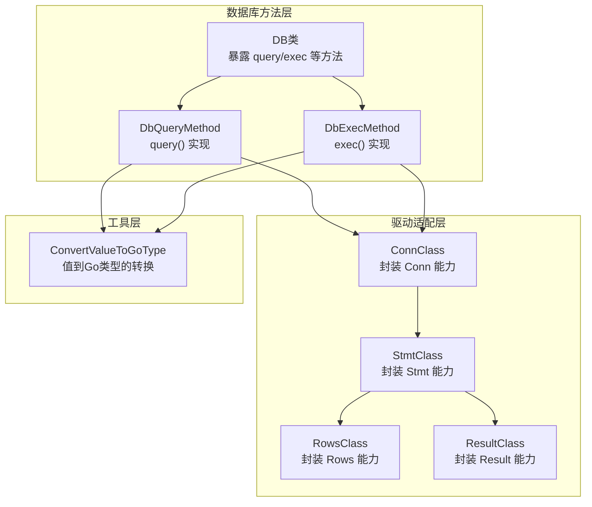
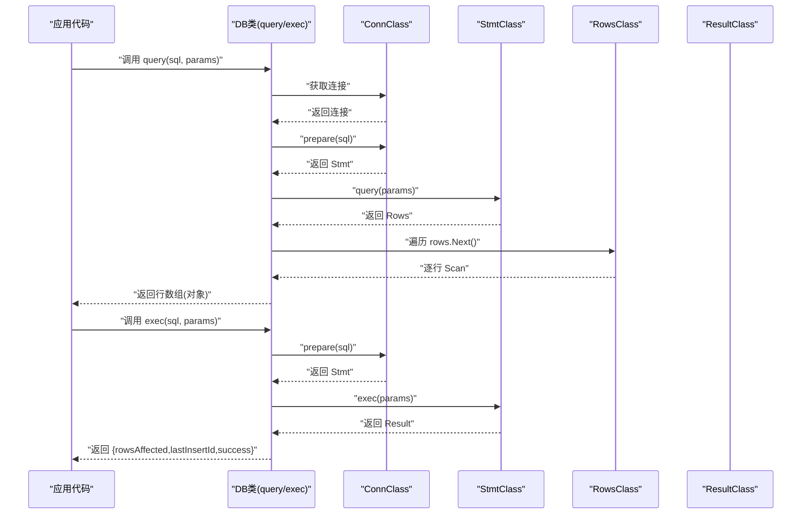
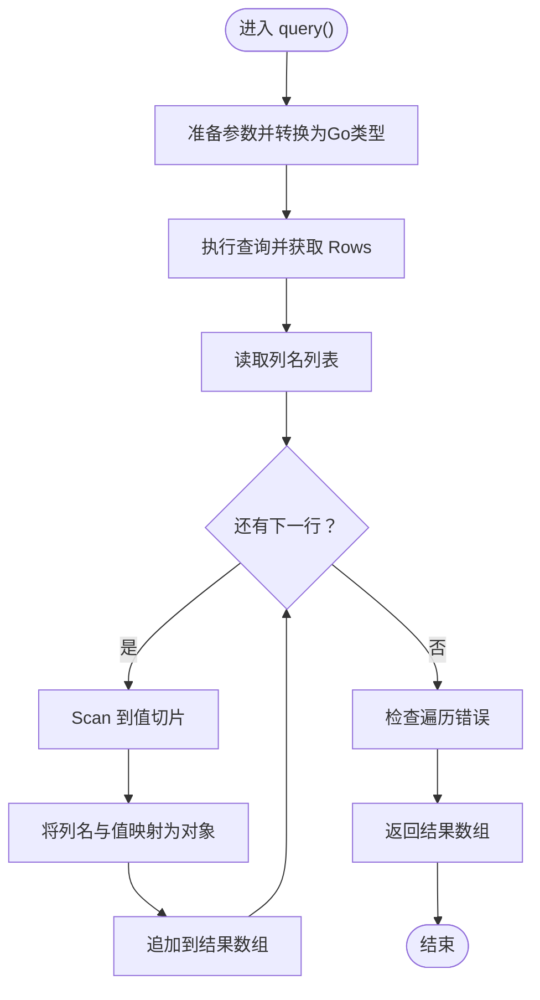
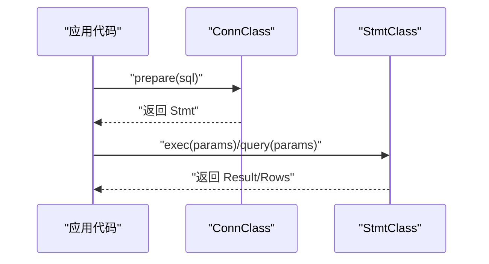
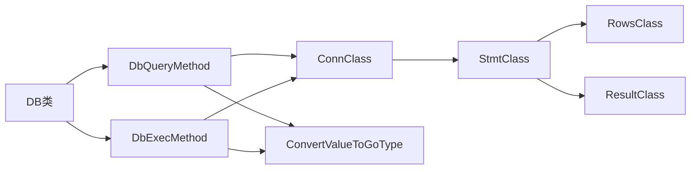

# 原生SQL

<cite>
**本文引用的文件**
- [std/database/db_query.go](file://std/database/db_query.go)
- [std/database/db_exec.go](file://std/database/db_exec.go)
- [std/database/db_class.go](file://std/database/db_class.go)
- [std/database/utility.go](file://std/database/utility.go)
- [std/database/driver/rows_class.go](file://std/database/driver/rows_class.go)
- [std/database/driver/result_class.go](file://std/database/driver/result_class.go)
- [std/database/driver/stmt_class.go](file://std/database/driver/stmt_class.go)
- [std/database/driver/conn_class.go](file://std/database/driver/conn_class.go)
- [std/database/driver/conn_prepare_method.go](file://std/database/driver/conn_prepare_method.go)
- [examples/database/database.zy](file://examples/database/database.zy)
</cite>

## 目录
1. [简介](#简介)
2. [项目结构](#项目结构)
3. [核心组件](#核心组件)
4. [架构总览](#架构总览)
5. [详细组件分析](#详细组件分析)
6. [依赖分析](#依赖分析)
7. [性能考虑](#性能考虑)
8. [故障排查指南](#故障排查指南)
9. [结论](#结论)
10. [附录](#附录)

## 简介
本章节面向需要直接使用原生SQL进行查询与命令执行的开发者，系统性阐述以下主题：
- query() 与 exec() 的区别与适用场景
- SQL结果集处理流程，包括 Rows 类的使用、数据提取与类型转换
- 预处理语句的实现与参数绑定的安全机制
- 复杂SQL（子查询、窗口函数、CTE）的编写建议与注意事项
- SQL注入防护、性能优化与错误处理的最佳实践

## 项目结构
围绕原生SQL能力，代码主要分布在如下模块：
- 数据库方法层：提供 query() 与 exec() 等原生SQL入口
- 驱动适配层：封装 database/sql/driver 的 Rows/Result/Stmt/Conn 能力
- 工具与类型转换：统一将脚本侧值转换为Go原生类型
- 示例与用法：展示在真实业务中的调用方式

图表来源
- [std/database/db_class.go:57-84](file://std/database/db_class.go#L57-L84)
- [std/database/db_query.go:16-97](file://std/database/db_query.go#L16-L97)
- [std/database/db_exec.go:15-76](file://std/database/db_exec.go#L15-L76)
- [std/database/driver/conn_class.go:10-59](file://std/database/driver/conn_class.go#L10-L59)
- [std/database/driver/stmt_class.go:10-64](file://std/database/driver/stmt_class.go#L10-L64)
- [std/database/driver/rows_class.go:10-59](file://std/database/driver/rows_class.go#L10-L59)
- [std/database/driver/result_class.go:10-54](file://std/database/driver/result_class.go#L10-L54)
- [std/database/utility.go:12-31](file://std/database/utility.go#L12-L31)

章节来源
- [std/database/db_class.go:57-84](file://std/database/db_class.go#L57-L84)
- [std/database/db_query.go:16-97](file://std/database/db_query.go#L16-L97)
- [std/database/db_exec.go:15-76](file://std/database/db_exec.go#L15-L76)
- [std/database/driver/conn_class.go:10-59](file://std/database/driver/conn_class.go#L10-L59)
- [std/database/driver/stmt_class.go:10-64](file://std/database/driver/stmt_class.go#L10-L64)
- [std/database/driver/rows_class.go:10-59](file://std/database/driver/rows_class.go#L10-L59)
- [std/database/driver/result_class.go:10-54](file://std/database/driver/result_class.go#L10-L54)
- [std/database/utility.go:12-31](file://std/database/utility.go#L12-L31)

## 核心组件
- 原生SQL入口
  - query(sql, params): 执行查询，返回行数组；每行以对象形式呈现，键为列名，值为对应列的脚本侧类型
  - exec(sql, params): 执行非查询命令（INSERT/UPDATE/DELETE/DDL等），返回包含影响行数与最后插入ID的对象
- 结果集与类型转换
  - Rows：封装底层 Rows，提供 close/columns/next 等方法
  - Result：封装底层 Result，提供 lastInsertId/rowsAffected 等方法
- 参数绑定与安全
  - 所有传入参数通过统一转换函数转为Go原生类型后交由数据库驱动执行，避免字符串拼接引发注入风险
- 预处理语句
  - 通过 Conn.prepare 获取 Stmt，随后可多次复用该语句并绑定不同参数，提升性能与安全性

章节来源
- [std/database/db_query.go:16-97](file://std/database/db_query.go#L16-L97)
- [std/database/db_exec.go:15-76](file://std/database/db_exec.go#L15-L76)
- [std/database/driver/rows_class.go:10-59](file://std/database/driver/rows_class.go#L10-L59)
- [std/database/driver/result_class.go:10-54](file://std/database/driver/result_class.go#L10-L54)
- [std/database/driver/stmt_class.go:10-64](file://std/database/driver/stmt_class.go#L10-L64)
- [std/database/driver/conn_class.go:10-59](file://std/database/driver/conn_class.go#L10-L59)
- [std/database/driver/conn_prepare_method.go:16-30](file://std/database/driver/conn_prepare_method.go#L16-L30)
- [std/database/utility.go:12-31](file://std/database/utility.go#L12-L31)

## 架构总览
下图展示从应用调用到数据库执行的关键路径，以及结果回传与类型转换过程。

图表来源
- [std/database/db_query.go:16-97](file://std/database/db_query.go#L16-L97)
- [std/database/db_exec.go:15-76](file://std/database/db_exec.go#L15-L76)
- [std/database/driver/conn_class.go:10-59](file://std/database/driver/conn_class.go#L10-L59)
- [std/database/driver/stmt_class.go:10-64](file://std/database/driver/stmt_class.go#L10-L64)
- [std/database/driver/rows_class.go:10-59](file://std/database/driver/rows_class.go#L10-L59)
- [std/database/driver/result_class.go:10-54](file://std/database/driver/result_class.go#L10-L54)

## 详细组件分析

### query() 与 exec() 的区别与使用场景
- query()
  - 用途：执行 SELECT 等返回结果集的查询
  - 输入：SQL字符串与参数数组
  - 输出：数组，元素为对象，键为列名，值为对应列的脚本侧类型
  - 典型场景：统计、列表、关联查询、聚合查询
- exec()
  - 用途：执行 INSERT/UPDATE/DELETE/DDL 等不返回结果集的命令
  - 输入：SQL字符串与参数数组
  - 输出：对象，包含 rowsAffected（受影响行数）、lastInsertId（最后插入ID，若适用）、success（布尔）
  - 典型场景：写入、更新、建表、索引维护

章节来源
- [std/database/db_query.go:16-97](file://std/database/db_query.go#L16-L97)
- [std/database/db_exec.go:15-76](file://std/database/db_exec.go#L15-L76)

### SQL结果集处理：Rows 类与数据提取
- 行遍历与扫描
  - 通过 Rows.next() 迭代下一行
  - 使用 Rows.columns() 获取列名列表
  - 使用 Rows.scan() 将列值扫描至切片，再映射到对象属性
- 类型转换
  - 将数据库驱动返回的原始值转换为脚本侧类型（整数、浮点、布尔、字符串等）
  - 对越界或未知类型采用安全策略（如转字符串）
- 错误处理
  - 遍历过程中检查 rows.Err()，确保无异常
  - 对列信息获取失败、扫描失败等情况抛出异常

图表来源
- [std/database/db_query.go:58-96](file://std/database/db_query.go#L58-L96)
- [std/database/utility.go:12-31](file://std/database/utility.go#L12-L31)

章节来源
- [std/database/db_query.go:58-96](file://std/database/db_query.go#L58-L96)
- [std/database/utility.go:12-31](file://std/database/utility.go#L12-L31)

### 预处理语句与参数绑定的安全机制
- 预处理语句
  - 通过 Conn.prepare() 获取 Stmt，后续可多次复用
  - Stmt 支持 exec/query 等方法，均接受参数数组
- 参数绑定
  - 所有参数经 ConvertValueToGoType 统一转换为Go原生类型
  - 由数据库驱动负责参数化执行，避免SQL注入
- 性能优势
  - 预编译语句可减少解析与计划开销，适合高频调用

图表来源
- [std/database/driver/conn_prepare_method.go:16-30](file://std/database/driver/conn_prepare_method.go#L16-L30)
- [std/database/driver/stmt_class.go:10-64](file://std/database/driver/stmt_class.go#L10-L64)
- [std/database/utility.go:12-31](file://std/database/utility.go#L12-L31)

章节来源
- [std/database/driver/conn_prepare_method.go:16-30](file://std/database/driver/conn_prepare_method.go#L16-L30)
- [std/database/driver/stmt_class.go:10-64](file://std/database/driver/stmt_class.go#L10-L64)
- [std/database/utility.go:12-31](file://std/database/utility.go#L12-L31)

### 复杂SQL特性编写指南
- 子查询
  - 在 WHERE/HAVING/SELECT 子句中嵌套子查询，注意别名与作用域
  - 使用参数绑定传递外部变量，避免字符串拼接
- 窗口函数
  - 在 SELECT 中使用 OVER/PARTITION BY/RANGE/RANK 等子句
  - 注意与 ORDER BY 的组合，避免歧义
- CTE（WITH）
  - 使用 WITH 定义临时结果集，便于分步表达复杂逻辑
  - 合理命名与注释，提升可读性
- 最佳实践
  - 优先使用参数占位符而非字符串拼接
  - 控制字段列表，避免 SELECT *
  - 为高频查询建立必要索引
  - 对大数据量分批处理，避免长事务

（本节为概念性指导，无需特定文件引用）

### 使用示例与常见场景
- 原生SQL查询与命令
  - 查询：DB<User>()->query("SELECT COUNT(*) as total FROM users")
  - 命令：DB<User>()->exec("UPDATE users SET age = age + 1 WHERE age < ?")
- 示例文件参考
  - 包含建表、插入、更新、删除、关联查询、分页与统计等完整演示

章节来源
- [examples/database/database.zy:155-161](file://examples/database/database.zy#L155-L161)
- [examples/database/database.zy:191-195](file://examples/database/database.zy#L191-L195)

## 依赖分析
- 组件耦合
  - DB类通过方法桥接到具体实现，降低上层与底层驱动的耦合
  - Rows/Result/Stmt/Conn 作为适配层，封装 database/sql/driver 的能力
- 外部依赖
  - database/sql 与 database/sql/driver 提供标准接口
- 循环依赖
  - 当前结构清晰，未见循环依赖迹象

图表来源
- [std/database/db_class.go:57-84](file://std/database/db_class.go#L57-L84)
- [std/database/db_query.go:16-97](file://std/database/db_query.go#L16-L97)
- [std/database/db_exec.go:15-76](file://std/database/db_exec.go#L15-L76)
- [std/database/driver/conn_class.go:10-59](file://std/database/driver/conn_class.go#L10-L59)
- [std/database/driver/stmt_class.go:10-64](file://std/database/driver/stmt_class.go#L10-L64)
- [std/database/driver/rows_class.go:10-59](file://std/database/driver/rows_class.go#L10-L59)
- [std/database/driver/result_class.go:10-54](file://std/database/driver/result_class.go#L10-L54)
- [std/database/utility.go:12-31](file://std/database/utility.go#L12-L31)

章节来源
- [std/database/db_class.go:57-84](file://std/database/db_class.go#L57-L84)
- [std/database/db_query.go:16-97](file://std/database/db_query.go#L16-L97)
- [std/database/db_exec.go:15-76](file://std/database/db_exec.go#L15-L76)
- [std/database/driver/conn_class.go:10-59](file://std/database/driver/conn_class.go#L10-L59)
- [std/database/driver/stmt_class.go:10-64](file://std/database/driver/stmt_class.go#L10-L64)
- [std/database/driver/rows_class.go:10-59](file://std/database/driver/rows_class.go#L10-L59)
- [std/database/driver/result_class.go:10-54](file://std/database/driver/result_class.go#L10-L54)
- [std/database/utility.go:12-31](file://std/database/utility.go#L12-L31)

## 性能考虑
- 使用预处理语句（Stmt）复用执行计划，降低解析与编译成本
- 合理分页与限制结果集大小，避免一次性加载过多数据
- 为热点查询建立索引，优化WHERE/HAVING/JOIN条件
- 避免不必要的字符串拼接，统一使用参数绑定
- 对批量写入使用事务，减少往返次数

（本节为通用性能建议，无需特定文件引用）

## 故障排查指南
- 常见错误与定位
  - SQL语法错误：检查SQL字符串与参数绑定
  - 参数类型不匹配：确认 ConvertValueToGoType 的转换行为
  - 连接不可用：确认连接状态与超时设置
  - 遍历错误：检查 rows.Err() 并捕获异常
- 建议排查步骤
  - 打印最终生成的SQL与参数
  - 逐步缩小问题范围（先最小化SQL，再添加条件）
  - 使用数据库客户端单独验证SQL执行情况

章节来源
- [std/database/db_query.go:52-96](file://std/database/db_query.go#L52-L96)
- [std/database/db_exec.go:50-76](file://std/database/db_exec.go#L50-L76)

## 结论
- query() 适用于需要结果集的查询，exec() 适用于写入与DDL等命令
- Rows/Result/Stmt/Conn 适配层提供了清晰的抽象，便于扩展与维护
- 参数绑定与类型转换统一处理，有效降低SQL注入风险
- 复杂SQL应遵循参数化、索引优化与分页策略，确保性能与稳定性

（本节为总结性内容，无需特定文件引用）

## 附录
- API速查
  - query(sql, params): 返回行数组（对象集合）
  - exec(sql, params): 返回 {rowsAffected, lastInsertId, success}
  - Rows: close()/columns()/next()
  - Result: lastInsertId()/rowsAffected()
  - Stmt: close()/exec()/query()/numInput()
  - Conn: begin()/close()/prepare()

章节来源
- [std/database/db_query.go:111-127](file://std/database/db_query.go#L111-L127)
- [std/database/db_exec.go:90-106](file://std/database/db_exec.go#L90-L106)
- [std/database/driver/rows_class.go:38-59](file://std/database/driver/rows_class.go#L38-L59)
- [std/database/driver/result_class.go:36-54](file://std/database/driver/result_class.go#L36-L54)
- [std/database/driver/stmt_class.go:40-64](file://std/database/driver/stmt_class.go#L40-L64)
- [std/database/driver/conn_class.go:38-59](file://std/database/driver/conn_class.go#L38-L59)