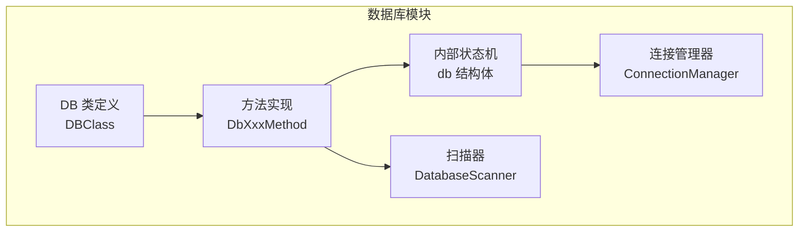
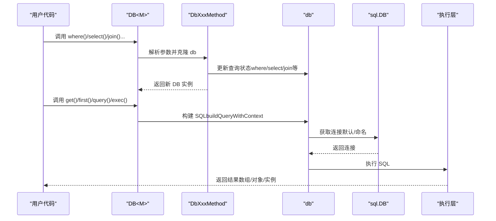
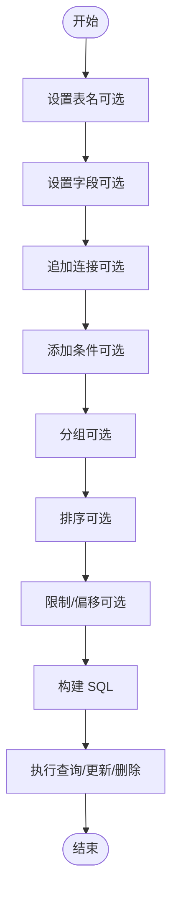
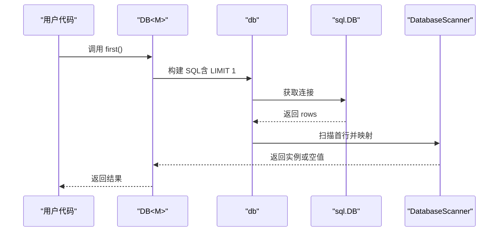
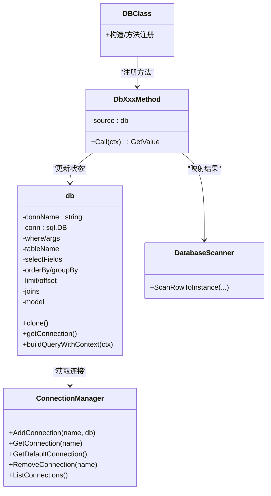

# 数据库模块

<cite>
**本文引用的文件**   
- [std/database/db_class.go](file://std/database/db_class.go)
- [std/database/db.go](file://std/database/db.go)
- [std/database/db_construct.go](file://std/database/db_construct.go)
- [std/database/connection_manager.go](file://std/database/connection_manager.go)
- [std/database/db_table.go](file://std/database/db_table.go)
- [std/database/db_where.go](file://std/database/db_where.go)
- [std/database/db_select.go](file://std/database/db_select.go)
- [std/database/db_join.go](file://std/database/db_join.go)
- [std/database/db_group_by.go](file://std/database/db_group_by.go)
- [std/database/db_order_by.go](file://std/database/db_order_by.go)
- [std/database/db_limit.go](file://std/database/db_limit.go)
- [std/database/db_offset.go](file://std/database/db_offset.go)
- [std/database/db_get.go](file://std/database/db_get.go)
- [std/database/db_first.go](file://std/database/db_first.go)
- [std/database/db_insert.go](file://std/database/db_insert.go)
- [std/database/db_update.go](file://std/database/db_update.go)
- [std/database/db_delete.go](file://std/database/db_delete.go)
- [std/database/db_query.go](file://std/database/db_query.go)
- [std/database/db_exec.go](file://std/database/db_exec.go)
- [std/database/db_scan.go](file://std/database/db_scan.go)
- [std/database/readme.md](file://std/database/readme.md)
</cite>

## 目录
1. [简介](#简介)
2. [项目结构](#项目结构)
3. [核心组件](#核心组件)
4. [架构总览](#架构总览)
5. [详细组件分析](#详细组件分析)
6. [依赖分析](#依赖分析)
7. [性能考虑](#性能考虑)
8. [故障排查指南](#故障排查指南)
9. [结论](#结论)
10. [附录](#附录)

## 简介
本文件系统性地介绍数据库模块的 ORM 能力与使用方式，涵盖：
- DB 类的构造与连接管理
- 查询构建器链式 API（table、where、select、join、groupBy、orderBy、limit、offset）
- CRUD 操作（insert、update、delete、get、first）的完整流程与参数说明
- 数据库注解系统（@Table、@Column 等）的使用与映射规则
- 原生 SQL 支持（query、exec）
- 连接管理、错误处理、性能优化与多数据库驱动适配建议

## 项目结构
数据库模块位于 std/database 目录，核心由“类定义 + 方法实现 + 连接管理 + 注解扫描”构成：
- 类与方法：DBClass、各方法实现（DbXxxMethod）、db 内部状态机
- 连接管理：ConnectionManager 提供多连接注册与默认连接获取
- 扫描器：DatabaseScanner 负责将数据库行映射到模型实例属性
- 文档与示例：readme.md 提供使用说明与示例

**图表来源**
- [std/database/db_class.go:11-168](file://std/database/db_class.go#L11-L168)
- [std/database/db.go:19-48](file://std/database/db.go#L19-L48)
- [std/database/connection_manager.go:8-66](file://std/database/connection_manager.go#L8-L66)
- [std/database/db_scan.go:14-251](file://std/database/db_scan.go#L14-L251)

**章节来源**
- [std/database/db_class.go:1-168](file://std/database/db_class.go#L1-L168)
- [std/database/db.go:1-446](file://std/database/db.go#L1-L446)
- [std/database/connection_manager.go:1-66](file://std/database/connection_manager.go#L1-L66)
- [std/database/readme.md:1-168](file://std/database/readme.md#L1-L168)

## 核心组件
- DB 类（Database\DB）：通过泛型绑定模型类型 M，暴露链式查询与 CRUD 方法
- db 内部状态机：维护 where、whereArgs、tableName、selectFields、orderBy、groupBy、limit、offset、joins、model 等查询状态
- 方法实现：每个链式方法均返回新的 DB 实例，保证不可变性与可组合性
- 连接管理：ConnectionManager 提供 Add/Get/Remove/List，默认连接名为 "default"
- 扫描器：DatabaseScanner 将数据库行按属性名、注解、命名风格（驼峰/蛇形）映射到模型属性

**章节来源**
- [std/database/db_class.go:11-168](file://std/database/db_class.go#L11-L168)
- [std/database/db.go:19-48](file://std/database/db.go#L19-L48)
- [std/database/db_scan.go:14-251](file://std/database/db_scan.go#L14-L251)
- [std/database/connection_manager.go:8-66](file://std/database/connection_manager.go#L8-L66)

## 架构总览
DB 类通过方法实现对 db 状态进行不可变更新，最终在执行阶段（get/first/query/exec）统一获取连接、构建 SQL 并执行。

**图表来源**
- [std/database/db_where.go:14-39](file://std/database/db_where.go#L14-L39)
- [std/database/db_select.go:15-35](file://std/database/db_select.go#L15-L35)
- [std/database/db_join.go:14-27](file://std/database/db_join.go#L14-L27)
- [std/database/db_get.go:15-69](file://std/database/db_get.go#L15-L69)
- [std/database/db_first.go:16-58](file://std/database/db_first.go#L16-L58)
- [std/database/db_query.go:16-97](file://std/database/db_query.go#L16-L97)
- [std/database/db_exec.go:15-76](file://std/database/db_exec.go#L15-L76)
- [std/database/db.go:154-265](file://std/database/db.go#L154-L265)
- [std/database/db.go:80-101](file://std/database/db.go#L80-L101)

## 详细组件分析

### DB 类与构造
- DBClass：注册并暴露 get、first、where、table、select、orderBy、groupBy、limit、offset、join、insert、update、delete、query、exec 等方法
- DbConstructMethod：支持可选连接名参数，用于后续按名称获取连接
- db 结构体：保存查询状态与模型类型泛型 M；clone 深拷贝 whereArgs/selectFields/ joins，确保链式调用互不影响

**章节来源**
- [std/database/db_class.go:11-168](file://std/database/db_class.go#L11-L168)
- [std/database/db_construct.go:12-49](file://std/database/db_construct.go#L12-L49)
- [std/database/db.go:50-78](file://std/database/db.go#L50-L78)

### 查询构建器 API
- table(name)：显式设置表名，覆盖注解；返回新 DB 实例
- where(sql, ...args)：设置 WHERE 条件与参数；支持数组参数
- select(fields)：设置选择字段（逗号分隔字符串）
- join(joinSql)：追加 JOIN 子句
- groupBy(group)：设置 GROUP BY
- orderBy(order)：设置 ORDER BY
- limit(n)：设置 LIMIT（必须为正整数）
- offset(n)：设置 OFFSET（非负整数）

**图表来源**
- [std/database/db_table.go:14-30](file://std/database/db_table.go#L14-L30)
- [std/database/db_select.go:15-38](file://std/database/db_select.go#L15-L38)
- [std/database/db_join.go:14-30](file://std/database/db_join.go#L14-L30)
- [std/database/db_where.go:14-39](file://std/database/db_where.go#L14-L39)
- [std/database/db_group_by.go:14-30](file://std/database/db_group_by.go#L14-L30)
- [std/database/db_order_by.go:14-30](file://std/database/db_order_by.go#L14-L30)
- [std/database/db_limit.go:14-32](file://std/database/db_limit.go#L14-L32)
- [std/database/db_offset.go:14-32](file://std/database/db_offset.go#L14-L32)
- [std/database/db.go:154-207](file://std/database/db.go#L154-L207)

**章节来源**
- [std/database/db_table.go:1-59](file://std/database/db_table.go#L1-L59)
- [std/database/db_where.go:1-71](file://std/database/db_where.go#L1-L71)
- [std/database/db_select.go:1-67](file://std/database/db_select.go#L1-L67)
- [std/database/db_join.go:1-59](file://std/database/db_join.go#L1-L59)
- [std/database/db_group_by.go:1-59](file://std/database/db_group_by.go#L1-L59)
- [std/database/db_order_by.go:1-59](file://std/database/db_order_by.go#L1-L59)
- [std/database/db_limit.go:1-61](file://std/database/db_limit.go#L1-L61)
- [std/database/db_offset.go:1-61](file://std/database/db_offset.go#L1-L61)

### CRUD 操作流程

#### 查询：get 与 first
- get：构建 SQL，执行查询，逐行扫描并映射为模型实例，返回数组
- first：若未设置 limit，则自动追加 LIMIT 1；若无结果返回空值；有结果则映射为模型实例或空对象

**图表来源**
- [std/database/db_first.go:16-58](file://std/database/db_first.go#L16-L58)
- [std/database/db_get.go:15-69](file://std/database/db_get.go#L15-L69)
- [std/database/db_scan.go:22-96](file://std/database/db_scan.go#L22-L96)

**章节来源**
- [std/database/db_first.go:1-133](file://std/database/db_first.go#L1-L133)
- [std/database/db_get.go:1-122](file://std/database/db_get.go#L1-L122)
- [std/database/db_scan.go:1-251](file://std/database/db_scan.go#L1-L251)

#### 插入：insert
- 支持传入类实例或普通对象；自动处理注解列名映射与空值过滤
- 构造 INSERT 语句并执行，返回包含 rowsAffected、lastInsertId、success 的对象

**章节来源**
- [std/database/db_insert.go:1-171](file://std/database/db_insert.go#L1-L171)

#### 更新：update
- 仅跳过真正为 null 的值（不会跳过 0/false/空串等），支持 WHERE 条件
- 构造 UPDATE 语句并执行，返回包含 rowsAffected、success 的对象

**章节来源**
- [std/database/db_update.go:1-175](file://std/database/db_update.go#L1-L175)

#### 删除：delete
- 支持 WHERE 条件；构造 DELETE 语句并执行，返回包含 rowsAffected、success 的对象

**章节来源**
- [std/database/db_delete.go:1-86](file://std/database/db_delete.go#L1-L86)

### 原生 SQL：query 与 exec
- query(sql, params?)：执行查询，按列名映射为对象数组
- exec(sql, params?)：执行非查询语句，返回 rowsAffected、lastInsertId、success

**章节来源**
- [std/database/db_query.go:1-182](file://std/database/db_query.go#L1-L182)
- [std/database/db_exec.go:1-107](file://std/database/db_exec.go#L1-L107)

### 注解系统与列名映射
- @Table：类级注解，声明表名；若未显式 table()，将优先从注解解析
- @Column：属性级注解，声明数据库列名；若注解列名与属性名不同，以注解为准
- 命名风格：扫描器支持属性名直配、下划线转驼峰、驼峰转下划线三种策略，提升兼容性

**章节来源**
- [std/database/db.go:290-322](file://std/database/db.go#L290-L322)
- [std/database/db.go:341-396](file://std/database/db.go#L341-L396)
- [std/database/db.go:398-445](file://std/database/db.go#L398-L445)
- [std/database/db_scan.go:224-250](file://std/database/db_scan.go#L224-L250)

## 依赖分析
- DB 类与方法实现：通过 DBClass 注册方法，方法内部持有 db 源指针，实现不可变链式更新
- 连接管理：db.getConnection 优先使用命名连接，其次默认连接
- 扫描器：与模型类定义强关联，依赖 VM 获取类定义与属性列表

**图表来源**
- [std/database/db_class.go:32-85](file://std/database/db_class.go#L32-L85)
- [std/database/db.go:50-101](file://std/database/db.go#L50-L101)
- [std/database/connection_manager.go:19-66](file://std/database/connection_manager.go#L19-L66)
- [std/database/db_scan.go:14-21]

**章节来源**
- [std/database/db_class.go:1-168](file://std/database/db_class.go#L1-L168)
- [std/database/db.go:1-446](file://std/database/db.go#L1-L446)
- [std/database/connection_manager.go:1-66](file://std/database/connection_manager.go#L1-L66)
- [std/database/db_scan.go:1-251](file://std/database/db_scan.go#L1-L251)

## 性能考虑
- 不可变链式：每次方法调用返回新实例，避免共享状态带来的竞态，但需注意频繁链式调用的内存分配
- 参数绑定：统一通过 ConvertValueToGoType 转换，减少反射成本
- 扫描策略：优先属性名直配，再注解列名，最后命名风格转换，尽量减少映射开销
- 连接复用：通过 ConnectionManager 注册连接，避免重复打开连接
- LIMIT 优化：first 在未显式 limit 时自动加 LIMIT 1，降低网络与解析成本

[本节为通用指导，不直接分析具体文件]

## 故障排查指南
- 数据库连接不可用：检查 ConnectionManager 是否已注册默认连接或命名连接
- 表名解析失败：确认模型类存在且可被 VM 加载；若使用 @Table，请确保注解正确；也可显式 table() 覆盖
- 注解列名不匹配：确认 @Column 中的列名与数据库一致；若注解列名与属性名相同，将以属性名为准
- 参数类型错误：where()/query()/exec() 的参数需为字符串或数组；否则抛出错误
- 命名风格不匹配：若列名为 user_name，属性名为 userName，扫描器会尝试驼峰/蛇形转换

**章节来源**
- [std/database/db_get.go:15-20](file://std/database/db_get.go#L15-L20)
- [std/database/db_first.go:16-21](file://std/database/db_first.go#L16-L21)
- [std/database/db_query.go:23-34](file://std/database/db_query.go#L23-L34)
- [std/database/db_exec.go:22-33](file://std/database/db_exec.go#L22-L33)
- [std/database/db.go:290-322](file://std/database/db.go#L290-L322)
- [std/database/db_scan.go:56-96](file://std/database/db_scan.go#L56-L96)

## 结论
该数据库模块以不可变链式 API 为核心，结合注解与命名风格映射，提供简洁而强大的 ORM 能力；配合 ConnectionManager 实现多连接管理与默认连接回退；扫描器保障了从数据库行到模型实例的高兼容性映射。对于复杂场景，可直接使用原生 SQL 的 query/exec 方法获得最大灵活性。

[本节为总结，不直接分析具体文件]

## 附录

### DB 类方法一览（按功能分组）
- 查询构建：table、where、select、join、groupBy、orderBy、limit、offset
- 查询执行：get、first、query
- 修改执行：insert、update、delete、exec
- 连接管理：registerDefaultConnection、registerConnection、getConnection、listConnections、removeConnection

**章节来源**
- [std/database/db_class.go:122-159](file://std/database/db_class.go#L122-L159)
- [std/database/readme.md:107-167](file://std/database/readme.md#L107-L167)

### 使用示例与最佳实践
- 默认连接与命名连接：DB<Model>() 使用默认连接；DB<Model>("slave") 使用命名连接
- 自动表名：@Table 注解声明表名；若未显式 table()，将从注解或类名推断
- 原生 SQL：query 用于查询，exec 用于插入/更新/删除/DDL
- 连接注册：在 Go 侧打开数据库连接后，通过 registerDefaultConnection/registerConnection 注册到管理器

**章节来源**
- [std/database/readme.md:151-167](file://std/database/readme.md#L151-L167)