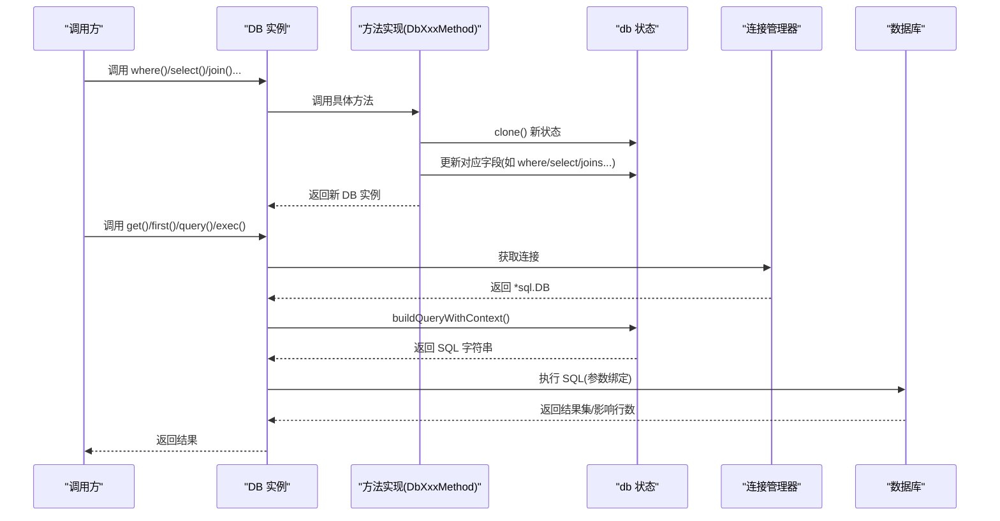
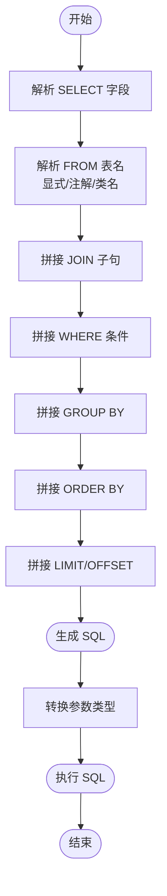
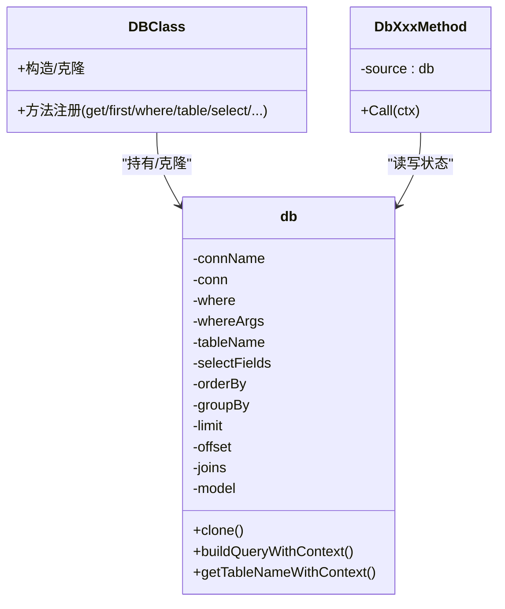

# 查询构建器

<cite>
**本文引用的文件**
- [db_class.go](file://std/database/db_class.go)
- [db.go](file://std/database/db.go)
- [db_table.go](file://std/database/db_table.go)
- [db_where.go](file://std/database/db_where.go)
- [db_select.go](file://std/database/db_select.go)
- [db_join.go](file://std/database/db_join.go)
- [db_group_by.go](file://std/database/db_group_by.go)
- [db_order_by.go](file://std/database/db_order_by.go)
- [db_limit.go](file://std/database/db_limit.go)
- [db_offset.go](file://std/database/db_offset.go)
- [db_get.go](file://std/database/db_get.go)
- [db_first.go](file://std/database/db_first.go)
- [db_insert.go](file://std/database/db_insert.go)
- [db_update.go](file://std/database/db_update.go)
- [db_delete.go](file://std/database/db_delete.go)
- [db_query.go](file://std/database/db_query.go)
- [db_exec.go](file://std/database/db_exec.go)
- [utility.go](file://std/database/utility.go)
</cite>

## 目录
1. [简介](#简介)
2. [项目结构](#项目结构)
3. [核心组件](#核心组件)
4. [架构总览](#架构总览)
5. [详细组件分析](#详细组件分析)
6. [依赖关系分析](#依赖关系分析)
7. [性能考量](#性能考量)
8. [故障排查指南](#故障排查指南)
9. [结论](#结论)
10. [附录](#附录)

## 简介
本文件系统性阐述查询构建器的设计与使用，围绕 DB 类提供的链式查询能力，覆盖表设置、条件、字段选择、连接、分组、排序、限制与偏移等方法；解释链式调用的实现原理与最佳实践；给出多表连接、嵌套条件、聚合函数等复杂场景的使用思路；并说明查询构建器如何将链式调用转换为 SQL 语句，以及参数绑定与预处理的实现机制。

## 项目结构
查询构建器位于标准库模块 std/database 下，采用“类 + 方法实现”的方式组织。DB 类通过方法克隆内部状态，形成新的查询上下文，从而实现链式调用；核心状态保存在 db 结构体中，包含表名、字段、连接、条件、分组、排序、限制与偏移等。

```mermaid
graph TB
DBClass["DB 类<br/>std/database/db_class.go"] --> DBImpl["DB 实现(db)<br/>std/database/db.go"]
DBClass --> Methods["方法实现集合<br/>std/database/*.go"]
Methods --> Table["table()<br/>std/database/db_table.go"]
Methods --> Where["where()<br/>std/database/db_where.go"]
Methods --> Select["select()<br/>std/database/db_select.go"]
Methods --> Join["join()<br/>std/database/db_join.go"]
Methods --> GroupBy["groupBy()<br/>std/database/db_group_by.go"]
Methods --> OrderBy["orderBy()<br/>std/database/db_order_by.go"]
Methods --> Limit["limit()<br/>std/database/db_limit.go"]
Methods --> Offset["offset()<br/>std/database/db_offset.go"]
Methods --> Get["get()<br/>std/database/db_get.go"]
Methods --> First["first()<br/>std/database/db_first.go"]
Methods --> Insert["insert()<br/>std/database/db_insert.go"]
Methods --> Update["update()<br/>std/database/db_update.go"]
Methods --> Delete["delete()<br/>std/database/db_delete.go"]
Methods --> Query["query()<br/>std/database/db_query.go"]
Methods --> Exec["exec()<br/>std/database/db_exec.go"]
DBImpl --> Utility["类型转换工具<br/>std/database/utility.go"]
```

图表来源
- [db_class.go:11-168](file://std/database/db_class.go#L11-L168)
- [db.go:19-48](file://std/database/db.go#L19-L48)
- [db_table.go:10-59](file://std/database/db_table.go#L10-L59)
- [db_where.go:10-71](file://std/database/db_where.go#L10-L71)
- [db_select.go:11-67](file://std/database/db_select.go#L11-L67)
- [db_join.go:10-59](file://std/database/db_join.go#L10-L59)
- [db_group_by.go:10-59](file://std/database/db_group_by.go#L10-L59)
- [db_order_by.go:10-59](file://std/database/db_order_by.go#L10-L59)
- [db_limit.go:10-61](file://std/database/db_limit.go#L10-L61)
- [db_offset.go:10-61](file://std/database/db_offset.go#L10-L61)
- [db_get.go:11-122](file://std/database/db_get.go#L11-L122)
- [db_first.go:11-133](file://std/database/db_first.go#L11-L133)
- [db_insert.go:11-171](file://std/database/db_insert.go#L11-L171)
- [db_update.go:12-175](file://std/database/db_update.go#L12-L175)
- [db_delete.go:11-86](file://std/database/db_delete.go#L11-L86)
- [db_query.go:12-182](file://std/database/db_query.go#L12-L182)
- [db_exec.go:11-107](file://std/database/db_exec.go#L11-L107)
- [utility.go:10-32](file://std/database/utility.go#L10-L32)

章节来源
- [db_class.go:11-168](file://std/database/db_class.go#L11-L168)
- [db.go:19-48](file://std/database/db.go#L19-L48)

## 核心组件
- DB 类（Database\DB）：对外暴露链式查询与 CRUD、原生 SQL 能力，方法通过 DbXxxMethod 包装 db 内部状态。
- db 结构体：持有查询状态（表名、字段、连接、where 条件、分组、排序、limit/offset 等），并提供 clone 深拷贝以支持链式调用。
- 方法实现：每个查询方法均返回一个新的 DB 实例，携带更新后的状态，保证线程安全与可组合性。
- 工具与序列化：ConvertValueToGoType 统一将脚本层 Value 转换为 Go 原生类型，供 SQL 执行时绑定参数。

章节来源
- [db_class.go:11-168](file://std/database/db_class.go#L11-L168)
- [db.go:19-48](file://std/database/db.go#L19-L48)
- [utility.go:10-32](file://std/database/utility.go#L10-L32)

## 架构总览
查询构建器采用“状态机 + 方法克隆”的设计：每次调用查询方法都会基于当前 db 状态克隆一份新状态，写入本次调用的变更，再封装到新的 DB 实例中返回。最终执行阶段（如 get/first/query/exec）负责：
- 解析表名（显式设置或注解推导）
- 构建 SQL 片段并拼接
- 将 whereArgs 转换为 Go 原生参数
- 执行 SQL 并返回结果

图表来源
- [db_get.go:15-69](file://std/database/db_get.go#L15-L69)
- [db_first.go:16-58](file://std/database/db_first.go#L16-L58)
- [db_query.go:16-97](file://std/database/db_query.go#L16-L97)
- [db_exec.go:15-76](file://std/database/db_exec.go#L15-L76)
- [db.go:209-265](file://std/database/db.go#L209-L265)

## 详细组件分析

### DB 类与方法注册
- DBClass 定义了所有公开方法（get/first/where/table/select/orderBy/groupBy/limit/offset/join，以及 CRUD 与原生 SQL），并通过 Clone/CloneWithSource 生成带不同源状态的实例。
- 方法通过 GetMethod 返回对应 Method 实现，确保调用时可解析到正确的实现。

章节来源
- [db_class.go:122-159](file://std/database/db_class.go#L122-L159)
- [db_class.go:32-85](file://std/database/db_class.go#L32-L85)

### 链式调用实现原理
- 每个查询方法（如 where/select/join/groupBy/orderBy/limit/offset/table）均：
  - 从上下文提取参数
  - clone 当前 db 状态
  - 写入本次调用的变更
  - 以新 db 对象创建新的 DBClass 实例并返回
- 这种“不可变状态 + 深拷贝”的模式保证了链式调用的安全性与可组合性。

章节来源
- [db_where.go:14-39](file://std/database/db_where.go#L14-L39)
- [db_select.go:15-36](file://std/database/db_select.go#L15-L36)
- [db_join.go:14-29](file://std/database/db_join.go#L14-L29)
- [db_group_by.go:14-29](file://std/database/db_group_by.go#L14-L29)
- [db_order_by.go:14-29](file://std/database/db_order_by.go#L14-L29)
- [db_limit.go:14-31](file://std/database/db_limit.go#L14-L31)
- [db_offset.go:14-31](file://std/database/db_offset.go#L14-L31)
- [db_table.go:14-30](file://std/database/db_table.go#L14-L30)

### 表设置 table()
- 作用：显式设置查询表名，优先级高于注解推导。
- 语法与参数：table(tableName: string)
- 返回：新的 Database\DB 实例
- 注意：若未设置且无模型类型，构建 SQL 时会报错提示无法确定表名。

章节来源
- [db_table.go:14-30](file://std/database/db_table.go#L14-L30)
- [db.go:267-288](file://std/database/db.go#L267-L288)
- [db.go:290-322](file://std/database/db.go#L290-L322)

### 条件查询 where()
- 作用：设置 WHERE 子句及参数。
- 语法与参数：where(sql: string, ...args: array)
- 返回：新的 Database\DB 实例
- 参数绑定：args 会被转换为 Go 原生类型后传入执行层。

章节来源
- [db_where.go:14-39](file://std/database/db_where.go#L14-L39)
- [db.go:114-122](file://std/database/db.go#L114-L122)
- [utility.go:12-31](file://std/database/utility.go#L12-L31)

### 字段选择 select()
- 作用：设置 SELECT 字段列表（逗号分隔字符串）。
- 语法与参数：select(fields: string)
- 返回：新的 Database\DB 实例
- 默认：未设置时 SELECT *

章节来源
- [db_select.go:15-36](file://std/database/db_select.go#L15-L36)
- [db.go:124-127](file://std/database/db.go#L124-L127)

### 连接查询 join()
- 作用：追加 JOIN 子句（支持内/外/左/右连接字符串）。
- 语法与参数：join(join: string)
- 返回：新的 Database\DB 实例
- 注意：多个 join 会按顺序拼接到 FROM 后面。

章节来源
- [db_join.go:14-29](file://std/database/db_join.go#L14-L29)
- [db.go:149-152](file://std/database/db.go#L149-L152)

### 分组 groupBy()
- 作用：设置 GROUP BY 子句。
- 语法与参数：groupBy(groupBy: string)
- 返回：新的 Database\DB 实例

章节来源
- [db_group_by.go:14-29](file://std/database/db_group_by.go#L14-L29)
- [db.go:134-137](file://std/database/db.go#L134-L137)

### 排序 orderBy()
- 作用：设置 ORDER BY 子句。
- 语法与参数：orderBy(orderBy: string)
- 返回：新的 Database\DB 实例

章节来源
- [db_order_by.go:14-29](file://std/database/db_order_by.go#L14-L29)
- [db.go:129-132](file://std/database/db.go#L129-L132)

### 限制 limit() 与偏移 offset()
- 作用：设置 LIMIT 与 OFFSET。
- 语法与参数：limit(limit: int), offset(offset: int)
- 返回：新的 Database\DB 实例
- 限制：limit 必须为正整数；offset 必须为非负整数。

章节来源
- [db_limit.go:14-31](file://std/database/db_limit.go#L14-L31)
- [db_offset.go:14-31](file://std/database/db_offset.go#L14-L31)
- [db.go:139-147](file://std/database/db.go#L139-L147)

### 查询执行 get() 与 first()
- get()：执行查询，返回模型实例数组；若无模型类型则返回对象数组。
- first()：执行查询，最多返回一条记录；若无模型类型则返回空对象。
- 参数绑定：将 whereArgs 转换为 Go 原生类型后传入执行层。
- 表名解析：优先使用显式设置；否则从模型注解或类名推导。

章节来源
- [db_get.go:15-69](file://std/database/db_get.go#L15-L69)
- [db_first.go:16-58](file://std/database/db_first.go#L16-L58)
- [db.go:209-265](file://std/database/db.go#L209-L265)

### 原生 SQL 与执行 exec()
- query(sql: string, params?: array|mixed)：执行查询并返回行数组（每行对象含列名键）。
- exec(sql: string, params?: array|mixed)：执行非查询语句（INSERT/UPDATE/DELETE/DDL 等），返回影响行数与最后插入 ID 等元信息。
- 参数绑定：统一转换为 Go 原生类型。

章节来源
- [db_query.go:16-97](file://std/database/db_query.go#L16-L97)
- [db_exec.go:15-76](file://std/database/db_exec.go#L15-L76)
- [utility.go:12-31](file://std/database/utility.go#L12-L31)

### CRUD 操作
- insert(data: object|class)：根据对象或类实例属性构建 INSERT，自动处理注解列名映射；返回 insertId、rowsAffected、success。
- update(data: object|class)：根据对象或类实例属性构建 UPDATE 的 SET 子句；WHERE 来自链式 where；返回 rowsAffected、success。
- delete()：根据链式 where 构建 DELETE；返回 rowsAffected、success。
- 注解支持：列名映射通过注解 Column；表名映射通过注解 Table（在 get/first/insert/update/delete 中解析）。

章节来源
- [db_insert.go:15-115](file://std/database/db_insert.go#L15-L115)
- [db_update.go:16-119](file://std/database/db_update.go#L16-L119)
- [db_delete.go:15-61](file://std/database/db_delete.go#L15-L61)
- [db.go:398-445](file://std/database/db.go#L398-L445)

### SQL 构建与参数绑定流程
- 构建顺序：SELECT 字段 → FROM 表 → JOIN → WHERE → GROUP BY → ORDER BY → LIMIT/OFFSET
- 表名来源：显式 table() > 注解 Table > 类名推导
- 参数绑定：whereArgs 通过 ConvertValueToGoType 转换为 Go 原生类型，传入 Query/Exec

图表来源
- [db.go:154-207](file://std/database/db.go#L154-L207)
- [db.go:209-265](file://std/database/db.go#L209-L265)
- [utility.go:12-31](file://std/database/utility.go#L12-L31)

## 依赖关系分析
- DB 类依赖 db 状态机与各方法实现；db 状态机依赖连接管理器获取 *sql.DB。
- 方法实现依赖 ConvertValueToGoType 进行参数类型转换。
- 表名与列名映射依赖注解解析（Table/Column）。

图表来源
- [db_class.go:11-168](file://std/database/db_class.go#L11-L168)
- [db.go:19-78](file://std/database/db.go#L19-L78)
- [db_where.go:10-39](file://std/database/db_where.go#L10-L39)

章节来源
- [db_class.go:11-168](file://std/database/db_class.go#L11-L168)
- [db.go:19-78](file://std/database/db.go#L19-L78)

## 性能考量
- 链式调用通过深拷贝状态，避免共享可变状态带来的竞态，但会带来额外内存分配；对高频查询建议复用已构建的链式片段或减少不必要的中间态。
- 参数绑定统一转换为 Go 原生类型，避免反射开销；尽量使用数组传递批量参数。
- LIMIT/offset 仅在需要时使用，避免全量扫描；大数据量分页建议结合索引与覆盖索引优化。
- 注解解析仅在需要时进行（如 get/first/insert/update/delete），避免在纯原生 SQL 场景中产生额外开销。

## 故障排查指南
- 无法确定表名：当未显式设置表名且无模型类型时，构建 SQL 会报错；请使用 table() 或提供模型类型并确保注解正确。
- 参数类型错误：where()/select()/join()/groupBy()/orderBy()/limit()/offset() 等方法对参数类型有严格要求；请检查输入类型与范围。
- 连接不可用：执行查询前需确保连接可用；若连接名称无效，会回退到默认连接。
- 注解未生效：确认类定义存在且注解解析成功；若类加载失败，会返回相应错误。

章节来源
- [db_get.go:15-26](file://std/database/db_get.go#L15-L26)
- [db_first.go:16-27](file://std/database/db_first.go#L16-L27)
- [db_query.go:16-34](file://std/database/db_query.go#L16-L34)
- [db_exec.go:15-33](file://std/database/db_exec.go#L15-L33)
- [db.go:209-233](file://std/database/db.go#L209-L233)

## 结论
该查询构建器以“状态机 + 方法克隆”的方式实现了强一致的链式调用，配合注解驱动的表/列映射与统一的参数类型转换，既保证了易用性，又兼顾了安全性与扩展性。对于复杂查询，建议遵循“先链式设置，再统一执行”的模式，并结合索引与分页策略提升性能。

## 附录

### 链式调用最佳实践
- 显式设置表名：优先使用 table()，避免注解依赖。
- 条件拼接：where() 支持占位符与参数数组，避免手拼 SQL。
- 字段选择：明确列出所需字段，避免 SELECT *。
- 连接顺序：JOIN 按照业务逻辑顺序添加，注意别名与条件。
- 分组与排序：GROUP BY 与 ORDER BY 应与字段选择保持一致。
- 限制与偏移：分页时务必设置 LIMIT 与 OFFSET，避免全表扫描。

### 复杂查询场景示例（路径指引）
- 多表连接：先调用 table() 指定主表，再多次调用 join() 追加连接子句，随后设置 where()/select()/groupBy()/orderBy()/limit()/offset()，最后执行 get()/first()。
- 嵌套条件：在 where() 中使用括号与逻辑运算符组合复杂条件，参数通过数组传入。
- 聚合函数：在 select() 中使用聚合表达式（如 COUNT/SUM/MAX 等），并配合 groupBy() 使用。
- 原生 SQL：使用 query()/exec() 直接执行自定义 SQL，参数同样通过数组传入。

章节来源
- [db_table.go:14-30](file://std/database/db_table.go#L14-L30)
- [db_join.go:14-29](file://std/database/db_join.go#L14-L29)
- [db_where.go:14-39](file://std/database/db_where.go#L14-L39)
- [db_select.go:15-36](file://std/database/db_select.go#L15-L36)
- [db_group_by.go:14-29](file://std/database/db_group_by.go#L14-L29)
- [db_order_by.go:14-29](file://std/database/db_order_by.go#L14-L29)
- [db_limit.go:14-31](file://std/database/db_limit.go#L14-L31)
- [db_offset.go:14-31](file://std/database/db_offset.go#L14-L31)
- [db_get.go:15-69](file://std/database/db_get.go#L15-L69)
- [db_first.go:16-58](file://std/database/db_first.go#L16-L58)
- [db_query.go:16-97](file://std/database/db_query.go#L16-L97)
- [db_exec.go:15-76](file://std/database/db_exec.go#L15-L76)