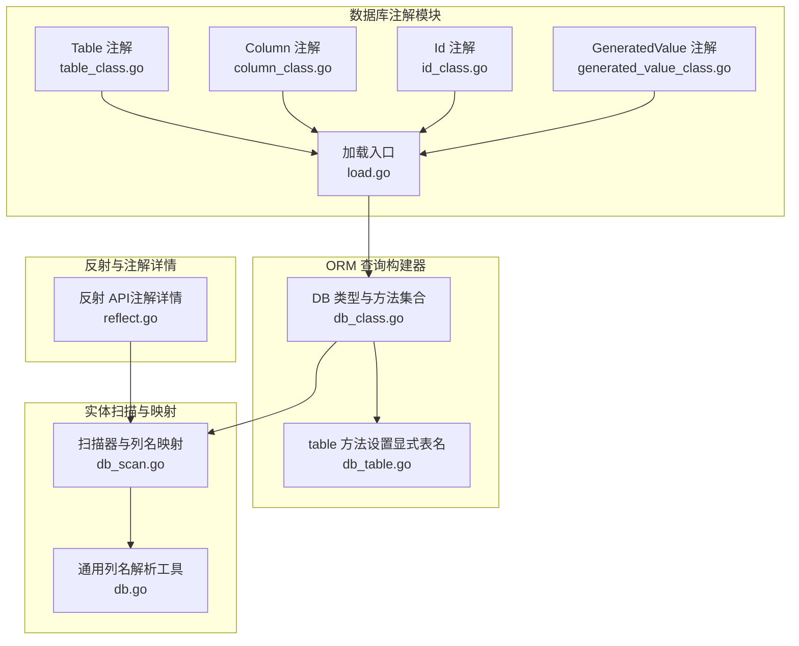
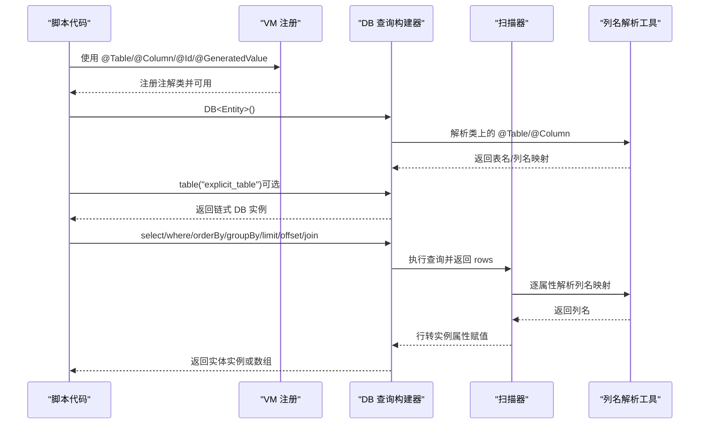
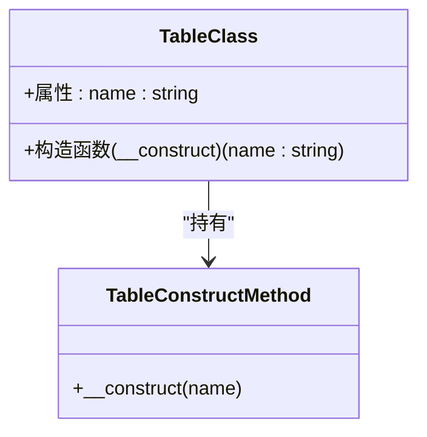
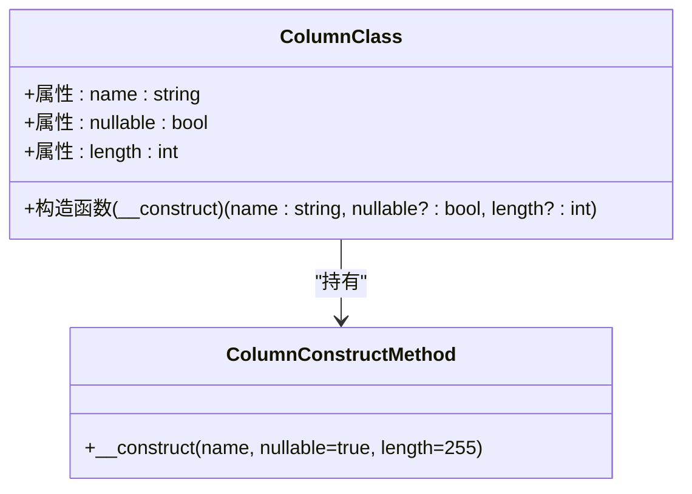
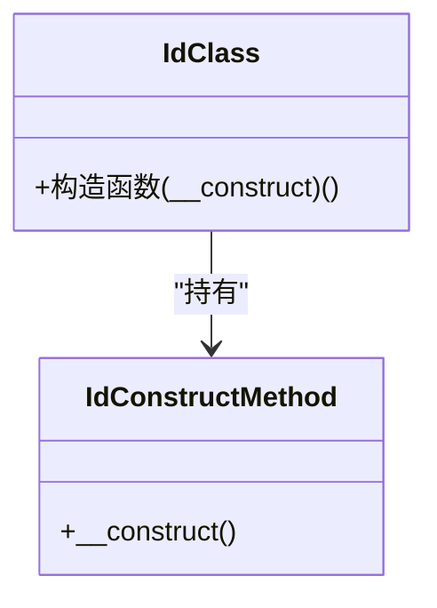
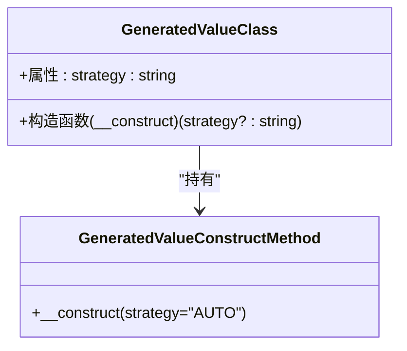
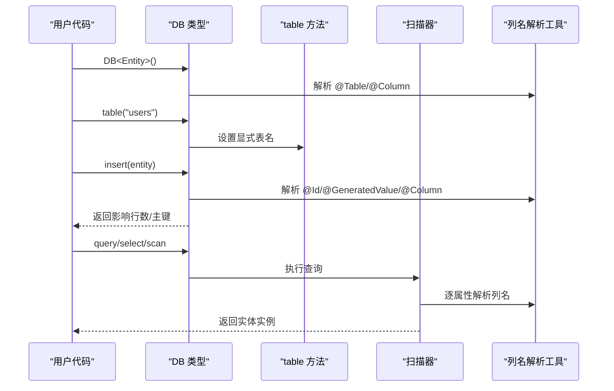
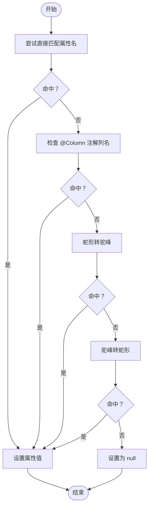
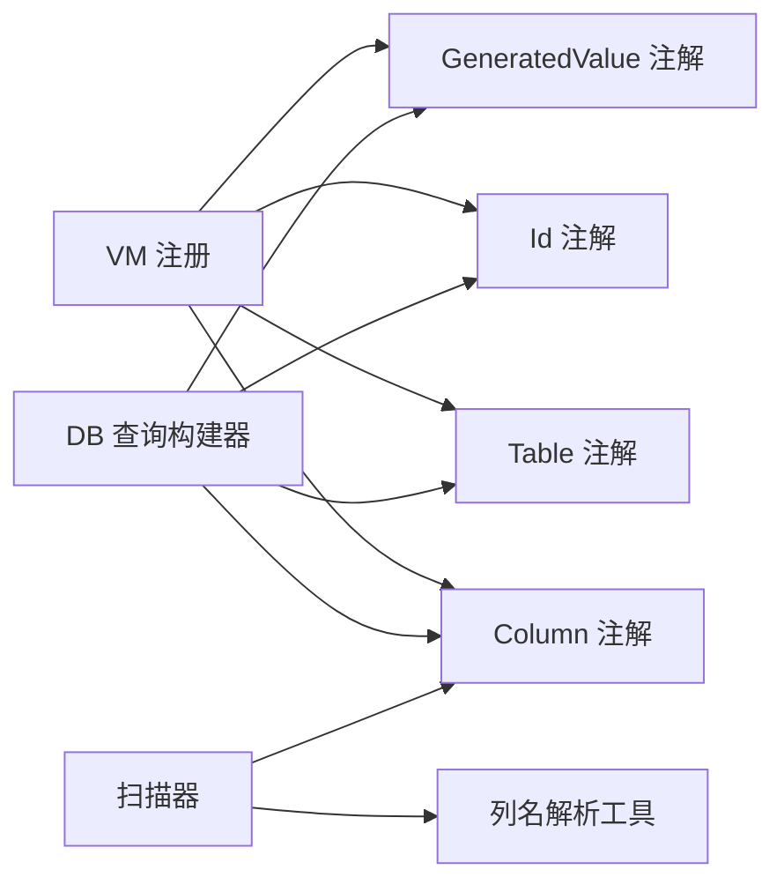

# 注解系统

<cite>
**本文引用的文件**
- [table_class.go](file://std/database/annotation/table_class.go)
- [column_class.go](file://std/database/annotation/column_class.go)
- [id_class.go](file://std/database/annotation/id_class.go)
- [generated_value_class.go](file://std/database/annotation/generated_value_class.go)
- [load.go](file://std/database/annotation/load.go)
- [example.zy](file://std/database/annotation/example.zy)
- [database-annotations.md](file://docs/database-annotations.md)
- [db_class.go](file://std/database/db_class.go)
- [db_table.go](file://std/database/db_table.go)
- [db_scan.go](file://std/database/db_scan.go)
- [db.go](file://std/database/db.go)
- [reflect.go](file://std/reflect/reflect.go)
- [readme.md](file://std/database/readme.md)
</cite>

## 目录
1. [简介](#简介)
2. [项目结构](#项目结构)
3. [核心组件](#核心组件)
4. [架构总览](#架构总览)
5. [详细组件分析](#详细组件分析)
6. [依赖分析](#依赖分析)
7. [性能考量](#性能考量)
8. [故障排查指南](#故障排查指南)
9. [结论](#结论)
10. [附录](#附录)

## 简介
本文件系统化介绍数据库注解体系，涵盖注解的定义、参数、行为以及与 ORM 查询构建器的协作机制。重点包括：
- 注解作用与参数：@Table、@Column、@Id、@GeneratedValue
- 与 ORM 查询构建器的配合：自动表名解析、列名映射、主键识别与自增处理
- 实体类最佳实践：字段类型映射、约束定义、索引配置建议
- 应用场景：代码生成、迁移脚本、文档生成的思路与落点

## 项目结构
数据库注解系统位于标准库的 database 子模块中，注解类由 VM 动态注册，配合反射与扫描器完成实体到数据库的双向映射。

**图表来源**
- [table_class.go:1-131](file://std/database/annotation/table_class.go#L1-L131)
- [column_class.go:1-160](file://std/database/annotation/column_class.go#L1-L160)
- [id_class.go:1-101](file://std/database/annotation/id_class.go#L1-L101)
- [generated_value_class.go:1-129](file://std/database/annotation/generated_value_class.go#L1-L129)
- [load.go:1-15](file://std/database/annotation/load.go#L1-L15)
- [db_class.go:1-168](file://std/database/db_class.go#L1-L168)
- [db_table.go:1-59](file://std/database/db_table.go#L1-L59)
- [db_scan.go:1-251](file://std/database/db_scan.go#L1-L251)
- [db.go:390-446](file://std/database/db.go#L390-L446)
- [reflect.go:60-93](file://std/reflect/reflect.go#L60-L93)

**章节来源**
- [load.go:1-15](file://std/database/annotation/load.go#L1-L15)
- [db_class.go:1-168](file://std/database/db_class.go#L1-L168)
- [db_table.go:1-59](file://std/database/db_table.go#L1-L59)
- [db_scan.go:1-251](file://std/database/db_scan.go#L1-L251)
- [db.go:390-446](file://std/database/db.go#L390-L446)
- [reflect.go:60-93](file://std/reflect/reflect.go#L60-L93)

## 核心组件
- 注解类与构造函数
  - Table：接收表名字符串，存储为注解实例属性，供 ORM 解析类时读取。
  - Column：接收 name、nullable、length 参数，存储为注解实例属性，用于列名映射与元数据。
  - Id：无参注解，标记主键字段。
  - GeneratedValue：接收 strategy（默认 AUTO），标记自动生成字段。
- 注解加载入口
  - 通过加载函数将四个注解类注册到 VM，使其可在脚本域中被使用。
- ORM 查询构建器
  - DB 类型提供链式 API，支持 table、where、select、orderBy、groupBy、limit、offset、join、insert、update、delete、query、exec 等。
  - table 方法用于显式设置表名，覆盖类上的 @Table 注解。
- 实体扫描与映射
  - 扫描器根据列名与属性名的多种匹配策略，将数据库行映射到实体类属性；同时支持注解列名解析。
  - 通用列名解析工具优先使用属性名，若存在 @Column 且列名与属性名不一致，则使用注解列名。

**章节来源**
- [table_class.go:16-131](file://std/database/annotation/table_class.go#L16-L131)
- [column_class.go:16-160](file://std/database/annotation/column_class.go#L16-L160)
- [id_class.go:13-101](file://std/database/annotation/id_class.go#L13-L101)
- [generated_value_class.go:16-129](file://std/database/annotation/generated_value_class.go#L16-L129)
- [load.go:7-14](file://std/database/annotation/load.go#L7-L14)
- [db_class.go:11-168](file://std/database/db_class.go#L11-L168)
- [db_table.go:10-59](file://std/database/db_table.go#L10-L59)
- [db_scan.go:22-251](file://std/database/db_scan.go#L22-L251)
- [db.go:398-446](file://std/database/db.go#L398-L446)

## 架构总览
注解系统与 ORM 的交互流程如下：

**图表来源**
- [load.go:7-14](file://std/database/annotation/load.go#L7-L14)
- [db_class.go:11-168](file://std/database/db_class.go#L11-L168)
- [db_table.go:14-30](file://std/database/db_table.go#L14-L30)
- [db_scan.go:22-96](file://std/database/db_scan.go#L22-L96)
- [db.go:398-446](file://std/database/db.go#L398-L446)

## 详细组件分析

### Table 注解
- 作用：为实体类指定数据库表名，支持自动表名与显式表名覆盖。
- 参数：name（字符串），必填。
- 行为：构造函数接收 name 并保存到注解实例；ORM 在解析类时读取该值决定表名。
- 与 ORM 协作：若未显式调用 table()，ORM 会尝试从类注解中获取表名；显式 table() 会覆盖注解。

**图表来源**
- [table_class.go:16-131](file://std/database/annotation/table_class.go#L16-L131)

**章节来源**
- [table_class.go:16-131](file://std/database/annotation/table_class.go#L16-L131)
- [db_table.go:14-30](file://std/database/db_table.go#L14-L30)
- [readme.md:35-64](file://std/database/readme.md#L35-L64)

### Column 注解
- 作用：将类属性映射到数据库列，支持列名与属性名不一致。
- 参数：name（字符串）、nullable（布尔，默认 true）、length（整数，默认 255）。
- 行为：构造函数接收三个参数并保存到注解实例；ORM 在生成 SQL 或扫描时读取列名与约束信息。
- 与 ORM 协作：扫描器优先使用属性名匹配列；若匹配失败，再检查注解列名；最后尝试命名风格转换（驼峰/蛇形）。

**图表来源**
- [column_class.go:16-160](file://std/database/annotation/column_class.go#L16-L160)

**章节来源**
- [column_class.go:16-160](file://std/database/annotation/column_class.go#L16-L160)
- [db_scan.go:64-95](file://std/database/db_scan.go#L64-L95)
- [db.go:398-446](file://std/database/db.go#L398-L446)

### Id 注解
- 作用：标识主键字段，支持单主键与复合主键。
- 参数：无。
- 行为：构造函数无参；ORM 在插入/更新/删除时识别主键字段。
- 与 ORM 协作：插入时跳过主键（自增）；查询条件中常用主键字段。

**图表来源**
- [id_class.go:13-101](file://std/database/annotation/id_class.go#L13-L101)

**章节来源**
- [id_class.go:13-101](file://std/database/annotation/id_class.go#L13-L101)
- [database-annotations.md:94-125](file://docs/database-annotations.md#L94-L125)

### GeneratedValue 注解
- 作用：标识自动生成的字段（如自增主键、时间戳默认值）。
- 参数：strategy（字符串，默认 "AUTO"）。
- 行为：构造函数接收 strategy 并保存；ORM 在插入时忽略自动生成字段。
- 与 ORM 协作：与 @Id 组合常用于自增主键；也可用于创建/更新时间戳字段。

**图表来源**
- [generated_value_class.go:16-129](file://std/database/annotation/generated_value_class.go#L16-L129)

**章节来源**
- [generated_value_class.go:16-129](file://std/database/annotation/generated_value_class.go#L16-L129)
- [database-annotations.md:126-160](file://docs/database-annotations.md#L126-L160)

### 注解加载与注册
- 通过加载函数将四个注解类注册到 VM，使脚本域可使用注解语法。
- 注解类均实现特性注解接口，构造函数仅接收注解声明的参数。

**章节来源**
- [load.go:7-14](file://std/database/annotation/load.go#L7-L14)
- [table_class.go:41-46](file://std/database/annotation/table_class.go#L41-L46)
- [column_class.go:44-46](file://std/database/annotation/column_class.go#L44-L46)
- [id_class.go:37-39](file://std/database/annotation/id_class.go#L37-L39)
- [generated_value_class.go:41-43](file://std/database/annotation/generated_value_class.go#L41-L43)

### ORM 查询构建器与注解协作
- DB 类型提供链式 API，支持 table、where、select、orderBy、groupBy、limit、offset、join、insert、update、delete、query、exec。
- table 方法用于显式设置表名，覆盖类上的 @Table 注解。
- 插入/更新/扫描时，ORM 读取注解以确定列名、主键与自动生成字段。

**图表来源**
- [db_class.go:11-168](file://std/database/db_class.go#L11-L168)
- [db_table.go:14-30](file://std/database/db_table.go#L14-L30)
- [db_scan.go:22-96](file://std/database/db_scan.go#L22-L96)
- [db.go:398-446](file://std/database/db.go#L398-L446)

**章节来源**
- [db_class.go:11-168](file://std/database/db_class.go#L11-L168)
- [db_table.go:14-30](file://std/database/db_table.go#L14-L30)
- [db_scan.go:22-96](file://std/database/db_scan.go#L22-L96)
- [db.go:398-446](file://std/database/db.go#L398-L446)

### 列名映射与命名转换
- 匹配策略（扫描器）：
  1) 直接匹配属性名
  2) 若失败，检查 @Column 注解列名
  3) 再失败，尝试下划线转驼峰（user_name → userName）
  4) 再失败，尝试驼峰转下划线（userName → user_name）
  5) 最终仍失败，属性设为 null
- 通用列名解析工具：
  - 优先使用属性名；若存在有效 @Column 且列名与属性名不一致，则使用注解列名。

**图表来源**
- [db_scan.go:64-95](file://std/database/db_scan.go#L64-L95)
- [db_scan.go:136-167](file://std/database/db_scan.go#L136-L167)
- [db.go:398-446](file://std/database/db.go#L398-L446)

**章节来源**
- [db_scan.go:22-251](file://std/database/db_scan.go#L22-L251)
- [db.go:398-446](file://std/database/db.go#L398-L446)

### 实体类定义最佳实践
- 命名规范：表名与列名清晰、可读性强，避免使用缩写或无意义名称。
- 注解顺序：@Table → @Id → @GeneratedValue → @Column，逻辑清晰。
- 类型安全：为每个字段声明明确类型，便于扫描器正确转换。
- 数据库设计对应：实体字段与数据库表结构一一对应，必要时使用 @Column 映射。
- 继承与组合：抽象基类可统一主键与时间戳字段，子类复用注解。

**章节来源**
- [database-annotations.md:222-360](file://docs/database-annotations.md#L222-L360)
- [example.zy:1-41](file://std/database/annotation/example.zy#L1-L41)

### 代码生成、迁移脚本与文档生成
- 代码生成：基于注解解析表名与列名，生成实体类模板、DAO/Repository 接口与 CRUD 模板。
- 迁移脚本：根据注解生成建表/改表 SQL，自动处理列类型、长度、非空与默认值。
- 文档生成：从注解提取实体关系图与字段说明，生成 API 文档与数据库字典。

**章节来源**
- [database-annotations.md:14-160](file://docs/database-annotations.md#L14-L160)
- [example.zy:1-41](file://std/database/annotation/example.zy#L1-L41)

## 依赖分析
- 注解类依赖关系
  - 四个注解类彼此独立，均实现特性注解接口，构造函数仅依赖注解声明参数。
- 与 VM 的耦合
  - 通过加载入口集中注册，降低外部耦合。
- 与 ORM 的耦合
  - ORM 通过反射与扫描器读取注解，形成松耦合的数据契约。
- 与反射的耦合
  - 反射 API 提供注解详情查询能力，辅助调试与文档生成。

**图表来源**
- [load.go:7-14](file://std/database/annotation/load.go#L7-L14)
- [db_class.go:11-168](file://std/database/db_class.go#L11-L168)
- [db_scan.go:22-96](file://std/database/db_scan.go#L22-L96)
- [db.go:398-446](file://std/database/db.go#L398-L446)

**章节来源**
- [load.go:7-14](file://std/database/annotation/load.go#L7-L14)
- [db_class.go:11-168](file://std/database/db_class.go#L11-L168)
- [db_scan.go:22-96](file://std/database/db_scan.go#L22-L96)
- [db.go:398-446](file://std/database/db.go#L398-L446)
- [reflect.go:60-93](file://std/reflect/reflect.go#L60-L93)

## 性能考量
- 注解解析成本：仅在类加载与首次使用时进行注解解析，后续链式调用不重复解析。
- 列名匹配策略：优先直接匹配，减少不必要的命名转换；命名转换仅在直接匹配失败时触发。
- 扫描器优化：按列名建立映射表，提升查找效率；批量扫描时复用扫描目标切片。
- 数值范围处理：对超出整型范围的数值转换为字符串，避免溢出与精度丢失。

**章节来源**
- [db_scan.go:36-47](file://std/database/db_scan.go#L36-L47)
- [db_scan.go:170-222](file://std/database/db_scan.go#L170-L222)
- [db_scan.go:186-207](file://std/database/db_scan.go#L186-L207)

## 故障排查指南
- 缺少注解参数
  - 现象：构造函数抛出参数缺失错误。
  - 排查：确认注解参数是否齐全；例如 @GeneratedValue 默认 strategy 为 "AUTO"。
- 列名不匹配
  - 现象：扫描后属性值为 null。
  - 排查：检查 @Column 注解列名；确认数据库列名与实体属性名的命名风格一致性。
- 表名覆盖
  - 现象：显式 table() 未生效。
  - 排查：确认是否正确调用 table() 并在链式调用中保持其位置。
- 反射与注解详情
  - 现象：需要查看注解详情但无法获取。
  - 排查：使用反射 API 获取注解详情，辅助定位注解配置问题。

**章节来源**
- [table_class.go:111-130](file://std/database/annotation/table_class.go#L111-L130)
- [generated_value_class.go:109-128](file://std/database/annotation/generated_value_class.go#L109-L128)
- [db_table.go:14-30](file://std/database/db_table.go#L14-L30)
- [reflect.go:60-93](file://std/reflect/reflect.go#L60-L93)

## 结论
数据库注解系统通过简洁的注解语义与完善的扫描/解析机制，实现了实体类与数据库表结构的高一致性映射。结合 ORM 查询构建器，开发者可以以声明式的方式完成常见数据库操作，并在需要时通过原生 SQL 语句获得最大灵活性。遵循最佳实践与命名规范，可显著提升代码可维护性与开发效率。

## 附录
- 快速参考
  - @Table：指定表名，支持自动表名与显式覆盖。
  - @Column：映射列名，支持 nullable 与 length。
  - @Id：标识主键字段，支持复合主键。
  - @GeneratedValue：标识自动生成字段，支持 strategy。
- 使用示例路径
  - 注解示例：[example.zy:1-41](file://std/database/annotation/example.zy#L1-L41)
  - ORM 使用说明：[readme.md:1-168](file://std/database/readme.md#L1-L168)
  - 注解文档：[database-annotations.md:1-435](file://docs/database-annotations.md#L1-L435)