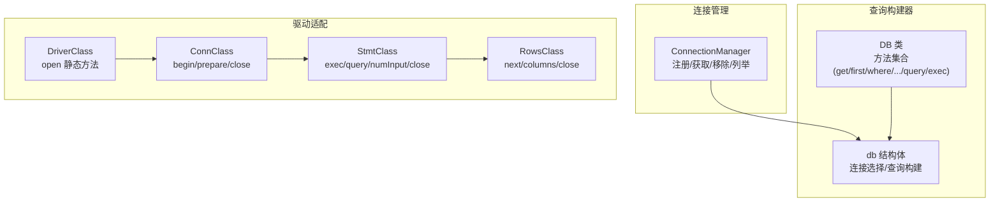
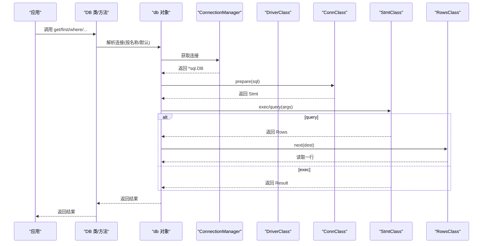
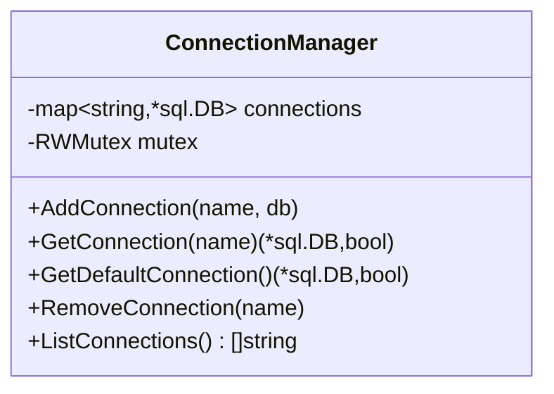
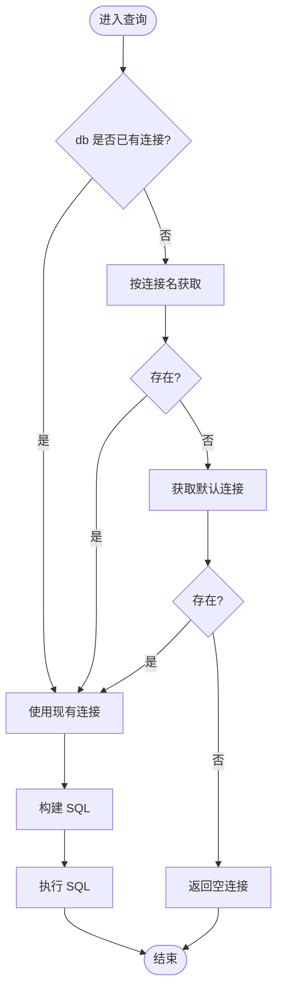
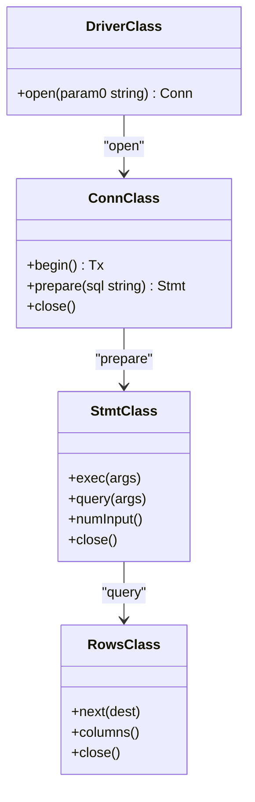
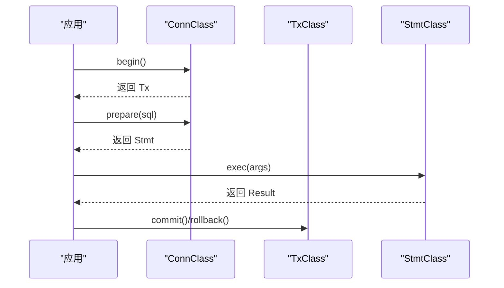
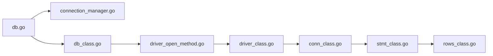

# 连接管理

<cite>
**本文引用的文件**
- [connection_manager.go](file://std/database/connection_manager.go)
- [db.go](file://std/database/db.go)
- [db_class.go](file://std/database/db_class.go)
- [driver_class.go](file://std/database/driver/driver_class.go)
- [driver_open_method.go](file://std/database/driver/driver_open_method.go)
- [conn_class.go](file://std/database/driver/conn_class.go)
- [conn_begin_method.go](file://std/database/driver/conn_begin_method.go)
- [conn_prepare_method.go](file://std/database/driver/conn_prepare_method.go)
- [stmt_class.go](file://std/database/driver/stmt_class.go)
- [stmt_exec_method.go](file://std/database/driver/stmt_exec_method.go)
- [stmt_query_method.go](file://std/database/driver/stmt_query_method.go)
- [rows_class.go](file://std/database/driver/rows_class.go)
- [rows_next_method.go](file://std/database/driver/rows_next_method.go)
- [database.md](file://docs/database.md)
</cite>

## 目录
1. [简介](#简介)
2. [项目结构](#项目结构)
3. [核心组件](#核心组件)
4. [架构总览](#架构总览)
5. [详细组件分析](#详细组件分析)
6. [依赖分析](#依赖分析)
7. [性能考虑](#性能考虑)
8. [故障排查指南](#故障排查指南)
9. [结论](#结论)
10. [附录](#附录)

## 简介
本章节聚焦于数据库连接管理与驱动适配，系统性阐述连接池工作原理、连接管理器实现机制、连接创建/复用/回收流程，以及对 MySQL、PostgreSQL 等数据库驱动的适配方式。同时提供连接故障处理、重连策略、连接状态监控的实用技巧，并给出性能调优建议与最佳实践。

## 项目结构
围绕连接管理与驱动适配的关键文件组织如下：
- 连接管理器：负责全局连接注册、获取与枚举
- 查询构建器与连接选择：根据连接名称或默认连接执行 SQL
- 驱动层适配：基于 Go 标准库 database/sql/driver 的接口封装，暴露 begin/prepare/exec/query 等能力
- 文档与示例：提供连接注册、使用、事务、原生 SQL 等示例与最佳实践

图表来源
- [connection_manager.go:1-66](file://std/database/connection_manager.go#L1-L66)
- [db.go:1-446](file://std/database/db.go#L1-L446)
- [db_class.go:1-168](file://std/database/db_class.go#L1-L168)
- [driver_class.go:1-49](file://std/database/driver/driver_class.go#L1-L49)
- [conn_class.go:1-59](file://std/database/driver/conn_class.go#L1-L59)
- [stmt_class.go:1-64](file://std/database/driver/stmt_class.go#L1-L64)
- [rows_class.go:1-59](file://std/database/driver/rows_class.go#L1-L59)

章节来源
- [connection_manager.go:1-66](file://std/database/connection_manager.go#L1-L66)
- [db.go:1-446](file://std/database/db.go#L1-L446)
- [db_class.go:1-168](file://std/database/db_class.go#L1-L168)
- [driver_class.go:1-49](file://std/database/driver/driver_class.go#L1-L49)
- [conn_class.go:1-59](file://std/database/driver/conn_class.go#L1-L59)
- [stmt_class.go:1-64](file://std/database/driver/stmt_class.go#L1-L64)
- [rows_class.go:1-59](file://std/database/driver/rows_class.go#L1-L59)

## 核心组件
- 连接管理器 ConnectionManager
  - 提供 AddConnection、GetConnection、GetDefaultConnection、RemoveConnection、ListConnections 等能力
  - 使用互斥锁保证并发安全
- 查询构建器 db
  - 在执行前解析连接：优先使用显式连接名；否则回退到默认连接
  - 构建 SQL 语句并支持注解表名/列名映射
- 驱动适配层
  - DriverClass 暴露 open 静态方法，委托底层驱动 Open
  - ConnClass 暴露 begin/prepare/close
  - StmtClass 暴露 exec/query/numInput/close
  - RowsClass 暴露 next/columns/close

章节来源
- [connection_manager.go:1-66](file://std/database/connection_manager.go#L1-L66)
- [db.go:80-101](file://std/database/db.go#L80-L101)
- [driver_open_method.go:1-48](file://std/database/driver/driver_open_method.go#L1-L48)
- [conn_begin_method.go:1-35](file://std/database/driver/conn_begin_method.go#L1-L35)
- [conn_prepare_method.go:1-48](file://std/database/driver/conn_prepare_method.go#L1-L48)
- [stmt_exec_method.go:1-52](file://std/database/driver/stmt_exec_method.go#L1-L52)
- [stmt_query_method.go:1-52](file://std/database/driver/stmt_query_method.go#L1-L52)
- [rows_next_method.go:1-51](file://std/database/driver/rows_next_method.go#L1-L51)

## 架构总览
下图展示从应用层到驱动层的调用链路，以及连接管理器在其中的角色。

图表来源
- [db.go:80-101](file://std/database/db.go#L80-L101)
- [connection_manager.go:36-47](file://std/database/connection_manager.go#L36-L47)
- [driver_open_method.go:16-30](file://std/database/driver/driver_open_method.go#L16-L30)
- [conn_prepare_method.go:16-30](file://std/database/driver/conn_prepare_method.go#L16-L30)
- [stmt_exec_method.go:16-34](file://std/database/driver/stmt_exec_method.go#L16-L34)
- [stmt_query_method.go:16-34](file://std/database/driver/stmt_query_method.go#L16-L34)
- [rows_next_method.go:16-33](file://std/database/driver/rows_next_method.go#L16-L33)

## 详细组件分析

### 连接管理器 ConnectionManager
- 设计要点
  - 全局单例：通过 once 保证只初始化一次
  - 并发安全：读写锁保护连接映射
  - 名称化连接：以字符串为键存储多个连接
- 关键行为
  - 注册：AddConnection(name, db)
  - 获取：GetConnection(name)、GetDefaultConnection()
  - 移除：RemoveConnection(name)
  - 列举：ListConnections()

图表来源
- [connection_manager.go:8-65](file://std/database/connection_manager.go#L8-L65)

章节来源
- [connection_manager.go:1-66](file://std/database/connection_manager.go#L1-L66)

### 查询构建器与连接选择
- 连接选择策略
  - 若 db 对象已持有连接则直接使用
  - 否则按连接名从 ConnectionManager 获取
  - 再否则尝试默认连接
  - 若均不可用则返回空
- 查询构建
  - 支持 where/select/order/group/limit/offset/join
  - 支持注解表名/列名映射（类注解 Table/Column）

图表来源
- [db.go:80-101](file://std/database/db.go#L80-L101)
- [db.go:154-207](file://std/database/db.go#L154-L207)

章节来源
- [db.go:80-101](file://std/database/db.go#L80-L101)
- [db.go:154-207](file://std/database/db.go#L154-L207)

### 驱动适配层（database/sql/driver）
- DriverClass
  - open 静态方法：调用底层驱动 Open(url)，返回 Conn 包装
- ConnClass
  - begin：开启事务，返回 Tx 包装
  - prepare：预编译 SQL，返回 Stmt 包装
  - close：关闭连接
- StmtClass
  - exec：执行写操作，返回 Result
  - query：执行读操作，返回 Rows
  - numInput/close：辅助方法
- RowsClass
  - next：读取下一行
  - columns：列信息
  - close：关闭结果集

图表来源
- [driver_class.go:10-49](file://std/database/driver/driver_class.go#L10-L49)
- [conn_class.go:10-59](file://std/database/driver/conn_class.go#L10-L59)
- [stmt_class.go:10-64](file://std/database/driver/stmt_class.go#L10-L64)
- [rows_class.go:10-59](file://std/database/driver/rows_class.go#L10-L59)

章节来源
- [driver_class.go:1-49](file://std/database/driver/driver_class.go#L1-L49)
- [conn_class.go:1-59](file://std/database/driver/conn_class.go#L1-L59)
- [stmt_class.go:1-64](file://std/database/driver/stmt_class.go#L1-L64)
- [rows_class.go:1-59](file://std/database/driver/rows_class.go#L1-L59)

### 事务与预编译执行序列

图表来源
- [conn_begin_method.go:14-21](file://std/database/driver/conn_begin_method.go#L14-L21)
- [conn_prepare_method.go:16-30](file://std/database/driver/conn_prepare_method.go#L16-L30)
- [stmt_exec_method.go:16-34](file://std/database/driver/stmt_exec_method.go#L16-L34)

## 依赖分析
- 组件耦合
  - db 依赖 ConnectionManager 进行连接选择
  - 驱动层通过 database/sql/driver 接口抽象，向上暴露统一的 Conn/Stmt/Rows 包装
- 外部依赖
  - Go 标准库 database/sql 与 database/sql/driver
  - 业务侧通过 open("mysql", ...) 或 open("postgres", ...) 注册驱动
- 潜在风险
  - 并发访问 ConnectionManager 时的锁竞争
  - 驱动层异常需正确上抛，避免静默失败

图表来源
- [db.go:1-446](file://std/database/db.go#L1-L446)
- [connection_manager.go:1-66](file://std/database/connection_manager.go#L1-L66)
- [db_class.go:1-168](file://std/database/db_class.go#L1-L168)
- [driver_open_method.go:1-48](file://std/database/driver/driver_open_method.go#L1-L48)
- [driver_class.go:1-49](file://std/database/driver/driver_class.go#L1-L49)
- [conn_class.go:1-59](file://std/database/driver/conn_class.go#L1-L59)
- [stmt_class.go:1-64](file://std/database/driver/stmt_class.go#L1-L64)
- [rows_class.go:1-59](file://std/database/driver/rows_class.go#L1-L59)

章节来源
- [db.go:1-446](file://std/database/db.go#L1-L446)
- [connection_manager.go:1-66](file://std/database/connection_manager.go#L1-L66)
- [driver_open_method.go:1-48](file://std/database/driver/driver_open_method.go#L1-L48)

## 性能考虑
- 连接池参数（建议）
  - 最大连接数：依据并发请求峰值与数据库承载能力设定，避免过度占用资源
  - 空闲连接数：维持适度空闲连接以降低频繁创建/销毁开销
  - 连接生命周期：设置合理的最大生命周期，定期回收老化连接
  - 超时配置：查询超时、连接超时、握手超时，避免线程长时间阻塞
- 连接管理策略
  - 优先复用：通过 ConnectionManager 按名称/默认连接复用
  - 预热连接：应用启动阶段预创建少量连接
  - 分库分表：按业务拆分连接，避免热点集中
- 查询优化
  - 使用参数化查询，避免拼接 SQL
  - 限制字段与分页，减少网络与内存压力
  - 合理索引，配合 EXPLAIN 分析慢查询
- 并发与锁
  - ConnectionManager 已内置互斥锁，避免在业务层重复加锁
  - 控制高并发下的连接创建速率，防止瞬时抖动

## 故障排查指南
- 连接失败
  - 使用 open 成功后调用 ping 校验连通性
  - 捕获异常并记录驱动返回的错误信息
- 事务异常
  - 出错即回滚，确保一致性
  - 注意 begin/commit/rollback 的配对使用
- 查询异常
  - 使用原生 SQL 进行调试，结合 EXPLAIN 分析
  - 检查参数绑定与占位符数量
- 连接泄漏
  - 确保每个 Rows/Stmt 在使用后及时 close
  - 对外暴露的接口需保证异常路径也能释放资源
- 监控与诊断
  - 记录连接总数、活跃数、等待队列长度
  - 观察慢查询与错误率，定位瓶颈

章节来源
- [database.md:584-628](file://docs/database.md#L584-L628)
- [stmt_query_method.go:16-34](file://std/database/driver/stmt_query_method.go#L16-L34)
- [stmt_exec_method.go:16-34](file://std/database/driver/stmt_exec_method.go#L16-L34)
- [rows_next_method.go:16-33](file://std/database/driver/rows_next_method.go#L16-L33)

## 结论
该数据库模块通过 ConnectionManager 实现多连接管理，结合查询构建器与驱动适配层，形成从应用到数据库的清晰调用链。驱动层遵循 database/sql/driver 接口，具备良好的扩展性与可移植性。配合合理的连接池参数、事务与异常处理策略，可在保证稳定性的同时获得良好性能。

## 附录

### 不同数据库驱动的适配方式
- MySQL
  - 通过 open("mysql", dsn) 注册驱动
  - DSN 示例：用户名:密码@tcp(主机:端口)/数据库?参数
- PostgreSQL
  - 通过 open("postgres", dsn) 注册驱动
  - DSN 示例：host=主机 port=端口 dbname=数据库 user=用户名 password=密码
- 其他驱动
  - 任何实现 database/sql/driver.Driver 的驱动均可通过 DriverClass.open 使用

章节来源
- [driver_open_method.go:16-30](file://std/database/driver/driver_open_method.go#L16-L30)
- [driver_class.go:10-15](file://std/database/driver/driver_class.go#L10-L15)
- [database.md:18-33](file://docs/database.md#L18-L33)

### 连接配置与参数建议
- 最大连接数
  - 建议：并发峰值 × 2 ~ 3
- 空闲连接数
  - 建议：最大连接数的 20% ~ 40%
- 连接超时
  - 建议：连接超时 5~10s，查询超时 10~60s
- 生命周期
  - 建议：连接最大生命周期 5~15 分钟，定期回收

### 连接管理器 API 一览
- 注册/获取/移除/列举
  - AddConnection(name, db)
  - GetConnection(name)、GetDefaultConnection()
  - RemoveConnection(name)
  - ListConnections()

章节来源
- [connection_manager.go:29-65](file://std/database/connection_manager.go#L29-L65)