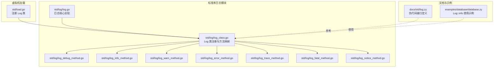
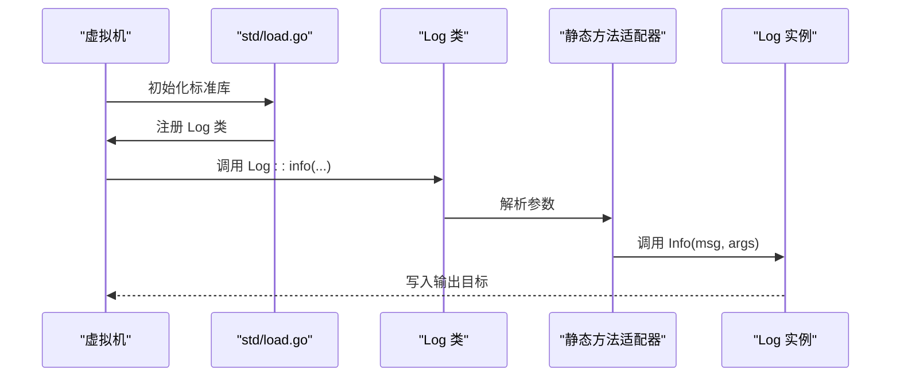
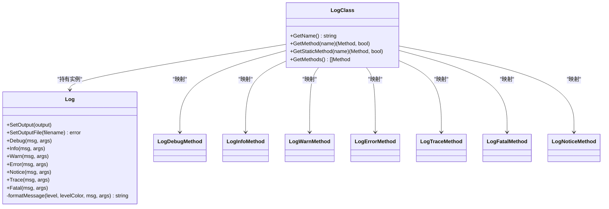
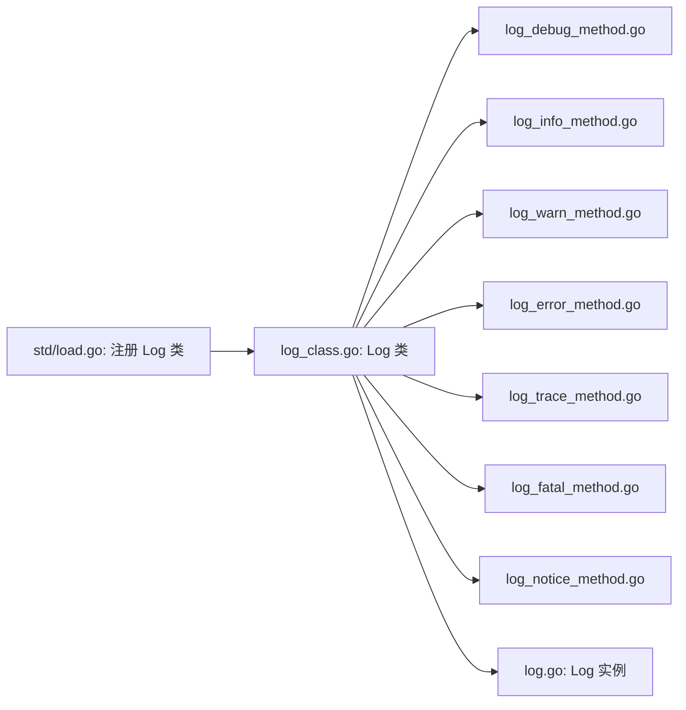

# 日志模块

<cite>
**本文引用的文件**
- [std/log/log.go](file://std/log/log.go)
- [std/log/log_class.go](file://std/log/log_class.go)
- [std/log/log_debug_method.go](file://std/log/log_debug_method.go)
- [std/log/log_info_method.go](file://std/log/log_info_method.go)
- [std/log/log_warn_method.go](file://std/log/log_warn_method.go)
- [std/log/log_error_method.go](file://std/log/log_error_method.go)
- [std/log/log_trace_method.go](file://std/log/log_trace_method.go)
- [std/log/log_fatal_method.go](file://std/log/log_fatal_method.go)
- [std/log/log_notice_method.go](file://std/log/log_notice_method.go)
- [docs/std/log.zy](file://docs/std/log.zy)
- [examples/database/database.zy](file://examples/database/database.zy)
- [std/load.go](file://std/load.go)
</cite>

## 目录
1. [简介](#简介)
2. [项目结构](#项目结构)
3. [核心组件](#核心组件)
4. [架构概览](#架构概览)
5. [详细组件分析](#详细组件分析)
6. [依赖分析](#依赖分析)
7. [性能考虑](#性能考虑)
8. [故障排查指南](#故障排查指南)
9. [结论](#结论)
10. [附录](#附录)

## 简介
本文件为日志模块的详细使用文档，聚焦于 Log 类的日志记录能力与扩展用法。内容涵盖：
- 日志级别：debug、info、warn、error、trace、fatal、notice 的使用方式与行为差异
- 日志格式化选项与输出目标配置
- 日志轮转策略建议（基于现有实现的限制与扩展思路）
- 日志过滤、命名空间日志、结构化日志等高级主题
- 生产环境最佳实践：性能、存储、监控集成
- 与其他模块的日志集成示例与故障排查技巧

## 项目结构
日志模块位于标准库目录下，采用“类 + 方法适配器”的结构组织，便于在虚拟机环境中注册为可调用的静态类。

**图示来源**
- [std/log/log.go:24-109](file://std/log/log.go#L24-L109)
- [std/log/log_class.go:8-113](file://std/log/log_class.go#L8-L113)
- [std/log/log_debug_method.go:11-61](file://std/log/log_debug_method.go#L11-L61)
- [std/log/log_info_method.go:11-61](file://std/log/log_info_method.go#L11-L61)
- [std/log/log_warn_method.go:11-60](file://std/log/log_warn_method.go#L11-L60)
- [std/log/log_error_method.go:11-61](file://std/log/log_error_method.go#L11-L61)
- [std/log/log_trace_method.go:11-61](file://std/log/log_trace_method.go#L11-L61)
- [std/log/log_fatal_method.go:11-60](file://std/log/log_fatal_method.go#L11-L60)
- [std/log/log_notice_method.go:11-61](file://std/log/log_notice_method.go#L11-L61)
- [docs/std/log.zy:15-73](file://docs/std/log.zy#L15-L73)
- [examples/database/database.zy:18-206](file://examples/database/database.zy#L18-L206)
- [std/load.go:14-38](file://std/load.go#L14-L38)

**章节来源**
- [std/log/log.go:24-109](file://std/log/log.go#L24-L109)
- [std/log/log_class.go:8-113](file://std/log/log_class.go#L8-L113)
- [docs/std/log.zy:15-73](file://docs/std/log.zy#L15-L73)
- [examples/database/database.zy:18-206](file://examples/database/database.zy#L18-L206)
- [std/load.go:14-38](file://std/load.go#L14-L38)

## 核心组件
- Log 结构体：封装输出目标与格式化逻辑，提供各日志级别方法
- Log 类：在虚拟机中注册为静态类，暴露 debug/info/warn/error/trace/fatal/notice 方法
- 方法适配器：每个级别对应一个静态方法适配器，负责参数校验与调用底层 Log 实例

关键点：
- 输出目标默认为标准输出；可通过设置输出流或输出到文件进行重定向
- 每条日志包含时间戳、级别、消息正文与可选参数列表
- Fatal 级别会写入后终止进程

**章节来源**
- [std/log/log.go:24-109](file://std/log/log.go#L24-L109)
- [std/log/log_class.go:21-113](file://std/log/log_class.go#L21-L113)
- [std/log/log_debug_method.go:11-61](file://std/log/log_debug_method.go#L11-L61)
- [std/log/log_info_method.go:11-61](file://std/log/log_info_method.go#L11-L61)
- [std/log/log_warn_method.go:11-60](file://std/log/log_warn_method.go#L11-L60)
- [std/log/log_error_method.go:11-61](file://std/log/log_error_method.go#L11-L61)
- [std/log/log_trace_method.go:11-61](file://std/log/log_trace_method.go#L11-L61)
- [std/log/log_fatal_method.go:11-60](file://std/log/log_fatal_method.go#L11-L60)
- [std/log/log_notice_method.go:11-61](file://std/log/log_notice_method.go#L11-L61)

## 架构概览
Log 类在虚拟机启动时被注册，静态方法通过适配器将调用转发到底层 Log 实例。日志格式由核心实现统一处理，输出目标可替换。

**图示来源**
- [std/load.go:14-38](file://std/load.go#L14-L38)
- [std/log/log_class.go:78-96](file://std/log/log_class.go#L78-L96)
- [std/log/log_info_method.go:15-29](file://std/log/log_info_method.go#L15-L29)
- [std/log/log.go:92-102](file://std/log/log.go#L92-L102)

## 详细组件分析

### 日志级别与行为
- debug：调试级别，输出蓝色标识
- info：信息级别，输出绿色标识
- warn：警告级别，输出黄色标识
- error：错误级别，输出红色标识
- notice：通知级别，输出紫色标识
- trace：跟踪级别，输出青色标识
- fatal：致命错误，输出加粗红色标识并终止进程

参数约定：
- 第一个参数为消息字符串
- 第二个参数为可变参数数组（结构化上下文）

**图示来源**
- [std/log/log.go:24-109](file://std/log/log.go#L24-L109)
- [std/log/log_class.go:21-113](file://std/log/log_class.go#L21-L113)
- [std/log/log_debug_method.go:11-61](file://std/log/log_debug_method.go#L11-L61)
- [std/log/log_info_method.go:11-61](file://std/log/log_info_method.go#L11-L61)
- [std/log/log_warn_method.go:11-60](file://std/log/log_warn_method.go#L11-L60)
- [std/log/log_error_method.go:11-61](file://std/log/log_error_method.go#L11-L61)
- [std/log/log_trace_method.go:11-61](file://std/log/log_trace_method.go#L11-L61)
- [std/log/log_fatal_method.go:11-60](file://std/log/log_fatal_method.go#L11-L60)
- [std/log/log_notice_method.go:11-61](file://std/log/log_notice_method.go#L11-L61)

**章节来源**
- [std/log/log.go:67-109](file://std/log/log.go#L67-L109)
- [std/log/log_class.go:58-96](file://std/log/log_class.go#L58-L96)
- [std/log/log_debug_method.go:15-29](file://std/log/log_debug_method.go#L15-L29)
- [std/log/log_info_method.go:15-29](file://std/log/log_info_method.go#L15-L29)
- [std/log/log_warn_method.go:15-27](file://std/log/log_warn_method.go#L15-L27)
- [std/log/log_error_method.go:15-29](file://std/log/log_error_method.go#L15-L29)
- [std/log/log_trace_method.go:15-29](file://std/log/log_trace_method.go#L15-L29)
- [std/log/log_fatal_method.go:15-27](file://std/log/log_fatal_method.go#L15-L27)
- [std/log/log_notice_method.go:15-29](file://std/log/log_notice_method.go#L15-L29)

### 日志格式化与输出目标
- 时间戳格式：统一采用本地时间格式化
- 级别颜色：每个级别使用不同的控制台颜色，便于终端阅读
- 参数拼接：当存在可选参数时，会将其序列化后附加到消息尾部
- 输出目标：
  - 默认输出到标准输出
  - 支持设置任意 os.File 作为输出
  - 支持直接打开文件作为输出（追加模式）

注意：当前实现未内置日志轮转功能，如需轮转请结合外部工具或在应用侧进行封装。

**章节来源**
- [std/log/log.go:51-65](file://std/log/log.go#L51-L65)
- [std/log/log.go:36-49](file://std/log/log.go#L36-L49)

### 日志轮转策略（扩展建议）
由于当前实现未包含轮转逻辑，推荐以下策略（概念性说明）：
- 基于大小轮转：当日志文件超过阈值时重命名旧文件并创建新文件
- 基于时间轮转：按日/小时滚动，保留若干历史文件
- 压缩归档：对旧文件进行压缩以节省空间
- 外部工具：在部署层面使用 logrotate 或类似工具

[本节为通用实践说明，不涉及具体源码分析]

### 日志过滤、命名空间日志与结构化日志
- 日志过滤：可在应用层根据业务域或模块进行选择性输出；当前实现未提供内置过滤器
- 命名空间日志：可在消息中加入模块/命名空间前缀，便于区分来源
- 结构化日志：通过可选参数传递键值对或对象，便于下游解析与检索

[本节为通用实践说明，不涉及具体源码分析]

### 与其他模块的日志集成示例
- 在数据库示例中，使用 Log::info 记录连接建立、建表、CRUD 等关键步骤，便于追踪执行流程
- 建议在业务模块中统一使用 Log::info 记录入口与退出、关键状态变化；使用 Log::warn 记录潜在问题；使用 Log::error 记录异常；使用 Log::fatal 记录不可恢复错误并终止

**章节来源**
- [examples/database/database.zy:18-206](file://examples/database/database.zy#L18-L206)

## 依赖分析
- Log 类在标准库加载阶段注册到虚拟机
- Log 类的方法映射到各静态方法适配器
- 方法适配器负责参数校验与调用底层 Log 实例
- Log 实例负责格式化与输出

**图示来源**
- [std/load.go:26-31](file://std/load.go#L26-L31)
- [std/log/log_class.go:8-18](file://std/log/log_class.go#L8-L18)
- [std/log/log_debug_method.go:11-13](file://std/log/log_debug_method.go#L11-L13)
- [std/log/log_info_method.go:11-13](file://std/log/log_info_method.go#L11-L13)
- [std/log/log_warn_method.go:11-13](file://std/log/log_warn_method.go#L11-L13)
- [std/log/log_error_method.go:11-13](file://std/log/log_error_method.go#L11-L13)
- [std/log/log_trace_method.go:11-13](file://std/log/log_trace_method.go#L11-L13)
- [std/log/log_fatal_method.go:11-13](file://std/log/log_fatal_method.go#L11-L13)
- [std/log/log_notice_method.go:11-13](file://std/log/log_notice_method.go#L11-L13)
- [std/log/log.go:24-34](file://std/log/log.go#L24-L34)

**章节来源**
- [std/load.go:14-38](file://std/load.go#L14-L38)
- [std/log/log_class.go:8-18](file://std/log/log_class.go#L8-L18)

## 性能考虑
- 控制台颜色输出：在非终端环境下可能产生额外开销，建议在 CI 或无交互场景关闭颜色或改用纯文本
- 字符串拼接与序列化：可选参数过多会增加格式化成本，建议仅传递必要字段
- 输出目标：频繁切换输出目标或磁盘写入会影响性能，建议批量写入或异步化（需自行封装）
- 日志级别：在高并发路径上避免不必要的格式化，可通过条件判断先判定级别再格式化

[本节为通用性能建议，不涉及具体源码分析]

## 故障排查指南
- 参数缺失：静态方法适配器会在缺少必需参数时抛出异常，检查调用处是否提供了消息与参数数组
- 文件输出失败：设置文件输出时若打开失败会返回错误，检查文件路径权限与磁盘空间
- 终止进程：调用 fatal 后程序会立即退出，确认该行为符合预期
- 输出异常：若日志未出现，请检查输出目标是否被正确设置或文件句柄是否有效

**章节来源**
- [std/log/log_debug_method.go:17-25](file://std/log/log_debug_method.go#L17-L25)
- [std/log/log_info_method.go:17-25](file://std/log/log_info_method.go#L17-L25)
- [std/log/log_warn_method.go:16-24](file://std/log/log_warn_method.go#L16-L24)
- [std/log/log_error_method.go:17-25](file://std/log/log_error_method.go#L17-L25)
- [std/log/log_trace_method.go:17-25](file://std/log/log_trace_method.go#L17-L25)
- [std/log/log_fatal_method.go:16-24](file://std/log/log_fatal_method.go#L16-L24)
- [std/log/log_notice_method.go:17-25](file://std/log/log_notice_method.go#L17-L25)
- [std/log/log.go:42-49](file://std/log/log.go#L42-L49)
- [std/log/log.go:67-72](file://std/log/log.go#L67-L72)

## 结论
日志模块提供了简洁而实用的日志能力：多级别输出、彩色终端显示、可选参数与灵活的输出目标。对于生产环境，建议结合外部轮转工具与结构化日志实践，并在高并发场景中关注格式化与 I/O 成本。通过在业务模块中规范使用日志级别，可显著提升可观测性与排障效率。

## 附录

### API 定义（参考）
- Log 类提供以下静态方法：debug、info、warn、error、trace、fatal、notice
- 每个方法接收两个参数：消息字符串与可变参数数组

**章节来源**
- [docs/std/log.zy:15-73](file://docs/std/log.zy#L15-L73)

### 使用示例（数据库模块）
- 示例中大量使用 Log::info 记录数据库连接、建表、CRUD 等关键步骤

**章节来源**
- [examples/database/database.zy:18-206](file://examples/database/database.zy#L18-L206)