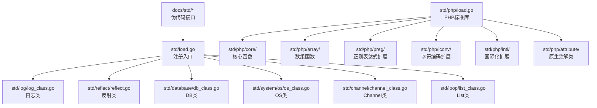
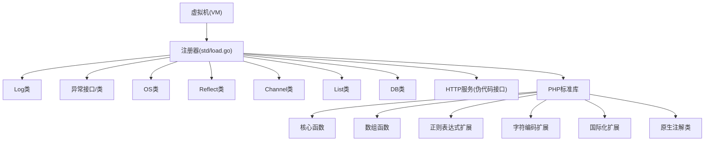
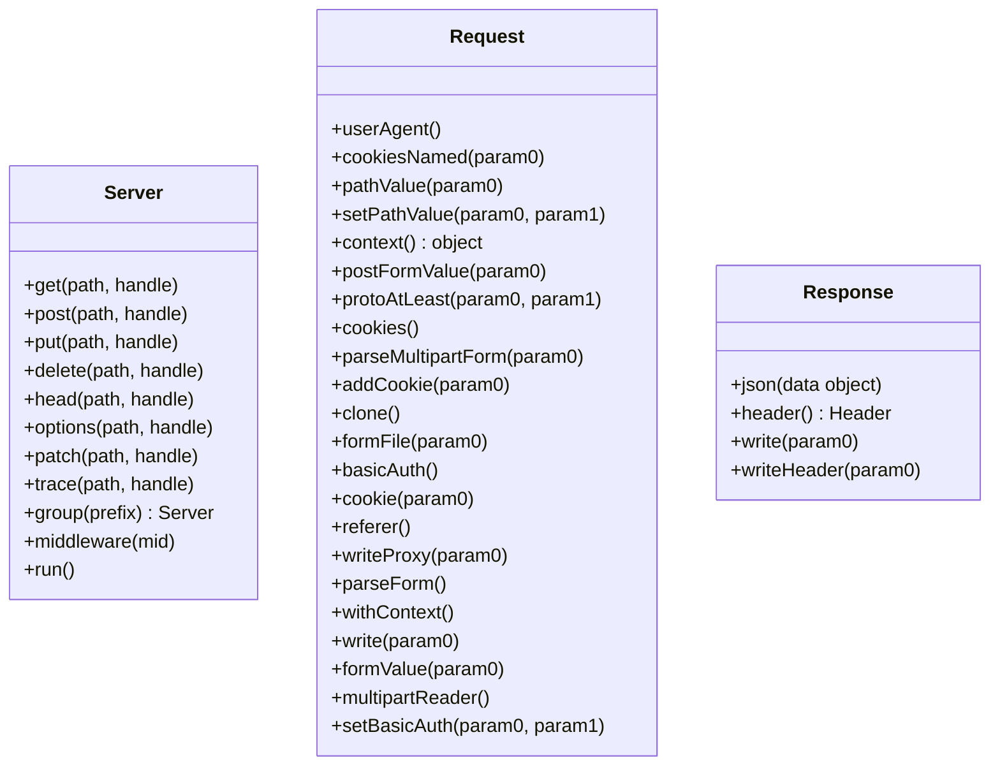
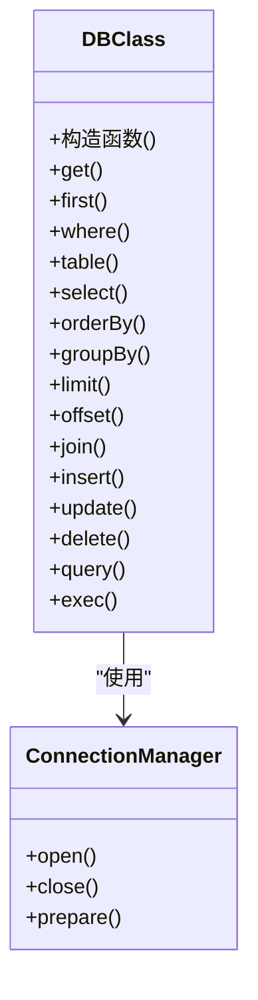
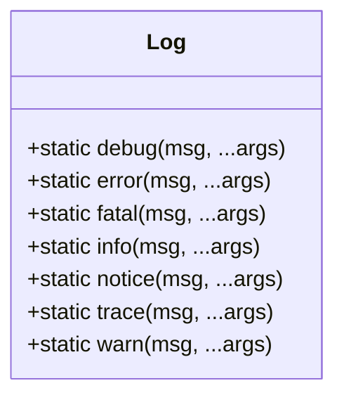
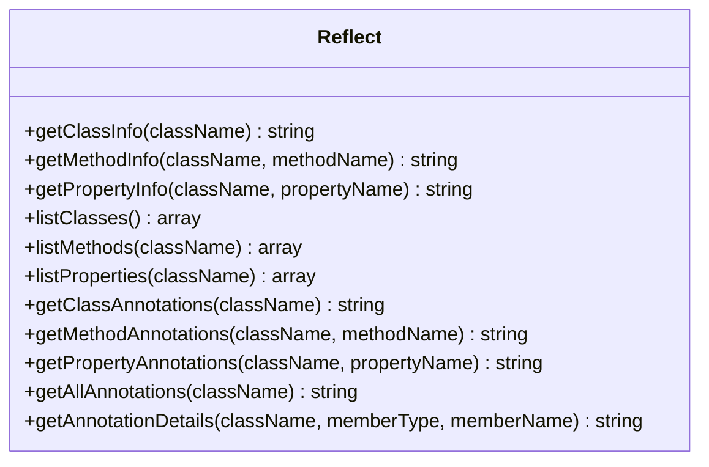
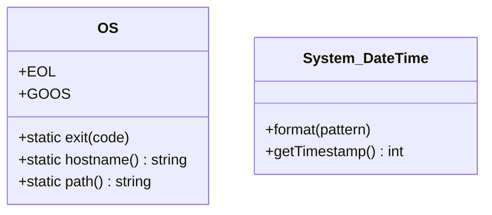
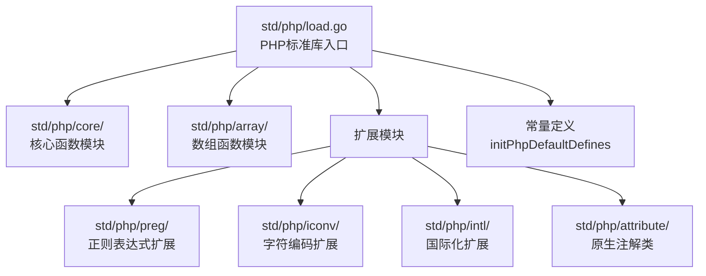
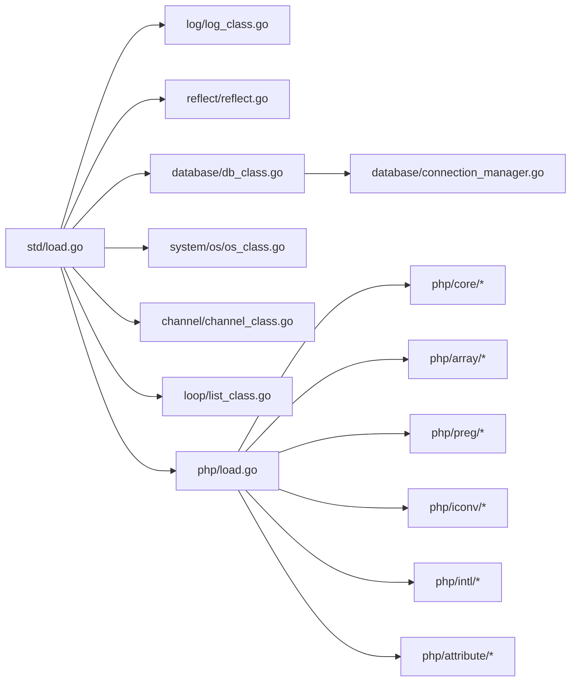

# 标准库模块

<cite>
**本文引用的文件**
- [std/load.go](file://std/load.go)
- [std/README.md](file://std/README.md)
- [std/php/load.go](file://std/php/load.go)
- [std/php/attribute/load.go](file://std/php/attribute/load.go)
- [std/php/preg/load.go](file://std/php/preg/load.go)
- [std/php/iconv/load.go](file://std/php/iconv/load.go)
- [std/php/intl/load.go](file://std/php/intl/load.go)
- [std/php/core/spl_autoload_register.go](file://std/php/core/spl_autoload_register.go)
- [std/php/core/set_exception_handler.go](file://std/php/core/set_exception_handler.go)
- [std/php/array/array_merge.go](file://std/php/array/array_merge.go)
- [std/log/log_class.go](file://std/log/log_class.go)
- [std/log/log.go](file://std/log/log.go)
- [docs/std/log.zy](file://docs/std/log.zy)
- [std/reflect/reflect.go](file://std/reflect/reflect.go)
- [docs/std/reflect.zy](file://docs/std/reflect.zy)
- [std/database/db_class.go](file://std/database/db_class.go)
- [std/database/db_construct.go](file://std/database/db_construct.go)
- [std/database/db_get.go](file://std/database/db_get.go)
- [std/database/db_first.go](file://std/database/db_first.go)
- [std/database/db_where.go](file://std/database/db_where.go)
- [std/database/db_table.go](file://std/database/db_table.go)
- [std/database/db_select.go](file://std/database/db_select.go)
- [std/database/db_order_by.go](file://std/database/db_order_by.go)
- [std/database/db_group_by.go](file://std/database/db_group_by.go)
- [std/database/db_limit.go](file://std/database/db_limit.go)
- [std/database/db_offset.go](file://std/database/db_offset.go)
- [std/database/db_join.go](file://std/database/db_join.go)
- [std/database/db_insert.go](file://std/database/db_insert.go)
- [std/database/db_update.go](file://std/database/db_update.go)
- [std/database/db_delete.go](file://std/database/db_delete.go)
- [std/database/db_query.go](file://std/database/db_query.go)
- [std/database/db_exec.go](file://std/database/db_exec.go)
- [std/database/connection_manager.go](file://std/database/connection_manager.go)
- [std/database/utility.go](file://std/database/utility.go)
- [std/database/example.zy](file://std/database/example.zy)
- [std/database/script_example.zy](file://std/database/script_example.zy)
- [std/system/os/os_class.go](file://std/system/os/os_class.go)
- [std/system/datetime_class.go](file://std/system/datetime_class.go)
- [std/channel/channel_class.go](file://std/channel/channel_class.go)
- [std/loop/list_class.go](file://std/loop/list_class.go)
- [docs/std/Net/Http/server.zy](file://docs/std/Net/Http/server.zy)
- [docs/std/Net/Http/request.zy](file://docs/std/Net/Http/request.zy)
- [docs/std/Net/Http/response.zy](file://docs/std/Net/Http/response.zy)
</cite>

## 更新摘要
**所做更改**
- 新增PHP标准库加载系统章节，详细说明PHP函数和接口的注册机制
- 添加PHP扩展模块支持，包括preg、iconv、intl等扩展的加载
- 更新标准库架构图，体现PHP标准库的集成
- 新增PHP原生注解类的注册支持
- 完善autoload和异常处理机制的说明

## 目录
1. [简介](#简介)
2. [项目结构](#项目结构)
3. [核心组件](#核心组件)
4. [架构总览](#架构总览)
5. [详细组件分析](#详细组件分析)
6. [PHP标准库加载系统](#php标准库加载系统)
7. [依赖分析](#依赖分析)
8. [性能考虑](#性能考虑)
9. [故障排查指南](#故障排查指南)
10. [结论](#结论)
11. [附录](#附录)

## 简介
本文件为Origami标准库模块的完整参考文档，覆盖以下模块与能力：
- HTTP服务器模块：路由配置、请求处理、中间件、响应生成等
- 数据库模块：ORM风格的查询构建、连接管理、事务与原生SQL执行
- 日志模块：日志级别、格式化与输出配置
- 反射模块：动态类型检查与内省
- 系统模块：操作系统相关能力
- 并发模块：通道与迭代器等基础并发设施
- PHP标准库：完整的PHP函数和接口支持，包括扩展模块
- 其他：上下文、异常、序列化等

文档以"可读性优先"的方式组织，既提供高层概览，也给出面向实现的细节与最佳实践。

## 项目结构
标准库采用按功能域分层的组织方式：
- std/：标准库Go实现与注册入口
- std/php/：PHP标准库函数和扩展模块
- docs/std/：伪代码接口文档，用于API参考
- examples/：示例工程，展示典型用法
- laravel/：与Laravel生态集成的示例



**图表来源**
- [std/load.go:14-38](file://std/load.go#L14-L38)
- [std/php/load.go:19-218](file://std/php/load.go#L19-L218)
- [std/log/log_class.go:8-18](file://std/log/log_class.go#L8-L18)
- [std/reflect/reflect.go:13-16](file://std/reflect/reflect.go#L13-L16)
- [std/database/db_class.go:7-30](file://std/database/db_class.go#L7-L30)
- [std/system/os/os_class.go:10-17](file://std/system/os/os_class.go#L10-L17)
- [std/channel/channel_class.go:13-18](file://std/channel/channel_class.go#L13-L18)
- [std/loop/list_class.go:164-167](file://std/loop/list_class.go#L164-L167)

**章节来源**
- [std/load.go:14-38](file://std/load.go#L14-L38)
- [std/README.md:17-30](file://std/README.md#L17-L30)

## 核心组件
- 注册机制：通过统一入口加载函数、类、接口与模块
- 类封装规范：实现data.ClassStmt接口，提供工厂函数与方法包装
- 自动生成：tools包支持自动生成Go类包装器，减少样板代码
- PHP标准库集成：完整的PHP函数和扩展模块支持

**章节来源**
- [std/README.md:46-92](file://std/README.md#L46-L92)
- [std/README.md:96-129](file://std/README.md#L96-L129)
- [std/load.go:14-38](file://std/load.go#L14-L38)

## 架构总览
标准库通过VM注册各类函数与类，形成"脚本域类与函数"的统一对外接口。HTTP、数据库、日志、反射、系统、并发、PHP标准库等子模块分别在各自目录下实现，最终由std/load.go集中注册。



**图表来源**
- [std/load.go:26-37](file://std/load.go#L26-L37)
- [std/php/load.go:19-218](file://std/php/load.go#L19-L218)
- [docs/std/Net/Http/server.zy:17-107](file://docs/std/Net/Http/server.zy#L17-L107)

## 详细组件分析

### HTTP服务器模块
- 路由：支持GET/POST/PUT/DELETE/HEAD/OPTIONS/PATCH/TRACE等HTTP方法注册
- 分组与中间件：提供group与middleware方法，便于组织路由与横切逻辑
- 运行：run启动HTTP服务
- 请求对象：Request类提供用户代理、Cookies、路径参数、表单解析、认证等静态方法
- 响应对象：Response类提供JSON、写入头部与正文等静态方法



**图表来源**
- [docs/std/Net/Http/server.zy:17-107](file://docs/std/Net/Http/server.zy#L17-L107)
- [docs/std/Net/Http/request.zy:17-195](file://docs/std/Net/Http/request.zy#L17-L195)
- [docs/std/Net/Http/response.zy:17-51](file://docs/std/Net/Http/response.zy#L17-L51)

**章节来源**
- [docs/std/Net/Http/server.zy:17-107](file://docs/std/Net/Http/server.zy#L17-L107)
- [docs/std/Net/Http/request.zy:17-195](file://docs/std/Net/Http/request.zy#L17-L195)
- [docs/std/Net/Http/response.zy:17-51](file://docs/std/Net/Http/response.zy#L17-L51)

### 数据库模块（ORM与查询构建）
- 类与方法：DB类提供构造、查询链式方法（table/select/where/orderBy/groupBy/limit/offset/join）、CRUD（insert/update/delete）、原生SQL（query/exec），以及聚合查询（first/get）
- 泛型支持：DBClass支持泛型参数M，用于类型约束
- 连接管理：ConnectionManager负责连接生命周期与复用
- 工具与示例：utility提供辅助函数；example与script_example展示典型用法



**图表来源**
- [std/database/db_class.go:11-167](file://std/database/db_class.go#L11-L167)
- [std/database/connection_manager.go](file://std/database/connection_manager.go)
- [std/database/db_construct.go](file://std/database/db_construct.go)
- [std/database/db_get.go](file://std/database/db_get.go)
- [std/database/db_first.go](file://std/database/db_first.go)
- [std/database/db_where.go](file://std/database/db_where.go)
- [std/database/db_table.go](file://std/database/db_table.go)
- [std/database/db_select.go](file://std/database/db_select.go)
- [std/database/db_order_by.go](file://std/database/db_order_by.go)
- [std/database/db_group_by.go](file://std/database/db_group_by.go)
- [std/database/db_limit.go](file://std/database/db_limit.go)
- [std/database/db_offset.go](file://std/database/db_offset.go)
- [std/database/db_join.go](file://std/database/db_join.go)
- [std/database/db_insert.go](file://std/database/db_insert.go)
- [std/database/db_update.go](file://std/database/db_update.go)
- [std/database/db_delete.go](file://std/database/db_delete.go)
- [std/database/db_query.go](file://std/database/db_query.go)
- [std/database/db_exec.go](file://std/database/db_exec.go)

**章节来源**
- [std/database/db_class.go:11-167](file://std/database/db_class.go#L11-L167)
- [std/database/connection_manager.go](file://std/database/connection_manager.go)
- [std/database/utility.go](file://std/database/utility.go)
- [std/database/example.zy](file://std/database/example.zy)
- [std/database/script_example.zy](file://std/database/script_example.zy)

### 日志模块
- 类与方法：Log类提供静态方法：debug、error、fatal、info、notice、trace、warn
- 伪代码接口：log.zy提供完整API签名参考



**图表来源**
- [std/log/log_class.go:21-30](file://std/log/log_class.go#L21-L30)
- [docs/std/log.zy:15-73](file://docs/std/log.zy#L15-L73)

**章节来源**
- [std/log/log_class.go:8-18](file://std/log/log_class.go#L8-L18)
- [std/log/log.go](file://std/log/log.go)
- [docs/std/log.zy:15-73](file://docs/std/log.zy#L15-L73)

### 反射模块
- 类与方法：Reflect类提供类/方法/属性信息查询、注解查询与详情获取等方法
- 伪代码接口：reflect.zy提供完整API签名参考



**图表来源**
- [std/reflect/reflect.go:9-92](file://std/reflect/reflect.go#L9-L92)
- [docs/std/reflect.zy:15-105](file://docs/std/reflect.zy#L15-L105)

**章节来源**
- [std/reflect/reflect.go:13-16](file://std/reflect/reflect.go#L13-L16)
- [docs/std/reflect.zy:15-105](file://docs/std/reflect.zy#L15-L105)

### 系统模块
- OS类：提供退出、主机名、路径等静态方法，以及平台常量（如EOL、GOOS）
- DateTime类：提供格式化与时间戳获取，实现DateTimeInterface



**图表来源**
- [std/system/os/os_class.go:20-26](file://std/system/os/os_class.go#L20-L26)
- [std/system/datetime_class.go:8-12](file://std/system/datetime_class.go#L8-L12)

**章节来源**
- [std/system/os/os_class.go:10-17](file://std/system/os/os_class.go#L10-L17)
- [std/system/datetime_class.go:23-34](file://std/system/datetime_class.go#L23-L34)

### 并发模块
- Channel类：提供发送、接收、关闭、状态查询与容量/长度查询
- List类：泛型列表，实现Iterator接口，支持增删改查与遍历

```mermaid
classDiagram
class Channel {
+send(value)
+receive() value
+close()
+isClosed() bool
+len() int
+cap() int
}
class T[] {
+add(item)
+get(index) T
+set(index, item) bool
+size() int
+remove(item) bool
+removeAt(index) T
+clear()
+contains(item) bool
+indexOf(item) int
+isEmpty() bool
+toArray() T[]
+current() T
+key() int
+next()
+rewind()
+valid() bool
}
```

**图表来源**
- [std/channel/channel_class.go:7-98](file://std/channel/channel_class.go#L7-L98)
- [std/loop/list_class.go:142-323](file://std/loop/list_class.go#L142-L323)

**章节来源**
- [std/channel/channel_class.go:13-18](file://std/channel/channel_class.go#L13-L18)
- [std/loop/list_class.go:164-167](file://std/loop/list_class.go#L164-L167)

## PHP标准库加载系统

### PHP标准库架构
PHP标准库通过模块化设计实现完整的PHP函数和接口支持，采用分层加载机制：



**图表来源**
- [std/php/load.go:19-218](file://std/php/load.go#L19-L218)
- [std/php/preg/load.go:8-20](file://std/php/preg/load.go#L8-L20)
- [std/php/iconv/load.go:7-16](file://std/php/iconv/load.go#L7-L16)
- [std/php/intl/load.go:6-12](file://std/php/intl/load.go#L6-L12)
- [std/php/attribute/load.go:8-15](file://std/php/attribute/load.go#L8-L15)

### 核心函数模块
核心函数模块提供PHP基础功能，包括：
- 时间处理：time、strftime、date_default_timezone_get等
- 文件系统：file_get_contents、file_put_contents、scandir等
- 类型检测：is_string、is_array、is_object等
- 异常处理：set_exception_handler、restore_exception_handler等
- 自动加载：spl_autoload_register、spl_autoload_unregister等

**章节来源**
- [std/php/load.go:20-177](file://std/php/load.go#L20-L177)
- [std/php/core/spl_autoload_register.go:12-90](file://std/php/core/spl_autoload_register.go#L12-L90)
- [std/php/core/set_exception_handler.go:9-76](file://std/php/core/set_exception_handler.go#L9-L76)

### 数组函数模块
数组函数模块提供完整的数组操作功能：
- 数组合并：array_merge、array_merge_recursive
- 数组遍历：array_keys、array_values、array_filter
- 数组排序：sort、asort、ksort、usort
- 数组查找：array_search、array_key_exists、in_array

**章节来源**
- [std/php/load.go:65-85](file://std/php/load.go#L65-L85)
- [std/php/array/array_merge.go:10-108](file://std/php/array/array_merge.go#L10-L108)

### 扩展模块支持
PHP标准库支持多个官方扩展：

#### 正则表达式扩展（preg）
提供完整的正则表达式功能：
- preg_match、preg_match_all
- preg_replace、preg_replace_callback
- preg_split、preg_grep
- preg_last_error、preg_last_error_msg

**章节来源**
- [std/php/preg/load.go:8-20](file://std/php/preg/load.go#L8-L20)

#### 字符编码扩展（iconv）
提供字符编码转换功能：
- iconv、iconv_strlen、iconv_substr
- iconv_strpos、iconv_strrpos

**章节来源**
- [std/php/iconv/load.go:7-16](file://std/php/iconv/load.go#L7-L16)

#### 国际化扩展（intl）
提供国际化文本处理功能：
- grapheme_strlen、grapheme_substr

**章节来源**
- [std/php/intl/load.go:6-12](file://std/php/intl/load.go#L6-L12)

#### 原生注解类（attribute）
支持PHP 8.0+原生注解：
- Attribute、Deprecated
- SensitiveParameter、ReturnTypeWillChange
- AllowDynamicProperties

**章节来源**
- [std/php/attribute/load.go:8-15](file://std/php/attribute/load.go#L8-L15)

### 常量定义系统
PHP标准库内置大量常量定义，包括：
- 目录和路径常量：DIRECTORY_SEPARATOR、PATH_SEPARATOR
- 数组排序常量：SORT_REGULAR、SORT_NUMERIC、SORT_STRING
- 错误级别常量：E_ERROR、E_WARNING、E_NOTICE
- PHP版本信息常量：PHP_VERSION、PHP_OS、PHP_SAPI
- 数学常量：M_PI、M_E、M_SQRT2等

**章节来源**
- [std/php/load.go:220-299](file://std/php/load.go#L220-L299)

### 自动加载机制
PHP标准库提供完整的自动加载支持：
- spl_autoload_register：注册自动加载回调
- 支持类方法、静态方法、闭包等多种回调形式
- 与Origami运行时集成，实现动态类加载

**章节来源**
- [std/php/core/spl_autoload_register.go:12-90](file://std/php/core/spl_autoload_register.go#L12-L90)

### 异常处理机制
提供PHP兼容的异常处理功能：
- set_exception_handler：设置异常处理器
- restore_exception_handler：恢复默认异常处理器
- 支持Throwable接口和各种异常类

**章节来源**
- [std/php/core/set_exception_handler.go:9-76](file://std/php/core/set_exception_handler.go#L9-L76)
- [std/php/load.go:200-204](file://std/php/load.go#L200-L204)

## 依赖分析
- 组件耦合：各模块通过VM注册，彼此低耦合；数据库模块依赖连接管理；HTTP模块依赖请求/响应伪代码接口；PHP模块依赖核心运行时
- 外部依赖：系统模块依赖运行时信息；反射模块依赖运行时类型信息；PHP模块依赖扩展库
- 扩展依赖：PHP扩展模块相互独立，通过主加载器统一注册



**图表来源**
- [std/load.go:26-37](file://std/load.go#L26-L37)
- [std/php/load.go:19-218](file://std/php/load.go#L19-L218)
- [std/database/db_class.go:7-30](file://std/database/db_class.go#L7-L30)
- [std/database/connection_manager.go](file://std/database/connection_manager.go)

**章节来源**
- [std/load.go:14-38](file://std/load.go#L14-L38)

## 性能考虑
- 查询构建：尽量使用链式方法一次性构建SQL，避免多次往返
- 连接管理：合理设置连接池参数，避免频繁打开/关闭连接
- 日志级别：生产环境避免高频trace/debug输出
- 并发：Channel使用前先判断是否已关闭，避免阻塞
- 反射：谨慎使用反射，仅在必要时进行内省
- PHP函数：PHP函数调用开销较大，建议在热路径中谨慎使用
- 扩展加载：扩展模块按需加载，避免不必要的初始化开销

## 故障排查指南
- HTTP路由未生效：确认路由注册顺序与中间件顺序，检查run是否被调用
- 数据库查询无结果：核对where条件与字段映射，检查连接状态
- 日志无输出：检查日志级别与输出目标配置
- 反射失败：确认类名与成员名拼写正确，确保类已注册到VM
- 并发死锁：检查Channel关闭时机与接收方处理逻辑
- PHP函数不存在：确认函数是否在对应模块中注册，检查命名空间
- 扩展加载失败：检查扩展模块的加载顺序和依赖关系
- 自动加载问题：确认回调函数签名正确，检查类是否存在

## 结论
Origami标准库以清晰的模块划分与统一的注册机制，为脚本域提供了完备的基础能力。HTTP、数据库、日志、反射、系统与并发模块相互独立又协同工作，适合快速搭建Web应用与数据处理场景。新增的PHP标准库加载系统进一步增强了语言兼容性和功能完整性，支持完整的PHP函数和扩展模块。建议结合示例工程与伪代码接口文档，按需选择模块并遵循最佳实践。

## 附录
- API使用示例与最佳实践请参考各模块伪代码接口文档与示例工程
- 类封装与注册规范请参考标准库开发规范文档
- PHP标准库函数参考请参考std/php目录下的具体实现文件
- 扩展模块使用请参考对应的load.go文件和具体函数实现