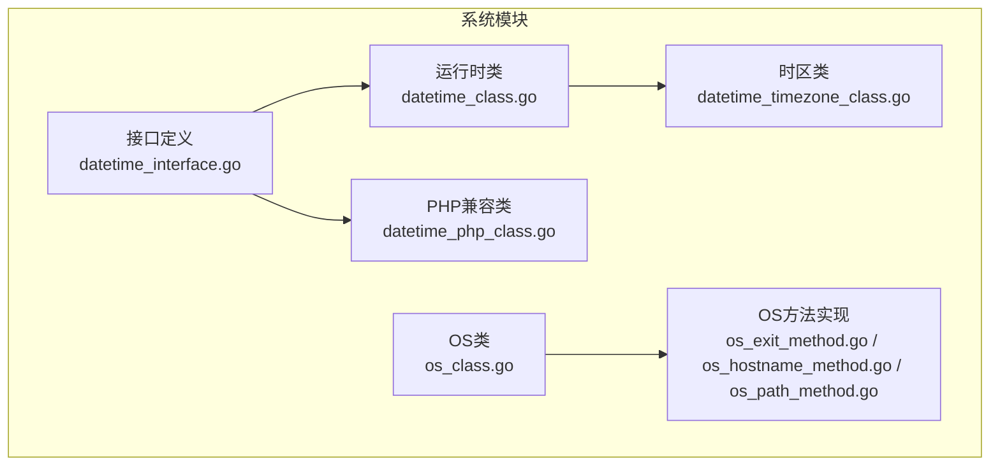
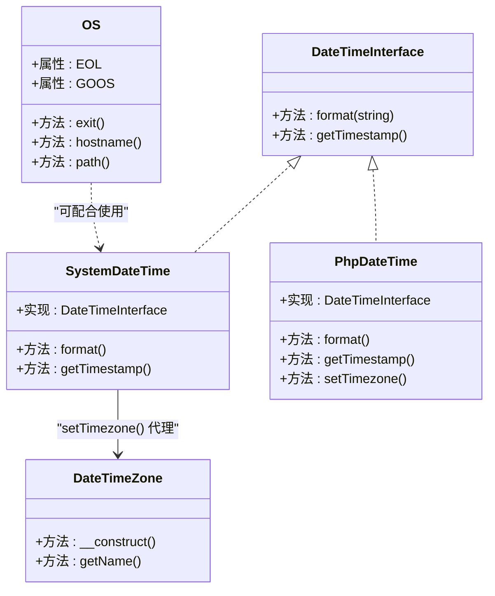
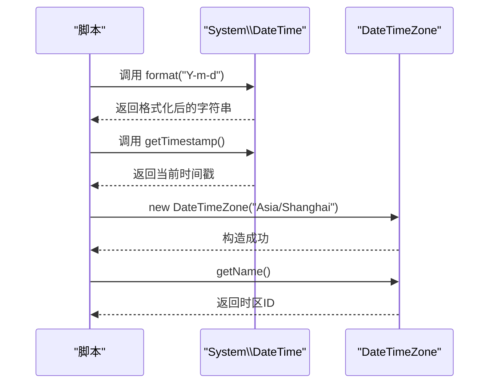
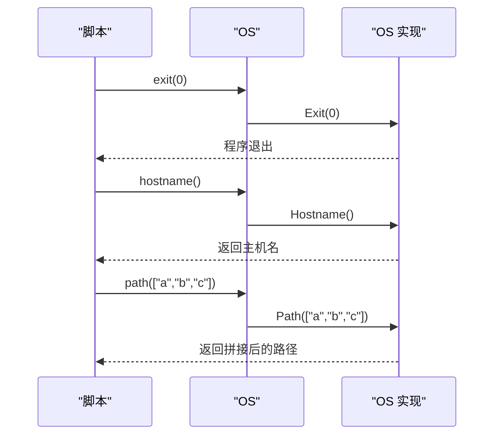
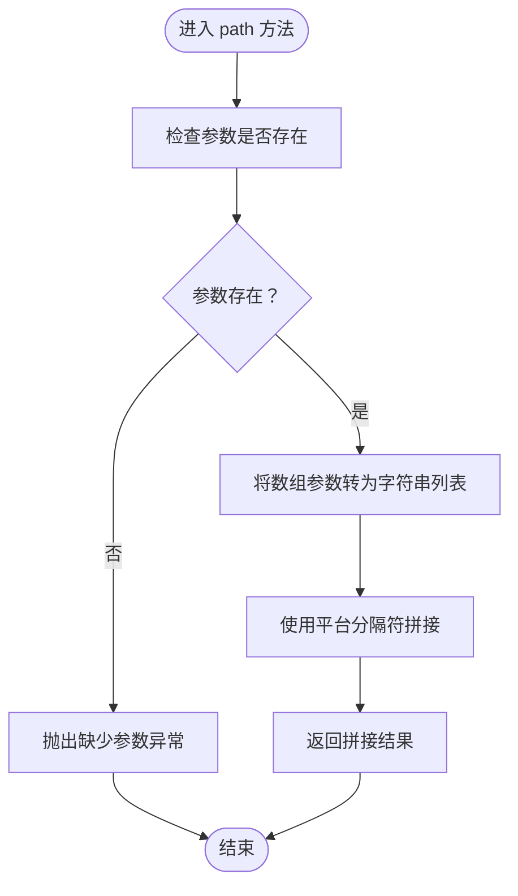
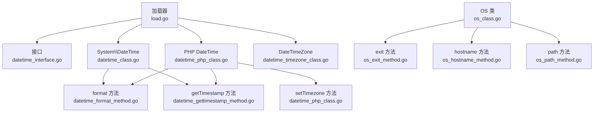

# 系统模块

<cite>
**本文引用的文件**
- [std/system/load.go](file://std/system/load.go)
- [std/system/datetime.go](file://std/system/datetime.go)
- [std/system/datetime_class.go](file://std/system/datetime_class.go)
- [std/system/datetime_format_method.go](file://std/system/datetime_format_method.go)
- [std/system/datetime_gettimestamp_method.go](file://std/system/datetime_gettimestamp_method.go)
- [std/system/datetime_interface.go](file://std/system/datetime_interface.go)
- [std/system/datetime_php_class.go](file://std/system/datetime_php_class.go)
- [std/system/datetime_timezone_class.go](file://std/system/datetime_timezone_class.go)
- [std/system/os/os.go](file://std/system/os/os.go)
- [std/system/os/os_class.go](file://std/system/os/os_class.go)
- [std/system/os/os_exit_method.go](file://std/system/os/os_exit_method.go)
- [std/system/os/os_hostname_method.go](file://std/system/os/os_hostname_method.go)
- [std/system/os/os_path_method.go](file://std/system/os/os_path_method.go)
</cite>

## 目录
1. [简介](#简介)
2. [项目结构](#项目结构)
3. [核心组件](#核心组件)
4. [架构总览](#架构总览)
5. [详细组件分析](#详细组件分析)
6. [依赖分析](#依赖分析)
7. [性能考虑](#性能考虑)
8. [故障排查指南](#故障排查指南)
9. [结论](#结论)
10. [附录](#附录)

## 简介
本文件为系统模块的详细API文档，聚焦以下能力：
- OS类的系统操作功能：进程控制（退出）、主机名获取、路径拼接等。
- DateTime类的时间日期处理功能：格式化、时间戳转换、时区处理等。
- 底层系统资源管理、环境变量操作、文件系统访问等基础能力。
- 跨平台兼容性说明与平台特定功能使用指南。
- 系统监控、性能统计、资源清理等实用功能的使用建议。

系统模块采用“接口+类+方法”的分层设计，通过虚拟机运行时注册接口与类，使上层脚本可像PHP一样调用这些API。

## 项目结构
系统模块位于 std/system 与 std/system/os 下，核心由以下部分组成：
- 时间日期子系统：接口定义、运行时类、PHP兼容类、时区类。
- OS子系统：静态类与方法封装，提供跨平台能力。

图表来源
- [std/system/datetime_interface.go:1-34](file://std/system/datetime_interface.go#L1-L34)
- [std/system/datetime_class.go:1-64](file://std/system/datetime_class.go#L1-L64)
- [std/system/datetime_php_class.go:1-119](file://std/system/datetime_php_class.go#L1-L119)
- [std/system/datetime_timezone_class.go:1-171](file://std/system/datetime_timezone_class.go#L1-L171)
- [std/system/os/os_class.go:1-98](file://std/system/os/os_class.go#L1-L98)
- [std/system/os/os_exit_method.go:1-54](file://std/system/os/os_exit_method.go#L1-L54)
- [std/system/os/os_hostname_method.go:1-44](file://std/system/os/os_hostname_method.go#L1-L44)
- [std/system/os/os_path_method.go:1-52](file://std/system/os/os_path_method.go#L1-L52)

章节来源
- [std/system/load.go:1-12](file://std/system/load.go#L1-L12)

## 核心组件
- 接口层：定义 DateTimeInterface，确保类型提示与 instanceof 检查可用。
- 运行时类层：System\DateTime 与 DateTimeZone，提供最小可用能力。
- PHP兼容层：全局 DateTime 与 DateTimeZone，保证与PHP生态一致的行为。
- OS类：提供跨平台的进程控制、主机名与路径处理。

章节来源
- [std/system/datetime_interface.go:8-33](file://std/system/datetime_interface.go#L8-L33)
- [std/system/datetime_class.go:8-64](file://std/system/datetime_class.go#L8-L64)
- [std/system/datetime_php_class.go:8-119](file://std/system/datetime_php_class.go#L8-L119)
- [std/system/datetime_timezone_class.go:11-171](file://std/system/datetime_timezone_class.go#L11-L171)
- [std/system/os/os_class.go:10-98](file://std/system/os/os_class.go#L10-L98)

## 架构总览
系统模块通过虚拟机加载器注册接口与类，运行时以方法对象的形式暴露给脚本调用。下图展示关键类与方法之间的关系：

图表来源
- [std/system/datetime_interface.go:10-33](file://std/system/datetime_interface.go#L10-L33)
- [std/system/datetime_class.go:23-52](file://std/system/datetime_class.go#L23-L52)
- [std/system/datetime_php_class.go:31-78](file://std/system/datetime_php_class.go#L31-L78)
- [std/system/datetime_timezone_class.go:27-80](file://std/system/datetime_timezone_class.go#L27-L80)
- [std/system/os/os_class.go:32-98](file://std/system/os/os_class.go#L32-L98)

## 详细组件分析

### 时间日期接口与类
- DateTimeInterface：定义 format(string) 与 getTimestamp() 两个方法签名，用于类型约束与 instanceof 判断。
- System\DateTime：实现接口，提供 format 与 getTimestamp 方法；构造后默认使用当前时间。
- PHP全局 DateTime：与 System\DateTime 共享核心方法，并新增 setTimezone，返回 $this 以满足链式调用。
- DateTimeZone：提供 __construct(string $timezoneId) 与 getName()，内部校验时区ID并存储。

图表来源
- [std/system/datetime_format_method.go:15-22](file://std/system/datetime_format_method.go#L15-L22)
- [std/system/datetime_gettimestamp_method.go:11-13](file://std/system/datetime_gettimestamp_method.go#L11-L13)
- [std/system/datetime_timezone_class.go:85-106](file://std/system/datetime_timezone_class.go#L85-L106)
- [std/system/datetime_timezone_class.go:139-146](file://std/system/datetime_timezone_class.go#L139-L146)

章节来源
- [std/system/datetime_interface.go:10-33](file://std/system/datetime_interface.go#L10-L33)
- [std/system/datetime_class.go:14-64](file://std/system/datetime_class.go#L14-L64)
- [std/system/datetime_php_class.go:21-119](file://std/system/datetime_php_class.go#L21-L119)
- [std/system/datetime_timezone_class.go:22-171](file://std/system/datetime_timezone_class.go#L22-L171)

### OS类与方法
- OS类提供静态属性 EOL 与 GOOS，以及静态/实例方法 exit、hostname、path。
- OSExitMethod：接收整数参数，调用底层退出函数。
- OSHostnameMethod：返回主机名，错误时抛出异常。
- OSPathMethod：接收数组参数，使用平台分隔符拼接路径。

图表来源
- [std/system/os/os_exit_method.go:15-24](file://std/system/os/os_exit_method.go#L15-L24)
- [std/system/os/os_hostname_method.go:12-18](file://std/system/os/os_hostname_method.go#L12-L18)
- [std/system/os/os_path_method.go:15-22](file://std/system/os/os_path_method.go#L15-L22)
- [std/system/os/os.go:26-42](file://std/system/os/os.go#L26-L42)

章节来源
- [std/system/os/os_class.go:10-98](file://std/system/os/os_class.go#L10-L98)
- [std/system/os/os_exit_method.go:11-54](file://std/system/os/os_exit_method.go#L11-L54)
- [std/system/os/os_hostname_method.go:8-44](file://std/system/os/os_hostname_method.go#L8-L44)
- [std/system/os/os_path_method.go:11-52](file://std/system/os/os_path_method.go#L11-L52)
- [std/system/os/os.go:10-43](file://std/system/os/os.go#L10-L43)

### 路径处理算法流程
OS.path 的实现基于平台分隔符进行路径拼接，流程如下：

图表来源
- [std/system/os/os_path_method.go:15-22](file://std/system/os/os_path_method.go#L15-L22)
- [std/system/os/os.go:35-42](file://std/system/os/os.go#L35-L42)

## 依赖分析
- 加载入口：系统模块通过加载器注册接口与类，供虚拟机识别。
- 组件耦合：运行时类与方法之间通过源对象委托调用，降低直接耦合。
- 外部依赖：时间日期依赖标准库 time；OS依赖标准库 os、runtime、filepath。

图表来源
- [std/system/load.go:7-11](file://std/system/load.go#L7-L11)
- [std/system/datetime_class.go:17-21](file://std/system/datetime_class.go#L17-L21)
- [std/system/datetime_php_class.go:24-28](file://std/system/datetime_php_class.go#L24-L28)
- [std/system/os/os_class.go:12-17](file://std/system/os/os_class.go#L12-L17)

章节来源
- [std/system/load.go:1-12](file://std/system/load.go#L1-L12)

## 性能考虑
- 时间日期格式化与时间戳获取：当前实现直接调用底层时间库，开销极低，适合高频调用。
- 路径拼接：使用平台分隔符进行拼接，避免跨平台路径问题，性能稳定。
- 时区校验：构造时区对象会进行合法性校验，建议缓存合法时区ID以减少重复校验成本。
- 进程退出：exit 方法为同步阻断，确保资源清理后再退出，避免数据丢失。

## 故障排查指南
- 缺少参数
  - 现象：调用 format 或 path 时抛出“缺少参数”异常。
  - 原因：未传入必需参数。
  - 处理：确保按方法签名传参。
- 无效时区
  - 现象：构造 DateTimeZone 时抛出“无效时区”异常。
  - 原因：传入空字符串或非法时区ID。
  - 处理：使用标准时区ID（如 Asia/Shanghai）并通过 time.LoadLocation 校验。
- 主机名获取失败
  - 现象：调用 hostname 抛出异常。
  - 原因：系统环境不支持或权限不足。
  - 处理：检查系统配置与权限设置。

章节来源
- [std/system/datetime_format_method.go:18-19](file://std/system/datetime_format_method.go#L18-L19)
- [std/system/os/os_path_method.go:18-19](file://std/system/os/os_path_method.go#L18-L19)
- [std/system/datetime_timezone_class.go:92-99](file://std/system/datetime_timezone_class.go#L92-L99)
- [std/system/os/os_hostname_method.go:14-16](file://std/system/os/os_hostname_method.go#L14-L16)

## 结论
系统模块提供了与PHP生态兼容的时间日期与操作系统能力，具备清晰的接口与类层次结构。通过最小可用实现覆盖常用场景，并为扩展留有余地。建议在生产环境中结合平台特性与安全策略合理使用，确保跨平台一致性与稳定性。

## 附录
- 跨平台兼容性
  - EOL：根据运行时操作系统自动选择换行符（Windows 使用 CRLF，其他使用 LF）。
  - GOOS：提供运行时操作系统标识，可用于条件分支。
- 平台特定功能
  - exit：直接终止进程，适用于脚本生命周期控制。
  - hostname：获取主机名，常用于日志与诊断。
  - path：使用平台分隔符拼接路径，避免手动拼接导致的跨平台问题。
- 实用建议
  - 在需要高精度时间戳的场景中，优先使用 getTimestamp。
  - 时区处理建议统一使用 DateTimeZone，避免本地化差异。
  - 资源清理：在退出前确保完成必要的收尾工作，exit 将立即终止进程。