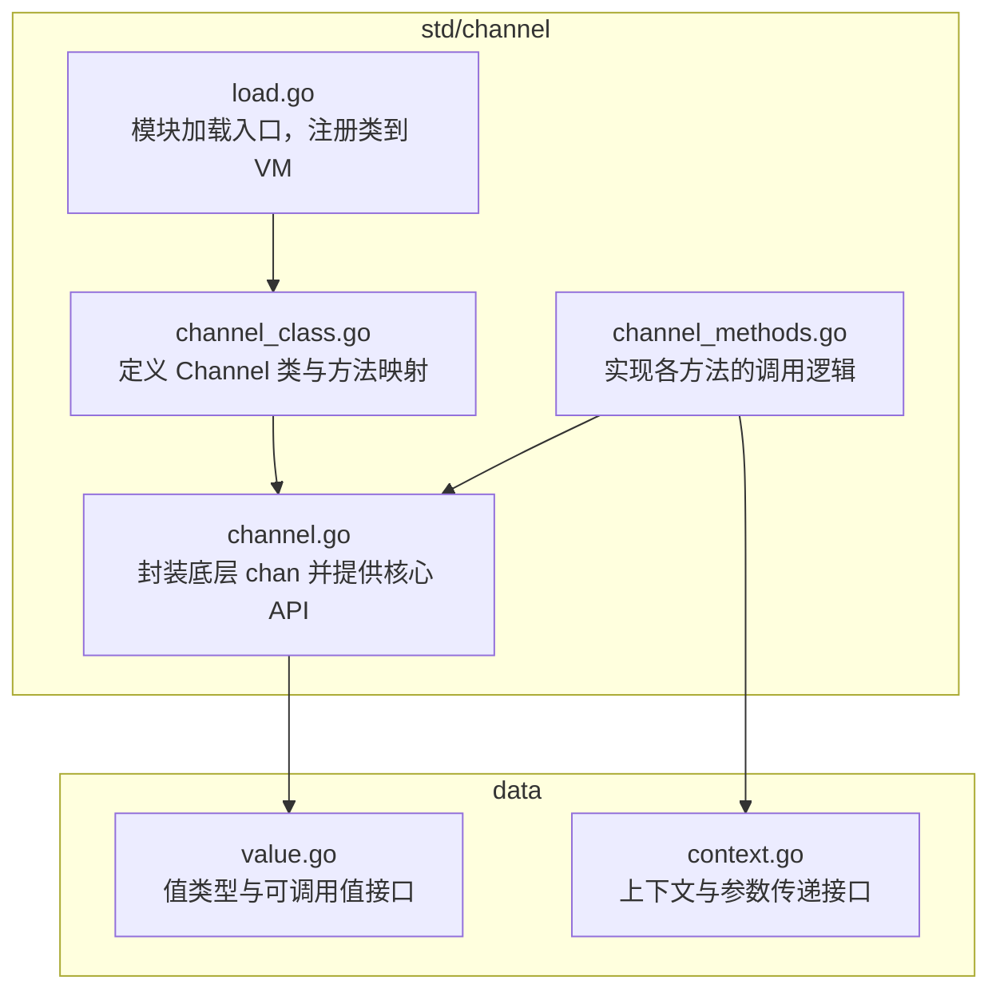
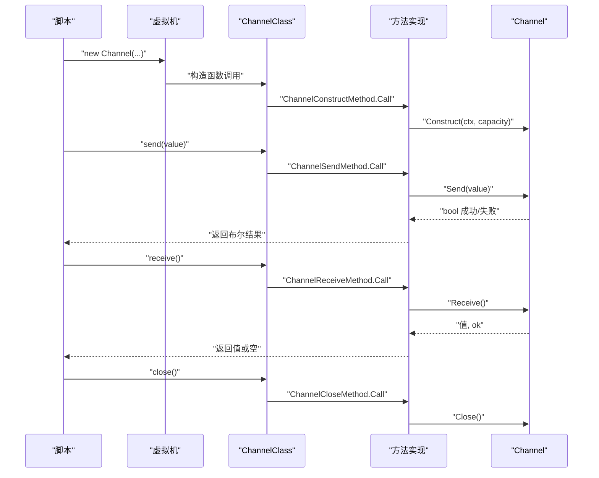
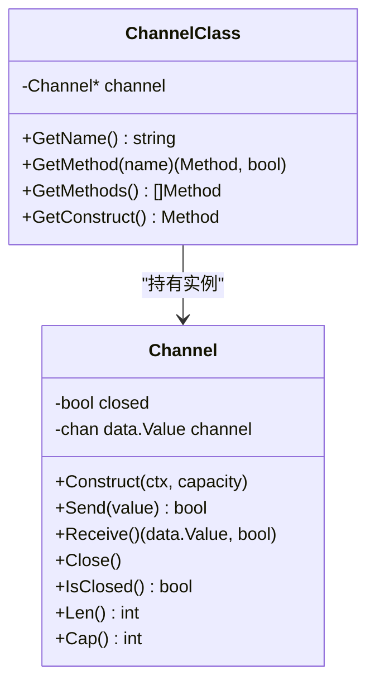
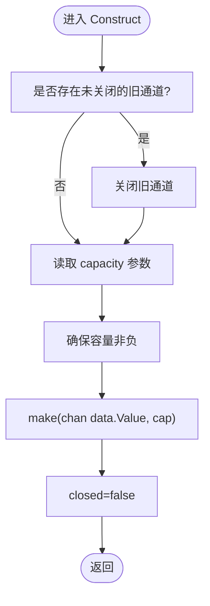
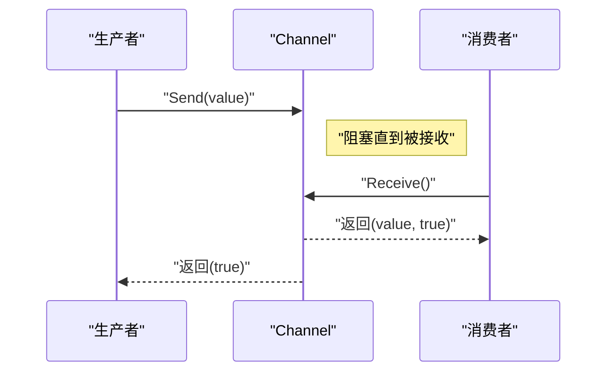
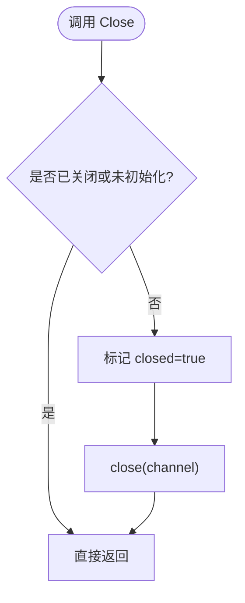
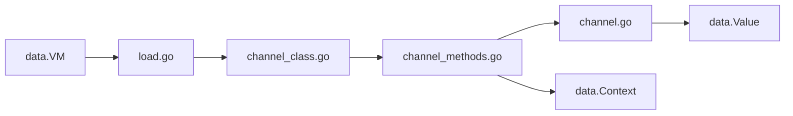

# 通道模块

<cite>
**本文引用的文件**
- [std/channel/channel.go](file://std/channel/channel.go)
- [std/channel/channel_class.go](file://std/channel/channel_class.go)
- [std/channel/channel_methods.go](file://std/channel/channel_methods.go)
- [std/channel/load.go](file://std/channel/load.go)
- [docs/std/channel.zy](file://docs/std/channel.zy)
- [data/context.go](file://data/context.go)
- [data/value.go](file://data/value.go)
</cite>

## 目录
1. [简介](#简介)
2. [项目结构](#项目结构)
3. [核心组件](#核心组件)
4. [架构总览](#架构总览)
5. [详细组件分析](#详细组件分析)
6. [依赖分析](#依赖分析)
7. [性能考虑](#性能考虑)
8. [故障排查指南](#故障排查指南)
9. [结论](#结论)
10. [附录](#附录)

## 简介
本文件系统化梳理通道模块的并发编程能力，围绕 Channel 类的协程通信功能展开，覆盖通道创建、数据发送与接收、通道关闭、容量控制、状态查询、错误处理与最佳实践等内容。文档同时解释无缓冲与有缓冲通道的差异及适用场景，并给出生产者-消费者、工作池等经典并发模式的落地建议。

## 项目结构
通道模块位于标准库目录 std/channel 下，采用“类 + 方法 + 构造器”的分层设计，通过加载器注册到虚拟机中，供上层脚本使用。

**图表来源**
- [std/channel/load.go:1-13](file://std/channel/load.go#L1-L13)
- [std/channel/channel_class.go:1-99](file://std/channel/channel_class.go#L1-L99)
- [std/channel/channel_methods.go:1-300](file://std/channel/channel_methods.go#L1-L300)
- [std/channel/channel.go:1-93](file://std/channel/channel.go#L1-L93)
- [data/context.go:1-200](file://data/context.go#L1-L200)
- [data/value.go:1-39](file://data/value.go#L1-L39)

**章节来源**
- [std/channel/load.go:1-13](file://std/channel/load.go#L1-L13)
- [std/channel/channel_class.go:1-99](file://std/channel/channel_class.go#L1-L99)
- [std/channel/channel_methods.go:1-300](file://std/channel/channel_methods.go#L1-L300)
- [std/channel/channel.go:1-93](file://std/channel/channel.go#L1-L93)
- [data/context.go:1-200](file://data/context.go#L1-L200)
- [data/value.go:1-39](file://data/value.go#L1-L39)

## 核心组件
- Channel 结构体：封装底层 Go chan，维护 closed 状态与实际通道对象，提供构造、发送、接收、关闭、长度与容量查询等方法。
- ChannelClass：定义 Channel 类，暴露构造、send、receive、close、isClosed、len、cap 等方法。
- 各方法实现：ChannelConstructMethod、ChannelSendMethod、ChannelReceiveMethod、ChannelCloseMethod、ChannelIsClosedMethod、ChannelLenMethod、ChannelCapMethod，负责参数解析、调用 Channel 实例方法、返回值包装与异常抛出。
- 模块加载：Load 函数将 Channel 类注册进虚拟机，使脚本可直接使用。

**章节来源**
- [std/channel/channel.go:7-92](file://std/channel/channel.go#L7-L92)
- [std/channel/channel_class.go:7-99](file://std/channel/channel_class.go#L7-L99)
- [std/channel/channel_methods.go:11-299](file://std/channel/channel_methods.go#L11-L299)
- [std/channel/load.go:7-12](file://std/channel/load.go#L7-L12)

## 架构总览
下图展示从脚本调用到底层通道操作的全链路：

**图表来源**
- [std/channel/channel_methods.go:16-27](file://std/channel/channel_methods.go#L16-L27)
- [std/channel/channel_methods.go:62-76](file://std/channel/channel_methods.go#L62-L76)
- [std/channel/channel_methods.go:111-123](file://std/channel/channel_methods.go#L111-L123)
- [std/channel/channel_methods.go:154-161](file://std/channel/channel_methods.go#L154-L161)
- [std/channel/channel.go:18-41](file://std/channel/channel.go#L18-L41)
- [std/channel/channel.go:43-52](file://std/channel/channel.go#L43-L52)
- [std/channel/channel.go:54-63](file://std/channel/channel.go#L54-L63)
- [std/channel/channel.go:65-71](file://std/channel/channel.go#L65-L71)

## 详细组件分析

### Channel 类与方法映射
- Channel 类提供以下公共方法：__construct、send、receive、close、isClosed、len、cap。
- 方法映射在 ChannelClass 中集中声明，便于虚拟机查找与调用。
- 构造函数支持可选 capacity 参数，用于指定通道容量（默认无缓冲）。

**图表来源**
- [std/channel/channel.go:7-92](file://std/channel/channel.go#L7-L92)
- [std/channel/channel_class.go:7-99](file://std/channel/channel_class.go#L7-L99)

**章节来源**
- [std/channel/channel_class.go:60-93](file://std/channel/channel_class.go#L60-L93)
- [docs/std/channel.zy:14-65](file://docs/std/channel.zy#L14-L65)

### 构造与容量控制
- 支持传入 capacity（整型），内部转换为 Go 通道容量；若为负则归零，确保非负。
- 若重复构造，会先关闭旧通道再创建新通道，避免资源泄漏。
- 无缓冲通道容量为 0，有缓冲通道容量大于 0。

**图表来源**
- [std/channel/channel.go:18-41](file://std/channel/channel.go#L18-L41)

**章节来源**
- [std/channel/channel.go:18-41](file://std/channel/channel.go#L18-L41)

### 数据发送与接收
- send：向通道发送值，返回布尔表示是否成功；若通道未初始化或已关闭，返回失败。
- receive：从通道接收值，返回值与布尔标志；若通道未初始化，返回空值与失败标志。
- 两者均遵循 Go 通道的同步语义：发送阻塞直到有接收者，接收阻塞直到有发送者。

**图表来源**
- [std/channel/channel.go:43-63](file://std/channel/channel.go#L43-L63)
- [std/channel/channel_methods.go:62-76](file://std/channel/channel_methods.go#L62-L76)
- [std/channel/channel_methods.go:111-123](file://std/channel/channel_methods.go#L111-L123)

**章节来源**
- [std/channel/channel.go:43-63](file://std/channel/channel.go#L43-L63)
- [std/channel/channel_methods.go:62-76](file://std/channel/channel_methods.go#L62-L76)
- [std/channel/channel_methods.go:111-123](file://std/channel/channel_methods.go#L111-L123)

### 通道关闭与状态查询
- close：仅当通道未关闭且存在时才关闭，设置 closed 标志。
- isClosed：返回当前关闭状态。
- len/cap：返回当前缓冲区长度与容量，未初始化时返回 0。

**图表来源**
- [std/channel/channel.go:65-71](file://std/channel/channel.go#L65-L71)
- [std/channel/channel.go:73-92](file://std/channel/channel.go#L73-L92)

**章节来源**
- [std/channel/channel.go:65-92](file://std/channel/channel.go#L65-L92)

### 错误处理与参数校验
- 未初始化通道调用方法时，抛出错误（如 send/receive/close/isClosed/len/cap）。
- send 缺少参数时抛出错误。
- receive 在通道关闭后返回空值与失败标志，避免阻塞。

**章节来源**
- [std/channel/channel_methods.go:62-76](file://std/channel/channel_methods.go#L62-L76)
- [std/channel/channel_methods.go:111-123](file://std/channel/channel_methods.go#L111-L123)
- [std/channel/channel_methods.go:154-161](file://std/channel/channel_methods.go#L154-L161)
- [std/channel/channel_methods.go:192-199](file://std/channel/channel_methods.go#L192-L199)
- [std/channel/channel_methods.go:230-237](file://std/channel/channel_methods.go#L230-L237)
- [std/channel/channel_methods.go:268-275](file://std/channel/channel_methods.go#L268-L275)

### 无缓冲通道与有缓冲通道
- 无缓冲通道：容量为 0，发送与接收必须严格配对，否则产生阻塞；适合强同步场景。
- 有缓冲通道：容量大于 0，允许在缓冲区满之前连续发送而不阻塞；适合异步解耦与背压控制。
- 选择依据：若需要严格的“就绪即发”语义，优先无缓冲；若需要吞吐与解耦，优先有缓冲并合理设置容量。

**章节来源**
- [std/channel/channel.go:25-41](file://std/channel/channel.go#L25-L41)

### 通道组合与选择器模式
- 组合：可通过多个 Channel 实例组合实现多路复用、扇出/扇入等拓扑。
- 选择器：可在上层脚本中使用“多通道等待”策略（例如轮询多个通道的可用数据），但需注意避免忙等；结合超时与上下文取消可提升健壮性。
- 注意：当前实现未内置 select-case 语法，需通过业务侧轮询与超时控制实现类似效果。

[本节为概念性说明，不直接分析具体源码文件]

### 超时处理
- 建议在上层脚本中结合上下文与定时器实现超时控制，避免 goroutine 长时间阻塞。
- 当 receive/send 长时间无进展时，应主动中断并记录日志，防止资源泄露。

**章节来源**
- [data/context.go:1-200](file://data/context.go#L1-L200)

### 生产者-消费者与工作池模式
- 生产者-消费者：使用无缓冲通道实现强同步；生产者 send 后立即被阻塞，消费者 receive 后继续消费，天然平衡速率。
- 工作池：使用有缓冲通道承载任务队列，多个 worker goroutine 并发消费；通过 cap 设置队列深度，避免内存暴涨。
- 最佳实践：为每个 worker 提供独立的上下文与错误收集机制；在退出时关闭通道并等待所有 worker 结束。

[本节为概念性说明，不直接分析具体源码文件]

## 依赖分析
- Channel 依赖 data.Value 抽象值类型，确保与虚拟机类型系统兼容。
- 方法实现依赖 data.Context 获取参数、抛出异常与返回值包装。
- 模块加载依赖 data.VM 注册类，使脚本可直接 new Channel(...) 并调用方法。

**图表来源**
- [std/channel/load.go:7-12](file://std/channel/load.go#L7-L12)
- [std/channel/channel_class.go:12-18](file://std/channel/channel_class.go#L12-L18)
- [std/channel/channel_methods.go:16-27](file://std/channel/channel_methods.go#L16-L27)
- [std/channel/channel.go:3-5](file://std/channel/channel.go#L3-L5)
- [data/context.go:8-31](file://data/context.go#L8-L31)
- [data/value.go:3-7](file://data/value.go#L3-L7)

**章节来源**
- [std/channel/load.go:7-12](file://std/channel/load.go#L7-L12)
- [std/channel/channel_methods.go:16-27](file://std/channel/channel_methods.go#L16-L27)
- [std/channel/channel.go:3-5](file://std/channel/channel.go#L3-L5)
- [data/context.go:8-31](file://data/context.go#L8-L31)
- [data/value.go:3-7](file://data/value.go#L3-L7)

## 性能考虑
- 无缓冲通道：同步性强，CPU 开销低，但吞吐受限；适合小规模、强一致性场景。
- 有缓冲通道：可提升吞吐，但需谨慎设置容量，避免内存压力与 GC 峰值。
- 避免忙等：在上层脚本中结合超时与非阻塞检查，减少 goroutine 长时间阻塞。
- 资源回收：及时 close 通道并在退出路径统一等待，防止 goroutine 泄漏。

[本节为通用指导，不直接分析具体源码文件]

## 故障排查指南
- “通道未初始化”错误：确认在调用任何方法前已正确构造 Channel。
- “缺少参数”错误：send 必须传入 value。
- receive 返回空值：可能通道已关闭或未有数据；需结合 isClosed 与 len 判断。
- 死锁风险：无缓冲通道必须成对出现发送与接收；有缓冲通道需关注缓冲区耗尽与生产/消费速率不匹配。
- 性能瓶颈：检查通道容量与 goroutine 数量，避免过度阻塞或频繁切换。

**章节来源**
- [std/channel/channel_methods.go:62-76](file://std/channel/channel_methods.go#L62-L76)
- [std/channel/channel_methods.go:111-123](file://std/channel/channel_methods.go#L111-L123)
- [std/channel/channel_methods.go:154-161](file://std/channel/channel_methods.go#L154-L161)
- [std/channel/channel_methods.go:192-199](file://std/channel/channel_methods.go#L192-L199)
- [std/channel/channel_methods.go:230-237](file://std/channel/channel_methods.go#L230-L237)
- [std/channel/channel_methods.go:268-275](file://std/channel/channel_methods.go#L268-L275)

## 结论
通道模块提供了与 Go 通道语义一致的封装，具备清晰的构造、发送、接收、关闭与状态查询能力。通过无缓冲与有缓冲两种模式，可灵活适配强同步与异步解耦场景。配合超时、选择器与工作池等模式，可构建高可靠、高性能的并发程序。建议在工程实践中重视错误处理、死锁规避与性能调优。

## 附录
- 接口定义参考：docs/std/channel.zy 提供了 Channel 类的伪代码接口，便于理解对外 API。

**章节来源**
- [docs/std/channel.zy:14-65](file://docs/std/channel.zy#L14-L65)