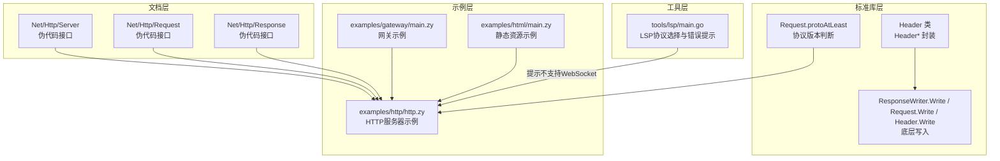
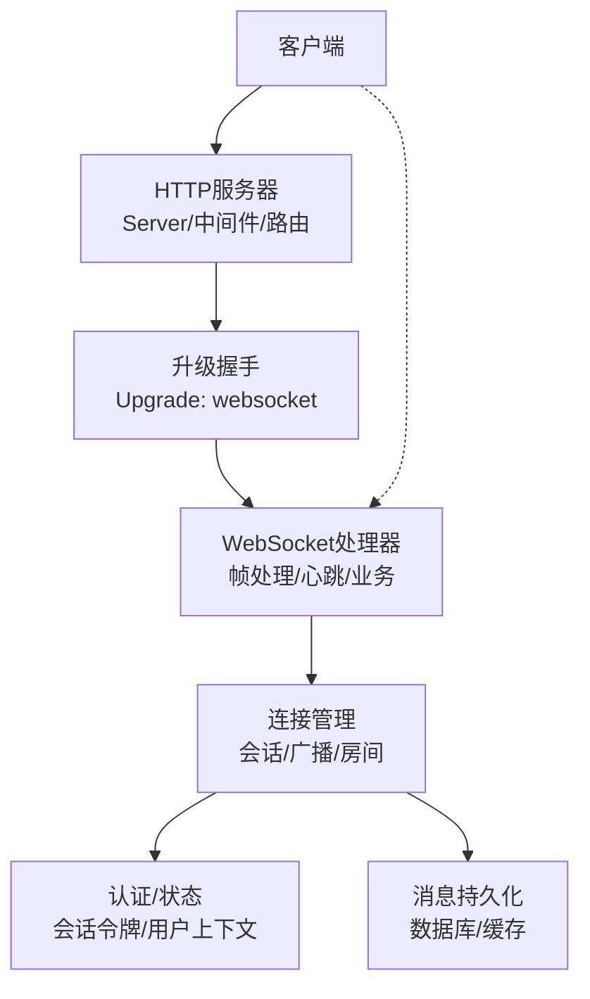
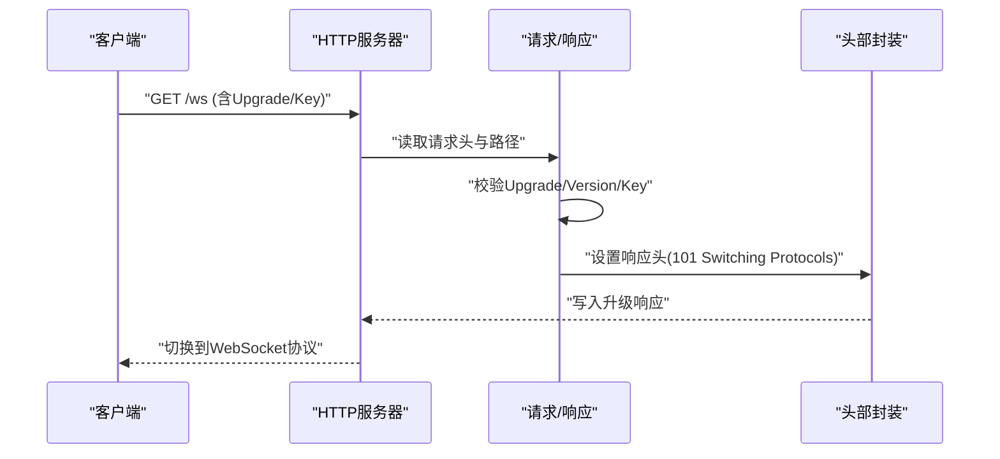
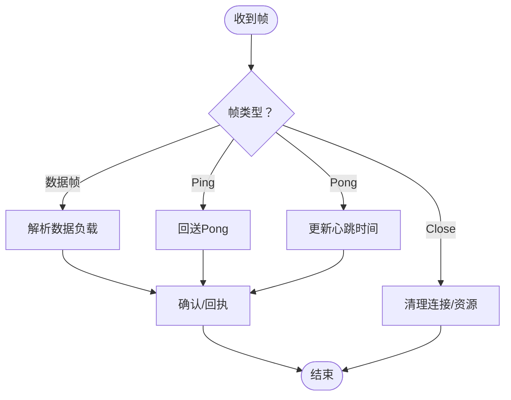
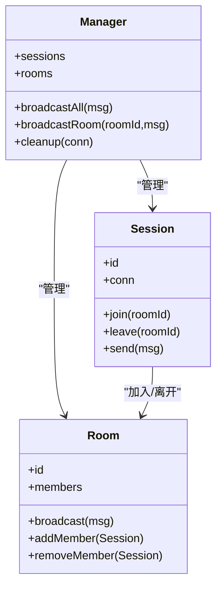
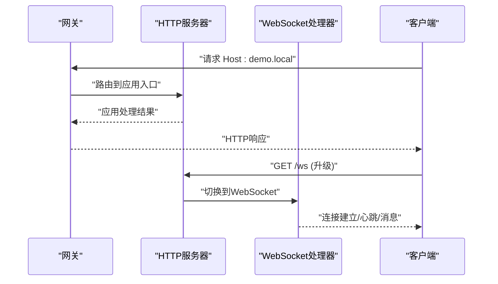
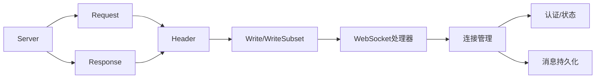

# WebSocket应用示例

<cite>
**本文引用的文件**
- [examples/websocket](file://examples/websocket)
- [docs/std/Net/Http/server.zy](file://docs/std/Net/Http/server.zy)
- [docs/std/Net/Http/request.zy](file://docs/std/Net/Http/request.zy)
- [docs/std/Net/Http/response.zy](file://docs/std/Net/Http/response.zy)
- [std/net/http/header_class.go](file://std/net/http/header_class.go)
- [std/net/http/responsewriter_write_method.go](file://std/net/http/responsewriter_write_method.go)
- [std/net/http/request_write_method.go](file://std/net/http/request_write_method.go)
- [std/net/http/response_write_method.go](file://std/net/http/response_write_method.go)
- [std/net/http/header_write_method.go](file://std/net/http/header_write_method.go)
- [std/net/http/header_writesubset_method.go](file://std/net/http/header_writesubset_method.go)
- [std/net/http/request_protoatleast_method.go](file://std/net/http/request_protoatleast_method.go)
- [tools/lsp/main.go](file://tools/lsp/main.go)
- [examples/gateway/main.zy](file://examples/gateway/main.zy)
- [examples/gateway/apps/demo/src/main.zy](file://examples/gateway/apps/demo/src/main.zy)
- [examples/html/main.zy](file://examples/html/main.zy)
- [examples/http/http.zy](file://examples/http/http.zy)
- [laravel/config/broadcasting.php](file://laravel/config/broadcasting.php)
- [laravel/resources/js/bootstrap.js](file://laravel/resources/js/bootstrap.js)
- [laravel/routes/channels.php](file://laravel/routes/channels.php)
</cite>

## 目录
1. [简介](#简介)
2. [项目结构](#项目结构)
3. [核心组件](#核心组件)
4. [架构总览](#架构总览)
5. [详细组件分析](#详细组件分析)
6. [依赖关系分析](#依赖关系分析)
7. [性能考虑](#性能考虑)
8. [故障排查指南](#故障排查指南)
9. [结论](#结论)
10. [附录](#附录)

## 简介
本文件面向希望在Origami运行时中实现WebSocket应用的开发者，系统性地讲解如何基于现有HTTP基础设施构建WebSocket服务端与客户端，覆盖握手、帧处理、心跳、连接管理、广播、认证与房间管理等主题。文档以仓库中现有的HTTP服务器抽象、请求/响应与头部封装为起点，结合LSP工具中的WebSocket协议提示，给出可落地的实现思路与最佳实践，并提供与HTTP服务器集成、路由共享与状态同步的方案。

## 项目结构
仓库提供了丰富的HTTP与示例工程，为WebSocket实现提供天然的基础设施：
- 文档层：Net/Http模块的伪代码接口，定义Server、Request、Response等抽象，便于理解高层行为。
- 标准库层：对Go net/http的适配，提供Header、Write等底层方法封装，支撑WebSocket升级与帧处理。
- 示例层：HTTP服务器示例、网关示例、HTML示例等，展示路由、中间件、静态资源与应用隔离。
- 工具层：LSP主程序对WebSocket协议的提示与错误处理，体现协议支持现状与扩展方向。

**图表来源**
- [docs/std/Net/Http/server.zy:1-109](file://docs/std/Net/Http/server.zy#L1-L109)
- [docs/std/Net/Http/request.zy:1-197](file://docs/std/Net/Http/request.zy#L1-L197)
- [docs/std/Net/Http/response.zy:1-53](file://docs/std/Net/Http/response.zy#L1-L53)
- [std/net/http/header_class.go:1-49](file://std/net/http/header_class.go#L1-L49)
- [std/net/http/responsewriter_write_method.go:1-41](file://std/net/http/responsewriter_write_method.go#L1-L41)
- [std/net/http/request_write_method.go:1-39](file://std/net/http/request_write_method.go#L1-L39)
- [std/net/http/response_write_method.go:1-39](file://std/net/http/response_write_method.go#L1-L39)
- [std/net/http/header_write_method.go:1-39](file://std/net/http/header_write_method.go#L1-L39)
- [std/net/http/header_writesubset_method.go:1-45](file://std/net/http/header_writesubset_method.go#L1-L45)
- [std/net/http/request_protoatleast_method.go:1-44](file://std/net/http/request_protoatleast_method.go#L1-L44)
- [examples/http/http.zy:1-232](file://examples/http/http.zy#L1-L232)
- [examples/gateway/main.zy:1-103](file://examples/gateway/main.zy#L1-L103)
- [examples/html/main.zy:1-74](file://examples/html/main.zy#L1-L74)
- [tools/lsp/main.go:221-236](file://tools/lsp/main.go#L221-L236)

**章节来源**
- [docs/std/Net/Http/server.zy:1-109](file://docs/std/Net/Http/server.zy#L1-L109)
- [docs/std/Net/Http/request.zy:1-197](file://docs/std/Net/Http/request.zy#L1-L197)
- [docs/std/Net/Http/response.zy:1-53](file://docs/std/Net/Http/response.zy#L1-L53)
- [std/net/http/header_class.go:1-49](file://std/net/http/header_class.go#L1-L49)
- [std/net/http/responsewriter_write_method.go:1-41](file://std/net/http/responsewriter_write_method.go#L1-L41)
- [std/net/http/request_write_method.go:1-39](file://std/net/http/request_write_method.go#L1-L39)
- [std/net/http/response_write_method.go:1-39](file://std/net/http/response_write_method.go#L1-L39)
- [std/net/http/header_write_method.go:1-39](file://std/net/http/header_write_method.go#L1-L39)
- [std/net/http/header_writesubset_method.go:1-45](file://std/net/http/header_writesubset_method.go#L1-L45)
- [std/net/http/request_protoatleast_method.go:1-44](file://std/net/http/request_protoatleast_method.go#L1-L44)
- [examples/http/http.zy:1-232](file://examples/http/http.zy#L1-L232)
- [examples/gateway/main.zy:1-103](file://examples/gateway/main.zy#L1-L103)
- [examples/html/main.zy:1-74](file://examples/html/main.zy#L1-L74)
- [tools/lsp/main.go:221-236](file://tools/lsp/main.go#L221-L236)

## 核心组件
- HTTP服务器抽象：Server类提供路由注册、中间件、运行等能力，作为WebSocket升级的宿主环境。
- 请求/响应与头部：Request/Response提供路径、表单、头操作；Header封装底层写入与子集写入，支撑升级响应与帧写入。
- 底层写入方法：ResponseWriter.Write、Request.Write、Header.Write/WriteSubset等，为WebSocket帧处理提供基础。
- 协议辅助：Request.protoAtLeast用于判断HTTP/2+场景下的能力，有助于升级策略选择。
- 示例应用：HTTP示例展示路由与中间件；网关示例展示多应用隔离与动态分发；HTML示例展示静态资源与模板加载。

**章节来源**
- [docs/std/Net/Http/server.zy:17-107](file://docs/std/Net/Http/server.zy#L17-L107)
- [docs/std/Net/Http/request.zy:17-195](file://docs/std/Net/Http/request.zy#L17-L195)
- [docs/std/Net/Http/response.zy:17-51](file://docs/std/Net/Http/response.zy#L17-L51)
- [std/net/http/header_class.go:10-49](file://std/net/http/header_class.go#L10-L49)
- [std/net/http/responsewriter_write_method.go:11-41](file://std/net/http/responsewriter_write_method.go#L11-L41)
- [std/net/http/request_write_method.go:12-39](file://std/net/http/request_write_method.go#L12-L39)
- [std/net/http/response_write_method.go:12-39](file://std/net/http/response_write_method.go#L12-L39)
- [std/net/http/header_write_method.go:12-39](file://std/net/http/header_write_method.go#L12-L39)
- [std/net/http/header_writesubset_method.go:12-45](file://std/net/http/header_writesubset_method.go#L12-L45)
- [std/net/http/request_protoatleast_method.go:15-44](file://std/net/http/request_protoatleast_method.go#L15-L44)
- [examples/http/http.zy:13-231](file://examples/http/http.zy#L13-L231)
- [examples/gateway/main.zy:16-101](file://examples/gateway/main.zy#L16-L101)
- [examples/html/main.zy:8-74](file://examples/html/main.zy#L8-L74)

## 架构总览
WebSocket应用的总体架构由“HTTP升级宿主 + WebSocket处理器 + 连接管理 + 广播/房间 + 认证/状态”构成。HTTP服务器负责监听、中间件、路由与升级握手；WebSocket处理器负责帧解析、心跳与业务消息；连接管理负责会话、广播与房间；认证与状态通过HTTP会话或令牌与WebSocket会话关联。

**图表来源**
- [examples/http/http.zy:13-231](file://examples/http/http.zy#L13-L231)
- [docs/std/Net/Http/server.zy:17-107](file://docs/std/Net/Http/server.zy#L17-L107)
- [docs/std/Net/Http/request.zy:17-195](file://docs/std/Net/Http/request.zy#L17-L195)
- [docs/std/Net/Http/response.zy:17-51](file://docs/std/Net/Http/response.zy#L17-L51)
- [std/net/http/header_class.go:10-49](file://std/net/http/header_class.go#L10-L49)

## 详细组件分析

### 组件A：HTTP服务器与升级握手
- 目标：在HTTP服务器上注册WebSocket升级路由，完成握手并切换到WebSocket协议。
- 关键点：
  - 使用Server的路由方法注册升级端点。
  - 在请求处理中判断Upgrade头与Sec-WebSocket-Key，生成响应头并切换协议。
  - 结合中间件进行CORS、鉴权与日志。
- 实现要点（路径参考）：
  - 路由注册与运行：[examples/http/http.zy:13-231](file://examples/http/http.zy#L13-L231)
  - 升级响应头设置与写入：[std/net/http/header_write_method.go:12-39](file://std/net/http/header_write_method.go#L12-L39)，[std/net/http/header_writesubset_method.go:12-45](file://std/net/http/header_writesubset_method.go#L12-L45)
  - 协议版本判断：[std/net/http/request_protoatleast_method.go:15-44](file://std/net/http/request_protoatleast_method.go#L15-L44)

**图表来源**
- [examples/http/http.zy:13-231](file://examples/http/http.zy#L13-L231)
- [std/net/http/header_write_method.go:12-39](file://std/net/http/header_write_method.go#L12-L39)
- [std/net/http/header_writesubset_method.go:12-45](file://std/net/http/header_writesubset_method.go#L12-L45)
- [std/net/http/request_protoatleast_method.go:15-44](file://std/net/http/request_protoatleast_method.go#L15-L44)

**章节来源**
- [examples/http/http.zy:13-231](file://examples/http/http.zy#L13-L231)
- [std/net/http/header_write_method.go:12-39](file://std/net/http/header_write_method.go#L12-L39)
- [std/net/http/header_writesubset_method.go:12-45](file://std/net/http/header_writesubset_method.go#L12-L45)
- [std/net/http/request_protoatleast_method.go:15-44](file://std/net/http/request_protoatleast_method.go#L15-L44)

### 组件B：帧处理与心跳机制
- 目标：解析WebSocket帧，处理控制帧（Ping/Pong/Close），维持连接活跃。
- 关键点：
  - 使用底层写入方法向客户端回写帧。
  - 对Ping帧回送Pong，对Close帧执行清理。
  - 心跳周期与超时检测，超时断开连接。
- 实现要点（路径参考）：
  - 帧写入封装：[std/net/http/responsewriter_write_method.go:11-41](file://std/net/http/responsewriter_write_method.go#L11-L41)
  - 请求写入封装：[std/net/http/request_write_method.go:12-39](file://std/net/http/request_write_method.go#L12-L39)
  - 响应写入封装：[std/net/http/response_write_method.go:12-39](file://std/net/http/response_write_method.go#L12-L39)

**图表来源**
- [std/net/http/responsewriter_write_method.go:11-41](file://std/net/http/responsewriter_write_method.go#L11-L41)
- [std/net/http/request_write_method.go:12-39](file://std/net/http/request_write_method.go#L12-L39)
- [std/net/http/response_write_method.go:12-39](file://std/net/http/response_write_method.go#L12-L39)

**章节来源**
- [std/net/http/responsewriter_write_method.go:11-41](file://std/net/http/responsewriter_write_method.go#L11-L41)
- [std/net/http/request_write_method.go:12-39](file://std/net/http/request_write_method.go#L12-L39)
- [std/net/http/response_write_method.go:12-39](file://std/net/http/response_write_method.go#L12-L39)

### 组件C：连接管理与广播
- 目标：维护连接集合、会话跟踪、房间分组与广播消息。
- 关键点：
  - 连接池：按会话ID或连接句柄索引，支持快速查找与移除。
  - 房间管理：按房间ID聚合连接，支持加入/离开与房间内广播。
  - 广播：向指定房间或全体连接发送消息。
- 实现要点（路径参考）：
  - 会话与广播模式可参考通道模型（Channel）的发送/接收/关闭语义，映射到连接生命周期管理。
  - 参考：[std/channel/channel_methods.go:57-241](file://std/channel/channel_methods.go#L57-L241)，[std/channel/channel_class.go:54-98](file://std/channel/channel_class.go#L54-L98)

**图表来源**
- [std/channel/channel_methods.go:57-241](file://std/channel/channel_methods.go#L57-L241)
- [std/channel/channel_class.go:54-98](file://std/channel/channel_class.go#L54-L98)

**章节来源**
- [std/channel/channel_methods.go:57-241](file://std/channel/channel_methods.go#L57-L241)
- [std/channel/channel_class.go:54-98](file://std/channel/channel_class.go#L54-L98)

### 组件D：认证与房间管理
- 目标：在握手阶段进行认证，将用户与连接绑定；支持房间权限与消息持久化。
- 关键点：
  - 握手认证：从Cookie/Authorization中提取令牌，验证后注入用户上下文。
  - 房间权限：根据用户角色限制进入/发送。
  - 消息持久化：将历史消息写入数据库或缓存，支持重放。
- 实现要点（路径参考）：
  - 认证与授权可复用HTTP中间件模式，在升级前执行。
  - 房间与广播见“连接管理与广播”。
  - 持久化可参考数据库模块（示例与接口见标准库数据库目录）。

**章节来源**
- [examples/http/http.zy:17-74](file://examples/http/http.zy#L17-L74)
- [examples/gateway/main.zy:48-99](file://examples/gateway/main.zy#L48-L99)

### 组件E：与HTTP服务器集成与状态同步
- 目标：在HTTP服务器中共享状态、路由复用与跨协议状态同步。
- 关键点：
  - 网关示例展示多应用隔离与动态分发，可借鉴其路由表与中间件模式。
  - HTML示例展示静态资源与模板加载，可作为前端与WebSocket客户端的载体。
  - 状态同步：通过共享内存或外部存储（Redis/数据库）保持HTTP与WebSocket状态一致。
- 实现要点（路径参考）：
  - 网关路由与中间件：[examples/gateway/main.zy:16-101](file://examples/gateway/main.zy#L16-L101)
  - 应用入口与注解：[examples/gateway/apps/demo/src/main.zy:5-13](file://examples/gateway/apps/demo/src/main.zy#L5-L13)
  - 静态资源与模板：[examples/html/main.zy:8-74](file://examples/html/main.zy#L8-L74)

**图表来源**
- [examples/gateway/main.zy:16-101](file://examples/gateway/main.zy#L16-L101)
- [examples/gateway/apps/demo/src/main.zy:5-13](file://examples/gateway/apps/demo/src/main.zy#L5-L13)
- [examples/html/main.zy:8-74](file://examples/html/main.zy#L8-L74)
- [examples/http/http.zy:13-231](file://examples/http/http.zy#L13-L231)

**章节来源**
- [examples/gateway/main.zy:16-101](file://examples/gateway/main.zy#L16-L101)
- [examples/gateway/apps/demo/src/main.zy:5-13](file://examples/gateway/apps/demo/src/main.zy#L5-L13)
- [examples/html/main.zy:8-74](file://examples/html/main.zy#L8-L74)
- [examples/http/http.zy:13-231](file://examples/http/http.zy#L13-L231)

### 组件F：与Laravel生态的对比与参考
- 目标：参考Laravel的广播与通道配置，理解真实项目中的WebSocket集成模式。
- 关键点：
  - 广播驱动配置与通道授权回调，体现用户认证与频道订阅。
  - 客户端通过Echo或Pusher SDK连接，服务端通过事件广播。
- 实现要点（路径参考）：
  - 广播配置：[laravel/config/broadcasting.php:1-31](file://laravel/config/broadcasting.php#L1-L31)
  - 通道授权：[laravel/routes/channels.php:1-18](file://laravel/routes/channels.php#L1-L18)
  - 客户端引导（注释示例）：[laravel/resources/js/bootstrap.js:1-32](file://laravel/resources/js/bootstrap.js#L1-L32)

**章节来源**
- [laravel/config/broadcasting.php:1-31](file://laravel/config/broadcasting.php#L1-L31)
- [laravel/routes/channels.php:1-18](file://laravel/routes/channels.php#L1-L18)
- [laravel/resources/js/bootstrap.js:1-32](file://laravel/resources/js/bootstrap.js#L1-L32)

## 依赖关系分析
- 组件耦合：
  - HTTP服务器与请求/响应/头部封装强耦合，升级与帧处理依赖底层写入方法。
  - 连接管理与认证/房间/持久化弱耦合，通过接口抽象实现替换。
- 外部依赖：
  - 标准库对Go net/http的封装提供协议与I/O能力。
  - 示例应用展示路由、中间件与静态资源，作为WebSocket集成的前置条件。
- 协议支持现状：
  - LSP工具明确提示当前不支持WebSocket协议，表明WebSocket需自行实现或引入第三方库。

**图表来源**
- [docs/std/Net/Http/server.zy:17-107](file://docs/std/Net/Http/server.zy#L17-L107)
- [docs/std/Net/Http/request.zy:17-195](file://docs/std/Net/Http/request.zy#L17-L195)
- [docs/std/Net/Http/response.zy:17-51](file://docs/std/Net/Http/response.zy#L17-L51)
- [std/net/http/header_class.go:10-49](file://std/net/http/header_class.go#L10-L49)
- [std/net/http/header_write_method.go:12-39](file://std/net/http/header_write_method.go#L12-L39)
- [std/net/http/header_writesubset_method.go:12-45](file://std/net/http/header_writesubset_method.go#L12-L45)

**章节来源**
- [tools/lsp/main.go:221-236](file://tools/lsp/main.go#L221-L236)

## 性能考虑
- 连接池与内存复用：复用缓冲区与对象，减少GC压力。
- 心跳与超时：合理的心跳间隔与超时阈值，避免无效连接占用资源。
- 广播优化：批量发送与分片策略，降低阻塞风险。
- I/O合并：利用底层写入方法的批量写入能力，减少系统调用次数。
- 中间件链路：尽量将昂贵操作（如鉴权、日志）放在链路后方，缩短热路径。

## 故障排查指南
- 升级失败：
  - 检查Upgrade头与协议版本，确保满足升级条件。
  - 核对响应头设置与写入是否成功。
- 帧解析异常：
  - 校验掩码、长度编码与负载完整性。
  - 对异常帧执行Close并清理连接。
- 心跳中断：
  - 检查Ping/Pong往返时间与网络延迟。
  - 调整心跳周期与超时阈值。
- 广播阻塞：
  - 分离热路径与I/O路径，采用异步队列。
  - 控制每批广播数量，避免拥塞。
- 日志与诊断：
  - 在中间件中记录请求与异常堆栈，定位问题根因。

**章节来源**
- [examples/http/http.zy:46-74](file://examples/http/http.zy#L46-L74)
- [std/net/http/header_write_method.go:12-39](file://std/net/http/header_write_method.go#L12-L39)
- [std/net/http/header_writesubset_method.go:12-45](file://std/net/http/header_writesubset_method.go#L12-L45)

## 结论
通过HTTP服务器抽象与标准库的I/O封装，可以在Origami中实现WebSocket的升级、帧处理与心跳机制。结合连接管理、认证与房间管理，可构建聊天室或实时通知系统。与HTTP服务器的集成可通过网关与中间件模式实现路由共享与状态同步。尽管当前工具层未直接支持WebSocket协议，但基于现有能力可扩展出完整方案。

## 附录
- 示例清单（路径参考）：
  - HTTP服务器示例：[examples/http/http.zy:1-232](file://examples/http/http.zy#L1-L232)
  - 网关示例：[examples/gateway/main.zy:1-103](file://examples/gateway/main.zy#L1-L103)
  - 应用入口示例：[examples/gateway/apps/demo/src/main.zy:1-15](file://examples/gateway/apps/demo/src/main.zy#L1-L15)
  - 静态资源示例：[examples/html/main.zy:1-74](file://examples/html/main.zy#L1-L74)
  - 文档接口示例：[docs/std/Net/Http/server.zy:1-109](file://docs/std/Net/Http/server.zy#L1-L109)，[docs/std/Net/Http/request.zy:1-197](file://docs/std/Net/Http/request.zy#L1-L197)，[docs/std/Net/Http/response.zy:1-53](file://docs/std/Net/Http/response.zy#L1-L53)
  - 标准库方法示例：[std/net/http/header_class.go:1-49](file://std/net/http/header_class.go#L1-L49)，[std/net/http/responsewriter_write_method.go:1-41](file://std/net/http/responsewriter_write_method.go#L1-L41)，[std/net/http/request_write_method.go:1-39](file://std/net/http/request_write_method.go#L1-L39)，[std/net/http/response_write_method.go:1-39](file://std/net/http/response_write_method.go#L1-L39)，[std/net/http/header_write_method.go:1-39](file://std/net/http/header_write_method.go#L1-L39)，[std/net/http/header_writesubset_method.go:1-45](file://std/net/http/header_writesubset_method.go#L1-L45)，[std/net/http/request_protoatleast_method.go:1-44](file://std/net/http/request_protoatleast_method.go#L1-L44)
  - 协议支持提示：[tools/lsp/main.go:221-236](file://tools/lsp/main.go#L221-L236)
  - Laravel生态参考：[laravel/config/broadcasting.php:1-31](file://laravel/config/broadcasting.php#L1-L31)，[laravel/routes/channels.php:1-18](file://laravel/routes/channels.php#L1-L18)，[laravel/resources/js/bootstrap.js:1-32](file://laravel/resources/js/bootstrap.js#L1-L32)