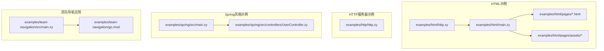
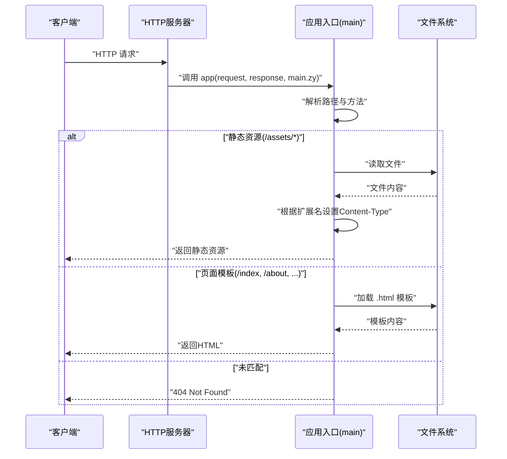
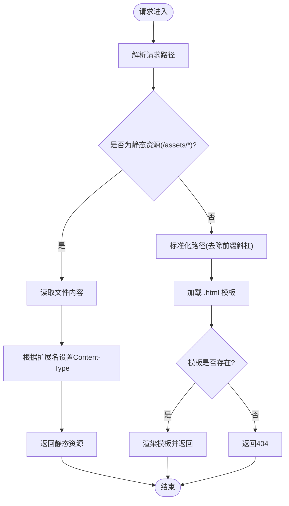
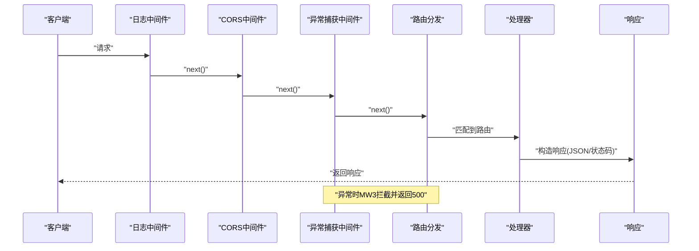
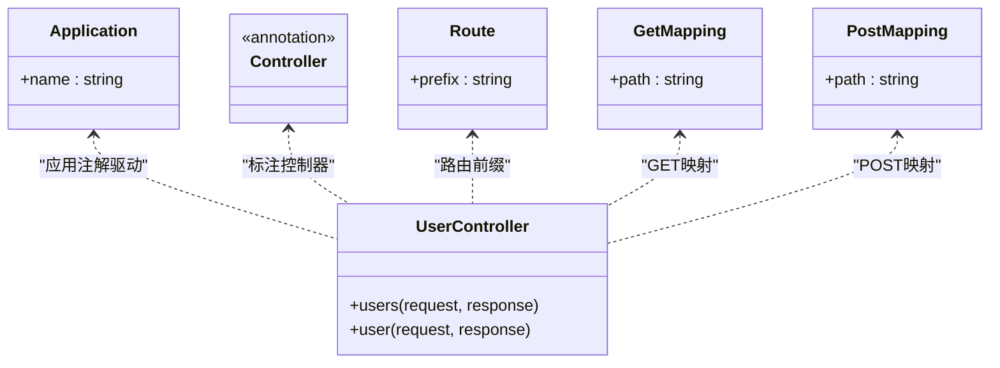
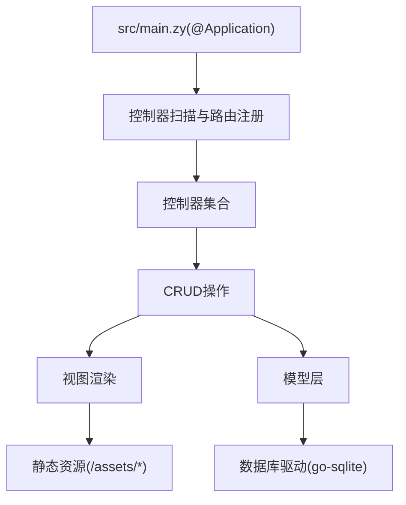
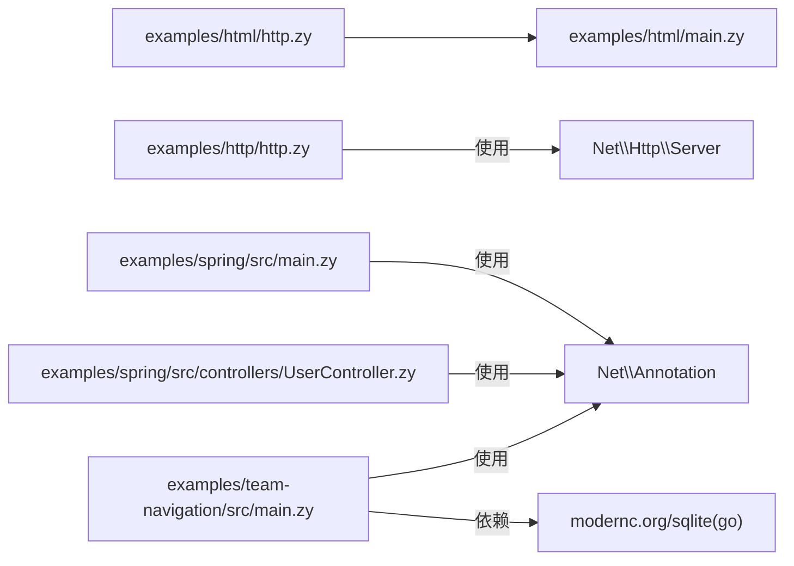

# Web应用示例

<cite>
**本文引用的文件**
- [examples/html/main.zy](file://examples/html/main.zy)
- [examples/html/http.zy](file://examples/html/http.zy)
- [examples/html/pages/index.html](file://examples/html/pages/index.html)
- [examples/html/pages/about.html](file://examples/html/pages/about.html)
- [examples/html/pages/contact.html](file://examples/html/pages/contact.html)
- [examples/html/pages/products.html](file://examples/html/pages/products.html)
- [examples/html/pages/assets/css/styles.css](file://examples/html/pages/assets/css/styles.css)
- [examples/html/pages/assets/js/app.js](file://examples/html/pages/assets/js/app.js)
- [examples/html/pages/assets/icons/favicon.ico](file://examples/html/pages/assets/icons/favicon.ico)
- [examples/http/http.zy](file://examples/http/http.zy)
- [examples/spring/src/main.zy](file://examples/spring/src/main.zy)
- [examples/spring/src/controllers/UserController.zy](file://examples/spring/src/controllers/UserController.zy)
- [examples/team-navigation/src/main.zy](file://examples/team-navigation/src/main.zy)
- [examples/team-navigation/go.mod](file://examples/team-navigation/go.mod)
</cite>

## 目录
1. [简介](#简介)
2. [项目结构](#项目结构)
3. [核心组件](#核心组件)
4. [架构总览](#架构总览)
5. [详细组件分析](#详细组件分析)
6. [依赖分析](#依赖分析)
7. [性能考虑](#性能考虑)
8. [故障排查指南](#故障排查指南)
9. [结论](#结论)
10. [附录](#附录)

## 简介
本文件系统性梳理仓库中的Web应用示例，覆盖以下主题：
- HTML渲染示例：页面模板、静态资源管理、动态内容生成
- HTTP服务器示例：路由配置、请求处理、响应格式化
- 团队导航应用：多控制器架构、模型-视图分离、完整CRUD能力
- Spring风格应用：控制器设计、依赖注入、RESTful API开发
每个示例均提供完整的代码结构、配置文件与部署说明，帮助开发者快速理解Web应用的构建模式。

## 项目结构
示例位于examples目录下，按功能划分：
- html：HTML页面渲染与静态资源示例
- http：HTTP服务器基础功能与中间件示例
- spring：基于注解的Spring风格应用示例
- team-navigation：团队导航应用，包含数据库、控制器、模型、视图等

**图表来源**
- [examples/html/http.zy:1-22](file://examples/html/http.zy#L1-L22)
- [examples/html/main.zy:1-74](file://examples/html/main.zy#L1-L74)
- [examples/http/http.zy:1-232](file://examples/http/http.zy#L1-L232)
- [examples/spring/src/main.zy:1-16](file://examples/spring/src/main.zy#L1-L16)
- [examples/spring/src/controllers/UserController.zy:1-34](file://examples/spring/src/controllers/UserController.zy#L1-L34)
- [examples/team-navigation/src/main.zy:1-11](file://examples/team-navigation/src/main.zy#L1-L11)
- [examples/team-navigation/go.mod:1-26](file://examples/team-navigation/go.mod#L1-L26)

**章节来源**
- [examples/html/http.zy:1-22](file://examples/html/http.zy#L1-L22)
- [examples/html/main.zy:1-74](file://examples/html/main.zy#L1-L74)
- [examples/http/http.zy:1-232](file://examples/http/http.zy#L1-L232)
- [examples/spring/src/main.zy:1-16](file://examples/spring/src/main.zy#L1-L16)
- [examples/spring/src/controllers/UserController.zy:1-34](file://examples/spring/src/controllers/UserController.zy#L1-L34)
- [examples/team-navigation/src/main.zy:1-11](file://examples/team-navigation/src/main.zy#L1-L11)
- [examples/team-navigation/go.mod:1-26](file://examples/team-navigation/go.mod#L1-L26)

## 核心组件
- HTML渲染引擎与静态资源服务：通过统一入口函数处理静态资源与页面模板，支持自动识别扩展名并设置Content-Type，支持模板变量渲染与内联脚本。
- HTTP服务器：提供中间件链、路由注册、请求参数解析、JSON响应、异常捕获与CORS支持。
- Spring风格应用：基于注解的控制器与路由映射，简化路由注册与请求处理。
- 团队导航应用：应用注解驱动的多控制器架构，结合数据库与Go集成，提供完整的CRUD能力。

**章节来源**
- [examples/html/main.zy:1-74](file://examples/html/main.zy#L1-L74)
- [examples/html/http.zy:1-22](file://examples/html/http.zy#L1-L22)
- [examples/http/http.zy:1-232](file://examples/http/http.zy#L1-L232)
- [examples/spring/src/main.zy:1-16](file://examples/spring/src/main.zy#L1-L16)
- [examples/spring/src/controllers/UserController.zy:1-34](file://examples/spring/src/controllers/UserController.zy#L1-L34)
- [examples/team-navigation/src/main.zy:1-11](file://examples/team-navigation/src/main.zy#L1-L11)

## 架构总览
下图展示从客户端到服务端的典型请求流程，包括静态资源与页面模板的处理路径。

**图表来源**
- [examples/html/http.zy:14-17](file://examples/html/http.zy#L14-L17)
- [examples/html/main.zy:8-74](file://examples/html/main.zy#L8-L74)

## 详细组件分析

### HTML渲染示例
该示例演示了如何以统一入口函数处理静态资源与页面模板，支持：
- 静态资源：自动识别扩展名并设置Content-Type，优先从本地文件系统读取
- 页面模板：支持模板变量渲染与内联脚本，根路径自动映射到index
- 动态内容：通过模板变量与内联脚本生成动态内容

**图表来源**
- [examples/html/main.zy:8-74](file://examples/html/main.zy#L8-L74)

**章节来源**
- [examples/html/main.zy:1-74](file://examples/html/main.zy#L1-L74)
- [examples/html/pages/index.html:1-70](file://examples/html/pages/index.html#L1-L70)
- [examples/html/pages/about.html](file://examples/html/pages/about.html)
- [examples/html/pages/contact.html](file://examples/html/pages/contact.html)
- [examples/html/pages/products.html](file://examples/html/pages/products.html)
- [examples/html/pages/assets/css/styles.css](file://examples/html/pages/assets/css/styles.css)
- [examples/html/pages/assets/js/app.js](file://examples/html/pages/assets/js/app.js)
- [examples/html/pages/assets/icons/favicon.ico](file://examples/html/pages/assets/icons/favicon.ico)

### HTTP服务器示例
该示例展示了HTTP服务器的核心能力：
- 中间件：全局日志、CORS、异常捕获
- 路由：GET/POST等方法与路径映射
- 参数解析：查询参数、表单参数、路径参数
- 响应：JSON、状态码、自定义头部
- 绑定：将JSON数据绑定到对象实例

**图表来源**
- [examples/http/http.zy:16-74](file://examples/http/http.zy#L16-L74)
- [examples/http/http.zy:76-231](file://examples/http/http.zy#L76-L231)

**章节来源**
- [examples/http/http.zy:1-232](file://examples/http/http.zy#L1-L232)

### Spring风格应用
该示例采用注解驱动的控制器设计：
- 应用注解：自动扫描控制器并注册路由，为每个请求分配独立VM隔离
- 控制器注解：@Controller、@Route、@GetMapping、@PostMapping
- 控制器方法：接收$request与$response，返回HTML或JSON

**图表来源**
- [examples/spring/src/main.zy:5-10](file://examples/spring/src/main.zy#L5-L10)
- [examples/spring/src/controllers/UserController.zy:12-33](file://examples/spring/src/controllers/UserController.zy#L12-L33)

**章节来源**
- [examples/spring/src/main.zy:1-16](file://examples/spring/src/main.zy#L1-L16)
- [examples/spring/src/controllers/UserController.zy:1-34](file://examples/spring/src/controllers/UserController.zy#L1-L34)

### 团队导航应用
该应用采用多控制器架构，结合数据库与Go生态，提供完整的CRUD能力：
- 应用注解：自动扫描控制器并注册路由，每个请求独立VM隔离
- 多控制器：按功能拆分控制器，职责清晰
- 数据库集成：通过Go模块与SQLite等驱动进行数据持久化
- 静态资源：CSS、JS、图标等资源组织规范

**图表来源**
- [examples/team-navigation/src/main.zy:5-10](file://examples/team-navigation/src/main.zy#L5-L10)
- [examples/team-navigation/go.mod:7-10](file://examples/team-navigation/go.mod#L7-L10)

**章节来源**
- [examples/team-navigation/src/main.zy:1-11](file://examples/team-navigation/src/main.zy#L1-L11)
- [examples/team-navigation/go.mod:1-26](file://examples/team-navigation/go.mod#L1-L26)

## 依赖分析
- HTML示例：依赖Net\Http\Server与app函数，通过统一入口处理静态资源与模板
- HTTP示例：依赖Net\Http\Server，提供中间件、路由与响应工具
- Spring示例：依赖Net\Annotation系列注解，简化控制器与路由声明
- 团队导航应用：依赖Net\Annotation与Go SQLite驱动，实现数据库集成

**图表来源**
- [examples/html/http.zy:1-2](file://examples/html/http.zy#L1-L2)
- [examples/http/http.zy:14](file://examples/http/http.zy#L14)
- [examples/spring/src/main.zy:3](file://examples/spring/src/main.zy#L3)
- [examples/spring/src/controllers/UserController.zy:3-10](file://examples/spring/src/controllers/UserController.zy#L3-L10)
- [examples/team-navigation/src/main.zy:3](file://examples/team-navigation/src/main.zy#L3)
- [examples/team-navigation/go.mod:8-10](file://examples/team-navigation/go.mod#L8-L10)

**章节来源**
- [examples/html/http.zy:1-22](file://examples/html/http.zy#L1-L22)
- [examples/http/http.zy:1-232](file://examples/http/http.zy#L1-L232)
- [examples/spring/src/main.zy:1-16](file://examples/spring/src/main.zy#L1-L16)
- [examples/spring/src/controllers/UserController.zy:1-34](file://examples/spring/src/controllers/UserController.zy#L1-L34)
- [examples/team-navigation/src/main.zy:1-11](file://examples/team-navigation/src/main.zy#L1-L11)
- [examples/team-navigation/go.mod:1-26](file://examples/team-navigation/go.mod#L1-L26)

## 性能考虑
- 静态资源缓存：对静态资源设置合适的Content-Type与缓存策略，减少重复解析开销
- 模板渲染：避免在模板中执行复杂计算，尽量在控制器中预处理数据
- 中间件顺序：将高频过滤逻辑置于前部，减少后续处理成本
- 异常处理：集中捕获异常并记录日志，避免异常传播导致的性能损耗
- 数据库连接：复用连接池，避免频繁建立/关闭连接

## 故障排查指南
- 404问题：确认路径是否正确，模板文件是否存在；检查静态资源路径与扩展名
- CORS问题：确保CORS中间件已启用且允许相应源与方法
- 异常500：查看日志输出，定位异常堆栈；检查请求参数与绑定对象
- 注解未生效：确认应用注解与控制器注解是否正确引入命名空间

**章节来源**
- [examples/html/main.zy:71-74](file://examples/html/main.zy#L71-L74)
- [examples/http/http.zy:31-74](file://examples/http/http.zy#L31-L74)

## 结论
本仓库提供了从基础HTML渲染到复杂团队导航应用的全栈示例，涵盖：
- HTML模板与静态资源管理的最佳实践
- HTTP服务器中间件与路由的灵活配置
- Spring风格注解驱动的控制器设计
- 多控制器架构与数据库集成的完整CRUD实现
这些示例为开发者提供了可直接参考与扩展的代码结构与配置模板。

## 附录
- 部署建议
  - HTML示例：直接运行HTTP服务器入口文件，确保pages与assets目录存在
  - HTTP示例：启动后可通过日志提示的端点进行测试
  - Spring示例：确保注解依赖可用，控制器方法返回正确的响应
  - 团队导航应用：确保go.mod中的replace指向当前仓库，数据库驱动可用