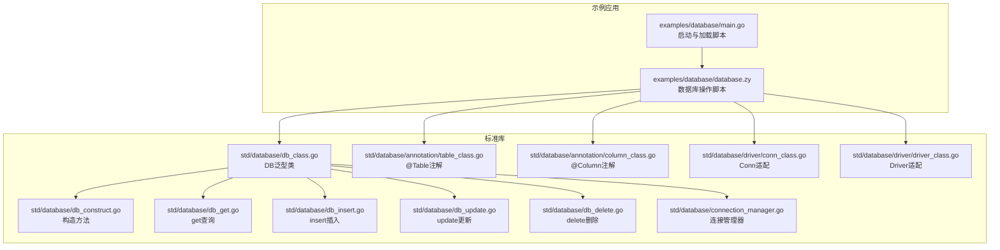
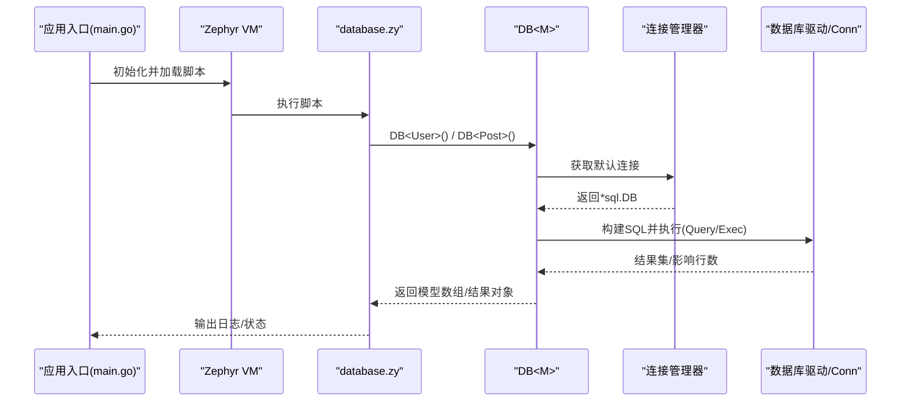
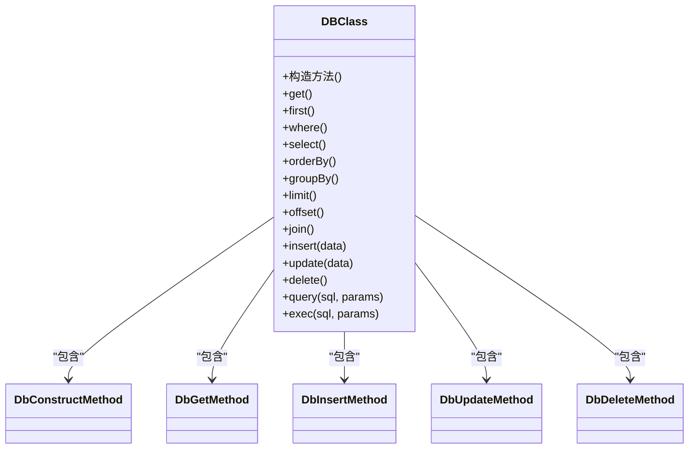
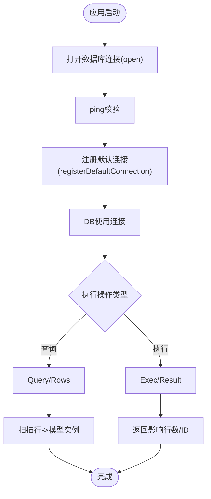
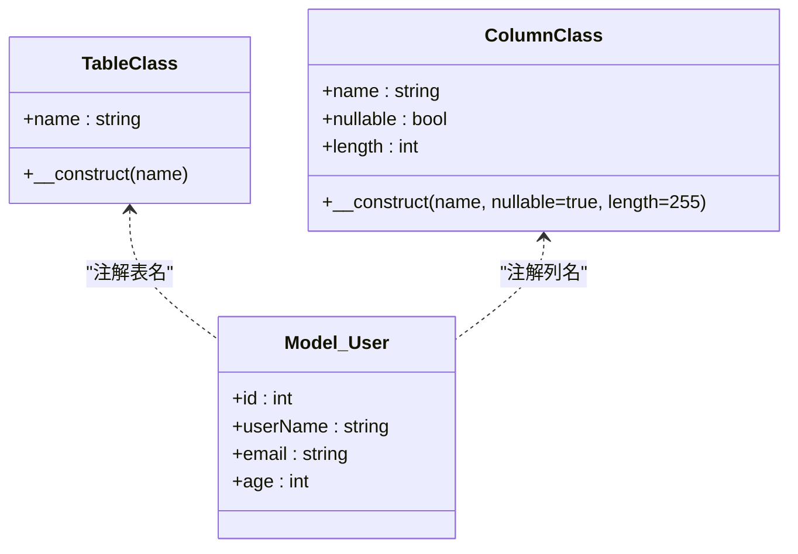
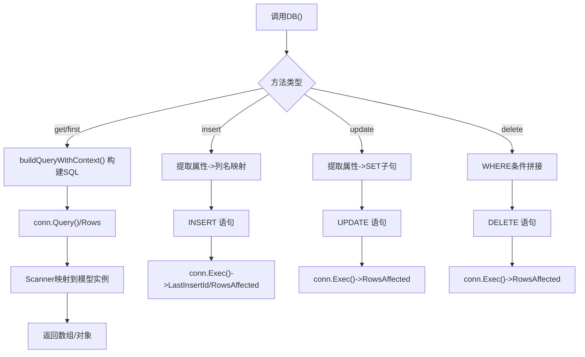
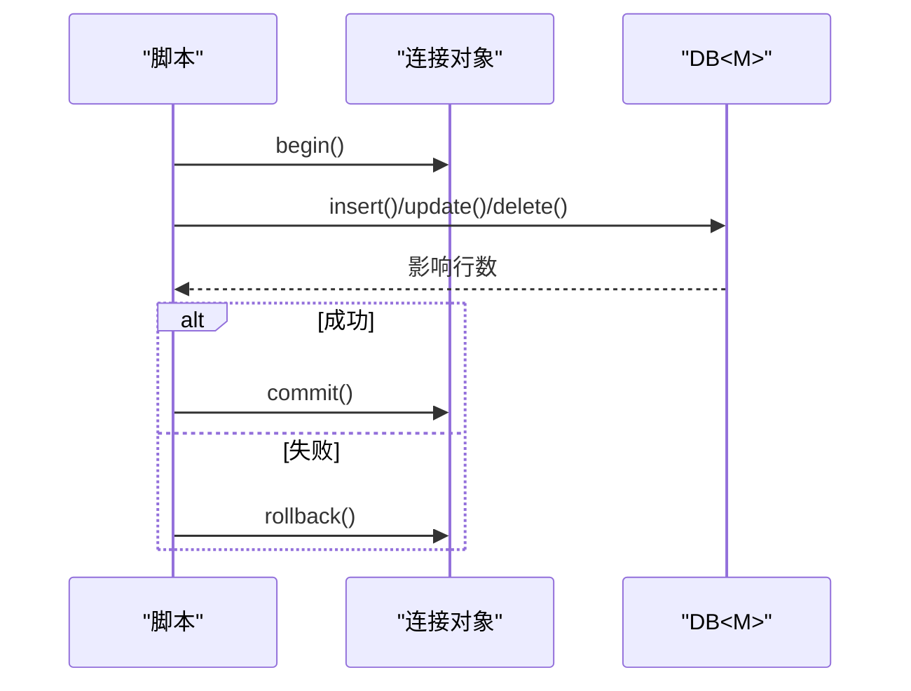
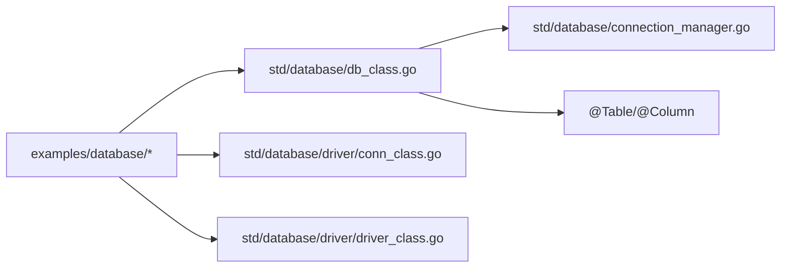

# 数据库应用示例

<cite>
**本文引用的文件**
- [examples/database/main.go](file://examples/database/main.go)
- [examples/database/database.zy](file://examples/database/database.zy)
- [std/database/db_class.go](file://std/database/db_class.go)
- [std/database/db_construct.go](file://std/database/db_construct.go)
- [std/database/db_get.go](file://std/database/db_get.go)
- [std/database/db_insert.go](file://std/database/db_insert.go)
- [std/database/db_update.go](file://std/database/db_update.go)
- [std/database/db_delete.go](file://std/database/db_delete.go)
- [std/database/connection_manager.go](file://std/database/connection_manager.go)
- [std/database/driver/conn_class.go](file://std/database/driver/conn_class.go)
- [std/database/driver/driver_class.go](file://std/database/driver/driver_class.go)
- [std/database/annotation/table_class.go](file://std/database/annotation/table_class.go)
- [std/database/annotation/column_class.go](file://std/database/annotation/column_class.go)
- [docs/database.md](file://docs/database.md)
</cite>

## 目录
1. [简介](#简介)
2. [项目结构](#项目结构)
3. [核心组件](#核心组件)
4. [架构概览](#架构概览)
5. [详细组件分析](#详细组件分析)
6. [依赖分析](#依赖分析)
7. [性能考虑](#性能考虑)
8. [故障排查指南](#故障排查指南)
9. [结论](#结论)
10. [附录](#附录)

## 简介
本文件面向数据库应用示例，系统化讲解如何在该代码库中使用数据库连接与 ORM 能力，覆盖以下主题：
- 数据库连接与多连接管理
- ORM 查询构建器与 CRUD 操作
- 注解驱动的模型映射（表、列、主键、自增）
- 原生 SQL 查询与执行
- 事务处理与连接池管理
- 图片托管应用的文件上传、数据库存储与静态资源管理思路
- 数据库迁移与初始化脚本（表创建、索引优化、数据种子）
- 错误处理、性能优化与并发控制最佳实践

## 项目结构
数据库示例位于 examples/database 目录，核心入口为 Go 主程序，配合 Zephyr 脚本完成数据库操作演示；标准库实现位于 std/database 下，提供 DB 泛型类、注解支持、驱动适配与连接管理。

**图示来源**
- [examples/database/main.go:1-41](file://examples/database/main.go#L1-L41)
- [examples/database/database.zy:1-207](file://examples/database/database.zy#L1-L207)
- [std/database/db_class.go:1-168](file://std/database/db_class.go#L1-L168)
- [std/database/db_construct.go:1-49](file://std/database/db_construct.go#L1-L49)
- [std/database/db_get.go:1-122](file://std/database/db_get.go#L1-L122)
- [std/database/db_insert.go:1-171](file://std/database/db_insert.go#L1-L171)
- [std/database/db_update.go:1-175](file://std/database/db_update.go#L1-L175)
- [std/database/db_delete.go:1-86](file://std/database/db_delete.go#L1-L86)
- [std/database/connection_manager.go:1-66](file://std/database/connection_manager.go#L1-L66)
- [std/database/annotation/table_class.go:1-131](file://std/database/annotation/table_class.go#L1-L131)
- [std/database/annotation/column_class.go:1-160](file://std/database/annotation/column_class.go#L1-L160)
- [std/database/driver/conn_class.go:1-59](file://std/database/driver/conn_class.go#L1-L59)
- [std/database/driver/driver_class.go:1-49](file://std/database/driver/driver_class.go#L1-L49)

**章节来源**
- [examples/database/main.go:1-41](file://examples/database/main.go#L1-L41)
- [examples/database/database.zy:1-207](file://examples/database/database.zy#L1-L207)

## 核心组件
- DB<M> 泛型类：提供 get/first/where/select/orderBy/groupBy/limit/offset/join 以及 insert/update/delete/query/exec 等方法，支持注解驱动的模型映射与参数化查询。
- 连接管理器：提供默认连接与命名连接的注册、获取、移除与列举能力，内部使用读写锁保证并发安全。
- 注解系统：@Table/@Column/@Id/@GeneratedValue 等注解用于模型到表/列的映射与元数据描述。
- 驱动适配：对 database/sql/driver 的 Conn/Driver 进行适配封装，便于统一调用。
- 示例脚本：演示 SQLite 连接、表创建、模型定义、CRUD、复杂查询、原生 SQL、关联查询、分页与清理流程。

**章节来源**
- [std/database/db_class.go:1-168](file://std/database/db_class.go#L1-L168)
- [std/database/connection_manager.go:1-66](file://std/database/connection_manager.go#L1-L66)
- [std/database/annotation/table_class.go:1-131](file://std/database/annotation/table_class.go#L1-L131)
- [std/database/annotation/column_class.go:1-160](file://std/database/annotation/column_class.go#L1-L160)
- [std/database/driver/conn_class.go:1-59](file://std/database/driver/conn_class.go#L1-L59)
- [std/database/driver/driver_class.go:1-49](file://std/database/driver/driver_class.go#L1-L49)
- [examples/database/database.zy:1-207](file://examples/database/database.zy#L1-L207)

## 架构概览
下图展示从应用入口到数据库操作的关键交互路径，包括连接建立、查询构建、注解解析与结果扫描。

**图示来源**
- [examples/database/main.go:15-40](file://examples/database/main.go#L15-L40)
- [examples/database/database.zy:18-24](file://examples/database/database.zy#L18-L24)
- [std/database/db_get.go:15-69](file://std/database/db_get.go#L15-L69)
- [std/database/connection_manager.go:44-47](file://std/database/connection_manager.go#L44-L47)

## 详细组件分析

### DB<M> 泛型类与方法族
- 构造方法：支持可选连接名称参数，用于指定命名连接。
- 查询方法：get/first/select/where/orderBy/groupBy/limit/offset/join。
- CRUD 方法：insert/update/delete，支持类实例与对象两种输入形式。
- 原生 SQL：query/exec，用于复杂场景与 DDL 操作。
- 注解支持：通过注解解析表名与列名映射，自动处理字段序列化/反序列化。

**图示来源**
- [std/database/db_class.go:11-168](file://std/database/db_class.go#L11-L168)
- [std/database/db_construct.go:8-49](file://std/database/db_construct.go#L8-L49)
- [std/database/db_get.go:11-122](file://std/database/db_get.go#L11-L122)
- [std/database/db_insert.go:11-171](file://std/database/db_insert.go#L11-L171)
- [std/database/db_update.go:12-175](file://std/database/db_update.go#L12-L175)
- [std/database/db_delete.go:11-86](file://std/database/db_delete.go#L11-L86)

**章节来源**
- [std/database/db_class.go:1-168](file://std/database/db_class.go#L1-L168)
- [std/database/db_construct.go:1-49](file://std/database/db_construct.go#L1-L49)
- [std/database/db_get.go:1-122](file://std/database/db_get.go#L1-L122)
- [std/database/db_insert.go:1-171](file://std/database/db_insert.go#L1-L171)
- [std/database/db_update.go:1-175](file://std/database/db_update.go#L1-L175)
- [std/database/db_delete.go:1-86](file://std/database/db_delete.go#L1-L86)

### 连接管理与驱动适配
- 连接管理器：线程安全地维护默认连接与命名连接，提供添加/获取/移除/列举能力。
- 驱动适配：将 database/sql/driver 的 Conn/Driver 包装为可调用的类，暴露 begin/close/prepare/open 等方法。
- 示例脚本：通过 open(...) 注册 SQLite 连接并 ping 校验，随后注册为默认连接供 DB<M> 使用。

**图示来源**
- [examples/database/database.zy:22-24](file://examples/database/database.zy#L22-L24)
- [std/database/connection_manager.go:19-65](file://std/database/connection_manager.go#L19-L65)
- [std/database/driver/conn_class.go:19-59](file://std/database/driver/conn_class.go#L19-L59)
- [std/database/driver/driver_class.go:17-49](file://std/database/driver/driver_class.go#L17-L49)

**章节来源**
- [std/database/connection_manager.go:1-66](file://std/database/connection_manager.go#L1-L66)
- [std/database/driver/conn_class.go:1-59](file://std/database/driver/conn_class.go#L1-L59)
- [std/database/driver/driver_class.go:1-49](file://std/database/driver/driver_class.go#L1-L49)
- [examples/database/database.zy:18-24](file://examples/database/database.zy#L18-L24)

### 注解驱动的模型映射
- @Table：指定模型对应的数据库表名；未标注时默认使用类名小写复数形式。
- @Column：指定属性到列的映射，支持 nullable/length 等元数据。
- @Id/@GeneratedValue：标识主键与自增字段。
- 映射规则：insert/update 时根据注解生成列名集合；get/first 时通过 Scanner 将列值映射到模型属性。

**图示来源**
- [std/database/annotation/table_class.go:16-131](file://std/database/annotation/table_class.go#L16-L131)
- [std/database/annotation/column_class.go:16-160](file://std/database/annotation/column_class.go#L16-L160)
- [examples/database/database.zy:57-74](file://examples/database/database.zy#L57-L74)

**章节来源**
- [std/database/annotation/table_class.go:1-131](file://std/database/annotation/table_class.go#L1-L131)
- [std/database/annotation/column_class.go:1-160](file://std/database/annotation/column_class.go#L1-L160)
- [examples/database/database.zy:57-74](file://examples/database/database.zy#L57-L74)

### CRUD 与查询构建器
- get/first：构建 SELECT 语句，支持 where/select/orderBy/groupBy/limit/offset/join；get 返回数组，first 返回单个对象。
- insert：从类实例或对象提取非空字段，生成 INSERT 语句并返回 lastInsertId/rowsAffected。
- update：从类实例或对象提取非空字段（除 null），生成 SET 子句；若无有效字段则报错。
- delete：根据 where 条件生成 DELETE 语句并返回 rowsAffected。
- query/exec：原生 SQL 查询与执行，适合复杂场景与 DDL。

**图示来源**
- [std/database/db_get.go:15-69](file://std/database/db_get.go#L15-L69)
- [std/database/db_insert.go:15-115](file://std/database/db_insert.go#L15-L115)
- [std/database/db_update.go:16-119](file://std/database/db_update.go#L16-L119)
- [std/database/db_delete.go:15-61](file://std/database/db_delete.go#L15-L61)

**章节来源**
- [std/database/db_get.go:1-122](file://std/database/db_get.go#L1-L122)
- [std/database/db_insert.go:1-171](file://std/database/db_insert.go#L1-L171)
- [std/database/db_update.go:1-175](file://std/database/db_update.go#L1-L175)
- [std/database/db_delete.go:1-86](file://std/database/db_delete.go#L1-L86)

### 事务处理与连接池管理
- 事务：通过连接对象的 begin/commit/rollback 方法包裹多个操作，确保原子性。
- 连接池：由底层 database/sql 驱动管理，默认连接池配置可结合业务压力调整；连接管理器提供命名连接隔离。
- 并发控制：连接管理器内部使用读写锁保护连接表；建议在高并发场景下限制最大连接数与超时时间。

**图示来源**
- [docs/database.md:417-437](file://docs/database.md#L417-L437)
- [std/database/connection_manager.go:19-65](file://std/database/connection_manager.go#L19-L65)

**章节来源**
- [docs/database.md:415-437](file://docs/database.md#L415-L437)
- [std/database/connection_manager.go:1-66](file://std/database/connection_manager.go#L1-L66)

### 图片托管应用（概念性方案）
说明如何基于现有数据库能力实现图片托管应用，涵盖文件上传、数据库存储与静态资源管理。该部分为概念性指导，不直接对应具体源码文件。

- 文件上传处理
  - 接收 multipart/form-data 请求，验证文件类型与大小。
  - 生成唯一文件名（如 UUID）并保存至 uploads 目录。
- 数据库存储
  - 设计图片表（例如 id、filename、original_name、size、mime、created_at）。
  - 将上传信息写入数据库，返回记录 ID。
- 静态资源管理
  - 提供 /uploads/{filename} 访问路径，结合 Web 服务器或应用路由转发。
- 查询与展示
  - 通过 DB 查询图片列表，支持分页与筛选。
  - 返回 JSON 或渲染模板展示图片列表与缩略图。

[本节为概念性内容，不直接分析具体文件，故无“章节来源”]

## 依赖分析
- 应用层依赖标准库的 DB 泛型类与注解系统；示例脚本通过 open(...) 注册连接并使用 DB<M> 进行操作。
- DB 类方法依赖连接管理器获取连接；get 方法依赖 Scanner 将行数据映射到模型实例。
- 驱动适配层将 database/sql/driver 的接口包装为可调用类，便于统一访问。

**图示来源**
- [examples/database/database.zy:13-17](file://examples/database/database.zy#L13-L17)
- [std/database/db_class.go:1-168](file://std/database/db_class.go#L1-L168)
- [std/database/connection_manager.go:1-66](file://std/database/connection_manager.go#L1-L66)
- [std/database/driver/conn_class.go:1-59](file://std/database/driver/conn_class.go#L1-L59)
- [std/database/driver/driver_class.go:1-49](file://std/database/driver/driver_class.go#L1-L49)

**章节来源**
- [examples/database/database.zy:13-17](file://examples/database/database.zy#L13-L17)
- [std/database/db_class.go:1-168](file://std/database/db_class.go#L1-L168)
- [std/database/connection_manager.go:1-66](file://std/database/connection_manager.go#L1-L66)
- [std/database/driver/conn_class.go:1-59](file://std/database/driver/conn_class.go#L1-L59)
- [std/database/driver/driver_class.go:1-49](file://std/database/driver/driver_class.go#L1-L49)

## 性能考虑
- 使用参数绑定：避免 SQL 注入同时提升缓存命中率与执行效率。
- 合理索引：为常用过滤/排序字段创建索引，减少全表扫描。
- 字段选择：仅 select 必要字段，降低网络与内存开销。
- 分页与批处理：大数据量采用 limit+offset 或游标分页，避免一次性加载过多数据。
- 连接池：根据并发与响应时间调优最大连接数与空闲连接数，避免连接争用。

[本节提供通用指导，不直接分析具体文件，故无“章节来源”]

## 故障排查指南
- 连接失败：检查 open(...) 参数与 ping() 是否成功；确认驱动已导入。
- 查询失败：查看 get 方法抛出的错误信息，核对 SQL 与参数类型。
- 插入/更新失败：确认数据类型与注解映射；update 时注意空值策略（仅跳过 null）。
- 事务异常：确保 begin/commit/rollback 成对出现，捕获异常后及时回滚。
- 并发问题：使用连接管理器提供的线程安全接口；必要时增加重试与超时控制。

**章节来源**
- [examples/database/database.zy:116-124](file://examples/database/database.zy#L116-L124)
- [std/database/db_get.go:15-39](file://std/database/db_get.go#L15-L39)
- [std/database/db_insert.go:15-94](file://std/database/db_insert.go#L15-L94)
- [std/database/db_update.go:16-105](file://std/database/db_update.go#L16-L105)
- [docs/database.md:540-556](file://docs/database.md#L540-L556)

## 结论
该数据库示例完整展示了从连接管理、注解映射到查询构建与事务处理的全流程。通过 DB<M> 泛型类与标准库注解系统，开发者可以以最小成本实现类型安全的 ORM 操作；配合连接管理器与驱动适配，能够灵活接入多种数据库后端。建议在生产环境中结合索引优化、参数绑定与连接池配置，持续监控性能与稳定性。

[本节为总结性内容，不直接分析具体文件，故无“章节来源”]

## 附录

### 数据库 Schema 与模型定义（示例）
- 用户表 users
  - 字段：id（主键，自增）、name、email（唯一）、age、created_at
  - 约束：UNIQUE(email)，DEFAULT CURRENT_TIMESTAMP
- 文章表 posts
  - 字段：id（主键，自增）、title、content、user_id（外键 references users.id）、created_at
  - 约束：FOREIGN KEY(user_id)

**章节来源**
- [examples/database/database.zy:30-51](file://examples/database/database.zy#L30-L51)

### 业务逻辑实现要点
- 表创建：在首次运行时执行 DDL；可结合迁移脚本逐步演进。
- 数据种子：通过 insert 批量写入初始数据，注意唯一约束与错误处理。
- 关联查询：使用 join 或多次查询组合，结合 orderBy/limit 实现分页。
- 清理与回收：提供 delete 清理测试数据，避免污染后续测试。

**章节来源**
- [examples/database/database.zy:197-206](file://examples/database/database.zy#L197-L206)

### 参考文档与示例
- 数据库模块快速开始、注解支持、查询构建器、CRUD 操作、原生 SQL、高级功能与最佳实践详见文档。

**章节来源**
- [docs/database.md:16-643](file://docs/database.md#L16-L643)