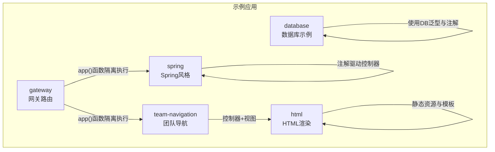
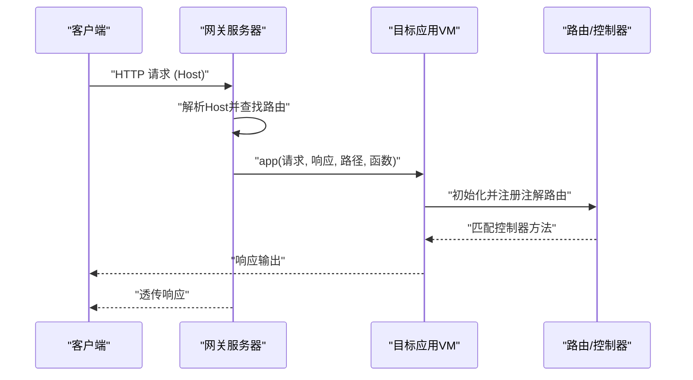
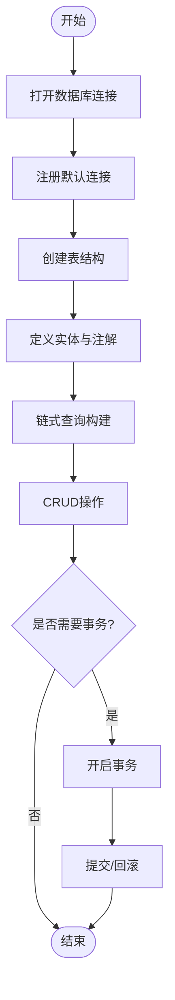
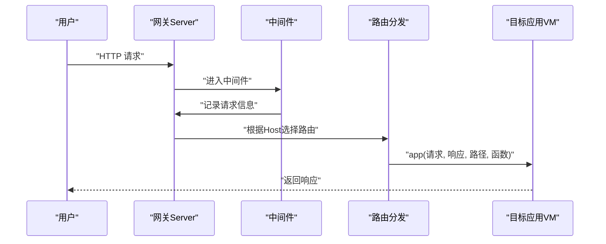
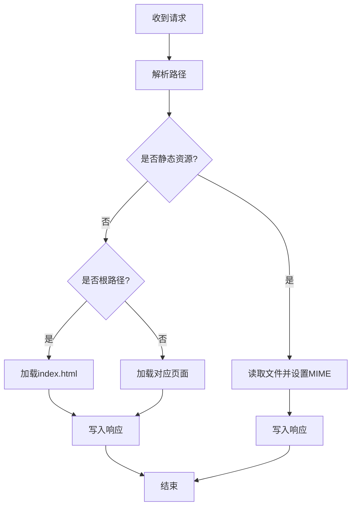
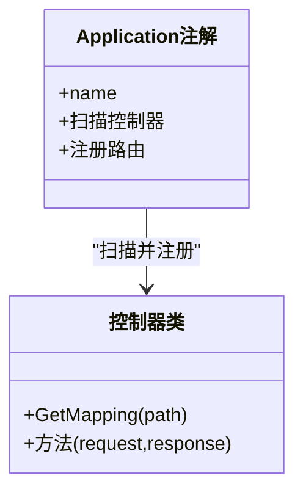
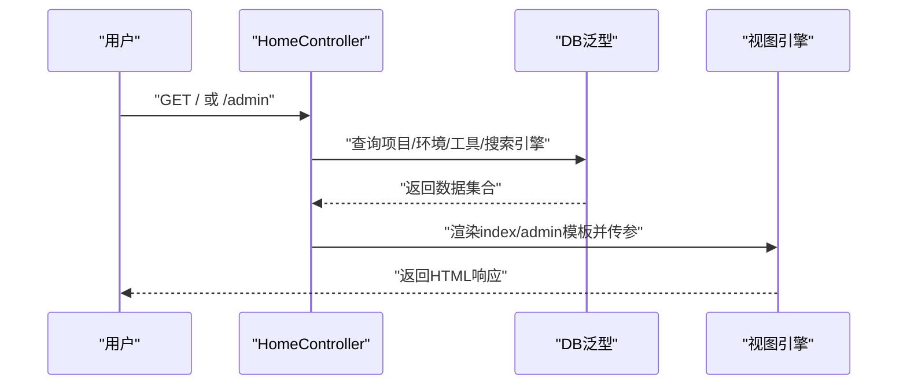
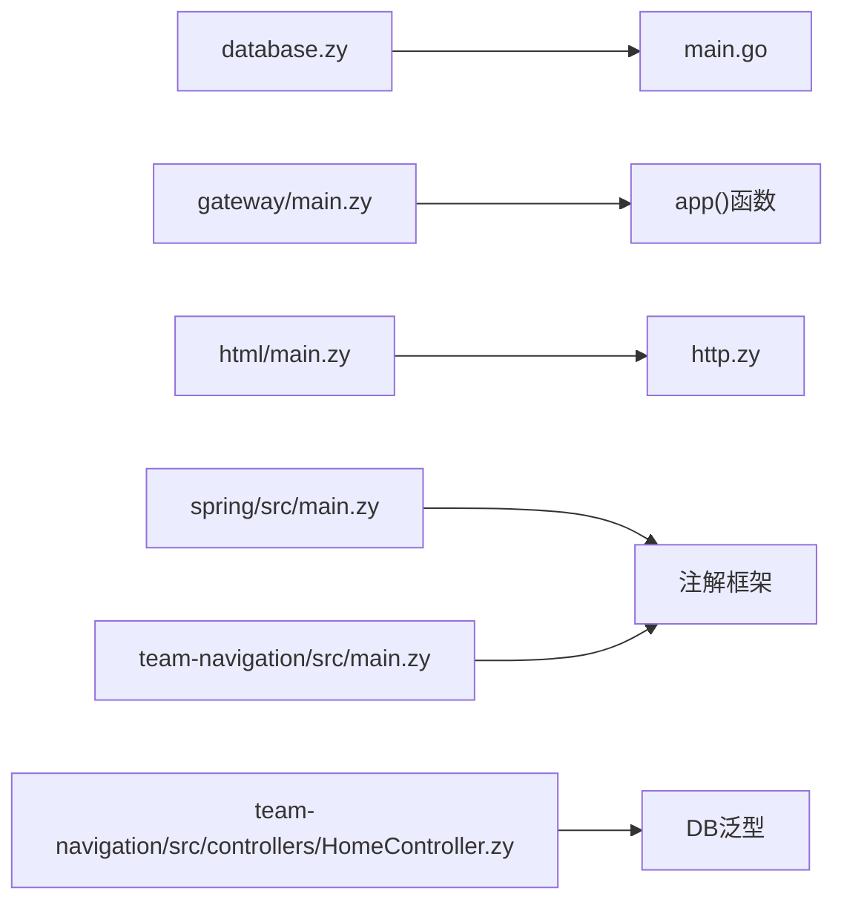

# 示例应用

<cite>
**本文引用的文件**
- [examples/database/main.go](file://examples/database/main.go)
- [examples/database/database.zy](file://examples/database/database.zy)
- [examples/gateway/main.zy](file://examples/gateway/main.zy)
- [examples/gateway/apps/demo/src/main.zy](file://examples/gateway/apps/demo/src/main.zy)
- [examples/html/http.zy](file://examples/html/http.zy)
- [examples/html/main.zy](file://examples/html/main.zy)
- [examples/spring/src/main.zy](file://examples/spring/src/main.zy)
- [examples/team-navigation/src/main.zy](file://examples/team-navigation/src/main.zy)
- [examples/team-navigation/src/controllers/HomeController.zy](file://examples/team-navigation/src/controllers/HomeController.zy)
</cite>

## 目录
1. [简介](#简介)
2. [项目结构](#项目结构)
3. [核心组件](#核心组件)
4. [架构总览](#架构总览)
5. [详细组件分析](#详细组件分析)
6. [依赖分析](#依赖分析)
7. [性能考虑](#性能考虑)
8. [故障排查指南](#故障排查指南)
9. [结论](#结论)
10. [附录](#附录)

## 简介
本文件为Origami示例应用的综合技术文档，覆盖以下主题：
- Web应用示例：路由配置、控制器设计、模板渲染与数据库集成
- 数据库应用实现：ORM使用、查询构建、事务处理与连接池管理
- 网关应用架构：请求转发、负载均衡与安全控制
- HTML渲染示例：模板系统与动态内容生成
- Spring风格应用：依赖注入、AOP与微服务架构
每个示例均提供完整代码路径、配置说明与运行指南，帮助读者快速理解与复用。

## 项目结构
示例应用位于examples目录下，按功能划分：
- database：数据库ORM与SQL示例
- gateway：多应用网关路由与隔离执行
- html：静态资源与模板渲染示例
- spring：基于注解的Spring风格应用骨架
- team-navigation：带控制器与视图的完整示例
- websocket：实时通信示例（本文件不展开）

**图表来源**
- [examples/database/database.zy](file://examples/database/database.zy)
- [examples/gateway/main.zy](file://examples/gateway/main.zy)
- [examples/html/http.zy](file://examples/html/http.zy)
- [examples/spring/src/main.zy](file://examples/spring/src/main.zy)
- [examples/team-navigation/src/main.zy](file://examples/team-navigation/src/main.zy)

**章节来源**
- [examples/database/main.go](file://examples/database/main.go)
- [examples/gateway/main.zy](file://examples/gateway/main.zy)
- [examples/html/http.zy](file://examples/html/http.zy)
- [examples/spring/src/main.zy](file://examples/spring/src/main.zy)
- [examples/team-navigation/src/main.zy](file://examples/team-navigation/src/main.zy)

## 核心组件
- 数据库模块：通过DB泛型类与注解@Table/@Column实现ORM映射；支持链式查询构建器、原生SQL、聚合与分组、关联查询等
- 网关模块：基于Host头进行路由，使用app()函数在隔离VM中加载并执行目标应用，具备中间件与异常处理
- HTML渲染：统一入口处理静态资源与页面模板，支持Content-Type自动推断与404回退
- Spring风格：通过@Application注解扫描控制器并注册路由，每个请求分配独立VM以实现隔离
- 团队导航：包含控制器与视图，演示复杂数据装配与模板渲染

**章节来源**
- [examples/database/database.zy](file://examples/database/database.zy)
- [examples/gateway/main.zy](file://examples/gateway/main.zy)
- [examples/html/main.zy](file://examples/html/main.zy)
- [examples/spring/src/main.zy](file://examples/spring/src/main.zy)
- [examples/team-navigation/src/controllers/HomeController.zy](file://examples/team-navigation/src/controllers/HomeController.zy)

## 架构总览
下图展示网关如何将请求分发到不同应用，并由各应用内部的注解驱动机制完成路由与处理。

**图表来源**
- [examples/gateway/main.zy](file://examples/gateway/main.zy)
- [examples/gateway/apps/demo/src/main.zy](file://examples/gateway/apps/demo/src/main.zy)
- [examples/spring/src/main.zy](file://examples/spring/src/main.zy)
- [examples/team-navigation/src/main.zy](file://examples/team-navigation/src/main.zy)

## 详细组件分析

### 数据库应用：ORM、查询构建与事务
- 连接与初始化
  - 使用open注册SQLite连接，设置默认连接供DB泛型使用
  - 初始化用户与文章表结构
- ORM与注解
  - 通过@Table/@Column标注实体类，实现字段映射
- 查询构建器
  - 支持where、orderBy、limit、offset、groupBy、join等
  - 支持聚合查询与原生SQL
- CRUD与事务
  - insert、update、delete支持
  - 事务通过tx类方法封装（提交/回滚），可结合查询构建器使用
- 连接池
  - 默认连接作为全局默认连接；如需池化，可在上层封装连接池管理器并在应用启动时注册

**图表来源**
- [examples/database/database.zy](file://examples/database/database.zy)

**章节来源**
- [examples/database/database.zy](file://examples/database/database.zy)
- [examples/database/main.go](file://examples/database/main.go)

### 网关应用：请求转发、隔离执行与安全
- 路由表
  - 以Host为键，映射到目标应用的文件路径与入口函数
- 中间件
  - 记录请求日志，便于审计与排障
- 分发逻辑
  - 解析Host，去除端口后匹配路由；未命中时回退至默认路由
  - 使用app()函数在独立VM中加载目标应用，确保请求隔离
- 异常处理
  - 捕获异常并返回标准化错误响应

**图表来源**
- [examples/gateway/main.zy](file://examples/gateway/main.zy)

**章节来源**
- [examples/gateway/main.zy](file://examples/gateway/main.zy)
- [examples/gateway/apps/demo/src/main.zy](file://examples/gateway/apps/demo/src/main.zy)

### HTML渲染：静态资源与模板
- 入口与中间件
  - 统一使用any匹配所有请求，中间件记录日志
- 静态资源
  - 对/assets/*路径直接读取文件并设置Content-Type
- 页面模板
  - 根路径默认加载index；移除前导斜杠后拼接路径
  - include加载HTML文件并写入响应
- 错误处理
  - 文件不存在或加载失败时记录日志并尝试其他方式
  - 最终404回退

**图表来源**
- [examples/html/http.zy](file://examples/html/http.zy)
- [examples/html/main.zy](file://examples/html/main.zy)

**章节来源**
- [examples/html/http.zy](file://examples/html/http.zy)
- [examples/html/main.zy](file://examples/html/main.zy)

### Spring风格应用：注解驱动与微服务
- 应用入口
  - @Application注解负责扫描控制器并注册路由
  - 每个请求分配独立VM，保证隔离
- 控制器示例
  - 通过@GetMapping等注解声明路由
  - 控制器方法接收$request/$response并返回响应

**图表来源**
- [examples/spring/src/main.zy](file://examples/spring/src/main.zy)
- [examples/team-navigation/src/main.zy](file://examples/team-navigation/src/main.zy)

**章节来源**
- [examples/spring/src/main.zy](file://examples/spring/src/main.zy)
- [examples/team-navigation/src/main.zy](file://examples/team-navigation/src/main.zy)

### 团队导航：控制器与视图
- 控制器
  - HomeController演示复杂数据装配：项目、环境、工具、搜索引擎
  - 使用DB泛型查询并组装数据
- 视图
  - 通过$response->view渲染模板并传入数据上下文

**图表来源**
- [examples/team-navigation/src/controllers/HomeController.zy](file://examples/team-navigation/src/controllers/HomeController.zy)

**章节来源**
- [examples/team-navigation/src/controllers/HomeController.zy](file://examples/team-navigation/src/controllers/HomeController.zy)

## 依赖分析
- 数据库示例
  - 依赖标准库与数据库子系统，使用SQLite驱动
- 网关示例
  - 依赖HTTP服务器与app()函数实现跨应用隔离执行
- HTML示例
  - 依赖HTTP服务器与app()函数，配合静态文件与模板
- Spring/团队导航
  - 依赖注解驱动框架与DB泛型

**图表来源**
- [examples/database/database.zy](file://examples/database/database.zy)
- [examples/database/main.go](file://examples/database/main.go)
- [examples/gateway/main.zy](file://examples/gateway/main.zy)
- [examples/html/main.zy](file://examples/html/main.zy)
- [examples/html/http.zy](file://examples/html/http.zy)
- [examples/spring/src/main.zy](file://examples/spring/src/main.zy)
- [examples/team-navigation/src/main.zy](file://examples/team-navigation/src/main.zy)
- [examples/team-navigation/src/controllers/HomeController.zy](file://examples/team-navigation/src/controllers/HomeController.zy)

**章节来源**
- [examples/database/main.go](file://examples/database/main.go)
- [examples/gateway/main.zy](file://examples/gateway/main.zy)
- [examples/html/http.zy](file://examples/html/http.zy)
- [examples/spring/src/main.zy](file://examples/spring/src/main.zy)
- [examples/team-navigation/src/main.zy](file://examples/team-navigation/src/main.zy)

## 性能考虑
- 连接池与并发
  - 默认连接适合演示场景；生产环境建议实现连接池管理器并复用连接
- VM隔离成本
  - app()函数每次调用会创建新VM，适合隔离但有开销；可按需缓存轻量状态或采用进程级复用策略
- 查询优化
  - 合理使用索引、避免N+1查询；对高频查询建立复合索引
- 静态资源
  - 使用浏览器缓存与CDN；压缩CSS/JS与图片
- 日志与监控
  - 结合中间件记录关键指标，接入APM以便定位瓶颈

## 故障排查指南
- 数据库
  - 检查连接字符串与权限；确认表结构已创建；查看唯一约束冲突
- 网关
  - 核对Host头与路由表；确认目标应用路径正确；检查app()调用参数
- HTML
  - 确认静态资源路径与MIME类型；检查模板文件是否存在
- 注解应用
  - 确保@Application与@GetMappping等注解生效；检查控制器命名空间与文件位置

**章节来源**
- [examples/database/database.zy](file://examples/database/database.zy)
- [examples/gateway/main.zy](file://examples/gateway/main.zy)
- [examples/html/main.zy](file://examples/html/main.zy)
- [examples/spring/src/main.zy](file://examples/spring/src/main.zy)
- [examples/team-navigation/src/main.zy](file://examples/team-navigation/src/main.zy)

## 结论
本示例集展示了Origami在Web应用开发中的多种实践模式：从数据库ORM到网关路由，从HTML渲染到注解驱动的Spring风格应用。通过这些示例，开发者可以快速掌握路由配置、控制器设计、模板渲染、数据库集成、隔离执行与注解驱动的微服务架构。

## 附录

### 运行指南
- 数据库示例
  - 进入database目录，编译并运行Go入口，随后脚本将自动执行数据库示例
  - 参考路径：[examples/database/main.go](file://examples/database/main.go)，[examples/database/database.zy](file://examples/database/database.zy)
- 网关示例
  - 运行网关主脚本，访问demo.local与spring.local域名以体验路由分发
  - 参考路径：[examples/gateway/main.zy](file://examples/gateway/main.zy)
- HTML示例
  - 启动HTTP服务器，访问根路径查看页面与静态资源
  - 参考路径：[examples/html/http.zy](file://examples/html/http.zy)，[examples/html/main.zy](file://examples/html/main.zy)
- Spring风格示例
  - 启动应用入口，注解自动扫描并注册路由
  - 参考路径：[examples/spring/src/main.zy](file://examples/spring/src/main.zy)
- 团队导航示例
  - 启动应用入口，访问根路径与管理页面
  - 参考路径：[examples/team-navigation/src/main.zy](file://examples/team-navigation/src/main.zy)，[examples/team-navigation/src/controllers/HomeController.zy](file://examples/team-navigation/src/controllers/HomeController.zy)