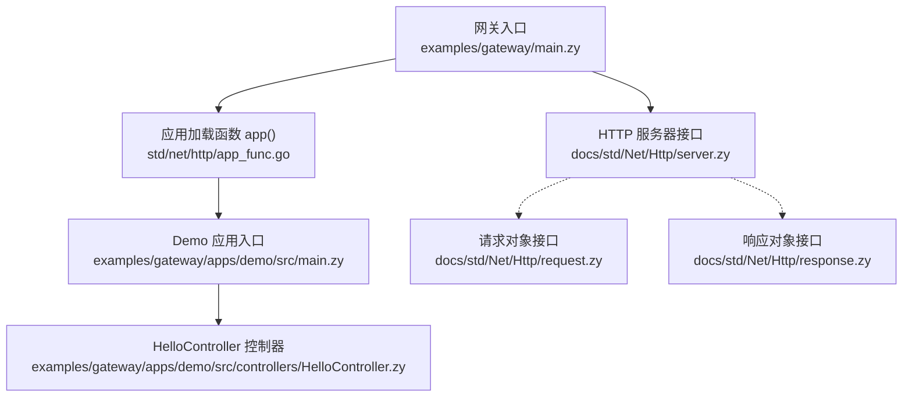
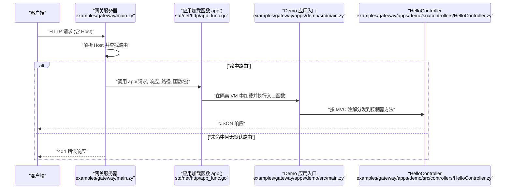
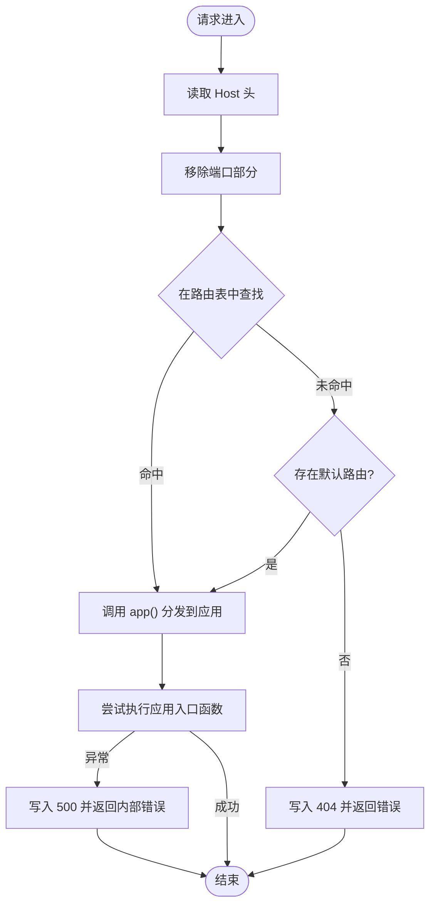
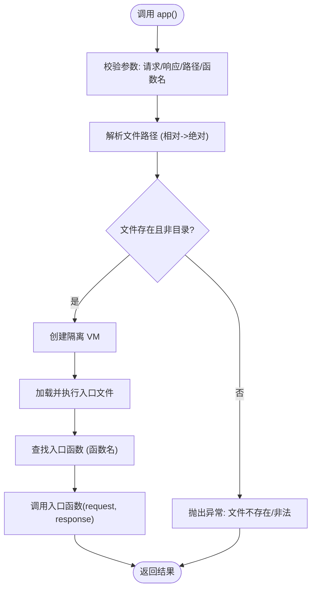
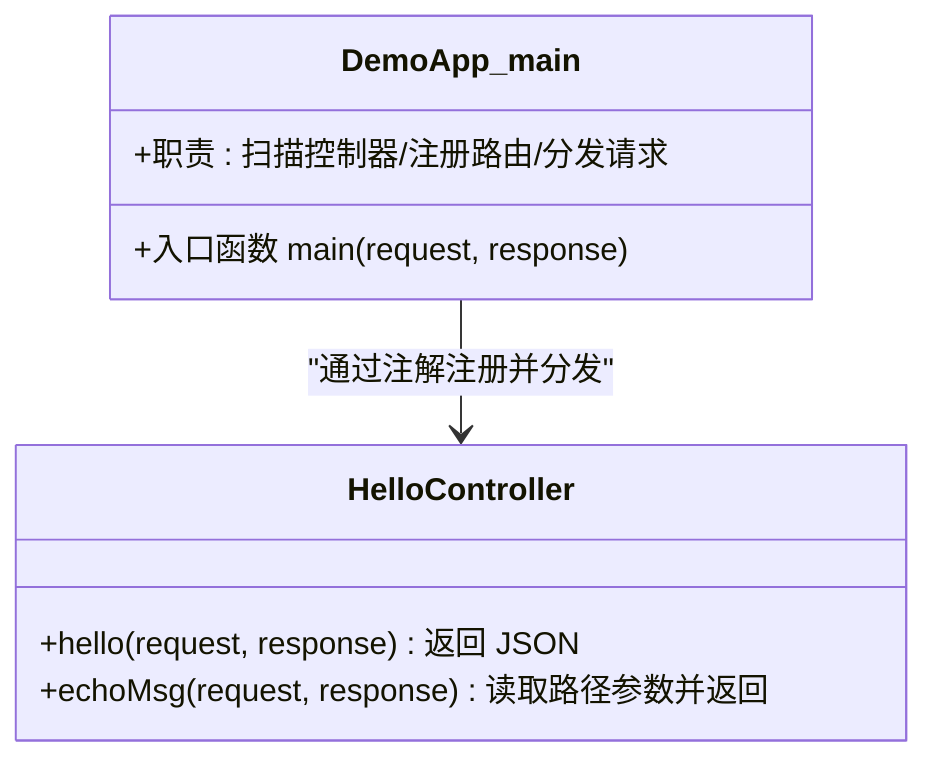
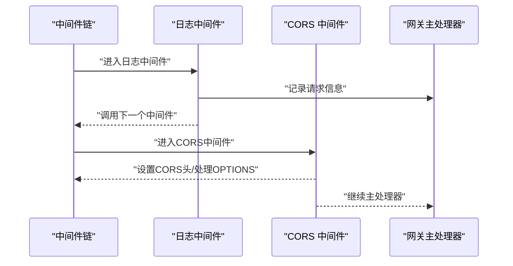
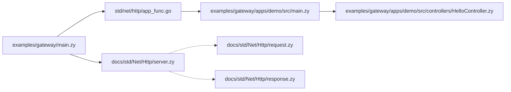

# 网关应用示例

<cite>
**本文引用的文件**
- [examples/gateway/README.md](file://examples/gateway/README.md)
- [examples/gateway/main.zy](file://examples/gateway/main.zy)
- [examples/gateway/apps/demo/src/main.zy](file://examples/gateway/apps/demo/src/main.zy)
- [examples/gateway/apps/demo/src/controllers/HelloController.zy](file://examples/gateway/apps/demo/src/controllers/HelloController.zy)
- [docs/std/Net/Http/server.zy](file://docs/std/Net/Http/server.zy)
- [docs/std/Net/Http/request.zy](file://docs/std/Net/Http/request.zy)
- [docs/std/Net/Http/response.zy](file://docs/std/Net/Http/response.zy)
- [std/net/http/app_func.go](file://std/net/http/app_func.go)
- [examples/http/http.zy](file://examples/http/http.zy)
</cite>

## 目录
1. [简介](#简介)
2. [项目结构](#项目结构)
3. [核心组件](#核心组件)
4. [架构总览](#架构总览)
5. [详细组件分析](#详细组件分析)
6. [依赖关系分析](#依赖关系分析)
7. [性能考虑](#性能考虑)
8. [故障排查指南](#故障排查指南)
9. [结论](#结论)
10. [附录](#附录)

## 简介
本示例展示如何使用 Origami 构建一个强大的 API 网关。网关根据请求的 Host 头动态路由到不同的应用，每个应用在隔离的 VM 环境中运行，支持统一入口点与跨领域关注点（如日志、错误处理）集中管理，并提供完整的 MVC 支持。示例同时演示了：
- 请求网关的架构设计：路由匹配、请求转发、响应处理
- HelloController 控制器实现：HTTP 方法处理、参数解析、数据返回
- 网关中间件模式：请求拦截、身份验证与日志记录
- 负载均衡与故障转移策略：健康检查、重试机制、熔断保护
- 网关安全控制：CORS 配置、请求限制、访问控制

## 项目结构
网关示例由以下关键部分组成：
- 网关入口与路由：examples/gateway/main.zy
- 示例应用 Demo：examples/gateway/apps/demo/src/main.zy 与控制器 HelloController.zy
- 标准库 HTTP 接口：docs/std/Net/Http/*.zy
- 应用加载函数 app：std/net/http/app_func.go
- 基础 HTTP 示例与中间件：examples/http/http.zy
- 使用说明与示例命令：examples/gateway/README.md

**图表来源**
- [examples/gateway/main.zy:1-103](file://examples/gateway/main.zy#L1-L103)
- [std/net/http/app_func.go:1-117](file://std/net/http/app_func.go#L1-L117)
- [examples/gateway/apps/demo/src/main.zy:1-15](file://examples/gateway/apps/demo/src/main.zy#L1-L15)
- [examples/gateway/apps/demo/src/controllers/HelloController.zy:1-31](file://examples/gateway/apps/demo/src/controllers/HelloController.zy#L1-L31)
- [docs/std/Net/Http/server.zy:1-109](file://docs/std/Net/Http/server.zy#L1-L109)
- [docs/std/Net/Http/request.zy:1-197](file://docs/std/Net/Http/request.zy#L1-L197)
- [docs/std/Net/Http/response.zy:1-53](file://docs/std/Net/Http/response.zy#L1-L53)

**章节来源**
- [examples/gateway/README.md:1-67](file://examples/gateway/README.md#L1-L67)
- [examples/gateway/main.zy:1-103](file://examples/gateway/main.zy#L1-L103)

## 核心组件
- 网关服务器与路由表：定义 Host 到应用入口函数的映射，支持默认路由回退。
- 中间件：全局日志记录与请求拦截。
- 应用加载函数 app：动态加载指定路径的应用入口函数并在隔离 VM 中执行。
- Demo 应用：通过 @Application 注解自动扫描控制器并注册路由。
- HelloController：提供 GET /hello 与带路径参数的 /echo/{message}。

**章节来源**
- [examples/gateway/main.zy:16-34](file://examples/gateway/main.zy#L16-L34)
- [examples/gateway/main.zy:47-51](file://examples/gateway/main.zy#L47-L51)
- [std/net/http/app_func.go:18-95](file://std/net/http/app_func.go#L18-L95)
- [examples/gateway/apps/demo/src/main.zy:5-13](file://examples/gateway/apps/demo/src/main.zy#L5-L13)
- [examples/gateway/apps/demo/src/controllers/HelloController.zy:11-28](file://examples/gateway/apps/demo/src/controllers/HelloController.zy#L11-L28)

## 架构总览
网关采用“请求进入 -> 主处理器 -> 路由查找 -> 应用加载 -> 控制器分发”的流程。请求通过 Server.any 注册的主处理器，依据 Host 头选择路由；若未命中则回退至默认路由；最终通过 app() 将请求交由目标应用入口函数处理。

**图表来源**
- [examples/gateway/main.zy:54-99](file://examples/gateway/main.zy#L54-L99)
- [std/net/http/app_func.go:18-95](file://std/net/http/app_func.go#L18-L95)
- [examples/gateway/apps/demo/src/main.zy:6-13](file://examples/gateway/apps/demo/src/main.zy#L6-L13)
- [examples/gateway/apps/demo/src/controllers/HelloController.zy:11-28](file://examples/gateway/apps/demo/src/controllers/HelloController.zy#L11-L28)

## 详细组件分析

### 组件一：网关主处理器与路由匹配
- 功能要点
  - 从请求头提取 Host，去除端口号后进行路由匹配。
  - 若未匹配到路由，尝试使用默认路由；否则返回 404。
  - 通过 app() 将请求转发给目标应用入口函数。
  - 异常捕获并返回 500。
- 关键行为
  - 路由表定义 Host 到应用入口函数的映射。
  - 默认路由可选，便于回退。
  - 日志中间件记录请求信息。

**图表来源**
- [examples/gateway/main.zy:54-99](file://examples/gateway/main.zy#L54-L99)

**章节来源**
- [examples/gateway/main.zy:16-34](file://examples/gateway/main.zy#L16-L34)
- [examples/gateway/main.zy:47-51](file://examples/gateway/main.zy#L47-L51)
- [examples/gateway/main.zy:54-99](file://examples/gateway/main.zy#L54-L99)

### 组件二：应用加载函数 app()
- 功能要点
  - 接收请求、响应、应用入口文件路径与函数名。
  - 在隔离 VM 中加载并执行目标应用入口函数。
  - 校验参数数量与文件存在性，抛出相应异常。
- 性能与隔离
  - 每次调用创建临时 VM，确保应用间完全隔离。
  - 文件路径支持相对路径解析与绝对路径校验。

**图表来源**
- [std/net/http/app_func.go:18-95](file://std/net/http/app_func.go#L18-L95)

**章节来源**
- [std/net/http/app_func.go:18-95](file://std/net/http/app_func.go#L18-L95)

### 组件三：Demo 应用与控制器
- Demo 应用入口
  - 使用 @Application 注解，自动扫描控制器并注册路由，随后将请求交由控制器处理。
- HelloController
  - 提供两个路由：
    - GET /hello：返回 JSON 数据，包含服务名、消息与时间戳。
    - GET /echo/{message}：从路径参数提取 message，返回 echo 结果。

**图表来源**
- [examples/gateway/apps/demo/src/main.zy:5-13](file://examples/gateway/apps/demo/src/main.zy#L5-L13)
- [examples/gateway/apps/demo/src/controllers/HelloController.zy:11-28](file://examples/gateway/apps/demo/src/controllers/HelloController.zy#L11-L28)

**章节来源**
- [examples/gateway/apps/demo/src/main.zy:5-13](file://examples/gateway/apps/demo/src/main.zy#L5-L13)
- [examples/gateway/apps/demo/src/controllers/HelloController.zy:11-28](file://examples/gateway/apps/demo/src/controllers/HelloController.zy#L11-L28)

### 组件四：中间件模式（日志与安全）
- 日志中间件
  - 记录请求方法、完整 URL、IP 等信息，贯穿请求生命周期。
- CORS 中间件（参考基础示例）
  - 设置允许的源、方法与头部；对 OPTIONS 预检直接返回 200。
- 身份验证与访问控制（建议实践）
  - 可在网关层添加鉴权中间件，校验 Authorization 头或 Token。
  - 对特定路由设置访问白名单或限流策略。

**图表来源**
- [examples/gateway/main.zy:47-51](file://examples/gateway/main.zy#L47-L51)
- [examples/http/http.zy:16-43](file://examples/http/http.zy#L16-L43)

**章节来源**
- [examples/gateway/main.zy:47-51](file://examples/gateway/main.zy#L47-L51)
- [examples/http/http.zy:16-43](file://examples/http/http.zy#L16-L43)

### 组件五：安全控制（CORS、请求限制、访问控制）
- CORS 配置
  - 在中间件中设置 Access-Control-Allow-* 头，处理预检请求。
- 请求限制
  - 可在网关层实现速率限制（例如基于 IP 或令牌），防止滥用。
- 访问控制
  - 基于 Host、路径、来源等维度进行黑白名单控制。
  - 结合鉴权中间件实现细粒度权限控制。

**章节来源**
- [examples/http/http.zy:31-43](file://examples/http/http.zy#L31-L43)

### 组件六：负载均衡与故障转移（策略建议）
- 健康检查
  - 定期探测下游服务可用性，标记不可用节点。
- 重试机制
  - 对瞬时错误（如超时、连接失败）进行有限次数重试。
- 熔断保护
  - 当错误率超过阈值，短时间拒绝请求，避免雪崩效应。
- 负载均衡
  - 基于轮询、权重或最少连接策略选择下游节点。

[本节为概念性指导，不直接分析具体文件，故无“章节来源”]

## 依赖关系分析
- 网关入口依赖 HTTP 服务器接口与应用加载函数。
- 应用加载函数负责隔离 VM 与入口函数调用。
- Demo 应用入口依赖注解系统完成控制器扫描与路由注册。
- 控制器依赖请求/响应接口进行参数解析与数据返回。

**图表来源**
- [examples/gateway/main.zy:1-103](file://examples/gateway/main.zy#L1-L103)
- [std/net/http/app_func.go:1-117](file://std/net/http/app_func.go#L1-L117)
- [examples/gateway/apps/demo/src/main.zy:1-15](file://examples/gateway/apps/demo/src/main.zy#L1-L15)
- [examples/gateway/apps/demo/src/controllers/HelloController.zy:1-31](file://examples/gateway/apps/demo/src/controllers/HelloController.zy#L1-L31)
- [docs/std/Net/Http/server.zy:1-109](file://docs/std/Net/Http/server.zy#L1-L109)
- [docs/std/Net/Http/request.zy:1-197](file://docs/std/Net/Http/request.zy#L1-L197)
- [docs/std/Net/Http/response.zy:1-53](file://docs/std/Net/Http/response.zy#L1-L53)

**章节来源**
- [examples/gateway/main.zy:1-103](file://examples/gateway/main.zy#L1-L103)
- [std/net/http/app_func.go:1-117](file://std/net/http/app_func.go#L1-L117)

## 性能考虑
- 应用隔离带来的开销
  - 每次请求创建临时 VM，适合低频场景；高频场景建议复用 VM 或优化启动流程。
- 路由查找复杂度
  - 使用哈希表存储路由表，查找近似 O(1)，满足高并发需求。
- 中间件链长度
  - 合理组织中间件顺序，避免重复计算；将静态检查前置。
- 响应序列化
  - 控制器统一使用 JSON 输出，减少格式转换成本。

[本节提供通用建议，不直接分析具体文件，故无“章节来源”]

## 故障排查指南
- 404 服务未找到
  - 检查路由表中 Host 是否正确；确认默认路由是否配置。
- 500 网关内部错误
  - 查看异常信息；确认目标应用入口函数签名与参数数量。
- 路由未命中
  - 确认 Host 头是否包含端口；确保路由表键与 Host 匹配。
- CORS 问题
  - 确认中间件已启用；检查预检请求处理逻辑。

**章节来源**
- [examples/gateway/main.zy:71-83](file://examples/gateway/main.zy#L71-L83)
- [examples/gateway/main.zy:86-98](file://examples/gateway/main.zy#L86-L98)

## 结论
该网关示例通过清晰的路由匹配、应用加载与控制器分发，展示了如何在 Origami 中构建可扩展的 API 网关。结合中间件模式与安全控制，可在统一入口点上实现日志、CORS、鉴权与访问控制等横切能力。配合合理的负载均衡与熔断策略，可进一步提升系统的稳定性与可靠性。

## 附录
- 快速开始
  - 启动网关：使用命令行运行网关入口脚本。
  - 测试路由：
    - 访问 Demo 应用的 /hello 与 /echo/{message}。
    - 访问 Spring 应用示例。
- 配置参考
  - 路由表：Host -> { path, func }。
  - 中间件：日志与 CORS 可直接复用基础示例。

**章节来源**
- [examples/gateway/README.md:21-67](file://examples/gateway/README.md#L21-L67)
- [examples/gateway/main.zy:16-34](file://examples/gateway/main.zy#L16-L34)
- [examples/http/http.zy:16-43](file://examples/http/http.zy#L16-L43)