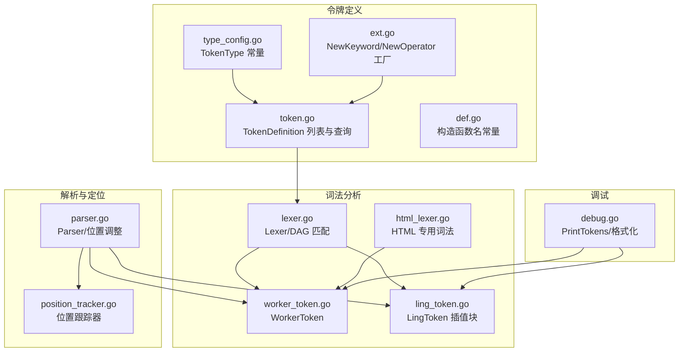
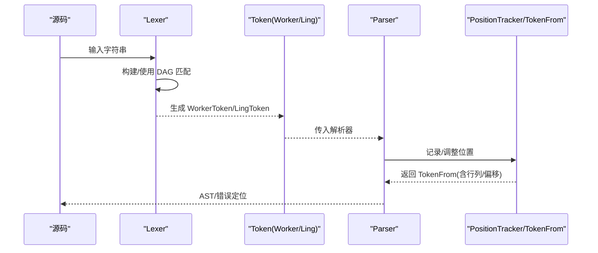
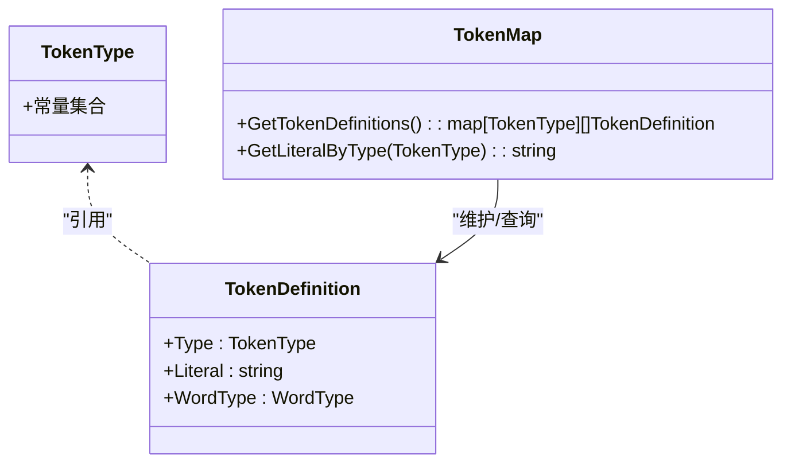
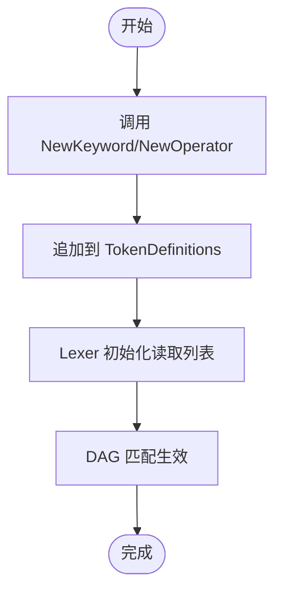
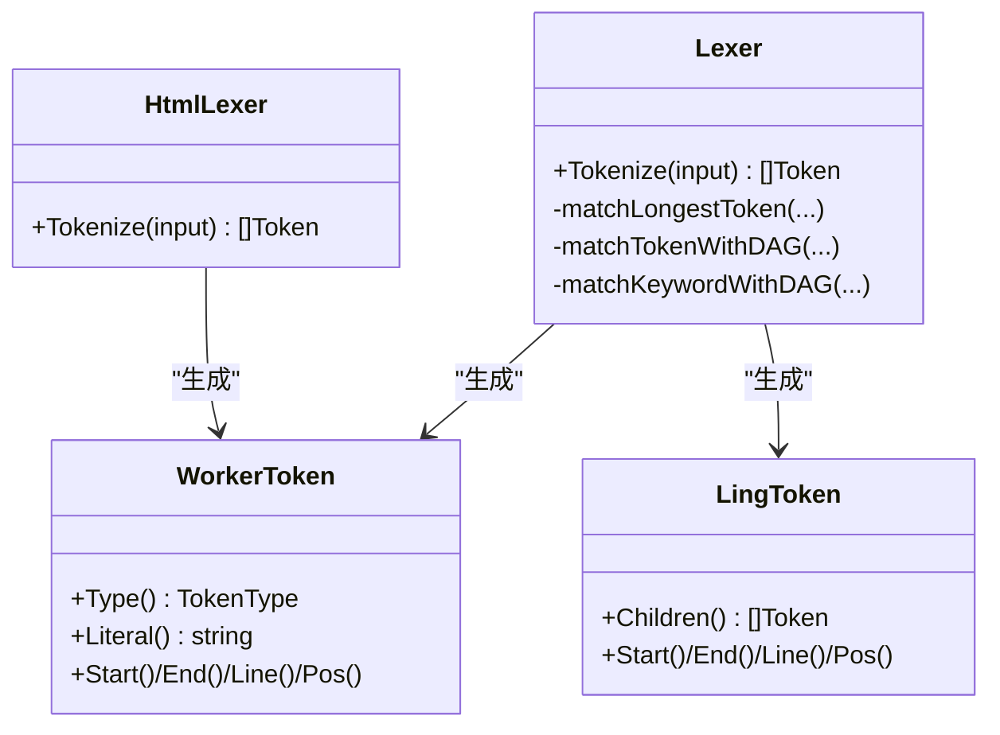
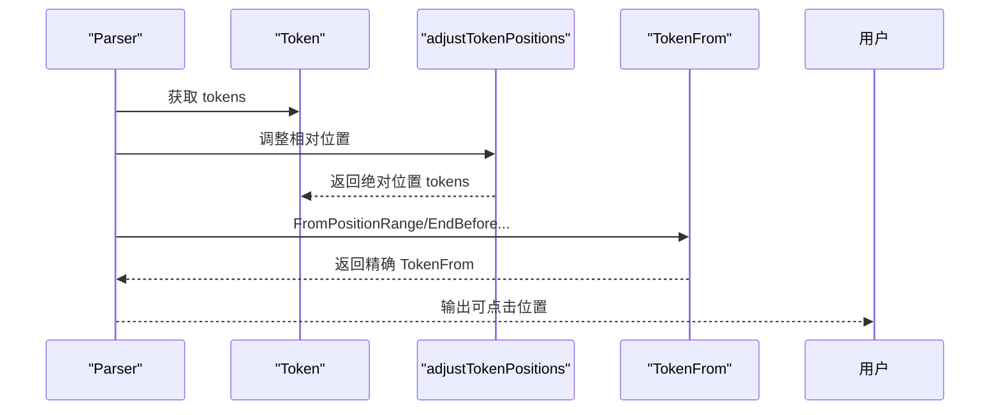
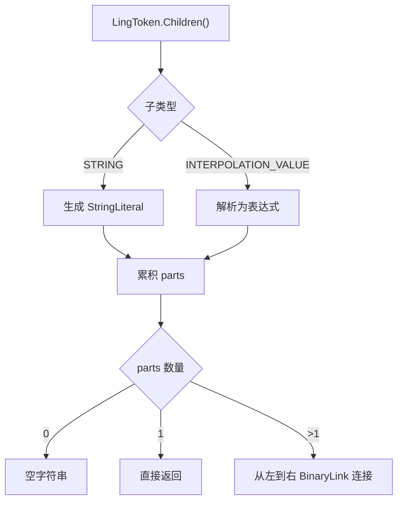
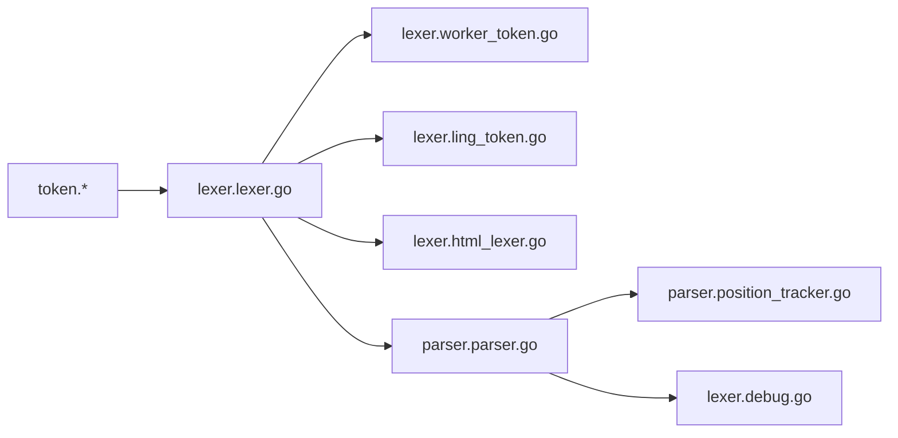

# 令牌系统

<cite>
**本文档引用的文件**
- [token.go](file://token/token.go)
- [type_config.go](file://token/type_config.go)
- [ext.go](file://token/ext.go)
- [def.go](file://token/def.go)
- [lexer.go](file://lexer/lexer.go)
- [worker_token.go](file://lexer/worker_token.go)
- [ling_token.go](file://lexer/ling_token.go)
- [html_lexer.go](file://lexer/html_lexer.go)
- [parser.go](file://parser/parser.go)
- [position_tracker.go](file://parser/position_tracker.go)
- [debug.go](file://lexer/debug.go)
</cite>

## 目录
1. [简介](#简介)
2. [项目结构](#项目结构)
3. [核心组件](#核心组件)
4. [架构总览](#架构总览)
5. [详细组件分析](#详细组件分析)
6. [依赖分析](#依赖分析)
7. [性能考虑](#性能考虑)
8. [故障排查指南](#故障排查指南)
9. [结论](#结论)
10. [附录](#附录)

## 简介
本文件面向编译器开发者，系统化阐述令牌系统的类型定义、工厂模式与扩展机制，详解令牌生命周期管理、位置信息跟踪与错误定位能力，覆盖内置令牌类型、扩展令牌类型与自定义令牌的实现路径，并给出序列化、反序列化与调试支持建议，最后提供扩展指南与性能优化策略。

## 项目结构
令牌系统位于 token 目录，词法分析器位于 lexer 目录，解析器位于 parser 目录。核心关系如下：
- token 定义与类型常量：type_config.go、token.go
- 令牌工厂与扩展：ext.go、def.go
- 词法分析器与令牌实现：lexer.go、worker_token.go、ling_token.go、html_lexer.go
- 位置跟踪与错误定位：parser.go、position_tracker.go
- 调试与可视化：debug.go

**图表来源**
- [type_config.go:3-199](file://token/type_config.go#L3-L199)
- [token.go:23-213](file://token/token.go#L23-L213)
- [ext.go:3-17](file://token/ext.go#L3-L17)
- [lexer.go:41-67](file://lexer/lexer.go#L41-L67)
- [worker_token.go:5-56](file://lexer/worker_token.go#L5-L56)
- [ling_token.go:5-63](file://lexer/ling_token.go#L5-L63)
- [html_lexer.go:10-23](file://lexer/html_lexer.go#L10-L23)
- [parser.go:17-50](file://parser/parser.go#L17-L50)
- [position_tracker.go:60-178](file://parser/position_tracker.go#L60-L178)
- [debug.go:11-61](file://lexer/debug.go#L11-L61)

**章节来源**
- [type_config.go:3-199](file://token/type_config.go#L3-L199)
- [token.go:23-213](file://token/token.go#L23-L213)
- [ext.go:3-17](file://token/ext.go#L3-L17)
- [lexer.go:41-67](file://lexer/lexer.go#L41-L67)
- [worker_token.go:5-56](file://lexer/worker_token.go#L5-L56)
- [ling_token.go:5-63](file://lexer/ling_token.go#L5-L63)
- [html_lexer.go:10-23](file://lexer/html_lexer.go#L10-L23)
- [parser.go:17-50](file://parser/parser.go#L17-L50)
- [position_tracker.go:60-178](file://parser/position_tracker.go#L60-L178)
- [debug.go:11-61](file://lexer/debug.go#L11-L61)

## 核心组件
- 令牌类型与定义
  - TokenType 常量集中定义于 type_config.go，涵盖关键字、运算符、字面量、标识符、注释、HTML 标签、未知等类别。
  - TokenDefinition 列表与查询函数定义于 token.go，提供按类型检索字面量与一次性构建映射树的能力。
- 令牌工厂与扩展
  - ext.go 提供 NewKeyword 与 NewOperator 工厂方法，允许在运行时向 TokenDefinitions 注入新令牌。
  - def.go 提供构造函数名常量，便于统一处理对象初始化。
- 词法分析与令牌实现
  - lexer.go 定义 Token 接口与 Lexer，采用 DAG 结构匹配关键字与符号，支持特殊令牌处理与标识符识别。
  - worker_token.go 实现 WorkerToken，承载基础位置信息与字面值。
  - ling_token.go 实现 LingToken，用于插值字符串的子令牌聚合。
  - html_lexer.go 专用于 HTML/模板场景，保留空白与标签结构，产出 HTML 相关令牌。
- 位置跟踪与错误定位
  - parser.go 提供位置调整工具与 TokenFrom 构造，支持跨文件/片段的绝对位置映射。
  - position_tracker.go 提供位置跟踪器，支持区间结束、精确结束与克隆等操作，配合 TokenFrom 输出可点击的错误位置。
- 调试与可视化
  - debug.go 提供 PrintTokens 与类型名称映射，便于快速定位词法问题。

**章节来源**
- [type_config.go:3-199](file://token/type_config.go#L3-L199)
- [token.go:23-213](file://token/token.go#L23-L213)
- [ext.go:3-17](file://token/ext.go#L3-L17)
- [def.go:1-4](file://token/def.go#L1-L4)
- [lexer.go:19-67](file://lexer/lexer.go#L19-L67)
- [worker_token.go:5-56](file://lexer/worker_token.go#L5-L56)
- [ling_token.go:5-63](file://lexer/ling_token.go#L5-L63)
- [html_lexer.go:10-23](file://lexer/html_lexer.go#L10-L23)
- [parser.go:732-800](file://parser/parser.go#L732-L800)
- [position_tracker.go:60-178](file://parser/position_tracker.go#L60-L178)
- [debug.go:11-61](file://lexer/debug.go#L11-L61)

## 架构总览
令牌系统围绕“类型定义—词法分析—解析定位—调试输出”的链路组织，DAG 匹配与位置信息贯穿始终，确保高性能与高可定位性。

**图表来源**
- [lexer.go:88-248](file://lexer/lexer.go#L88-L248)
- [worker_token.go:15-56](file://lexer/worker_token.go#L15-L56)
- [ling_token.go:16-63](file://lexer/ling_token.go#L16-L63)
- [parser.go:319-336](file://parser/parser.go#L319-L336)
- [position_tracker.go:60-143](file://parser/position_tracker.go#L60-L143)

## 详细组件分析

### 令牌类型与定义
- 类型体系
  - 关键字：条件、循环、函数、类、命名空间、控制流、魔术常量等。
  - 运算符：算术、比较、逻辑、位运算、赋值、三元、命名空间分隔、字符串连接等。
  - 字面量：整数、浮点、字符串、布尔、字节、NULL 等。
  - 其他：标识符、变量、注释、空白、换行、HTML 标签、未知、PHP 开始/结束标签等。
- 定义与查询
  - TokenDefinitions 为全局常量表，包含类型、字面量与词性分类。
  - GetTokenDefinitions 通过 once.Do 构建按类型分组的映射树，避免重复初始化。
  - GetLiteralByType 提供从类型到字面量的逆向查询。

**图表来源**
- [type_config.go:3-199](file://token/type_config.go#L3-L199)
- [token.go:23-213](file://token/token.go#L23-L213)

**章节来源**
- [type_config.go:3-199](file://token/type_config.go#L3-L199)
- [token.go:23-213](file://token/token.go#L23-L213)

### 令牌工厂与扩展机制
- 工厂方法
  - NewKeyword(word, t)：注入关键字令牌，WordType 设为 KEYWORD。
  - NewOperator(word, t)：注入运算符令牌，WordType 设为 OPERATOR。
- 扩展流程
  - 调用工厂方法将新令牌追加至 TokenDefinitions。
  - 词法分析器在初始化时读取该列表，自动纳入 DAG 匹配。
- 注意事项
  - 保证字面量与类型唯一性，避免歧义匹配。
  - 优先使用更长的复合符号（如 ??=），确保最长匹配优先级。

**图表来源**
- [ext.go:3-17](file://token/ext.go#L3-L17)
- [lexer.go:53-67](file://lexer/lexer.go#L53-L67)

**章节来源**
- [ext.go:3-17](file://token/ext.go#L3-L17)
- [lexer.go:53-67](file://lexer/lexer.go#L53-L67)

### 词法分析与令牌实现
- Lexer 与 DAG
  - Lexer 持有根节点 Node，逐字构建多叉树，匹配时沿最长路径前进。
  - 支持特殊令牌处理、Shebang 跳过、HTML 模式切换、UTF-8 错误回退。
- WorkerToken
  - 承载类型、字面值、起止偏移、行号与列号，满足基本定位需求。
- LingToken
  - 用于插值字符串，包含子令牌切片，解析器可将其还原为表达式链。
- HtmlLexer
  - 保留空白与标签结构，识别 DOCTYPE、注释、处理指令、属性值等，适配模板场景。

**图表来源**
- [lexer.go:41-350](file://lexer/lexer.go#L41-L350)
- [worker_token.go:5-56](file://lexer/worker_token.go#L5-L56)
- [ling_token.go:5-63](file://lexer/ling_token.go#L5-L63)
- [html_lexer.go:10-147](file://lexer/html_lexer.go#L10-L147)

**章节来源**
- [lexer.go:41-350](file://lexer/lexer.go#L41-L350)
- [worker_token.go:5-56](file://lexer/worker_token.go#L5-L56)
- [ling_token.go:5-63](file://lexer/ling_token.go#L5-L63)
- [html_lexer.go:10-147](file://lexer/html_lexer.go#L10-L147)

### 位置信息跟踪与错误定位
- 位置调整
  - adjustTokenPositions/adjustSingleTokenPosition 将子片段的相对位置映射为绝对位置，确保跨文件/片段的统一坐标系。
- TokenFrom 构造
  - FromPositionRange/EndAt/EndAtWithPosition/EndBefore 提供灵活的区间定位，支持单 token 精确结束列计算。
- 错误输出
  - Parser.ShowControl 与 printDetailedError/printRuntimeError 输出可点击的 path:line:col 位置，结合堆栈帧增强定位体验。

**图表来源**
- [parser.go:732-800](file://parser/parser.go#L732-L800)
- [parser.go:319-336](file://parser/parser.go#L319-L336)
- [parser.go:114-122](file://parser/parser.go#L114-L122)

**章节来源**
- [parser.go:732-800](file://parser/parser.go#L732-L800)
- [parser.go:319-336](file://parser/parser.go#L319-L336)
- [parser.go:114-122](file://parser/parser.go#L114-L122)

### 插值令牌与表达式解析
- LingToken 语义
  - 插值字符串拆分为若干子 token，包含 STRING 与 INTERPOLATION_VALUE。
- 解析流程
  - parseLingToken 将子 token 逐个解析为字符串字面量或表达式，使用 BinaryLink 从左到右连接，形成最终表达式节点。
  - parseTokensAsExpression 支持直接将一组 tokens 作为表达式解析，便于插值场景。

**图表来源**
- [parser.go:681-730](file://parser/parser.go#L681-L730)

**章节来源**
- [parser.go:681-730](file://parser/parser.go#L681-L730)

### 调试与可视化
- PrintTokens
  - 以表格形式输出索引、类型与字面值，支持换行符与制表符转义，便于肉眼核对。
- 类型名称映射
  - getTokenTypeName 将 TokenType 映射为可读名称，辅助日志与报告。
- 使用建议
  - 在关键阶段（如 Tokenize 后、预处理后、解析前）打印 Token 列表，快速定位词法/语法问题。

**章节来源**
- [debug.go:11-61](file://lexer/debug.go#L11-L61)

## 依赖分析
- 组件耦合
  - token 与 lexer：Lexer 依赖 TokenDefinition 列表与类型常量；WorkerToken/LingToken 依赖 token 包。
  - parser 与 lexer：Parser 通过 Lexer 生成 tokens，并依赖 TokenFrom 进行定位。
  - position_tracker 与 node：PositionTracker 返回 TokenFrom，供错误输出使用。
- 外部依赖
  - 无第三方词法/语法库，核心算法自实现，利于扩展与可控性。

**图表来源**
- [token.go:23-213](file://token/token.go#L23-L213)
- [lexer.go:41-67](file://lexer/lexer.go#L41-L67)
- [worker_token.go:5-56](file://lexer/worker_token.go#L5-L56)
- [ling_token.go:5-63](file://lexer/ling_token.go#L5-L63)
- [html_lexer.go:10-23](file://lexer/html_lexer.go#L10-L23)
- [parser.go:17-50](file://parser/parser.go#L17-L50)
- [position_tracker.go:60-178](file://parser/position_tracker.go#L60-L178)
- [debug.go:11-61](file://lexer/debug.go#L11-L61)

**章节来源**
- [token.go:23-213](file://token/token.go#L23-L213)
- [lexer.go:41-67](file://lexer/lexer.go#L41-L67)
- [worker_token.go:5-56](file://lexer/worker_token.go#L5-L56)
- [ling_token.go:5-63](file://lexer/ling_token.go#L5-L63)
- [html_lexer.go:10-23](file://lexer/html_lexer.go#L10-L23)
- [parser.go:17-50](file://parser/parser.go#L17-L50)
- [position_tracker.go:60-178](file://parser/position_tracker.go#L60-L178)
- [debug.go:11-61](file://lexer/debug.go#L11-L61)

## 性能考虑
- DAG 匹配
  - 词法阶段采用多叉树匹配，避免线性扫描，时间复杂度近似 O(L)，L 为匹配长度。
  - 建议：保持 TokenDefinitions 稳定，减少频繁重建；对复合符号按长度降序插入，确保最长优先。
- 位置计算
  - WorkerToken 直接记录绝对偏移与行列，避免解析阶段重复计算。
  - 跨片段解析时使用 adjustTokenPositions，批量调整，避免逐条计算。
- 内存与并发
  - GetTokenDefinitions 使用 once.Do 与互斥结构，保证初始化幂等与并发安全。
  - 建议：在热路径避免重复构建映射；必要时缓存 TokenFrom 查询结果。

[本节为通用指导，无需特定文件引用]

## 故障排查指南
- 常见问题
  - 词法无法识别：检查 TokenDefinitions 是否包含目标字面量；确认最长匹配优先级。
  - 插值解析异常：检查 LingToken 子 token 类型与顺序；确保 INTERPOLATION_VALUE 被正确解析为表达式。
  - 位置错乱：确认是否使用 adjustTokenPositions；检查 TokenFrom 的起止位置设置。
- 调试步骤
  - 使用 PrintTokens 输出关键阶段的 token 列表，比对类型与字面值。
  - 在解析器中调用 ShowControl 输出可点击的错误位置与堆栈。
  - 对 HTML/模板场景，优先使用 HtmlLexer 并保留空白与标签结构。

**章节来源**
- [debug.go:11-61](file://lexer/debug.go#L11-L61)
- [parser.go:251-298](file://parser/parser.go#L251-L298)
- [html_lexer.go:25-147](file://lexer/html_lexer.go#L25-L147)

## 结论
令牌系统以清晰的类型定义、高效的 DAG 匹配与完善的定位能力为核心，辅以灵活的工厂扩展与强大的调试工具，既满足内置语言的词法规约，也为扩展与定制提供了稳定基座。遵循本文的扩展与优化建议，可在保证性能的同时提升可维护性与可观测性。

[本节为总结，无需特定文件引用]

## 附录

### 令牌类型速查（节选）
- 关键字：IF/ELSE/ELSE_IF/WHILE/FOR/FOREACH/SWITCH/CASE/BREAK/CONTINUE/RETURN/...（详见 type_config.go）
- 运算符：ADD/SUB/MUL/QUO/REM/ASSIGN/EQ/NE/LT/GT/LE/GE/...（详见 type_config.go）
- 字面量：INT/FLOAT/STRING/BOOL/NULL/TRUE/FALSE/...（详见 type_config.go）
- 其他：IDENTIFIER/VARIABLE/COMMENT/MULTILINE_COMMENT/WHITESPACE/NEWLINE/EOF/HTML_TAG/UNKNOWN（详见 type_config.go）

**章节来源**
- [type_config.go:3-199](file://token/type_config.go#L3-L199)

### 自定义令牌实现步骤
- 定义类型常量
  - 在 type_config.go 中新增 TokenType 常量。
- 注入定义
  - 在 token.go 的 TokenDefinitions 中添加对应项，或使用 ext.go 的工厂方法动态注入。
- 词法支持
  - 确保字面量可被 Lexer 识别；如需特殊处理，可在 lexer.go 中补充匹配逻辑。
- 解析支持
  - 在解析器中增加对该类型的处理分支；必要时使用 TokenFrom 提供精确定位。
- 调试验证
  - 使用 PrintTokens 输出自定义令牌，确认类型与字面值正确。

**章节来源**
- [type_config.go:3-199](file://token/type_config.go#L3-L199)
- [token.go:23-213](file://token/token.go#L23-L213)
- [ext.go:3-17](file://token/ext.go#L3-L17)
- [lexer.go:88-248](file://lexer/lexer.go#L88-L248)
- [parser.go:368-378](file://parser/parser.go#L368-L378)
- [debug.go:11-61](file://lexer/debug.go#L11-L61)