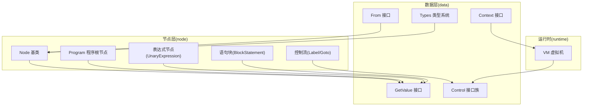
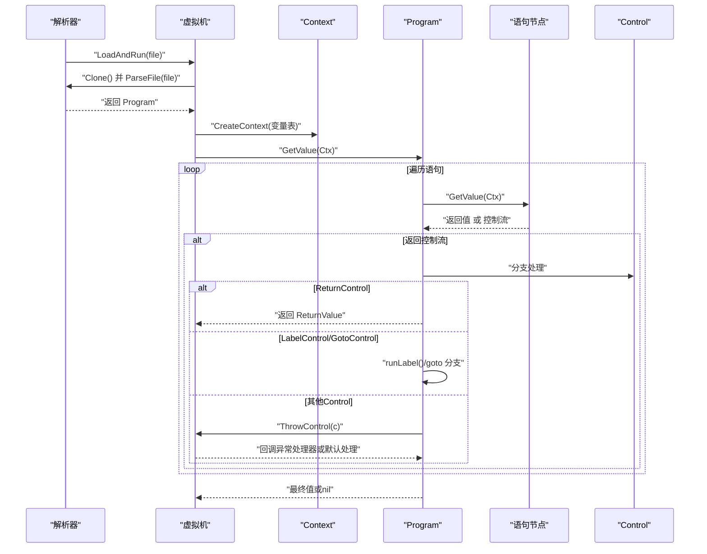
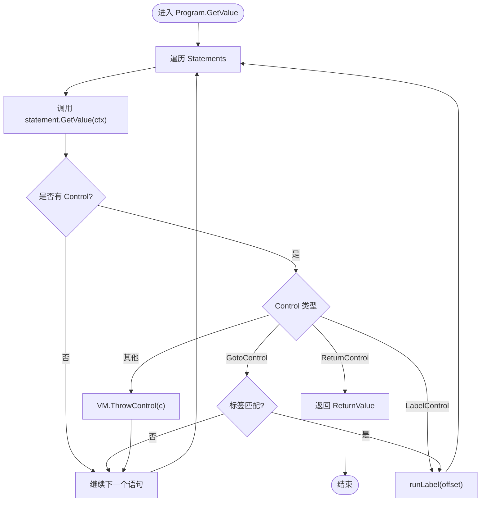
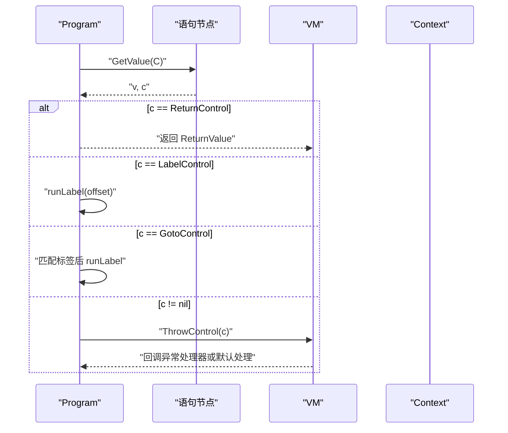
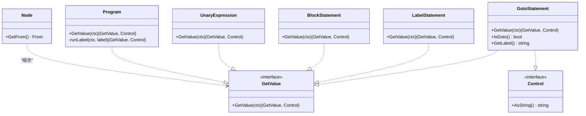
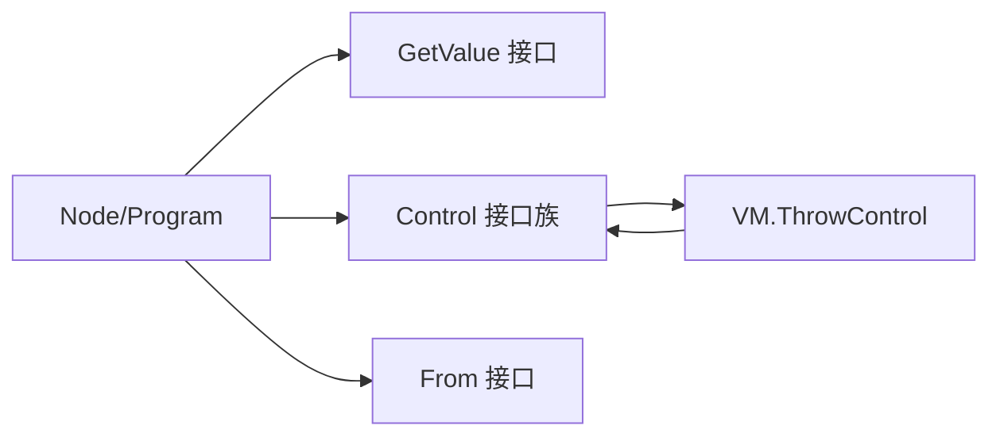

# AST节点基础

<cite>
**本文引用的文件**
- [node.go](file://node/node.go)
- [control.go](file://data/control.go)
- [context.go](file://data/context.go)
- [from.go](file://data/from.go)
- [types.go](file://data/types.go)
- [value_return.go](file://data/value_return.go)
- [vm.go](file://runtime/vm.go)
- [expression.go](file://node/expression.go)
- [block.go](file://node/block.go)
- [goto.go](file://node/goto.go)
- [return.go](file://node/return.go)
</cite>

## 目录
1. [简介](#简介)
2. [项目结构](#项目结构)
3. [核心组件](#核心组件)
4. [架构总览](#架构总览)
5. [详细组件分析](#详细组件分析)
6. [依赖分析](#依赖分析)
7. [性能考量](#性能考量)
8. [故障排查指南](#故障排查指南)
9. [结论](#结论)
10. [附录](#附录)

## 简介
本文件聚焦于AST节点基础系统，系统性阐述Node基类的设计理念与核心能力，Program根节点的执行模型与控制流管理，GetValue方法的工作机制与控制流传播策略，并梳理节点继承体系、接口契约与类型系统集成方式。同时给出节点创建的最佳实践与常见使用模式，帮助读者快速掌握从语法树构建到运行期执行的全链路。

## 项目结构
本系统围绕“数据层接口 + 节点层实现 + 运行时虚拟机”三层组织：
- 数据层(data包)：定义运行期通用接口与类型系统（如GetValue、Control、Context、From、Types等），统一抽象值、控制流、命名空间与变量表等。
- 节点层(node包)：以Node为基类派生各类语法节点（Program、表达式、语句块、控制流等），所有节点均实现GetValue以参与求值。
- 运行时(runtime)：VM负责类/接口/函数/常量/全局变量注册与查找，以及控制流的统一抛出与异常处理回调。

图表来源
- [node.go:1-99](file://node/node.go#L1-L99)
- [control.go:1-61](file://data/control.go#L1-L61)
- [context.go:1-349](file://data/context.go#L1-L349)
- [from.go:1-95](file://data/from.go#L1-L95)
- [types.go:1-262](file://data/types.go#L1-L262)
- [vm.go:1-391](file://runtime/vm.go#L1-L391)

章节来源
- [node.go:1-99](file://node/node.go#L1-L99)
- [context.go:1-349](file://data/context.go#L1-L349)
- [vm.go:1-391](file://runtime/vm.go#L1-L391)

## 核心组件
- Node基类：承载节点来源信息From与可求值属性value，提供NewNode工厂方法与GetFrom访问器。
- Program根节点：持有语句列表，逐条执行，处理Return、Label/Goto等控制流，支持标签驱动的局部跳转。
- GetValue接口：统一节点求值入口，返回值或控制流，控制流由VM统一处理。
- Control接口族：封装各类控制流（Return、Break/Continue、Exit、Goto、Yield等），支持堆栈信息注入。
- Context/VM：提供变量表、命名空间、异常处理回调、类/接口/函数/常量注册与查找等运行时能力。
- From：记录节点的源文件、字符偏移与行列位置，便于诊断与LSP支持。
- Types：类型系统，支持基础类型、联合类型、可空类型、多返回值类型与泛型类型等。

章节来源
- [node.go:1-99](file://node/node.go#L1-L99)
- [control.go:1-61](file://data/control.go#L1-L61)
- [context.go:1-349](file://data/context.go#L1-L349)
- [from.go:1-95](file://data/from.go#L1-L95)
- [types.go:1-262](file://data/types.go#L1-L262)

## 架构总览
下图展示从解析得到Program，到运行期逐条执行语句并处理控制流的整体流程。

图表来源
- [vm.go:275-289](file://runtime/vm.go#L275-L289)
- [node.go:44-98](file://node/node.go#L44-L98)
- [control.go:1-61](file://data/control.go#L1-L61)

## 详细组件分析

### Node基类与Program根节点
- 设计理念
  - Node作为所有语法节点的最小公共父类，统一持有From来源信息，便于定位错误与生成诊断。
  - 通过GetValue接口抽象节点求值，使Program与具体语句节点遵循一致的执行协议。
- 核心功能
  - NewNode：工厂方法创建节点并绑定来源。
  - GetFrom：暴露来源信息，供控制流注入堆栈时使用。
  - Program：持有语句列表，逐条执行，维护控制流状态并进行分支处理。
- 执行流程
  - GetValue遍历语句，对每个语句调用GetValue(ctx)，收集最后一个值作为结果。
  - 对于返回的控制流：
    - ReturnControl：立即终止当前执行，交由调用方处理返回值。
    - LabelControl：更新偏移并进入runLabel逻辑，从指定位置继续执行。
    - GotoControl：若命中标签则进入runLabel，否则继续后续语句。
    - 其他Control：通过VM.ThrowControl统一处理，必要时注入堆栈信息。

图表来源
- [node.go:44-98](file://node/node.go#L44-L98)
- [control.go:1-61](file://data/control.go#L1-L61)

章节来源
- [node.go:1-99](file://node/node.go#L1-L99)

### GetValue方法的工作原理与控制流管理
- GetValue统一协议
  - 所有节点实现GetValue(ctx)返回(data.GetValue, data.Control)二元组。
  - 若返回非nil Control，表示当前节点产生了控制流（如Return、Goto、Throw等）。
- 控制流传播
  - Program在遍历过程中接收每个语句的Control，根据类型进行分支：
    - ReturnControl：直接返回，上层可继续处理。
    - LabelControl/GotoControl：调整执行偏移，进入局部执行循环。
    - 其他Control：通过ctx.GetVM().ThrowControl(c)交由虚拟机处理。
  - 对AddStack接口的Control，Program会尝试注入来源信息，增强诊断能力。

图表来源
- [node.go:44-98](file://node/node.go#L44-L98)
- [control.go:1-61](file://data/control.go#L1-L61)
- [vm.go:73-104](file://runtime/vm.go#L73-L104)

章节来源
- [node.go:44-98](file://node/node.go#L44-L98)
- [control.go:1-61](file://data/control.go#L1-L61)
- [vm.go:73-104](file://runtime/vm.go#L73-L104)

### 节点继承体系与接口契约
- 继承关系
  - Node为基类，Program、UnaryExpression、BlockStatement、LabelStatement、GotoStatement等均组合Node并实现GetValue。
- 接口契约
  - GetValue：统一求值入口，返回值或控制流。
  - GetFrom：暴露节点来源，便于堆栈注入与诊断。
  - Control族：封装各类控制流，支持堆栈注入（AddStack）。
- 示例节点
  - UnaryExpression：对右操作数求值后根据运算符计算结果。
  - BlockStatement：语句块容器，GetValue通常返回nil，由其子节点产生值或控制流。
  - Label/Goto：LabelStatement返回LabelControl，GotoStatement返回自身作为GotoControl，由Program统一调度。

图表来源
- [node.go:1-99](file://node/node.go#L1-L99)
- [expression.go:1-57](file://node/expression.go#L1-L57)
- [block.go:1-23](file://node/block.go#L1-L23)
- [goto.go:1-74](file://node/goto.go#L1-L74)
- [control.go:1-61](file://data/control.go#L1-L61)

章节来源
- [node.go:1-99](file://node/node.go#L1-L99)
- [expression.go:1-57](file://node/expression.go#L1-L57)
- [block.go:1-23](file://node/block.go#L1-L23)
- [goto.go:1-74](file://node/goto.go#L1-L74)

### 类型系统与节点集成
- 类型系统
  - Types接口定义类型判断与字符串化，支持基础类型、联合类型、可空类型、多返回值类型与泛型类型。
  - NewBaseType/NewUnionType/NewNullableType/NewMultipleReturnType等工厂函数构建复杂类型。
- 与节点的集成
  - 节点在求值时可结合Types进行类型校验（例如参数/变量赋值时的类型检查）。
  - 类型信息可用于诊断与LSP提示，From接口提供源文件与行列位置，便于定位类型相关问题。

章节来源
- [types.go:1-262](file://data/types.go#L1-L262)
- [from.go:1-95](file://data/from.go#L1-L95)

### 运行时与控制流处理
- VM职责
  - 注册与查找类/接口/函数/常量，管理全局变量，提供异常处理回调。
  - ThrowControl优先尝试调用PHP级异常处理回调，否则回退至默认处理。
- 控制流注入
  - 对AddStack接口的Control，Program在遇到非Return/Goto类控制流时注入来源信息，提升诊断质量。

章节来源
- [vm.go:1-391](file://runtime/vm.go#L1-L391)
- [node.go:44-98](file://node/node.go#L44-L98)

## 依赖分析
- 节点对数据层的依赖
  - 所有节点依赖GetValue、Control、Context、From等接口，确保求值与控制流的统一抽象。
- Program对控制流的处理
  - 直接分支处理ReturnControl、LabelControl、GotoControl，间接通过VM处理其他Control。
- VM对控制流的兜底
  - 通过ThrowControl集中处理未被节点消费的控制流，支持用户态异常回调。

图表来源
- [node.go:1-99](file://node/node.go#L1-L99)
- [control.go:1-61](file://data/control.go#L1-L61)
- [vm.go:73-104](file://runtime/vm.go#L73-L104)

章节来源
- [node.go:1-99](file://node/node.go#L1-L99)
- [control.go:1-61](file://data/control.go#L1-L61)
- [vm.go:73-104](file://runtime/vm.go#L73-L104)

## 性能考量
- 求值路径短路
  - GetValue应尽量避免不必要的中间值分配，仅在确需时构造Value，减少GC压力。
- 控制流分支优化
  - 在高频控制流场景（如循环内Goto/Label）建议减少重复注入堆栈信息，必要时批量处理。
- 类型检查成本
  - 类型系统在节点求值阶段进行类型校验时，应避免重复计算，可缓存类型判断结果。
- 并发安全
  - VM内部使用互斥锁保护类/接口/函数/常量与全局变量表，注意在高并发场景下避免长时间持有锁。

## 故障排查指南
- 常见问题
  - 未处理的Control导致程序退出：确认节点是否正确返回Control，或在Program中是否正确分支处理。
  - 异常未被捕获：检查VM是否注册了异常处理回调，或是否在ThrowControl中被默认处理。
  - 标签跳转无效：核对Label与Goto的标签名一致性，以及Program.runLabel的偏移更新逻辑。
- 定位手段
  - 利用From提供的源文件与行列位置信息，结合AddStack注入的堆栈信息，快速定位问题节点。
  - 对ReturnControl，确认其ReturnValue是否符合预期类型与语义。

章节来源
- [node.go:44-98](file://node/node.go#L44-L98)
- [control.go:1-61](file://data/control.go#L1-L61)
- [vm.go:73-104](file://runtime/vm.go#L73-L104)
- [from.go:1-95](file://data/from.go#L1-L95)

## 结论
AST节点基础系统通过Node基类与GetValue接口实现了统一的求值协议，Program根节点承担了语句列表的执行与控制流分发职责。配合VM的异常处理与堆栈注入能力，系统在保证可扩展性的同时提供了良好的诊断与运行时支持。类型系统与节点求值的结合进一步提升了静态与动态检查的一致性。遵循本文的最佳实践与使用模式，可高效构建与维护复杂的语法树执行引擎。

## 附录

### 节点创建最佳实践
- 统一来源标注：所有节点创建时应绑定From，便于诊断与堆栈注入。
- 明确求值语义：节点应清晰区分“产生值”与“产生控制流”，避免混淆。
- 控制流显式返回：对于Return/Goto/Label等控制流，应在节点内明确返回对应Control。
- 类型约束：在参数/变量赋值等场景使用Types进行类型校验，减少运行期错误。

### 常见使用模式
- 表达式求值：先对子节点求值，再根据运算符进行计算，必要时返回错误控制流。
- 语句块执行：BlockStatement通常不直接产生值，由内部语句节点产生值或控制流。
- 程序执行：Program逐条执行语句，遇到Return/Goto/Label等控制流时进行相应分支处理。

章节来源
- [expression.go:1-57](file://node/expression.go#L1-L57)
- [block.go:1-23](file://node/block.go#L1-L23)
- [return.go:1-63](file://node/return.go#L1-L63)
- [value_return.go:1-31](file://data/value_return.go#L1-L31)