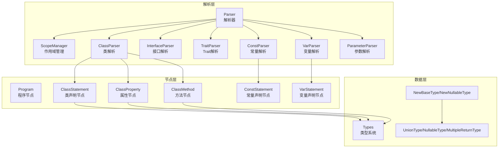
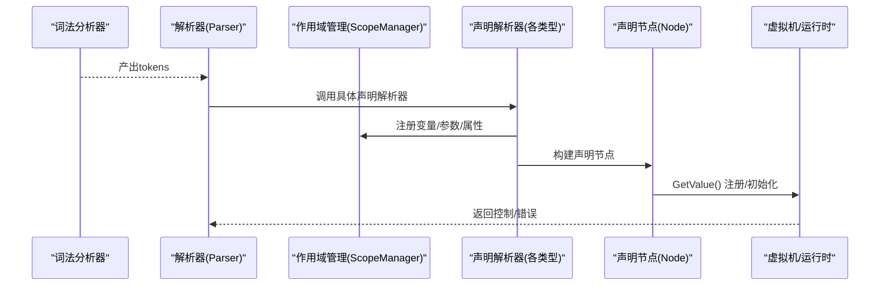
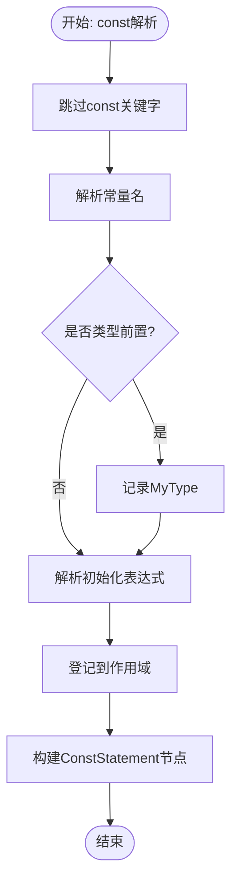
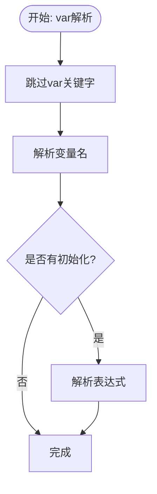
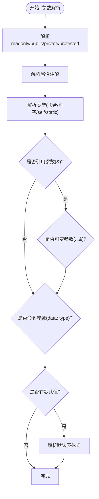
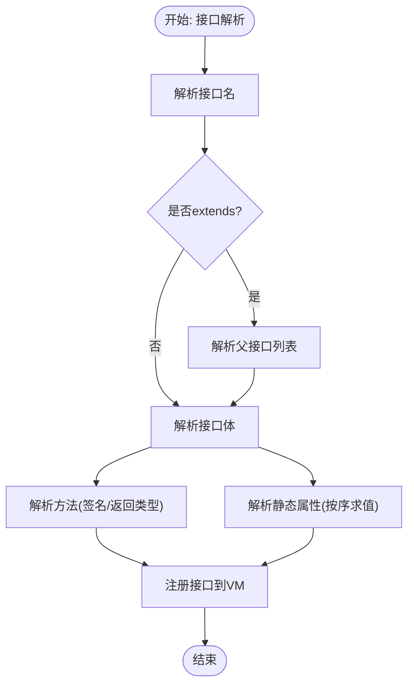
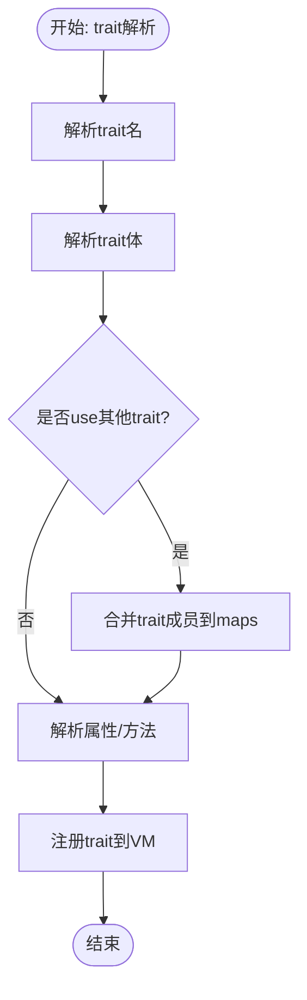
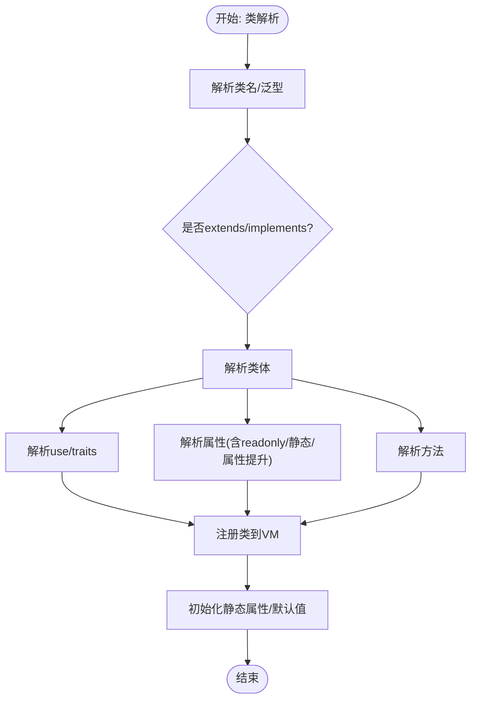
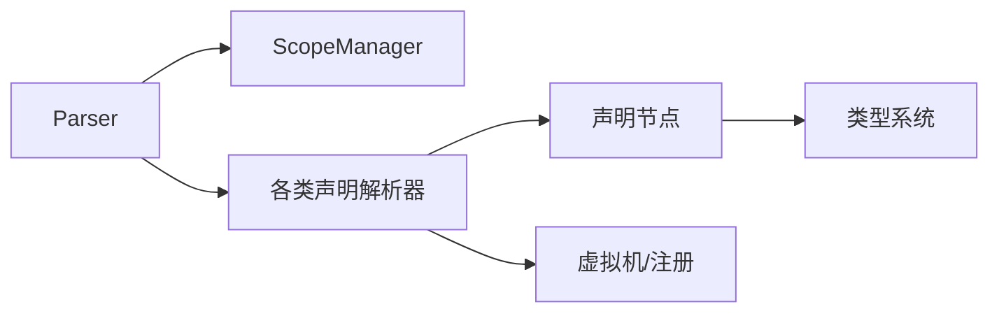

# 声明节点

<cite>
**本文档引用的文件**
- [node.go](file://node/node.go)
- [parser.go](file://parser/parser.go)
- [declare_parser.go](file://parser/declare_parser.go)
- [class_parser.go](file://parser/class_parser.go)
- [interface_parser.go](file://parser/interface_parser.go)
- [trait_parser.go](file://parser/trait_parser.go)
- [const_parser.go](file://parser/const_parser.go)
- [var_parser.go](file://parser/var_parser.go)
- [parameter_parser.go](file://parser/parameter_parser.go)
- [scope_manager.go](file://parser/scope_manager.go)
- [types.go](file://data/types.go)
- [type_const.go](file://data/type_const.go)
- [class.go](file://node/class.go)
- [const.go](file://node/const.go)
- [var.go](file://node/var.go)
</cite>

## 目录
1. [简介](#简介)
2. [项目结构](#项目结构)
3. [核心组件](#核心组件)
4. [架构总览](#架构总览)
5. [详细组件分析](#详细组件分析)
6. [依赖分析](#依赖分析)
7. [性能考虑](#性能考虑)
8. [故障排查指南](#故障排查指南)
9. [结论](#结论)
10. [附录](#附录)

## 简介
本文件系统化梳理声明节点体系，覆盖常量声明、变量声明、参数声明、接口声明与trait声明的语法结构、类型约束、作用域规则、解析流程、类型检查与符号表管理，并补充声明的生命周期、可见性控制与继承机制，最后给出书写规范与最佳实践。

## 项目结构
声明节点位于解析层与节点层协同工作：
- 解析层负责词法/语法解析、作用域管理与声明构建；
- 节点层负责声明节点的运行时行为与类型系统对接；
- 数据层提供类型系统与运行时值模型支撑。

**图表来源**
- [parser.go:17-50](file://parser/parser.go#L17-L50)
- [scope_manager.go:64-100](file://parser/scope_manager.go#L64-L100)
- [class_parser.go:28-343](file://parser/class_parser.go#L28-L343)
- [interface_parser.go:26-246](file://parser/interface_parser.go#L26-L246)
- [trait_parser.go:27-203](file://parser/trait_parser.go#L27-L203)
- [const_parser.go:22-58](file://parser/const_parser.go#L22-L58)
- [var_parser.go:23-60](file://parser/var_parser.go#L23-L60)
- [parameter_parser.go:12-213](file://parser/parameter_parser.go#L12-L213)
- [node.go:30-42](file://node/node.go#L30-L42)
- [class.go:11-115](file://node/class.go#L11-L115)
- [types.go:5-262](file://data/types.go#L5-L262)

**章节来源**
- [parser.go:17-50](file://parser/parser.go#L17-L50)
- [scope_manager.go:64-100](file://parser/scope_manager.go#L64-L100)
- [class_parser.go:28-343](file://parser/class_parser.go#L28-L343)
- [interface_parser.go:26-246](file://parser/interface_parser.go#L26-L246)
- [trait_parser.go:27-203](file://parser/trait_parser.go#L27-L203)
- [const_parser.go:22-58](file://parser/const_parser.go#L22-L58)
- [var_parser.go:23-60](file://parser/var_parser.go#L23-L60)
- [parameter_parser.go:12-213](file://parser/parameter_parser.go#L12-L213)
- [node.go:30-42](file://node/node.go#L30-L42)
- [class.go:11-115](file://node/class.go#L11-L115)
- [types.go:5-262](file://data/types.go#L5-L262)

## 核心组件
- 声明解析器族：ConstParser、VarParser、ParameterParser、ClassParser、InterfaceParser、TraitParser，分别负责常量、变量、参数、类、接口、trait的解析。
- 作用域管理：ScopeManager维护变量表、索引与父子作用域链，贯穿函数/方法/类/接口/trait解析。
- 类型系统：Types接口及UnionType、NullableType、MultipleReturnType等实现，支撑联合类型、可空类型与多返回值类型。
- 声明节点：Program、ClassStatement、ClassProperty、ClassMethod、ConstStatement、VarStatement等，承载声明的运行时语义。

**章节来源**
- [const_parser.go:10-20](file://parser/const_parser.go#L10-L20)
- [var_parser.go:11-21](file://parser/var_parser.go#L11-L21)
- [parameter_parser.go:12-213](file://parser/parameter_parser.go#L12-L213)
- [class_parser.go:13-26](file://parser/class_parser.go#L13-L26)
- [interface_parser.go:12-24](file://parser/interface_parser.go#L12-L24)
- [trait_parser.go:11-25](file://parser/trait_parser.go#L11-L25)
- [scope_manager.go:64-100](file://parser/scope_manager.go#L64-L100)
- [types.go:5-262](file://data/types.go#L5-L262)
- [node.go:30-42](file://node/node.go#L30-L42)
- [class.go:11-115](file://node/class.go#L11-L115)

## 架构总览
声明节点的解析与执行遵循“解析-构建-注册-求值”的流程：解析器扫描词法单元，构建AST节点，填充作用域与类型信息，随后由节点GetValue执行求值与副作用（如注册类/接口/常量）。类型系统贯穿声明解析与运行时校验。

**图表来源**
- [parser.go:86-122](file://parser/parser.go#L86-L122)
- [scope_manager.go:102-113](file://parser/scope_manager.go#L102-L113)
- [const_parser.go:22-58](file://parser/const_parser.go#L22-L58)
- [var_parser.go:23-60](file://parser/var_parser.go#L23-L60)
- [parameter_parser.go:12-213](file://parser/parameter_parser.go#L12-L213)
- [class_parser.go:28-343](file://parser/class_parser.go#L28-L343)
- [interface_parser.go:26-246](file://parser/interface_parser.go#L26-L246)
- [trait_parser.go:27-203](file://parser/trait_parser.go#L27-L203)
- [node.go:44-70](file://node/node.go#L44-L70)

## 详细组件分析

### 常量声明（Const）
- 语法与结构：const 关键字 + 标识符 + 赋值表达式；支持类型前置（如 const string NAME = ...）。
- 解析流程：跳过关键字，解析名称与初始化表达式，登记到当前作用域，构建ConstStatement节点。
- 类型约束：若出现类型前置，记录MyType；运行时直接赋值，不进行类型检查。
- 作用域与可见性：常量在声明处即进入作用域，通常为文件/命名空间级可见。
- 生命周期：解析阶段完成初始化并写入上下文，运行时不可二次赋值（Const类型阻止赋值）。

**图表来源**
- [const_parser.go:22-58](file://parser/const_parser.go#L22-L58)
- [scope_manager.go:102-113](file://parser/scope_manager.go#L102-L113)
- [type_const.go:3-15](file://data/type_const.go#L3-L15)
- [const.go:16-30](file://node/const.go#L16-L30)

**章节来源**
- [const_parser.go:22-58](file://parser/const_parser.go#L22-L58)
- [scope_manager.go:102-113](file://parser/scope_manager.go#L102-L113)
- [type_const.go:3-15](file://data/type_const.go#L3-L15)
- [const.go:16-30](file://node/const.go#L16-L30)

### 变量声明（Var）
- 语法与结构：var 关键字 + 标识符（可选初始化表达式）。
- 解析流程：跳过var关键字，解析变量名与可选初始化表达式，构建VarStatement节点。
- 类型约束：变量声明不强制类型；若后续赋值，类型由运行时决定。
- 作用域与可见性：变量登记到当前作用域，遵循作用域链查找。
- 生命周期：声明节点本身不返回值，初始化表达式在运行时求值并写入上下文。

**图表来源**
- [var_parser.go:23-60](file://parser/var_parser.go#L23-L60)
- [var.go:10-24](file://node/var.go#L10-L24)

**章节来源**
- [var_parser.go:23-60](file://parser/var_parser.go#L23-L60)
- [var.go:10-24](file://node/var.go#L10-L24)

### 参数声明（Parameter）
- 语法与结构：支持readonly、public/private/protected属性提升、引用参数&...、可变参数...、命名参数data: type、联合类型与可空类型。
- 解析流程：解析修饰符/注解/类型/引用/可变/命名/默认值，登记到作用域，必要时生成属性提升节点。
- 类型约束：支持联合类型（A|B）、可空类型（?T）、泛型类型（T<K>）、self/static类型。
- 作用域与可见性：参数在函数/方法作用域内可见，支持lambda作用域标记。
- 生命周期：参数节点在方法调用时参与实参绑定与默认值求值。

**图表来源**
- [parameter_parser.go:12-213](file://parser/parameter_parser.go#L12-L213)
- [types.go:83-110](file://data/types.go#L83-L110)
- [types.go:34-49](file://data/types.go#L34-L49)
- [types.go:200-219](file://data/types.go#L200-L219)
- [scope_manager.go:18-42](file://parser/scope_manager.go#L18-L42)

**章节来源**
- [parameter_parser.go:12-213](file://parser/parameter_parser.go#L12-L213)
- [types.go:83-110](file://data/types.go#L83-L110)
- [types.go:34-49](file://data/types.go#L34-L49)
- [types.go:200-219](file://data/types.go#L200-L219)
- [scope_manager.go:18-42](file://parser/scope_manager.go#L18-L42)

### 接口声明（Interface）
- 语法与结构：interface 关键字 + 接口名 + 可选extends + 接口体（方法/静态属性）。
- 解析流程：解析接口名与父接口列表，遍历接口体，解析方法与静态属性，注册到VM。
- 类型约束：接口方法签名严格，返回类型支持联合/可空；常量/属性默认public。
- 继承机制：extends支持多继承，解析时规范化父接口名为完整名称。
- 生命周期：接口定义先注册，再对静态属性求值，避免自依赖死循环。

**图表来源**
- [interface_parser.go:26-246](file://parser/interface_parser.go#L26-L246)
- [class_parser.go:521-779](file://parser/class_parser.go#L521-L779)
- [types.go:83-110](file://data/types.go#L83-L110)
- [types.go:34-49](file://data/types.go#L34-L49)

**章节来源**
- [interface_parser.go:26-246](file://parser/interface_parser.go#L26-L246)
- [class_parser.go:521-779](file://parser/class_parser.go#L521-L779)
- [types.go:83-110](file://data/types.go#L83-L110)
- [types.go:34-49](file://data/types.go#L34-L49)

### Trait声明（Trait）
- 语法与结构：trait 关键字 + trait名 + trait体（方法/属性/use组合）。
- 解析流程：解析trait名，遍历trait体，支持use组合其他trait，注册到VM（与类共用存储）。
- 继承机制：trait不支持extends/implements，但可通过use组合其他trait。
- 生命周期：trait注册后处理注解，不支持构造函数。

**图表来源**
- [trait_parser.go:27-203](file://parser/trait_parser.go#L27-L203)
- [class_parser.go:521-779](file://parser/class_parser.go#L521-L779)

**章节来源**
- [trait_parser.go:27-203](file://parser/trait_parser.go#L27-L203)
- [class_parser.go:521-779](file://parser/class_parser.go#L521-L779)

### 类声明（Class）
- 语法与结构：class 关键字 + 类名 + 可选泛型/extends/implements + 类体（属性/方法/traits/use）。
- 解析流程：解析类名、泛型、继承与实现，遍历类体，解析属性（含readonly/静态/属性提升）、方法、traits，注册到VM。
- 继承机制：支持单继承与接口实现；构造函数缺失时沿继承链寻找父类构造函数。
- 生命周期：类注册后初始化静态属性与默认值，处理注解。

**图表来源**
- [class_parser.go:28-343](file://parser/class_parser.go#L28-L343)
- [class.go:28-84](file://node/class.go#L28-L84)

**章节来源**
- [class_parser.go:28-343](file://parser/class_parser.go#L28-L343)
- [class.go:28-84](file://node/class.go#L28-L84)

## 依赖分析
- 解析器依赖作用域管理器进行变量登记与查找；
- 声明节点依赖类型系统进行类型判断与运行时值构造；
- 类/接口/Trait解析器共享属性与方法解析逻辑；
- 常量/变量解析器依赖作用域管理器登记变量。

**图表来源**
- [parser.go:17-50](file://parser/parser.go#L17-L50)
- [scope_manager.go:64-100](file://parser/scope_manager.go#L64-L100)
- [types.go:5-262](file://data/types.go#L5-L262)
- [class_parser.go:28-343](file://parser/class_parser.go#L28-L343)
- [interface_parser.go:26-246](file://parser/interface_parser.go#L26-L246)
- [trait_parser.go:27-203](file://parser/trait_parser.go#L27-L203)
- [const_parser.go:22-58](file://parser/const_parser.go#L22-L58)
- [var_parser.go:23-60](file://parser/var_parser.go#L23-L60)

**章节来源**
- [parser.go:17-50](file://parser/parser.go#L17-L50)
- [scope_manager.go:64-100](file://parser/scope_manager.go#L64-L100)
- [types.go:5-262](file://data/types.go#L5-L262)
- [class_parser.go:28-343](file://parser/class_parser.go#L28-L343)
- [interface_parser.go:26-246](file://parser/interface_parser.go#L26-L246)
- [trait_parser.go:27-203](file://parser/trait_parser.go#L27-L203)
- [const_parser.go:22-58](file://parser/const_parser.go#L22-L58)
- [var_parser.go:23-60](file://parser/var_parser.go#L23-L60)

## 性能考虑
- 作用域查找：采用哈希表存储变量，O(1)平均查找；注意避免深层嵌套导致的栈增长。
- 类型判断：联合/可空类型在运行时逐项匹配，建议尽量减少复杂联合类型层级。
- 静态属性求值：接口/类静态属性按序求值，避免相互依赖造成循环。
- 泛型与self/static：延迟解析至运行时，减少编译期开销但增加运行时判断成本。

## 故障排查指南
- 语法错误：解析器在无法识别语句或缺少必需符号时返回错误控制，检查关键字、分隔符与分号。
- 类型不匹配：方法返回类型与声明不符时抛出类型错误；检查联合/可空类型与运行时值。
- 作用域冲突：变量重复定义或未在当前作用域找到时，检查作用域边界与命名空间。
- 接口/类继承问题：extends/implements解析失败时，确认父类/父接口已注册且名称正确。

**章节来源**
- [parser.go:251-298](file://parser/parser.go#L251-L298)
- [class.go:379-440](file://node/class.go#L379-L440)
- [types.go:83-110](file://data/types.go#L83-L110)
- [scope_manager.go:102-113](file://parser/scope_manager.go#L102-L113)

## 结论
声明节点系统通过解析器、作用域管理与类型系统的协作，实现了对常量、变量、参数、类、接口与trait的统一建模与执行。清晰的语法结构、严格的类型约束与完善的生命周期管理，使得系统既满足PHP语义一致性，又具备良好的扩展性与可维护性。

## 附录

### 声明书写规范与最佳实践
- 常量
  - 必须初始化；若使用类型前置，保持类型与值一致。
  - 建议使用大写命名风格，便于区分。
- 变量
  - 变量名避免与关键字冲突；初始化表达式尽量简洁。
  - 局部变量优先使用短生命周期，减少内存占用。
- 参数
  - 优先使用联合类型与可空类型明确边界；避免过多默认值导致歧义。
  - 属性提升仅在必要时使用，保持构造函数职责清晰。
- 类/接口/Trait
  - 接口方法签名应稳定，避免频繁变更；多返回值类型谨慎使用。
  - 类继承链不宜过深，接口实现遵循最小接口原则。
  - Trait组合需避免方法/属性命名冲突，必要时使用insteadof/as调整。