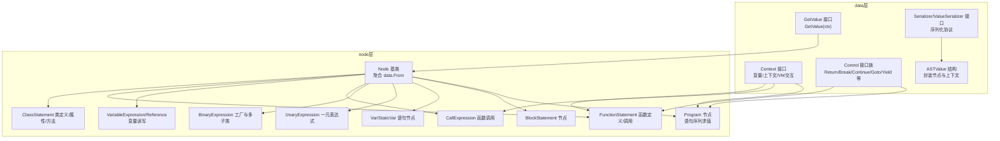
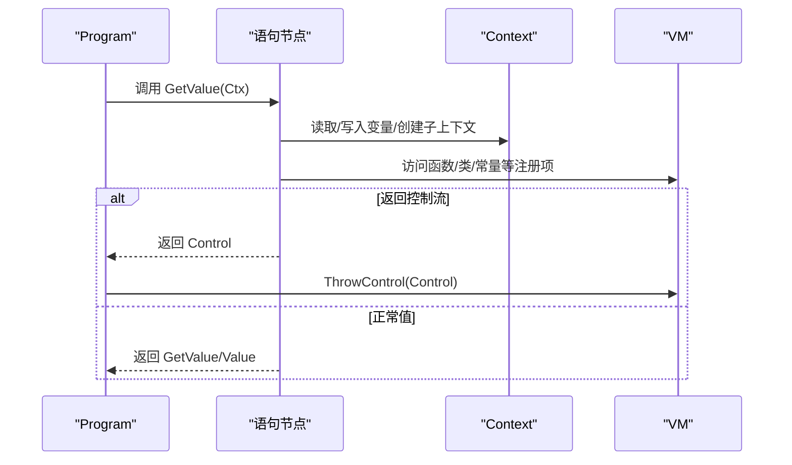
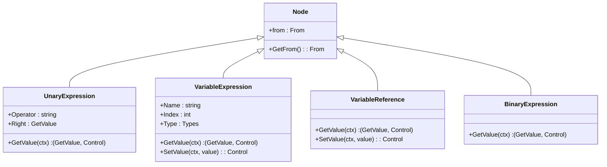
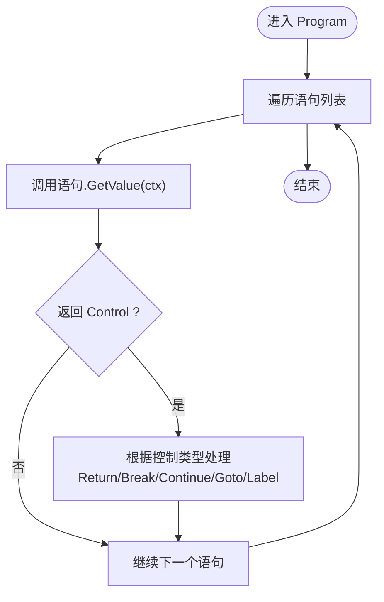
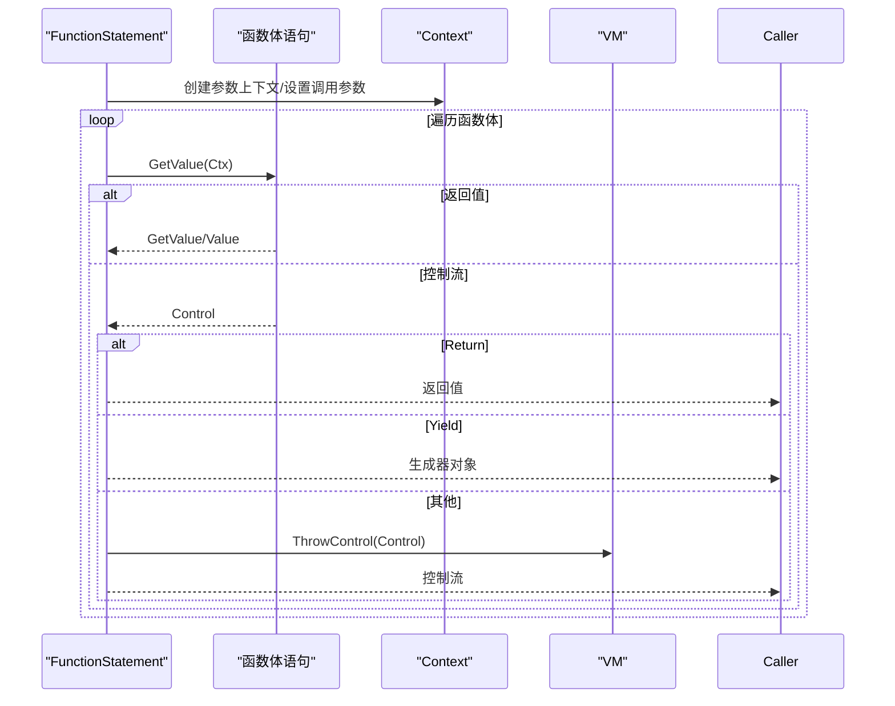
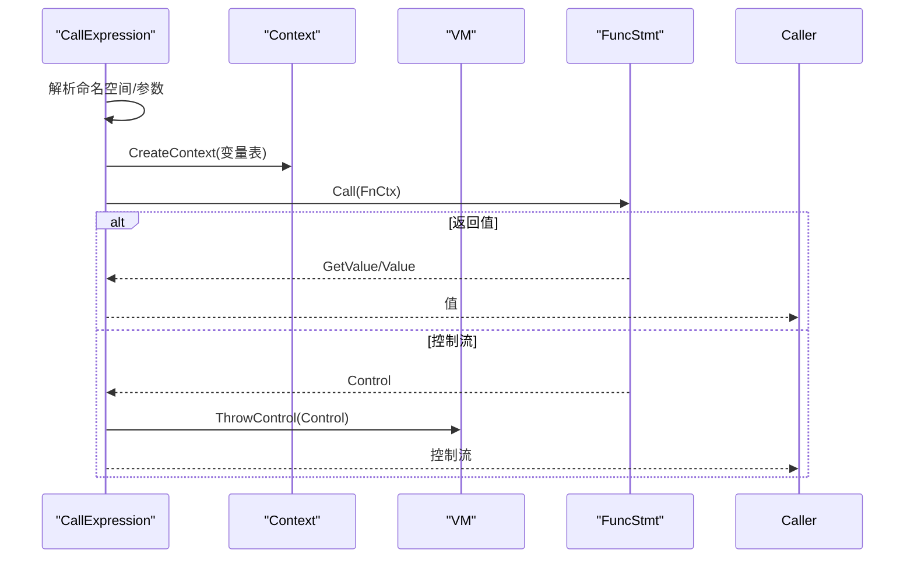
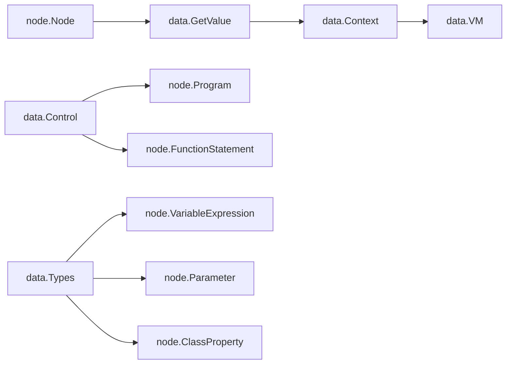

# 抽象语法树系统

<cite>
**本文档引用的文件**
- [node.go](file://node/node.go)
- [expression.go](file://node/expression.go)
- [binary.go](file://node/binary.go)
- [call.go](file://node/call.go)
- [block.go](file://node/block.go)
- [var.go](file://node/var.go)
- [variable.go](file://node/variable.go)
- [class.go](file://node/class.go)
- [function.go](file://node/function.go)
- [node.go](file://data/node.go)
- [context.go](file://data/context.go)
- [control.go](file://data/control.go)
- [serializer.go](file://data/serializer.go)
- [value_ast.go](file://data/value_ast.go)
</cite>

## 目录
1. [简介](#简介)
2. [项目结构](#项目结构)
3. [核心组件](#核心组件)
4. [架构总览](#架构总览)
5. [详细组件分析](#详细组件分析)
6. [依赖分析](#依赖分析)
7. [性能考虑](#性能考虑)
8. [故障排查指南](#故障排查指南)
9. [结论](#结论)
10. [附录](#附录)

## 简介
本文件面向编译器与语言运行时开发者，系统性阐述抽象语法树（AST）系统的设计理念、层次结构与实现细节。内容覆盖表达式节点、语句节点与修饰符节点的建模方式，节点的创建、遍历与转换机制，节点间继承关系与接口契约，以及与类型系统、控制流、序列化/反序列化和调试支持的集成。最后提供扩展与自定义节点的实践指南。

## 项目结构
AST系统主要由两部分构成：
- data层：定义统一的节点接口、上下文、控制流、类型系统与序列化协议，作为运行时与节点实现的契约。
- node层：具体AST节点的实现，涵盖表达式、语句、函数与类等，均实现统一的 GetValue 接口以参与求值与控制流传递。

图表来源
- [node.go:1-99](file://node/node.go#L1-L99)
- [expression.go:1-57](file://node/expression.go#L1-L57)
- [binary.go:1-96](file://node/binary.go#L1-L96)
- [call.go:1-110](file://node/call.go#L1-L110)
- [block.go:1-23](file://node/block.go#L1-L23)
- [var.go:1-46](file://node/var.go#L1-L46)
- [variable.go:1-189](file://node/variable.go#L1-L189)
- [function.go:1-450](file://node/function.go#L1-L450)
- [class.go:1-528](file://node/class.go#L1-L528)
- [node.go:1-8](file://data/node.go#L1-L8)
- [context.go:1-349](file://data/context.go#L1-L349)
- [control.go:1-61](file://data/control.go#L1-L61)
- [serializer.go:1-31](file://data/serializer.go#L1-L31)
- [value_ast.go:1-19](file://data/value_ast.go#L1-L19)

章节来源
- [node.go:1-99](file://node/node.go#L1-L99)
- [node.go:1-8](file://data/node.go#L1-L8)
- [context.go:1-349](file://data/context.go#L1-L349)
- [control.go:1-61](file://data/control.go#L1-L61)
- [serializer.go:1-31](file://data/serializer.go#L1-L31)
- [value_ast.go:1-19](file://data/value_ast.go#L1-L19)

## 核心组件
- 节点基类与接口
  - data.GetValue：所有可求值节点的统一接口，负责在给定上下文中计算结果并可能返回控制流。
  - node.Node：承载位置信息（data.From）与通用行为的基类，其他节点通过组合该结构复用来源追踪能力。
- 上下文与控制流
  - data.Context：提供变量读写、作用域创建、VM接入、调用参数记录等能力。
  - data.Control 及其子接口：封装各类控制流（返回、中断、继续、退出、跳转、yield）。
- 类型系统与序列化
  - data.Serializer/ValueSerializer：定义对内置类型的序列化/反序列化协议，支持扩展类型。
  - data.ASTValue：将节点与上下文封装为可返回值，便于调试与序列化。

章节来源
- [node.go:1-8](file://data/node.go#L1-L8)
- [node.go:1-99](file://node/node.go#L1-L99)
- [context.go:1-349](file://data/context.go#L1-L349)
- [control.go:1-61](file://data/control.go#L1-L61)
- [serializer.go:1-31](file://data/serializer.go#L1-L31)
- [value_ast.go:1-19](file://data/value_ast.go#L1-L19)

## 架构总览
AST节点以“可求值对象”的形式参与执行：每个节点实现 GetValue(ctx)，在执行过程中：
- 正常求值返回 GetValue 或 Value；
- 遇到控制流则返回 Control，由调用方或运行时进行处理；
- 错误通过 data.Control 抛出，运行时可附加堆栈信息以便调试。

图表来源
- [node.go:44-98](file://node/node.go#L44-L98)
- [context.go:1-349](file://data/context.go#L1-L349)
- [control.go:1-61](file://data/control.go#L1-L61)

## 详细组件分析

### 表达式节点
- 一元表达式（UnaryExpression）
  - 设计要点：统一 Operator 与 Right，按操作符分派到具体求值逻辑；对不可转换类型返回错误控制。
  - 复杂度：单节点求值 O(1)，类型转换按底层 Value 接口实现。
  - 关键路径：GetValue -> 类型适配 -> 构造对应 Value -> 返回。
- 二元表达式（BinaryExpression）
  - 设计要点：通过工厂 NewBinaryExpression 根据 Token 类型选择具体子类；复合赋值运算符通过组合普通二元表达式实现。
  - 复杂度：O(1) 选择 + 子类求值复杂度。
  - 关键路径：NewBinaryExpression -> 子类构造 -> GetValue -> 控制流/值返回。
- 变量表达式（VariableExpression/VariableReference）
  - 设计要点：区分普通变量与引用，支持类型约束与作用域索引；SetValue 时进行类型校验。
  - 复杂度：O(1) 读写，类型校验 O(1)。
  - 关键路径：GetValue -> Context.Get/SetVariableValue -> 返回值或控制流。

图表来源
- [expression.go:1-57](file://node/expression.go#L1-L57)
- [binary.go:1-96](file://node/binary.go#L1-L96)
- [variable.go:1-189](file://node/variable.go#L1-L189)
- [node.go:1-99](file://node/node.go#L1-L99)

章节来源
- [expression.go:1-57](file://node/expression.go#L1-L57)
- [binary.go:1-96](file://node/binary.go#L1-L96)
- [variable.go:1-189](file://node/variable.go#L1-L189)

### 语句节点
- 语句块（BlockStatement）
  - 设计要点：聚合语句列表，GetValue 通常不返回值，用于组织作用域与控制流。
- 变量声明（VarStatement/StaticVarStatement）
  - 设计要点：初始化表达式求值后写入上下文；静态变量语义在类/函数作用域内持久化。
- 程序（Program）
  - 设计要点：顺序执行语句，处理 Return/Break/Continue/Goto/Label 等控制流；支持标签控制流与堆栈信息追加。

图表来源
- [node.go:44-98](file://node/node.go#L44-L98)

章节来源
- [block.go:1-23](file://node/block.go#L1-L23)
- [var.go:1-46](file://node/var.go#L1-L46)
- [node.go:30-99](file://node/node.go#L30-L99)

### 函数与类节点
- 函数定义（FunctionStatement）
  - 设计要点：记录参数、变量表、函数体与返回类型；调用时若含 yield 返回生成器对象；否则顺序执行语句并校验返回类型。
  - 生成器语义：YieldControl/YieldValueControl 保存执行状态，包装为生成器类值。
- 类定义（ClassStatement）
  - 设计要点：维护属性、方法、静态属性与注解；构造函数初始化默认值与父类属性链；支持接口实现与继承检查。
  - 方法调用：生成器方法立即返回生成器；非生成器方法逐条执行并处理返回/生成器控制流。

图表来源
- [function.go:103-150](file://node/function.go#L103-L150)
- [context.go:1-349](file://data/context.go#L1-L349)
- [control.go:1-61](file://data/control.go#L1-L61)

章节来源
- [function.go:1-450](file://node/function.go#L1-L450)
- [class.go:1-528](file://node/class.go#L1-L528)

### 调用节点
- 函数调用（CallExpression）
  - 设计要点：解析命名空间、参数绑定（支持命名参数）、创建函数上下文、调用函数并返回结果或控制流。
  - 延迟解析：CallLater 在首次调用时解析函数并缓存，避免重复查找开销。

图表来源
- [call.go:32-110](file://node/call.go#L32-L110)
- [context.go:1-349](file://data/context.go#L1-L349)
- [control.go:1-61](file://data/control.go#L1-L61)

章节来源
- [call.go:1-110](file://node/call.go#L1-L110)

### 节点创建、遍历与转换机制
- 创建
  - 通过各节点的 NewXxx 构造函数完成，内部组合 node.Node 并填充字段。
  - 表达式工厂（如 NewBinaryExpression）根据 Token 类型选择具体子类。
- 遍历
  - 以 GetValue 为入口，语句顺序执行；控制流在 Program 与函数体内传播。
- 转换
  - 通过 GetValue 的返回值类型区分：Value/GetValue/Control；错误通过 Control 抛出并可附加堆栈信息。

章节来源
- [binary.go:13-96](file://node/binary.go#L13-L96)
- [node.go:44-98](file://node/node.go#L44-L98)
- [control.go:8-10](file://data/control.go#L8-L10)

### 继承关系、接口实现与类型系统集成
- 继承与组合
  - node.Node 作为基类被广泛组合（匿名字段），统一来源追踪与 GetValue 签约。
- 接口契约
  - data.GetValue：所有节点必须实现。
  - data.Context：节点通过 GetValue 与运行时交互。
  - data.Control：控制流通过统一接口传递。
- 类型系统
  - 变量/参数/属性支持 data.Types 约束；SetValue 时进行类型校验。
  - 函数/方法返回类型在调用时校验，生成器方法特殊处理。

章节来源
- [node.go:1-99](file://node/node.go#L1-L99)
- [variable.go:56-68](file://node/variable.go#L56-L68)
- [function.go:117-126](file://node/function.go#L117-L126)
- [context.go:85-129](file://data/context.go#L85-L129)

### 序列化、反序列化与调试支持
- 序列化协议
  - data.Serializer 定义对基础类型的序列化/反序列化接口；ValueSerializer 为具体 Value 类型提供统一协议。
- AST 值封装
  - data.ASTValue 将节点与上下文封装为可返回值，便于调试输出与序列化。
- 调试支持
  - 控制流接口 AddStack 支持在抛出控制时附加来源信息（文件、类、方法、标签等），便于定位问题。

章节来源
- [serializer.go:1-31](file://data/serializer.go#L1-L31)
- [value_ast.go:1-19](file://data/value_ast.go#L1-L19)
- [control.go:8-10](file://data/control.go#L8-L10)

## 依赖分析
- 节点到运行时
  - 所有节点通过 data.Context 与 VM 交互，读写变量、创建上下文、注册函数/类等。
- 控制流耦合
  - Program 与函数体对 data.Control 的处理形成统一的异常/控制流处理通道。
- 类型系统耦合
  - 变量/参数/属性/返回类型均依赖 data.Types，确保运行期类型一致性。

图表来源
- [node.go:1-99](file://node/node.go#L1-L99)
- [context.go:1-349](file://data/context.go#L1-L349)
- [control.go:1-61](file://data/control.go#L1-L61)
- [variable.go:56-68](file://node/variable.go#L56-L68)
- [function.go:117-126](file://node/function.go#L117-L126)
- [class.go:242-261](file://node/class.go#L242-L261)

章节来源
- [context.go:1-349](file://data/context.go#L1-L349)
- [control.go:1-61](file://data/control.go#L1-L61)

## 性能考虑
- 工厂与分派
  - 二元表达式工厂按 Token 类型分派，避免重复分支判断，保持常数时间选择。
- 控制流短路
  - 程序与函数体在遇到控制流时尽早返回，减少无效遍历。
- 延迟解析
  - 函数调用延迟解析可避免重复查找，降低启动阶段开销。
- 类型校验
  - 类型约束在赋值时进行，建议在编译期尽量消除运行期类型检查成本。

## 故障排查指南
- 常见问题
  - 类型不匹配：变量/参数/属性赋值类型与约束不符，返回错误控制。
  - 返回类型不匹配：函数/方法返回值类型与声明不符，抛出错误控制。
  - 控制流未处理：自定义节点返回 Control 但未在上层处理，导致执行中断。
- 调试技巧
  - 利用 AddStack 在控制流中附加来源信息，快速定位节点来源。
  - 使用 ASTValue 包装节点进行序列化输出，辅助可视化调试。

章节来源
- [variable.go:56-68](file://node/variable.go#L56-L68)
- [function.go:117-126](file://node/function.go#L117-L126)
- [control.go:8-10](file://data/control.go#L8-L10)
- [value_ast.go:12-18](file://data/value_ast.go#L12-L18)

## 结论
本 AST 系统以统一的 GetValue 接口为核心，结合 data.Context 与 data.Control，构建了清晰的求值与控制流模型。通过工厂模式与组合模式，表达式与语句节点具备良好的可扩展性；类型系统与序列化协议为运行时与调试提供了坚实支撑。对于编译器开发者而言，遵循现有接口与模式即可高效扩展新的节点类型与功能。

## 附录

### 扩展与自定义节点实践指南
- 新增表达式节点
  - 定义结构体并组合 node.Node，实现 GetValue(ctx)。
  - 如需工厂分派，参考二元表达式工厂模式，在合适位置新增 Token 类型分支。
- 新增语句节点
  - 实现 GetValue(ctx)；如涉及控制流，返回 data.Control。
  - 在 Program 或函数体中顺序执行，确保控制流正确传播。
- 新增函数/类节点
  - 函数：在 GetValue 中注册函数，Call 中实现执行逻辑与返回类型校验。
  - 类：在 GetValue 中初始化属性与父类链，方法中处理生成器与返回类型。
- 类型系统集成
  - 在变量/参数/属性/返回类型处使用 data.Types 进行约束，SetValue 时进行类型校验。
- 序列化与调试
  - 为新 Value 类型实现 data.ValueSerializer 接口，配合 data.Serializer 完成序列化。
  - 在控制流中使用 AddStackWithInfo 提供来源信息，增强调试体验。

章节来源
- [binary.go:13-96](file://node/binary.go#L13-L96)
- [node.go:1-99](file://node/node.go#L1-L99)
- [function.go:103-150](file://node/function.go#L103-L150)
- [class.go:28-84](file://node/class.go#L28-L84)
- [variable.go:56-68](file://node/variable.go#L56-L68)
- [serializer.go:24-30](file://data/serializer.go#L24-L30)
- [control.go:8-10](file://data/control.go#L8-L10)