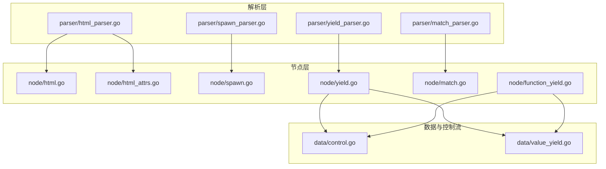
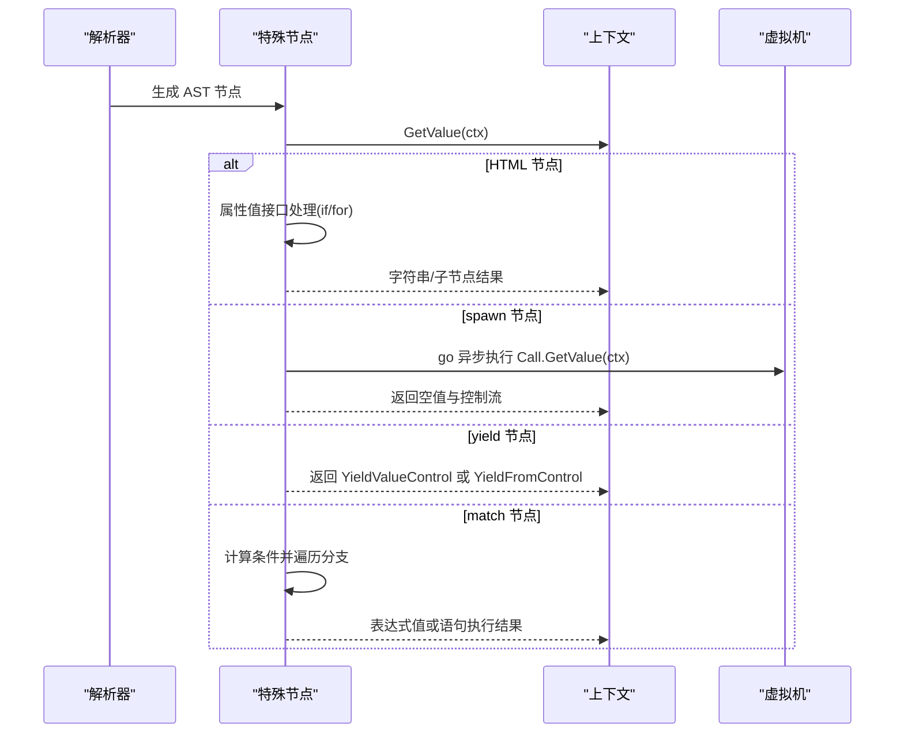
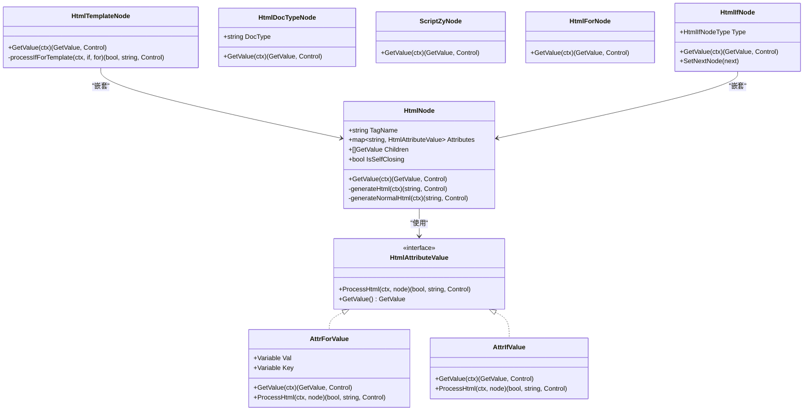
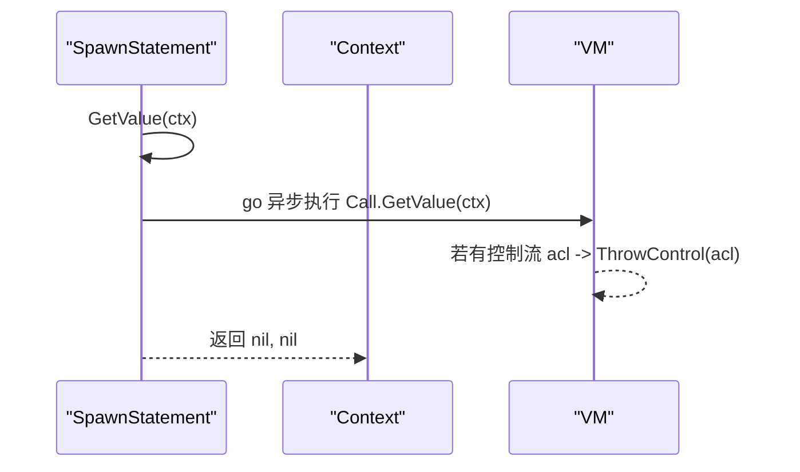
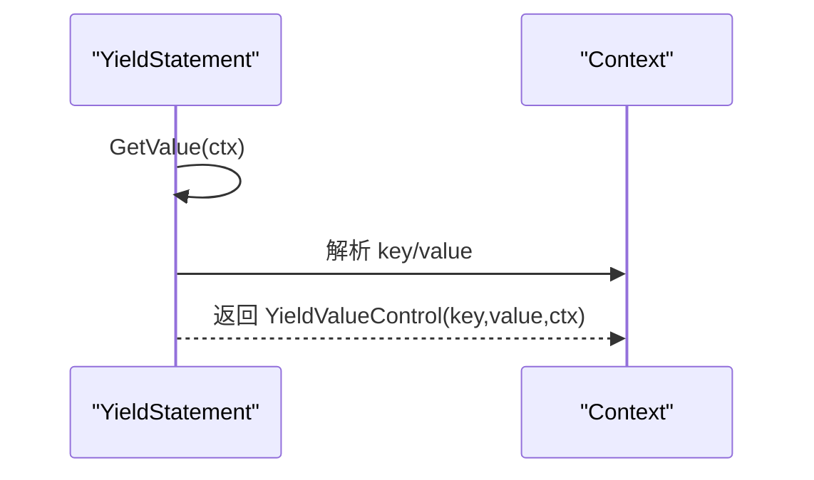
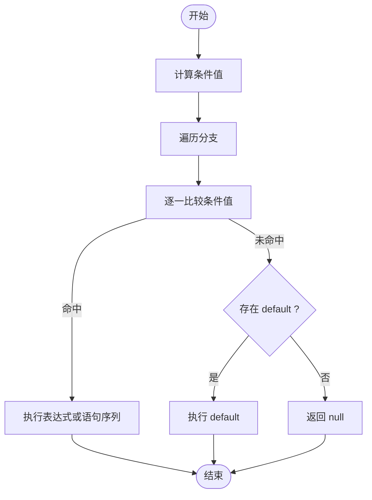
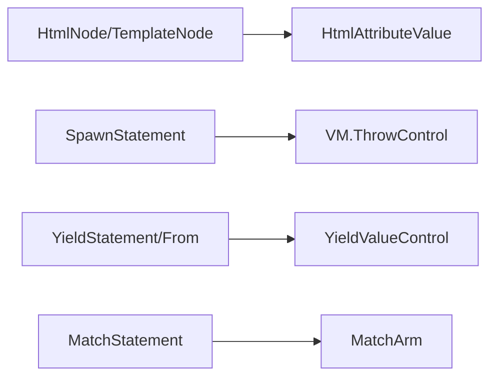

# 特殊节点

<cite>
**本文引用的文件**
- [node/html.go](file://node/html.go)
- [node/html_attrs.go](file://node/html_attrs.go)
- [node/spawn.go](file://node/spawn.go)
- [node/yield.go](file://node/yield.go)
- [node/match.go](file://node/match.go)
- [node/function_yield.go](file://node/function_yield.go)
- [parser/html_parser.go](file://parser/html_parser.go)
- [parser/spawn_parser.go](file://parser/spawn_parser.go)
- [parser/yield_parser.go](file://parser/yield_parser.go)
- [parser/match_parser.go](file://parser/match_parser.go)
- [data/control.go](file://data/control.go)
- [data/value_yield.go](file://data/value_yield.go)
- [tests/basic/match.zy](file://tests/basic/match.zy)
- [tests/basic/yield.zy](file://tests/basic/yield.zy)
- [examples/html/pages/index.html](file://examples/html/pages/index.html)
</cite>

## 目录
1. [简介](#简介)
2. [项目结构](#项目结构)
3. [核心组件](#核心组件)
4. [架构总览](#架构总览)
5. [详细组件分析](#详细组件分析)
6. [依赖分析](#依赖分析)
7. [性能考量](#性能考量)
8. [故障排查指南](#故障排查指南)
9. [结论](#结论)
10. [附录](#附录)

## 简介
本文件系统化阐述“特殊节点”在代码库中的实现与使用，重点覆盖以下五类节点：
- HTML 节点族：HtmlNode、HtmlTemplateNode、HtmlDocTypeNode、ScriptZyNode、HtmlForNode、HtmlIfNode 及其属性处理器 AttrForValue、AttrIfValue
- spawn 节点：SpawnStatement
- yield 节点：YieldStatement、YieldFromStatement 及其控制流 YieldValueControl
- match 节点：MatchStatement、MatchArm
并说明它们与普通节点的区别、执行机制、数据与控制流、性能特征、使用场景、限制与最佳实践，以及如何扩展与自定义特殊节点。

## 项目结构
围绕特殊节点的关键模块分布如下：
- 解析层（parser）：负责将源码语法解析为 AST 节点，如 HTML 解析器、spawn 解析器、yield 解析器、match 解析器
- 节点层（node）：承载具体节点类型及其行为，如 HTML 节点族、spawn、yield、match
- 数据与控制流（data）：统一抽象控制流接口 Control、Break/Continue/Exit/Goto、YieldValueControl 及其实现
- 示例与测试：HTML 页面模板、match/yield 行为验证

图表来源
- [parser/html_parser.go:32-201](file://parser/html_parser.go#L32-L201)
- [parser/spawn_parser.go:20-54](file://parser/spawn_parser.go#L20-L54)
- [parser/yield_parser.go:22-71](file://parser/yield_parser.go#L22-L71)
- [parser/match_parser.go:25-86](file://parser/match_parser.go#L25-L86)
- [node/html.go:9-189](file://node/html.go#L9-L189)
- [node/html_attrs.go:7-169](file://node/html_attrs.go#L7-L169)
- [node/spawn.go:5-30](file://node/spawn.go#L5-L30)
- [node/yield.go:5-85](file://node/yield.go#L5-L85)
- [node/match.go:7-99](file://node/match.go#L7-L99)
- [node/function_yield.go:9-58](file://node/function_yield.go#L9-L58)
- [data/control.go:3-61](file://data/control.go#L3-L61)
- [data/value_yield.go:7-50](file://data/value_yield.go#L7-L50)

章节来源
- [parser/html_parser.go:32-201](file://parser/html_parser.go#L32-L201)
- [parser/spawn_parser.go:20-54](file://parser/spawn_parser.go#L20-L54)
- [parser/yield_parser.go:22-71](file://parser/yield_parser.go#L22-L71)
- [parser/match_parser.go:25-86](file://parser/match_parser.go#L25-L86)
- [node/html.go:9-189](file://node/html.go#L9-L189)
- [node/html_attrs.go:7-169](file://node/html_attrs.go#L7-L169)
- [node/spawn.go:5-30](file://node/spawn.go#L5-L30)
- [node/yield.go:5-85](file://node/yield.go#L5-L85)
- [node/match.go:7-99](file://node/match.go#L7-L99)
- [node/function_yield.go:9-58](file://node/function_yield.go#L9-L58)
- [data/control.go:3-61](file://data/control.go#L3-L61)
- [data/value_yield.go:7-50](file://data/value_yield.go#L7-L50)

## 核心组件
- HTML 节点族
  - HtmlNode：通用 HTML 节点，支持属性值接口 HtmlAttributeValue、子节点、自闭合标签
  - HtmlTemplateNode：不输出标签本身，仅渲染子节点，但保留 if/for 属性处理能力
  - HtmlDocTypeNode：文档类型声明节点
  - ScriptZyNode：内联脚本节点，type="text/zy" 的脚本会被编译并执行
  - HtmlForNode：HTML for 循环节点，遍历数组/对象并渲染嵌套 HTML
  - HtmlIfNode：HTML if/else-if/else 条件节点，支持链式条件
  - 属性值接口 HtmlAttributeValue：AttrForValue、AttrIfValue 两类特殊属性值，分别处理循环与条件
- spawn 节点
  - SpawnStatement：异步执行表达式（函数调用、lambda、for/foreach 等），通过 goroutine 异步执行，并将控制流异常交由 VM 处理
- yield 节点
  - YieldStatement：普通 yield，返回 YieldValueControl，携带 key/value 与上下文
  - YieldFromStatement：委托生成器/可迭代对象，返回专用 YieldFromControl
  - 生成器状态：FuncYieldStackState 记录函数体索引、当前 key/value、自增 key 等
- match 节点
  - MatchStatement：匹配条件表达式，遍历各分支条件，命中后返回表达式或执行语句序列；支持 default
  - MatchArm：单一分支，可为表达式或语句序列

章节来源
- [node/html.go:9-189](file://node/html.go#L9-L189)
- [node/html_attrs.go:7-169](file://node/html_attrs.go#L7-L169)
- [node/spawn.go:5-30](file://node/spawn.go#L5-L30)
- [node/yield.go:5-85](file://node/yield.go#L5-L85)
- [node/function_yield.go:9-58](file://node/function_yield.go#L9-L58)
- [node/match.go:7-99](file://node/match.go#L7-L99)

## 架构总览
特殊节点的执行遵循“解析 → 节点 → 求值 → 控制流”的统一范式。HTML 节点在 GetValue 中根据属性值接口决定是否渲染、如何渲染；spawn 节点异步触发调用并将控制流回传 VM；yield 节点返回 YieldValueControl 或 YieldFromControl，驱动生成器状态机；match 节点计算条件并在命中后执行对应分支。

图表来源
- [parser/html_parser.go:32-201](file://parser/html_parser.go#L32-L201)
- [node/html.go:29-168](file://node/html.go#L29-L168)
- [node/spawn.go:19-30](file://node/spawn.go#L19-L30)
- [node/yield.go:21-85](file://node/yield.go#L21-L85)
- [node/match.go:52-88](file://node/match.go#L52-L88)

## 详细组件分析

### HTML 节点族
- HtmlNode
  - 职责：封装标签名、属性映射、子节点、自闭合标志；提供 GetValue 生成 HTML 字符串
  - 特殊属性处理：在 generateHtml 中识别 AttrForValue、AttrIfValue，优先执行 if/for 链，再回退到普通 HTML 渲染
  - 子节点渲染：generateChildrenOnly 仅渲染子节点，不包含外层标签
- HtmlTemplateNode
  - 职责：不输出标签本身，仅渲染子节点，但支持 if/for 属性
  - 实现：通过 processIfForTemplate 仅渲染子节点，不包裹标签
- HtmlDocTypeNode
  - 职责：输出文档类型声明，随后拼接子节点结果
- ScriptZyNode
  - 职责：type="text/zy" 的脚本节点，编译并执行内部程序，忽略输出
- HtmlForNode
  - 职责：遍历数组/对象，设置循环变量与键变量，渲染嵌套 HTML
  - 支持：数组与对象两种遍历形态
- HtmlIfNode
  - 职责：条件渲染，支持 if/else-if/else 链式连接
  - 实现：GetValue 中计算条件，命中即渲染子节点；否则递归 NextNode
- 属性值接口 HtmlAttributeValue
  - AttrForValue：遍历数组，设置循环变量与键变量，逐次渲染标签
  - AttrIfValue：计算条件，命中则渲染标签，否则不输出

图表来源
- [node/html.go:9-189](file://node/html.go#L9-L189)
- [node/html_attrs.go:7-169](file://node/html_attrs.go#L7-L169)

章节来源
- [node/html.go:9-189](file://node/html.go#L9-L189)
- [node/html_attrs.go:7-169](file://node/html_attrs.go#L7-L169)
- [parser/html_parser.go:32-201](file://parser/html_parser.go#L32-L201)

### spawn 节点
- SpawnStatement
  - 职责：异步执行表达式（函数调用、lambda、for/foreach 等）
  - 实现：启动 goroutine 执行 Call.GetValue(ctx)，若返回控制流（acl），通过 VM.ThrowControl 回传
  - 返回：立即返回空值与空控制流，不阻塞主线程

图表来源
- [node/spawn.go:19-30](file://node/spawn.go#L19-L30)

章节来源
- [node/spawn.go:5-30](file://node/spawn.go#L5-L30)
- [parser/spawn_parser.go:20-54](file://parser/spawn_parser.go#L20-L54)

### yield 节点
- YieldStatement
  - 职责：解析 key/value 表达式，返回 YieldValueControl，携带 key/value 与上下文
  - 自动键：未显式指定 key 时，由生成器自动分配自增整数键
- YieldFromStatement
  - 职责：解析源表达式（生成器或可迭代对象），返回专用 YieldFromControl，实现委托逻辑
- 生成器状态
  - FuncYieldStackState：记录函数体索引、当前 key/value、自增键序号、初始化状态等，支撑生成器的 current/key/next/valid 等方法

图表来源
- [node/yield.go:21-55](file://node/yield.go#L21-L55)
- [data/value_yield.go:7-50](file://data/value_yield.go#L7-L50)
- [node/function_yield.go:9-58](file://node/function_yield.go#L9-L58)

章节来源
- [node/yield.go:5-85](file://node/yield.go#L5-L85)
- [data/control.go:48-61](file://data/control.go#L48-L61)
- [data/value_yield.go:7-50](file://data/value_yield.go#L7-L50)
- [node/function_yield.go:9-58](file://node/function_yield.go#L9-L58)

### match 节点
- MatchStatement
  - 职责：计算条件表达式，遍历各分支条件，命中后返回表达式值或顺序执行语句序列；若无匹配且存在 default，则执行 default
  - isMatch：当前实现为字符串相等比较（可扩展）
- MatchArm
  - 职责：封装分支条件列表与表达式/语句序列

图表来源
- [node/match.go:52-99](file://node/match.go#L52-L99)
- [parser/match_parser.go:25-86](file://parser/match_parser.go#L25-L86)

章节来源
- [node/match.go:7-99](file://node/match.go#L7-L99)
- [parser/match_parser.go:25-86](file://parser/match_parser.go#L25-L86)

## 依赖分析
- HTML 节点族依赖 HtmlAttributeValue 接口，通过属性值的 ProcessHtml 决定渲染策略
- spawn 节点依赖 VM 的 ThrowControl 将异步控制流回传
- yield 节点依赖 YieldValueControl 接口与生成器状态机
- match 节点依赖条件表达式求值与分支遍历

图表来源
- [node/html.go:29-168](file://node/html.go#L29-L168)
- [node/html_attrs.go:7-169](file://node/html_attrs.go#L7-L169)
- [node/spawn.go:19-30](file://node/spawn.go#L19-L30)
- [node/yield.go:21-85](file://node/yield.go#L21-L85)
- [node/match.go:52-99](file://node/match.go#L52-L99)
- [data/control.go:48-61](file://data/control.go#L48-L61)

章节来源
- [node/html.go:29-168](file://node/html.go#L29-L168)
- [node/html_attrs.go:7-169](file://node/html_attrs.go#L7-L169)
- [node/spawn.go:19-30](file://node/spawn.go#L19-L30)
- [node/yield.go:21-85](file://node/yield.go#L21-L85)
- [node/match.go:52-99](file://node/match.go#L52-L99)
- [data/control.go:48-61](file://data/control.go#L48-L61)

## 性能考量
- HTML 节点
  - AttrForValue/AttrIfValue 在每次渲染时都会进行求值与遍历，应避免在热路径上使用过于复杂的条件或大型数组
  - HtmlTemplateNode 仅渲染子节点，减少标签包裹开销
- spawn 节点
  - 异步执行不阻塞主线程，适合 IO 密集任务；注意控制并发数量，避免过多 goroutine 导致上下文切换开销
- yield 节点
  - 生成器惰性求值，节省内存；频繁 yield 会增加控制流切换成本
- match 节点
  - 条件遍历为 O(N)；若分支较多，建议合并条件或使用更高效的数据结构

## 故障排查指南
- HTML 节点
  - if/for 属性未生效：确认属性值类型为 AttrIfValue/AttrForValue，且条件/数组有效
  - template 节点未输出：检查是否正确使用 HtmlTemplateNode 且 if/for 属性在内部节点上
- spawn 节点
  - 异步调用无输出：检查 Call 是否返回控制流，确认 VM.ThrowControl 被调用
- yield 节点
  - 生成器无效：确认函数体内存在 yield/yield from，且生成器对象非空
  - 自动键异常：未显式键时由生成器自动分配，确保首次 yield 有值
- match 节点
  - 无匹配返回 null：确认 default 分支或修正条件表达式
  - 条件比较：当前 isMatch 为字符串相等，若使用非字符串条件需扩展比较逻辑

章节来源
- [node/html.go:29-168](file://node/html.go#L29-L168)
- [node/spawn.go:19-30](file://node/spawn.go#L19-L30)
- [node/yield.go:21-85](file://node/yield.go#L21-L85)
- [node/match.go:52-99](file://node/match.go#L52-L99)

## 结论
特殊节点通过统一的 GetValue/Control 流程与接口抽象，实现了强大的模板渲染、异步执行、生成器与模式匹配能力。合理使用 if/for 属性、spawn 异步、yield 惰性与 match 分支，可在保证性能的同时提升表达力与可维护性。扩展时建议遵循现有接口契约与控制流规范，确保与 VM 和上下文的交互一致。

## 附录

### 使用场景与最佳实践
- HTML 节点
  - 场景：动态模板渲染、条件显示/隐藏、列表渲染
  - 最佳实践：将复杂逻辑移至数据层，减少模板中的条件判断；使用 template 节点简化子节点渲染
- spawn 节点
  - 场景：后台任务、日志写入、缓存预热
  - 最佳实践：限制并发度，捕获并上报异常；避免在热路径上过度使用
- yield 节点
  - 场景：流式处理、分页迭代、委托生成器
  - 最佳实践：配合 foreach/while(valid) 使用；避免在生成器中持有大对象引用
- match 节点
  - 场景：多分支选择、枚举匹配
  - 最佳实践：default 必备；条件尽量简单明确；必要时扩展 isMatch 逻辑

### 扩展与自定义指南
- 新增 HTML 属性
  - 实现 HtmlAttributeValue 接口，提供 ProcessHtml 与 GetValue
  - 在 HtmlNode.generateHtml 中识别并处理该属性
- 新增 spawn 支持
  - 在解析器中新增语法支持，生成 SpawnStatement
  - 确保 GetValue 返回空值并正确回传控制流
- 新增 yield 形态
  - 定义新的语句节点，返回相应 YieldValueControl 或自定义控制流
  - 在生成器状态机中处理新控制流
- 新增 match 分支
  - 在解析器中扩展分支解析，支持新语法
  - 在 MatchStatement 中扩展 isMatch 逻辑

### 示例参考
- HTML 模板示例：[examples/html/pages/index.html:44-62](file://examples/html/pages/index.html#L44-L62)
- match 行为示例：[tests/basic/match.zy:5-35](file://tests/basic/match.zy#L5-L35)
- yield 行为示例：[tests/basic/yield.zy:4-177](file://tests/basic/yield.zy#L4-L177)