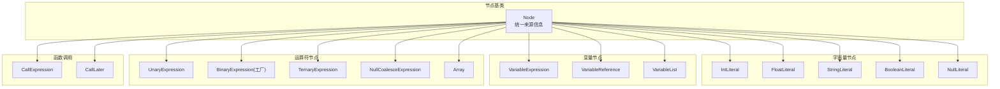
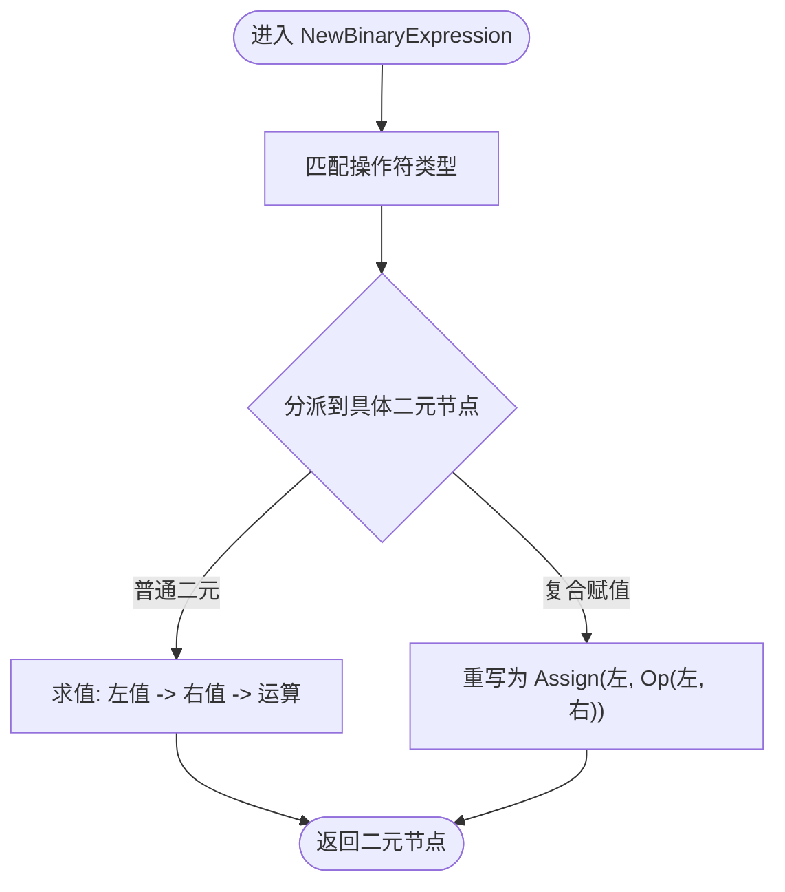
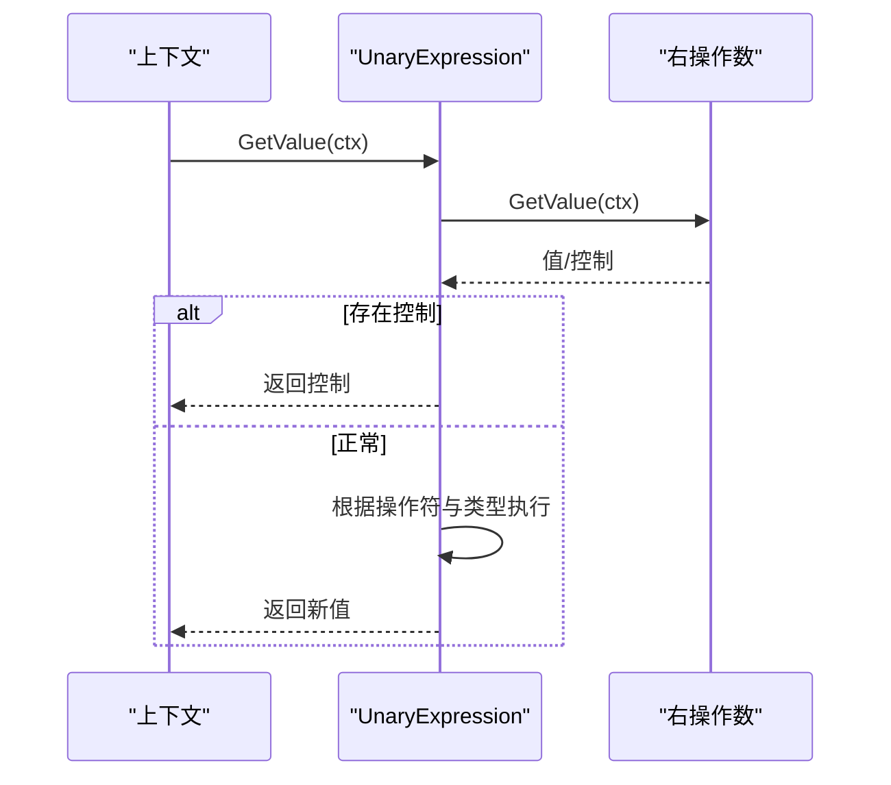
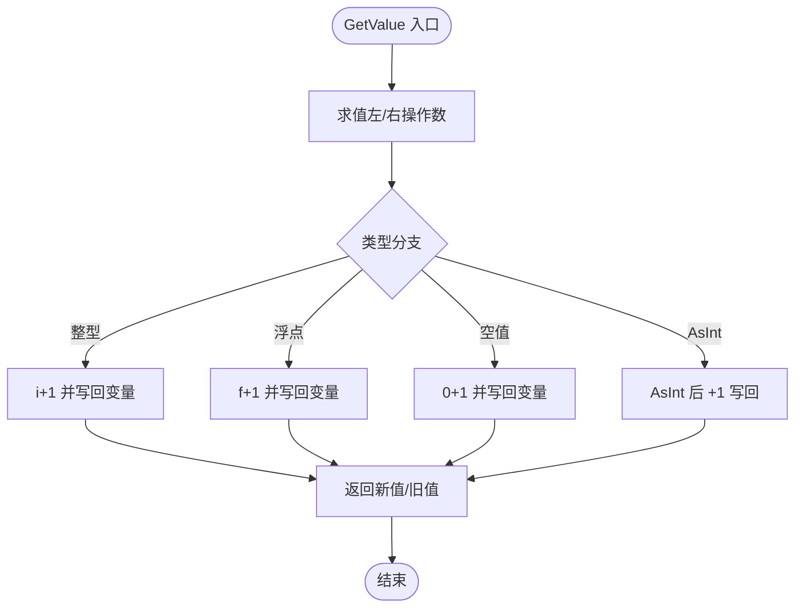
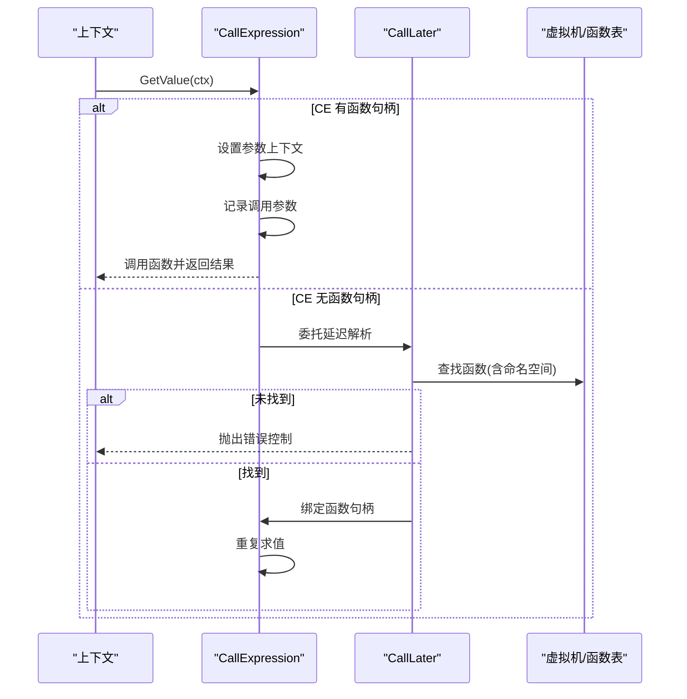
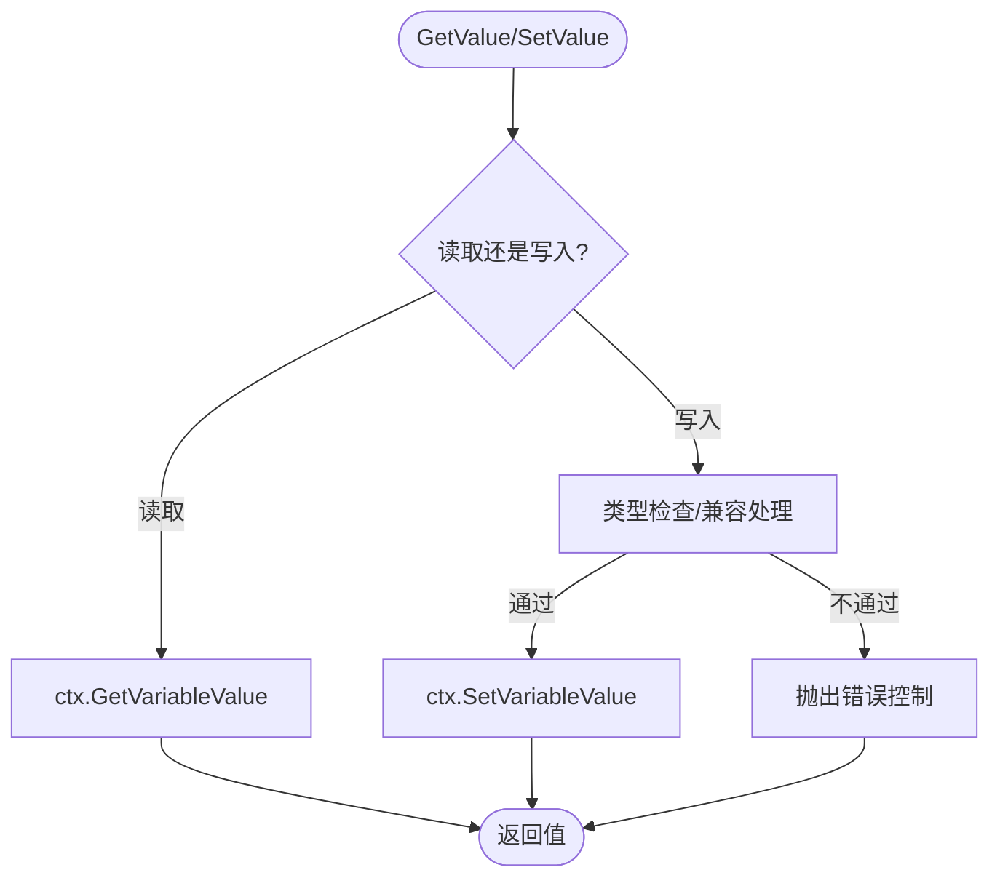
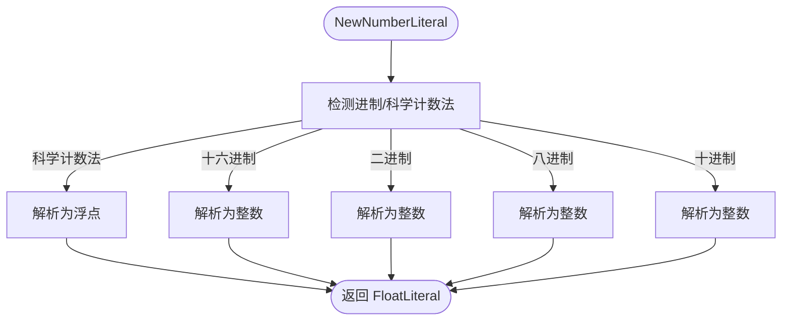
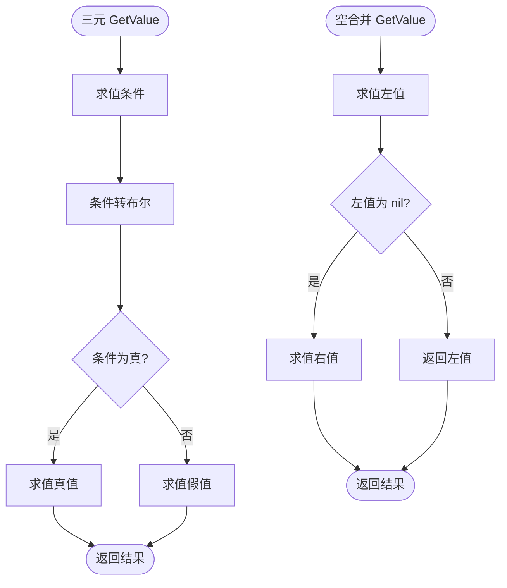
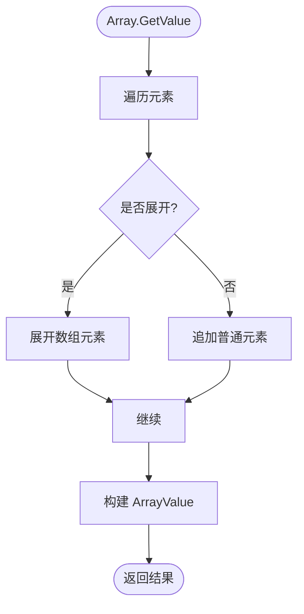

# 表达式节点

<cite>
**本文档引用的文件**
- [node/expression.go](file://node/expression.go)
- [node/binary.go](file://node/binary.go)
- [node/unary_incr.go](file://node/unary_incr.go)
- [node/postfix_incr.go](file://node/postfix_incr.go)
- [node/postfix_decr.go](file://node/postfix_decr.go)
- [node/call.go](file://node/call.go)
- [node/variable.go](file://node/variable.go)
- [node/float_literal.go](file://node/float_literal.go)
- [node/number_literal.go](file://node/number_literal.go)
- [node/string_literal.go](file://node/string_literal.go)
- [node/boolean_literal.go](file://node/boolean_literal.go)
- [node/null_literal.go](file://node/null_literal.go)
- [node/ternary.go](file://node/ternary.go)
- [node/null_coalesce.go](file://node/null_coalesce.go)
- [node/array.go](file://node/array.go)
- [node/node.go](file://node/node.go)
</cite>

## 目录
1. [简介](#简介)
2. [项目结构](#项目结构)
3. [核心组件](#核心组件)
4. [架构总览](#架构总览)
5. [详细组件分析](#详细组件分析)
6. [依赖分析](#依赖分析)
7. [性能考虑](#性能考虑)
8. [故障排查指南](#故障排查指南)
9. [结论](#结论)

## 简介
本文件系统性梳理表达式节点体系，覆盖二元运算符、一元运算符、函数调用、变量与字面量等核心表达式节点的实现与使用方式。重点说明：
- 各类表达式的语法结构与数据模型
- 操作数处理流程与求值机制
- 运算优先级与结合性的处理策略
- 类型推导与兼容性处理
- 表达式节点的创建、遍历与优化思路
- 性能与内存管理的最佳实践

## 项目结构
表达式节点位于 node 包中，围绕统一的 GetValue 接口与上下文驱动的求值模型组织。基础节点抽象由通用 Node 结构承载，具体表达式节点通过组合该结构实现各自的 GetValue 行为。

图表来源
- [node/node.go:1-99](file://node/node.go#L1-L99)
- [node/number_literal.go:1-129](file://node/number_literal.go#L1-L129)
- [node/float_literal.go:1-34](file://node/float_literal.go#L1-L34)
- [node/string_literal.go:1-155](file://node/string_literal.go#L1-L155)
- [node/boolean_literal.go:1-23](file://node/boolean_literal.go#L1-L23)
- [node/null_literal.go:1-21](file://node/null_literal.go#L1-L21)
- [node/variable.go:1-189](file://node/variable.go#L1-L189)
- [node/expression.go:1-57](file://node/expression.go#L1-L57)
- [node/binary.go:1-96](file://node/binary.go#L1-L96)
- [node/ternary.go:1-73](file://node/ternary.go#L1-L73)
- [node/null_coalesce.go:1-55](file://node/null_coalesce.go#L1-L55)
- [node/array.go:1-48](file://node/array.go#L1-L48)
- [node/call.go:1-110](file://node/call.go#L1-L110)

章节来源
- [node/node.go:1-99](file://node/node.go#L1-L99)

## 核心组件
- 统一节点基类：提供来源定位与可扩展接口承载能力
- 字面量节点：整数、浮点、字符串、布尔、NULL 等常量表达式
- 变量节点：变量读写、变量引用、多变量解包
- 运算符节点：一元、二元、三元、空合并、数组构造
- 函数调用节点：即时调用与延迟解析调用

章节来源
- [node/node.go:1-99](file://node/node.go#L1-L99)
- [node/number_literal.go:1-129](file://node/number_literal.go#L1-L129)
- [node/float_literal.go:1-34](file://node/float_literal.go#L1-L34)
- [node/string_literal.go:1-155](file://node/string_literal.go#L1-L155)
- [node/boolean_literal.go:1-23](file://node/boolean_literal.go#L1-L23)
- [node/null_literal.go:1-21](file://node/null_literal.go#L1-L21)
- [node/variable.go:1-189](file://node/variable.go#L1-L189)
- [node/expression.go:1-57](file://node/expression.go#L1-L57)
- [node/binary.go:1-96](file://node/binary.go#L1-L96)
- [node/ternary.go:1-73](file://node/ternary.go#L1-L73)
- [node/null_coalesce.go:1-55](file://node/null_coalesce.go#L1-L55)
- [node/array.go:1-48](file://node/array.go#L1-L48)
- [node/call.go:1-110](file://node/call.go#L1-L110)

## 架构总览
表达式节点遵循“统一 GetValue 求值接口 + 上下文驱动”的设计范式。所有节点均实现 data.GetValue 接口，GetValue 在运行期接收上下文，按需递归求值子节点，并在必要时抛出控制流或错误控制对象。

```mermaid
classDiagram
class Node {
+from : data.From
+GetFrom() data.From
}
class GetValue {
<<interface>>
+GetValue(ctx) (data.GetValue, data.Control)
}
class IntLiteral
class FloatLiteral
class StringLiteral
class BooleanLiteral
class NullLiteral
class VariableExpression
class VariableReference
class VariableList
class UnaryExpression
class BinaryExpression
class TernaryExpression
class NullCoalesceExpression
class Array
class CallExpression
class CallLater
Node <|-- IntLiteral
Node <|-- FloatLiteral
Node <|-- StringLiteral
Node <|-- BooleanLiteral
Node <|-- NullLiteral
Node <|-- VariableExpression
Node <|-- VariableReference
Node <|-- VariableList
Node <|-- UnaryExpression
Node <|-- TernaryExpression
Node <|-- NullCoalesceExpression
Node <|-- Array
Node <|-- CallExpression
Node <|-- CallLater
GetValue <|.. IntLiteral
GetValue <|.. FloatLiteral
GetValue <|.. StringLiteral
GetValue <|.. BooleanLiteral
GetValue <|.. NullLiteral
GetValue <|.. VariableExpression
GetValue <|.. VariableReference
GetValue <|.. VariableList
GetValue <|.. UnaryExpression
GetValue <|.. TernaryExpression
GetValue <|.. NullCoalesceExpression
GetValue <|.. Array
GetValue <|.. CallExpression
GetValue <|.. CallLater
```

图表来源
- [node/node.go:1-99](file://node/node.go#L1-L99)
- [node/number_literal.go:1-129](file://node/number_literal.go#L1-L129)
- [node/float_literal.go:1-34](file://node/float_literal.go#L1-L34)
- [node/string_literal.go:1-155](file://node/string_literal.go#L1-L155)
- [node/boolean_literal.go:1-23](file://node/boolean_literal.go#L1-L23)
- [node/null_literal.go:1-21](file://node/null_literal.go#L1-L21)
- [node/variable.go:1-189](file://node/variable.go#L1-L189)
- [node/expression.go:1-57](file://node/expression.go#L1-L57)
- [node/binary.go:1-96](file://node/binary.go#L1-L96)
- [node/ternary.go:1-73](file://node/ternary.go#L1-L73)
- [node/null_coalesce.go:1-55](file://node/null_coalesce.go#L1-L55)
- [node/array.go:1-48](file://node/array.go#L1-L48)
- [node/call.go:1-110](file://node/call.go#L1-L110)

## 详细组件分析

### 二元运算符节点
- 工厂模式：通过 NewBinaryExpression 根据操作符类型分派到具体二元节点（加减乘除、比较、逻辑、位运算、复合赋值等）
- 复合赋值：如 +=、-=、*=、/=、%=、.=、<<=、>>=、??= 等，内部以“赋值=原表达式”形式重写，确保语义正确
- 求值流程：先求左值，再求右值；根据操作符类型与类型约束执行相应运算，必要时抛出错误控制

图表来源
- [node/binary.go:13-95](file://node/binary.go#L13-L95)

章节来源
- [node/binary.go:1-96](file://node/binary.go#L1-L96)

### 一元运算符节点
- 支持：负号、逻辑非、按位非
- 求值策略：先求右值，再按类型约束执行对应运算；对不可转换类型抛出错误控制

图表来源
- [node/expression.go:21-56](file://node/expression.go#L21-L56)

章节来源
- [node/expression.go:1-57](file://node/expression.go#L1-L57)

### 自增/自减节点
- 前缀/后缀：分别对应前缀与后缀节点，后缀节点需先返回旧值再写回新值
- 类型处理：整型、浮点、空值等按 PHP 规则自增/自减；若目标为变量则写回上下文
- 错误处理：不支持的类型返回错误控制

图表来源
- [node/postfix_incr.go:26-98](file://node/postfix_incr.go#L26-L98)
- [node/unary_incr.go:21-86](file://node/unary_incr.go#L21-L86)
- [node/postfix_decr.go:21-70](file://node/postfix_decr.go#L21-L70)

章节来源
- [node/unary_incr.go:1-87](file://node/unary_incr.go#L1-L87)
- [node/postfix_incr.go:1-99](file://node/postfix_incr.go#L1-L99)
- [node/postfix_decr.go:1-71](file://node/postfix_decr.go#L1-L71)

### 函数调用节点
- 即时调用：CallExpression 直接绑定函数句柄，按参数列表与命名参数规则设置上下文后调用
- 延迟解析：CallLater 在首次求值时解析函数名与命名空间，解析失败则抛出错误控制
- 参数传递：支持位置参数与命名参数混合，必要时回填默认参数或上下文参数

图表来源
- [node/call.go:32-109](file://node/call.go#L32-L109)

章节来源
- [node/call.go:1-110](file://node/call.go#L1-L110)

### 变量节点
- 变量表达式：读取/写入变量，支持类型检查与兼容性处理（空值允许赋值）
- 变量引用：直接按索引读取，适合已知作用域内变量的快速访问
- 多变量解包：将多个变量值打包为数组，或从数组解包赋值

图表来源
- [node/variable.go:41-189](file://node/variable.go#L41-L189)

章节来源
- [node/variable.go:1-189](file://node/variable.go#L1-L189)

### 字面量节点
- 数字字面量：整型与浮点型字面量，支持多种进制与科学计数法
- 字符串字面量：支持单/双引号、heredoc/nowdoc、转义序列解析
- 布尔与 NULL 字面量：直接返回对应值

图表来源
- [node/number_literal.go:36-128](file://node/number_literal.go#L36-L128)
- [node/float_literal.go:13-33](file://node/float_literal.go#L13-L33)
- [node/string_literal.go:103-154](file://node/string_literal.go#L103-L154)
- [node/boolean_literal.go:11-22](file://node/boolean_literal.go#L11-L22)
- [node/null_literal.go:10-20](file://node/null_literal.go#L10-L20)

章节来源
- [node/number_literal.go:1-129](file://node/number_literal.go#L1-L129)
- [node/float_literal.go:1-34](file://node/float_literal.go#L1-L34)
- [node/string_literal.go:1-155](file://node/string_literal.go#L1-L155)
- [node/boolean_literal.go:1-23](file://node/boolean_literal.go#L1-L23)
- [node/null_literal.go:1-21](file://node/null_literal.go#L1-L21)

### 三元运算符与空合并运算符
- 三元运算符：先将条件值转换为布尔，再按条件选择真/假分支求值
- 空合并运算符：若左值为 nil 或特定未定义索引错误，则返回右值，否则返回左值

图表来源
- [node/ternary.go:25-67](file://node/ternary.go#L25-L67)
- [node/null_coalesce.go:23-49](file://node/null_coalesce.go#L23-L49)

章节来源
- [node/ternary.go:1-73](file://node/ternary.go#L1-L73)
- [node/null_coalesce.go:1-55](file://node/null_coalesce.go#L1-L55)

### 数组构造节点
- 支持普通元素与展开元素（ArraySpread）混合构造
- 展开元素必须为数组，否则抛出错误控制

图表来源
- [node/array.go:19-47](file://node/array.go#L19-L47)

章节来源
- [node/array.go:1-48](file://node/array.go#L1-L48)

## 依赖分析
- 节点间依赖：所有表达式节点组合 Node 基类，通过 GetValue 接口统一求值入口
- 数据层依赖：表达式节点依赖 data 包中的值类型、上下文、控制对象与类型系统
- 语法/词法依赖：节点创建通常携带 data.From 信息，便于错误定位与堆栈追踪

图表来源
- [node/node.go:1-99](file://node/node.go#L1-L99)
- [node/expression.go:3-9](file://node/expression.go#L3-L9)
- [node/binary.go:3-7](file://node/binary.go#L3-L7)

章节来源
- [node/node.go:1-99](file://node/node.go#L1-L99)

## 性能考虑
- 求值路径短路
  - 逻辑与/或：在二元逻辑节点中应尽早短路，避免不必要的右值求值
  - 空合并：左值为 nil 或特定未定义错误时才求右值
- 类型检查与转换
  - 优先使用 AsXxx 接口进行类型转换，减少反射与装箱成本
  - 对整型/浮点型运算尽量保持原生类型，避免频繁装箱
- 变量访问
  - 变量引用（VariableReference）通过索引直接访问，避免名称查找开销
- 字面量
  - 字面量节点直接返回值，避免额外分配；字符串字面量在解析时完成转义，减少运行期开销
- 数组展开
  - 展开操作会复制元素，建议在热点路径中避免过度展开
- 控制流与错误
  - 错误控制对象应尽量携带来源信息，以便快速定位问题

## 故障排查指南
- 未定义函数/命名空间解析失败
  - 现象：延迟调用节点在首次求值时报错
  - 排查：确认函数名、命名空间与注册表一致性
  - 参考路径：[node/call.go:87-109](file://node/call.go#L87-L109)
- 变量类型不匹配
  - 现象：SetValue 抛出类型不一致错误
  - 排查：核对变量声明类型与赋值类型，注意空值的兼容性
  - 参考路径：[node/variable.go:56-68](file://node/variable.go#L56-L68)
- 不支持的自增/自减类型
  - 现象：自增/自减节点返回错误控制
  - 排查：确认目标值类型是否为整型、浮点或可 AsInt
  - 参考路径：[node/postfix_incr.go:97](file://node/postfix_incr.go#L97), [node/unary_incr.go:85](file://node/unary_incr.go#L85)
- 空合并异常分支
  - 现象：左值为未定义索引错误时仍可能触发右值求值
  - 排查：确认错误类型判断逻辑与预期行为一致
  - 参考路径：[node/null_coalesce.go:28-31](file://node/null_coalesce.go#L28-L31)
- 数组展开失败
  - 现象：展开非数组元素导致错误
  - 排查：确保展开元素为数组类型
  - 参考路径：[node/array.go:39](file://node/array.go#L39)

章节来源
- [node/call.go:87-109](file://node/call.go#L87-L109)
- [node/variable.go:56-68](file://node/variable.go#L56-L68)
- [node/postfix_incr.go:97](file://node/postfix_incr.go#L97)
- [node/unary_incr.go:85](file://node/unary_incr.go#L85)
- [node/null_coalesce.go:28-31](file://node/null_coalesce.go#L28-L31)
- [node/array.go:39](file://node/array.go#L39)

## 结论
表达式节点系统以统一的 GetValue 接口为核心，通过工厂与组合模式将各类运算与数据封装为可求值单元。其设计兼顾了 PHP 语义的兼容性与运行时性能，同时提供了清晰的错误与控制流处理路径。在实际使用中，建议：
- 明确操作数的类型与来源，优先使用变量引用与字面量
- 合理利用短路与空合并，减少无效求值
- 在热点路径中避免过度展开与复杂嵌套
- 通过来源信息与错误控制快速定位问题